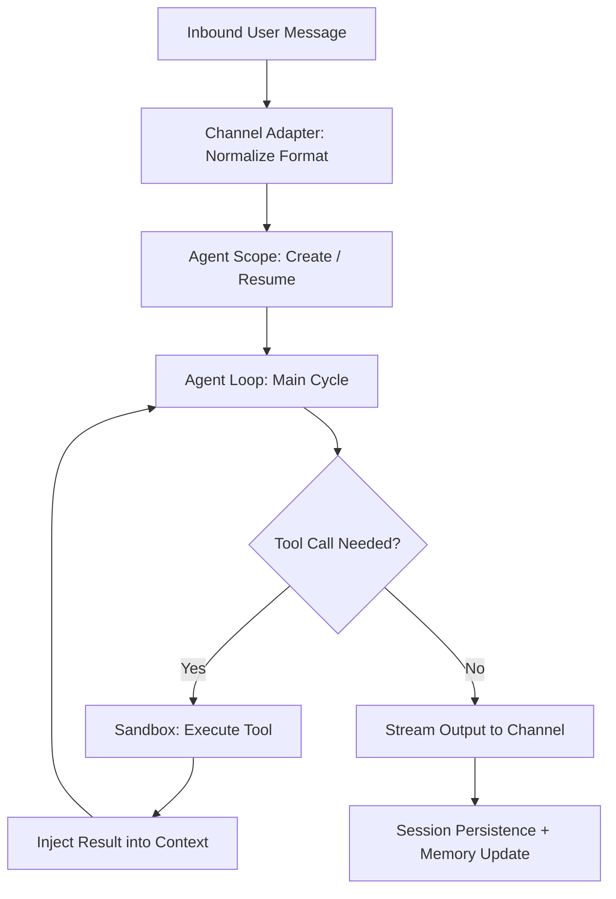

# OpenClaw Internals — Deep Source Code Architecture & Module Implementation Analysis for AI Agents

> **🔬 A Production-Grade Source Code Analysis Knowledge Base for AI Agent Engineers**
>
> From the Agent Loop, memory systems, and tool sandboxing to a custom WebSocket protocol — dissecting how a real, production-deployed multi-channel AI Agent gateway is designed and implemented.

[](https://docusaurus.io)
[](LICENSE)
[](https://openclaw-internals.botx.work/)

🌐 **Immersive Reading (with Mermaid diagrams)**: https://openclaw-internals.botx.work/

**English** | [简体中文](README.zh.md)

---

## 💡 What Value Does This Repo Offer to AI Agent Developers?

If you're building AI Agent systems, you've definitely faced these questions:

- How should the **Agent Loop** be designed to support multi-turn tool calls, streaming output, and context truncation?
- How can one Agent connect to **20+ IM platforms** without writing 20 separate integrations?
- How should **session memory** (short-term + long-term) be persisted and retrieved in production?
- How do you build a **tool execution sandbox** that prevents Agents from running dangerous operations?
- How does a **WebSocket long-connection** guarantee no lost or out-of-order messages in flaky networks?

**OpenClaw Internals is the answer set to these questions.** This is not a usage manual — it's a source-code-level architectural analysis of a **production-grade AI Agent system** by OpenClaw's core development team. Every article directly references source files and key functions, revealing the real engineering decisions behind a live system.

---

## 🧠 Core Source Code Analysis Module Index

### 1. AI Agent Execution Engine

The most critical section for Agent R&D — the complete implementation from Agent Loop to memory to tool invocation.

| Topic | Analysis Document | Key Source Files |
|-------|-------------------|-----------------|
| **Agent Loop & Lifecycle** | `AI代理平台/代理架构设计.md` | `src/agents/agent-scope.ts` |
| **Chain-of-Thought Engine** | `AI代理平台/思考过程引擎.md` | `src/agents/` |
| **Session & Context Management** | `AI代理平台/会话管理系统.md` | `src/agents/context.ts`, `src/agents/session-dirs.ts` |
| **Memory System (Short + Long Term)** | `AI代理平台/记忆管理系统.md` | `src/memory/` |
| **Tool System Architecture & Sandbox** | `AI代理平台/工具系统架构/` | `src/agents/tools/`, `src/agents/sandbox/` |
| **Security Policies & Permissions** | `AI代理平台/安全策略与权限控制.md` | `src/agents/tool-policy.ts` |
| **Multi-Model Hot Switching** | `AI代理平台/AI模型提供商集成/` | `src/agents/models-config.ts` |



### 2. Gateway System & Custom Communication Protocol

The "nervous system" of the Agent infrastructure — a real-time WebSocket control plane.

| Topic | Analysis Document | Key Source Files |
|-------|-------------------|-----------------|
| **Gateway Architecture & Boot Flow** | `网关系统/网关架构设计.md` | `src/gateway/server.impl.ts`, `src/gateway/boot.ts` |
| **Custom WebSocket Protocol v3** | `网关系统/WebSocket协议实现.md` | `src/gateway/protocol/` |
| **Session State Machine** | `网关系统/会话状态管理.md` | `src/gateway/server-ws-runtime.ts` |
| **Authentication & Pairing Security** | `网关系统/认证与安全.md` | `src/gateway/auth.ts`, `src/pairing/` |

**Protocol Highlights**:
- Custom Sequence (Seq) numbering & Gap reporting — guaranteeing message ordering in weak networks.
- Nonce + Signature-based handshake challenge mechanism.
- TypeBox + AJV dual Schema validation at both compile-time and runtime.

### 3. Multi-Channel Adapter System

How a **single plugin sandbox model** unifies access to WhatsApp, Telegram, Discord, Slack, and 20+ more platforms.

| Topic | Analysis Document | Key Source Files |
|-------|-------------------|-----------------|
| **Adapter Architecture & Plugin Model** | `通道系统/通道适配器架构.md` | `src/channels/`, `channel-adapters.ts` |
| **Message Routing & Processing** | `通道系统/消息路由和处理.md` | `src/channels/dock.ts` |
| **Fault Tolerance: Exponential Backoff + Jitter** | `通道系统/故障排除和监控.md` | `src/channels/` |

### 4. More Deep-Dive Modules

| Module | Documentation dir | Description |
|--------|------------------|-------------|
| **Plugin SDK** | `插件系统/` | Plugin manifest, lifecycle, RPC registration |
| **Skills Platform** | `工具和技能/` | Skill development, SKILL.md spec, skill marketplace |
| **Cross-Platform Nodes** | `跨平台应用/` | macOS/iOS/Android node Canvas, voice, camera capabilities |
| **Automation Engine** | `自动化和集成/` | Cron scheduling, Webhooks, event hooks |
| **CLI Command Reference** | `CLI命令参考/` | Gateway management, channel config, agent debugging |
| **REST / WS API Reference** | `API参考/` | Full HTTP endpoint and WebSocket event listings |

---

## 📂 Repository Structure

```text
OpenClaw-Internals/
├── repowiki/
│   ├── zh/content/           # 🧠 Chinese source analysis (primary content)
│   │   ├── AI代理平台/       #    Agent Loop, memory, tools, CoT engine
│   │   ├── 网关系统/         #    WebSocket protocol, state machines, auth
│   │   ├── 通道系统/         #    20+ IM platform adapter architecture
│   │   ├── 插件系统/         #    Plugin SDK & extension development
│   │   ├── 工具和技能/       #    Skills platform & tool sandbox
│   │   ├── 跨平台应用/       #    macOS/iOS/Android nodes
│   │   ├── 自动化和集成/     #    Cron, Webhooks, hooks
│   │   ├── API参考/          #    REST + WebSocket API
│   │   └── ...
│   ├── en/content/           # English versions
│   └── meta/                 # Directory metadata
└── website/                  # Docusaurus docs site container
```

---

## 🛠 How to Read

**Recommended**: Visit the [Live Documentation Site](https://openclaw-internals.botx.work/) for Mermaid diagram rendering, code highlighting, and full-text search.

**Local Preview**:
```bash
git clone https://github.com/BotX-Work/OpenClaw-Insight.git
cd OpenClaw-Insight/website && npm install
node sync-docs.js && npm start
```

---

## 🤝 Who Should Read This

- **AI Agent Engineers**: Want to understand how production Agent Loop, memory, and toolchains are implemented
- **IM/Communication System Developers**: Want to learn how to unify 20+ platforms under one architecture
- **Backend Architects**: Interested in high-performance WebSocket gateways, state machines, and plugin systems
- **Open Source Enthusiasts**: Looking to contribute to or learn from a complete AI Agent infrastructure project

## 📄 License
MIT © BotX.Work Team
