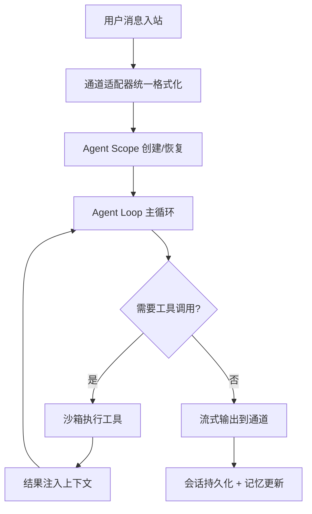

# OpenClaw Internals — AI Agent 源码架构与关键模块实现深度解析

> **🔬 面向 AI Agent 研发工程师的生产级源码分析知识库**
>
> 从 Agent Loop、记忆系统、工具沙箱到自研 WebSocket 协议 —— 拆解一个真正跑在生产环境中的多通道 AI Agent 网关是如何设计与实现的。

[](https://docusaurus.io)
[](LICENSE)
[](https://openclaw-internals.botx.work/)

🌐 **在线沉浸式阅读（含 Mermaid 架构图）**: https://openclaw-internals.botx.work/

[English](README.md) | **简体中文**

---

## 💡 这个仓库对 AI Agent 开发者有什么价值？

如果你正在研发 AI Agent 系统，你一定会遇到这些问题：

- Agent Loop 怎么设计才能支撑多轮工具调用、流式输出与上下文截断？
- 如何让一个 Agent 同时接入 20+ 即时通讯平台而不写 20 套代码？
- 会话记忆（短期 + 长期）在生产环境中到底应该怎么持久化和检索？
- 工具调用的沙箱安全怎么做？如何防止 Agent 执行危险操作？
- WebSocket 长连接在网络抖动环境下如何保障消息不丢、不乱序？

**OpenClaw Internals 就是这些问题的答案集。** 这不是一个使用手册，而是 OpenClaw 核心开发团队对其**生产级 AI Agent 系统**的源码级架构解析。每一篇文章都直接引用源码文件与关键函数，带你看懂一个真实系统背后的工程决策。

---

## 🧠 核心源码解析模块索引

### 1. AI Agent 执行引擎

面向 Agent 研发最核心的部分 —— 从 Agent Loop 到记忆再到工具调用的完整实现。

| 主题 | 源码解析文档 | 关键源码文件 |
|------|-------------|-------------|
| **Agent Loop 与生命周期** | `AI代理平台/代理架构设计.md` | `src/agents/agent-scope.ts` |
| **思考过程引擎 (CoT)** | `AI代理平台/思考过程引擎.md` | `src/agents/` |
| **会话与上下文管理** | `AI代理平台/会话管理系统.md` | `src/agents/context.ts`, `src/agents/session-dirs.ts` |
| **记忆系统（短期+长期）** | `AI代理平台/记忆管理系统.md` | `src/memory/` |
| **工具系统架构与沙箱** | `AI代理平台/工具系统架构/` | `src/agents/tools/`, `src/agents/sandbox/` |
| **安全策略与权限控制** | `AI代理平台/安全策略与权限控制.md` | `src/agents/tool-policy.ts` |
| **多模型热切换** | `AI代理平台/AI模型提供商集成/` | `src/agents/models-config.ts` |



### 2. 网关系统与自研通信协议

Agent 系统的"神经中枢" —— 一个基于 WebSocket 的实时控制面。

| 主题 | 源码解析文档 | 关键源码文件 |
|------|-------------|-------------|
| **网关架构与启动流程** | `网关系统/网关架构设计.md` | `src/gateway/server.impl.ts`, `src/gateway/boot.ts` |
| **自研 WebSocket 协议 v3** | `网关系统/WebSocket协议实现.md` | `src/gateway/protocol/` |
| **会话状态机** | `网关系统/会话状态管理.md` | `src/gateway/server-ws-runtime.ts` |
| **认证与配对安全** | `网关系统/认证与安全.md` | `src/gateway/auth.ts`, `src/pairing/` |

**协议亮点**：
- 自研序列号（Seq）控制与缺口（Gap）上报 —— 在弱网环境下保障消息时序。
- 基于 Nonce + 签名的握手挑战机制。
- TypeBox + AJV 的编译期与运行时双重 Schema 校验。

### 3. 多通道适配器系统

如何用**一套插件沙盒模型**统一接入 WhatsApp、Telegram、Discord、Slack 等 20+ 平台。

| 主题 | 源码解析文档 | 关键源码文件 |
|------|-------------|-------------|
| **适配器架构与插件模型** | `通道系统/通道适配器架构.md` | `src/channels/`, `channel-adapters.ts` |
| **消息路由与处理** | `通道系统/消息路由和处理.md` | `src/channels/dock.ts` |
| **容灾：指数退避 + 抖动** | `通道系统/故障排除和监控.md` | `src/channels/` |

### 4. 更多深度解析

| 模块 | 文档目录 | 说明 |
|------|---------|------|
| **插件 SDK 开发** | `插件系统/` | 插件清单、生命周期、RPC 注册 |
| **技能平台** | `工具和技能/` | 技能开发、SKILL.md 规范、技能商店 |
| **跨平台节点** | `跨平台应用/` | macOS/iOS/Android 节点的 Canvas、语音、相机能力 |
| **自动化引擎** | `自动化和集成/` | Cron 调度、Webhook、事件钩子 |
| **CLI 命令体系** | `CLI命令参考/` | 网关管理、通道配置、代理调试 |
| **REST / WS API** | `API参考/` | HTTP 端点、WebSocket 事件完整列表 |

---

## 📂 仓库结构

```text
OpenClaw-Internals/
├── repowiki/
│   ├── zh/content/           # 🧠 中文源码解析（核心内容）
│   │   ├── AI代理平台/       #    Agent Loop、记忆、工具、思考引擎
│   │   ├── 网关系统/         #    WebSocket 协议、状态机、认证
│   │   ├── 通道系统/         #    20+ IM 平台适配器架构
│   │   ├── 插件系统/         #    Plugin SDK 与扩展开发
│   │   ├── 工具和技能/       #    技能平台与工具沙箱
│   │   ├── 跨平台应用/       #    macOS/iOS/Android 节点
│   │   ├── 自动化和集成/     #    Cron、Webhook、钩子
│   │   ├── API参考/          #    REST + WebSocket API
│   │   └── ...
│   ├── en/content/           # 英文版本
│   └── meta/                 # 目录元数据
└── website/                  # Docusaurus 文档站容器
```

---

## 🛠 如何阅读

**推荐方式**：前往 [在线文档站](https://openclaw-internals.botx.work/)，支持 Mermaid 架构图渲染、代码高亮和全文搜索。

**本地预览**：
```bash
git clone https://github.com/BotX-Work/OpenClaw-Insight.git
cd OpenClaw-Insight/website && npm install
node sync-docs.js && npm start
```

---

## 🤝 适合谁阅读

- **AI Agent 工程师**：想了解生产级 Agent 系统的 Loop、记忆、工具链是怎么实现的
- **IM/通信系统开发者**：想学习如何用统一架构适配 20+ 平台
- **后端架构师**：对高性能 WebSocket 网关、状态机管理、插件系统感兴趣
- **开源爱好者**：想参与或借鉴一个完整的 AI Agent 基础设施项目

## 📄 许可证
MIT © OpenClaw Team
