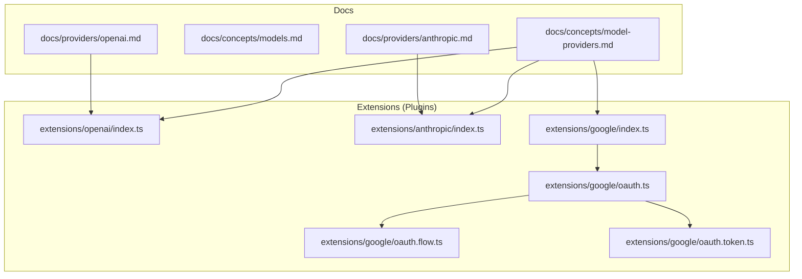
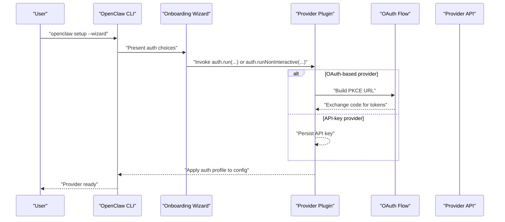
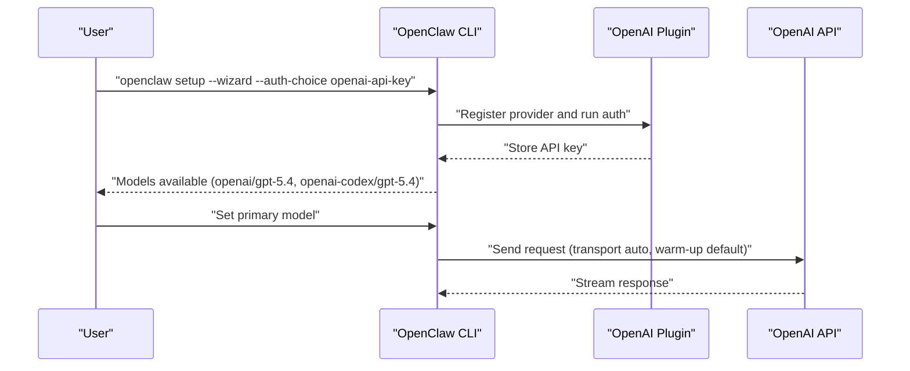
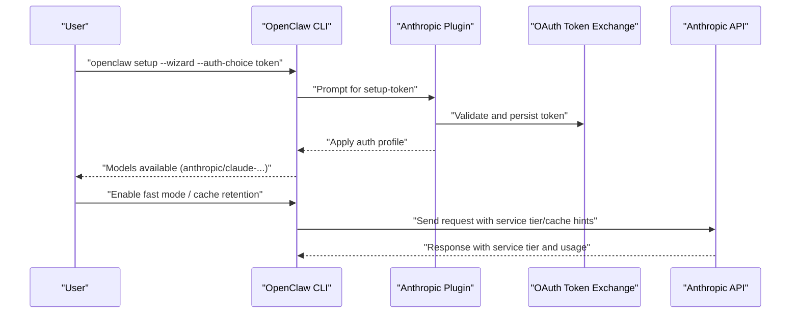
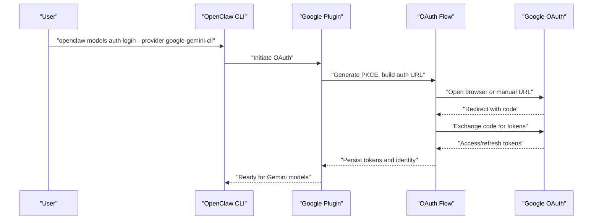
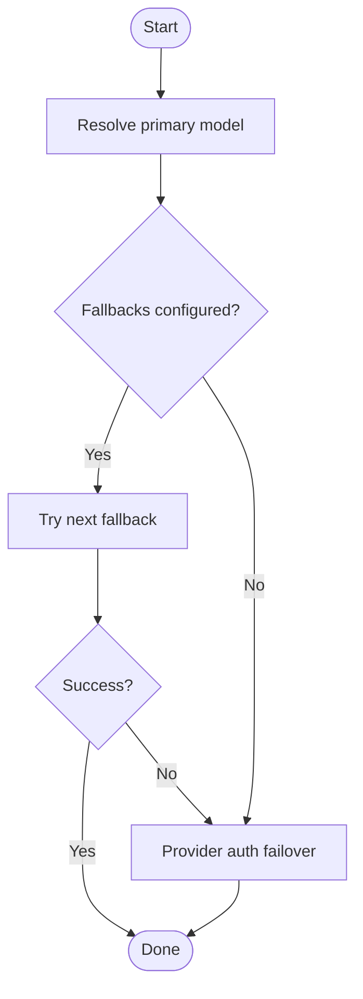
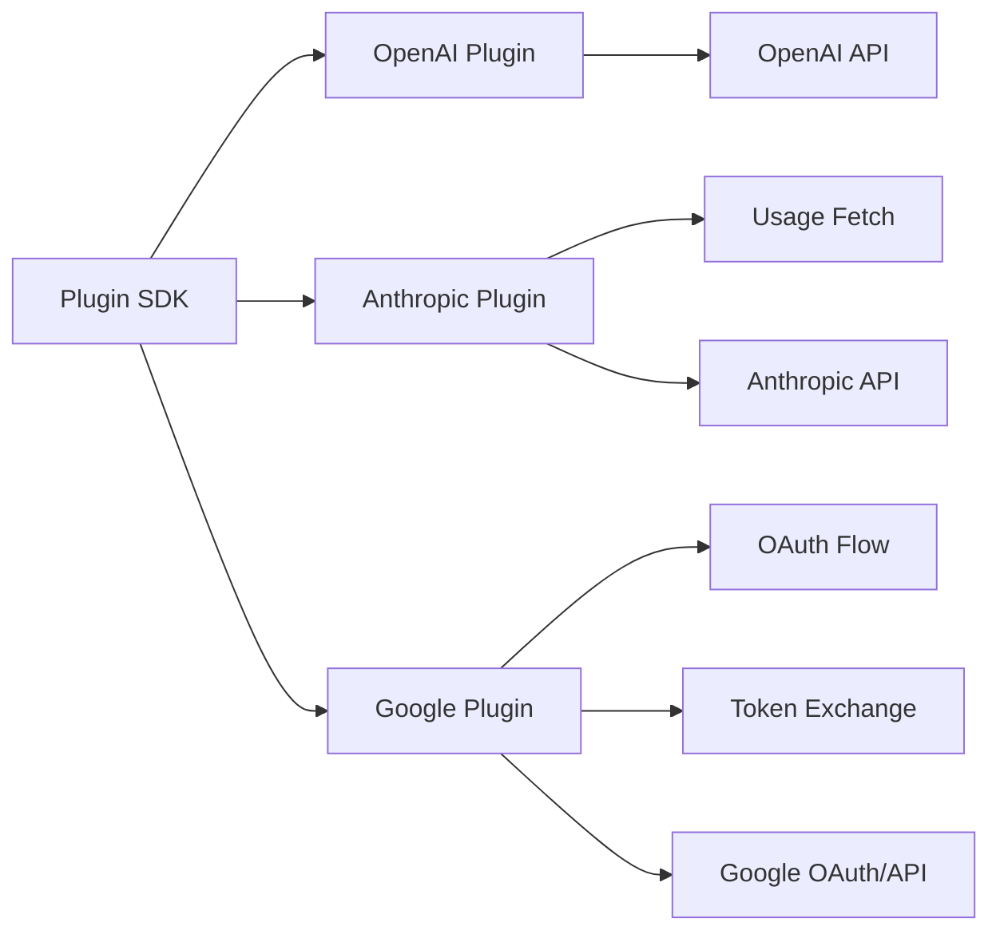

# AI Providers

<cite>
**Referenced Files in This Document**
- [docs/concepts/model-providers.md](file://docs/concepts/model-providers.md)
- [docs/concepts/models.md](file://docs/concepts/models.md)
- [docs/providers/openai.md](file://docs/providers/openai.md)
- [docs/providers/anthropic.md](file://docs/providers/anthropic.md)
- [extensions/openai/index.ts](file://extensions/openai/index.ts)
- [extensions/anthropic/index.ts](file://extensions/anthropic/index.ts)
- [extensions/google/index.ts](file://extensions/google/index.ts)
- [extensions/google/oauth.ts](file://extensions/google/oauth.ts)
- [extensions/google/oauth.flow.ts](file://extensions/google/oauth.flow.ts)
- [extensions/google/oauth.token.ts](file://extensions/google/oauth.token.ts)
</cite>

## Table of Contents
1. [Introduction](#introduction)
2. [Project Structure](#project-structure)
3. [Core Components](#core-components)
4. [Architecture Overview](#architecture-overview)
5. [Detailed Component Analysis](#detailed-component-analysis)
6. [Dependency Analysis](#dependency-analysis)
7. [Performance Considerations](#performance-considerations)
8. [Troubleshooting Guide](#troubleshooting-guide)
9. [Conclusion](#conclusion)

## Introduction
This document explains how OpenClaw integrates with multiple AI model providers and services. It covers provider configuration, authentication methods, model selection, provider-specific features, and operational guidance such as rate limiting, pricing, failover, and troubleshooting. Practical examples focus on OpenAI, Anthropic, and Google, and show how to configure API keys, OAuth, and provider-specific runtime behaviors.

## Project Structure
OpenClaw organizes provider integrations primarily in two places:
- Provider documentation under docs/providers and conceptual guides under docs/concepts
- Provider plugins under extensions/<provider> implementing registration, authentication, and runtime behaviors

**Diagram sources**
- [docs/concepts/model-providers.md](file://docs/concepts/model-providers.md)
- [docs/concepts/models.md](file://docs/concepts/models.md)
- [docs/providers/openai.md](file://docs/providers/openai.md)
- [docs/providers/anthropic.md](file://docs/providers/anthropic.md)
- [extensions/openai/index.ts](file://extensions/openai/index.ts)
- [extensions/anthropic/index.ts](file://extensions/anthropic/index.ts)
- [extensions/google/index.ts](file://extensions/google/index.ts)
- [extensions/google/oauth.ts](file://extensions/google/oauth.ts)
- [extensions/google/oauth.flow.ts](file://extensions/google/oauth.flow.ts)
- [extensions/google/oauth.token.ts](file://extensions/google/oauth.token.ts)

**Section sources**
- [docs/concepts/model-providers.md](file://docs/concepts/model-providers.md)
- [docs/concepts/models.md](file://docs/concepts/models.md)

## Core Components
- Provider plugins encapsulate authentication flows, model catalog integration, runtime behavior, and usage reporting. Examples:
  - OpenAI plugin registers both direct OpenAI and Codex providers
  - Anthropic plugin supports API key and setup-token (subscription) auth
  - Google plugin supports API key and Gemini CLI OAuth
- Provider configuration and model selection are governed by:
  - Provider plugin manifests (registration, env vars, auth choices)
  - Agent configuration (primary model, fallbacks, provider params)
  - CLI commands for setup, listing, and status

Key behaviors documented:
- Provider-owned model resolution and compatibility
- Forward-compatibility for modern model families
- Prompt caching (Anthropic), thinking defaults, fast mode toggles
- OAuth PKCE flow for Google Gemini CLI
- Usage snapshots and quota reporting (Anthropic)

**Section sources**
- [extensions/openai/index.ts](file://extensions/openai/index.ts)
- [extensions/anthropic/index.ts](file://extensions/anthropic/index.ts)
- [extensions/google/index.ts](file://extensions/google/index.ts)
- [docs/concepts/model-providers.md](file://docs/concepts/model-providers.md)

## Architecture Overview
OpenClaw’s provider integration follows a plugin-driven architecture:
- Plugins register providers with OpenClaw
- Providers define:
  - Authentication methods (API key, OAuth, setup-token)
  - Dynamic model resolution and compatibility
  - Runtime parameters (transport, thinking, fast mode)
  - Usage reporting and quotas
- Agents select models from an allowlist and can switch at runtime

**Diagram sources**
- [extensions/anthropic/index.ts](file://extensions/anthropic/index.ts)
- [extensions/google/oauth.ts](file://extensions/google/oauth.ts)
- [extensions/google/oauth.flow.ts](file://extensions/google/oauth.flow.ts)
- [extensions/google/oauth.token.ts](file://extensions/google/oauth.token.ts)

## Detailed Component Analysis

### OpenAI Provider
- Authentication modes:
  - API key (direct platform access)
  - Codex subscription via OAuth (external tool support)
- Model selection and transport:
  - Default transport is auto (WebSocket-first, SSE fallback)
  - WebSocket warm-up enabled by default for Responses API
  - Priority processing via service tier; fast mode toggles latency-friendly defaults
- Provider-specific features:
  - Server-side context compaction for compatible models
  - Suppresses legacy Spark model on direct API path

**Diagram sources**
- [docs/providers/openai.md](file://docs/providers/openai.md)
- [extensions/openai/index.ts](file://extensions/openai/index.ts)

**Section sources**
- [docs/providers/openai.md](file://docs/providers/openai.md)
- [extensions/openai/index.ts](file://extensions/openai/index.ts)

### Anthropic Provider
- Authentication modes:
  - API key (recommended for priority tier and caching)
  - Setup-token (subscription; paste/setup-token flows)
- Provider-specific features:
  - Adaptive thinking defaults for modern models
  - Fast mode maps to service tier injection for direct API
  - Prompt caching retention controls (short/long/none)
  - Usage snapshot retrieval via OAuth token
  - Forward-compatibility for Claude 4.6 model families

**Diagram sources**
- [docs/providers/anthropic.md](file://docs/providers/anthropic.md)
- [extensions/anthropic/index.ts](file://extensions/anthropic/index.ts)

**Section sources**
- [docs/providers/anthropic.md](file://docs/providers/anthropic.md)
- [extensions/anthropic/index.ts](file://extensions/anthropic/index.ts)

### Google Provider (API key and Gemini CLI OAuth)
- Authentication modes:
  - API key for AI Studio
  - Gemini CLI OAuth with PKCE (automatic or manual flow)
- OAuth flow specifics:
  - PKCE challenge generation and verification
  - Local callback server with fallback to manual paste
  - Token exchange and identity resolution
- Provider features:
  - Forward-compatible model resolution
  - Web search provider integration scoped to Gemini credentials

**Diagram sources**
- [extensions/google/index.ts](file://extensions/google/index.ts)
- [extensions/google/oauth.ts](file://extensions/google/oauth.ts)
- [extensions/google/oauth.flow.ts](file://extensions/google/oauth.flow.ts)
- [extensions/google/oauth.token.ts](file://extensions/google/oauth.token.ts)

**Section sources**
- [extensions/google/index.ts](file://extensions/google/index.ts)
- [extensions/google/oauth.ts](file://extensions/google/oauth.ts)
- [extensions/google/oauth.flow.ts](file://extensions/google/oauth.flow.ts)
- [extensions/google/oauth.token.ts](file://extensions/google/oauth.token.ts)

### Model Selection and Failover
- Selection order: primary model, ordered fallbacks, then provider auth failover
- Allowlist behavior: when agents.defaults.models is set, it acts as an allowlist
- Runtime switching: /model commands to list, set, and inspect models and auth status
- Usage scanning: OpenRouter free models with optional probing for tools/images

**Diagram sources**
- [docs/concepts/models.md](file://docs/concepts/models.md)

**Section sources**
- [docs/concepts/models.md](file://docs/concepts/models.md)

## Dependency Analysis
Provider plugins depend on:
- Core plugin SDK for registration and runtime hooks
- OAuth utilities for PKCE and token exchange (Google)
- Provider-specific APIs for usage snapshots (Anthropic)
- Agent configuration for model catalogs and parameters

**Diagram sources**
- [extensions/openai/index.ts](file://extensions/openai/index.ts)
- [extensions/anthropic/index.ts](file://extensions/anthropic/index.ts)
- [extensions/google/index.ts](file://extensions/google/index.ts)
- [extensions/google/oauth.flow.ts](file://extensions/google/oauth.flow.ts)
- [extensions/google/oauth.token.ts](file://extensions/google/oauth.token.ts)

**Section sources**
- [extensions/openai/index.ts](file://extensions/openai/index.ts)
- [extensions/anthropic/index.ts](file://extensions/anthropic/index.ts)
- [extensions/google/index.ts](file://extensions/google/index.ts)

## Performance Considerations
- Transport tuning:
  - Prefer auto transport with WebSocket warm-up for OpenAI Responses to reduce first-turn latency
  - Force SSE or WebSocket when diagnosing connectivity issues
- Fast mode:
  - Enables low-latency defaults (reasoning effort low, verbosity low) and priority tier for direct OpenAI API
- Thinking defaults:
  - Modern Anthropic models default to adaptive thinking; override per-message or per-model
- Prompt caching (Anthropic):
  - Short/long retention balances cost and performance; disable for bursty workloads
- Usage snapshots:
  - Use provider usage endpoints to monitor quotas and adjust model selection proactively

[No sources needed since this section provides general guidance]

## Troubleshooting Guide
Common provider-related issues and resolutions:
- Missing or expired credentials:
  - Use models status to inspect auth profiles and OAuth expiry windows
  - Re-run onboarding or paste tokens for Anthropic setup-token
- OAuth failures:
  - Gemini CLI OAuth: retry with manual mode if local callback fails; verify state and redirect URI
- Rate limiting and quotas:
  - Rotate API keys for providers supporting rotation; OpenClaw retries on rate-limit responses
  - Monitor usage snapshots and adjust model selection or throttle usage
- Model not allowed:
  - Ensure the model is in agents.defaults.models allowlist or use /model list to pick a valid model

**Section sources**
- [docs/concepts/model-providers.md](file://docs/concepts/model-providers.md)
- [docs/providers/anthropic.md](file://docs/providers/anthropic.md)
- [extensions/google/oauth.ts](file://extensions/google/oauth.ts)

## Conclusion
OpenClaw’s provider integration centers on flexible, plugin-driven registration with robust authentication and runtime customization. By leveraging provider-specific features—such as Anthropic’s prompt caching and thinking defaults, OpenAI’s fast mode and server-side compaction, and Google’s Gemini CLI OAuth—you can optimize performance, manage costs, and maintain reliable operations across providers. Use the documented configuration patterns, CLI commands, and troubleshooting steps to configure, switch, and troubleshoot providers effectively.