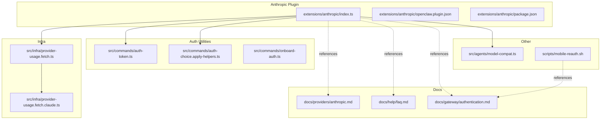
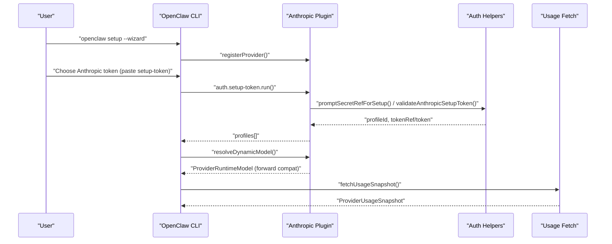
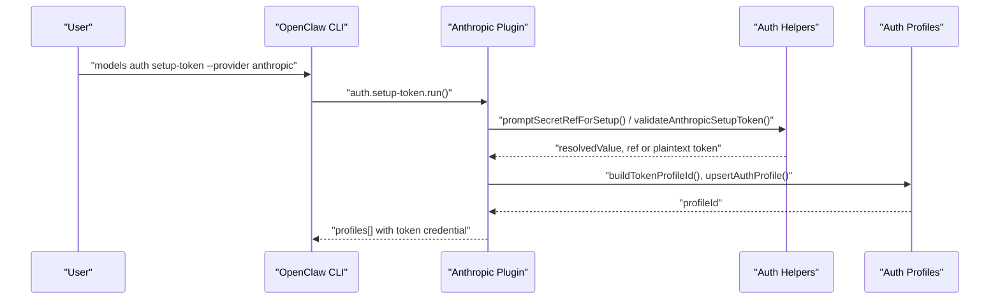
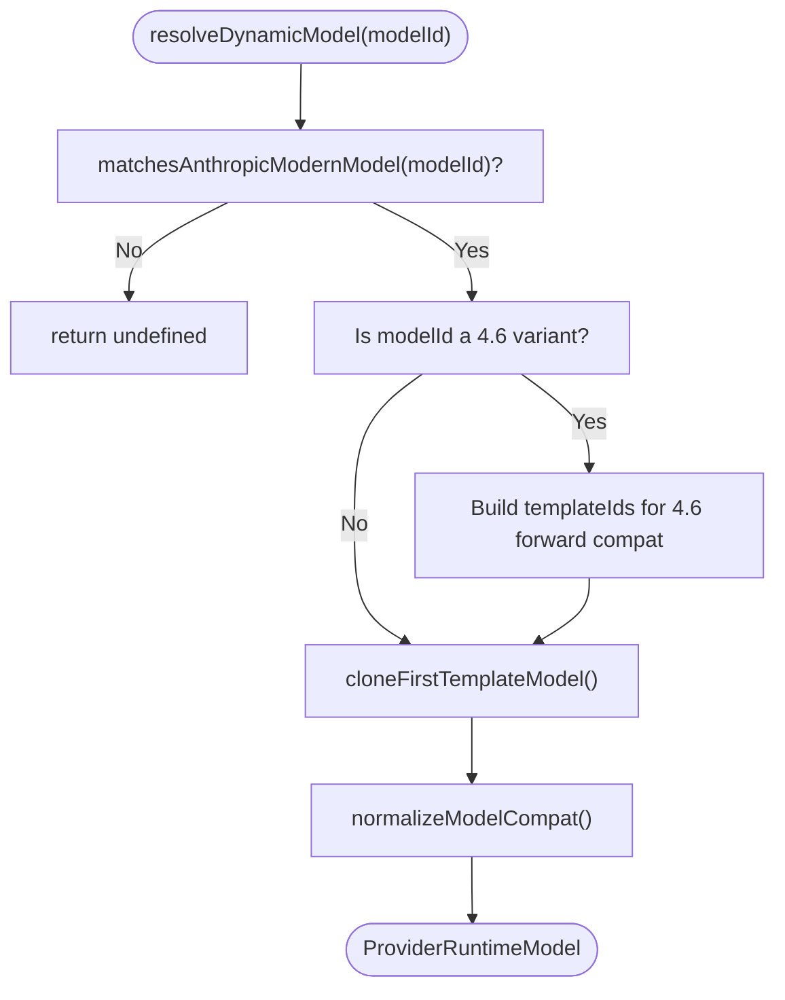
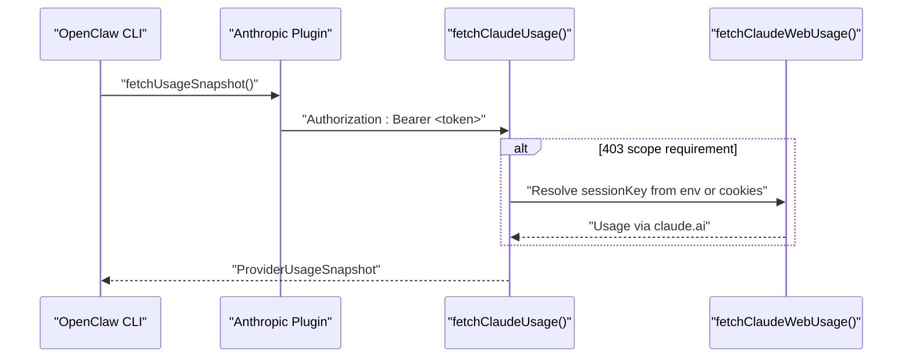
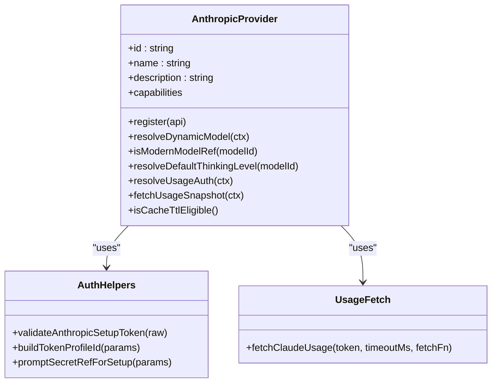
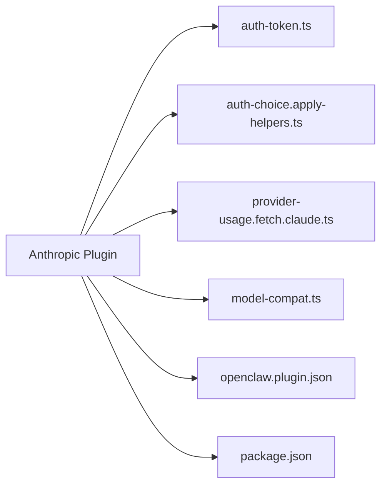

# Anthropic Provider

<cite>
**Referenced Files in This Document**
- [extensions/anthropic/index.ts](file://extensions/anthropic/index.ts)
- [extensions/anthropic/openclaw.plugin.json](file://extensions/anthropic/openclaw.plugin.json)
- [extensions/anthropic/package.json](file://extensions/anthropic/package.json)
- [docs/providers/anthropic.md](file://docs/providers/anthropic.md)
- [src/commands/auth-token.ts](file://src/commands/auth-token.ts)
- [src/commands/auth-choice.apply-helpers.ts](file://src/commands/auth-choice.apply-helpers.ts)
- [src/commands/onboard-auth.ts](file://src/commands/onboard-auth.ts)
- [src/infra/provider-usage.fetch.claude.ts](file://src/infra/provider-usage.fetch.claude.ts)
- [src/infra/provider-usage.fetch.ts](file://src/infra/provider-usage.fetch.ts)
- [src/agents/model-compat.ts](file://src/agents/model-compat.ts)
- [docs/help/faq.md](file://docs/help/faq.md)
- [docs/gateway/authentication.md](file://docs/gateway/authentication.md)
- [scripts/mobile-reauth.sh](file://scripts/mobile-reauth.sh)
</cite>

## Table of Contents
1. [Introduction](#introduction)
2. [Project Structure](#project-structure)
3. [Core Components](#core-components)
4. [Architecture Overview](#architecture-overview)
5. [Detailed Component Analysis](#detailed-component-analysis)
6. [Dependency Analysis](#dependency-analysis)
7. [Performance Considerations](#performance-considerations)
8. [Troubleshooting Guide](#troubleshooting-guide)
9. [Conclusion](#conclusion)
10. [Appendices](#appendices)

## Introduction
This document explains the Anthropic provider integration in OpenClaw. It covers authentication via API keys and Claude setup-token, model configuration and forward compatibility, Claude Code CLI setup, and Anthropic-specific features such as thinking defaults, prompt caching, fast mode, and usage snapshot retrieval. It also includes troubleshooting guidance for common issues, rate-limiting considerations, and cost optimization strategies.

## Project Structure
The Anthropic provider is implemented as a bundled plugin with supporting utilities for authentication, model compatibility normalization, and usage fetching.

**Diagram sources**
- [extensions/anthropic/index.ts:1-319](file://extensions/anthropic/index.ts#L1-L319)
- [extensions/anthropic/openclaw.plugin.json:1-13](file://extensions/anthropic/openclaw.plugin.json#L1-L13)
- [extensions/anthropic/package.json:1-13](file://extensions/anthropic/package.json#L1-L13)
- [src/commands/auth-token.ts:1-39](file://src/commands/auth-token.ts#L1-L39)
- [src/commands/auth-choice.apply-helpers.ts:1-538](file://src/commands/auth-choice.apply-helpers.ts#L1-L538)
- [src/commands/onboard-auth.ts:1-134](file://src/commands/onboard-auth.ts#L1-L134)
- [src/infra/provider-usage.fetch.ts:1-6](file://src/infra/provider-usage.fetch.ts#L1-L6)
- [src/infra/provider-usage.fetch.claude.ts:1-178](file://src/infra/provider-usage.fetch.claude.ts#L1-L178)
- [docs/providers/anthropic.md:1-260](file://docs/providers/anthropic.md#L1-L260)
- [docs/help/faq.md:719-740](file://docs/help/faq.md#L719-L740)
- [docs/gateway/authentication.md:171-180](file://docs/gateway/authentication.md#L171-L180)
- [scripts/mobile-reauth.sh:45-84](file://scripts/mobile-reauth.sh#L45-L84)

**Section sources**
- [extensions/anthropic/index.ts:261-316](file://extensions/anthropic/index.ts#L261-L316)
- [extensions/anthropic/openclaw.plugin.json:1-13](file://extensions/anthropic/openclaw.plugin.json#L1-L13)
- [extensions/anthropic/package.json:1-13](file://extensions/anthropic/package.json#L1-L13)

## Core Components
- Anthropic provider plugin registration: registers authentication methods, dynamic model resolution, capabilities, and usage integration.
- Authentication helpers: validate setup-token format, build profile identifiers, and prompt for secret inputs.
- Usage fetching: retrieves Anthropic usage snapshots via OAuth bearer token or falls back to web session key when scopes differ.
- Model compatibility: normalizes Anthropic base URLs and model compatibility flags.

Key responsibilities:
- Provider registration and capabilities
- Auth flows for setup-token and API key
- Forward-compatible model resolution
- Usage reporting and snapshot building
- Model compatibility normalization

**Section sources**
- [extensions/anthropic/index.ts:261-316](file://extensions/anthropic/index.ts#L261-L316)
- [src/commands/auth-token.ts:20-39](file://src/commands/auth-token.ts#L20-L39)
- [src/infra/provider-usage.fetch.claude.ts:115-178](file://src/infra/provider-usage.fetch.claude.ts#L115-L178)
- [src/agents/model-compat.ts:39-95](file://src/agents/model-compat.ts#L39-L95)

## Architecture Overview
The Anthropic provider integrates with OpenClaw’s plugin system and authentication framework. It exposes:
- An authentication method for setup-token (via Claude Code CLI)
- Dynamic model resolution with forward compatibility
- Capability flags for thinking hints and modern model detection
- Usage snapshot retrieval using OAuth or web fallback

**Diagram sources**
- [extensions/anthropic/index.ts:266-316](file://extensions/anthropic/index.ts#L266-L316)
- [src/commands/auth-choice.apply-helpers.ts:96-277](file://src/commands/auth-choice.apply-helpers.ts#L96-L277)
- [src/commands/auth-token.ts:26-39](file://src/commands/auth-token.ts#L26-L39)
- [src/infra/provider-usage.fetch.claude.ts:115-178](file://src/infra/provider-usage.fetch.claude.ts#L115-L178)

## Detailed Component Analysis

### Authentication and Setup-Token Flow
- The plugin defines an authentication method labeled “setup-token (claude)” that prompts the user to run the Claude Code CLI command and paste the resulting token.
- The token is validated for format and minimum length before being stored as an auth profile.
- The plugin supports both interactive and non-interactive modes for setup-token provisioning.

**Diagram sources**
- [extensions/anthropic/index.ts:123-192](file://extensions/anthropic/index.ts#L123-L192)
- [src/commands/auth-token.ts:20-39](file://src/commands/auth-token.ts#L20-L39)
- [src/commands/auth-choice.apply-helpers.ts:96-277](file://src/commands/auth-choice.apply-helpers.ts#L96-L277)

**Section sources**
- [extensions/anthropic/index.ts:123-192](file://extensions/anthropic/index.ts#L123-L192)
- [src/commands/auth-token.ts:26-39](file://src/commands/auth-token.ts#L26-L39)
- [src/commands/auth-choice.apply-helpers.ts:96-277](file://src/commands/auth-choice.apply-helpers.ts#L96-L277)

### Model Resolution and Forward Compatibility
- The provider resolves modern model IDs (e.g., 4.6 variants) to appropriate templates and clones them with the requested model ID.
- It detects modern model prefixes and sets adaptive thinking defaults for specific models.

**Diagram sources**
- [extensions/anthropic/index.ts:95-121](file://extensions/anthropic/index.ts#L95-L121)
- [extensions/anthropic/index.ts:37-58](file://extensions/anthropic/index.ts#L37-L58)
- [src/agents/model-compat.ts:39-95](file://src/agents/model-compat.ts#L39-L95)

**Section sources**
- [extensions/anthropic/index.ts:95-121](file://extensions/anthropic/index.ts#L95-L121)
- [extensions/anthropic/index.ts:37-58](file://extensions/anthropic/index.ts#L37-L58)
- [src/agents/model-compat.ts:39-95](file://src/agents/model-compat.ts#L39-L95)

### Usage Snapshot Retrieval
- The provider fetches usage snapshots using an OAuth bearer token against the Anthropic usage endpoint.
- If the token lacks the required scope, it attempts a fallback using a Claude web session key.

**Diagram sources**
- [extensions/anthropic/index.ts:311-312](file://extensions/anthropic/index.ts#L311-L312)
- [src/infra/provider-usage.fetch.claude.ts:115-178](file://src/infra/provider-usage.fetch.claude.ts#L115-L178)

**Section sources**
- [src/infra/provider-usage.fetch.claude.ts:115-178](file://src/infra/provider-usage.fetch.claude.ts#L115-L178)

### Supported Models, Reasoning, and Features
- The provider declares capabilities for the Anthropic family and drops thinking block hints for models whose names include “claude.”
- Modern model detection enables adaptive thinking defaults for specific 4.6 variants.
- Documentation outlines prompt caching, fast mode, and 1M context window beta flags.

**Diagram sources**
- [extensions/anthropic/index.ts:261-316](file://extensions/anthropic/index.ts#L261-L316)
- [src/commands/auth-token.ts:20-39](file://src/commands/auth-token.ts#L20-L39)
- [src/infra/provider-usage.fetch.claude.ts:115-178](file://src/infra/provider-usage.fetch.claude.ts#L115-L178)

**Section sources**
- [extensions/anthropic/index.ts:297-314](file://extensions/anthropic/index.ts#L297-L314)
- [docs/providers/anthropic.md:38-178](file://docs/providers/anthropic.md#L38-L178)

## Dependency Analysis
- The plugin depends on:
  - Authentication helpers for token validation and secret reference resolution
  - Usage fetch utilities for retrieving usage snapshots
  - Model compatibility utilities for Anthropic base URL normalization
- The plugin’s configuration schema is empty, and it declares provider-specific environment variables.

**Diagram sources**
- [extensions/anthropic/index.ts:1-21](file://extensions/anthropic/index.ts#L1-L21)
- [extensions/anthropic/openclaw.plugin.json:1-13](file://extensions/anthropic/openclaw.plugin.json#L1-L13)
- [extensions/anthropic/package.json:1-13](file://extensions/anthropic/package.json#L1-L13)

**Section sources**
- [extensions/anthropic/index.ts:1-21](file://extensions/anthropic/index.ts#L1-L21)
- [extensions/anthropic/openclaw.plugin.json:4-6](file://extensions/anthropic/openclaw.plugin.json#L4-L6)

## Performance Considerations
- Fast mode: OpenClaw’s shared toggle maps to Anthropic service tiers for direct API-key traffic. Behavior differs when using setup-token/OAuth.
- Prompt caching: Anthropic’s prompt caching feature is supported for API-key auth; defaults and overrides are configurable per model and agent.
- 1M context window: Beta-gated; enabled via model params and mapped to Anthropic beta headers when applicable.

[No sources needed since this section provides general guidance]

## Troubleshooting Guide
Common issues and resolutions:
- 401 errors or sudden token invalidation: regenerate the setup-token with the Claude Code CLI and paste it on the gateway host; if the CLI login is on a different machine, use the paste-token command on the gateway host.
- No API key found for provider “anthropic”: ensure auth is configured per agent; re-run onboarding or paste the token on the gateway host and verify with the models status command.
- No credentials found for profile: check which auth profile is active and re-run onboarding or paste the token for that profile.
- No available auth profile: inspect unusable profiles and add another profile or wait for cooldown.

Rate limiting and usage:
- Usage snapshots are retrieved via OAuth bearer token; if scopes are insufficient, a web session key fallback is attempted.

Cost optimization:
- Prefer API-key auth for direct Anthropic API traffic to leverage fast mode and cache retention controls.
- Configure cacheRetention per model and agent to balance cost and performance.

**Section sources**
- [docs/providers/anthropic.md:234-259](file://docs/providers/anthropic.md#L234-L259)
- [src/infra/provider-usage.fetch.claude.ts:149-167](file://src/infra/provider-usage.fetch.claude.ts#L149-L167)
- [docs/help/faq.md:719-740](file://docs/help/faq.md#L719-L740)
- [docs/gateway/authentication.md:171-180](file://docs/gateway/authentication.md#L171-L180)

## Conclusion
The Anthropic provider in OpenClaw offers robust authentication via setup-token and API key, forward-compatible model resolution, and practical features like prompt caching and fast mode. By leveraging usage snapshots and following the troubleshooting steps, teams can maintain reliable Claude integrations while optimizing for cost and performance.

[No sources needed since this section summarizes without analyzing specific files]

## Appendices

### A. Claude Code CLI Setup and Credential Handling
- Generate a setup-token using the Claude Code CLI on any machine.
- Paste the token during setup or on the gateway host using the provided commands.
- The plugin validates the token format and stores it as an auth profile.

**Section sources**
- [docs/providers/anthropic.md:189-233](file://docs/providers/anthropic.md#L189-L233)
- [docs/help/faq.md:724-736](file://docs/help/faq.md#L724-L736)
- [docs/gateway/authentication.md:176-180](file://docs/gateway/authentication.md#L176-L180)
- [scripts/mobile-reauth.sh:60-84](file://scripts/mobile-reauth.sh#L60-L84)

### B. Model Selection and Configuration Examples
- Use provider/model references in agent defaults and override per-agent settings.
- Enable adaptive thinking defaults for modern 4.6 models.
- Configure prompt caching and fast mode via model params.

**Section sources**
- [docs/providers/anthropic.md:38-178](file://docs/providers/anthropic.md#L38-L178)

### C. Environment Variables and Plugin Metadata
- Provider environment variables include OAuth token and API key placeholders.
- Plugin metadata declares the provider and configuration schema.

**Section sources**
- [extensions/anthropic/openclaw.plugin.json:4-6](file://extensions/anthropic/openclaw.plugin.json#L4-L6)
- [extensions/anthropic/package.json:7-12](file://extensions/anthropic/package.json#L7-L12)