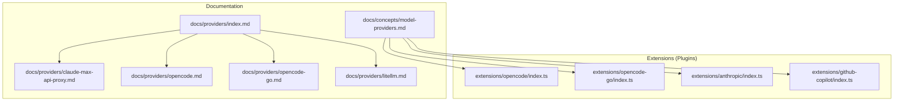
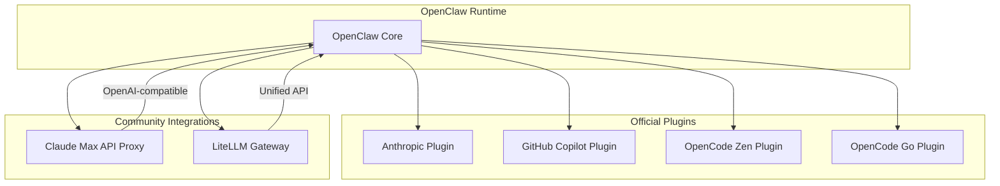
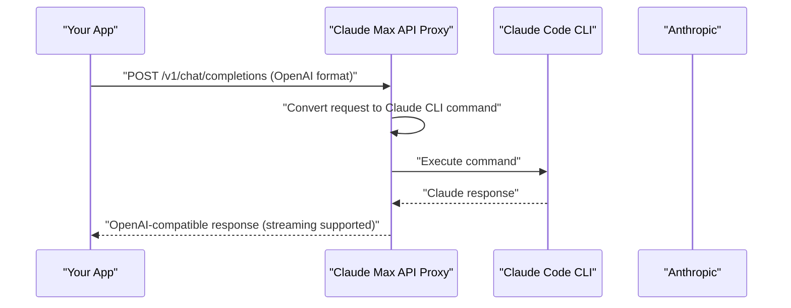
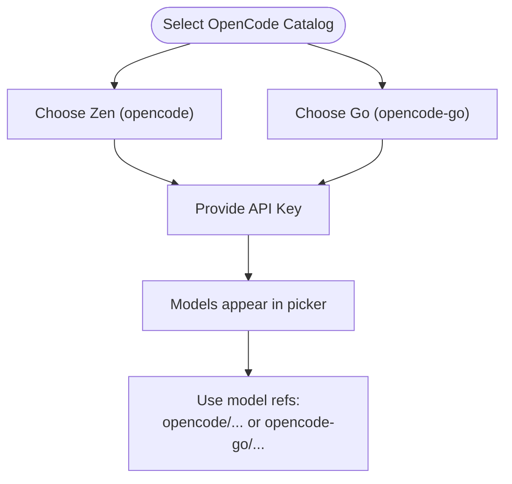
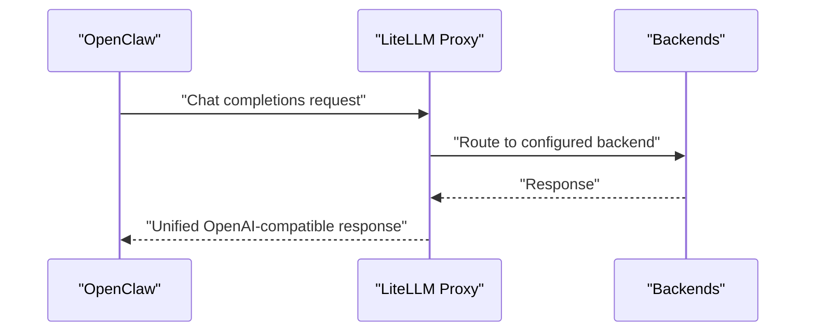
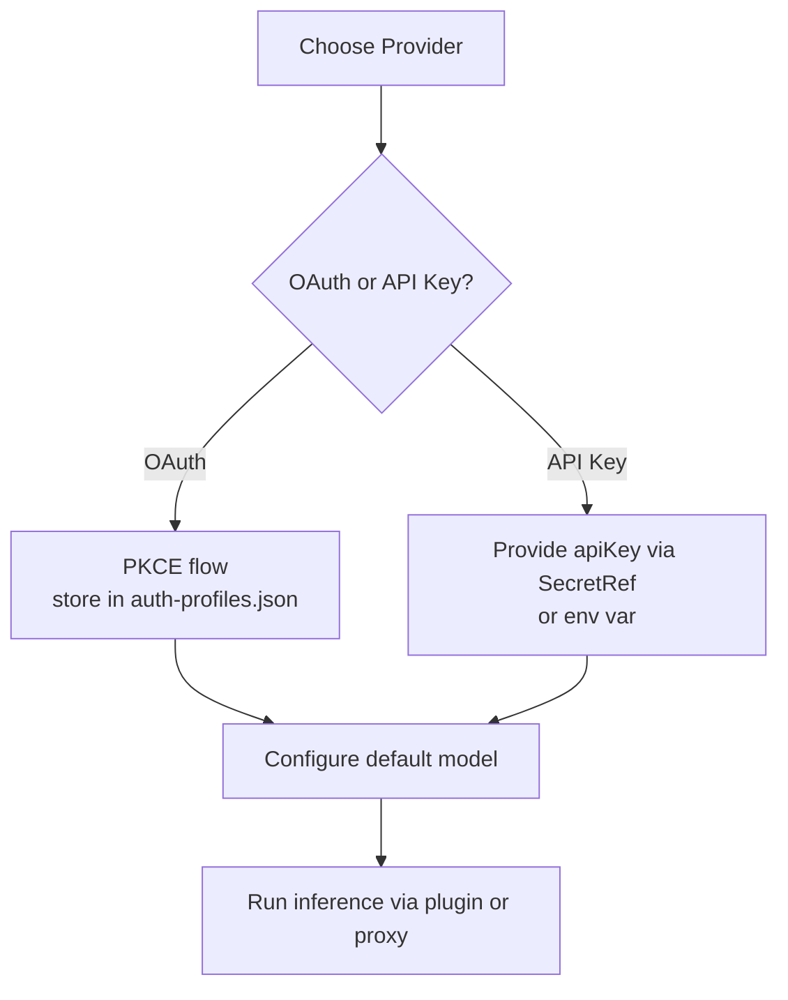
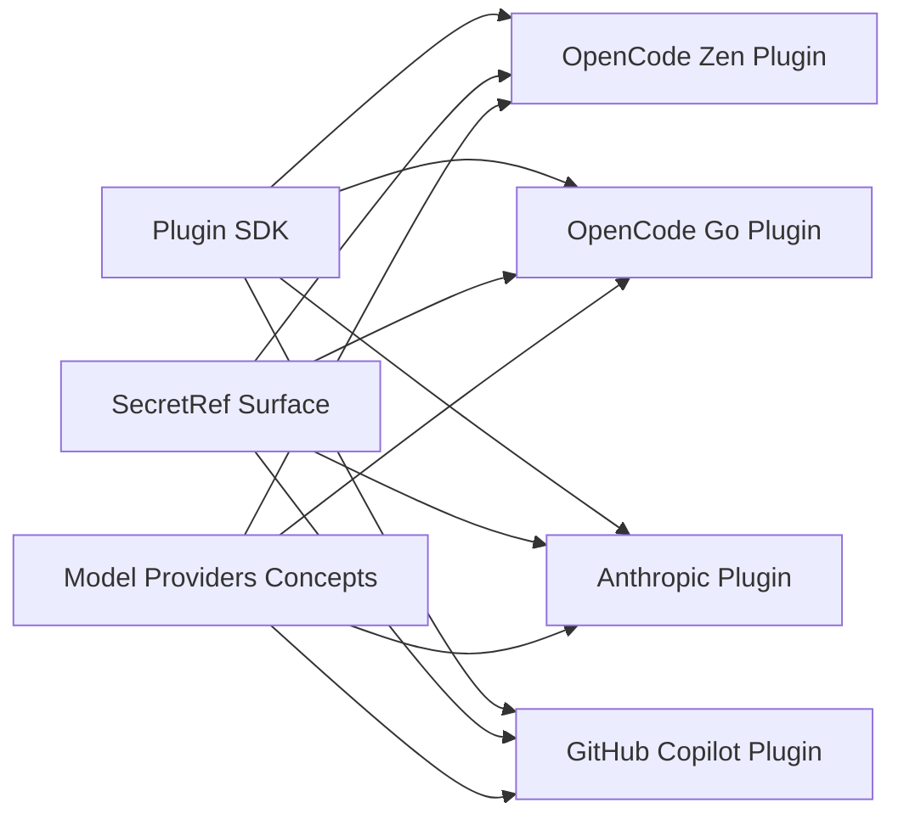

# Community Providers

<cite>
**Referenced Files in This Document**
- [docs/providers/index.md](file://docs/providers/index.md)
- [docs/providers/claude-max-api-proxy.md](file://docs/providers/claude-max-api-proxy.md)
- [docs/providers/opencode.md](file://docs/providers/opencode.md)
- [docs/providers/opencode-go.md](file://docs/providers/opencode-go.md)
- [docs/providers/litellm.md](file://docs/providers/litellm.md)
- [docs/concepts/model-providers.md](file://docs/concepts/model-providers.md)
- [docs/concepts/oauth.md](file://docs/concepts/oauth.md)
- [docs/plugins/community.md](file://docs/plugins/community.md)
- [docs/reference/secretref-credential-surface.md](file://docs/reference/secretref-credential-surface.md)
- [docs/reference/secretref-user-supplied-credentials-matrix.json](file://docs/reference/secretref-user-supplied-credentials-matrix.json)
- [docs/help/troubleshooting.md](file://docs/help/troubleshooting.md)
- [extensions/opencode/index.ts](file://extensions/opencode/index.ts)
- [extensions/opencode-go/index.ts](file://extensions/opencode-go/index.ts)
- [extensions/anthropic/index.ts](file://extensions/anthropic/index.ts)
- [extensions/github-copilot/index.ts](file://extensions/github-copilot/index.ts)
</cite>

## Table of Contents
1. [Introduction](#introduction)
2. [Project Structure](#project-structure)
3. [Core Components](#core-components)
4. [Architecture Overview](#architecture-overview)
5. [Detailed Component Analysis](#detailed-component-analysis)
6. [Dependency Analysis](#dependency-analysis)
7. [Performance Considerations](#performance-considerations)
8. [Troubleshooting Guide](#troubleshooting-guide)
9. [Conclusion](#conclusion)
10. [Appendices](#appendices)

## Introduction
This document focuses on community-maintained AI provider integrations in OpenClaw. It explains how to set up and use three key community contributions: the Claude Max API Proxy, OpenCode (Zen and Go catalogs), and LiteLLM unified gateway. It also documents community provider authentication semantics, verification requirements, approval and maintenance expectations, and best practices for evaluating and selecting reliable providers.

## Project Structure
OpenClaw organizes provider documentation under the providers catalog and integrates provider plugins in the extensions directory. Community provider documentation is published alongside official provider docs, while community plugins are tracked separately.

**Diagram sources**
- [docs/providers/index.md:1-63](file://docs/providers/index.md#L1-L63)
- [docs/providers/claude-max-api-proxy.md:1-155](file://docs/providers/claude-max-api-proxy.md#L1-L155)
- [docs/providers/opencode.md:1-65](file://docs/providers/opencode.md#L1-L65)
- [docs/providers/opencode-go.md:1-46](file://docs/providers/opencode-go.md#L1-L46)
- [docs/providers/litellm.md:1-154](file://docs/providers/litellm.md#L1-L154)
- [docs/concepts/model-providers.md:1-595](file://docs/concepts/model-providers.md#L1-L595)
- [extensions/opencode/index.ts:1-37](file://extensions/opencode/index.ts#L1-L37)
- [extensions/opencode-go/index.ts:1-28](file://extensions/opencode-go/index.ts#L1-L28)
- [extensions/anthropic/index.ts:1-319](file://extensions/anthropic/index.ts#L1-L319)
- [extensions/github-copilot/index.ts:1-142](file://extensions/github-copilot/index.ts#L1-L142)

**Section sources**
- [docs/providers/index.md:1-63](file://docs/providers/index.md#L1-L63)
- [docs/concepts/model-providers.md:1-595](file://docs/concepts/model-providers.md#L1-L595)

## Core Components
- Claude Max API Proxy: A community proxy that exposes Claude Max/Pro subscription credentials as an OpenAI-compatible endpoint. It converts OpenAI-format requests to Claude Code CLI commands and returns OpenAI-format responses.
- OpenCode (Zen and Go): Two hosted catalogs integrated via dedicated plugins. They share a single API key but maintain distinct runtime provider IDs for accurate per-model routing.
- LiteLLM Unified Gateway: An open-source gateway that provides a unified API to multiple providers, enabling cost tracking, virtual keys, logging, and model routing without changing OpenClaw configuration.

**Section sources**
- [docs/providers/claude-max-api-proxy.md:1-155](file://docs/providers/claude-max-api-proxy.md#L1-L155)
- [docs/providers/opencode.md:1-65](file://docs/providers/opencode.md#L1-L65)
- [docs/providers/opencode-go.md:1-46](file://docs/providers/opencode-go.md#L1-L46)
- [docs/providers/litellm.md:1-154](file://docs/providers/litellm.md#L1-L154)
- [extensions/opencode/index.ts:1-37](file://extensions/opencode/index.ts#L1-L37)
- [extensions/opencode-go/index.ts:1-28](file://extensions/opencode-go/index.ts#L1-L28)

## Architecture Overview
The provider ecosystem combines official and community integrations. Official providers are often distributed as plugins with rich capabilities (auth flows, model routing, usage reporting). Community tools can act as local proxies or unified gateways, exposing compatible APIs for OpenClaw.

**Diagram sources**
- [docs/concepts/model-providers.md:35-106](file://docs/concepts/model-providers.md#L35-L106)
- [docs/providers/claude-max-api-proxy.md:29-41](file://docs/providers/claude-max-api-proxy.md#L29-L41)
- [docs/providers/litellm.md:10-20](file://docs/providers/litellm.md#L10-L20)
- [extensions/anthropic/index.ts:261-314](file://extensions/anthropic/index.ts#L261-L314)
- [extensions/github-copilot/index.ts:75-138](file://extensions/github-copilot/index.ts#L75-L138)
- [extensions/opencode/index.ts:14-34](file://extensions/opencode/index.ts#L14-L34)
- [extensions/opencode-go/index.ts:5-24](file://extensions/opencode-go/index.ts#L5-L24)

## Detailed Component Analysis

### Claude Max API Proxy
- Purpose: Expose Claude Max/Pro subscription via an OpenAI-compatible endpoint for use with OpenClaw and other OpenAI-format tools.
- Workflow: Accepts OpenAI-format requests, converts to Claude Code CLI commands, and returns OpenAI-format responses (with streaming support).
- Setup: Install globally, ensure Claude CLI is authenticated, start the proxy server, and configure OpenClaw to use the proxy base URL.
- Authentication: Not required for the proxy itself; relies on an active Claude Max/Pro subscription and authenticated Claude CLI.
- Limitations: Community-maintained; not officially supported by Anthropic or OpenClaw. Verify current terms and policies before relying on it.

**Diagram sources**
- [docs/providers/claude-max-api-proxy.md:29-41](file://docs/providers/claude-max-api-proxy.md#L29-L41)

**Section sources**
- [docs/providers/claude-max-api-proxy.md:1-155](file://docs/providers/claude-max-api-proxy.md#L1-L155)

### OpenCode (Zen and Go)
- Overview: Two hosted catalogs exposed via OpenClaw. Both use the same API key but keep separate runtime provider IDs for routing.
- Zen catalog: Uses provider ID `opencode` with curated multi-model proxy.
- Go catalog: Uses provider ID `opencode-go` with hosted Kimi/GLM/MiniMax lineup.
- Authentication: Single API key suffices for both catalogs; setup via wizard with either catalog choice.
- Routing behavior: Explicit model refs preserve routing correctness across catalogs.

**Diagram sources**
- [docs/providers/opencode.md:11-18](file://docs/providers/opencode.md#L11-L18)
- [docs/providers/opencode-go.md:11-13](file://docs/providers/opencode-go.md#L11-L13)

**Section sources**
- [docs/providers/opencode.md:1-65](file://docs/providers/opencode.md#L1-L65)
- [docs/providers/opencode-go.md:1-46](file://docs/providers/opencode-go.md#L1-L46)
- [extensions/opencode/index.ts:1-37](file://extensions/opencode/index.ts#L1-L37)
- [extensions/opencode-go/index.ts:1-28](file://extensions/opencode-go/index.ts#L1-L28)

### LiteLLM Unified Gateway
- Purpose: Centralized routing, cost tracking, logging, and model switching through a single gateway.
- Quick start: Install the proxy, run with a model, export the API key, and OpenClaw routes through LiteLLM.
- Configuration: Environment variable or config file; define base URL, API key, and model list with metadata.
- Virtual keys: Create dedicated keys with budget caps for OpenClaw.
- Model routing: Configure model lists to route requests to different backends without changing OpenClaw config.
- Usage: Query key info and spend logs via the gateway API.

**Diagram sources**
- [docs/providers/litellm.md:10-20](file://docs/providers/litellm.md#L10-L20)

**Section sources**
- [docs/providers/litellm.md:1-154](file://docs/providers/litellm.md#L1-L154)

### Community Provider Authentication and Verification
- OAuth and setup-token: OpenClaw supports OAuth for providers that offer it (e.g., OpenAI Codex) and setup-token for Anthropic subscriptions. Anthropic setup-token is noted as technical compatibility with policy caveats.
- SecretRef credential surface: Canonical list of supported credentials for secret management and auditing. Model provider apiKey and headers are supported for SecretRef.
- Provider plugin capabilities: Plugins can own auth flows, model routing, usage reporting, and runtime behavior.

**Diagram sources**
- [docs/concepts/oauth.md:13-26](file://docs/concepts/oauth.md#L13-L26)
- [docs/reference/secretref-credential-surface.md:25-26](file://docs/reference/secretref-credential-surface.md#L25-L26)
- [docs/concepts/model-providers.md:40-73](file://docs/concepts/model-providers.md#L40-L73)

**Section sources**
- [docs/concepts/oauth.md:1-159](file://docs/concepts/oauth.md#L1-L159)
- [docs/reference/secretref-credential-surface.md:1-133](file://docs/reference/secretref-credential-surface.md#L1-L133)
- [docs/reference/secretref-user-supplied-credentials-matrix.json:1-515](file://docs/reference/secretref-user-supplied-credentials-matrix.json#L1-L515)
- [docs/concepts/model-providers.md:35-106](file://docs/concepts/model-providers.md#L35-L106)

### Community Provider Approval and Maintenance
- Listing criteria: Plugins must be published on npmjs, hosted on GitHub, include setup/use docs and an issue tracker, and demonstrate active maintenance.
- Submission path: Open a PR adding the plugin with name, npm package, repo URL, description, and install command.
- Review bar: Prefer useful, documented, and safe plugins; low-effort wrappers or unmaintained packages may be declined.

**Section sources**
- [docs/plugins/community.md:1-52](file://docs/plugins/community.md#L1-L52)

## Dependency Analysis
Community provider integrations rely on:
- Official plugin SDK for registering providers, auth flows, and runtime behavior.
- SecretRef credential surface for secure storage and auditing of credentials.
- Model provider concepts for routing, metadata, and compatibility.

**Diagram sources**
- [docs/concepts/model-providers.md:35-106](file://docs/concepts/model-providers.md#L35-L106)
- [docs/reference/secretref-credential-surface.md:19-98](file://docs/reference/secretref-credential-surface.md#L19-L98)
- [extensions/opencode/index.ts:14-34](file://extensions/opencode/index.ts#L14-L34)
- [extensions/opencode-go/index.ts:5-24](file://extensions/opencode-go/index.ts#L5-L24)
- [extensions/anthropic/index.ts:261-314](file://extensions/anthropic/index.ts#L261-L314)
- [extensions/github-copilot/index.ts:75-138](file://extensions/github-copilot/index.ts#L75-L138)

**Section sources**
- [docs/concepts/model-providers.md:35-106](file://docs/concepts/model-providers.md#L35-L106)
- [docs/reference/secretref-credential-surface.md:19-98](file://docs/reference/secretref-credential-surface.md#L19-L98)
- [extensions/opencode/index.ts:1-37](file://extensions/opencode/index.ts#L1-L37)
- [extensions/opencode-go/index.ts:1-28](file://extensions/opencode-go/index.ts#L1-L28)
- [extensions/anthropic/index.ts:1-319](file://extensions/anthropic/index.ts#L1-L319)
- [extensions/github-copilot/index.ts:1-142](file://extensions/github-copilot/index.ts#L1-L142)

## Performance Considerations
- LiteLLM enables centralized routing and cost tracking without changing OpenClaw configuration, simplifying multi-provider setups.
- Claude Max API Proxy runs locally and streams responses, minimizing latency for OpenAI-compatible workflows.
- OpenCode catalogs integrate seamlessly with OpenClaw’s model picker and routing.

[No sources needed since this section provides general guidance]

## Troubleshooting Guide
- General triage: Use status, gateway probe/status, doctor, channel probe, and logs to quickly diagnose issues.
- Provider-specific tips:
  - Claude Max API Proxy: Verify local server health, model listing, and basic chat completion endpoints.
  - LiteLLM: Confirm gateway is reachable, API key is exported or configured, and model routing is set up.
  - OpenCode: Ensure the API key is set and models appear in the picker; confirm model refs use the correct provider prefix.
  - OAuth and setup-token: Check auth-profiles storage and expiration; use wizard flows to refresh tokens.

**Section sources**
- [docs/help/troubleshooting.md:1-299](file://docs/help/troubleshooting.md#L1-L299)
- [docs/providers/claude-max-api-proxy.md:52-77](file://docs/providers/claude-max-api-proxy.md#L52-L77)
- [docs/providers/litellm.md:28-45](file://docs/providers/litellm.md#L28-L45)
- [docs/concepts/oauth.md:41-81](file://docs/concepts/oauth.md#L41-L81)

## Conclusion
Community-maintained provider integrations expand OpenClaw’s compatibility and capabilities. The Claude Max API Proxy, OpenCode catalogs, and LiteLLM gateway each address distinct use cases: subscription bridging, curated hosted models, and unified routing. By following the setup patterns, authentication semantics, and best practices outlined here, you can confidently evaluate, configure, and operate these integrations while managing risks and maintaining security.

[No sources needed since this section summarizes without analyzing specific files]

## Appendices

### Appendix A: Provider Setup Patterns and Examples
- Claude Max API Proxy
  - Install and start the proxy locally.
  - Configure OpenClaw to use the proxy base URL and set a default model reference.
  - Reference: [docs/providers/claude-max-api-proxy.md:42-95](file://docs/providers/claude-max-api-proxy.md#L42-L95)

- OpenCode (Zen and Go)
  - Use wizard to authenticate with a single API key for either catalog.
  - Select models from the picker and set default model references accordingly.
  - Reference: [docs/providers/opencode.md:20-43](file://docs/providers/opencode.md#L20-L43), [docs/providers/opencode-go.md:21-36](file://docs/providers/opencode-go.md#L21-L36)

- LiteLLM
  - Start the proxy, export the API key, and OpenClaw routes through LiteLLM.
  - Configure base URL, API key, and model list in config or via environment variables.
  - Reference: [docs/providers/litellm.md:28-92](file://docs/providers/litellm.md#L28-L92)

### Appendix B: Security and Maintenance Responsibilities
- SecretRef credential surface: Ensure credentials are stored securely and audited using supported paths.
- Community plugin maintenance: Verify active maintenance signals and repository health before adoption.
- Provider policy awareness: For subscription-based flows (e.g., Anthropic setup-token), review provider terms and decide based on risk tolerance.

**Section sources**
- [docs/reference/secretref-credential-surface.md:19-98](file://docs/reference/secretref-credential-surface.md#L19-L98)
- [docs/plugins/community.md:15-21](file://docs/plugins/community.md#L15-L21)
- [docs/concepts/oauth.md:57-63](file://docs/concepts/oauth.md#L57-L63)