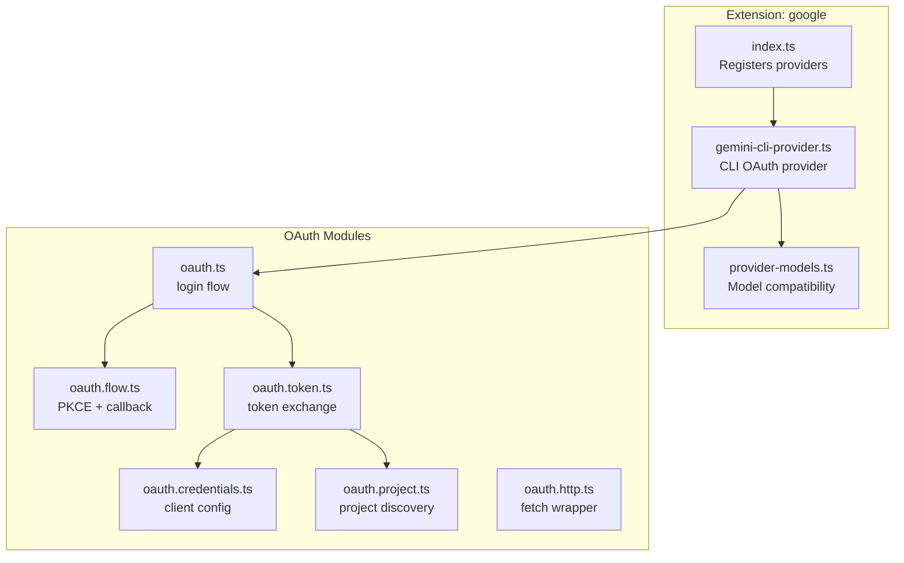
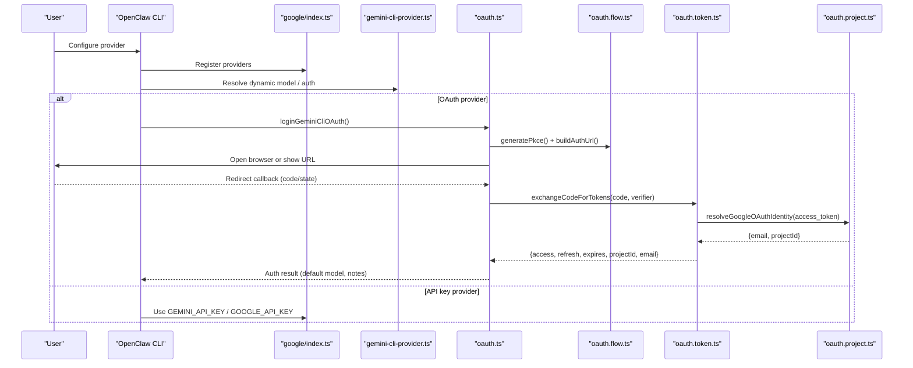
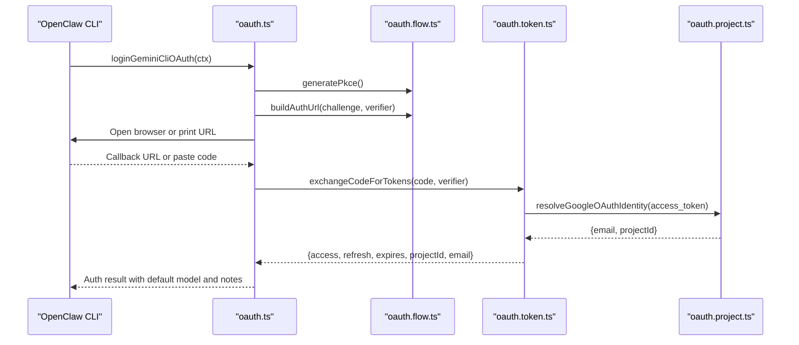
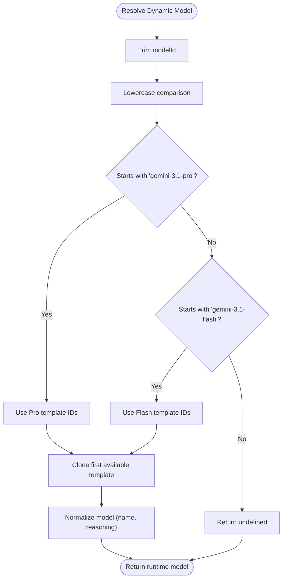
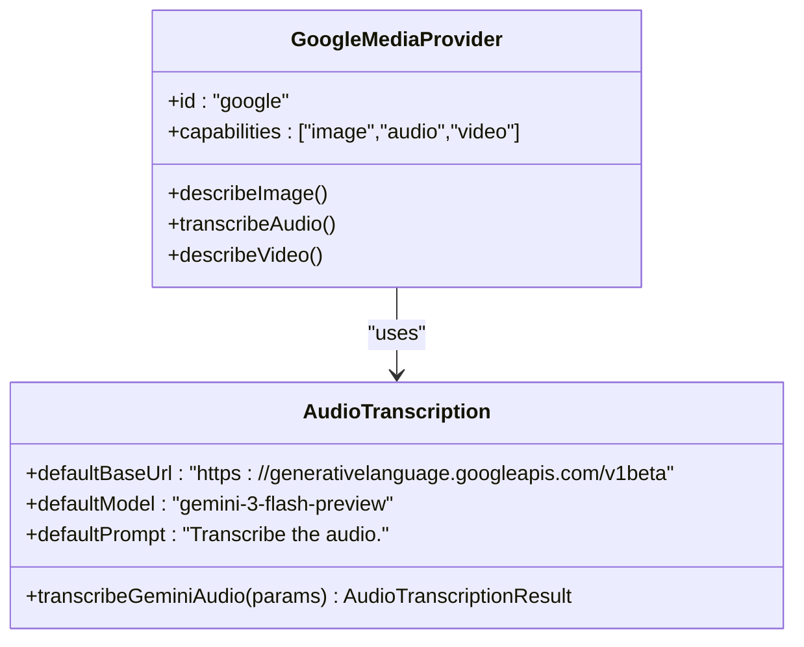
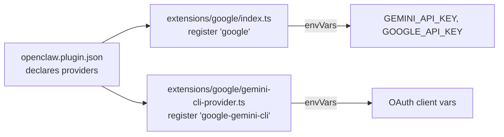

# Google Provider

<cite>
**Referenced Files in This Document**
- [extensions/google/index.ts](file://extensions/google/index.ts)
- [extensions/google/gemini-cli-provider.ts](file://extensions/google/gemini-cli-provider.ts)
- [extensions/google/oauth.ts](file://extensions/google/oauth.ts)
- [extensions/google/oauth.flow.ts](file://extensions/google/oauth.flow.ts)
- [extensions/google/oauth.credentials.ts](file://extensions/google/oauth.credentials.ts)
- [extensions/google/oauth.token.ts](file://extensions/google/oauth.token.ts)
- [extensions/google/oauth.project.ts](file://extensions/google/oauth.project.ts)
- [extensions/google/oauth.http.ts](file://extensions/google/oauth.http.ts)
- [extensions/google/provider-models.ts](file://extensions/google/provider-models.ts)
- [extensions/google/openclaw.plugin.json](file://extensions/google/openclaw.plugin.json)
- [src/infra/gemini-auth.ts](file://src/infra/gemini-auth.ts)
- [src/commands/google-gemini-model-default.ts](file://src/commands/google-gemini-model-default.ts)
- [src/commands/auth-choice.apply.api-providers.ts](file://src/commands/auth-choice.apply.api-providers.ts)
- [src/media-understanding/providers/google/index.ts](file://src/media-understanding/providers/google/index.ts)
- [src/media-understanding/providers/google/audio.ts](file://src/media-understanding/providers/google/audio.ts)
- [src/media-understanding/runner.ts](file://src/media-understanding/runner.ts)
</cite>

## Table of Contents
1. [Introduction](#introduction)
2. [Project Structure](#project-structure)
3. [Core Components](#core-components)
4. [Architecture Overview](#architecture-overview)
5. [Detailed Component Analysis](#detailed-component-analysis)
6. [Dependency Analysis](#dependency-analysis)
7. [Performance Considerations](#performance-considerations)
8. [Troubleshooting Guide](#troubleshooting-guide)
9. [Conclusion](#conclusion)
10. [Appendices](#appendices)

## Introduction
This document explains the Google provider integration in OpenClaw with a focus on Google AI Studio authentication, Gemini API setup, and model configuration. It covers:
- How to authenticate via Google AI Studio API keys and via OAuth for the Gemini CLI provider
- Supported Gemini models, multimodal capabilities, and Google-specific features
- Practical setup steps, model selection, and usage snapshot retrieval
- Troubleshooting, quotas, and cost optimization guidance

## Project Structure
The Google provider is implemented as an extension that registers two providers:
- A standard Google AI Studio provider using API keys
- A Gemini CLI OAuth provider for local CLI access

**Diagram sources**
- [extensions/google/index.ts:11-47](file://extensions/google/index.ts#L11-L47)
- [extensions/google/gemini-cli-provider.ts:37-99](file://extensions/google/gemini-cli-provider.ts#L37-L99)
- [extensions/google/oauth.ts:15-91](file://extensions/google/oauth.ts#L15-L91)
- [extensions/google/oauth.flow.ts:11-31](file://extensions/google/oauth.flow.ts#L11-L31)
- [extensions/google/oauth.credentials.ts:148-164](file://extensions/google/oauth.credentials.ts#L148-L164)
- [extensions/google/oauth.token.ts:6-57](file://extensions/google/oauth.token.ts#L6-L57)
- [extensions/google/oauth.project.ts:89-96](file://extensions/google/oauth.project.ts#L89-L96)
- [extensions/google/oauth.http.ts:4-24](file://extensions/google/oauth.http.ts#L4-L24)
- [extensions/google/provider-models.ts:37-63](file://extensions/google/provider-models.ts#L37-L63)

**Section sources**
- [extensions/google/index.ts:11-47](file://extensions/google/index.ts#L11-L47)
- [extensions/google/gemini-cli-provider.ts:37-99](file://extensions/google/gemini-cli-provider.ts#L37-L99)

## Core Components
- Google AI Studio provider (API key):
  - Registers provider id "google" with label "Google AI Studio"
  - Environment variables: GEMINI_API_KEY, GOOGLE_API_KEY
  - Uses model compatibility resolver for modern Google models
  - Provides web search provider backed by Gemini
- Gemini CLI OAuth provider:
  - Registers provider id "google-gemini-cli" with alias "gemini-cli"
  - Environment variables for OAuth client credentials
  - PKCE-based OAuth flow with localhost callback
  - Automatic Google Cloud project resolution and usage snapshot retrieval

Key behaviors:
- Model compatibility: forward-compatible resolution for Gemini 3.1 Pro/Flash variants
- Authentication: supports both API key and OAuth JSON format for Gemini
- Multimodal: image, audio, and video capabilities via Google media understanding provider

**Section sources**
- [extensions/google/index.ts:11-47](file://extensions/google/index.ts#L11-L47)
- [extensions/google/gemini-cli-provider.ts:37-99](file://extensions/google/gemini-cli-provider.ts#L37-L99)
- [extensions/google/provider-models.ts:37-63](file://extensions/google/provider-models.ts#L37-L63)
- [src/infra/gemini-auth.ts:15-40](file://src/infra/gemini-auth.ts#L15-L40)
- [src/media-understanding/providers/google/index.ts:6-12](file://src/media-understanding/providers/google/index.ts#L6-L12)

## Architecture Overview
High-level authentication and model resolution flow for Google providers.

**Diagram sources**
- [extensions/google/index.ts:17-27](file://extensions/google/index.ts#L17-L27)
- [extensions/google/gemini-cli-provider.ts:50-81](file://extensions/google/gemini-cli-provider.ts#L50-L81)
- [extensions/google/oauth.ts:15-91](file://extensions/google/oauth.ts#L15-L91)
- [extensions/google/oauth.flow.ts:17-31](file://extensions/google/oauth.flow.ts#L17-L31)
- [extensions/google/oauth.token.ts:6-57](file://extensions/google/oauth.token.ts#L6-L57)
- [extensions/google/oauth.project.ts:89-96](file://extensions/google/oauth.project.ts#L89-L96)

## Detailed Component Analysis

### Google AI Studio Provider (API Key)
- Provider registration:
  - id: "google"
  - label: "Google AI Studio"
  - envVars: ["GEMINI_API_KEY", "GOOGLE_API_KEY"]
  - resolveDynamicModel: delegates to Google 3.1 forward-compat resolver
  - isModernModelRef: identifies modern "gemini-3.*" models
- Web search provider:
  - Backed by Gemini with Google Search grounding
  - Credential scoping for "gemini"
  - Signup URL for API key generation

Implementation highlights:
- Forward-compatibility model resolution ensures modern model IDs map to templates
- Authentication header parsing supports both traditional API key and OAuth JSON format

**Section sources**
- [extensions/google/index.ts:17-27](file://extensions/google/index.ts#L17-L27)
- [extensions/google/index.ts:28-42](file://extensions/google/index.ts#L28-L42)
- [extensions/google/provider-models.ts:37-63](file://extensions/google/provider-models.ts#L37-L63)
- [src/infra/gemini-auth.ts:15-40](file://src/infra/gemini-auth.ts#L15-L40)

### Gemini CLI OAuth Provider
- Provider registration:
  - id: "google-gemini-cli"
  - aliases: ["gemini-cli"]
  - envVars: OPENCLAW_GEMINI_OAUTH_CLIENT_ID, OPENCLAW_GEMINI_OAUTH_CLIENT_SECRET, GEMINI_CLI_OAUTH_CLIENT_ID, GEMINI_CLI_OAUTH_CLIENT_SECRET
  - auth: OAuth PKCE flow with localhost callback
  - resolveDynamicModel: forward-compatible resolution
  - isModernModelRef: modern model detection
  - resolveUsageAuth: parses OAuth token JSON and extracts token
  - fetchUsageSnapshot: retrieves usage via provider usage fetcher
- OAuth flow:
  - PKCE challenge generation and auth URL construction
  - Localhost callback server listening on port 8085
  - Manual fallback when local callback fails
  - Token exchange with Google OAuth endpoints
  - Identity and project discovery with tier-aware provisioning

**Diagram sources**
- [extensions/google/oauth.ts:15-91](file://extensions/google/oauth.ts#L15-L91)
- [extensions/google/oauth.flow.ts:17-31](file://extensions/google/oauth.flow.ts#L17-L31)
- [extensions/google/oauth.token.ts:6-57](file://extensions/google/oauth.token.ts#L6-L57)
- [extensions/google/oauth.project.ts:89-96](file://extensions/google/oauth.project.ts#L89-L96)

**Section sources**
- [extensions/google/gemini-cli-provider.ts:37-99](file://extensions/google/gemini-cli-provider.ts#L37-L99)
- [extensions/google/oauth.ts:15-91](file://extensions/google/oauth.ts#L15-L91)
- [extensions/google/oauth.flow.ts:61-152](file://extensions/google/oauth.flow.ts#L61-L152)
- [extensions/google/oauth.token.ts:6-57](file://extensions/google/oauth.token.ts#L6-L57)
- [extensions/google/oauth.project.ts:89-235](file://extensions/google/oauth.project.ts#L89-L235)

### Model Compatibility and Selection
- Forward-compatible resolution:
  - Detects model IDs starting with "gemini-3.1-pro" or "gemini-3.1-flash"
  - Clones template models and normalizes to the requested ID
  - Enables reasoning capability for modern models
- Default model selection:
  - CLI applies "google/gemini-3.1-pro-preview" as default when configured
  - API key flow supports setting default model via CLI

**Diagram sources**
- [extensions/google/provider-models.ts:37-63](file://extensions/google/provider-models.ts#L37-L63)

**Section sources**
- [extensions/google/provider-models.ts:12-63](file://extensions/google/provider-models.ts#L12-L63)
- [src/commands/google-gemini-model-default.ts:4-11](file://src/commands/google-gemini-model-default.ts#L4-L11)
- [src/commands/auth-choice.apply.api-providers.ts:186-221](file://src/commands/auth-choice.apply.api-providers.ts#L186-L221)

### Multimodal Capabilities and Google-Specific Features
- Media understanding provider for Google:
  - Supports image, audio, and video capabilities
  - Audio transcription uses a default model and prompt
- Local CLI integration:
  - Optional local gemini CLI invocation for media understanding when available
- Authentication header parsing:
  - Supports OAuth JSON format with embedded token and project ID
  - Falls back to traditional API key format

**Diagram sources**
- [src/media-understanding/providers/google/index.ts:6-12](file://src/media-understanding/providers/google/index.ts#L6-L12)
- [src/media-understanding/providers/google/audio.ts:8-21](file://src/media-understanding/providers/google/audio.ts#L8-L21)

**Section sources**
- [src/media-understanding/providers/google/index.ts:6-12](file://src/media-understanding/providers/google/index.ts#L6-L12)
- [src/media-understanding/providers/google/audio.ts:8-21](file://src/media-understanding/providers/google/audio.ts#L8-L21)
- [src/media-understanding/runner.ts:318-338](file://src/media-understanding/runner.ts#L318-L338)
- [src/infra/gemini-auth.ts:15-40](file://src/infra/gemini-auth.ts#L15-L40)

## Dependency Analysis
Provider registration and environment variable exposure.

**Diagram sources**
- [extensions/google/openclaw.plugin.json:1-12](file://extensions/google/openclaw.plugin.json#L1-L12)
- [extensions/google/index.ts:17-27](file://extensions/google/index.ts#L17-L27)
- [extensions/google/gemini-cli-provider.ts:44-49](file://extensions/google/gemini-cli-provider.ts#L44-L49)

**Section sources**
- [extensions/google/openclaw.plugin.json:1-12](file://extensions/google/openclaw.plugin.json#L1-L12)
- [extensions/google/index.ts:17-27](file://extensions/google/index.ts#L17-L27)
- [extensions/google/gemini-cli-provider.ts:44-49](file://extensions/google/gemini-cli-provider.ts#L44-L49)

## Performance Considerations
- OAuth callback server:
  - Listens on localhost:8085; ensure firewall allows loopback traffic
  - Timeout is 5 minutes; slow networks or busy systems may require retries
- Token exchange:
  - Uses a short-lived fetch timeout; network issues can cause retries
- Model resolution:
  - Forward-compat resolution is lightweight; relies on model registry lookups
- Usage snapshots:
  - Fetches usage via provider usage fetcher; consider caching or rate limiting in high-volume scenarios

[No sources needed since this section provides general guidance]

## Troubleshooting Guide
Common issues and resolutions:

- OAuth callback server fails (EADDRINUSE/port/listen)
  - The system falls back to manual mode; paste the redirect URL when prompted
  - Verify port 8085 is free or retry after closing conflicting applications
- OAuth state mismatch
  - Ensure the callback URL includes the state parameter; re-run the flow if mismatch occurs
- No refresh token received
  - Re-authorize with consent; ensure offline access is granted
- Project ID not discovered
  - Set GOOGLE_CLOUD_PROJECT or GOOGLE_CLOUD_PROJECT_ID
  - Account tiers may require explicit project assignment
- VPC Service Controls restrictions
  - Some environments restrict project discovery; configure project explicitly
- API key vs OAuth JSON
  - If using OAuth JSON, ensure it contains a valid token; otherwise, use a raw API key
- Default model not applied
  - Use CLI to set default model to a modern Gemini 3.x variant

**Section sources**
- [extensions/google/oauth.ts:68-89](file://extensions/google/oauth.ts#L68-L89)
- [extensions/google/oauth.flow.ts:140-151](file://extensions/google/oauth.flow.ts#L140-L151)
- [extensions/google/oauth.token.ts:43-45](file://extensions/google/oauth.token.ts#L43-L45)
- [extensions/google/oauth.project.ts:139-143](file://extensions/google/oauth.project.ts#L139-L143)
- [extensions/google/oauth.project.ts:187-191](file://extensions/google/oauth.project.ts#L187-L191)
- [extensions/google/oauth.project.ts:232-235](file://extensions/google/oauth.project.ts#L232-L235)
- [src/infra/gemini-auth.ts:15-40](file://src/infra/gemini-auth.ts#L15-L40)
- [src/commands/auth-choice.apply.api-providers.ts:186-221](file://src/commands/auth-choice.apply.api-providers.ts#L186-L221)

## Conclusion
The Google provider integration in OpenClaw offers two primary paths:
- Google AI Studio API key for straightforward server-side usage
- Gemini CLI OAuth for local CLI access with automatic project and identity discovery

Both paths support modern Gemini 3.x models and multimodal capabilities. Use the OAuth flow for local development and API key for hosted deployments. Configure environment variables appropriately and leverage usage snapshots to monitor quota consumption.

[No sources needed since this section summarizes without analyzing specific files]

## Appendices

### Setup Examples and References
- API key setup:
  - Set GEMINI_API_KEY or GOOGLE_API_KEY
  - Apply default model via CLI when configuring auth choice for Gemini API key
- OAuth setup:
  - Ensure OAuth client credentials are available (via environment variables or gemini CLI installation)
  - Run the OAuth login flow; follow on-screen instructions
  - If local callback fails, paste the redirect URL when prompted
- Model selection:
  - Modern models (e.g., gemini-3.1-pro, gemini-3.1-flash) are forward-compatible
  - Default model can be set to a modern variant via CLI

**Section sources**
- [extensions/google/index.ts:21-22](file://extensions/google/index.ts#L21-L22)
- [extensions/google/gemini-cli-provider.ts:14-19](file://extensions/google/gemini-cli-provider.ts#L14-L19)
- [src/commands/auth-choice.apply.api-providers.ts:186-221](file://src/commands/auth-choice.apply.api-providers.ts#L186-L221)
- [extensions/google/provider-models.ts:61-63](file://extensions/google/provider-models.ts#L61-L63)