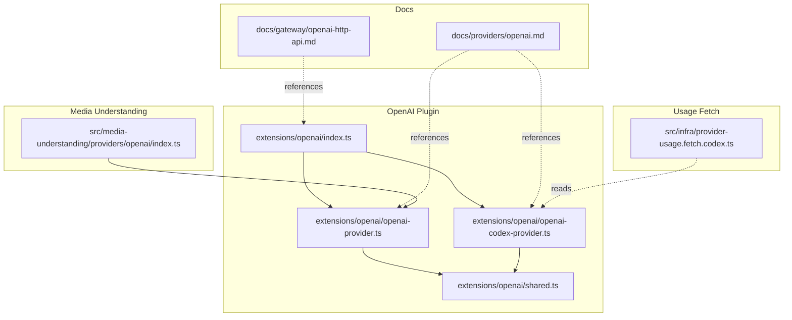
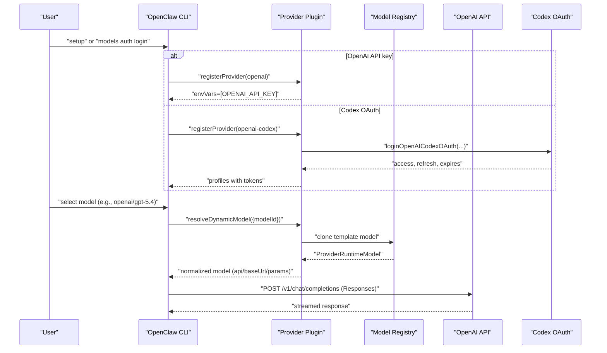
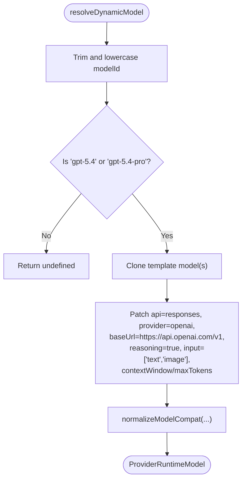
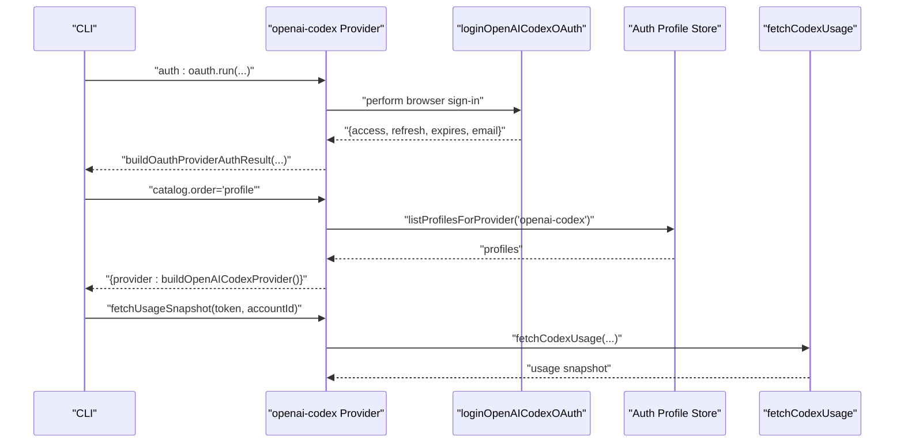
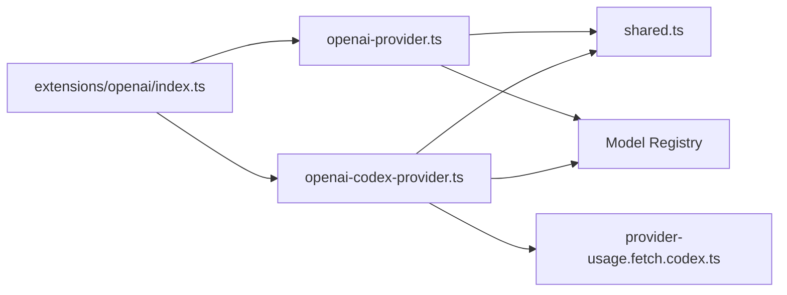

# OpenAI Provider

<cite>
**Referenced Files in This Document**
- [index.ts](file://extensions/openai/index.ts)
- [openai-provider.ts](file://extensions/openai/openai-provider.ts)
- [openai-codex-provider.ts](file://extensions/openai/openai-codex-provider.ts)
- [shared.ts](file://extensions/openai/shared.ts)
- [openai.md](file://docs/providers/openai.md)
- [openai-http-api.md](file://docs/gateway/openai-http-api.md)
- [openai/index.ts](file://src/media-understanding/providers/openai/index.ts)
- [provider-usage.fetch.codex.ts](file://src/infra/provider-usage.fetch.codex.ts)
- [pi-embedded-runner-extraparams.live.test.ts](file://src/agents/pi-embedded-runner-extraparams.live.test.ts)
</cite>

## Table of Contents
1. [Introduction](#introduction)
2. [Project Structure](#project-structure)
3. [Core Components](#core-components)
4. [Architecture Overview](#architecture-overview)
5. [Detailed Component Analysis](#detailed-component-analysis)
6. [Dependency Analysis](#dependency-analysis)
7. [Performance Considerations](#performance-considerations)
8. [Troubleshooting Guide](#troubleshooting-guide)
9. [Conclusion](#conclusion)
10. [Appendices](#appendices)

## Introduction
This document explains the OpenAI provider integration in OpenClaw, covering authentication, API key management, model configuration, and advanced features such as function calling, vision, and audio. It also documents Codex OAuth support, transport defaults, priority processing, fast mode, server-side context compaction, and HTTP gateway compatibility. Guidance on rate limiting, usage monitoring, and cost management is included.

## Project Structure
The OpenAI integration is implemented as a bundled plugin that registers two providers:
- openai: direct OpenAI API access via API keys
- openai-codex: ChatGPT OAuth-based access to Codex subscriptions

**Diagram sources**
- [index.ts:1-17](file://extensions/openai/index.ts#L1-L17)
- [openai-provider.ts:1-153](file://extensions/openai/openai-provider.ts#L1-L153)
- [openai-codex-provider.ts:1-254](file://extensions/openai/openai-codex-provider.ts#L1-L254)
- [shared.ts:1-66](file://extensions/openai/shared.ts#L1-L66)
- [openai.md:1-304](file://docs/providers/openai.md#L1-L304)
- [openai-http-api.md:1-133](file://docs/gateway/openai-http-api.md#L1-L133)
- [openai/index.ts:1-10](file://src/media-understanding/providers/openai/index.ts#L1-L10)
- [provider-usage.fetch.codex.ts:90-120](file://src/infra/provider-usage.fetch.codex.ts#L90-L120)

**Section sources**
- [index.ts:1-17](file://extensions/openai/index.ts#L1-L17)
- [openai.md:1-304](file://docs/providers/openai.md#L1-L304)

## Core Components
- Provider registration: The plugin registers both the direct OpenAI provider and the Codex OAuth provider.
- Environment variables: The direct OpenAI provider declares an API key environment variable requirement.
- Model resolution: Both providers implement dynamic model resolution with forward compatibility and template cloning.
- Transport normalization: Providers normalize transport and base URLs for OpenAI and Codex endpoints.
- Capabilities: Providers expose modern and X-high thinking model detection and augment model catalogs.

**Section sources**
- [index.ts:10-13](file://extensions/openai/index.ts#L10-L13)
- [openai-provider.ts:86-152](file://extensions/openai/openai-provider.ts#L86-L152)
- [openai-codex-provider.ts:162-253](file://extensions/openai/openai-codex-provider.ts#L162-L253)

## Architecture Overview
The OpenAI integration orchestrates authentication, model selection, transport routing, and usage reporting.

**Diagram sources**
- [index.ts:10-13](file://extensions/openai/index.ts#L10-L13)
- [openai-provider.ts:86-99](file://extensions/openai/openai-provider.ts#L86-L99)
- [openai-codex-provider.ts:162-175](file://extensions/openai/openai-codex-provider.ts#L162-L175)
- [openai.md:15-83](file://docs/providers/openai.md#L15-L83)

## Detailed Component Analysis

### OpenAI Provider (API Keys)
- Purpose: Direct access to OpenAI via API keys.
- Authentication: Declares environment variable requirement for API key.
- Model resolution: Supports forward-compatible resolution for GPT-5.4 and GPT-5.4 Pro, mapping to the OpenAI Responses API with image/text input and extended context windows.
- Transport normalization: Automatically switches to the OpenAI Responses API when using the official base URL.
- Suppressed models: Explicitly suppresses the Spark model on the direct OpenAI API path.
- Catalog augmentation: Adds GPT-5.4 and GPT-5.4 Pro entries derived from templates.

**Diagram sources**
- [openai-provider.ts:41-84](file://extensions/openai/openai-provider.ts#L41-L84)

**Section sources**
- [openai-provider.ts:15-25](file://extensions/openai/openai-provider.ts#L15-L25)
- [openai-provider.ts:86-152](file://extensions/openai/openai-provider.ts#L86-L152)
- [shared.ts:25-49](file://extensions/openai/shared.ts#L25-L49)

### OpenAI Codex Provider (ChatGPT OAuth)
- Purpose: Access Codex via ChatGPT OAuth, including entitlement-based Spark variants.
- Authentication: Implements an OAuth flow returning access/refresh tokens and expiration.
- Model resolution: Resolves GPT-5.4, GPT-5.3, and Spark models, normalizing transport to Codex-compatible endpoints.
- Transport normalization: Switches to Codex responses when using OpenAI or Codex base URLs.
- Catalog augmentation: Adds GPT-5.4 and Spark entries when templates are present.
- Usage fetching: Provides usage snapshot retrieval via OAuth token.

**Diagram sources**
- [openai-codex-provider.ts:135-160](file://extensions/openai/openai-codex-provider.ts#L135-L160)
- [openai-codex-provider.ts:184-197](file://extensions/openai/openai-codex-provider.ts#L184-L197)
- [openai-codex-provider.ts:221-223](file://extensions/openai/openai-codex-provider.ts#L221-L223)

**Section sources**
- [openai-codex-provider.ts:23-51](file://extensions/openai/openai-codex-provider.ts#L23-L51)
- [openai-codex-provider.ts:162-253](file://extensions/openai/openai-codex-provider.ts#L162-L253)
- [provider-usage.fetch.codex.ts:90-120](file://src/infra/provider-usage.fetch.codex.ts#L90-L120)

### Shared Utilities
- Base URL detection: Validates official OpenAI base URL patterns.
- Template cloning: Clones a template model and merges a patch, ensuring compatibility.
- Catalog template lookup: Finds a matching catalog entry by provider and model ID.

**Section sources**
- [shared.ts:7-23](file://extensions/openai/shared.ts#L7-L23)
- [shared.ts:25-49](file://extensions/openai/shared.ts#L25-L49)
- [shared.ts:51-65](file://extensions/openai/shared.ts#L51-L65)

### Media Understanding Integration
- Vision and audio capabilities: The OpenAI media understanding provider advertises support for image and audio modalities and delegates transcription to an OpenAI-compatible audio pipeline.

**Section sources**
- [openai/index.ts:5-10](file://src/media-understanding/providers/openai/index.ts#L5-L10)

## Dependency Analysis
- Provider registration: The plugin registers both providers with the OpenClaw SDK.
- Model registry: Providers rely on the model registry to clone template models and apply patches.
- Transport and base URL logic: Shared utilities normalize transports and base URLs consistently across providers.
- Usage integration: Codex provider integrates with usage fetching infrastructure.

**Diagram sources**
- [index.ts:10-13](file://extensions/openai/index.ts#L10-L13)
- [openai-provider.ts:86-99](file://extensions/openai/openai-provider.ts#L86-L99)
- [openai-codex-provider.ts:198-220](file://extensions/openai/openai-codex-provider.ts#L198-L220)
- [shared.ts:25-49](file://extensions/openai/shared.ts#L25-L49)
- [provider-usage.fetch.codex.ts:90-120](file://src/infra/provider-usage.fetch.codex.ts#L90-L120)

**Section sources**
- [index.ts:10-13](file://extensions/openai/index.ts#L10-L13)
- [openai-provider.ts:86-152](file://extensions/openai/openai-provider.ts#L86-L152)
- [openai-codex-provider.ts:162-253](file://extensions/openai/openai-codex-provider.ts#L162-L253)

## Performance Considerations
- Transport defaults: Both providers default to automatic transport selection, preferring WebSocket with fallback to SSE. For OpenAI Responses, WebSocket warm-up is enabled by default to reduce first-turn latency.
- Fast mode: A shared fast-mode toggle adjusts reasoning effort, verbosity, and service tier for low-latency sessions.
- Server-side compaction: For OpenAI Responses models, OpenClaw injects context management compaction hints to optimize payload sizes.

Practical configuration references:
- Transport selection and WebSocket warm-up toggles
- Priority processing via service tier
- Fast mode enable/disable
- Server-side compaction thresholds

**Section sources**
- [openai.md:84-182](file://docs/providers/openai.md#L84-L182)
- [openai.md:186-298](file://docs/providers/openai.md#L186-L298)

## Troubleshooting Guide
- Missing API key for direct OpenAI provider: The provider emits a clear message indicating that an API key is missing and suggests using Codex OAuth or setting the API key for the direct provider.
- Unknown model suppression: The direct OpenAI provider suppresses the Spark model variant that is Codex-only, preventing invalid requests to the OpenAI API.
- Codex usage parsing: When retrieving usage snapshots, the system parses rate-limit windows, plan type, and credit balances, including reset timestamps and labels.

Common scenarios and remedies:
- If a model resolves unexpectedly, verify the provider/model reference and transport normalization logic.
- If streaming fails, confirm transport settings and base URL normalization.
- If usage reporting appears incorrect, inspect the parsed windows and plan metadata.

**Section sources**
- [openai-provider.ts:105-122](file://extensions/openai/openai-provider.ts#L105-L122)
- [openai-codex-provider.ts:111-122](file://extensions/openai/openai-codex-provider.ts#L111-L122)
- [provider-usage.fetch.codex.ts:90-120](file://src/infra/provider-usage.fetch.codex.ts#L90-L120)

## Conclusion
The OpenAI provider integration offers flexible authentication (API key and Codex OAuth), robust model resolution with forward compatibility, and transport-aware routing. It supports modern OpenAI features such as streaming, priority processing, and server-side context compaction, while providing clear configuration patterns for performance tuning and usage monitoring.

## Appendices

### Supported OpenAI Models and Selection Patterns
- Direct OpenAI API:
  - GPT-5.4 and GPT-5.4 Pro are resolved via the OpenAI Responses API with image/text input and extended context windows.
  - The Spark model variant is suppressed on the direct API path.
- Codex OAuth:
  - GPT-5.4 and GPT-5.3 are supported; Spark is entitlement-dependent and Codex-only.

Configuration references:
- Model selection and transport defaults
- Fast mode toggles
- Server-side compaction controls

**Section sources**
- [openai-provider.ts:41-84](file://extensions/openai/openai-provider.ts#L41-L84)
- [openai-provider.ts:111-122](file://extensions/openai/openai-provider.ts#L111-L122)
- [openai-codex-provider.ts:80-133](file://extensions/openai/openai-codex-provider.ts#L80-L133)
- [openai.md:37-83](file://docs/providers/openai.md#L37-L83)

### Authentication Flows and API Versioning
- API key flow: Declared environment variable requirement for the direct provider.
- OAuth flow: Browser-based sign-in for Codex, returning tokens and expiration.
- Base URL normalization: Ensures correct routing to OpenAI or Codex endpoints.

**Section sources**
- [openai-provider.ts:91-92](file://extensions/openai/openai-provider.ts#L91-L92)
- [openai-codex-provider.ts:167-175](file://extensions/openai/openai-codex-provider.ts#L167-L175)
- [shared.ts:17-23](file://extensions/openai/shared.ts#L17-L23)

### Pricing Tiers and Rate Limiting
- Priority processing: Exposed via a service tier parameter for direct OpenAI Responses calls.
- Usage snapshots: Codex usage includes rate-limit windows, plan type, and credit balances with reset timestamps.

**Section sources**
- [openai.md:164-184](file://docs/providers/openai.md#L164-L184)
- [provider-usage.fetch.codex.ts:90-120](file://src/infra/provider-usage.fetch.codex.ts#L90-L120)

### OpenAI-Compatible HTTP Endpoint (Gateway)
- Endpoint: POST /v1/chat/completions served by the Gateway.
- Authentication: Uses Gateway token/password depending on configuration.
- Security: Operator-level access; treat as privileged.
- Session behavior: Stateless by default; stable sessions can be derived from the OpenAI user field.
- Streaming: SSE streaming supported when requested.

**Section sources**
- [openai-http-api.md:14-132](file://docs/gateway/openai-http-api.md#L14-L132)

### Function Calling, Vision, and Audio Capabilities
- Function calling: Supported through the OpenAI-compatible API; configure tools and parameters accordingly.
- Vision: Models with native vision capability can accept images; OpenAI media understanding provider supports image description.
- Audio: Transcription via an OpenAI-compatible audio pipeline; media understanding provider supports audio transcription.

**Section sources**
- [openai.md:1-14](file://docs/providers/openai.md#L1-L14)
- [openai/index.ts:5-10](file://src/media-understanding/providers/openai/index.ts#L5-L10)

### Cost Management and Best Practices
- Fast mode: Reduces latency by lowering reasoning effort and verbosity and enabling priority processing for direct OpenAI calls.
- Server-side compaction: Reduces payload sizes by injecting context management compaction hints for compatible models.
- Usage monitoring: Retrieve Codex usage snapshots to track rate-limit windows and plan balances.

**Section sources**
- [openai.md:186-298](file://docs/providers/openai.md#L186-L298)
- [provider-usage.fetch.codex.ts:90-120](file://src/infra/provider-usage.fetch.codex.ts#L90-L120)