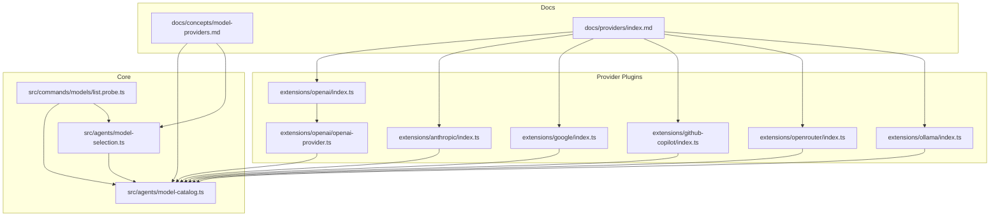
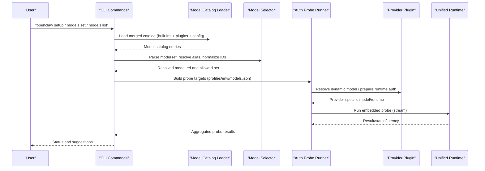
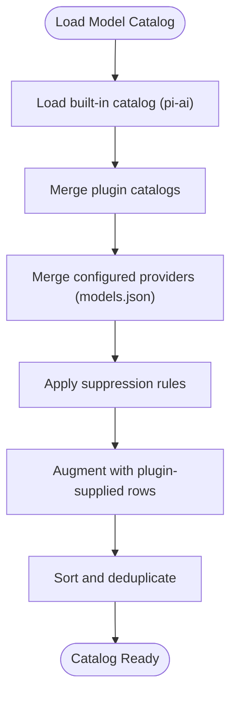
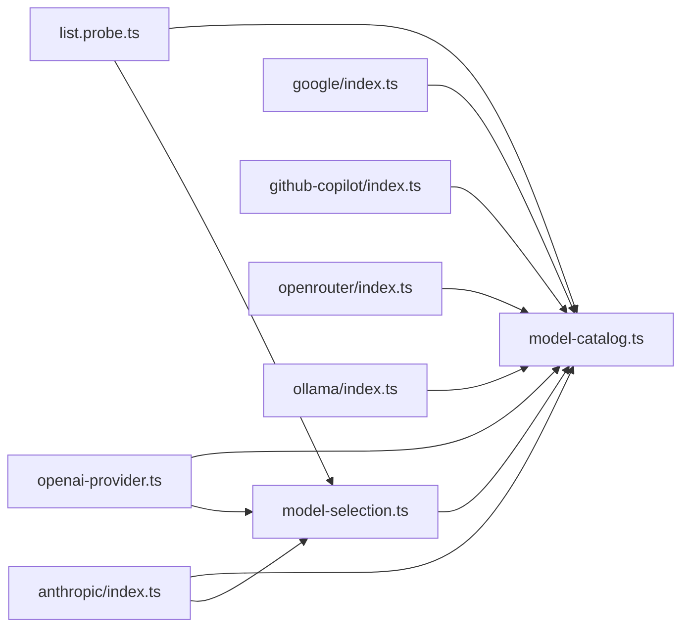

# Provider Overview

<cite>
**Referenced Files in This Document**
- [model-providers.md](file://docs/concepts/model-providers.md)
- [index.md](file://docs/providers/index.md)
- [model-catalog.ts](file://src/agents/model-catalog.ts)
- [model-selection.ts](file://src/agents/model-selection.ts)
- [list.probe.ts](file://src/commands/models/list.probe.ts)
- [openai/index.ts](file://extensions/openai/index.ts)
- [openai-provider.ts](file://extensions/openai/openai-provider.ts)
- [anthropic/index.ts](file://extensions/anthropic/index.ts)
- [google/index.ts](file://extensions/google/index.ts)
- [github-copilot/index.ts](file://extensions/github-copilot/index.ts)
- [openrouter/index.ts](file://extensions/openrouter/index.ts)
- [ollama/index.ts](file://extensions/ollama/index.ts)
</cite>

## Table of Contents
1. [Introduction](#introduction)
2. [Project Structure](#project-structure)
3. [Core Components](#core-components)
4. [Architecture Overview](#architecture-overview)
5. [Detailed Component Analysis](#detailed-component-analysis)
6. [Dependency Analysis](#dependency-analysis)
7. [Performance Considerations](#performance-considerations)
8. [Troubleshooting Guide](#troubleshooting-guide)
9. [Conclusion](#conclusion)

## Introduction
This document explains OpenClaw’s model provider architecture and selection process. It covers the provider ecosystem, authentication patterns, model configuration workflow, provider discovery, model aliasing, provider-specific capabilities, and how providers integrate into the agent system. Practical examples show provider setup, model selection syntax, and configuration patterns. It also outlines provider catalog structure, compatibility considerations, feature differences, switching strategies, failover mechanisms, and cost optimization techniques.

## Project Structure
OpenClaw organizes providers as plugins under the extensions directory. Each provider plugin registers its identity, authentication methods, catalog, and runtime behaviors. Core modules handle model catalog loading, model selection, and provider probing.

**Diagram sources**
- [model-providers.md:1-595](file://docs/concepts/model-providers.md#L1-L595)
- [index.md:1-63](file://docs/providers/index.md#L1-L63)
- [model-catalog.ts:1-291](file://src/agents/model-catalog.ts#L1-L291)
- [model-selection.ts:1-729](file://src/agents/model-selection.ts#L1-L729)
- [list.probe.ts:1-615](file://src/commands/models/list.probe.ts#L1-L615)
- [openai/index.ts:1-17](file://extensions/openai/index.ts#L1-L17)
- [openai-provider.ts:1-153](file://extensions/openai/openai-provider.ts#L1-L153)
- [anthropic/index.ts:1-319](file://extensions/anthropic/index.ts#L1-L319)
- [google/index.ts:1-47](file://extensions/google/index.ts#L1-L47)
- [github-copilot/index.ts:1-142](file://extensions/github-copilot/index.ts#L1-L142)
- [openrouter/index.ts:1-136](file://extensions/openrouter/index.ts#L1-L136)
- [ollama/index.ts:1-125](file://extensions/ollama/index.ts#L1-L125)

**Section sources**
- [model-providers.md:1-595](file://docs/concepts/model-providers.md#L1-L595)
- [index.md:1-63](file://docs/providers/index.md#L1-L63)

## Core Components
- Unified provider registration: Plugins register providers via an SDK and define capabilities, auth, discovery, and runtime behaviors.
- Model catalog: Centralized catalog of providers and models, augmented by plugins and merged with user configuration.
- Model selection: Parses model references, resolves aliases, normalizes provider/model IDs, enforces allowlists, and builds allowed sets.
- Provider probing: Validates auth and connectivity across profiles and environments, reporting statuses and latencies.

**Section sources**
- [model-catalog.ts:1-291](file://src/agents/model-catalog.ts#L1-L291)
- [model-selection.ts:1-729](file://src/agents/model-selection.ts#L1-L729)
- [list.probe.ts:1-615](file://src/commands/models/list.probe.ts#L1-L615)

## Architecture Overview
OpenClaw’s provider architecture separates concerns:
- Providers own their catalog, dynamic model resolution, runtime auth, and transport/stream wrapping.
- Core manages model catalog assembly, selection, and probing.
- Agents consume resolved models and execute inference through a unified runtime.

**Diagram sources**
- [model-catalog.ts:145-259](file://src/agents/model-catalog.ts#L145-L259)
- [model-selection.ts:273-388](file://src/agents/model-selection.ts#L273-L388)
- [list.probe.ts:241-578](file://src/commands/models/list.probe.ts#L241-L578)
- [openai-provider.ts:86-153](file://extensions/openai/openai-provider.ts#L86-L153)
- [anthropic/index.ts:261-319](file://extensions/anthropic/index.ts#L261-L319)
- [google/index.ts:11-47](file://extensions/google/index.ts#L11-L47)
- [github-copilot/index.ts:75-142](file://extensions/github-copilot/index.ts#L75-L142)
- [openrouter/index.ts:77-136](file://extensions/openrouter/index.ts#L77-L136)
- [ollama/index.ts:19-125](file://extensions/ollama/index.ts#L19-L125)

## Detailed Component Analysis

### Provider Ecosystem and Registration
- Provider plugins register via SDK APIs and define:
  - Identity, label, docs path, and environment variable hints.
  - Authentication methods (interactive and non-interactive).
  - Wizard setup/model picker entries.
  - Catalog augmentation and discovery.
  - Dynamic model resolution, normalization, and runtime auth.
  - Capability hints, thinking policies, cache TTL eligibility, and usage integration.

Examples:
- OpenAI plugin registers both OpenAI and OpenAI Codex providers.
- Anthropic plugin defines setup-token auth and forward-compatible model resolution.
- Google plugin registers Google AI Studio and Gemini CLI providers.
- GitHub Copilot plugin resolves runtime auth and usage snapshots.
- OpenRouter plugin dynamically builds models and wraps streams for routing and caching.
- Ollama plugin discovers local/remote models and integrates with the wizard.

**Section sources**
- [openai/index.ts:1-17](file://extensions/openai/index.ts#L1-L17)
- [openai-provider.ts:86-153](file://extensions/openai/openai-provider.ts#L86-L153)
- [anthropic/index.ts:261-319](file://extensions/anthropic/index.ts#L261-L319)
- [google/index.ts:11-47](file://extensions/google/index.ts#L11-L47)
- [github-copilot/index.ts:75-142](file://extensions/github-copilot/index.ts#L75-L142)
- [openrouter/index.ts:77-136](file://extensions/openrouter/index.ts#L77-L136)
- [ollama/index.ts:19-125](file://extensions/ollama/index.ts#L19-L125)

### Authentication Patterns
- Interactive and non-interactive auth flows per provider.
- Profiles store credentials; ordering and eligibility are enforced.
- Environment variables and secret references are supported.
- OAuth tokens and runtime token exchanges are handled per provider.

Highlights:
- Anthropic setup-token auth with wizard integration.
- GitHub Copilot runtime token exchange and usage snapshot retrieval.
- OpenRouter and OpenAI support API keys and environment-based auth.
- Ollama supports local/remote discovery and default API key for local instances.

**Section sources**
- [anthropic/index.ts:123-259](file://extensions/anthropic/index.ts#L123-L259)
- [github-copilot/index.ts:20-52](file://extensions/github-copilot/index.ts#L20-L52)
- [github-copilot/index.ts:123-137](file://extensions/github-copilot/index.ts#L123-L137)
- [openrouter/index.ts:82-103](file://extensions/openrouter/index.ts#L82-L103)
- [openai-provider.ts:92-93](file://extensions/openai/openai-provider.ts#L92-L93)
- [ollama/index.ts:30-63](file://extensions/ollama/index.ts#L30-L63)

### Model Configuration Workflow
- Model references use provider/model syntax.
- Aliases map human-friendly names to canonical model keys.
- Allowlists restrict selectable models; fallbacks expand the set.
- Normalization handles provider-specific model ID rules and legacy compatibility.

Key behaviors:
- Alias indexing and resolution.
- Provider/model normalization and legacy key handling.
- Default model resolution with fallback to configured providers’ first model.

**Section sources**
- [model-selection.ts:273-398](file://src/agents/model-selection.ts#L273-L398)
- [model-selection.ts:420-558](file://src/agents/model-selection.ts#L420-L558)
- [model-selection.ts:632-681](file://src/agents/model-selection.ts#L632-L681)

### Provider Discovery Mechanism
- Built-in catalogs are loaded and merged with plugin-supplied catalogs.
- Configured providers (models.json) can opt-in models for non-native providers.
- Discovery routines augment provider definitions (e.g., Ollama detection, OpenRouter catalog fetch).

**Diagram sources**
- [model-catalog.ts:145-259](file://src/agents/model-catalog.ts#L145-L259)

**Section sources**
- [model-catalog.ts:61-132](file://src/agents/model-catalog.ts#L61-L132)
- [model-catalog.ts:175-236](file://src/agents/model-catalog.ts#L175-L236)

### Model Aliasing System
- Users can define aliases for model keys in configuration.
- Aliases are indexed and resolved before selection.
- Multiple aliases can map to the same canonical key.

Practical effect:
- Simplifies user-facing references while preserving canonical IDs internally.

**Section sources**
- [model-selection.ts:273-299](file://src/agents/model-selection.ts#L273-L299)
- [model-selection.ts:301-322](file://src/agents/model-selection.ts#L301-L322)

### Provider-Specific Capabilities
- Provider families and quirks are declared to guide thinking defaults, reasoning, and compatibility.
- Examples include provider-family hints, drop-thinking-block hints, and modern model matching.

**Section sources**
- [anthropic/index.ts:297-310](file://extensions/anthropic/index.ts#L297-L310)
- [openrouter/index.ts:108-112](file://extensions/openrouter/index.ts#L108-L112)
- [openai-provider.ts:100-104](file://extensions/openai/openai-provider.ts#L100-L104)

### Unified Interface Abstraction and Agent Integration
- Providers implement a common interface: catalog, dynamic model resolution, normalization, capability hints, extra param preparation, stream wrapping, cache TTL eligibility, missing auth messaging, suppression, catalog augmentation, thinking policies, modern model matching, runtime auth, usage auth, and snapshot fetching.
- Agents consume resolved models and execute inference through a unified runtime, ensuring consistent behavior across providers.

**Section sources**
- [model-providers.md:35-72](file://docs/concepts/model-providers.md#L35-L72)
- [openai-provider.ts:86-153](file://extensions/openai/openai-provider.ts#L86-L153)
- [anthropic/index.ts:266-314](file://extensions/anthropic/index.ts#L266-L314)
- [openrouter/index.ts:82-131](file://extensions/openrouter/index.ts#L82-L131)
- [github-copilot/index.ts:80-137](file://extensions/github-copilot/index.ts#L80-L137)
- [google/index.ts:17-27](file://extensions/google/index.ts#L17-L27)
- [ollama/index.ts:24-121](file://extensions/ollama/index.ts#L24-L121)

## Dependency Analysis
Provider plugins depend on core modules for:
- Model catalog loading and merging.
- Model selection and alias resolution.
- Auth profile management and environment resolution.
- Embedded runtime for probing.

**Diagram sources**
- [model-selection.ts:1-729](file://src/agents/model-selection.ts#L1-L729)
- [model-catalog.ts:1-291](file://src/agents/model-catalog.ts#L1-L291)
- [list.probe.ts:1-615](file://src/commands/models/list.probe.ts#L1-L615)
- [openai-provider.ts:1-153](file://extensions/openai/openai-provider.ts#L1-L153)
- [anthropic/index.ts:1-319](file://extensions/anthropic/index.ts#L1-L319)
- [google/index.ts:1-47](file://extensions/google/index.ts#L1-L47)
- [github-copilot/index.ts:1-142](file://extensions/github-copilot/index.ts#L1-L142)
- [openrouter/index.ts:1-136](file://extensions/openrouter/index.ts#L1-L136)
- [ollama/index.ts:1-125](file://extensions/ollama/index.ts#L1-L125)

**Section sources**
- [model-selection.ts:1-729](file://src/agents/model-selection.ts#L1-L729)
- [model-catalog.ts:1-291](file://src/agents/model-catalog.ts#L1-L291)
- [list.probe.ts:1-615](file://src/commands/models/list.probe.ts#L1-L615)

## Performance Considerations
- Use provider-specific transport preferences (e.g., WebSocket vs SSE) to optimize latency for supported providers.
- Prefer modern models and providers with cache TTL eligibility to reduce repeated prompt reads.
- Limit probing concurrency and timeouts to balance responsiveness and resource usage.
- Configure usage quotas and billing alerts to avoid unexpected overages.

[No sources needed since this section provides general guidance]

## Troubleshooting Guide
Common issues and remedies:
- Missing or expired credentials: Auth probe reports reasons (missing credential, expired, unresolved ref) and suggests corrective actions.
- Rate limit and billing failures: Retries are attempted only for rate-limit conditions; otherwise, immediate failure prevents unnecessary retries.
- Model not allowed: Enforce allowlists and fallbacks to ensure only configured models are used.
- Provider switching: Use model selection syntax and aliases to switch providers; leverage probing to validate connectivity and auth.

**Section sources**
- [list.probe.ts:100-122](file://src/commands/models/list.probe.ts#L100-L122)
- [list.probe.ts:157-190](file://src/commands/models/list.probe.ts#L157-L190)
- [list.probe.ts:214-239](file://src/commands/models/list.probe.ts#L214-L239)
- [model-selection.ts:462-558](file://src/agents/model-selection.ts#L462-L558)

## Conclusion
OpenClaw’s provider architecture cleanly separates provider-specific logic from core orchestration. Providers register capabilities, manage auth and discovery, and integrate seamlessly with the unified runtime. Users benefit from flexible model selection, robust probing, and consistent behavior across providers, enabling reliable switching, failover, and cost-conscious operations.