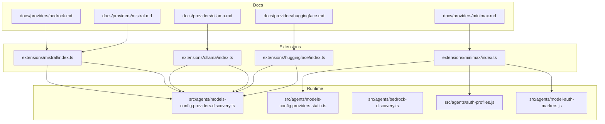
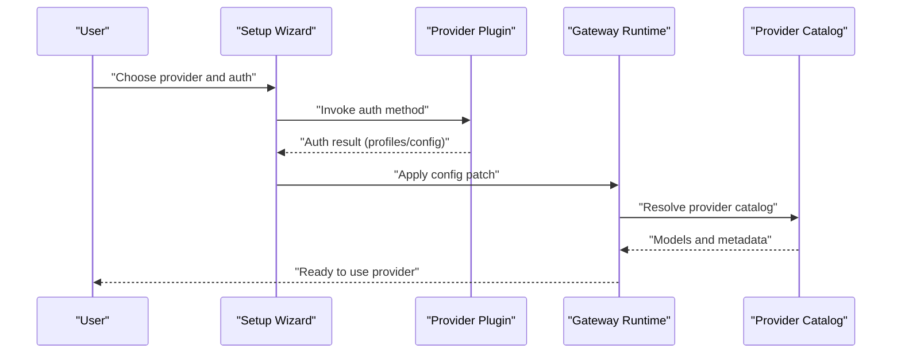
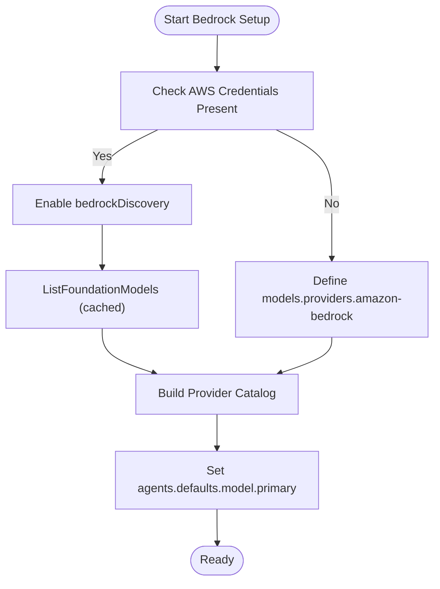
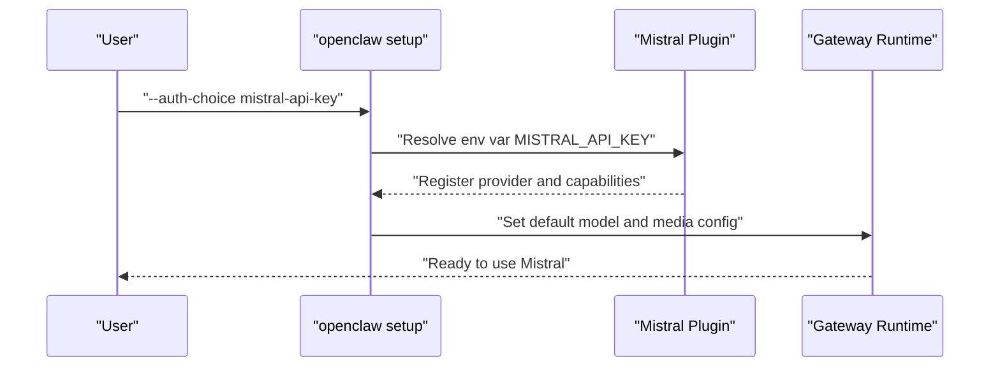
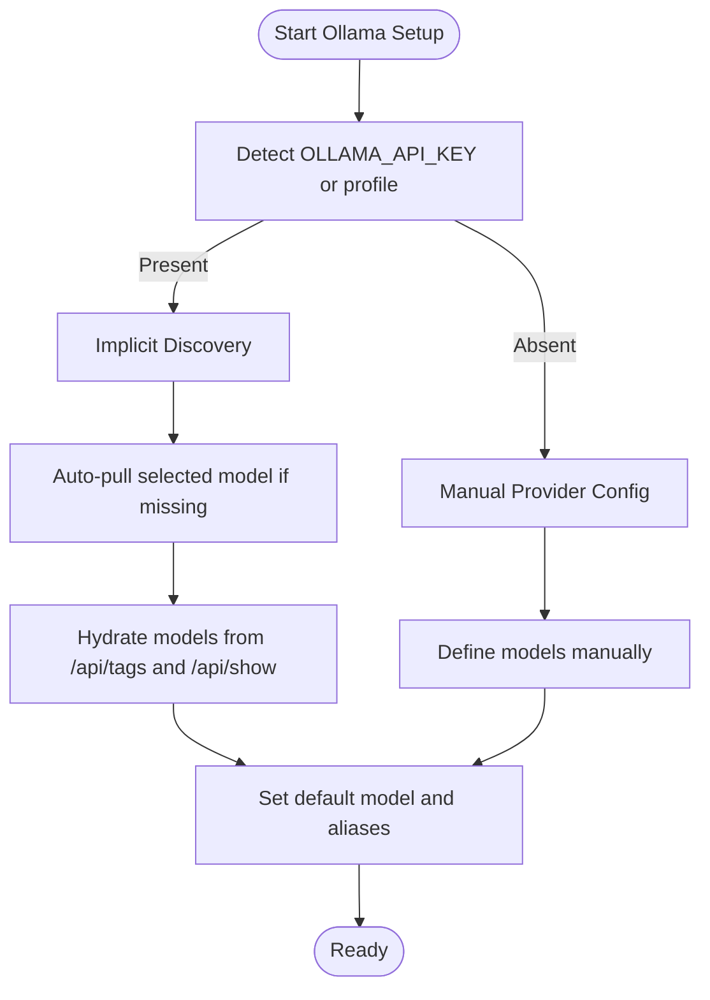
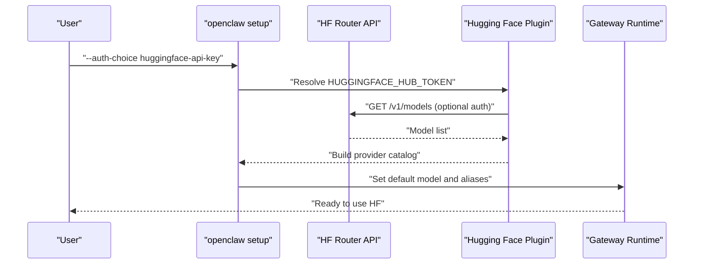
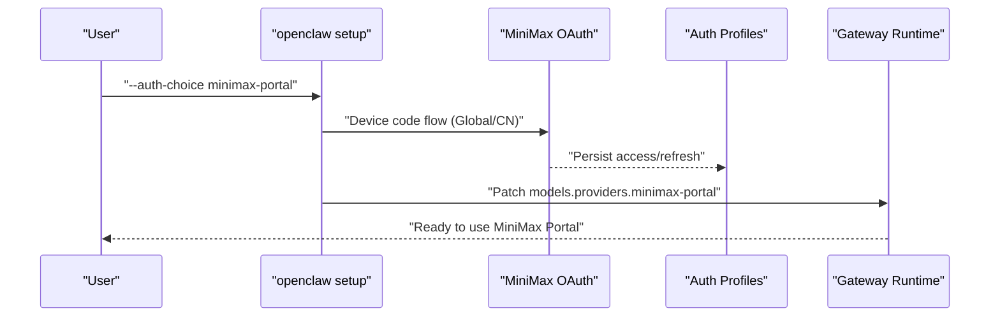
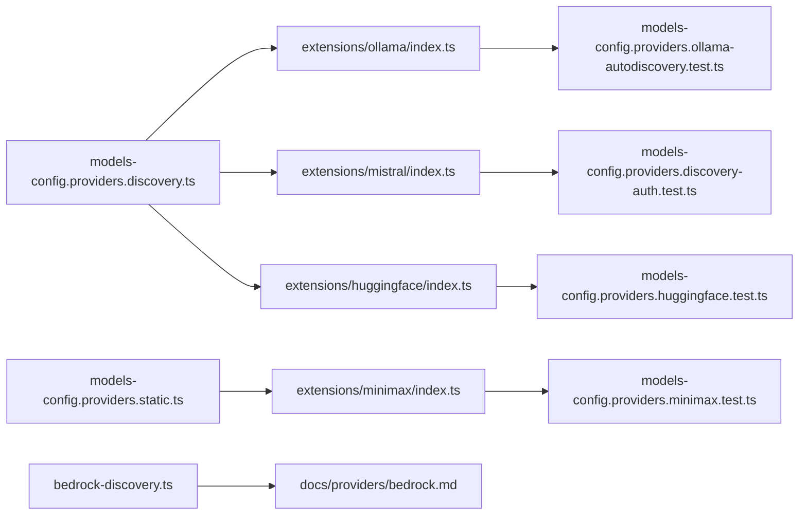

# Specialized Providers

<cite>
**Referenced Files in This Document**
- [bedrock.md](file://docs/providers/bedrock.md)
- [mistral.md](file://docs/providers/mistral.md)
- [ollama.md](file://docs/providers/ollama.md)
- [huggingface.md](file://docs/providers/huggingface.md)
- [minimax.md](file://docs/providers/minimax.md)
- [index.ts](file://extensions/mistral/index.ts)
- [index.ts](file://extensions/ollama/index.ts)
- [index.ts](file://extensions/huggingface/index.ts)
- [index.ts](file://extensions/minimax/index.ts)
- [models-config.providers.discovery.ts](file://src/agents/models-config.providers.discovery.ts)
- [models-config.providers.static.ts](file://src/agents/models-config.providers.static.ts)
- [bedrock-discovery.ts](file://src/agents/bedrock-discovery.ts)
- [minimax-portal-auth.ts](file://src/agents/model-auth-markers.js)
- [auth-profiles.js](file://src/agents/auth-profiles.js)
- [models-config.providers.discovery-auth.test.ts](file://src/agents/models-config.providers.discovery-auth.test.ts)
- [models-config.providers.ollama-autodiscovery.test.ts](file://src/agents/models-config.providers.ollama-autodiscovery.test.ts)
- [models-config.providers.minimax.test.ts](file://src/agents/models-config.providers.minimax.test.ts)
- [models-config.providers.huggingface.test.ts](file://src/agents/models-config.providers.huggingface.test.ts)
</cite>

## Table of Contents
1. [Introduction](#introduction)
2. [Project Structure](#project-structure)
3. [Core Components](#core-components)
4. [Architecture Overview](#architecture-overview)
5. [Detailed Component Analysis](#detailed-component-analysis)
6. [Dependency Analysis](#dependency-analysis)
7. [Performance Considerations](#performance-considerations)
8. [Troubleshooting Guide](#troubleshooting-guide)
9. [Conclusion](#conclusion)

## Introduction
This document provides a comprehensive guide to specialized AI provider integrations in OpenClaw. It focuses on four providers: AWS Bedrock, Mistral AI, Ollama, Hugging Face Inference, and MiniMax. For each provider, it documents authentication methods, model catalogs, configuration patterns, and integration workflows. It also covers unique features, limitations, performance characteristics, and troubleshooting steps to help you deploy reliable and optimized AI-powered experiences.

## Project Structure
OpenClaw organizes provider integrations across:
- Provider documentation under docs/providers
- Plugin implementations under extensions/<provider>
- Runtime configuration and discovery logic under src/agents

**Diagram sources**
- [bedrock.md](file://docs/providers/bedrock.md)
- [mistral.md](file://docs/providers/mistral.md)
- [ollama.md](file://docs/providers/ollama.md)
- [huggingface.md](file://docs/providers/huggingface.md)
- [minimax.md](file://docs/providers/minimax.md)
- [index.ts](file://extensions/mistral/index.ts)
- [index.ts](file://extensions/ollama/index.ts)
- [index.ts](file://extensions/huggingface/index.ts)
- [index.ts](file://extensions/minimax/index.ts)
- [models-config.providers.discovery.ts](file://src/agents/models-config.providers.discovery.ts)
- [models-config.providers.static.ts](file://src/agents/models-config.providers.static.ts)
- [bedrock-discovery.ts](file://src/agents/bedrock-discovery.ts)
- [auth-profiles.js](file://src/agents/auth-profiles.js)
- [minimax-portal-auth.ts](file://src/agents/model-auth-markers.js)

**Section sources**
- [bedrock.md](file://docs/providers/bedrock.md)
- [mistral.md](file://docs/providers/mistral.md)
- [ollama.md](file://docs/providers/ollama.md)
- [huggingface.md](file://docs/providers/huggingface.md)
- [minimax.md](file://docs/providers/minimax.md)
- [index.ts](file://extensions/mistral/index.ts)
- [index.ts](file://extensions/ollama/index.ts)
- [index.ts](file://extensions/huggingface/index.ts)
- [index.ts](file://extensions/minimax/index.ts)

## Core Components
- Provider plugins: Each provider exposes a plugin that registers authentication, discovery, catalog, and wizard flows.
- Discovery and static providers: Discovery providers dynamically build catalogs (e.g., Ollama, Hugging Face), while static providers ship fixed catalogs (e.g., MiniMax).
- Bedrock discovery: Separate Bedrock catalog discovery leverages AWS SDK to list foundation models supporting streaming and text output.

Key responsibilities:
- Authentication: Env vars, profiles, OAuth, or API keys
- Catalog discovery: Dynamic model lists and metadata hydration
- Configuration: Provider blocks, model refs, and aliases
- Usage: Optional usage snapshots and cost tracking

**Section sources**
- [index.ts](file://extensions/mistral/index.ts)
- [index.ts](file://extensions/ollama/index.ts)
- [index.ts](file://extensions/huggingface/index.ts)
- [index.ts](file://extensions/minimax/index.ts)
- [models-config.providers.discovery.ts](file://src/agents/models-config.providers.discovery.ts)
- [models-config.providers.static.ts](file://src/agents/models-config.providers.static.ts)
- [bedrock-discovery.ts](file://src/agents/bedrock-discovery.ts)

## Architecture Overview
The provider integration architecture separates concerns between plugin registration, runtime discovery, and configuration merging.

**Diagram sources**
- [index.ts](file://extensions/mistral/index.ts)
- [index.ts](file://extensions/ollama/index.ts)
- [index.ts](file://extensions/huggingface/index.ts)
- [index.ts](file://extensions/minimax/index.ts)
- [models-config.providers.discovery.ts](file://src/agents/models-config.providers.discovery.ts)
- [models-config.providers.static.ts](file://src/agents/models-config.providers.static.ts)

## Detailed Component Analysis

### AWS Bedrock Integration
- Authentication: Uses AWS SDK default credential chain; supports env vars, shared config, instance roles, and optional bearer token.
- Discovery: Automatically lists foundation models supporting streaming and text output using ListFoundationModels and caches results.
- Configuration: Provider block with baseUrl, api, auth, and explicit models; model refs use provider-specific ids.
- IAM permissions: invoke model APIs and model discovery; managed policy AmazonBedrockFullAccess is acceptable.
- EC2 instance roles: Workaround via AWS_PROFILE to signal credentials; actual auth uses IMDS.

**Diagram sources**
- [bedrock.md](file://docs/providers/bedrock.md)
- [bedrock-discovery.ts](file://src/agents/bedrock-discovery.ts)

**Section sources**
- [bedrock.md](file://docs/providers/bedrock.md)
- [bedrock-discovery.ts](file://src/agents/bedrock-discovery.ts)

### Mistral AI Setup
- Authentication: Uses MISTRAL_API_KEY environment variable.
- Models: Supports text/image routing and audio transcription via Voxtral for media understanding.
- Configuration: Minimal env and model ref; default model and media transcription defaults are documented.
- Plugin capabilities: Transcript tool call ID mode and model hints for transcription.

**Diagram sources**
- [mistral.md](file://docs/providers/mistral.md)
- [index.ts](file://extensions/mistral/index.ts)

**Section sources**
- [mistral.md](file://docs/providers/mistral.md)
- [index.ts](file://extensions/mistral/index.ts)

### Ollama Local Model Hosting
- Authentication: Any non-empty value accepted; environment variable OLLAMA_API_KEY enables implicit discovery.
- Discovery: Auto-detects local models via /api/tags and /api/show; populates context windows and marks reasoning models heuristically.
- Configuration: Two modes—implicit (auto-discovery) and explicit (manual models).
- Cloud models: Supported via Ollama.com sign-in; wizard guides selection and pulls missing models.
- Native vs OpenAI-compatible mode: Native Ollama API (/api/chat) supports streaming and tool-calling; OpenAI-compatible mode may lack reliable tool-calling.

**Diagram sources**
- [ollama.md](file://docs/providers/ollama.md)
- [index.ts](file://extensions/ollama/index.ts)

**Section sources**
- [ollama.md](file://docs/providers/ollama.md)
- [index.ts](file://extensions/ollama/index.ts)

### Hugging Face Inference API
- Authentication: Fine-grained token via HUGGINGFACE_HUB_TOKEN or HF_TOKEN with permission to make calls to Inference Providers.
- Discovery: Calls router endpoint to list models; merges with built-in catalog; supports model aliases and policy suffixes (:fastest, :cheapest, :provider).
- Configuration: Provider block with models and aliases; model refs use Hub-style IDs with optional policy suffixes.
- Environment: Ensure token is available to the gateway process (daemon or shell env).

**Diagram sources**
- [huggingface.md](file://docs/providers/huggingface.md)
- [index.ts](file://extensions/huggingface/index.ts)

**Section sources**
- [huggingface.md](file://docs/providers/huggingface.md)
- [index.ts](file://extensions/huggingface/index.ts)

### MiniMax Authentication and Configuration
- OAuth (Coding Plan): Bundled OAuth plugin supports device code flows for Global and CN regions; stores access/refresh tokens and auto-refreshes.
- API key: Anthropic-compatible base URL and models; supports M2.5 and high-speed variants.
- Fallback usage: Optional usage snapshot fetching via API key or code plan key.
- Local option: Manual configuration for LM Studio-compatible endpoint.

**Diagram sources**
- [minimax.md](file://docs/providers/minimax.md)
- [index.ts](file://extensions/minimax/index.ts)
- [auth-profiles.js](file://src/agents/auth-profiles.js)
- [minimax-portal-auth.ts](file://src/agents/model-auth-markers.js)

**Section sources**
- [minimax.md](file://docs/providers/minimax.md)
- [index.ts](file://extensions/minimax/index.ts)
- [auth-profiles.js](file://src/agents/auth-profiles.js)
- [minimax-portal-auth.ts](file://src/agents/model-auth-markers.js)

## Dependency Analysis
Provider integrations rely on:
- Plugin registration for auth, discovery, catalog, and wizard flows
- Runtime discovery modules for dynamic catalogs
- Static provider builders for fixed catalogs
- Auth profiles and markers for OAuth and API keys

**Diagram sources**
- [models-config.providers.discovery.ts](file://src/agents/models-config.providers.discovery.ts)
- [models-config.providers.static.ts](file://src/agents/models-config.providers.static.ts)
- [bedrock-discovery.ts](file://src/agents/bedrock-discovery.ts)
- [index.ts](file://extensions/ollama/index.ts)
- [index.ts](file://extensions/mistral/index.ts)
- [index.ts](file://extensions/huggingface/index.ts)
- [index.ts](file://extensions/minimax/index.ts)
- [models-config.providers.ollama-autodiscovery.test.ts](file://src/agents/models-config.providers.ollama-autodiscovery.test.ts)
- [models-config.providers.discovery-auth.test.ts](file://src/agents/models-config.providers.discovery-auth.test.ts)
- [models-config.providers.huggingface.test.ts](file://src/agents/models-config.providers.huggingface.test.ts)
- [models-config.providers.minimax.test.ts](file://src/agents/models-config.providers.minimax.test.ts)

**Section sources**
- [models-config.providers.discovery.ts](file://src/agents/models-config.providers.discovery.ts)
- [models-config.providers.static.ts](file://src/agents/models-config.providers.static.ts)
- [bedrock-discovery.ts](file://src/agents/bedrock-discovery.ts)
- [index.ts](file://extensions/ollama/index.ts)
- [index.ts](file://extensions/mistral/index.ts)
- [index.ts](file://extensions/huggingface/index.ts)
- [index.ts](file://extensions/minimax/index.ts)

## Performance Considerations
- Bedrock
  - Model access control and region selection impact latency and availability.
  - Streaming and text output discovery reduces overhead by caching model metadata.
- Mistral
  - Embeddings and transcription endpoints differ; choose appropriate paths for memory and media tasks.
- Ollama
  - Native API supports streaming and tool-calling; avoid OpenAI-compatible mode if tool-calling reliability is required.
  - Context windows and max tokens influence throughput; tune via discovery or explicit config.
- Hugging Face
  - Policy suffixes (:fastest, :cheapest) let you optimize for speed or cost; router chooses backend accordingly.
- MiniMax
  - Highspeed variant trades output cost for speed; choose based on workload constraints.

[No sources needed since this section provides general guidance]

## Troubleshooting Guide
- Bedrock
  - Ensure model access is enabled and ListFoundationModels permission is granted.
  - For EC2 instance roles, set AWS_PROFILE to signal credentials; IAM role must include invoke and discovery permissions.
- Mistral
  - Confirm MISTRAL_API_KEY is set; verify default model and media transcription paths.
- Ollama
  - Verify Ollama is running and accessible; ensure OLLAMA_API_KEY is set for implicit discovery.
  - Pull missing models locally or define them explicitly.
- Hugging Face
  - Ensure fine-grained token has the required permission; verify token availability to the gateway process.
  - If model list is empty, check token validity or fallback to built-in catalog.
- MiniMax
  - For OAuth failures, verify portal access and retry device code flow.
  - If “Unknown model” errors occur, ensure provider is configured or auth profile/env key is present.

**Section sources**
- [bedrock.md](file://docs/providers/bedrock.md)
- [mistral.md](file://docs/providers/mistral.md)
- [ollama.md](file://docs/providers/ollama.md)
- [huggingface.md](file://docs/providers/huggingface.md)
- [minimax.md](file://docs/providers/minimax.md)

## Conclusion
OpenClaw’s specialized provider integrations deliver robust, configurable, and extensible AI model access across AWS Bedrock, Mistral AI, Ollama, Hugging Face Inference, and MiniMax. By leveraging provider plugins, dynamic discovery, and clear configuration patterns, you can tailor model catalogs, optimize performance, and troubleshoot issues efficiently. Use the provider-specific guidance here to onboard quickly, configure reliably, and operate at scale.