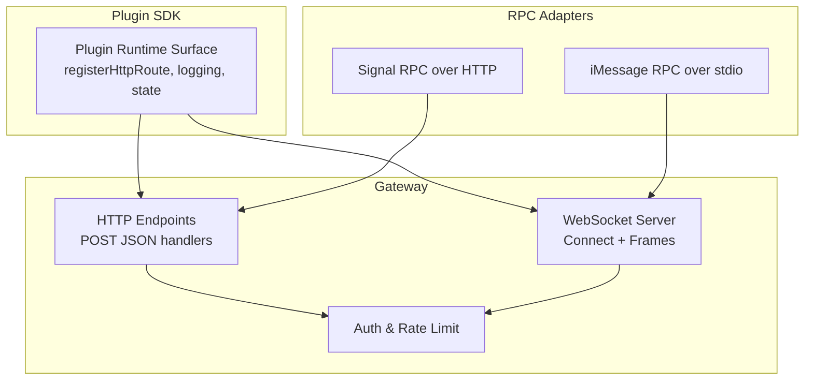
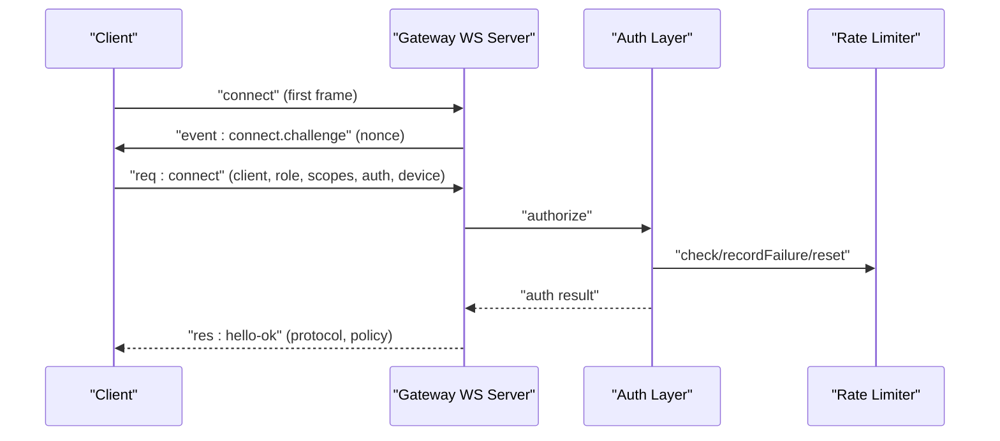
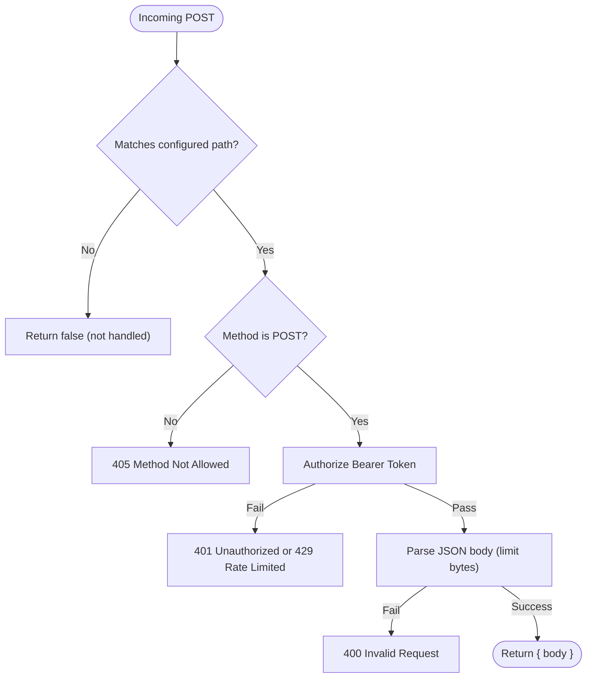
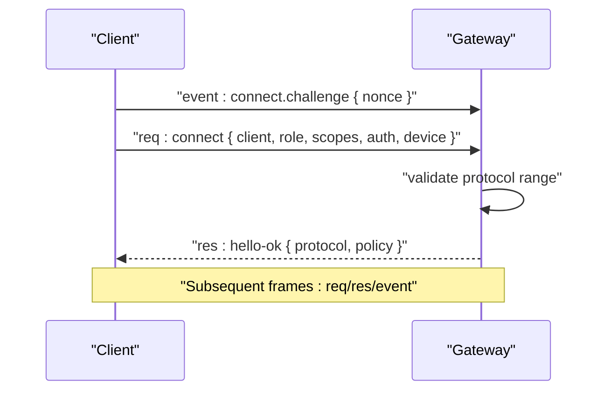
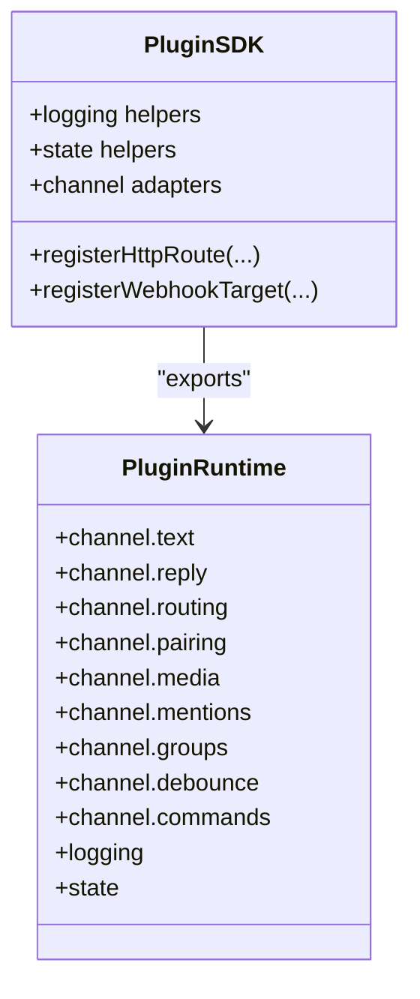
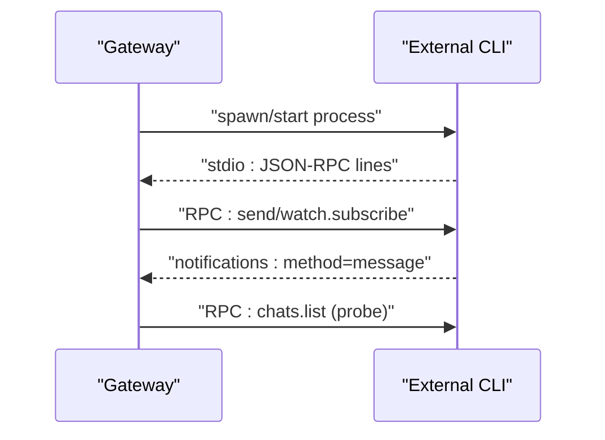
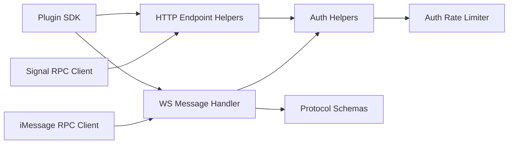

# API Reference

<cite>
**Referenced Files in This Document**
- [http-endpoint-helpers.ts](file://src/gateway/http-endpoint-helpers.ts)
- [http-auth-helpers.ts](file://src/gateway/http-auth-helpers.ts)
- [http-common.ts](file://src/gateway/http-common.ts)
- [auth-rate-limit.ts](file://src/gateway/auth-rate-limit.ts)
- [auth.ts](file://src/gateway/auth.ts)
- [protocol/index.ts](file://src/gateway/protocol/index.ts)
- [protocol/schema.ts](file://src/gateway/protocol/schema.ts)
- [protocol/schema/frames.ts](file://src/gateway/protocol/schema/frames.ts)
- [protocol.md](file://docs/gateway/protocol.md)
- [server.auth.default-token.suite.ts](file://src/gateway/server.auth.default-token.suite.ts)
- [server.ws-connection/message-handler.ts](file://src/gateway/server.ws-connection/message-handler.ts)
- [index.ts](file://src/plugin-sdk/index.ts)
- [plugin-sdk.md](file://docs/refactor/plugin-sdk.md)
- [plugin.md](file://docs/tools/plugin.md)
- [rpc.md](file://docs/reference/rpc.md)
- [signal/client.ts](file://src/signal/client.ts)
- [client.ts](file://src/imessage/client.ts)
- [BridgeFrames.swift](file://apps/shared/OpenClawKit/Sources/OpenClawKit/BridgeFrames.swift)
- [GatewayWebSocketTestSupport.swift](file://apps/macos/Tests/OpenClawIPCTests/GatewayWebSocketTestSupport.swift)
- [GatewayNodeSessionTests.swift](file://apps/shared/OpenClawKit/Tests/OpenClawKitTests/GatewayNodeSessionTests.swift)
- [http-auth.ts](file://src/browser/http-auth.ts)
</cite>

## Table of Contents
1. [Introduction](#introduction)
2. [Project Structure](#project-structure)
3. [Core Components](#core-components)
4. [Architecture Overview](#architecture-overview)
5. [Detailed Component Analysis](#detailed-component-analysis)
6. [Dependency Analysis](#dependency-analysis)
7. [Performance Considerations](#performance-considerations)
8. [Troubleshooting Guide](#troubleshooting-guide)
9. [Conclusion](#conclusion)
10. [Appendices](#appendices)

## Introduction
This document provides a comprehensive API reference for OpenClaw’s public interfaces:
- HTTP API: request/response schemas, authentication, and error handling
- WebSocket API: connection lifecycle, framing, roles/scopes, and events
- Plugin SDK: exported runtime surface and plugin registration
- RPC adapters: protocol specifications and client implementation guidelines for external integrations

It includes authentication mechanisms, rate limiting, versioning, practical examples, and integration patterns tailored for implementers.

## Project Structure
OpenClaw exposes its public APIs primarily through:
- Gateway HTTP endpoints and WebSocket server
- Plugin SDK exports and plugin registration
- RPC adapters for external CLIs (signal-cli, legacy imsg)

**Diagram sources**
- [http-endpoint-helpers.ts](file://src/gateway/http-endpoint-helpers.ts#L1-L48)
- [server.ws-connection/message-handler.ts](file://src/gateway/server.ws-connection/message-handler.ts#L436-L478)
- [auth-rate-limit.ts](file://src/gateway/auth-rate-limit.ts#L1-L117)
- [index.ts](file://src/plugin-sdk/index.ts#L1-L812)
- [rpc.md](file://docs/reference/rpc.md#L1-L44)

**Section sources**
- [http-endpoint-helpers.ts](file://src/gateway/http-endpoint-helpers.ts#L1-L48)
- [protocol.md](file://docs/gateway/protocol.md#L1-L261)

## Core Components
- HTTP API: POST-only JSON endpoints with bearer token authentication and standardized error responses
- WebSocket API: JSON text frames with typed request/response/event frames, role-scoped access, and device-based authentication
- Plugin SDK: unified exports for plugin authors, including HTTP route registration and runtime helpers
- RPC adapters: two patterns—HTTP daemon (signal-cli) and stdio child process (legacy imsg)

**Section sources**
- [http-endpoint-helpers.ts](file://src/gateway/http-endpoint-helpers.ts#L1-L48)
- [http-auth-helpers.ts](file://src/gateway/http-auth-helpers.ts#L1-L30)
- [http-common.ts](file://src/gateway/http-common.ts#L36-L71)
- [protocol/schema/frames.ts](file://src/gateway/protocol/schema/frames.ts#L1-L164)
- [protocol.md](file://docs/gateway/protocol.md#L1-L261)
- [index.ts](file://src/plugin-sdk/index.ts#L1-L812)
- [rpc.md](file://docs/reference/rpc.md#L1-L44)

## Architecture Overview
The Gateway acts as the central control plane and node transport. Clients connect over WebSocket and authenticate via bearer tokens or device signatures. HTTP endpoints complement the WebSocket surface for specific operations.

**Diagram sources**
- [protocol.md](file://docs/gateway/protocol.md#L22-L90)
- [server.ws-connection/message-handler.ts](file://src/gateway/server.ws-connection/message-handler.ts#L436-L478)
- [auth.ts](file://src/gateway/auth.ts#L448-L485)
- [auth-rate-limit.ts](file://src/gateway/auth-rate-limit.ts#L1-L117)

## Detailed Component Analysis

### HTTP API
- Endpoint pattern: POST JSON only; path matching and method enforcement handled centrally
- Authentication: Bearer token via Authorization header; supports rate-limited retries
- Error responses: standardized JSON with error type and message; rate limit adds Retry-After header

Key behaviors:
- Path and method gating
- Bearer token extraction and validation
- JSON body parsing with size limits
- Unauthorized and rate-limited responses

**Diagram sources**
- [http-endpoint-helpers.ts](file://src/gateway/http-endpoint-helpers.ts#L7-L47)
- [http-auth-helpers.ts](file://src/gateway/http-auth-helpers.ts#L7-L29)
- [http-common.ts](file://src/gateway/http-common.ts#L36-L71)

**Section sources**
- [http-endpoint-helpers.ts](file://src/gateway/http-endpoint-helpers.ts#L1-L48)
- [http-auth-helpers.ts](file://src/gateway/http-auth-helpers.ts#L1-L30)
- [http-common.ts](file://src/gateway/http-common.ts#L36-L71)
- [http-auth.ts](file://src/browser/http-auth.ts#L1-L48)

### WebSocket API
- Transport: JSON text frames over WebSocket
- Framing: discriminated union of request, response, and event frames
- Handshake: first frame must be a connect request; server emits a connect.challenge event with nonce
- Roles and scopes: operator (control plane) vs node (capability host); scopes gate method access
- Device authentication: clients must sign server nonce and include device identity
- Versioning: clients declare min/max protocol; mismatch closes connection with error

**Diagram sources**
- [protocol.md](file://docs/gateway/protocol.md#L22-L90)
- [protocol/schema/frames.ts](file://src/gateway/protocol/schema/frames.ts#L125-L164)
- [server.ws-connection/message-handler.ts](file://src/gateway/server.ws-connection/message-handler.ts#L436-L478)

**Section sources**
- [protocol.md](file://docs/gateway/protocol.md#L1-L261)
- [protocol/schema/frames.ts](file://src/gateway/protocol/schema/frames.ts#L1-L164)
- [server.auth.default-token.suite.ts](file://src/gateway/server.auth.default-token.suite.ts#L301-L330)

### Plugin SDK API
- Exports include channel adapters, runtime helpers, HTTP/webhook utilities, and plugin registration
- HTTP route registration: plugins register routes with explicit auth requirements
- Runtime surface: logging, state directory resolution, and keyed async queues

**Diagram sources**
- [index.ts](file://src/plugin-sdk/index.ts#L1-L812)
- [plugin-sdk.md](file://docs/refactor/plugin-sdk.md#L45-L145)

**Section sources**
- [index.ts](file://src/plugin-sdk/index.ts#L1-L812)
- [plugin-sdk.md](file://docs/refactor/plugin-sdk.md#L45-L145)
- [plugin.md](file://docs/tools/plugin.md#L139-L144)

### RPC Adapters
Two patterns are used for external CLI integrations:
- Pattern A: HTTP daemon (signal-cli)
  - JSON-RPC over HTTP
  - Event stream via SSE endpoint
  - Health probe endpoint
- Pattern B: stdio child process (legacy: imsg)
  - JSON-RPC line-delimited over stdin/stdout
  - No TCP port, process lifecycle managed by gateway

**Diagram sources**
- [rpc.md](file://docs/reference/rpc.md#L13-L38)
- [signal/client.ts](file://src/signal/client.ts#L70-L107)
- [client.ts](file://src/imessage/client.ts#L196-L255)

**Section sources**
- [rpc.md](file://docs/reference/rpc.md#L1-L44)
- [signal/client.ts](file://src/signal/client.ts#L70-L107)
- [client.ts](file://src/imessage/client.ts#L196-L255)

## Dependency Analysis
- HTTP endpoints depend on bearer authorization and rate limiting
- WebSocket server depends on protocol validation and device authentication
- Plugin SDK depends on channel adapters and runtime stores
- RPC adapters depend on process management and JSON-RPC parsing

**Diagram sources**
- [http-endpoint-helpers.ts](file://src/gateway/http-endpoint-helpers.ts#L1-L48)
- [http-auth-helpers.ts](file://src/gateway/http-auth-helpers.ts#L1-L30)
- [auth-rate-limit.ts](file://src/gateway/auth-rate-limit.ts#L1-L117)
- [server.ws-connection/message-handler.ts](file://src/gateway/server.ws-connection/message-handler.ts#L436-L478)
- [protocol/index.ts](file://src/gateway/protocol/index.ts#L1-L673)
- [index.ts](file://src/plugin-sdk/index.ts#L1-L812)
- [signal/client.ts](file://src/signal/client.ts#L70-L107)
- [client.ts](file://src/imessage/client.ts#L196-L255)

**Section sources**
- [http-endpoint-helpers.ts](file://src/gateway/http-endpoint-helpers.ts#L1-L48)
- [auth-rate-limit.ts](file://src/gateway/auth-rate-limit.ts#L1-L117)
- [protocol/index.ts](file://src/gateway/protocol/index.ts#L1-L673)
- [index.ts](file://src/plugin-sdk/index.ts#L1-L812)

## Performance Considerations
- HTTP body size limits prevent oversized payloads
- WebSocket policy fields (maxPayload, maxBufferedBytes, tickIntervalMs) govern transport behavior
- Rate limiting reduces brute-force authentication attempts
- Protocol validation uses compiled AJV schemas for efficient request/response shape checking

[No sources needed since this section provides general guidance]

## Troubleshooting Guide
Common issues and resolutions:
- Authentication failures
  - Verify bearer token matches configured gateway token
  - Review rate limit status and Retry-After header
- Protocol mismatch
  - Ensure min/max protocol align with server’s PROTOCOL_VERSION
- Device authentication
  - Always wait for connect.challenge and sign nonce
  - Include device identity and signature; confirm timestamp freshness
- RPC adapter errors
  - For signal-cli: check health endpoint and SSE subscription
  - For imsg: ensure process lifecycle is managed and JSON lines are valid

**Section sources**
- [http-common.ts](file://src/gateway/http-common.ts#L36-L71)
- [auth.ts](file://src/gateway/auth.ts#L448-L485)
- [auth-rate-limit.ts](file://src/gateway/auth-rate-limit.ts#L1-L117)
- [protocol.md](file://docs/gateway/protocol.md#L224-L249)
- [rpc.md](file://docs/reference/rpc.md#L1-L44)

## Conclusion
OpenClaw’s public APIs provide a cohesive control plane via WebSocket and complementary HTTP endpoints, with robust authentication and rate limiting. Plugins integrate through a unified SDK, while RPC adapters support external CLI integrations. The protocol is versioned and validated, enabling reliable client implementations across diverse platforms.

[No sources needed since this section summarizes without analyzing specific files]

## Appendices

### HTTP API: Request/Response Schemas and Examples
- Endpoint pattern: POST JSON only; path and method enforced
- Body parsing with configurable max bytes
- Standardized error responses with error type and message
- Example request/response shapes are defined in protocol schemas

**Section sources**
- [http-endpoint-helpers.ts](file://src/gateway/http-endpoint-helpers.ts#L1-L48)
- [http-common.ts](file://src/gateway/http-common.ts#L36-L71)
- [protocol/index.ts](file://src/gateway/protocol/index.ts#L1-L673)

### WebSocket API: Frames and Events
- Framing: request, response, event
- Handshake: connect.challenge followed by connect
- Roles/scopes: operator vs node; scopes gate method access
- Device auth: nonce challenge and signature required
- Versioning: protocol negotiation via min/max protocol

**Section sources**
- [protocol/schema/frames.ts](file://src/gateway/protocol/schema/frames.ts#L1-L164)
- [protocol.md](file://docs/gateway/protocol.md#L1-L261)
- [server.auth.default-token.suite.ts](file://src/gateway/server.auth.default-token.suite.ts#L301-L330)

### Plugin SDK: Registration and Runtime
- Register HTTP routes with explicit auth
- Access logging, state directory resolution, and keyed async queues
- Channel adapters and reply dispatchers

**Section sources**
- [index.ts](file://src/plugin-sdk/index.ts#L1-L812)
- [plugin.md](file://docs/tools/plugin.md#L139-L144)

### RPC Adapters: Protocols and Client Guidelines
- signal-cli: HTTP daemon with JSON-RPC and SSE
- imsg: stdio child process with line-delimited JSON-RPC
- Client guidelines: lifecycle management, resilience, and stable identifiers

**Section sources**
- [rpc.md](file://docs/reference/rpc.md#L1-L44)
- [signal/client.ts](file://src/signal/client.ts#L70-L107)
- [client.ts](file://src/imessage/client.ts#L196-L255)

### Cross-Platform WebSocket Payload Samples
- Swift/macOS test helpers demonstrate hello-ok payload and request frame parsing
- Shared Swift bridge frames define response envelope structure

**Section sources**
- [GatewayWebSocketTestSupport.swift](file://apps/macos/Tests/OpenClawIPCTests/GatewayWebSocketTestSupport.swift#L31-L71)
- [GatewayNodeSessionTests.swift](file://apps/shared/OpenClawKit/Tests/OpenClawKitTests/GatewayNodeSessionTests.swift#L104-L152)
- [BridgeFrames.swift](file://apps/shared/OpenClawKit/Sources/OpenClawKit/BridgeFrames.swift#L241-L261)