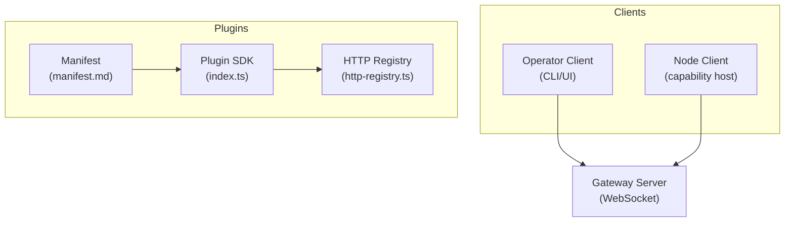
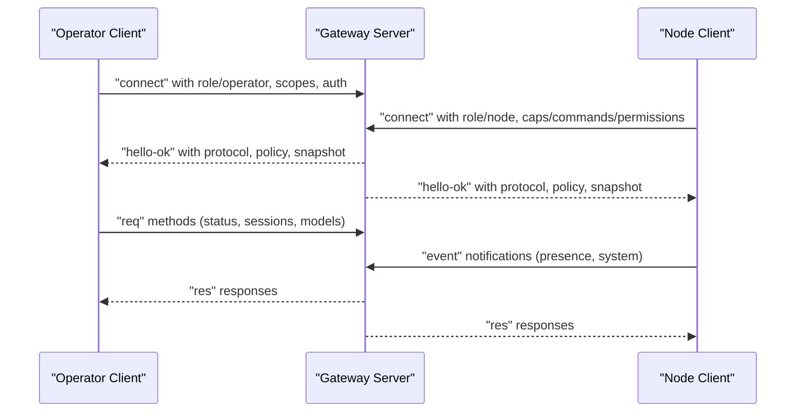
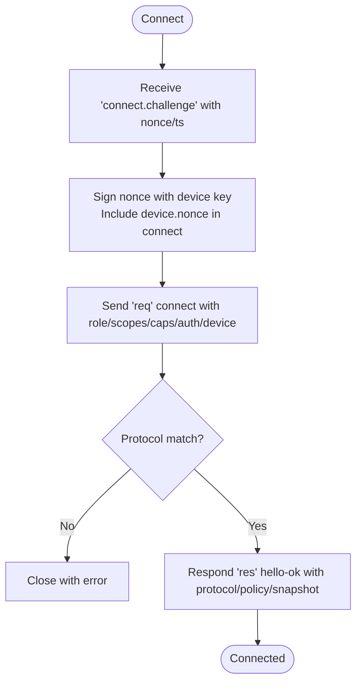
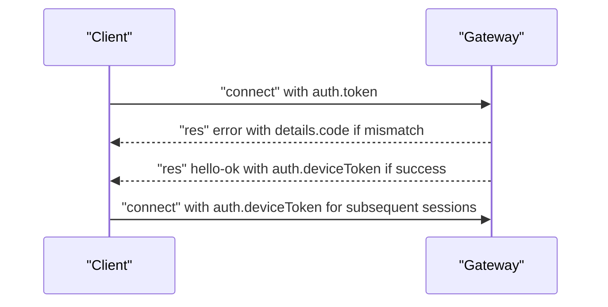
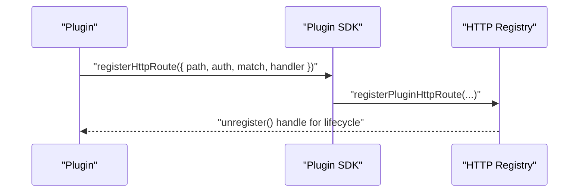
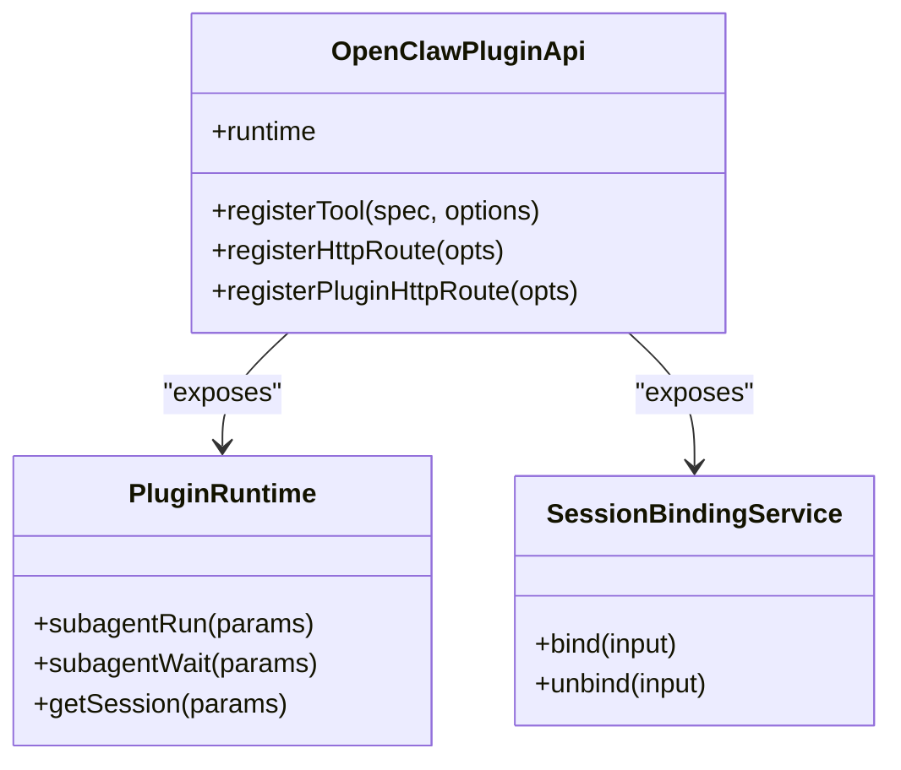
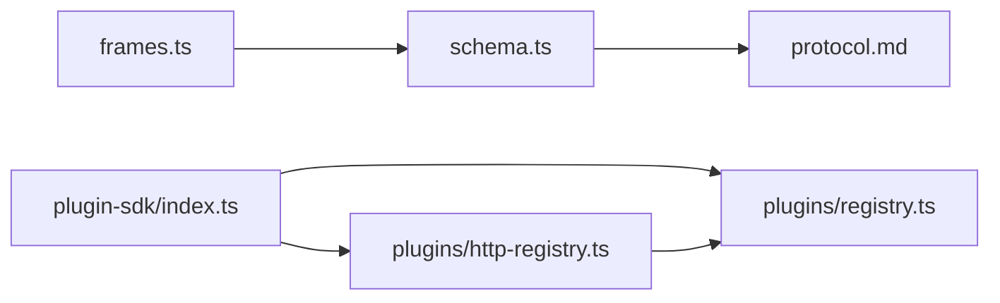

# API Reference

<cite>
**Referenced Files in This Document**
- [protocol.md](file://docs/gateway/protocol.md)
- [authentication.md](file://docs/gateway/authentication.md)
- [heartbeat.md](file://docs/gateway/heartbeat.md)
- [configuration-reference.md](file://docs/gateway/configuration-reference.md)
- [manifest.md](file://docs/plugins/manifest.md)
- [agent-tools.md](file://docs/plugins/agent-tools.md)
- [schema.ts](file://src/gateway/protocol/schema.ts)
- [frames.ts](file://src/gateway/protocol/schema/frames.ts)
- [routes.ts](file://src/cli/program/routes.ts)
- [index.ts](file://src/plugin-sdk/index.ts)
- [http-registry.ts](file://src/plugins/http-registry.ts)
- [registry.ts](file://src/plugins/registry.ts)
- [loader.test.ts](file://src/plugins/loader.test.ts)
- [check-no-register-http-handler.mjs](file://scripts/check-no-register-http-handler.mjs)
- [message-handler.ts](file://src/gateway/server/ws-connection/message-handler.ts)
- [server.auth.default-token.suite.ts](file://src/gateway/server.auth.default-token.suite.ts)
- [plugin-sdk.md](file://docs/zh-CN/refactor/plugin-sdk.md)
</cite>

## Table of Contents
1. [Introduction](#introduction)
2. [Project Structure](#project-structure)
3. [Core Components](#core-components)
4. [Architecture Overview](#architecture-overview)
5. [Detailed Component Analysis](#detailed-component-analysis)
6. [Dependency Analysis](#dependency-analysis)
7. [Performance Considerations](#performance-considerations)
8. [Troubleshooting Guide](#troubleshooting-guide)
9. [Conclusion](#conclusion)
10. [Appendices](#appendices)

## Introduction
This document provides comprehensive API documentation for OpenClaw’s control plane and plugin ecosystem. It covers:
- The WebSocket-based Gateway protocol (connect, framing, roles/scopes, device auth, versioning)
- HTTP/Webhook integration points for plugins
- Plugin SDK contracts, development patterns, and manifest requirements
- Security, rate limiting, and authentication strategies
- Practical examples, client implementation guidelines, and performance optimization tips
- Migration guidance for deprecated APIs and backwards compatibility notes

## Project Structure
OpenClaw exposes a unified WebSocket control plane for operators and nodes, and a plugin SDK for extending capabilities. HTTP endpoints are primarily used for plugin-defined webhooks and CLI-driven operations.

```mermaid
graph TB
subgraph "Clients"
OP["Operator Client<br/>(CLI/UI)"]
ND["Node Client<br/>(capability host)"]
end
GW["Gateway Server<br/>(WebSocket)"]
subgraph "Plugins"
SDK["Plugin SDK<br/>(index.ts)"]
REG["HTTP Registry<br/>(http-registry.ts)"]
MAN["Manifest<br/>(manifest.md)"]
end
OP --> GW
ND --> GW
SDK --> REG
MAN --> SDK
```

**Diagram sources**
- [protocol.md:10-268](file://docs/gateway/protocol.md#L10-L268)
- [index.ts:1-800](file://src/plugin-sdk/index.ts#L1-L800)
- [http-registry.ts:76-92](file://src/plugins/http-registry.ts#L76-L92)
- [manifest.md:1-100](file://docs/plugins/manifest.md#L1-L100)

**Section sources**
- [protocol.md:10-268](file://docs/gateway/protocol.md#L10-L268)
- [index.ts:1-800](file://src/plugin-sdk/index.ts#L1-L800)
- [http-registry.ts:76-92](file://src/plugins/http-registry.ts#L76-L92)
- [manifest.md:1-100](file://docs/plugins/manifest.md#L1-L100)

## Core Components
- Gateway WebSocket protocol: transport, handshake, framing, roles/scopes, device identity, and versioning.
- Plugin SDK: registration APIs, HTTP route registration, tool registration, and runtime utilities.
- CLI routes: health/status/gateway status/sessions/agents/memory/config/models.
- Authentication: token-based auth, device token issuance, and migration guidance.

**Section sources**
- [protocol.md:10-268](file://docs/gateway/protocol.md#L10-L268)
- [authentication.md:1-180](file://docs/gateway/authentication.md#L1-L180)
- [routes.ts:1-334](file://src/cli/program/routes.ts#L1-L334)
- [index.ts:1-800](file://src/plugin-sdk/index.ts#L1-L800)

## Architecture Overview
The Gateway acts as the central control plane. Operators connect to manage systems; nodes connect to expose capabilities. Plugins extend functionality via SDK APIs and HTTP routes.

```mermaid
sequenceDiagram
participant OP as "Operator Client"
participant GW as "Gateway Server"
participant ND as "Node Client"
OP->>GW : "connect" with role/operator, scopes, auth
ND->>GW : "connect" with role/node, caps/commands/permissions
GW-->>OP : "hello-ok" with protocol, policy, snapshot
GW-->>ND : "hello-ok" with protocol, policy, snapshot
OP->>GW : "req" methods (status, sessions, models)
ND->>GW : "event" notifications (presence, system)
GW-->>OP : "res" responses
GW-->>ND : "res" responses
```

**Diagram sources**
- [protocol.md:22-126](file://docs/gateway/protocol.md#L22-L126)
- [protocol.md:127-134](file://docs/gateway/protocol.md#L127-L134)
- [protocol.md:191-209](file://docs/gateway/protocol.md#L191-L209)

## Detailed Component Analysis

### Gateway WebSocket Protocol
- Transport: WebSocket with JSON text frames; first frame must be a connect request.
- Handshake: Challenge-response with device nonce and signature verification.
- Framing: req/res/event with idempotency for side-effecting methods.
- Roles and scopes: operator vs node; operator scopes include read/write/admin/approvals/pairing.
- Device identity: device.id, publicKey, signature, signedAt, nonce; migration guidance for legacy signing behavior.
- Versioning: PROTOCOL_VERSION negotiated via min/maxProtocol; schema generation tooling included.
- TLS and certificate pinning: optional; recommended for production.

```mermaid
flowchart TD
Start(["Connect"]) --> Challenge["Receive 'connect.challenge' with nonce/ts"]
Challenge --> Sign["Sign nonce with device key<br/>Include device.nonce in connect"]
Sign --> SendConnect["Send 'req' connect with role/scopes/caps/auth/device"]
SendConnect --> Verify{"Protocol match?"}
Verify --> |No| Reject["Close with error"]
Verify --> |Yes| Hello["Respond 'res' hello-ok with protocol/policy/snapshot"]
Hello --> Ready(["Connected"])
```

**Diagram sources**
- [protocol.md:22-126](file://docs/gateway/protocol.md#L22-L126)
- [protocol.md:191-209](file://docs/gateway/protocol.md#L191-L209)
- [message-handler.ts:343-385](file://src/gateway/server/ws-connection/message-handler.ts#L343-L385)
- [server.auth.default-token.suite.ts:302-331](file://src/gateway/server.auth.default-token.suite.ts#L302-L331)

**Section sources**
- [protocol.md:10-268](file://docs/gateway/protocol.md#L10-L268)
- [message-handler.ts:343-385](file://src/gateway/server/ws-connection/message-handler.ts#L343-L385)
- [server.auth.default-token.suite.ts:302-331](file://src/gateway/server.auth.default-token.suite.ts#L302-L331)

### Authentication and Device Identity
- Token-based auth: OPENCLAW_GATEWAY_TOKEN or CLI token; device tokens issued post-pairing.
- Auth failure diagnostics: details.code and recommendedNextStep for recovery.
- Device auth migration: always wait for connect.challenge, sign v2/v3 payload, include nonce.
- Rotation and revocation: device.token.rotate and device.token.revoke require operator.pairing scope.

```mermaid
sequenceDiagram
participant Client as "Client"
participant GW as "Gateway"
Client->>GW : "connect" with auth.token
GW-->>Client : "res" error with details.code if mismatch
GW-->>Client : "res" hello-ok with auth.deviceToken if success
Client->>GW : "connect" with auth.deviceToken for subsequent sessions
```

**Diagram sources**
- [protocol.md:200-215](file://docs/gateway/protocol.md#L200-L215)
- [authentication.md:1-180](file://docs/gateway/authentication.md#L1-L180)

**Section sources**
- [protocol.md:200-215](file://docs/gateway/protocol.md#L200-L215)
- [authentication.md:1-180](file://docs/gateway/authentication.md#L1-L180)

### HTTP/Webhook Integration for Plugins
- Dynamic HTTP routes: registerHttpRoute({ path, auth, match, handler }) and registerPluginHttpRoute.
- Deprecated API: registerHttpHandler is flagged by linter; migrate to new APIs.
- Route registration lifecycle: plugin-owned routes can be replaced or unregistered; diagnostics surface ownership conflicts.

```mermaid
sequenceDiagram
participant Plugin as "Plugin"
participant SDK as "Plugin SDK"
participant Reg as "HTTP Registry"
Plugin->>SDK : "registerHttpRoute({ path, auth, match, handler })"
SDK->>Reg : "registerPluginHttpRoute(...)"
Reg-->>Plugin : "unregister() handle for lifecycle"
```

**Diagram sources**
- [http-registry.ts:76-92](file://src/plugins/http-registry.ts#L76-L92)
- [registry.ts:413-461](file://src/plugins/registry.ts#L413-L461)
- [loader.test.ts:1485-1519](file://src/plugins/loader.test.ts#L1485-L1519)
- [check-no-register-http-handler.mjs:1-38](file://scripts/check-no-register-http-handler.mjs#L1-L38)

**Section sources**
- [http-registry.ts:76-92](file://src/plugins/http-registry.ts#L76-L92)
- [registry.ts:413-461](file://src/plugins/registry.ts#L413-L461)
- [loader.test.ts:1485-1519](file://src/plugins/loader.test.ts#L1485-L1519)
- [check-no-register-http-handler.mjs:1-38](file://scripts/check-no-register-http-handler.mjs#L1-L38)

### Plugin SDK Contracts and Development Patterns
- Exports: channel adapters, runtime types, webhook utilities, status helpers, provider auth helpers, and more.
- Plugin runtime: subagent run/wait/get-session, session binding service, and runtime store.
- Agent tools: registerTool with JSON schema; optional tools gated by allowlists.
- Manifest requirements: openclaw.plugin.json with id and configSchema; validation behavior and notes.

```mermaid
classDiagram
class OpenClawPluginApi {
+registerTool(spec, options)
+registerHttpRoute(opts)
+registerPluginHttpRoute(opts)
+runtime
}
class PluginRuntime {
+subagentRun(params)
+subagentWait(params)
+getSession(params)
}
class SessionBindingService {
+bind(input)
+unbind(input)
}
OpenClawPluginApi --> PluginRuntime : "exposes"
OpenClawPluginApi --> SessionBindingService : "exposes"
```

**Diagram sources**
- [index.ts:1-800](file://src/plugin-sdk/index.ts#L1-L800)
- [agent-tools.md:1-100](file://docs/plugins/agent-tools.md#L1-L100)
- [manifest.md:1-100](file://docs/plugins/manifest.md#L1-L100)

**Section sources**
- [index.ts:1-800](file://src/plugin-sdk/index.ts#L1-L800)
- [agent-tools.md:1-100](file://docs/plugins/agent-tools.md#L1-L100)
- [manifest.md:1-100](file://docs/plugins/manifest.md#L1-L100)
- [plugin-sdk.md:42-50](file://docs/zh-CN/refactor/plugin-sdk.md#L42-L50)

### CLI Routes and Gateway Interaction
- Health/status/gateway status/sessions/agents/memory/config/models routes with flags and timeouts.
- These routes interact with the gateway RPC and can influence plugin loading behavior for performance.

**Section sources**
- [routes.ts:1-334](file://src/cli/program/routes.ts#L1-L334)

### Protocol Schemas and Versioning
- Protocol schemas exported from schema.ts define the full gateway API surface.
- Frames schema defines req/res/event structures and error shape.

**Section sources**
- [schema.ts:1-19](file://src/gateway/protocol/schema.ts#L1-L19)
- [frames.ts:1-165](file://src/gateway/protocol/schema/frames.ts#L1-L165)

### Heartbeat and Operational Guidance
- Heartbeat cadence, target routing, reasoning delivery, and visibility controls.
- Cost-aware patterns: isolated sessions, light context, cheaper models.

**Section sources**
- [heartbeat.md:1-394](file://docs/gateway/heartbeat.md#L1-L394)

## Dependency Analysis
- Gateway protocol schemas define the API surface consumed by clients and plugins.
- Plugin SDK depends on channel adapters, runtime utilities, and webhook guards.
- HTTP registry manages plugin route lifecycles and prevents conflicts.

```mermaid
graph LR
F["frames.ts"] --> S["schema.ts"]
S --> P["protocol.md"]
IDX["plugin-sdk/index.ts"] --> R["plugins/registry.ts"]
IDX --> HR["plugins/http-registry.ts"]
HR --> R
```

**Diagram sources**
- [frames.ts:1-165](file://src/gateway/protocol/schema/frames.ts#L1-L165)
- [schema.ts:1-19](file://src/gateway/protocol/schema.ts#L1-L19)
- [protocol.md:263-268](file://docs/gateway/protocol.md#L263-L268)
- [index.ts:1-800](file://src/plugin-sdk/index.ts#L1-L800)
- [registry.ts:413-461](file://src/plugins/registry.ts#L413-L461)
- [http-registry.ts:76-92](file://src/plugins/http-registry.ts#L76-L92)

**Section sources**
- [frames.ts:1-165](file://src/gateway/protocol/schema/frames.ts#L1-L165)
- [schema.ts:1-19](file://src/gateway/protocol/schema.ts#L1-L19)
- [protocol.md:263-268](file://docs/gateway/protocol.md#L263-L268)
- [index.ts:1-800](file://src/plugin-sdk/index.ts#L1-L800)
- [registry.ts:413-461](file://src/plugins/registry.ts#L413-L461)
- [http-registry.ts:76-92](file://src/plugins/http-registry.ts#L76-L92)

## Performance Considerations
- Prefer isolated sessions and light context for heartbeats to reduce token usage.
- Use cheaper models for periodic tasks; leverage streaming modes judiciously.
- Optimize plugin HTTP route registration to avoid conflicts and redundant handlers.
- Apply rate limiting and anomaly tracking for webhook endpoints.

[No sources needed since this section provides general guidance]

## Troubleshooting Guide
- Protocol mismatch: ensure min/maxProtocol align with PROTOCOL_VERSION.
- Auth failures: check details.code and recommendedNextStep; retry with device token if allowed.
- Device auth migration: always wait for connect.challenge, sign with nonce, include device.nonce.
- Deprecated HTTP handler: migrate to registerHttpRoute/registerPluginHttpRoute.
- Heartbeat visibility: adjust channels.defaults.heartbeat.showOk/showAlerts/useIndicator.

**Section sources**
- [protocol.md:191-209](file://docs/gateway/protocol.md#L191-L209)
- [authentication.md:160-180](file://docs/gateway/authentication.md#L160-L180)
- [heartbeat.md:257-288](file://docs/gateway/heartbeat.md#L257-L288)
- [check-no-register-http-handler.mjs:1-38](file://scripts/check-no-register-http-handler.mjs#L1-L38)

## Conclusion
OpenClaw’s Gateway protocol and plugin SDK provide a robust foundation for operator control and extensibility. By following the documented patterns—secure device authentication, proper protocol versioning, structured HTTP/webhook routes, and careful performance tuning—you can build reliable integrations and maintain forwards compatibility.

[No sources needed since this section summarizes without analyzing specific files]

## Appendices

### Protocol-Specific Examples
- Connect request/response examples and node/operator profiles are documented in the Gateway protocol guide.
- Device auth migration examples and error code mappings are provided for legacy clients.

**Section sources**
- [protocol.md:22-126](file://docs/gateway/protocol.md#L22-L126)
- [protocol.md:231-256](file://docs/gateway/protocol.md#L231-L256)

### Security Considerations
- Use TLS and optional certificate pinning for WS connections.
- Enforce device identity and signature verification; rotate/revoke device tokens as needed.
- Apply webhook body limits and rate limiting; enforce SSRF protections.

**Section sources**
- [protocol.md:257-262](file://docs/gateway/protocol.md#L257-L262)
- [authentication.md:123-139](file://docs/gateway/authentication.md#L123-L139)
- [index.ts:470-491](file://src/plugin-sdk/index.ts#L470-L491)

### Rate Limiting and Quota Behavior
- Model provider key rotation and retry behavior for rate-limit errors.
- Webhook anomaly counters and fixed-window rate limiter utilities.

**Section sources**
- [authentication.md:123-139](file://docs/gateway/authentication.md#L123-L139)
- [index.ts:480-491](file://src/plugin-sdk/index.ts#L480-L491)

### Versioning Information
- PROTOCOL_VERSION is defined in protocol schema; clients negotiate via min/maxProtocol.
- Protocol schema exports enumerate the full API surface.

**Section sources**
- [protocol.md:191-199](file://docs/gateway/protocol.md#L191-L199)
- [schema.ts:1-19](file://src/gateway/protocol/schema.ts#L1-L19)

### Migration Guides and Backwards Compatibility
- Replace registerHttpHandler with registerHttpRoute/registerPluginHttpRoute.
- Device auth behavior changed to require connect.challenge; migration diagnostics included.
- Heartbeat visibility and delivery flags provide backward-compatible toggles.

**Section sources**
- [check-no-register-http-handler.mjs:1-38](file://scripts/check-no-register-http-handler.mjs#L1-L38)
- [protocol.md:231-256](file://docs/gateway/protocol.md#L231-L256)
- [heartbeat.md:257-288](file://docs/gateway/heartbeat.md#L257-L288)

### Common Use Cases and Client Implementation Guidelines
- Operator control plane: status, sessions, models, config, agents, memory.
- Node capability exposure: camera/screen/canvas/system.run with permissions.
- Plugin tool registration: required vs optional; allowlisted per agent.
- Webhook endpoints: secure, rate-limited, with body limits and anomaly tracking.

**Section sources**
- [routes.ts:17-334](file://src/cli/program/routes.ts#L17-L334)
- [protocol.md:135-184](file://docs/gateway/protocol.md#L135-L184)
- [agent-tools.md:1-100](file://docs/plugins/agent-tools.md#L1-L100)
- [index.ts:470-491](file://src/plugin-sdk/index.ts#L470-L491)

### Monitoring and Debugging Approaches
- Use CLI routes for health/status and gateway status.
- Inspect heartbeat visibility and alert delivery flags per channel.
- Enable diagnostic events and webhook processed/received events for observability.

**Section sources**
- [routes.ts:17-334](file://src/cli/program/routes.ts#L17-L334)
- [heartbeat.md:257-288](file://docs/gateway/heartbeat.md#L257-L288)
- [index.ts:647-666](file://src/plugin-sdk/index.ts#L647-L666)