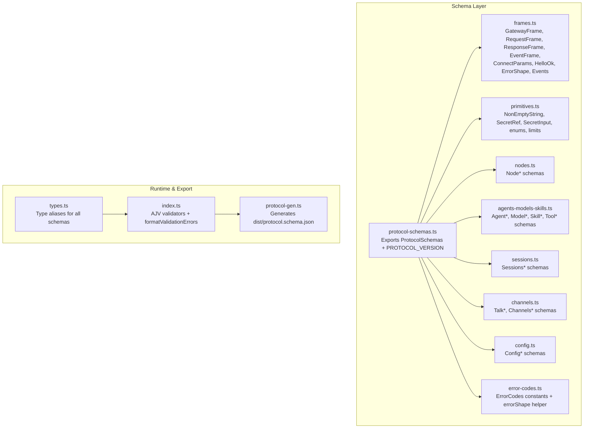
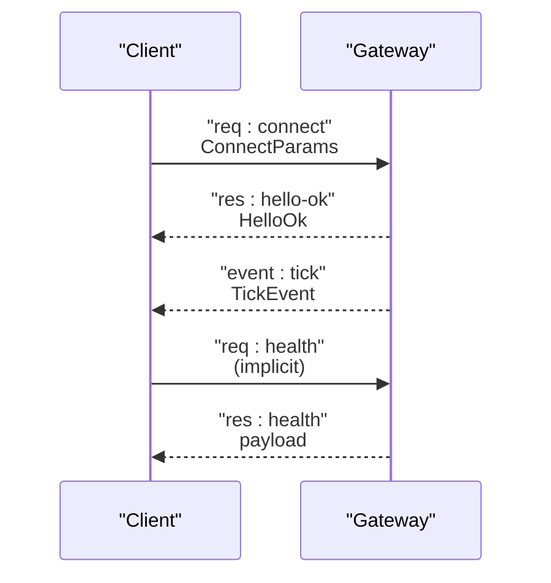
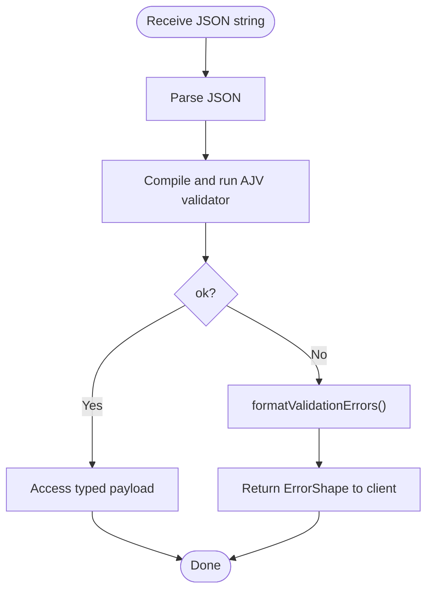
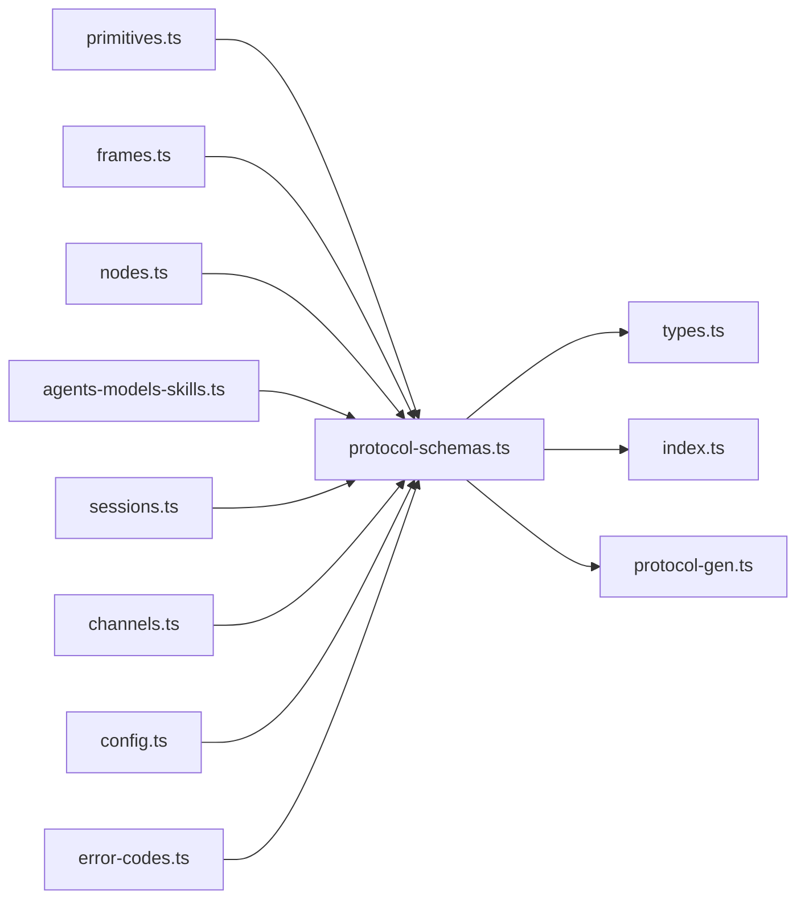

# Data Schemas

<cite>
**Referenced Files in This Document**
- [schema.ts](file://src/gateway/protocol/schema.ts)
- [protocol-schemas.ts](file://src/gateway/protocol/schema/protocol-schemas.ts)
- [types.ts](file://src/gateway/protocol/schema/types.ts)
- [index.ts](file://src/gateway/protocol/index.ts)
- [protocol-gen.ts](file://scripts/protocol-gen.ts)
- [typebox.md](file://docs/concepts/typebox.md)
- [frames.ts](file://src/gateway/protocol/schema/frames.ts)
- [error-codes.ts](file://src/gateway/protocol/schema/error-codes.ts)
- [primitives.ts](file://src/gateway/protocol/schema/primitives.ts)
- [nodes.ts](file://src/gateway/protocol/schema/nodes.ts)
- [agents-models-skills.ts](file://src/gateway/protocol/schema/agents-models-skills.ts)
- [sessions.ts](file://src/gateway/protocol/schema/sessions.ts)
- [channels.ts](file://src/gateway/protocol/schema/channels.ts)
- [config.ts](file://src/gateway/protocol/schema/config.ts)
</cite>

## Table of Contents
1. [Introduction](#introduction)
2. [Project Structure](#project-structure)
3. [Core Components](#core-components)
4. [Architecture Overview](#architecture-overview)
5. [Detailed Component Analysis](#detailed-component-analysis)
6. [Dependency Analysis](#dependency-analysis)
7. [Performance Considerations](#performance-considerations)
8. [Troubleshooting Guide](#troubleshooting-guide)
9. [Conclusion](#conclusion)
10. [Appendices](#appendices)

## Introduction
This document describes the data schemas that define OpenClaw’s Gateway WebSocket protocol. It covers the canonical schema definitions, TypeScript interfaces derived from them, JSON Schema exports, validation rules, error semantics, and response formats. It also documents serialization and deserialization patterns, versioning, and compatibility strategies.

## Project Structure
The protocol schemas are authored in TypeScript using TypeBox and exported as:
- TypeScript interfaces for runtime type safety
- JSON Schema for external tooling and documentation
- Swift models via code generation for the macOS app

**Diagram sources**
- [protocol-schemas.ts:162-299](file://src/gateway/protocol/schema/protocol-schemas.ts#L162-L299)
- [frames.ts:1-165](file://src/gateway/protocol/schema/frames.ts#L1-L165)
- [primitives.ts:1-85](file://src/gateway/protocol/schema/primitives.ts#L1-L85)
- [nodes.ts:1-167](file://src/gateway/protocol/schema/nodes.ts#L1-L167)
- [agents-models-skills.ts:1-271](file://src/gateway/protocol/schema/agents-models-skills.ts#L1-L271)
- [sessions.ts:1-140](file://src/gateway/protocol/schema/sessions.ts#L1-L140)
- [channels.ts:1-186](file://src/gateway/protocol/schema/channels.ts#L1-L186)
- [config.ts:1-101](file://src/gateway/protocol/schema/config.ts#L1-L101)
- [types.ts:1-132](file://src/gateway/protocol/schema/types.ts#L1-L132)
- [index.ts:253-458](file://src/gateway/protocol/index.ts#L253-L458)
- [protocol-gen.ts:9-42](file://scripts/protocol-gen.ts#L9-L42)

**Section sources**
- [schema.ts:1-19](file://src/gateway/protocol/schema.ts#L1-L19)
- [protocol-schemas.ts:162-299](file://src/gateway/protocol/schema/protocol-schemas.ts#L162-L299)
- [protocol-gen.ts:9-42](file://scripts/protocol-gen.ts#L9-L42)

## Core Components
- Canonical schema definitions: centralized in protocol-schemas.ts and imported by other schema modules.
- TypeScript interfaces: generated from schemas in types.ts for strong typing.
- Runtime validation: compiled AJV validators in index.ts.
- JSON Schema export: generated by protocol-gen.ts.
- Error semantics: ErrorCodes and errorShape in error-codes.ts.

Key exports and types:
- ProtocolSchemas: record of all schema definitions.
- PROTOCOL_VERSION: current protocol version.
- GatewayFrame, RequestFrame, ResponseFrame, EventFrame, ConnectParams, HelloOk, ErrorShape.
- Method and event parameter/result schemas grouped by domain (nodes, agents/models/skills, sessions, channels, config).

**Section sources**
- [protocol-schemas.ts:162-299](file://src/gateway/protocol/schema/protocol-schemas.ts#L162-L299)
- [types.ts:1-132](file://src/gateway/protocol/schema/types.ts#L1-L132)
- [index.ts:253-458](file://src/gateway/protocol/index.ts#L253-L458)
- [error-codes.ts:1-24](file://src/gateway/protocol/schema/error-codes.ts#L1-L24)

## Architecture Overview
The protocol is a discriminated union of frames at the top level. Clients must send a connect request first, after which they can call methods and subscribe to events.

**Diagram sources**
- [frames.ts:20-113](file://src/gateway/protocol/schema/frames.ts#L20-L113)
- [typebox.md:20-41](file://docs/concepts/typebox.md#L20-L41)

## Detailed Component Analysis

### Frame Types and Protocol Topology
- GatewayFrame: discriminated union of RequestFrame, ResponseFrame, EventFrame.
- RequestFrame: type=req, id, method, params.
- ResponseFrame: type=res, id, ok, payload or error.
- EventFrame: type=event, event, payload, optional seq/stateVersion.
- ConnectParams: handshake metadata, client identity, capabilities, permissions, auth hints.
- HelloOk: server reply including negotiated protocol version, features, snapshot, policy, optional auth and canvas host.
- ErrorShape: standardized error envelope with code, message, details, retryable, retryAfterMs.

Validation and export:
- AJV validators are compiled for each frame and method schema.
- JSON Schema export includes a discriminator mapping for type.

**Section sources**
- [frames.ts:1-165](file://src/gateway/protocol/schema/frames.ts#L1-L165)
- [index.ts:259-422](file://src/gateway/protocol/index.ts#L259-L422)
- [protocol-gen.ts:9-42](file://scripts/protocol-gen.ts#L9-L42)

### Primitive Types and Constraints
- NonEmptyString: minLength=1.
- SessionLabelString: bounded length enforced by schema.
- GatewayClientIdSchema and GatewayClientModeSchema: unions of allowed literal values.
- SecretRefSchema: env/file/exec variants with provider alias and id patterns.
- SecretInputSchema: union of literal string or SecretRef.
- ChatSendSessionKeyString: bounded length for chat session keys.
- InputProvenance: structured provenance metadata.

These primitives are reused across many schemas to enforce consistent constraints.

**Section sources**
- [primitives.ts:1-85](file://src/gateway/protocol/schema/primitives.ts#L1-L85)

### Nodes Domain
- Pairing: NodePairRequestParams, NodePairListParams, NodePairApproveParams, NodePairRejectParams, NodePairVerifyParams.
- Renaming and listing: NodeRenameParams, NodeListParams.
- Pending work: NodePendingAckParams, NodePendingDrainParams/Result, NodePendingEnqueueParams/Result, NodePendingWorkType/Priority enums.
- Invocation: NodeInvokeParams (with idempotencyKey), NodeInvokeResultParams, NodeInvokeRequestEvent.
- Describe and event: NodeDescribeParams, NodeEventParams.

Idempotency: NodeInvokeParams requires idempotencyKey for safe retries.

**Section sources**
- [nodes.ts:1-167](file://src/gateway/protocol/schema/nodes.ts#L1-L167)

### Agents, Models, Skills, Tools
- AgentSummary, AgentsList*/Create*/Update*/Delete*/Files* schemas.
- ModelChoice, ModelsList*.
- SkillsStatus/Bins/Install/Update.
- ToolsCatalog profiles/groups/entries; ToolCatalogProfile union of supported presets.

**Section sources**
- [agents-models-skills.ts:1-271](file://src/gateway/protocol/schema/agents-models-skills.ts#L1-L271)

### Sessions
- List/Preview/Resolve/Patch/Reset/Delete/Compact/Usage with rich filtering and normalization options.
- Patch supports toggling modes, usage reporting, exec policies, spawn controls, and more.

**Section sources**
- [sessions.ts:1-140](file://src/gateway/protocol/schema/sessions.ts#L1-L140)

### Channels and Talk
- TalkModeParams/TalkConfig*/Normalized/Legacy schemas with provider configs and secret inputs.
- ChannelsStatus*/Logout/WebLogin* schemas; status intentionally schema-light to minimize protocol churn.

**Section sources**
- [channels.ts:1-186](file://src/gateway/protocol/schema/channels.ts#L1-L186)

### Configuration
- ConfigGet/Set/Apply/Patch plus ConfigSchema lookup and UI hints.
- UpdateRunParams for controlled rollouts with optional sessionKey, note, restart delay, and timeout.

**Section sources**
- [config.ts:1-101](file://src/gateway/protocol/schema/config.ts#L1-L101)

### Error Codes and Shapes
- ErrorCodes: NOT_LINKED, NOT_PAIRED, AGENT_TIMEOUT, INVALID_REQUEST, UNAVAILABLE.
- errorShape helper constructs ErrorShape with optional details, retryable, retryAfterMs.

**Section sources**
- [error-codes.ts:1-24](file://src/gateway/protocol/schema/error-codes.ts#L1-L24)

### Validation and Serialization Patterns
- Serialization: messages are JSON-serialized frames.
- Deserialization: parse JSON, then validate with AJV validators.
- Validation errors: formatValidationErrors aggregates and deduplicates AJV errors, reporting instancePath and keyword-specific messages.

**Diagram sources**
- [index.ts:424-458](file://src/gateway/protocol/index.ts#L424-L458)

**Section sources**
- [index.ts:253-458](file://src/gateway/protocol/index.ts#L253-L458)

### Versioning and Compatibility
- PROTOCOL_VERSION is defined centrally.
- ConnectParams carries minProtocol/maxProtocol; server rejects mismatched versions.
- Generated Swift models preserve unknown frame types to maintain forward compatibility.

**Section sources**
- [protocol-schemas.ts:301-301](file://src/gateway/protocol/schema/protocol-schemas.ts#L301-L301)
- [frames.ts:20-70](file://src/gateway/protocol/schema/frames.ts#L20-L70)
- [typebox.md:261-266](file://docs/concepts/typebox.md#L261-L266)

## Dependency Analysis
The schema layer composes multiple domains into a single ProtocolSchemas registry, which is consumed by:
- TypeScript interface generator (types.ts)
- AJV validator compiler (index.ts)
- JSON Schema exporter (protocol-gen.ts)

**Diagram sources**
- [protocol-schemas.ts:1-302](file://src/gateway/protocol/schema/protocol-schemas.ts#L1-L302)
- [types.ts:1-132](file://src/gateway/protocol/schema/types.ts#L1-L132)
- [index.ts:1-673](file://src/gateway/protocol/index.ts#L1-L673)
- [protocol-gen.ts:1-51](file://scripts/protocol-gen.ts#L1-L51)

**Section sources**
- [protocol-schemas.ts:162-299](file://src/gateway/protocol/schema/protocol-schemas.ts#L162-L299)
- [schema.ts:1-19](file://src/gateway/protocol/schema.ts#L1-L19)

## Performance Considerations
- Strict schemas reduce runtime ambiguity and enable efficient validation.
- AdditionalProperties is disabled on most objects to prevent accidental bloat.
- Optional fields and defaults minimize payload sizes when not needed.
- JSON Schema export enables external tooling to validate and document the protocol without re-implementing logic.

## Troubleshooting Guide
Common issues and remedies:
- Unexpected property errors: formatValidationErrors detects additionalProperties violations and reports the offending field.
- Protocol mismatch: ConnectParams enforces min/max protocol negotiation; mismatch leads to rejection.
- Idempotency failures: NodeInvokeParams requires idempotencyKey for methods with side effects.
- Secret resolution: Use SecretRefSchema variants; ensure provider alias and id patterns match configured secret backends.

**Section sources**
- [index.ts:424-458](file://src/gateway/protocol/index.ts#L424-L458)
- [frames.ts:20-70](file://src/gateway/protocol/schema/frames.ts#L20-L70)
- [nodes.ts:66-75](file://src/gateway/protocol/schema/nodes.ts#L66-L75)
- [primitives.ts:41-85](file://src/gateway/protocol/schema/primitives.ts#L41-L85)

## Conclusion
OpenClaw’s protocol schemas are defined once in TypeScript using TypeBox, validated at runtime with AJV, and exported as JSON Schema for broad compatibility. The design emphasizes strictness, explicit error semantics, and forward-compatible evolution through version negotiation and unknown-frame preservation.

## Appendices

### JSON Schema Export Details
- Root schema includes a discriminator mapping for type and embeds all definitions.
- Generated file: dist/protocol.schema.json.

**Section sources**
- [protocol-gen.ts:9-42](file://scripts/protocol-gen.ts#L9-L42)

### TypeScript Interfaces Reference
- All schema-derived types are exported from types.ts for use across the codebase.

**Section sources**
- [types.ts:1-132](file://src/gateway/protocol/schema/types.ts#L1-L132)

### Protocol Overview and Examples
- Minimal client flow and worked example for adding a method are documented in the TypeBox concept guide.

**Section sources**
- [typebox.md:146-286](file://docs/concepts/typebox.md#L146-L286)