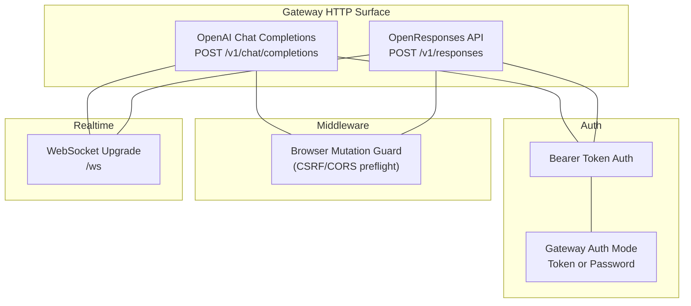
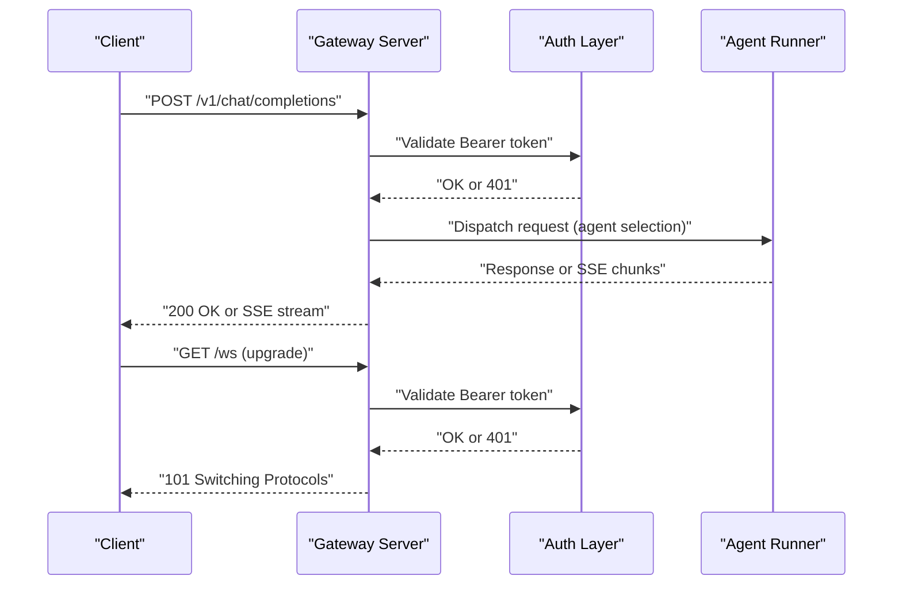
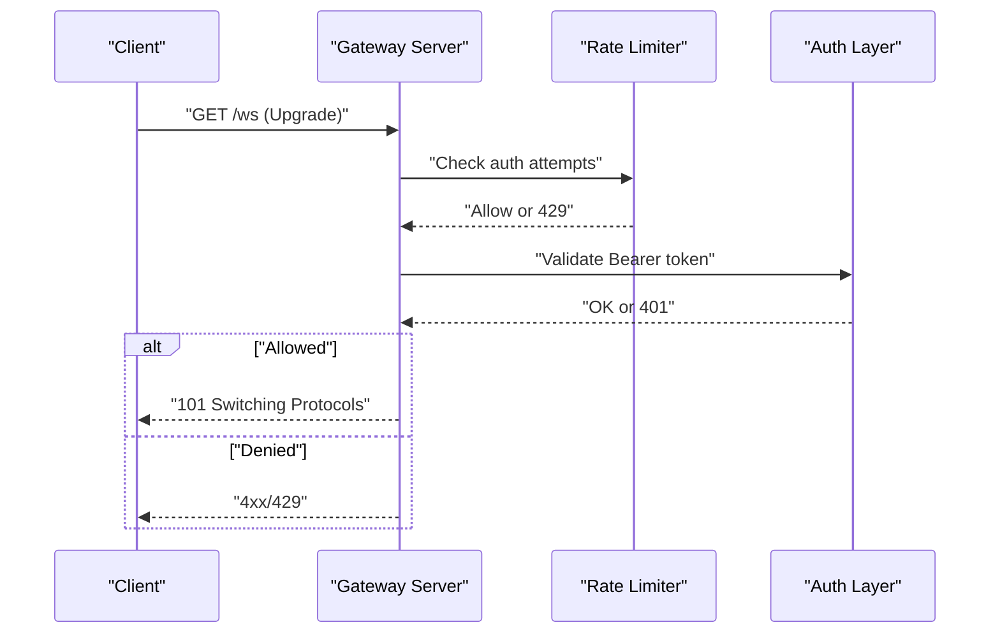
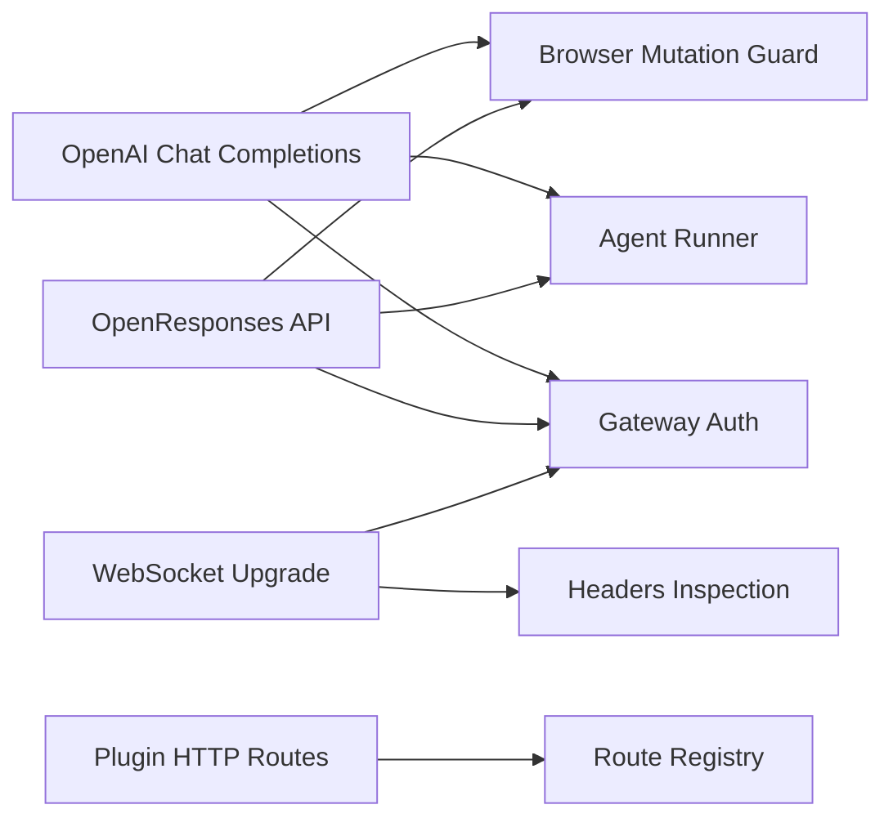

# HTTP API

<cite>
**Referenced Files in This Document**
- [openai-http-api.md](file://docs/gateway/openai-http-api.md)
- [openresponses-http-api.md](file://docs/gateway/openresponses-http-api.md)
- [authentication.md](file://docs/gateway/authentication.md)
- [csrf.ts](file://src/browser/csrf.ts)
- [ws-connection.ts](file://src/gateway/server.ws-connection.ts)
- [ws-types.ts](file://src/gateway/server.ws-types.ts)
- [server.canvas-auth.test.ts](file://src/gateway/server.canvas-auth.test.ts)
- [check-no-register-http-handler.mjs](file://scripts/check-no-register-http-handler.mjs)
- [http-registry.test.ts](file://src/plugins/http-registry.test.ts)
</cite>

## Table of Contents
1. [Introduction](#introduction)
2. [Project Structure](#project-structure)
3. [Core Components](#core-components)
4. [Architecture Overview](#architecture-overview)
5. [Detailed Component Analysis](#detailed-component-analysis)
6. [Dependency Analysis](#dependency-analysis)
7. [Performance Considerations](#performance-considerations)
8. [Troubleshooting Guide](#troubleshooting-guide)
9. [Conclusion](#conclusion)
10. [Appendices](#appendices)

## Introduction
This document describes the HTTP API exposed by the OpenClaw Gateway, focusing on:
- OpenAI-compatible Chat Completions endpoint
- OpenResponses-compatible Responses endpoint
- Authentication mechanisms (Bearer tokens and gateway-specific auth)
- Request/response schemas, headers, and streaming behavior
- Rate limiting, CORS/browser mutation guard, and security considerations
- WebSocket upgrade patterns and real-time API usage

Where applicable, this guide references authoritative documentation and implementation files within the repository.

## Project Structure
The HTTP API surface is primarily documented in the Gateway documentation and implemented via the Gateway server and related middleware. Key areas:
- OpenAI-compatible endpoint documentation
- OpenResponses-compatible endpoint documentation
- Authentication and credential semantics
- Browser CSRF and CORS guard
- WebSocket upgrade and connection handling
- Plugin HTTP route registration and deprecation checks

**Diagram sources**
- [openai-http-api.md](file://docs/gateway/openai-http-api.md#L14-L17)
- [openresponses-http-api.md](file://docs/gateway/openresponses-http-api.md#L15-L19)
- [authentication.md](file://docs/gateway/authentication.md#L9-L18)
- [csrf.ts](file://src/browser/csrf.ts#L57-L87)
- [ws-connection.ts](file://src/gateway/server.ws-connection.ts#L115-L139)

**Section sources**
- [openai-http-api.md](file://docs/gateway/openai-http-api.md#L1-L133)
- [openresponses-http-api.md](file://docs/gateway/openresponses-http-api.md#L1-L355)
- [authentication.md](file://docs/gateway/authentication.md#L1-L180)
- [csrf.ts](file://src/browser/csrf.ts#L1-L87)
- [ws-connection.ts](file://src/gateway/server.ws-connection.ts#L115-L139)

## Core Components
- OpenAI-compatible Chat Completions
  - Endpoint: POST /v1/chat/completions
  - Authentication: Bearer token using Gateway auth mode
  - Agent targeting: model field or x-openclaw-agent-id header
  - Streaming: SSE via stream=true
  - Security boundary: treated as operator-access surface
- OpenResponses-compatible Responses
  - Endpoint: POST /v1/responses
  - Authentication: Bearer token using Gateway auth mode
  - Agent targeting: model field or x-openclaw-agent-id header
  - Streaming: SSE with structured event types
  - Input items: message, function_call_output, reasoning, item_reference
  - Media inputs: input_image and input_file with constraints
  - Security boundary: treated as operator-access surface
- Authentication
  - Modes: token or password
  - Environment variables: OPENCLAW_GATEWAY_TOKEN or OPENCLAW_GATEWAY_PASSWORD
  - Rate limiting: 429 with Retry-After on auth failures
- Browser mutation guard and CORS
  - CSRF protection for mutating methods
  - Preflight handling via OPTIONS
- WebSocket upgrade
  - Real-time connections on /ws with headers inspection and rate limiting

**Section sources**
- [openai-http-api.md](file://docs/gateway/openai-http-api.md#L14-L133)
- [openresponses-http-api.md](file://docs/gateway/openresponses-http-api.md#L15-L355)
- [authentication.md](file://docs/gateway/authentication.md#L21-L31)
- [csrf.ts](file://src/browser/csrf.ts#L57-L87)
- [ws-connection.ts](file://src/gateway/server.ws-connection.ts#L115-L139)

## Architecture Overview
The Gateway multiplexes HTTP and WebSocket traffic on the same port. HTTP endpoints are protected by Gateway authentication and can optionally enable OpenAI-compatible or OpenResponses-compatible APIs. Middleware enforces browser mutation guard and CORS preflight. WebSocket upgrades are handled with rate limiting and header inspection.

**Diagram sources**
- [openai-http-api.md](file://docs/gateway/openai-http-api.md#L14-L23)
- [openresponses-http-api.md](file://docs/gateway/openresponses-http-api.md#L15-L25)
- [ws-connection.ts](file://src/gateway/server.ws-connection.ts#L115-L139)

## Detailed Component Analysis

### OpenAI-Compatible Chat Completions
- Method and URL
  - POST /v1/chat/completions
  - Same port as the Gateway (HTTP + WS multiplex)
- Authentication
  - Authorization: Bearer <token>
  - Uses Gateway auth mode (token or password)
  - Rate limiting: 429 with Retry-After on auth failures
- Agent targeting
  - model: "openclaw:<agentId>" or alias "agent:<agentId>"
  - x-openclaw-agent-id header (defaults to main)
  - Advanced: x-openclaw-session-key for session control
- Session behavior
  - Stateless by default (new session key per request)
  - Stable session derived from OpenAI user string when provided
- Streaming (SSE)
  - stream: true
  - Content-Type: text/event-stream
  - Event format: data: <json>, ends with data: [DONE]
- Request and response
  - Request shape follows OpenAI Chat Completions
  - Response mirrors OpenAI-compatible structure
- Security boundary
  - Treat as operator-access surface; keep private/intranet only

Example curl (non-streaming and streaming) are provided in the documentation.

**Section sources**
- [openai-http-api.md](file://docs/gateway/openai-http-api.md#L14-L133)

### OpenResponses-Compatible Responses
- Method and URL
  - POST /v1/responses
  - Same port as the Gateway (HTTP + WS multiplex)
- Authentication
  - Authorization: Bearer <token>
  - Uses Gateway auth mode (token or password)
  - Rate limiting: 429 with Retry-After on auth failures
- Agent targeting
  - model: "openclaw:<agentId>" or alias "agent:<agentId>"
  - x-openclaw-agent-id header (defaults to main)
  - Advanced: x-openclaw-session-key for session control
- Session behavior
  - Stateless by default (new session key per request)
  - Stable session derived from OpenResponses user string when provided
- Request shape (selected fields)
  - input: string or array of item objects
  - instructions: merged into system prompt
  - tools: client tool definitions
  - tool_choice: filter or require client tools
  - stream: enables SSE streaming
  - max_output_tokens: best-effort output limit
  - user: stable session routing
  - Accepted but ignored: max_tool_calls, reasoning, metadata, store, previous_response_id, truncation
- Items (input)
  - message: roles system, developer, user, assistant
  - function_call_output: tool result continuation
  - reasoning and item_reference: schema-compatible but ignored
- Media inputs
  - input_image: base64 or URL sources, allowed MIME types and max size
  - input_file: base64 or URL sources, allowed MIME types and max size
  - URL fetch defaults: allowUrl, maxUrlParts, DNS/private IP blocking, redirects, timeouts
  - Configurable limits under gateway.http.endpoints.responses
- Streaming (SSE)
  - stream: true
  - Content-Type: text/event-stream
  - Event types: response.created, response.in_progress, response.output_item.added, response.content_part.added, response.output_text.delta, response.output_text.done, response.content_part.done, response.output_item.done, response.completed, response.failed
- Usage
  - usage populated when provider reports token counts
- Errors
  - JSON error object with message and type
  - Common: 401 missing/invalid auth, 400 invalid request body, 405 wrong method
- Security boundary
  - Treat as operator-access surface; keep private/intranet only

Example curl (non-streaming and streaming) are provided in the documentation.

**Section sources**
- [openresponses-http-api.md](file://docs/gateway/openresponses-http-api.md#L15-L355)

### Authentication Mechanisms
- Bearer token
  - Authorization: Bearer <token>
  - Mode-dependent credentials:
    - gateway.auth.mode="token": use gateway.auth.token or OPENCLAW_GATEWAY_TOKEN
    - gateway.auth.mode="password": use gateway.auth.password or OPENCLAW_GATEWAY_PASSWORD
- Rate limiting
  - On auth failures, returns 429 with Retry-After header
- Operator-access boundary
  - Valid Gateway token/password should be treated as owner/operator credentials
  - Requests run through the same control-plane agent path as trusted operator actions

**Section sources**
- [openai-http-api.md](file://docs/gateway/openai-http-api.md#L21-L30)
- [openresponses-http-api.md](file://docs/gateway/openresponses-http-api.md#L23-L31)
- [authentication.md](file://docs/gateway/authentication.md#L21-L31)

### Browser Mutation Guard and CORS
- Purpose
  - Prevent unauthorized browser mutations from non-loopback origins
  - Allow CORS preflight (OPTIONS) without mutation restrictions
- Behavior
  - Mutating methods (POST/PUT/PATCH/DELETE) rejected if origin/referer/sec-fetch-site indicates cross-site and is not loopback
  - OPTIONS allowed as preflight regardless of origin
- Implementation
  - Middleware inspects Origin, Referer, and sec-fetch-site headers
  - Rejects with 403 Forbidden when applicable

**Section sources**
- [csrf.ts](file://src/browser/csrf.ts#L26-L87)

### WebSocket Upgrade Endpoints and Real-Time Patterns
- Upgrade path
  - Upgrades to WebSocket on /ws with inspection of Host, Origin, User-Agent, X-Forwarded-For, X-Real-IP
- Canvas host integration
  - Resolves canvas host URL considering local address and forwarded proto
- Rate limiting and auth
  - Reuses Gateway auth and rate limiting for WebSocket upgrades
  - Tests demonstrate 429 responses for repeated failed attempts

**Diagram sources**
- [ws-connection.ts](file://src/gateway/server.ws-connection.ts#L115-L139)
- [server.canvas-auth.test.ts](file://src/gateway/server.canvas-auth.test.ts#L353-L385)

**Section sources**
- [ws-connection.ts](file://src/gateway/server.ws-connection.ts#L115-L139)
- [server.canvas-auth.test.ts](file://src/gateway/server.canvas-auth.test.ts#L353-L385)

### Plugin HTTP Routes and Deprecation
- Dynamic route registration
  - registerPluginHttpRoute for plugin-defined HTTP endpoints
  - Supports auth modes and optional replaceExisting behavior
- Deprecation
  - registerHttpHandler is deprecated; use registerHttpRoute or registerPluginHttpRoute

**Section sources**
- [http-registry.test.ts](file://src/plugins/http-registry.test.ts#L1-L50)
- [check-no-register-http-handler.mjs](file://scripts/check-no-register-http-handler.mjs#L1-L38)

## Dependency Analysis
- HTTP endpoints depend on:
  - Gateway authentication subsystem
  - Agent runner pipeline
  - Middleware for browser mutation guard
- WebSocket depends on:
  - Same auth subsystem
  - Header inspection and canvas host resolution
- Plugin HTTP routes depend on:
  - Plugin registry and route registration APIs

**Diagram sources**
- [openai-http-api.md](file://docs/gateway/openai-http-api.md#L14-L23)
- [openresponses-http-api.md](file://docs/gateway/openresponses-http-api.md#L15-L25)
- [csrf.ts](file://src/browser/csrf.ts#L57-L87)
- [ws-connection.ts](file://src/gateway/server.ws-connection.ts#L115-L139)
- [http-registry.test.ts](file://src/plugins/http-registry.test.ts#L40-L50)

**Section sources**
- [openai-http-api.md](file://docs/gateway/openai-http-api.md#L14-L23)
- [openresponses-http-api.md](file://docs/gateway/openresponses-http-api.md#L15-L25)
- [csrf.ts](file://src/browser/csrf.ts#L57-L87)
- [ws-connection.ts](file://src/gateway/server.ws-connection.ts#L115-L139)
- [http-registry.test.ts](file://src/plugins/http-registry.test.ts#L40-L50)

## Performance Considerations
- Streaming (SSE) reduces latency for long responses and enables incremental rendering.
- Stateless per-request behavior avoids session overhead but may increase cold-start costs.
- Media ingestion (images/files) is bounded by configurable limits; tune maxBodyBytes, maxUrlParts, and per-type limits to balance throughput and safety.
- Rate limiting protects against brute-force auth attempts; consider tuning thresholds for your deployment.

[No sources needed since this section provides general guidance]

## Troubleshooting Guide
- 401 Unauthorized
  - Verify Authorization: Bearer <token> matches Gateway auth mode
  - Confirm OPENCLAW_GATEWAY_TOKEN or OPENCLAW_GATEWAY_PASSWORD as appropriate
- 429 Too Many Requests
  - Exceeded auth failure threshold; wait for Retry-After
- 403 Forbidden (Browser)
  - Origin/referer/sec-fetch-site indicates cross-site mutation; use loopback or trusted proxy
- 405 Method Not Allowed
  - Wrong HTTP method for endpoint
- 400 Bad Request
  - Malformed request body or unsupported fields
- WebSocket upgrade failures
  - Check auth and rate limiter; ensure proper headers and loopback/trusted proxy configuration

**Section sources**
- [openai-http-api.md](file://docs/gateway/openai-http-api.md#L29-L30)
- [openresponses-http-api.md](file://docs/gateway/openresponses-http-api.md#L31-L32)
- [csrf.ts](file://src/browser/csrf.ts#L73-L86)
- [server.canvas-auth.test.ts](file://src/gateway/server.canvas-auth.test.ts#L353-L385)

## Conclusion
The OpenClaw Gateway exposes two OpenAI- and OpenResponses-compatible HTTP endpoints behind robust Gateway authentication and rate limiting. These endpoints integrate seamlessly with the agent runner and support streaming responses. For secure operation, treat these as operator-access surfaces, restrict exposure to trusted networks, and leverage browser mutation guard and WebSocket upgrade protections.

[No sources needed since this section summarizes without analyzing specific files]

## Appendices

### Request Headers Reference
- Authorization: Bearer <token>
- Content-Type: application/json
- x-openclaw-agent-id: <agentId>
- x-openclaw-session-key: <sessionKey>
- Origin, Referer, sec-fetch-site: for browser mutation guard
- Host, X-Forwarded-For, X-Real-IP: for WebSocket upgrade and reverse proxy contexts

**Section sources**
- [openai-http-api.md](file://docs/gateway/openai-http-api.md#L21-L23)
- [openresponses-http-api.md](file://docs/gateway/openresponses-http-api.md#L23-L25)
- [csrf.ts](file://src/browser/csrf.ts#L69-L71)
- [ws-connection.ts](file://src/gateway/server.ws-connection.ts#L122-L128)

### Example curl Commands
- OpenAI Chat Completions (non-streaming)
  - See: [openai-http-api.md](file://docs/gateway/openai-http-api.md#L109-L118)
- OpenAI Chat Completions (streaming)
  - See: [openai-http-api.md](file://docs/gateway/openai-http-api.md#L122-L132)
- OpenResponses (non-streaming)
  - See: [openresponses-http-api.md](file://docs/gateway/openresponses-http-api.md#L331-L340)
- OpenResponses (streaming)
  - See: [openresponses-http-api.md](file://docs/gateway/openresponses-http-api.md#L344-L354)

**Section sources**
- [openai-http-api.md](file://docs/gateway/openai-http-api.md#L109-L132)
- [openresponses-http-api.md](file://docs/gateway/openresponses-http-api.md#L331-L354)