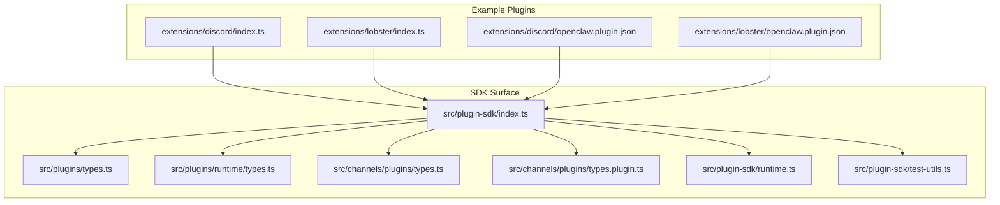
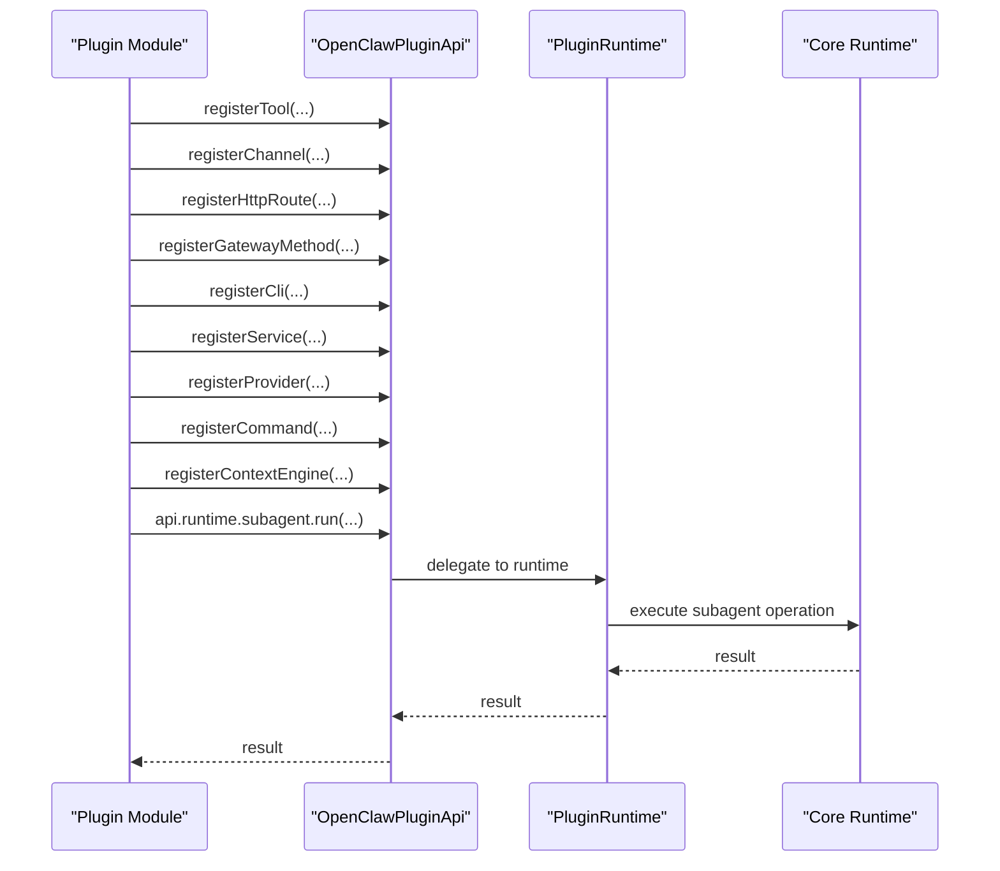
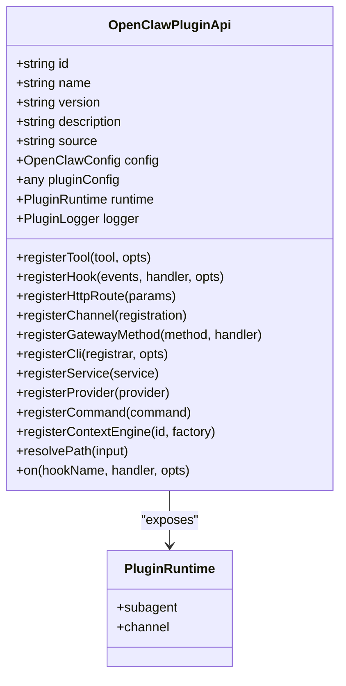
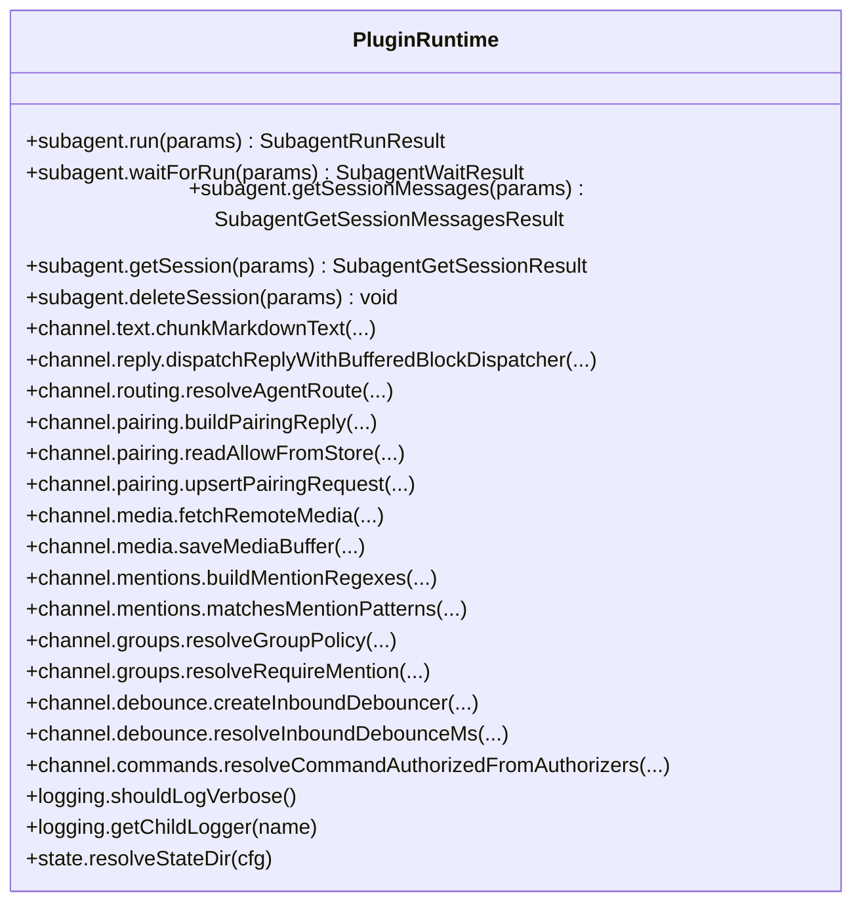
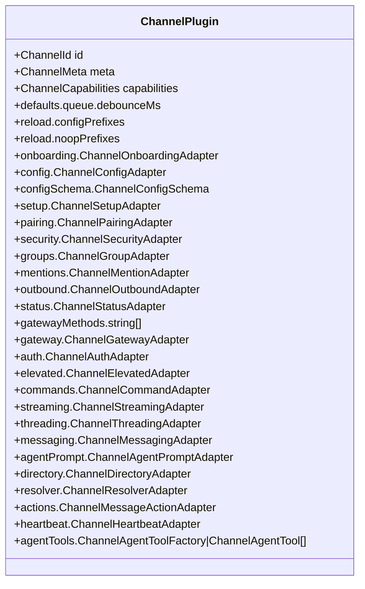
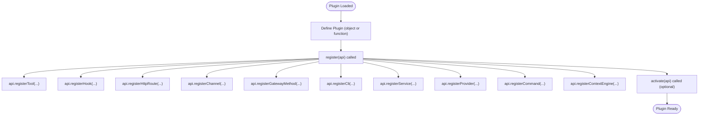
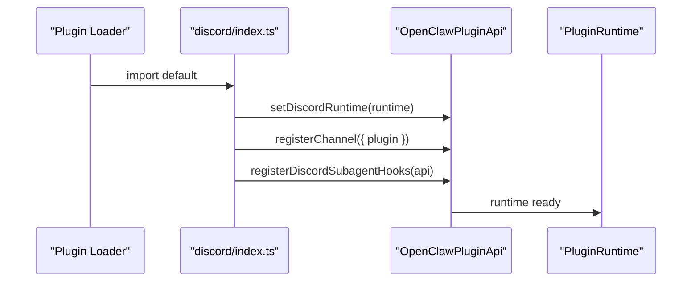
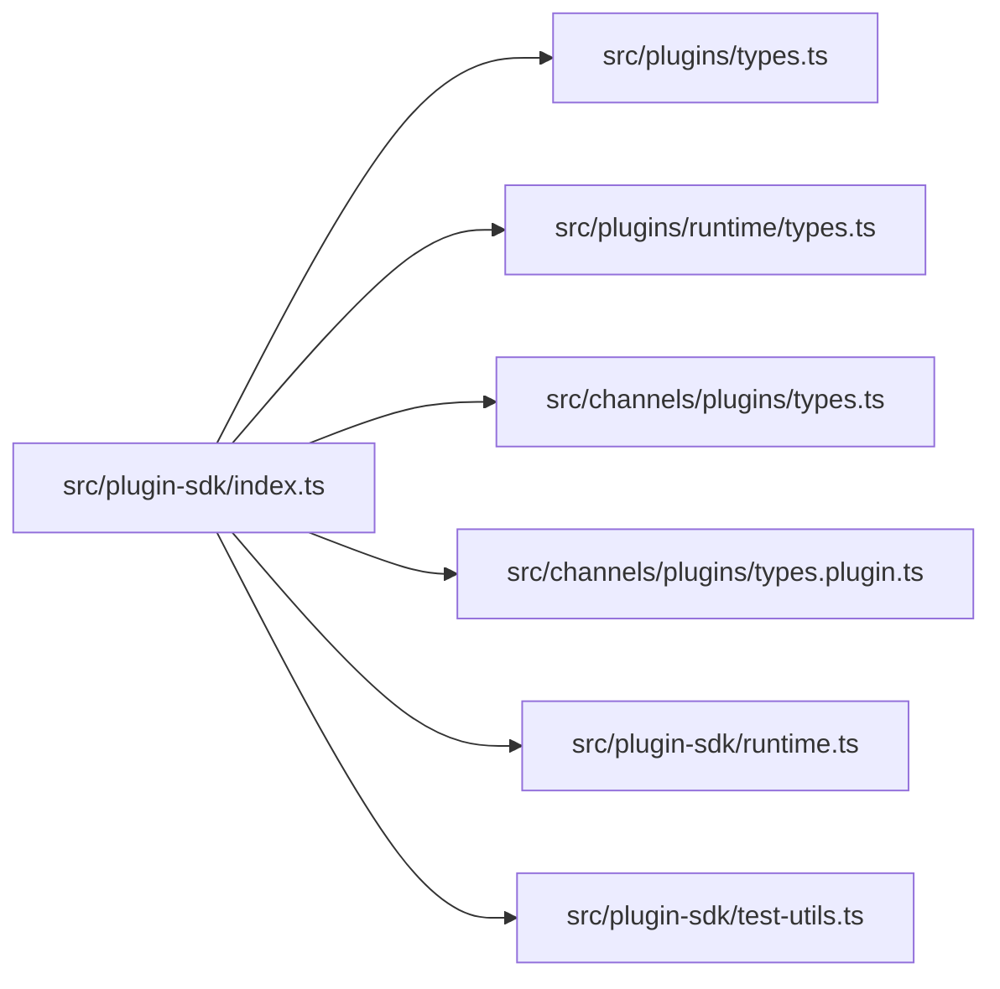

# Plugin SDK

<cite>
**Referenced Files in This Document**
- [index.ts](file://src/plugin-sdk/index.ts)
- [plugin-sdk.md](file://docs/refactor/plugin-sdk.md)
- [manifest.md](file://docs/plugins/manifest.md)
- [types.ts](file://src/plugins/types.ts)
- [runtime/types.ts](file://src/plugins/runtime/types.ts)
- [types.ts](file://src/channels/plugins/types.ts)
- [types.plugin.ts](file://src/channels/plugins/types.plugin.ts)
- [runtime.ts](file://src/plugin-sdk/runtime.ts)
- [test-utils.ts](file://src/plugin-sdk/test-utils.ts)
- [discord/index.ts](file://extensions/discord/index.ts)
- [discord/openclaw.plugin.json](file://extensions/discord/openclaw.plugin.json)
- [lobster/index.ts](file://extensions/lobster/index.ts)
- [lobster/openclaw.plugin.json](file://extensions/lobster/openclaw.plugin.json)
</cite>

## Table of Contents
1. [Introduction](#introduction)
2. [Project Structure](#project-structure)
3. [Core Components](#core-components)
4. [Architecture Overview](#architecture-overview)
5. [Detailed Component Analysis](#detailed-component-analysis)
6. [Dependency Analysis](#dependency-analysis)
7. [Performance Considerations](#performance-considerations)
8. [Troubleshooting Guide](#troubleshooting-guide)
9. [Conclusion](#conclusion)
10. [Appendices](#appendices)

## Introduction
This document describes the complete Plugin SDK and runtime framework used to develop plugins for the OpenClaw platform. It covers the plugin interface contracts, method signatures, lifecycle events, initialization patterns, cleanup procedures, manifest format, dependency management, versioning, and the available APIs for channel integration, agent interaction, and system utilities. It also includes TypeScript definitions, type safety guidelines, development best practices, testing strategies, debugging techniques, deployment procedures, and security considerations.

## Project Structure
The Plugin SDK is exposed through a central index that re-exports types, helpers, and runtime surfaces. The SDK is designed to be a stable, publishable surface that plugins import instead of reaching into internal core modules. Channel-specific adapters and utilities are grouped under channel namespaces, while runtime helpers live under plugin-sdk.

**Diagram sources**
- [index.ts](file://src/plugin-sdk/index.ts#L1-L812)
- [types.ts](file://src/plugins/types.ts#L1-L893)
- [runtime/types.ts](file://src/plugins/runtime/types.ts#L1-L64)
- [types.ts](file://src/channels/plugins/types.ts#L1-L66)
- [types.plugin.ts](file://src/channels/plugins/types.plugin.ts#L1-L86)
- [runtime.ts](file://src/plugin-sdk/runtime.ts#L1-L45)
- [test-utils.ts](file://src/plugin-sdk/test-utils.ts#L1-L9)
- [discord/index.ts](file://extensions/discord/index.ts#L1-L20)
- [discord/openclaw.plugin.json](file://extensions/discord/openclaw.plugin.json#L1-L10)
- [lobster/index.ts](file://extensions/lobster/index.ts#L1-L19)
- [lobster/openclaw.plugin.json](file://extensions/lobster/openclaw.plugin.json#L1-L11)

**Section sources**
- [index.ts](file://src/plugin-sdk/index.ts#L1-L812)

## Core Components
This section outlines the primary SDK types and runtime interfaces that define the plugin contract.

- OpenClawPluginApi: The primary injection surface for plugins. Provides registration methods for tools, hooks, HTTP routes, channels, gateway methods, CLI, services, providers, commands, and context engines. Also exposes runtime, logger, and path resolution helpers.
- PluginRuntime: The execution surface for plugins to interact with core runtime behavior (channel operations, subagent control, logging, state).
- ChannelPlugin: Contract for channel integrations, including adapters for auth, config, pairing, security, groups, mentions, outbound, status, gateway, elevated, commands, streaming, threading, messaging, agent prompt, directory, resolver, actions, heartbeat, and agent tools.
- OpenClawPluginDefinition and Module: Defines plugin identity, metadata, configuration schema, and lifecycle hooks (register, activate).
- Plugin Hook System: A comprehensive set of named hooks for agent lifecycle, message flow, tool execution, session lifecycle, subagent spawning, and gateway lifecycle.

Key exports and helpers are aggregated in the SDK index for discoverability and type safety.

**Section sources**
- [index.ts](file://src/plugin-sdk/index.ts#L263-L306)
- [types.ts](file://src/plugins/types.ts#L263-L306)
- [runtime/types.ts](file://src/plugins/runtime/types.ts#L51-L63)
- [types.ts](file://src/channels/plugins/types.ts#L7-L65)
- [types.plugin.ts](file://src/channels/plugins/types.plugin.ts#L49-L85)

## Architecture Overview
The Plugin SDK enforces a two-layer architecture:
- SDK Layer: Stable, compile-time, publishable types and helpers.
- Runtime Layer: Execution surface accessed via OpenClawPluginApi.runtime.

**Diagram sources**
- [types.ts](file://src/plugins/types.ts#L273-L298)
- [runtime/types.ts](file://src/plugins/runtime/types.ts#L51-L63)

**Section sources**
- [plugin-sdk.md](file://docs/refactor/plugin-sdk.md#L19-L151)
- [types.ts](file://src/plugins/types.ts#L263-L306)
- [runtime/types.ts](file://src/plugins/runtime/types.ts#L51-L63)

## Detailed Component Analysis

### Plugin API Surface
The OpenClawPluginApi defines the contract that plugins use to register capabilities and access runtime services. It includes:
- Registration methods: registerTool, registerHook, registerHttpRoute, registerChannel, registerGatewayMethod, registerCli, registerService, registerProvider, registerCommand, registerContextEngine.
- Accessors: runtime, logger, resolvePath.
- Lifecycle hooks: on with priority support.

**Diagram sources**
- [types.ts](file://src/plugins/types.ts#L263-L306)
- [runtime/types.ts](file://src/plugins/runtime/types.ts#L51-L63)

**Section sources**
- [types.ts](file://src/plugins/types.ts#L263-L306)

### Plugin Runtime
The PluginRuntime provides:
- Subagent control: run, waitForRun, getSessionMessages, getSession, deleteSession.
- Channel operations: text chunking, reply dispatching, routing, pairing, media fetching/saving, mentions, groups, debouncing, command authorization.

**Diagram sources**
- [runtime/types.ts](file://src/plugins/runtime/types.ts#L8-L63)
- [plugin-sdk.md](file://docs/refactor/plugin-sdk.md#L47-L144)

**Section sources**
- [runtime/types.ts](file://src/plugins/runtime/types.ts#L1-L64)
- [plugin-sdk.md](file://docs/refactor/plugin-sdk.md#L47-L144)

### Channel Plugin Contract
ChannelPlugin defines the contract for channel integrations. It includes adapters for:
- Authentication, configuration, setup, pairing, security, groups, mentions, outbound, status, gateway, elevated, commands, streaming, threading, messaging, agent prompt, directory, resolver, message actions, heartbeat, and agent tools.

**Diagram sources**
- [types.plugin.ts](file://src/channels/plugins/types.plugin.ts#L49-L85)

**Section sources**
- [types.ts](file://src/channels/plugins/types.ts#L7-L65)
- [types.plugin.ts](file://src/channels/plugins/types.plugin.ts#L49-L85)

### Plugin Lifecycle and Initialization Patterns
Plugins are defined as either an object with lifecycle hooks or a function that receives the API. Typical lifecycle:
- register: Called early to register tools, hooks, routes, channels, services, providers, commands, and context engines.
- activate: Optional activation hook for post-registration setup.

**Diagram sources**
- [types.ts](file://src/plugins/types.ts#L248-L257)

**Section sources**
- [types.ts](file://src/plugins/types.ts#L248-L257)

### Cleanup Procedures
- Services: Implement stop in OpenClawPluginService to perform cleanup.
- Subagents: Use deleteSession to clean up transient state.
- Runtime environment: Use resolveRuntimeEnv helpers to provide controlled exit/error behavior.

**Section sources**
- [types.ts](file://src/plugins/types.ts#L237-L241)
- [runtime/types.ts](file://src/plugins/runtime/types.ts#L46-L49)
- [runtime.ts](file://src/plugin-sdk/runtime.ts#L26-L44)

### Plugin Manifest Format
Every plugin must ship a manifest file at the plugin root. The manifest validates configuration without executing plugin code.

Required fields:
- id: Canonical plugin id.
- configSchema: JSON Schema for plugin config.

Optional fields:
- kind: Plugin kind (e.g., "memory", "context-engine").
- channels: Channel ids registered by this plugin.
- providers: Provider ids registered by this plugin.
- skills: Skill directories to load (relative to plugin root).
- name, description, uiHints, version.

Validation behavior:
- Unknown channels/providers/slots entries are errors.
- Broken or missing manifest blocks validation.
- Disabled plugins keep config with warnings.

**Section sources**
- [manifest.md](file://docs/plugins/manifest.md#L11-L76)

### Dependency Management and Versioning
- SDK: Published and documented with semver guarantees.
- Runtime: Versioned per core release; plugins declare required runtime range.
- Migration plan: Phased migration to SDK+Runtime with deprecation windows and lint checks.

**Section sources**
- [plugin-sdk.md](file://docs/refactor/plugin-sdk.md#L188-L192)
- [plugin-sdk.md](file://docs/refactor/plugin-sdk.md#L153-L186)

### Available APIs for Channel Integration, Agent Interaction, and System Utilities
- Channel adapters: auth, config, setup, pairing, security, groups, mentions, outbound, status, gateway, elevated, commands, streaming, threading, messaging, agent prompt, directory, resolver, actions, heartbeat, agent tools.
- Agent tools: registerTool with factory pattern and optional flag.
- Hooks: Comprehensive set for agent lifecycle, message flow, tool execution, session lifecycle, subagent spawning, and gateway lifecycle.
- HTTP routes: registerHttpRoute with auth modes and match strategies.
- Gateway methods: registerGatewayMethod.
- CLI: registerCli with registrar and command scoping.
- Services: registerService for long-running tasks.
- Providers: registerProvider for model providers and auth flows.
- Commands: registerCommand for simple state-toggling or status commands.
- Context engines: registerContextEngine for exclusive slot selection.
- Utilities: runtime helpers for logging, state dir resolution, SSRF guards, dedupe caches, media loading, text chunking, OAuth utilities, Windows spawn policy, and more.

**Section sources**
- [index.ts](file://src/plugin-sdk/index.ts#L64-L812)

### TypeScript Definitions, Type Safety Guidelines, and Development Best Practices
- Prefer importing from the SDK index to ensure type stability and avoid internal imports.
- Use OpenClawPluginApi.runtime for all runtime interactions.
- Define robust config schemas in the manifest and in plugin config schema.
- Use typed factories for tools and ensure sandboxed environments are respected.
- Leverage hooks for cross-cutting concerns and maintain separation of concerns.
- Keep plugin modules minimal and focused on a single responsibility.

**Section sources**
- [plugin-sdk.md](file://docs/refactor/plugin-sdk.md#L11-L12)
- [index.ts](file://src/plugin-sdk/index.ts#L1-L812)

### Complete Plugin Examples
Below are step-by-step guides for two example plugins.

#### Example: Discord Plugin
- Manifest: Declares id, channels, and an empty config schema.
- Module: Registers runtime, channel, and subagent hooks.

Implementation steps:
1. Create openclaw.plugin.json with id, channels, and configSchema.
2. Implement plugin module exporting an object with id, name, description, configSchema, and register function.
3. In register, set runtime, register the channel, and register subagent hooks.
4. Export default plugin.

**Diagram sources**
- [discord/index.ts](file://extensions/discord/index.ts#L7-L17)
- [discord/openclaw.plugin.json](file://extensions/discord/openclaw.plugin.json#L1-L10)

**Section sources**
- [discord/index.ts](file://extensions/discord/index.ts#L1-L20)
- [discord/openclaw.plugin.json](file://extensions/discord/openclaw.plugin.json#L1-L10)

#### Example: Lobster Plugin
- Manifest: Declares id, name, description, and an empty config schema.
- Module: Registers a tool factory that respects sandboxed context.

Implementation steps:
1. Create openclaw.plugin.json with id, name, description, and configSchema.
2. Implement plugin module exporting a function that registers a tool factory.
3. In the factory, return null when sandboxed to avoid unsafe operations.
4. Export default plugin.

**Section sources**
- [lobster/index.ts](file://extensions/lobster/index.ts#L1-L19)
- [lobster/openclaw.plugin.json](file://extensions/lobster/openclaw.plugin.json#L1-L11)

### Testing Strategies and Debugging Techniques
- Adapter-level unit tests: Exercise runtime functions with real core implementation.
- Golden tests per plugin: Ensure no behavior drift (routing, pairing, allowlist, mention gating).
- End-to-end sample: Install + run + smoke in CI.
- Diagnostics: Use diagnostic events and log transports for visibility.
- Runtime helpers: Use resolveRuntimeEnv to provide controlled logging and exit behavior.

**Section sources**
- [plugin-sdk.md](file://docs/refactor/plugin-sdk.md#L194-L198)
- [index.ts](file://src/plugin-sdk/index.ts#L608-L628)
- [runtime.ts](file://src/plugin-sdk/runtime.ts#L26-L44)

### Deployment Procedures
- Build and package plugins with manifests and schemas.
- Validate manifests and schemas prior to installation.
- Use slots for exclusive plugin kinds (e.g., memory, context-engine).
- Ensure runtime compatibility with required version range.

**Section sources**
- [manifest.md](file://docs/plugins/manifest.md#L64-L76)
- [plugin-sdk.md](file://docs/refactor/plugin-sdk.md#L188-L192)

### Security Considerations, Sandboxing, and Permission Models
- Sandbox-aware tool factories: Return null when sandboxed to prevent unsafe operations.
- SSRF guards: Use fetchWithSsrFGuard and hostname allowlist policies.
- Dedupe caches: Prevent replay attacks and duplicate processing.
- Pairing and allowlist: Use pairing access and allow-from utilities for secure routing.
- Runtime exit control: Provide controlled exit behavior via runtime helpers.

**Section sources**
- [lobster/index.ts](file://extensions/lobster/index.ts#L9-L17)
- [index.ts](file://src/plugin-sdk/index.ts#L442-L449)
- [index.ts](file://src/plugin-sdk/index.ts#L403-L405)
- [index.ts](file://src/plugin-sdk/index.ts#L564-L567)
- [runtime.ts](file://src/plugin-sdk/runtime.ts#L26-L44)

## Dependency Analysis
The SDK index aggregates exports from multiple subsystems, ensuring a stable surface for plugins.

**Diagram sources**
- [index.ts](file://src/plugin-sdk/index.ts#L1-L812)

**Section sources**
- [index.ts](file://src/plugin-sdk/index.ts#L1-L812)

## Performance Considerations
- Use debouncing for inbound processing to reduce load.
- Chunk text and media appropriately to meet provider limits.
- Minimize synchronous work in hot paths; leverage async queues and dispatchers.
- Utilize runtime helpers for efficient media loading and dedupe caching.

[No sources needed since this section provides general guidance]

## Troubleshooting Guide
- Manifest validation errors: Ensure id, channels, providers, and skills are declared and valid.
- Runtime exit unavailable: Use resolveRuntimeEnvWithUnavailableExit to provide meaningful errors.
- Diagnostics: Subscribe to diagnostic events and use log transports for visibility.
- SSRF and security: Verify hostname allowlists and SSRF guards are configured.

**Section sources**
- [manifest.md](file://docs/plugins/manifest.md#L53-L62)
- [runtime.ts](file://src/plugin-sdk/runtime.ts#L34-L44)
- [index.ts](file://src/plugin-sdk/index.ts#L608-L628)
- [index.ts](file://src/plugin-sdk/index.ts#L442-L449)

## Conclusion
The Plugin SDK provides a stable, type-safe framework for developing plugins that integrate with OpenClaw’s runtime. By adhering to the SDK surface, using manifest-driven configuration, leveraging hooks and runtime helpers, and following security and performance best practices, developers can build reliable, maintainable plugins that evolve with the platform.

[No sources needed since this section summarizes without analyzing specific files]

## Appendices

### Appendix A: Plugin Hook Names Reference
- Agent lifecycle: before_model_resolve, before_prompt_build, before_agent_start, llm_input, llm_output, agent_end
- Memory/session: before_compaction, after_compaction, before_reset, session_start, session_end
- Message flow: message_received, message_sending, message_sent, before_message_write
- Tool execution: before_tool_call, after_tool_call, tool_result_persist
- Subagent lifecycle: subagent_spawning, subagent_delivery_target, subagent_spawned, subagent_ended
- Gateway lifecycle: gateway_start, gateway_stop

**Section sources**
- [types.ts](file://src/plugins/types.ts#L321-L372)

### Appendix B: Example Plugin Manifest Fields
- Required: id, configSchema
- Optional: kind, channels, providers, skills, name, description, uiHints, version

**Section sources**
- [manifest.md](file://docs/plugins/manifest.md#L18-L46)