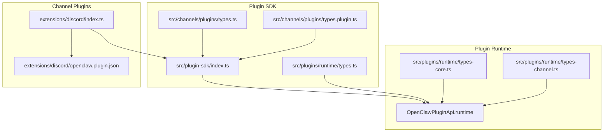
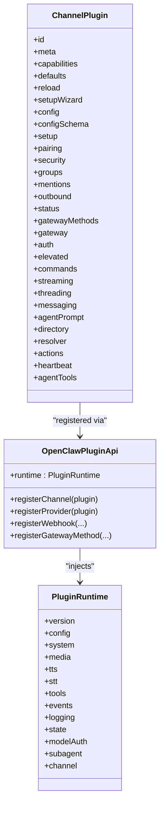
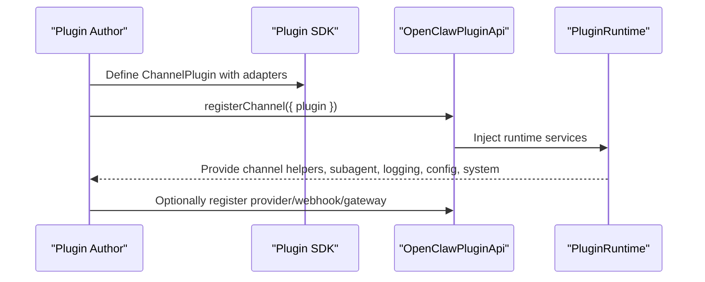
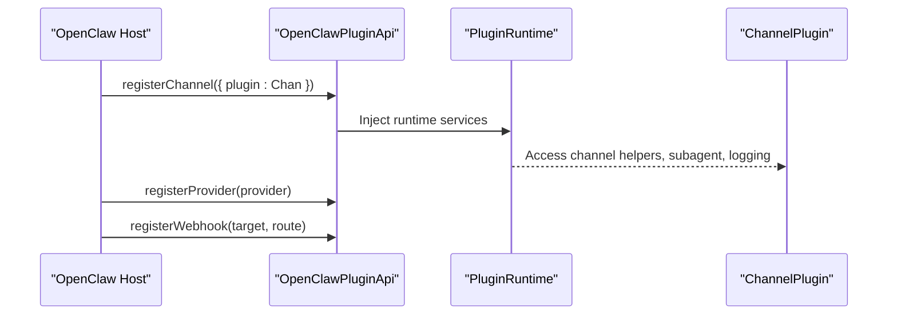
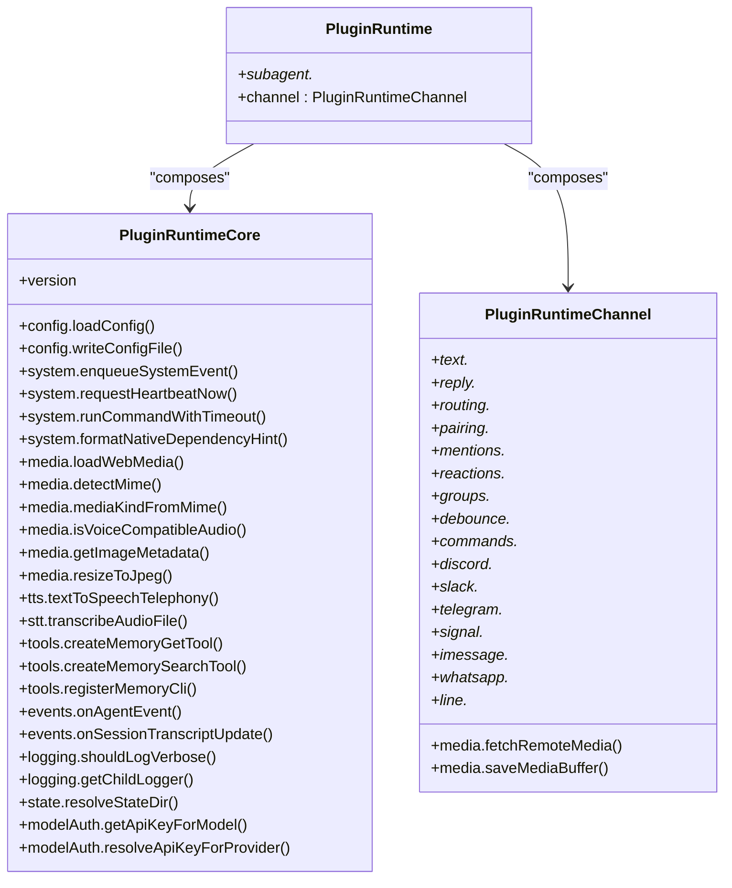
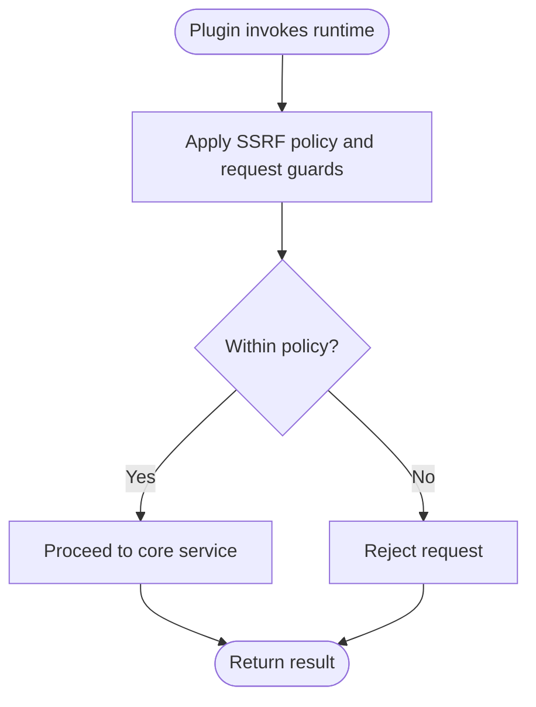
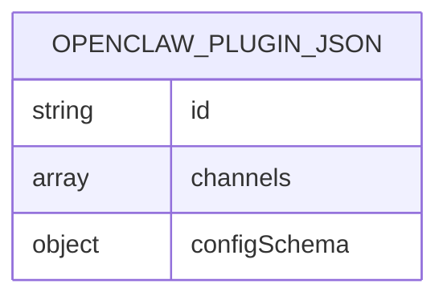
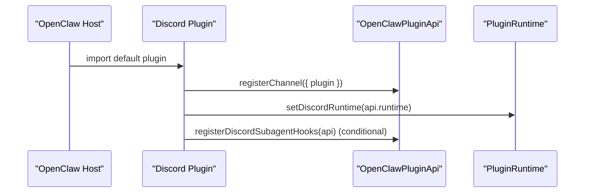
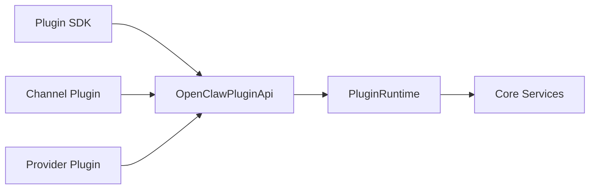

# Plugin SDK

<cite>
**Referenced Files in This Document**
- [index.ts](file://src/plugin-sdk/index.ts)
- [plugin-sdk.md](file://docs/refactor/plugin-sdk.md)
- [types.ts](file://src/channels/plugins/types.ts)
- [types.plugin.ts](file://src/channels/plugins/types.plugin.ts)
- [types.ts](file://src/plugins/types.ts)
- [types.ts](file://src/plugins/runtime/types.ts)
- [types-channel.ts](file://src/plugins/runtime/types-channel.ts)
- [types-core.ts](file://src/plugins/runtime/types-core.ts)
- [openclaw.plugin.json](file://extensions/discord/openclaw.plugin.json)
- [index.ts](file://extensions/discord/index.ts)
- [setup-core.ts](file://extensions/discord/src/setup-core.ts)
</cite>

## Table of Contents
1. [Introduction](#introduction)
2. [Project Structure](#project-structure)
3. [Core Components](#core-components)
4. [Architecture Overview](#architecture-overview)
5. [Detailed Component Analysis](#detailed-component-analysis)
6. [Dependency Analysis](#dependency-analysis)
7. [Performance Considerations](#performance-considerations)
8. [Troubleshooting Guide](#troubleshooting-guide)
9. [Conclusion](#conclusion)
10. [Appendices](#appendices)

## Introduction
This document describes OpenClaw’s Plugin Software Development Kit (SDK) and runtime for building channel adapters and extensions. It covers the plugin development interface, API contracts, lifecycle and registration, dependency injection via the runtime, sandboxing and security boundaries, configuration schemas and metadata, distribution mechanisms, testing strategies, debugging approaches, and performance considerations. The goal is to enable developers to implement new channel connectors and extensions that integrate cleanly with OpenClaw’s core while remaining isolated from internal implementation details.

## Project Structure
OpenClaw organizes plugin-related code into:
- Plugin SDK: stable, publishable types and helpers for plugin authors.
- Plugin Runtime: the execution surface exposed to plugins via OpenClawPluginApi.runtime.
- Channel plugins: concrete implementations for supported channels (e.g., Discord, Slack, Telegram).
- Provider plugins: model provider integrations (e.g., OpenAI, Anthropic).
- Extension metadata: per-plugin manifests (openclaw.plugin.json) and registration entry points.

```mermaid
graph TB
subgraph "Plugin SDK"
SDK_Index["src/plugin-sdk/index.ts"]
SDK_Types["src/channels/plugins/types.ts"]
SDK_PluginTypes["src/channels/plugins/types.plugin.ts"]
SDK_RuntimeTypes["src/plugins/runtime/types.ts"]
end
subgraph "Plugin Runtime"
RT_Core["src/plugins/runtime/types-core.ts"]
RT_Channel["src/plugins/runtime/types-channel.ts"]
RT_API["OpenClawPluginApi.runtime"]
end
subgraph "Channel Plugins"
Ext_Discord["extensions/discord/index.ts"]
Meta_Discord["extensions/discord/openclaw.plugin.json"]
end
SDK_Index --> RT_API
SDK_Types --> SDK_Index
SDK_PluginTypes --> SDK_Index
SDK_RuntimeTypes --> RT_API
RT_Core --> RT_API
RT_Channel --> RT_API
Ext_Discord --> SDK_Index
Ext_Discord --> Meta_Discord
```

**Diagram sources**
- [index.ts:1-872](file://src/plugin-sdk/index.ts#L1-L872)
- [types.ts:1-68](file://src/channels/plugins/types.ts#L1-L68)
- [types.plugin.ts:1-85](file://src/channels/plugins/types.plugin.ts#L1-L85)
- [types.ts:1-64](file://src/plugins/runtime/types.ts#L1-L64)
- [types-core.ts:1-68](file://src/plugins/runtime/types-core.ts#L1-L68)
- [types-channel.ts:1-220](file://src/plugins/runtime/types-channel.ts#L1-L220)
- [index.ts:1-23](file://extensions/discord/index.ts#L1-L23)
- [openclaw.plugin.json:1-10](file://extensions/discord/openclaw.plugin.json#L1-L10)

**Section sources**
- [index.ts:1-872](file://src/plugin-sdk/index.ts#L1-L872)
- [plugin-sdk.md:1-215](file://docs/refactor/plugin-sdk.md#L1-L215)

## Core Components
- Plugin SDK exports:
  - Channel adapter and capability types.
  - Channel configuration schema helpers.
  - Pairing, setup, and status helpers.
  - Webhook registration and guards.
  - Runtime store and lifecycle helpers.
  - Utilities for media, text chunking, deduplication, and SSRF protection.
- Plugin Runtime:
  - Provides a typed surface for plugins to access core behavior safely.
  - Includes subagent orchestration, channel-specific helpers, and core system services.
- Channel Plugin Contract:
  - Defines the ChannelPlugin interface with optional adapters for setup, pairing, security, groups, mentions, outbound messaging, status, gateway, auth, elevated operations, commands, streaming, threading, messaging, agent prompts, directory, resolvers, actions, and heartbeat.
- Provider Plugin Contract:
  - Defines provider authentication methods, catalog augmentation, dynamic model resolution, runtime auth preparation, usage/billing integration, and policy hooks.

**Section sources**
- [index.ts:1-872](file://src/plugin-sdk/index.ts#L1-L872)
- [types.ts:1-68](file://src/channels/plugins/types.ts#L1-L68)
- [types.plugin.ts:1-85](file://src/channels/plugins/types.plugin.ts#L1-L85)
- [types.ts:545-738](file://src/plugins/types.ts#L545-L738)
- [types.ts:1-64](file://src/plugins/runtime/types.ts#L1-L64)
- [types-core.ts:1-68](file://src/plugins/runtime/types-core.ts#L1-L68)
- [types-channel.ts:1-220](file://src/plugins/runtime/types-channel.ts#L1-L220)

## Architecture Overview
The Plugin SDK and runtime enforce a clean separation:
- Plugins depend only on SDK types and runtime services.
- Core behavior is accessed exclusively via OpenClawPluginApi.runtime.
- Channel plugins register adapters and optionally expose agent tools and gateway methods.
- Provider plugins contribute authentication, model catalogs, and runtime behaviors.

```mermaid
classDiagram
class ChannelPlugin {
+id
+meta
+capabilities
+defaults
+reload
+setupWizard
+config
+configSchema
+setup
+pairing
+security
+groups
+mentions
+outbound
+status
+gatewayMethods
+gateway
+auth
+elevated
+commands
+streaming
+threading
+messaging
+agentPrompt
+directory
+resolver
+actions
+heartbeat
+agentTools
}
class PluginRuntime {
+version
+config
+system
+media
+tts
+stt
+tools
+events
+logging
+state
+modelAuth
+subagent
+channel
}
class OpenClawPluginApi {
+runtime : PluginRuntime
+registerChannel(plugin)
+registerProvider(plugin)
+registerWebhook(...)
+registerGatewayMethod(...)
}
ChannelPlugin --> OpenClawPluginApi : "registered via"
OpenClawPluginApi --> PluginRuntime : "injects"
```

**Diagram sources**
- [types.plugin.ts:49-84](file://src/channels/plugins/types.plugin.ts#L49-L84)
- [types.ts:51-63](file://src/plugins/runtime/types.ts#L51-L63)
- [types.ts:545-738](file://src/plugins/types.ts#L545-L738)
- [index.ts:1-872](file://src/plugin-sdk/index.ts#L1-L872)

## Detailed Component Analysis

### Plugin Development Interface and Contracts
- ChannelPlugin contract:
  - Optional adapters for setup, pairing, security, groups, mentions, outbound messaging, status, gateway, auth, elevated operations, commands, streaming, threading, messaging, agent prompts, directory, resolvers, actions, and heartbeat.
  - Optional agentTools to expose channel-specific agent tools.
- ProviderPlugin contract:
  - Authentication methods (OAuth, API key, token, device code, custom).
  - Catalog and discovery hooks.
  - Dynamic model resolution and normalization.
  - Runtime auth preparation and usage/billing integration.
  - Policy hooks for thinking levels, modern models, cache TTL eligibility, and missing-auth messaging.
- OpenClawPluginApi:
  - Exposes runtime services and registration helpers for channels, providers, webhooks, and gateway methods.

```mermaid
sequenceDiagram
participant Dev as "Plugin Author"
participant SDK as "Plugin SDK"
participant API as "OpenClawPluginApi"
participant RT as "PluginRuntime"
Dev->>SDK : Define ChannelPlugin with adapters
Dev->>API : registerChannel({ plugin })
API->>RT : Inject runtime services
RT-->>Dev : Provide channel helpers, subagent, logging, config, system
Dev->>API : Optionally register provider/webhook/gateway
```

**Diagram sources**
- [types.plugin.ts:49-84](file://src/channels/plugins/types.plugin.ts#L49-L84)
- [types.ts:545-738](file://src/plugins/types.ts#L545-L738)
- [index.ts:1-872](file://src/plugin-sdk/index.ts#L1-L872)
- [types.ts:51-63](file://src/plugins/runtime/types.ts#L51-L63)

**Section sources**
- [types.plugin.ts:1-85](file://src/channels/plugins/types.plugin.ts#L1-L85)
- [types.ts:545-738](file://src/plugins/types.ts#L545-L738)
- [index.ts:1-872](file://src/plugin-sdk/index.ts#L1-L872)

### Plugin Lifecycle Management and Registration
- Registration:
  - Channel plugins register via OpenClawPluginApi.registerChannel.
  - Provider plugins register via OpenClawPluginApi.registerProvider.
  - Webhook targets and routes are registered via SDK helpers.
- Lifecycle:
  - Channel lifecycle helpers manage passive account lifecycles and runtime state snapshots.
  - Runtime store creation supports scoped persistence.
- Example registration pattern:
  - A channel plugin sets runtime, registers channel, and conditionally registers subagent hooks based on registration mode.

```mermaid
sequenceDiagram
participant Host as "OpenClaw Host"
participant API as "OpenClawPluginApi"
participant RT as "PluginRuntime"
participant Chan as "ChannelPlugin"
Host->>API : registerChannel({ plugin : Chan })
API->>RT : Inject runtime services
RT-->>Chan : Access channel helpers, subagent, logging
Host->>API : registerProvider(provider)
Host->>API : registerWebhook(target, route)
```

**Diagram sources**
- [index.ts:12-20](file://extensions/discord/index.ts#L12-L20)
- [index.ts:1-872](file://src/plugin-sdk/index.ts#L1-L872)
- [types.ts:51-63](file://src/plugins/runtime/types.ts#L51-L63)

**Section sources**
- [index.ts:1-23](file://extensions/discord/index.ts#L1-L23)
- [index.ts:215-221](file://src/plugin-sdk/index.ts#L215-L221)
- [index.ts:241-242](file://src/plugin-sdk/index.ts#L241-L242)

### Dependency Injection and Runtime Surface
- PluginRuntime provides:
  - Core services: config load/write, system events, heartbeats, command execution, native dependency hints.
  - Media services: web media loading, MIME detection, image ops, STT/TTS.
  - Tools: memory get/search and CLI registration.
  - Events: agent and session transcript updates.
  - Logging: verbosity control and child logger creation.
  - State: state directory resolution.
  - Model auth: provider/model credential resolution.
  - Subagent orchestration: run/wait/getSession/deleteSession.
  - Channel-specific helpers: text chunking, reply dispatching, routing, pairing, media fetch/save, mentions, reactions, groups, debouncing, commands, and channel-specific actions (Discord, Slack, Telegram, Signal, iMessage, WhatsApp, LINE).
- OpenClawPluginApi.runtime is the single access point plugins must use to reach core behavior.

```mermaid
classDiagram
class PluginRuntimeCore {
+version
+config.loadConfig()
+config.writeConfigFile()
+system.enqueueSystemEvent()
+system.requestHeartbeatNow()
+system.runCommandWithTimeout()
+system.formatNativeDependencyHint()
+media.loadWebMedia()
+media.detectMime()
+media.mediaKindFromMime()
+media.isVoiceCompatibleAudio()
+media.getImageMetadata()
+media.resizeToJpeg()
+tts.textToSpeechTelephony()
+stt.transcribeAudioFile()
+tools.createMemoryGetTool()
+tools.createMemorySearchTool()
+tools.registerMemoryCli()
+events.onAgentEvent()
+events.onSessionTranscriptUpdate()
+logging.shouldLogVerbose()
+logging.getChildLogger()
+state.resolveStateDir()
+modelAuth.getApiKeyForModel()
+modelAuth.resolveApiKeyForProvider()
}
class PluginRuntimeChannel {
+text.*
+reply.*
+routing.*
+pairing.*
+media.fetchRemoteMedia()
+media.saveMediaBuffer()
+mentions.*
+reactions.*
+groups.*
+debounce.*
+commands.*
+discord.*
+slack.*
+telegram.*
+signal.*
+imessage.*
+whatsapp.*
+line.*
}
class PluginRuntime {
+subagent.*
+channel : PluginRuntimeChannel
}
PluginRuntime --> PluginRuntimeCore : "composes"
PluginRuntime --> PluginRuntimeChannel : "composes"
```

**Diagram sources**
- [types-core.ts:1-68](file://src/plugins/runtime/types-core.ts#L1-L68)
- [types-channel.ts:1-220](file://src/plugins/runtime/types-channel.ts#L1-L220)
- [types.ts:51-63](file://src/plugins/runtime/types.ts#L51-L63)

**Section sources**
- [types-core.ts:1-68](file://src/plugins/runtime/types-core.ts#L1-L68)
- [types-channel.ts:1-220](file://src/plugins/runtime/types-channel.ts#L1-L220)
- [types.ts:1-64](file://src/plugins/runtime/types.ts#L1-L64)

### Sandbox and Security Boundaries
- SDK enforces a stable, compile-time surface; plugins must not import core internals directly.
- Runtime is the only access to core behavior.
- Security utilities in SDK include:
  - SSRF policy builders and hostname allowlists.
  - Request body limits and anomaly trackers for webhooks.
  - Dedupe caches and persistent dedupe utilities.
- Channel-specific security helpers (e.g., allowlists, DM policies) are exposed via SDK and runtime.

```mermaid
flowchart TD
Start(["Plugin invokes runtime"]) --> Check["Apply SSRF policy and request guards"]
Check --> GuardOK{"Within policy?"}
GuardOK --> |No| Reject["Reject request"]
GuardOK --> |Yes| Proceed["Proceed to core service"]
Proceed --> End(["Return result"])
Reject --> End
```

**Diagram sources**
- [index.ts:493-500](file://src/plugin-sdk/index.ts#L493-L500)
- [index.ts:470-491](file://src/plugin-sdk/index.ts#L470-L491)
- [index.ts:457-462](file://src/plugin-sdk/index.ts#L457-L462)

**Section sources**
- [plugin-sdk.md:11-13](file://docs/refactor/plugin-sdk.md#L11-L13)
- [index.ts:493-500](file://src/plugin-sdk/index.ts#L493-L500)
- [index.ts:470-491](file://src/plugin-sdk/index.ts#L470-L491)
- [index.ts:457-462](file://src/plugin-sdk/index.ts#L457-L462)

### Configuration Schemas and Metadata
- Channel configuration schema helpers:
  - Build channel config schemas and UI hints.
  - Patch scoped account configs and migrate legacy naming.
- Plugin metadata:
  - openclaw.plugin.json declares plugin id and supported channels and can include a configSchema.
- Example:
  - Discord plugin defines an empty plugin config schema and registers the channel.

```mermaid
erDiagram
OPENCLAW_PLUGIN_JSON {
string id
array channels
object configSchema
}
```

**Diagram sources**
- [openclaw.plugin.json:1-10](file://extensions/discord/openclaw.plugin.json#L1-L10)

**Section sources**
- [index.ts:248-248](file://src/plugin-sdk/index.ts#L248-L248)
- [index.ts:586-586](file://src/plugin-sdk/index.ts#L586-L586)
- [openclaw.plugin.json:1-10](file://extensions/discord/openclaw.plugin.json#L1-L10)
- [index.ts:7-20](file://extensions/discord/index.ts#L7-L20)

### Distribution Mechanisms
- Bundled plugins:
  - Provided as part of the repository under extensions/<name>.
  - Registered via their index.ts and metadata via openclaw.plugin.json.
- External plugins:
  - Should depend only on the SDK and runtime; no direct imports from src/**.
- Versioning and compatibility:
  - SDK is semver and documented; runtime is versioned per core release.
  - Plugins declare required runtime compatibility.

**Section sources**
- [plugin-sdk.md:188-193](file://docs/refactor/plugin-sdk.md#L188-L193)
- [index.ts:1-23](file://extensions/discord/index.ts#L1-L23)

### Examples of Plugin Development

#### Channel Adapter Example: Discord
- Registration:
  - The Discord plugin sets runtime, registers the channel, and conditionally registers subagent hooks.
- Setup wizard and adapters:
  - The setup adapter validates inputs, applies account configuration, and manages allowlists and DM policies.
- Metadata:
  - openclaw.plugin.json declares the plugin id and channels.

```mermaid
sequenceDiagram
participant Host as "OpenClaw Host"
participant DiscordPlugin as "Discord Plugin"
participant API as "OpenClawPluginApi"
participant RT as "PluginRuntime"
Host->>DiscordPlugin : import default plugin
DiscordPlugin->>API : registerChannel({ plugin })
DiscordPlugin->>RT : setDiscordRuntime(api.runtime)
DiscordPlugin->>API : registerDiscordSubagentHooks(api) (conditional)
```

**Diagram sources**
- [index.ts:12-20](file://extensions/discord/index.ts#L12-L20)
- [setup-core.ts:74-138](file://extensions/discord/src/setup-core.ts#L74-L138)
- [openclaw.plugin.json:1-10](file://extensions/discord/openclaw.plugin.json#L1-L10)

**Section sources**
- [index.ts:1-23](file://extensions/discord/index.ts#L1-L23)
- [setup-core.ts:1-349](file://extensions/discord/src/setup-core.ts#L1-L349)
- [openclaw.plugin.json:1-10](file://extensions/discord/openclaw.plugin.json#L1-L10)

#### Provider Plugin Example: OpenAI
- ProviderPlugin contract:
  - Authentication methods, catalog and discovery hooks, dynamic model resolution, runtime auth preparation, usage/billing integration, and policy hooks.
- Integration:
  - Plugins contribute to models.providers and participate in model resolution and inference.

**Section sources**
- [types.ts:545-738](file://src/plugins/types.ts#L545-L738)

#### Tool Extensions
- Tools are created via factories with OpenClawPluginToolFactory and executed within the runtime context.
- Tools receive contextual information such as session keys, requester identity, and sandboxed execution flags.

**Section sources**
- [types.ts:89-91](file://src/plugins/types.ts#L89-L91)
- [types.ts:72-87](file://src/plugins/types.ts#L72-L87)

### Testing Strategies and Debugging
- Testing strategy:
  - Adapter-level unit tests exercising runtime functions against real core implementations.
  - Golden tests per plugin to prevent behavior drift (routing, pairing, allowlist, mention gating).
  - End-to-end plugin sample in CI for installation, run, and smoke testing.
- Debugging:
  - Child loggers via runtime.logging.getChildLogger.
  - Verbose logging toggles via runtime.logging.shouldLogVerbose.
  - Runtime environment resolution and unavailable exit helpers.

**Section sources**
- [plugin-sdk.md:194-199](file://docs/refactor/plugin-sdk.md#L194-L199)
- [types-core.ts:45-51](file://src/plugins/runtime/types-core.ts#L45-L51)
- [index.ts:392-395](file://src/plugin-sdk/index.ts#L392-L395)

## Dependency Analysis
- Coupling:
  - Plugins depend on SDK types and runtime services; no direct imports from src/**.
  - Channel plugins depend on channel-specific adapters and runtime channel helpers.
- Cohesion:
  - ChannelPlugin encapsulates all channel-related behaviors; ProviderPlugin encapsulates provider behaviors.
- External dependencies:
  - Runtime composes core services (config, system, media, tools, events, logging, state, model auth).
- Potential circular dependencies:
  - Enforced by SDK and runtime boundaries; migration plan prevents direct core imports from extensions.

```mermaid
graph LR
SDK["Plugin SDK"] --> API["OpenClawPluginApi"]
API --> RT["PluginRuntime"]
RT --> Core["Core Services"]
ChanPlug["Channel Plugin"] --> API
ProvPlug["Provider Plugin"] --> API
```

**Diagram sources**
- [plugin-sdk.md:11-13](file://docs/refactor/plugin-sdk.md#L11-L13)
- [index.ts:1-872](file://src/plugin-sdk/index.ts#L1-L872)
- [types.ts:51-63](file://src/plugins/runtime/types.ts#L51-L63)

**Section sources**
- [plugin-sdk.md:183-187](file://docs/refactor/plugin-sdk.md#L183-L187)

## Performance Considerations
- Text chunking and markdown handling are exposed via runtime channel.text to ensure consistent outbound formatting.
- Debouncing and rate limiting utilities are available to reduce churn and protect upstream services.
- Media operations leverage runtime media helpers for efficient fetching and saving.
- Provider plugins can optimize model resolution and streaming via dedicated hooks to minimize latency.

[No sources needed since this section provides general guidance]

## Troubleshooting Guide
- Configuration validation:
  - Use OpenClawPluginConfigSchema.safeParse/parse/validate to validate plugin configurations.
- Status and diagnostics:
  - Emit diagnostic events and collect status issues via SDK helpers.
- Webhook safety:
  - Apply webhook request guards and anomaly trackers to mitigate abuse.
- Deduplication:
  - Use dedupe caches and persistent dedupe utilities to avoid duplicate processing.

**Section sources**
- [index.ts:58-70](file://src/plugin-sdk/index.ts#L58-L70)
- [index.ts:647-666](file://src/plugin-sdk/index.ts#L647-L666)
- [index.ts:480-491](file://src/plugin-sdk/index.ts#L480-L491)
- [index.ts:457-462](file://src/plugin-sdk/index.ts#L457-L462)

## Conclusion
OpenClaw’s Plugin SDK and runtime provide a stable, secure, and extensible framework for building channel adapters and extensions. By adhering to the SDK contracts, using OpenClawPluginApi.runtime for all core interactions, and leveraging the provided configuration and security utilities, developers can implement robust, maintainable plugins that integrate seamlessly with OpenClaw’s ecosystem.

[No sources needed since this section summarizes without analyzing specific files]

## Appendices

### Appendix A: Migration Plan and Compatibility
- Two-layer target architecture: SDK (stable) and Runtime (execution surface).
- Phased migration: scaffolding, bridge cleanup, light/heavy direct-import plugins, and enforcement.
- Compatibility: SDK semver, runtime versioned per core, plugins declare required runtime range.

**Section sources**
- [plugin-sdk.md:19-145](file://docs/refactor/plugin-sdk.md#L19-L145)
- [plugin-sdk.md:188-212](file://docs/refactor/plugin-sdk.md#L188-L212)