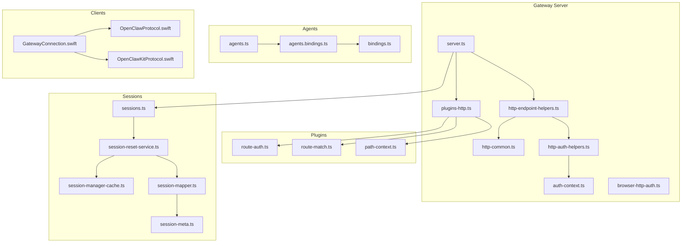
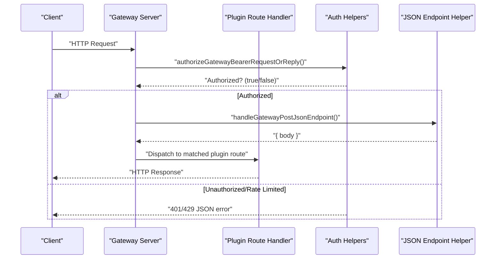
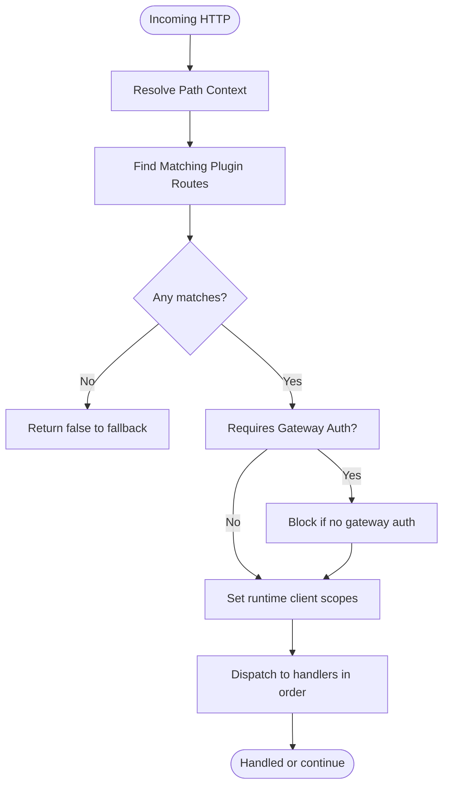
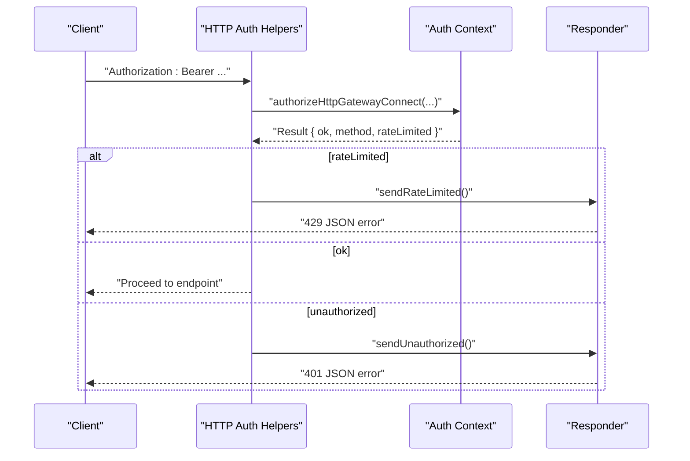
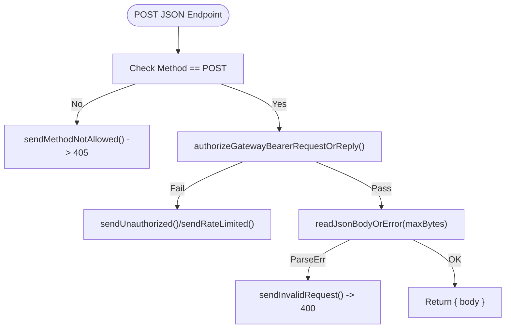
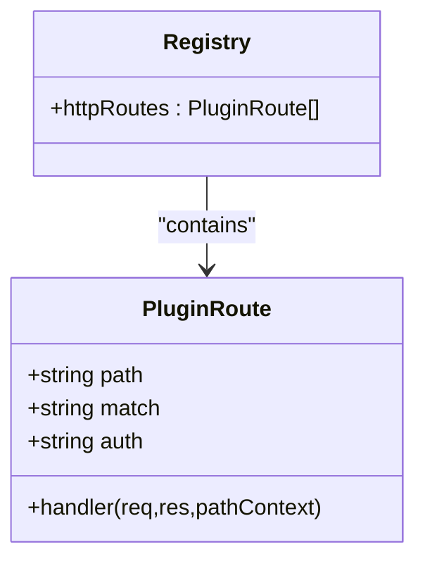
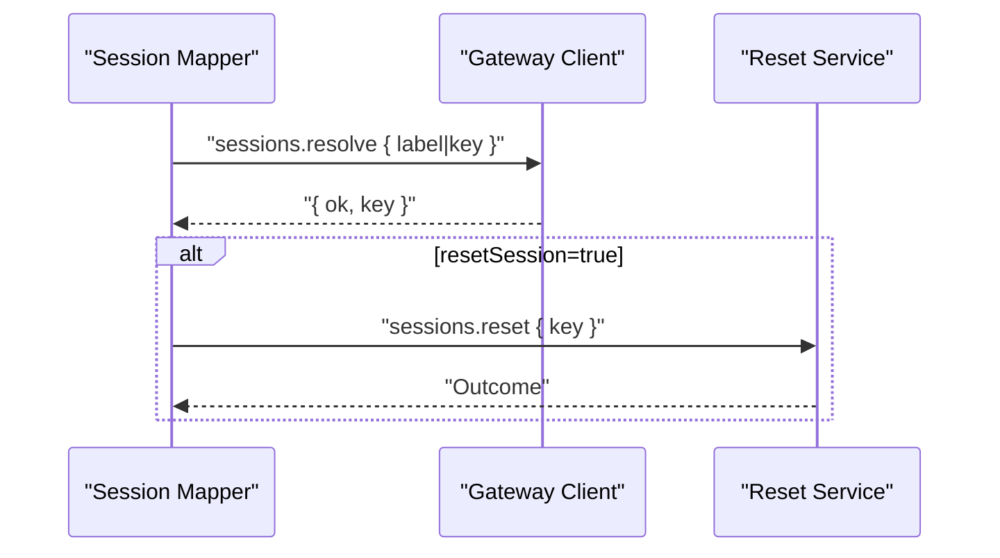
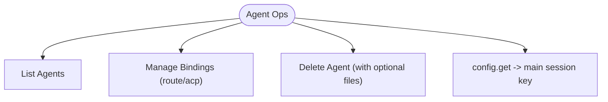
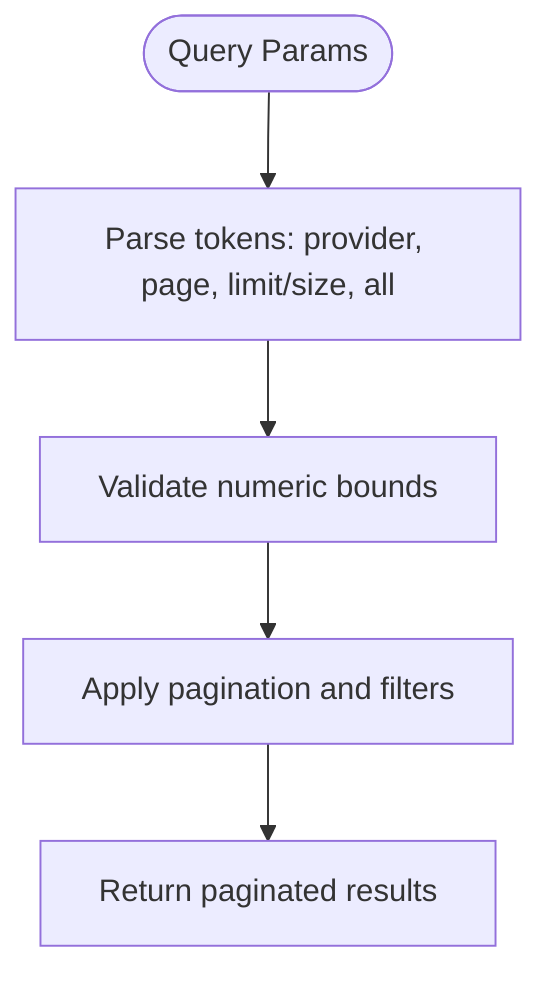
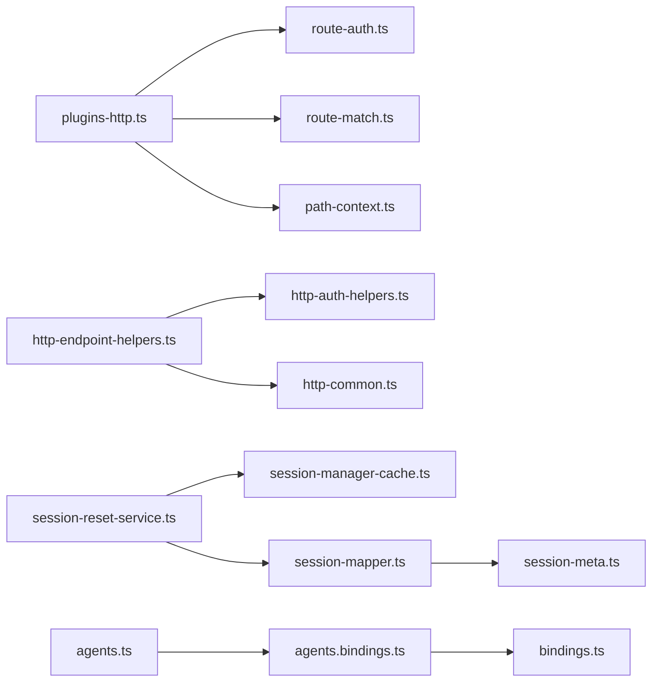

# REST API

<cite>
**Referenced Files in This Document**
- [server.ts](file://src/gateway/server.ts)
- [plugins-http.ts](file://src/gateway/server/plugins-http.ts)
- [http-endpoint-helpers.ts](file://src/gateway/http-endpoint-helpers.ts)
- [http-common.ts](file://src/gateway/http-common.ts)
- [http-auth-helpers.ts](file://src/gateway/http-auth-helpers.ts)
- [auth-context.ts](file://src/gateway/server/ws-connection/auth-context.ts)
- [browser-http-auth.ts](file://src/browser/http-auth.ts)
- [plugin-docs.md](file://docs/tools/plugin.md)
- [plugins-loader.test.ts](file://src/plugins/loader.test.ts)
- [plugins-http-route-auth.ts](file://src/gateway/server/plugins-http/route-auth.ts)
- [plugins-http-route-match.ts](file://src/gateway/server/plugins-http/route-match.ts)
- [plugins-http-path-context.ts](file://src/gateway/server/plugins-http/path-context.ts)
- [sessions.ts](file://src/gateway/sessions.ts)
- [session-reset-service.ts](file://src/gateway/session-reset-service.ts)
- [session-manager-cache.ts](file://src/agents/pi-embedded-runner/session-manager-cache.ts)
- [session-mapper.ts](file://src/acp/session-mapper.ts)
- [session-meta.ts](file://src/acp/runtime/session-meta.ts)
- [agents.ts](file://src/commands/agents.ts)
- [agents-bindings.ts](file://src/commands/agents.bindings.ts)
- [bindings.ts](file://src/config/bindings.ts)
- [GatewayConnection.swift](file://apps/macos/Sources/OpenClaw/GatewayConnection.swift)
- [OpenClawProtocol.swift](file://apps/macos/Sources/OpenClawProtocol/GatewayModels.swift)
- [OpenClawKitProtocol.swift](file://apps/shared/OpenClawKit/Sources/OpenClawProtocol/GatewayModels.swift)
- [commands-models.ts](file://src/auto-reply/reply/commands-models.ts)
- [loop-rate-limiter.ts](file://extensions/imessage/src/monitor/loop-rate-limiter.ts)
- [security.test.ts](file://extensions/synology-chat/src/security.test.ts)
</cite>

## Table of Contents
1. [Introduction](#introduction)
2. [Project Structure](#project-structure)
3. [Core Components](#core-components)
4. [Architecture Overview](#architecture-overview)
5. [Detailed Component Analysis](#detailed-component-analysis)
6. [Dependency Analysis](#dependency-analysis)
7. [Performance Considerations](#performance-considerations)
8. [Troubleshooting Guide](#troubleshooting-guide)
9. [Conclusion](#conclusion)
10. [Appendices](#appendices)

## Introduction
This document describes the OpenClaw HTTP REST API surface exposed by the Gateway server. It covers endpoint patterns, authentication, request/response handling, configuration management, session handling, agent control, and resource management. It also documents rate limiting, pagination, filtering, versioning, and client integration guidelines.

## Project Structure
The HTTP API is primarily implemented in the Gateway server module and augmented by plugin HTTP routes. Supporting utilities handle authentication, JSON body parsing, and common response patterns. Client-side Swift models and helpers are included for native integrations.

**Diagram sources**
- [server.ts](file://src/gateway/server.ts)
- [plugins-http.ts](file://src/gateway/server/plugins-http.ts)
- [http-endpoint-helpers.ts](file://src/gateway/http-endpoint-helpers.ts)
- [http-common.ts](file://src/gateway/http-common.ts)
- [http-auth-helpers.ts](file://src/gateway/http-auth-helpers.ts)
- [auth-context.ts](file://src/gateway/server/ws-connection/auth-context.ts)
- [browser-http-auth.ts](file://src/browser/http-auth.ts)
- [plugins-http-route-auth.ts](file://src/gateway/server/plugins-http/route-auth.ts)
- [plugins-http-route-match.ts](file://src/gateway/server/plugins-http/route-match.ts)
- [plugins-http-path-context.ts](file://src/gateway/server/plugins-http/path-context.ts)
- [sessions.ts](file://src/gateway/sessions.ts)
- [session-reset-service.ts](file://src/gateway/session-reset-service.ts)
- [session-manager-cache.ts](file://src/agents/pi-embedded-runner/session-manager-cache.ts)
- [session-mapper.ts](file://src/acp/session-mapper.ts)
- [session-meta.ts](file://src/acp/runtime/session-meta.ts)
- [agents.ts](file://src/commands/agents.ts)
- [agents-bindings.ts](file://src/commands/agents.bindings.ts)
- [bindings.ts](file://src/config/bindings.ts)
- [GatewayConnection.swift](file://apps/macos/Sources/OpenClaw/GatewayConnection.swift)
- [OpenClawProtocol.swift](file://apps/macos/Sources/OpenClawProtocol/GatewayModels.swift)
- [OpenClawKitProtocol.swift](file://apps/shared/OpenClawKit/Sources/OpenClawProtocol/GatewayModels.swift)

**Section sources**
- [server.ts](file://src/gateway/server.ts)
- [plugins-http.ts](file://src/gateway/server/plugins-http.ts)

## Core Components
- HTTP server entrypoint and routing pipeline
- Plugin HTTP route registration and dispatch
- Authentication helpers and rate limiting
- JSON request parsing and standardized responses
- Sessions lifecycle and reset service
- Agent bindings and configuration
- Client protocol models for native integrations

**Section sources**
- [plugins-http.ts](file://src/gateway/server/plugins-http.ts)
- [http-endpoint-helpers.ts](file://src/gateway/http-endpoint-helpers.ts)
- [http-common.ts](file://src/gateway/http-common.ts)
- [http-auth-helpers.ts](file://src/gateway/http-auth-helpers.ts)
- [auth-context.ts](file://src/gateway/server/ws-connection/auth-context.ts)
- [browser-http-auth.ts](file://src/browser/http-auth.ts)
- [sessions.ts](file://src/gateway/sessions.ts)
- [session-reset-service.ts](file://src/gateway/session-reset-service.ts)
- [agents.ts](file://src/commands/agents.ts)
- [agents-bindings.ts](file://src/commands/agents.bindings.ts)
- [bindings.ts](file://src/config/bindings.ts)
- [OpenClawProtocol.swift](file://apps/macos/Sources/OpenClawProtocol/GatewayModels.swift)
- [OpenClawKitProtocol.swift](file://apps/shared/OpenClawKit/Sources/OpenClawProtocol/GatewayModels.swift)

## Architecture Overview
The Gateway exposes a primary HTTP API and supports plugin-defined HTTP routes. Requests are authenticated and optionally rate-limited. JSON endpoints enforce method constraints and body limits. Sessions and agent bindings are managed via RPC-like methods invoked over the internal gateway transport.

**Diagram sources**
- [http-auth-helpers.ts](file://src/gateway/http-auth-helpers.ts)
- [http-endpoint-helpers.ts](file://src/gateway/http-endpoint-helpers.ts)
- [plugins-http.ts](file://src/gateway/server/plugins-http.ts)

## Detailed Component Analysis

### HTTP Server and Routing
- The server integrates plugin HTTP routes into the request pipeline.
- Routes are matched by canonical path and precedence rules (exact before prefix).
- Handlers receive the raw HTTP request and can write responses directly.

**Diagram sources**
- [plugins-http.ts](file://src/gateway/server/plugins-http.ts)
- [plugins-http-route-match.ts](file://src/gateway/server/plugins-http/route-match.ts)
- [plugins-http-path-context.ts](file://src/gateway/server/plugins-http/path-context.ts)

**Section sources**
- [plugins-http.ts](file://src/gateway/server/plugins-http.ts)
- [plugins-http-route-auth.ts](file://src/gateway/server/plugins-http/route-auth.ts)
- [plugins-http-route-match.ts](file://src/gateway/server/plugins-http/route-match.ts)
- [plugins-http-path-context.ts](file://src/gateway/server/plugins-http/path-context.ts)

### Authentication and Authorization
- Bearer token authentication is supported for HTTP endpoints.
- Unauthorized and rate-limited responses follow a standardized JSON schema.
- Shared secret rate limiting is enforced during device token/password flows.

**Diagram sources**
- [http-auth-helpers.ts](file://src/gateway/http-auth-helpers.ts)
- [auth-context.ts](file://src/gateway/server/ws-connection/auth-context.ts)
- [http-common.ts](file://src/gateway/http-common.ts)

**Section sources**
- [http-auth-helpers.ts](file://src/gateway/http-auth-helpers.ts)
- [auth-context.ts](file://src/gateway/server/ws-connection/auth-context.ts)
- [http-common.ts](file://src/gateway/http-common.ts)
- [browser-http-auth.ts](file://src/browser/http-auth.ts)

### JSON Endpoint Handling
- POST-only endpoints with configurable body size limits.
- Standardized responses for invalid method, invalid JSON, and invalid request bodies.

**Diagram sources**
- [http-endpoint-helpers.ts](file://src/gateway/http-endpoint-helpers.ts)
- [http-common.ts](file://src/gateway/http-common.ts)

**Section sources**
- [http-endpoint-helpers.ts](file://src/gateway/http-endpoint-helpers.ts)
- [http-common.ts](file://src/gateway/http-common.ts)

### Plugin HTTP Routes
- Plugins register HTTP routes with explicit auth requirements.
- Legacy registration APIs are deprecated; use the modern route registration.
- Route conflicts and overlapping auth levels are validated.

**Diagram sources**
- [plugins-http.ts](file://src/gateway/server/plugins-http.ts)
- [plugin-docs.md](file://docs/tools/plugin.md)
- [plugins-loader.test.ts](file://src/plugins/loader.test.ts)

**Section sources**
- [plugins-http.ts](file://src/gateway/server/plugins-http.ts)
- [plugin-docs.md](file://docs/tools/plugin.md)
- [plugins-loader.test.ts](file://src/plugins/loader.test.ts)

### Sessions Management
- Session resolution by label or key.
- Optional session reset and ACP runtime cancellation.
- Session metadata read and listing across agent stores.

**Diagram sources**
- [session-mapper.ts](file://src/acp/session-mapper.ts)
- [session-reset-service.ts](file://src/gateway/session-reset-service.ts)

**Section sources**
- [sessions.ts](file://src/gateway/sessions.ts)
- [session-reset-service.ts](file://src/gateway/session-reset-service.ts)
- [session-manager-cache.ts](file://src/agents/pi-embedded-runner/session-manager-cache.ts)
- [session-mapper.ts](file://src/acp/session-mapper.ts)
- [session-meta.ts](file://src/acp/runtime/session-meta.ts)

### Agent Control Interfaces
- Agent listing, identity, and deletion operations.
- Binding management for route and ACP bindings.
- Configuration retrieval for main session key selection.

**Diagram sources**
- [agents.ts](file://src/commands/agents.ts)
- [agents-bindings.ts](file://src/commands/agents.bindings.ts)
- [bindings.ts](file://src/config/bindings.ts)
- [GatewayConnection.swift](file://apps/macos/Sources/OpenClaw/GatewayConnection.swift)

**Section sources**
- [agents.ts](file://src/commands/agents.ts)
- [agents-bindings.ts](file://src/commands/agents.bindings.ts)
- [bindings.ts](file://src/config/bindings.ts)
- [GatewayConnection.swift](file://apps/macos/Sources/OpenClaw/GatewayConnection.swift)

### Resource Management Operations
- Pagination and filtering via command-line style tokens (page, limit/size, all).
- Loop rate limiting to prevent amplification in monitoring contexts.

**Diagram sources**
- [commands-models.ts](file://src/auto-reply/reply/commands-models.ts)
- [loop-rate-limiter.ts](file://extensions/imessage/src/monitor/loop-rate-limiter.ts)

**Section sources**
- [commands-models.ts](file://src/auto-reply/reply/commands-models.ts)
- [loop-rate-limiter.ts](file://extensions/imessage/src/monitor/loop-rate-limiter.ts)

## Dependency Analysis
- HTTP server depends on plugin route registry and matching utilities.
- Endpoint helpers depend on auth helpers and common response utilities.
- Sessions and agent operations rely on gateway RPC invocations.
- Clients depend on protocol models for typed requests/responses.

**Diagram sources**
- [plugins-http.ts](file://src/gateway/server/plugins-http.ts)
- [plugins-http-route-auth.ts](file://src/gateway/server/plugins-http/route-auth.ts)
- [plugins-http-route-match.ts](file://src/gateway/server/plugins-http/route-match.ts)
- [plugins-http-path-context.ts](file://src/gateway/server/plugins-http/path-context.ts)
- [http-endpoint-helpers.ts](file://src/gateway/http-endpoint-helpers.ts)
- [http-auth-helpers.ts](file://src/gateway/http-auth-helpers.ts)
- [http-common.ts](file://src/gateway/http-common.ts)
- [session-reset-service.ts](file://src/gateway/session-reset-service.ts)
- [session-manager-cache.ts](file://src/agents/pi-embedded-runner/session-manager-cache.ts)
- [session-mapper.ts](file://src/acp/session-mapper.ts)
- [session-meta.ts](file://src/acp/runtime/session-meta.ts)
- [agents.ts](file://src/commands/agents.ts)
- [agents-bindings.ts](file://src/commands/agents.bindings.ts)
- [bindings.ts](file://src/config/bindings.ts)

**Section sources**
- [plugins-http.ts](file://src/gateway/server/plugins-http.ts)
- [http-endpoint-helpers.ts](file://src/gateway/http-endpoint-helpers.ts)
- [session-reset-service.ts](file://src/gateway/session-reset-service.ts)
- [agents.ts](file://src/commands/agents.ts)

## Performance Considerations
- Prefer exact route matches to minimize fallback traversal.
- Use body size limits to protect against large payloads.
- Apply per-client rate limiting for authentication attempts.
- Cache session metadata when appropriate to reduce disk I/O.

[No sources needed since this section provides general guidance]

## Troubleshooting Guide
- Unauthorized responses indicate missing or invalid bearer token.
- Rate-limited responses include a Retry-After header; back off and retry.
- Method Not Allowed indicates the endpoint requires a different HTTP method.
- Internal errors from plugin routes are logged and surfaced as 500 text responses.

**Section sources**
- [http-common.ts](file://src/gateway/http-common.ts)
- [plugins-http.ts](file://src/gateway/server/plugins-http.ts)

## Conclusion
OpenClaw’s HTTP API combines a robust Gateway server with extensible plugin routes. Authentication and rate limiting are standardized, while sessions and agent bindings are managed via internal RPC methods. Clients should adhere to the documented patterns for authentication, pagination, and error handling.

[No sources needed since this section summarizes without analyzing specific files]

## Appendices

### API Reference: Endpoints and Schemas

- Base URL
  - Hosted by the Gateway server; clients should construct absolute URLs using the configured host and port.

- Authentication
  - Header: Authorization: Bearer <token>
  - Responses:
    - 401 Unauthorized: {"error": {"message": "...", "type": "unauthorized"}}
    - 429 Too Many Requests: {"error": {"message": "...", "type": "rate_limited"}} (with Retry-After header)

- Methods and Paths
  - POST /v1/ok
    - Purpose: Example JSON endpoint.
    - Auth: Required (bearer token).
    - Body: JSON up to configured max bytes.
    - Success: 200 with parsed JSON body.
    - Errors: 400 invalid request, 405 method not allowed, 401/429 auth failures.

- Plugin HTTP Routes
  - Registration: Plugins define routes with explicit auth and match semantics.
  - Dispatch: Exact matches take precedence; handlers may return false to allow fallthrough.
  - Validation: Conflicting exact/prefix registrations and mismatched auth levels are rejected.

- Sessions
  - Resolution: POST /sessions/resolve with { label|key } -> { ok, key }
  - Reset: POST /sessions/reset with { key } -> outcome
  - Metadata: Read and list session entries via internal methods.

- Agents
  - List: GET /agents/list -> array of agents
  - Identity: GET /agents/identity -> identity info
  - Delete: DELETE /agents with { agentId, deleteFiles? } -> { ok, agentId, removedBindings }
  - Bindings: Manage route/acp bindings via configuration APIs.

- Pagination and Filtering
  - Tokens: page=<n>, limit=<n>|size=<n>, all|--all
  - Defaults and caps are applied; invalid values are ignored.

- Rate Limiting
  - Shared secret rate limiting during device token/password flows.
  - Per-client auth attempts are rate-limited; clients should honor Retry-After.

- Versioning and Compatibility
  - Protocol version is enforced for internal client connections.
  - Deprecated plugin HTTP handler registration is flagged and migrated to new route registration.

- Client Implementation Guidelines
  - Use bearer token authentication.
  - Respect method constraints and body size limits.
  - Honor 429 responses and implement exponential backoff.
  - Use pagination tokens for large result sets.
  - For native clients, leverage provided protocol models for typed requests and responses.

**Section sources**
- [http-endpoint-helpers.ts](file://src/gateway/http-endpoint-helpers.ts)
- [http-common.ts](file://src/gateway/http-common.ts)
- [plugins-http.ts](file://src/gateway/server/plugins-http.ts)
- [plugin-docs.md](file://docs/tools/plugin.md)
- [session-mapper.ts](file://src/acp/session-mapper.ts)
- [session-reset-service.ts](file://src/gateway/session-reset-service.ts)
- [agents.ts](file://src/commands/agents.ts)
- [commands-models.ts](file://src/auto-reply/reply/commands-models.ts)
- [auth-context.ts](file://src/gateway/server/ws-connection/auth-context.ts)
- [OpenClawProtocol.swift](file://apps/macos/Sources/OpenClawProtocol/GatewayModels.swift)
- [OpenClawKitProtocol.swift](file://apps/shared/OpenClawKit/Sources/OpenClawProtocol/GatewayModels.swift)