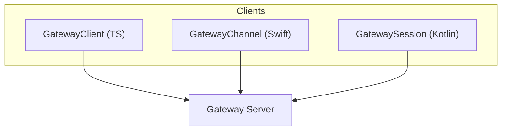
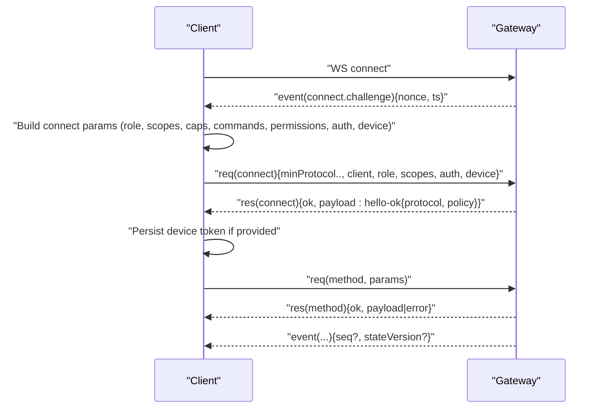
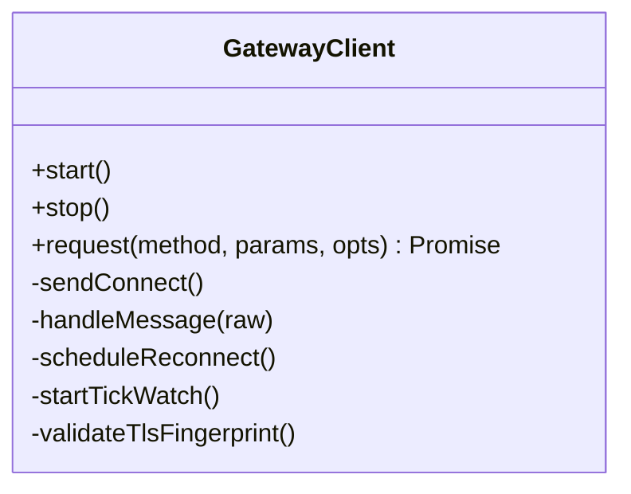
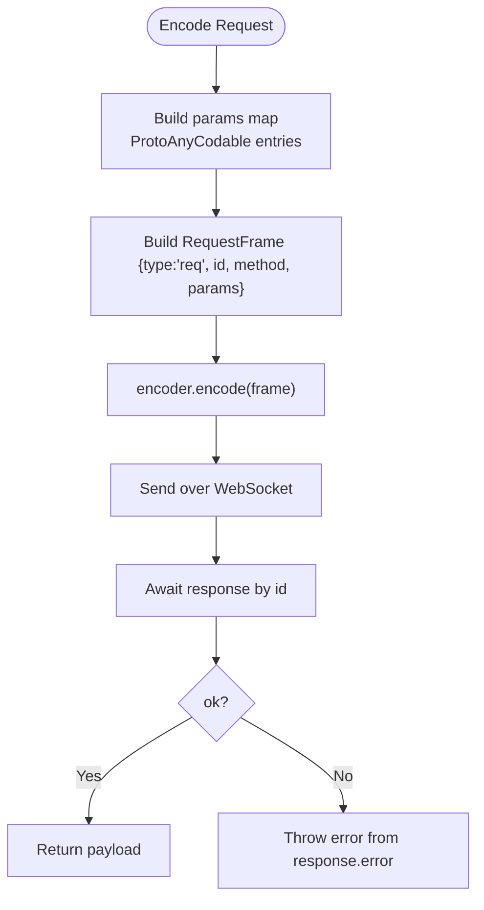
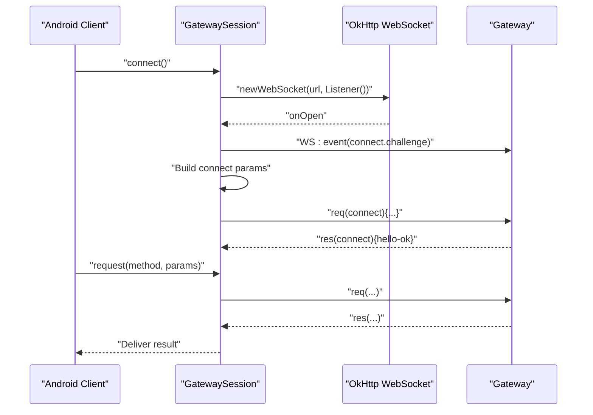
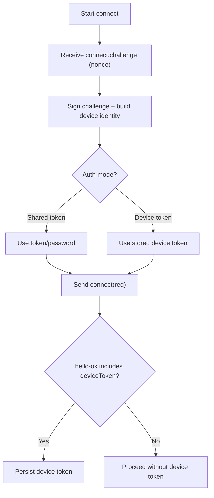
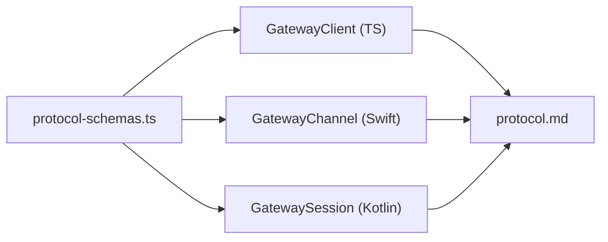

# RPC Adapters

<cite>
**Referenced Files in This Document**
- [rpc.md](file://docs/reference/rpc.md)
- [protocol.md](file://docs/gateway/protocol.md)
- [bridge-protocol.md](file://docs/gateway/bridge-protocol.md)
- [authentication.md](file://docs/gateway/authentication.md)
- [protocol-schemas.ts](file://src/gateway/protocol/schema/protocol-schemas.ts)
- [client.ts](file://src/gateway/client.ts)
- [GatewayChannel.swift](file://apps/shared/OpenClawKit/Sources/OpenClawKit/GatewayChannel.swift)
- [BridgeFrames.swift](file://apps/shared/OpenClawKit/Sources/OpenClawKit/BridgeFrames.swift)
- [WizardCommand.swift](file://apps/macos/Sources/OpenClawMacCLI/WizardCommand.swift)
- [GatewaySession.kt](file://apps/android/app/src/main/java/ai/openclaw/app/gateway/GatewaySession.kt)
- [GatewayProtocol.kt](file://apps/android/app/src/main/java/ai/openclaw/app/gateway/GatewayProtocol.kt)
- [GatewayTls.kt](file://apps/android/app/src/main/java/ai/openclaw/app/gateway/GatewayTls.kt)
- [ConnectionManager.kt](file://apps/android/app/src/main/java/ai/openclaw/app/node/ConnectionManager.kt)
- [server.auth.default-token.suite.ts](file://src/gateway/server.auth.default-token.suite.ts)
- [server.config-patch.test.ts](file://src/gateway/server.config-patch.test.ts)
</cite>

## Table of Contents
1. [Introduction](#introduction)
2. [Project Structure](#project-structure)
3. [Core Components](#core-components)
4. [Architecture Overview](#architecture-overview)
5. [Detailed Component Analysis](#detailed-component-analysis)
6. [Dependency Analysis](#dependency-analysis)
7. [Performance Considerations](#performance-considerations)
8. [Troubleshooting Guide](#troubleshooting-guide)
9. [Conclusion](#conclusion)
10. [Appendices](#appendices)

## Introduction
This document describes the RPC adapters and gateway protocol used by OpenClaw. It covers the WebSocket-based gateway protocol, method contracts, invocation patterns, authentication and authorization, security contexts, validation and serialization, response handling, client implementation patterns across platforms, and operational guidance for reliability, performance, and troubleshooting.

## Project Structure
OpenClaw exposes a unified gateway RPC surface over WebSocket. The protocol is defined by strongly typed schemas and implemented by clients in multiple environments (JavaScript/TypeScript, Swift, Kotlin/Java). Supporting documentation explains framing, roles/scopes, device identity, and authentication.

**Diagram sources**
- [client.ts](file://src/gateway/client.ts#L86-L531)
- [GatewayChannel.swift](file://apps/shared/OpenClawKit/Sources/OpenClawKit/GatewayChannel.swift#L736-L782)
- [GatewaySession.kt](file://apps/android/app/src/main/java/ai/openclaw/app/gateway/GatewaySession.kt#L219-L476)

**Section sources**
- [protocol.md](file://docs/gateway/protocol.md#L10-L261)
- [rpc.md](file://docs/reference/rpc.md#L1-L44)

## Core Components
- Gateway WebSocket protocol: request/response/event frames, connect handshake, versioning, and security.
- Typed schemas defining the RPC surface and validation rules.
- Client implementations for operator and node roles with scoped capabilities.
- Authentication via shared token/password or device token, plus device identity and challenge-response signing.
- Bridge protocol (legacy TCP JSONL) for node transport; superseded by the unified WebSocket protocol.

**Section sources**
- [protocol.md](file://docs/gateway/protocol.md#L10-L261)
- [protocol-schemas.ts](file://src/gateway/protocol/schema/protocol-schemas.ts#L162-L302)
- [bridge-protocol.md](file://docs/gateway/bridge-protocol.md#L1-L92)

## Architecture Overview
The gateway acts as the central control plane and node transport. Clients connect over WebSocket, exchange a connect challenge, sign and authenticate, then exchange RPC requests/responses and events. The protocol defines roles (operator/node), scopes, capabilities, and device identity claims.

**Diagram sources**
- [protocol.md](file://docs/gateway/protocol.md#L22-L90)
- [client.ts](file://src/gateway/client.ts#L235-L358)
- [protocol-schemas.ts](file://src/gateway/protocol/schema/protocol-schemas.ts#L95-L104)

## Detailed Component Analysis

### Gateway Protocol Specification
- Transport: WebSocket with JSON text frames; first frame must be a connect request.
- Framing:
  - Request: {type:"req", id, method, params}
  - Response: {type:"res", id, ok, payload|error}
  - Event: {type:"event", event, payload, seq?, stateVersion?}
- Handshake:
  - Pre-connect challenge: server emits event(connect.challenge){nonce, ts}.
  - Client responds with req(connect){minProtocol..maxProtocol, client, role, scopes, auth, device}.
  - Server replies res(connect){ok, hello-ok{protocol, policy}}.
- Roles and scopes:
  - operator: control-plane clients (CLI/UI/automation).
  - node: capability hosts (camera/screen/canvas/system.run).
  - Scopes define coarse-grained access; method-level checks may apply.
- Capabilities, commands, permissions:
  - Nodes declare caps, commands allowlist, and permissions; enforced server-side.
- Versioning:
  - PROTOCOL_VERSION is defined and used by clients.
  - Schemas generated from TypeBox definitions.
- Authentication:
  - Shared token/password or device token; device token issued post-pairing.
  - Device identity and challenge signing required for all WS clients.
- TLS and pinning:
  - Optional TLS; optional certificate fingerprint pinning.

**Section sources**
- [protocol.md](file://docs/gateway/protocol.md#L10-L261)
- [protocol-schemas.ts](file://src/gateway/protocol/schema/protocol-schemas.ts#L301-L302)

### Client Implementation Patterns

#### JavaScript/TypeScript (Node.js)
- GatewayClient manages WS lifecycle, connect challenge handling, request/response dispatch, and reconnection with exponential backoff.
- Supports TLS fingerprint validation and security checks against plaintext WS to non-loopback endpoints.
- Provides request() with idempotent expectation for long-running operations.

**Diagram sources**
- [client.ts](file://src/gateway/client.ts#L86-L531)

**Section sources**
- [client.ts](file://src/gateway/client.ts#L86-L531)

#### Swift (macOS/iOS)
- GatewayChannel encodes/decodes frames, tracks pending requests, handles timeouts, and logs encoding failures.
- Uses generated models to avoid JSON serialization pitfalls.

**Diagram sources**
- [GatewayChannel.swift](file://apps/shared/OpenClawKit/Sources/OpenClawKit/GatewayChannel.swift#L736-L782)

**Section sources**
- [GatewayChannel.swift](file://apps/shared/OpenClawKit/Sources/OpenClawKit/GatewayChannel.swift#L736-L782)

#### Kotlin/Android
- GatewaySession manages WS lifecycle, connect challenge, request/response, and event handling.
- Builds connect options for operator or node roles with caps, commands, permissions, and client info.
- Supports TLS configuration and fingerprint handling.

**Diagram sources**
- [GatewaySession.kt](file://apps/android/app/src/main/java/ai/openclaw/app/gateway/GatewaySession.kt#L219-L476)
- [ConnectionManager.kt](file://apps/android/app/src/main/java/ai/openclaw/app/node/ConnectionManager.kt#L128-L150)
- [GatewayProtocol.kt](file://apps/android/app/src/main/java/ai/openclaw/app/gateway/GatewayProtocol.kt#L1-L3)

**Section sources**
- [GatewaySession.kt](file://apps/android/app/src/main/java/ai/openclaw/app/gateway/GatewaySession.kt#L1-L476)
- [ConnectionManager.kt](file://apps/android/app/src/main/java/ai/openclaw/app/node/ConnectionManager.kt#L115-L156)
- [GatewayProtocol.kt](file://apps/android/app/src/main/java/ai/openclaw/app/gateway/GatewayProtocol.kt#L1-L3)

### Method Contracts and Invocation Patterns
- Methods are defined by the protocol schemas and invoked via req/res frames.
- Side-effecting methods may require idempotency keys (per schema).
- Operator helper methods include tools.catalog and skills.bins.
- Node helper methods include skills.bins for auto-allow checks.

**Section sources**
- [protocol.md](file://docs/gateway/protocol.md#L172-L190)
- [protocol-schemas.ts](file://src/gateway/protocol/schema/protocol-schemas.ts#L162-L302)

### Authentication Modes and Authorization Policies
- Shared token/password: configured via environment or CLI flags; used for initial connect.
- Device token: issued by gateway post-pairing; persisted and reused for subsequent connects.
- Device identity and challenge signing: required for all WS clients; includes nonce and signature.
- Role and scopes gate access; method-level checks may apply.
- TLS pinning: optional; when enabled, requires wss:// and validates server certificate fingerprint.

**Diagram sources**
- [protocol.md](file://docs/gateway/protocol.md#L200-L223)
- [client.ts](file://src/gateway/client.ts#L235-L358)

**Section sources**
- [protocol.md](file://docs/gateway/protocol.md#L200-L223)
- [client.ts](file://src/gateway/client.ts#L235-L358)
- [server.auth.default-token.suite.ts](file://src/gateway/server.auth.default-token.suite.ts#L1-L38)

### Validation, Serialization, and Response Handling
- Validation:
  - Request, response, and event frames validated against schemas.
  - Connect challenge must include a non-empty nonce.
- Serialization:
  - Swift uses generated models to encode frames.
  - Android uses JSON builders for connect params and parses frames.
- Response handling:
  - Pending requests tracked by id; final result delivered when ok=true or error returned.
  - For long-running operations, accept may be followed by final result.

**Section sources**
- [client.ts](file://src/gateway/client.ts#L504-L529)
- [GatewayChannel.swift](file://apps/shared/OpenClawKit/Sources/OpenClawKit/GatewayChannel.swift#L736-L782)
- [WizardCommand.swift](file://apps/macos/Sources/OpenClawMacCLI/WizardCommand.swift#L192-L224)

### Parameter Serialization Examples
- Connect parameters include minProtocol, maxProtocol, client metadata, role, scopes, auth, and device identity.
- Android composes JSON with caps, commands, permissions, locale, and optional userAgent.

**Section sources**
- [client.ts](file://src/gateway/client.ts#L303-L326)
- [GatewaySession.kt](file://apps/android/app/src/main/java/ai/openclaw/app/gateway/GatewaySession.kt#L443-L468)

### Error Handling and Retry Mechanisms
- Client-side:
  - Exponential backoff on close; TLS fingerprint mismatch triggers immediate failure.
  - Connect challenge timeout closes with policy violation code.
  - Pending requests resolved with errors on disconnect.
- Server-side tests demonstrate parameter validation and error responses for invalid config schema lookups.

**Section sources**
- [client.ts](file://src/gateway/client.ts#L113-L142)
- [client.ts](file://src/gateway/client.ts#L433-L451)
- [client.ts](file://src/gateway/client.ts#L428-L431)
- [server.config-patch.test.ts](file://src/gateway/server.config-patch.test.ts#L85-L122)

### Legacy Bridge Protocol (Historical Reference)
- TCP JSONL with optional TLS, discovery via Bonjour/tailnet, and pairing-based node admission.
- Legacy allowlist enforcement; superseded by unified WebSocket protocol.

**Section sources**
- [bridge-protocol.md](file://docs/gateway/bridge-protocol.md#L1-L92)

## Dependency Analysis
- Protocol schemas define the RPC surface and validation rules used by clients.
- Client implementations depend on protocol schemas and device identity/auth utilities.
- Android and Swift clients share the same conceptual flow despite different transports.

**Diagram sources**
- [protocol-schemas.ts](file://src/gateway/protocol/schema/protocol-schemas.ts#L162-L302)
- [client.ts](file://src/gateway/client.ts#L28-L36)
- [GatewayChannel.swift](file://apps/shared/OpenClawKit/Sources/OpenClawKit/GatewayChannel.swift#L736-L782)
- [GatewaySession.kt](file://apps/android/app/src/main/java/ai/openclaw/app/gateway/GatewaySession.kt#L219-L476)

**Section sources**
- [protocol-schemas.ts](file://src/gateway/protocol/schema/protocol-schemas.ts#L162-L302)
- [client.ts](file://src/gateway/client.ts#L28-L36)

## Performance Considerations
- Payload sizing: client allows larger payloads for node features.
- Reconnection backoff: exponential up to a capped delay.
- Tick watch: detects stalled connections and triggers closure to prevent silent hangs.
- TLS fingerprint validation occurs at connect time to avoid repeated handshakes.

**Section sources**
- [client.ts](file://src/gateway/client.ts#L144-L146)
- [client.ts](file://src/gateway/client.ts#L433-L451)
- [client.ts](file://src/gateway/client.ts#L453-L475)
- [client.ts](file://src/gateway/client.ts#L147-L170)

## Troubleshooting Guide
- Connectivity:
  - Plaintext ws:// to non-loopback is blocked for security; use wss:// or SSH tunnel.
  - TLS fingerprint mismatch or missing fingerprint causes immediate connect failure.
- Authentication:
  - Missing or invalid device nonce/signature leads to policy violations.
  - Device token mismatch clears persisted device auth; re-pair if needed.
- Protocol:
  - Missing connect challenge nonce or timeout closes with policy violation.
  - Validate method parameters against schema; invalid inputs return errors.
- Monitoring:
  - Observe tick events and intervals; gaps indicate stalls.
  - Inspect close codes and reasons for diagnosis.

**Section sources**
- [protocol.md](file://docs/gateway/protocol.md#L200-L223)
- [client.ts](file://src/gateway/client.ts#L113-L142)
- [client.ts](file://src/gateway/client.ts#L173-L182)
- [client.ts](file://src/gateway/client.ts#L191-L211)
- [client.ts](file://src/gateway/client.ts#L428-L431)
- [client.ts](file://src/gateway/client.ts#L471-L474)

## Conclusion
OpenClaw’s gateway RPC adapter provides a secure, typed, and extensible control plane over WebSocket. Clients implement a consistent handshake, authentication, and invocation pattern, with strong validation and resilience built-in. The protocol supports operator and node roles, scoped capabilities, and device identity, enabling robust automation and device integration across platforms.

## Appendices

### Appendix A: RPC Adapter Patterns (External CLIs)
- HTTP daemon pattern (signal-cli): JSON-RPC over HTTP with SSE event stream and health probe.
- Stdio child process pattern (legacy imsg): line-delimited JSON-RPC over stdin/stdout.

**Section sources**
- [rpc.md](file://docs/reference/rpc.md#L13-L37)

### Appendix B: CLI Invocation Example (macOS)
- Demonstrates constructing a request frame, sending over WS, and decoding the response.

**Section sources**
- [WizardCommand.swift](file://apps/macos/Sources/OpenClawMacCLI/WizardCommand.swift#L192-L224)