# WebSocket API

<cite>
**Referenced Files in This Document**
- [ws-connection.ts](file://src/gateway/server/ws-connection.ts)
- [message-handler.ts](file://src/gateway/server/ws-connection/message-handler.ts)
- [client.ts](file://src/gateway/client.ts)
- [frames.ts](file://src/gateway/protocol/schema/frames.ts)
- [index.ts](file://src/gateway/protocol/index.ts)
- [ws-types.ts](file://src/gateway/server/ws-types.ts)
- [typebox.md](file://docs/concepts/typebox.md)
- [GatewayWebSocketTestSupport.swift](file://apps/macos/Tests/OpenClawIPCTests/GatewayWebSocketTestSupport.swift)
- [GatewaySession.kt](file://apps/android/app/src/main/java/ai/openclaw/app/gateway/GatewaySession.kt)
- [reconnect.ts](file://src/web/reconnect.ts)
- [health-state.ts](file://src/gateway/server/health-state.ts)
- [system.ts](file://src/gateway/server-methods/system.ts)
- [media-stream.ts](file://extensions/voice-call/src/media-stream.ts)
- [loop-rate-limiter.ts](file://src/imessage/monitor/loop-rate-limiter.ts)
</cite>

## Table of Contents
1. [Introduction](#introduction)
2. [Project Structure](#project-structure)
3. [Core Components](#core-components)
4. [Architecture Overview](#architecture-overview)
5. [Detailed Component Analysis](#detailed-component-analysis)
6. [Dependency Analysis](#dependency-analysis)
7. [Performance Considerations](#performance-considerations)
8. [Troubleshooting Guide](#troubleshooting-guide)
9. [Conclusion](#conclusion)
10. [Appendices](#appendices)

## Introduction
This document specifies OpenClaw’s WebSocket API for real-time communication between clients and the Gateway. It covers connection establishment, authentication handshake, protocol frames, event streaming, subscription semantics, connection lifecycle, reconnection strategies, rate limiting, and performance considerations. It also provides client implementation guidance for JavaScript/Node.js, Swift, and Kotlin.

## Project Structure
The WebSocket API is implemented in the Gateway server and client modules, with protocol schemas defined centrally and validated at runtime.

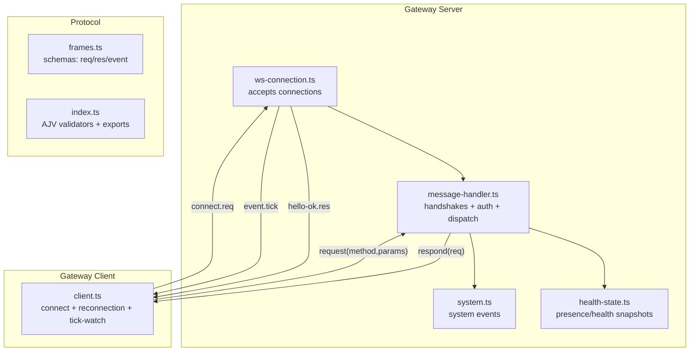

**Diagram sources**
- [ws-connection.ts](file://src/gateway/server/ws-connection.ts#L93-L319)
- [message-handler.ts](file://src/gateway/server/ws-connection/message-handler.ts#L236-L800)
- [client.ts](file://src/gateway/client.ts#L86-L531)
- [frames.ts](file://src/gateway/protocol/schema/frames.ts#L125-L164)
- [index.ts](file://src/gateway/protocol/index.ts#L253-L458)
- [health-state.ts](file://src/gateway/server/health-state.ts#L1-L85)
- [system.ts](file://src/gateway/server-methods/system.ts#L103-L134)

**Section sources**
- [ws-connection.ts](file://src/gateway/server/ws-connection.ts#L93-L319)
- [client.ts](file://src/gateway/client.ts#L86-L531)
- [frames.ts](file://src/gateway/protocol/schema/frames.ts#L125-L164)
- [index.ts](file://src/gateway/protocol/index.ts#L253-L458)

## Core Components
- Gateway WebSocket server: manages connections, enforces handshake and authentication, validates frames, and streams events.
- Gateway client: connects to the Gateway, performs the handshake, handles reconnection, and monitors liveness via periodic ticks.
- Protocol schemas: define the canonical message formats and validation rules for frames, parameters, and responses.

Key responsibilities:
- Connection lifecycle: accept, handshake, authenticate, stream events, close with reasons.
- Authentication: device identity signatures, shared tokens/passwords, role/scopes resolution.
- Eventing: presence, health, agent, shutdown, and tick events.
- Request/response: RPC-style methods invoked by clients.

**Section sources**
- [ws-connection.ts](file://src/gateway/server/ws-connection.ts#L115-L319)
- [message-handler.ts](file://src/gateway/server/ws-connection/message-handler.ts#L363-L800)
- [client.ts](file://src/gateway/client.ts#L86-L531)
- [frames.ts](file://src/gateway/protocol/schema/frames.ts#L125-L164)

## Architecture Overview
The Gateway uses a typed, validated WebSocket protocol with three frame types: request, response, and event. The first message must be a connect request. After successful handshake, the server sends a hello-ok response and begins sending periodic tick events. Clients can then call methods and receive events.

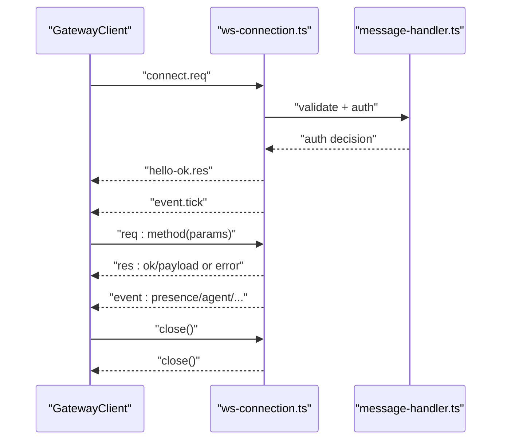

**Diagram sources**
- [client.ts](file://src/gateway/client.ts#L235-L358)
- [ws-connection.ts](file://src/gateway/server/ws-connection.ts#L174-L179)
- [message-handler.ts](file://src/gateway/server/ws-connection/message-handler.ts#L436-L478)
- [frames.ts](file://src/gateway/protocol/schema/frames.ts#L125-L164)

## Detailed Component Analysis

### Connection Establishment and Handshake
- The server sends a connect.challenge event containing a nonce and timestamp upon initial connection.
- The client responds with a connect request containing protocol range, client metadata, optional device identity, and optional shared auth credentials.
- The server validates protocol range, checks origin/browser security, resolves authentication (device identity or shared token/password), and negotiates roles/scopes.
- On success, the server replies with hello-ok, advertising supported methods/events, snapshot state, and policy (including tickIntervalMs).

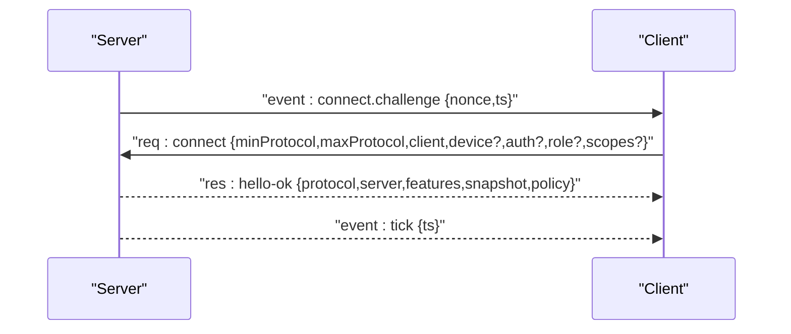

**Diagram sources**
- [ws-connection.ts](file://src/gateway/server/ws-connection.ts#L174-L179)
- [client.ts](file://src/gateway/client.ts#L360-L375)
- [message-handler.ts](file://src/gateway/server/ws-connection/message-handler.ts#L436-L478)
- [frames.ts](file://src/gateway/protocol/schema/frames.ts#L125-L164)

**Section sources**
- [ws-connection.ts](file://src/gateway/server/ws-connection.ts#L141-L179)
- [client.ts](file://src/gateway/client.ts#L360-L375)
- [message-handler.ts](file://src/gateway/server/ws-connection/message-handler.ts#L436-L478)

### Authentication and Authorization
- Device identity: optional device block with id/publicKey/signature/signedAt/nonce. Signature is verified against a derived payload built from connect params and the nonce.
- Shared auth: token/deviceToken/password. Device tokens may be issued during hello-ok and persisted per device/role.
- Role and scopes: parsed and validated; empty scopes imply no permissions unless explicitly allowed by policy.
- Origin/Browser security: enforced for certain clients; host-header fallback is logged and configurable.

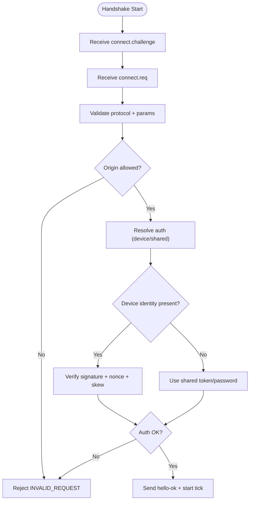

**Diagram sources**
- [message-handler.ts](file://src/gateway/server/ws-connection/message-handler.ts#L497-L747)
- [frames.ts](file://src/gateway/protocol/schema/frames.ts#L20-L69)

**Section sources**
- [message-handler.ts](file://src/gateway/server/ws-connection/message-handler.ts#L497-L747)
- [frames.ts](file://src/gateway/protocol/schema/frames.ts#L20-L69)

### Message Formats and Frame Types
All messages are JSON objects with a type discriminator:
- Request: { type: "req", id, method, params? }
- Response: { type: "res", id, ok, payload?, error? }
- Event: { type: "event", event, payload?, seq?, stateVersion? }

Hello-ok includes server info, advertised methods/events, snapshot, and policy (maxPayload, maxBufferedBytes, tickIntervalMs).

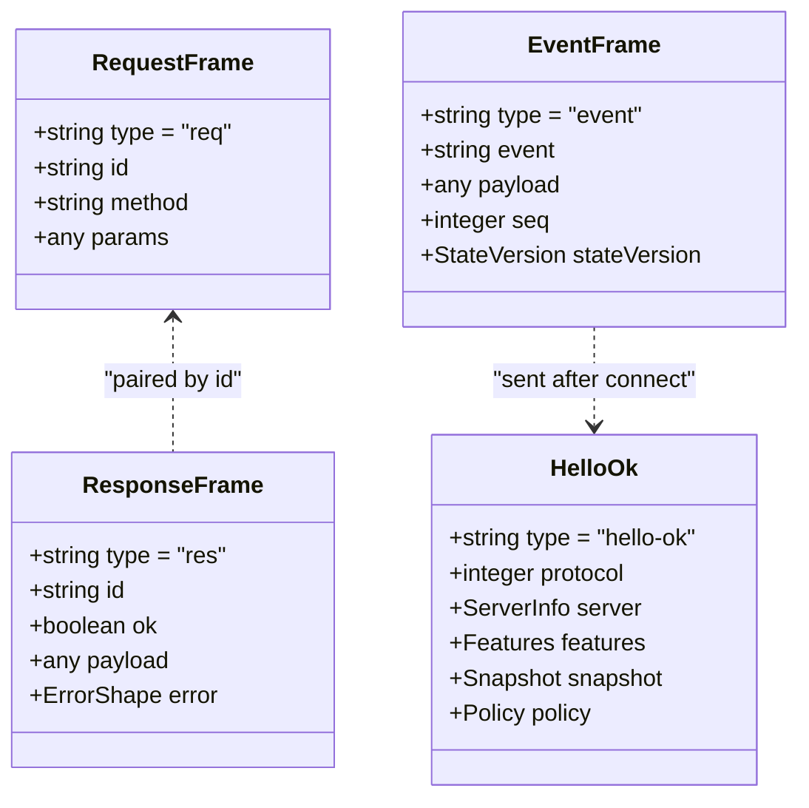

**Diagram sources**
- [frames.ts](file://src/gateway/protocol/schema/frames.ts#L125-L164)
- [index.ts](file://src/gateway/protocol/index.ts#L460-L564)

**Section sources**
- [frames.ts](file://src/gateway/protocol/schema/frames.ts#L125-L164)
- [index.ts](file://src/gateway/protocol/index.ts#L460-L564)
- [typebox.md](file://docs/concepts/typebox.md#L20-L144)

### Event Types and Streaming
Common events include:
- tick: periodic heartbeat carrying a timestamp.
- presence: presence snapshot with stateVersion.
- health: health snapshot with stateVersion.
- agent: agent lifecycle/streaming events.
- shutdown: server shutdown notice with optional restart expectation.

Events carry optional seq and stateVersion for ordering and snapshot tracking.

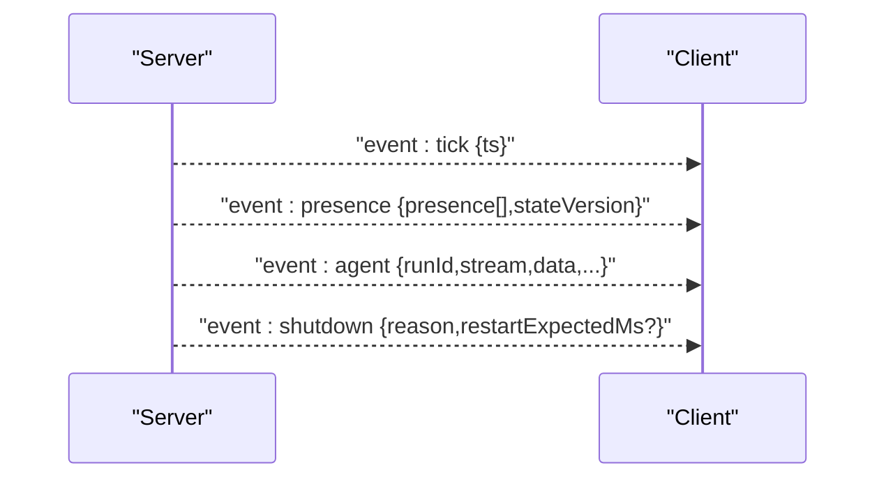

**Diagram sources**
- [frames.ts](file://src/gateway/protocol/schema/frames.ts#L5-L18)
- [health-state.ts](file://src/gateway/server/health-state.ts#L1-L85)
- [system.ts](file://src/gateway/server-methods/system.ts#L103-L134)

**Section sources**
- [frames.ts](file://src/gateway/protocol/schema/frames.ts#L5-L18)
- [health-state.ts](file://src/gateway/server/health-state.ts#L1-L85)
- [system.ts](file://src/gateway/server-methods/system.ts#L103-L134)

### Bidirectional Communication Patterns
- Methods: clients call methods (e.g., health, send, chat.send) via request frames; servers respond with response frames.
- Events: server pushes events to clients; clients can react to presence/agent/health changes.
- Policy-driven behavior: server advertises maxPayload and tickIntervalMs; clients adjust behavior accordingly.

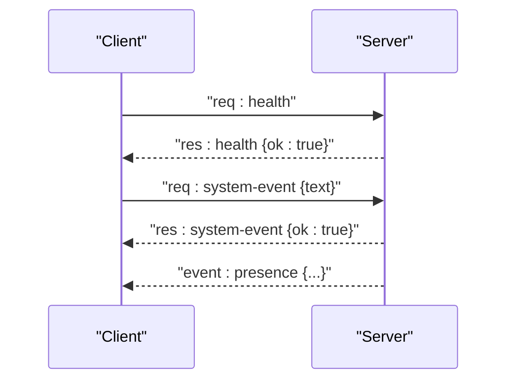

**Diagram sources**
- [client.ts](file://src/gateway/client.ts#L504-L529)
- [system.ts](file://src/gateway/server-methods/system.ts#L103-L134)

**Section sources**
- [client.ts](file://src/gateway/client.ts#L504-L529)
- [system.ts](file://src/gateway/server-methods/system.ts#L103-L134)

### Connection Lifecycle Management
- Open: server logs incoming connections and sends connect.challenge.
- Handshake: client responds with connect; server validates and authenticates.
- Connected: server sends hello-ok and starts tick events.
- Close: server cleans up presence/node subscriptions and logs close context; client schedules reconnection.

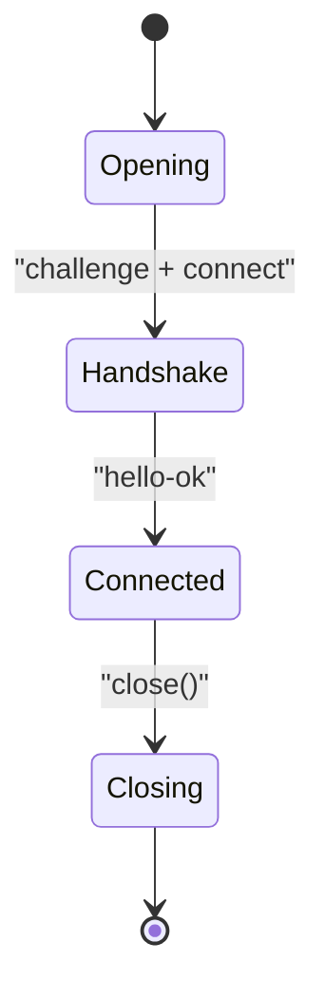

**Diagram sources**
- [ws-connection.ts](file://src/gateway/server/ws-connection.ts#L141-L265)
- [client.ts](file://src/gateway/client.ts#L184-L222)

**Section sources**
- [ws-connection.ts](file://src/gateway/server/ws-connection.ts#L141-L265)
- [client.ts](file://src/gateway/client.ts#L184-L222)

### Reconnection Strategies
- Client-side backoff: exponential with jitter and capped delays; supports max attempts.
- Tick-watch: client tracks last tick; closes if gap exceeds twice the tickIntervalMs.
- Server-side limits: rate limiting for upgrades and pairing decisions; throttling for control-plane operations.

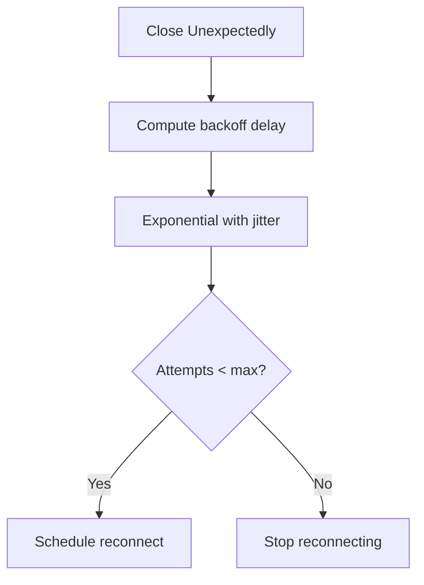

**Diagram sources**
- [client.ts](file://src/gateway/client.ts#L433-L444)
- [reconnect.ts](file://src/web/reconnect.ts#L28-L46)

**Section sources**
- [client.ts](file://src/gateway/client.ts#L433-L444)
- [reconnect.ts](file://src/web/reconnect.ts#L28-L46)

### Rate Limiting and Message Queuing
- Device identity loops: per-conversation rate limiter suppresses rapid-fire echoes.
- Control-plane rate limiting: limits frequent control-plane writes per minute.
- Media/streaming: upgrade rejection with 429/503 when overloaded; pending connection tracking.

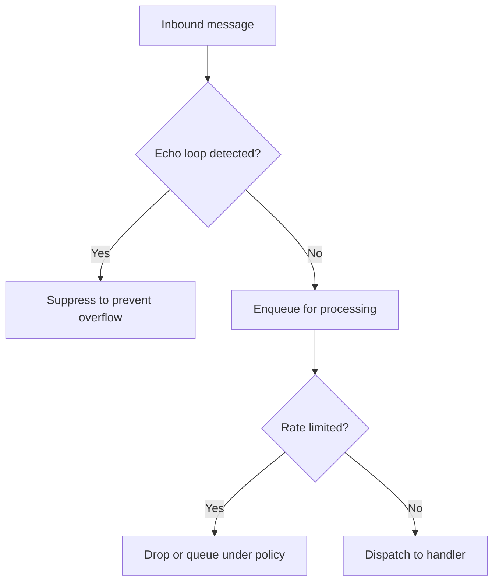

**Diagram sources**
- [loop-rate-limiter.ts](file://src/imessage/monitor/loop-rate-limiter.ts#L1-L44)
- [media-stream.ts](file://extensions/voice-call/src/media-stream.ts#L302-L345)

**Section sources**
- [loop-rate-limiter.ts](file://src/imessage/monitor/loop-rate-limiter.ts#L1-L44)
- [media-stream.ts](file://extensions/voice-call/src/media-stream.ts#L302-L345)

### Client Implementation Examples
- Node.js/JavaScript: use the provided GatewayClient class to connect, handle events, and manage reconnection.
- Swift (macOS): URLSessionWebSocketTask can be used; test support demonstrates expected hello-ok and request framing.
- Kotlin (Android): device auth payload building mirrors the client’s device signing flow.

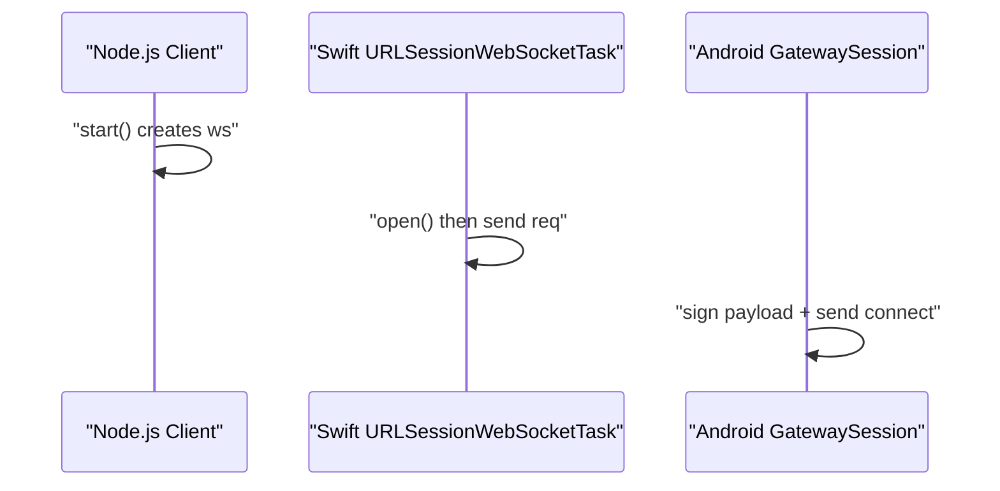

**Diagram sources**
- [client.ts](file://src/gateway/client.ts#L108-L222)
- [GatewayWebSocketTestSupport.swift](file://apps/macos/Tests/OpenClawIPCTests/GatewayWebSocketTestSupport.swift#L31-L71)
- [GatewaySession.kt](file://apps/android/app/src/main/java/ai/openclaw/app/gateway/GatewaySession.kt#L414-L441)

**Section sources**
- [client.ts](file://src/gateway/client.ts#L108-L222)
- [GatewayWebSocketTestSupport.swift](file://apps/macos/Tests/OpenClawIPCTests/GatewayWebSocketTestSupport.swift#L31-L71)
- [GatewaySession.kt](file://apps/android/app/src/main/java/ai/openclaw/app/gateway/GatewaySession.kt#L414-L441)

## Dependency Analysis
- Server depends on message-handler for handshake/auth and on health-state for snapshots.
- Client depends on protocol schemas for validation and on reconnect utilities for robustness.
- Test support in Swift and Android demonstrates expected frame shapes and device signing.

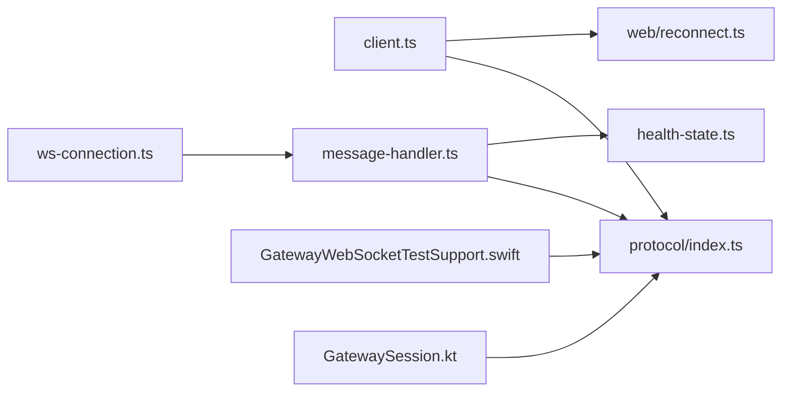

**Diagram sources**
- [client.ts](file://src/gateway/client.ts#L1-L531)
- [ws-connection.ts](file://src/gateway/server/ws-connection.ts#L1-L319)
- [message-handler.ts](file://src/gateway/server/ws-connection/message-handler.ts#L1-L800)
- [health-state.ts](file://src/gateway/server/health-state.ts#L1-L85)
- [index.ts](file://src/gateway/protocol/index.ts#L253-L458)
- [reconnect.ts](file://src/web/reconnect.ts#L1-L52)
- [GatewayWebSocketTestSupport.swift](file://apps/macos/Tests/OpenClawIPCTests/GatewayWebSocketTestSupport.swift#L31-L71)
- [GatewaySession.kt](file://apps/android/app/src/main/java/ai/openclaw/app/gateway/GatewaySession.kt#L414-L441)

**Section sources**
- [client.ts](file://src/gateway/client.ts#L1-L531)
- [ws-connection.ts](file://src/gateway/server/ws-connection.ts#L1-L319)
- [message-handler.ts](file://src/gateway/server/ws-connection/message-handler.ts#L1-L800)
- [health-state.ts](file://src/gateway/server/health-state.ts#L1-L85)
- [index.ts](file://src/gateway/protocol/index.ts#L253-L458)
- [reconnect.ts](file://src/web/reconnect.ts#L1-L52)
- [GatewayWebSocketTestSupport.swift](file://apps/macos/Tests/OpenClawIPCTests/GatewayWebSocketTestSupport.swift#L31-L71)
- [GatewaySession.kt](file://apps/android/app/src/main/java/ai/openclaw/app/gateway/GatewaySession.kt#L414-L441)

## Performance Considerations
- Payload sizing: server advertises maxPayload; clients should not exceed this.
- Buffering: server enforces maxBufferedBytes; clients should avoid excessive queued events.
- Tick intervals: server sets tickIntervalMs; clients should not send more than necessary and should monitor gaps.
- Reconnection: exponential backoff with jitter avoids thundering herd; max attempts cap resource usage.
- Rate limiting: per-conversation echo suppression and control-plane throttling prevent overload.

[No sources needed since this section provides general guidance]

## Troubleshooting Guide
- Invalid handshake: first frame must be connect with valid params; server closes with INVALID_REQUEST.
- Protocol mismatch: server and client must share a compatible protocol version.
- Origin not allowed: browser origin checks fail for non-secure contexts or disallowed origins.
- Device identity issues: missing/invalid nonce, mismatched device id, expired signature.
- TLS fingerprint mismatch: when using wss with fingerprint verification, mismatches cause immediate close.
- Abnormal closure: code 1006 indicates no close frame; client triggers reconnection.
- Tick timeout: if gap exceeds twice tickIntervalMs, client closes with 4000.

**Section sources**
- [message-handler.ts](file://src/gateway/server/ws-connection/message-handler.ts#L402-L433)
- [client.ts](file://src/gateway/client.ts#L470-L474)

## Conclusion
OpenClaw’s WebSocket API provides a strongly typed, validated, and resilient real-time interface. Clients should implement robust reconnection, obey server policy, and respect rate limits. The protocol supports flexible authentication, rich eventing, and efficient method invocation.

[No sources needed since this section summarizes without analyzing specific files]

## Appendices

### Appendix A: Message Schemas Reference
- RequestFrame: type=req, id, method, params?
- ResponseFrame: type=res, id, ok, payload?, error?
- EventFrame: type=event, event, payload?, seq?, stateVersion?
- HelloOk: protocol, server, features, snapshot, policy

**Section sources**
- [frames.ts](file://src/gateway/protocol/schema/frames.ts#L125-L164)
- [index.ts](file://src/gateway/protocol/index.ts#L460-L564)