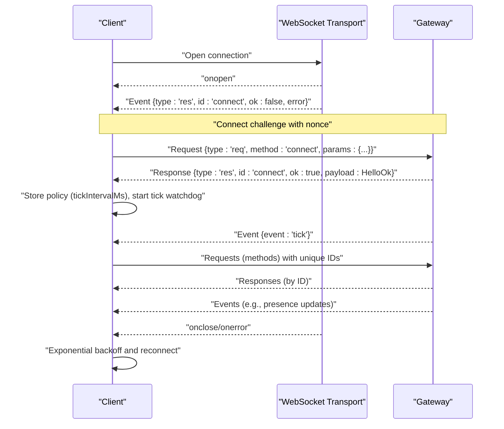
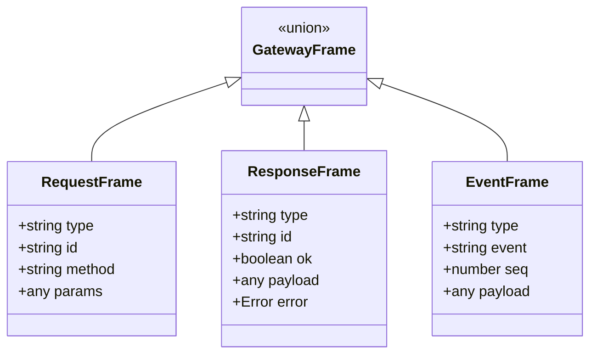
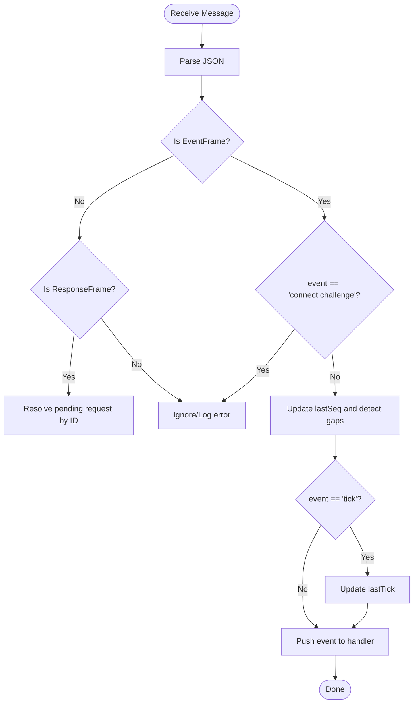
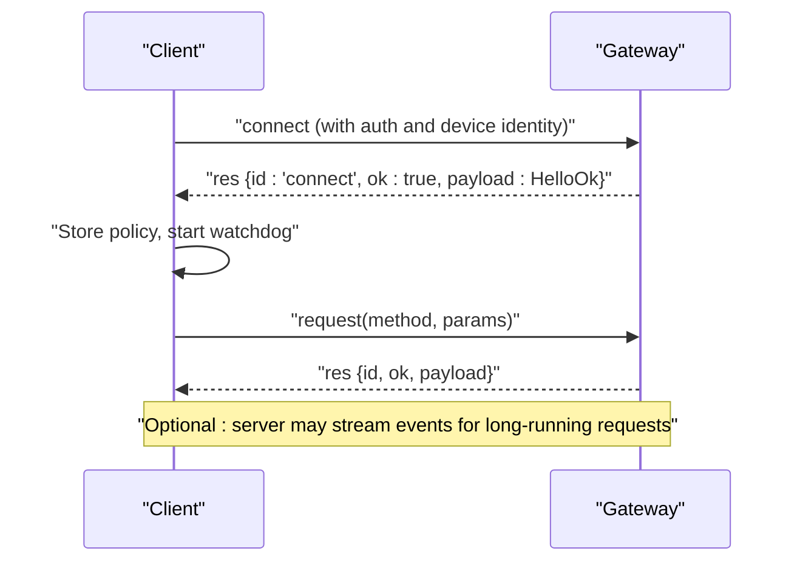
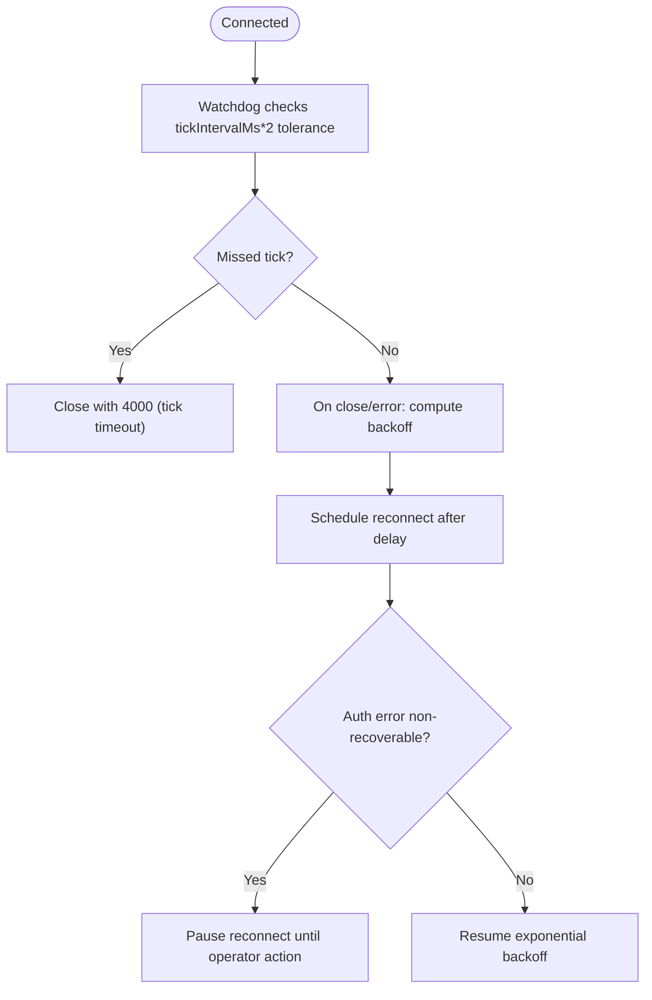
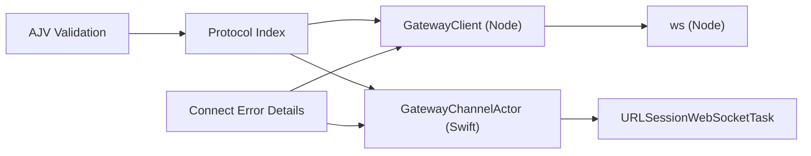

# WebSocket Protocol

<cite>
**Referenced Files in This Document**
- [client.ts](file://src/gateway/client.ts)
- [GatewayChannel.swift](file://apps/shared/OpenClawKit/Sources/OpenClawKit/GatewayChannel.swift)
- [index.ts](file://src/gateway/protocol/index.ts)
- [connect-error-details.ts](file://src/gateway/protocol/connect-error-details.ts)
- [gateway.node.test.ts](file://ui/src/ui/gateway.node.test.ts)
- [GatewayWebSocketTestSupport.swift](file://apps/macos/Tests/OpenClawIPCTests/GatewayWebSocketTestSupport.swift)
- [GatewayNodeSessionTests.swift](file://apps/shared/OpenClawKit/Tests/OpenClawKitTests/GatewayNodeSessionTests.swift)
</cite>

## Table of Contents
1. [Introduction](#introduction)
2. [Project Structure](#project-structure)
3. [Core Components](#core-components)
4. [Architecture Overview](#architecture-overview)
5. [Detailed Component Analysis](#detailed-component-analysis)
6. [Dependency Analysis](#dependency-analysis)
7. [Performance Considerations](#performance-considerations)
8. [Troubleshooting Guide](#troubleshooting-guide)
9. [Conclusion](#conclusion)
10. [Appendices](#appendices)

## Introduction
This document specifies the WebSocket-based real-time communication protocol used by OpenClaw’s gateway. It covers connection establishment, authentication, message framing, event-driven communication, session management, bidirectional message handling, connection lifecycle, error handling, reconnection logic, protocol versioning, security, rate limiting, and performance optimization. It also provides practical guidance for client implementations across JavaScript/TypeScript and Swift environments.

## Project Structure
The WebSocket protocol implementation spans:
- A JavaScript/TypeScript client that manages connection, authentication, request/response, and reconnection.
- A Swift client for Apple platforms that mirrors the JS behavior and integrates with URLSessionWebSocketTask.
- A shared protocol definition that validates frames and enumerates supported methods/events.

```mermaid
graph TB
subgraph "Clients"
JS["GatewayClient (Node.js)"]
SWIFT["GatewayChannelActor (Swift)"]
end
subgraph "Protocol"
SCHEMA["Protocol Schemas<br/>GatewayFrame, RequestFrame, ResponseFrame, EventFrame"]
VALID["Validation Layer<br/>AJV"]
end
GW["Gateway Server"]
JS --> SCHEMA
SWIFT --> SCHEMA
SCHEMA --> VALID
JS <- --> GW
SWIFT <- --> GW
```

**Diagram sources**
- [client.ts:124-753](file://src/gateway/client.ts#L124-L753)
- [GatewayChannel.swift:165-969](file://apps/shared/OpenClawKit/Sources/OpenClawKit/GatewayChannel.swift#L165-L969)
- [index.ts:1-673](file://src/gateway/protocol/index.ts#L1-L673)

**Section sources**
- [client.ts:124-753](file://src/gateway/client.ts#L124-L753)
- [GatewayChannel.swift:165-969](file://apps/shared/OpenClawKit/Sources/OpenClawKit/GatewayChannel.swift#L165-L969)
- [index.ts:1-673](file://src/gateway/protocol/index.ts#L1-L673)

## Core Components
- GatewayClient (Node.js): Implements connection, authentication, request/response, event handling, TLS pinning, reconnection, and tick-based liveness monitoring.
- GatewayChannelActor (Swift): Mirrors the Node client with URLSessionWebSocketTask, supports keepalive, watchdog, and device identity signing.
- Protocol Schemas: Defines GatewayFrame, RequestFrame, ResponseFrame, EventFrame, and validation helpers.

Key responsibilities:
- Connection lifecycle: secure transport selection, connect challenge, connect handshake, policy ingestion.
- Authentication: shared token, bootstrap token, device token, password, and device identity signing.
- Message framing: JSON-encoded frames with type discriminator and per-method schemas.
- Event-driven communication: server-to-client events with optional sequence numbers and periodic ticks.
- Session management: snapshot, presence, health, and state version reporting.
- Reconnection: exponential backoff with pause on non-recoverable auth errors.

**Section sources**
- [client.ts:124-753](file://src/gateway/client.ts#L124-L753)
- [GatewayChannel.swift:165-969](file://apps/shared/OpenClawKit/Sources/OpenClawKit/GatewayChannel.swift#L165-L969)
- [index.ts:1-673](file://src/gateway/protocol/index.ts#L1-L673)

## Architecture Overview
The gateway protocol uses a request-response model over WebSocket with event streams. Clients send requests with unique IDs and receive responses; the server emits events (including periodic ticks) and challenges during connect.



**Diagram sources**
- [client.ts:222-274](file://src/gateway/client.ts#L222-L274)
- [client.ts:299-435](file://src/gateway/client.ts#L299-L435)
- [client.ts:554-614](file://src/gateway/client.ts#L554-L614)
- [GatewayChannel.swift:290-344](file://apps/shared/OpenClawKit/Sources/OpenClawKit/GatewayChannel.swift#L290-L344)
- [GatewayChannel.swift:420-496](file://apps/shared/OpenClawKit/Sources/OpenClawKit/GatewayChannel.swift#L420-L496)
- [GatewayChannel.swift:622-652](file://apps/shared/OpenClawKit/Sources/OpenClawKit/GatewayChannel.swift#L622-L652)

## Detailed Component Analysis

### Connection Establishment and Security
- Transport selection:
  - Enforces secure WebSocket for remote endpoints; allows loopback or explicit private network override guarded by an environment variable.
  - Supports TLS pinning via fingerprint verification for wss:// connections.
- Connect challenge:
  - Server emits an event with a nonce; client must respond with a signed connect request before proceeding.
- Policy ingestion:
  - On successful connect, client reads server policy (e.g., tickIntervalMs) and starts a watchdog to detect stalls.

Security controls:
- TLS pinning prevents man-in-the-middle attacks when connecting remotely.
- Device identity signing enables device-scoped roles and reduces reliance on shared tokens.
- Strict URL checks prevent plaintext connections to non-loopback hosts.

**Section sources**
- [client.ts:157-220](file://src/gateway/client.ts#L157-L220)
- [client.ts:299-435](file://src/gateway/client.ts#L299-L435)
- [client.ts:554-614](file://src/gateway/client.ts#L554-L614)
- [client.ts:683-708](file://src/gateway/client.ts#L683-L708)
- [GatewayChannel.swift:290-344](file://apps/shared/OpenClawKit/Sources/OpenClawKit/GatewayChannel.swift#L290-L344)
- [GatewayChannel.swift:420-496](file://apps/shared/OpenClawKit/Sources/OpenClawKit/GatewayChannel.swift#L420-L496)
- [GatewayChannel.swift:622-652](file://apps/shared/OpenClawKit/Sources/OpenClawKit/GatewayChannel.swift#L622-L652)

### Authentication Methods
Supported mechanisms:
- Shared token (long-lived)
- Bootstrap token (ephemeral)
- Password (legacy)
- Device token (scoped to device and role)
- Device identity signing (signed payload with nonce)

Client behavior:
- Selects auth based on availability and trust of endpoint.
- Retries with stored device token when appropriate and clears stale tokens after mismatches.
- Emits non-recoverable auth errors that pause reconnect attempts.

**Section sources**
- [client.ts:518-552](file://src/gateway/client.ts#L518-L552)
- [client.ts:412-434](file://src/gateway/client.ts#L412-L434)
- [client.ts:437-465](file://src/gateway/client.ts#L437-L465)
- [client.ts:467-497](file://src/gateway/client.ts#L467-L497)
- [connect-error-details.ts:1-141](file://src/gateway/protocol/connect-error-details.ts#L1-L141)
- [GatewayChannel.swift:498-540](file://apps/shared/OpenClawKit/Sources/OpenClawKit/GatewayChannel.swift#L498-L540)
- [GatewayChannel.swift:542-594](file://apps/shared/OpenClawKit/Sources/OpenClawKit/GatewayChannel.swift#L542-L594)
- [GatewayChannel.swift:777-797](file://apps/shared/OpenClawKit/Sources/OpenClawKit/GatewayChannel.swift#L777-L797)

### Message Framing and Validation
Frames:
- GatewayFrame: discriminated union of RequestFrame, ResponseFrame, EventFrame.
- RequestFrame: { type: "req", id: string, method: string, params?: unknown }
- ResponseFrame: { type: "res", id: string, ok: boolean, payload?: unknown, error?: { code?: string, message?: string, details?: unknown } }
- EventFrame: { type: "event", event: string, seq?: number, payload?: unknown }

Validation:
- Uses AJV to validate frames and method-specific parameters.
- Provides helper to format validation errors.



**Diagram sources**
- [index.ts:126-131](file://src/gateway/protocol/index.ts#L126-L131)
- [index.ts:173-183](file://src/gateway/protocol/index.ts#L173-L183)

**Section sources**
- [index.ts:253-458](file://src/gateway/protocol/index.ts#L253-L458)
- [index.ts:566-673](file://src/gateway/protocol/index.ts#L566-L673)

### Event-Driven Communication Patterns
- Events carry optional sequence numbers; gaps trigger a push notification with expected/received sequence.
- Periodic "tick" events indicate liveness; watchdog closes the connection if ticks are missed beyond a tolerance.
- Special events include "connect.challenge" (nonce) and "tick".



**Diagram sources**
- [client.ts:554-614](file://src/gateway/client.ts#L554-L614)
- [GatewayChannel.swift:622-652](file://apps/shared/OpenClawKit/Sources/OpenClawKit/GatewayChannel.swift#L622-L652)

**Section sources**
- [client.ts:554-614](file://src/gateway/client.ts#L554-L614)
- [GatewayChannel.swift:622-652](file://apps/shared/OpenClawKit/Sources/OpenClawKit/GatewayChannel.swift#L622-L652)

### Session Management and Bidirectional Handling
- HelloOk payload includes:
  - protocol version range supported by the server.
  - server metadata (version, connId).
  - features (methods, events).
  - snapshot (presence, health, stateVersion, uptimeMs).
  - policy (maxPayload, maxBufferedBytes, tickIntervalMs).
- Requests are tracked by ID; responses resolve pending promises. Some methods support "final" responses with accept/accepted/pending lifecycles.



**Diagram sources**
- [client.ts:389-435](file://src/gateway/client.ts#L389-L435)
- [GatewayChannel.swift:420-496](file://apps/shared/OpenClawKit/Sources/OpenClawKit/GatewayChannel.swift#L420-L496)
- [GatewayChannel.swift:542-594](file://apps/shared/OpenClawKit/Sources/OpenClawKit/GatewayChannel.swift#L542-L594)

**Section sources**
- [client.ts:389-435](file://src/gateway/client.ts#L389-L435)
- [GatewayChannel.swift:542-594](file://apps/shared/OpenClawKit/Sources/OpenClawKit/GatewayChannel.swift#L542-L594)
- [GatewayNodeSessionTests.swift:104-138](file://apps/shared/OpenClawKit/Tests/OpenClawKitTests/GatewayNodeSessionTests.swift#L104-L138)

### Connection Lifecycle Management and Reconnection Logic
- Exponential backoff with jitter-like behavior capped at a maximum.
- Pauses reconnect on non-recoverable auth errors (e.g., missing credentials, rate-limited, pairing required).
- Watchdog monitors tick intervals; closes connection on prolonged silence.
- Keepalive sends periodic pings to maintain NAT/proxy state.



**Diagram sources**
- [client.ts:659-681](file://src/gateway/client.ts#L659-L681)
- [client.ts:636-647](file://src/gateway/client.ts#L636-L647)
- [client.ts:437-465](file://src/gateway/client.ts#L437-L465)
- [GatewayChannel.swift:267-288](file://apps/shared/OpenClawKit/Sources/OpenClawKit/GatewayChannel.swift#L267-L288)
- [GatewayChannel.swift:706-726](file://apps/shared/OpenClawKit/Sources/OpenClawKit/GatewayChannel.swift#L706-L726)
- [GatewayChannel.swift:728-750](file://apps/shared/OpenClawKit/Sources/OpenClawKit/GatewayChannel.swift#L728-L750)

**Section sources**
- [client.ts:636-681](file://src/gateway/client.ts#L636-L681)
- [client.ts:437-465](file://src/gateway/client.ts#L437-L465)
- [GatewayChannel.swift:267-288](file://apps/shared/OpenClawKit/Sources/OpenClawKit/GatewayChannel.swift#L267-L288)
- [GatewayChannel.swift:706-750](file://apps/shared/OpenClawKit/Sources/OpenClawKit/GatewayChannel.swift#L706-L750)

### Protocol Versioning
- Clients specify min/max protocol versions during connect.
- Server responds with HelloOk indicating supported range and chosen version.
- Mismatches should be handled gracefully; clients should align to server capabilities.

**Section sources**
- [client.ts:364-387](file://src/gateway/client.ts#L364-L387)
- [GatewayChannel.swift:403-412](file://apps/shared/OpenClawKit/Sources/OpenClawKit/GatewayChannel.swift#L403-L412)

### Practical Examples and Implementation Notes
- JavaScript/TypeScript client:
  - Instantiate GatewayClient with URL, optional auth tokens, device identity, and callbacks.
  - Subscribe to onEvent, onHelloOk, onConnectError, onClose, onGap.
  - Use request(method, params) for RPC-style calls; handle GatewayClientRequestError for server-side errors.
- Swift client:
  - Use GatewayChannelActor with URLSessionWebSocketTask.
  - Provide pushHandler to receive snapshot, events, and sequence gap notifications.
  - Configure connect options (role, scopes, caps, commands, permissions, client identity).

Testing utilities:
- Node mock WebSocket for unit tests.
- Swift test harness for request/response and connect flows.

**Section sources**
- [client.ts:78-109](file://src/gateway/client.ts#L78-L109)
- [client.ts:710-751](file://src/gateway/client.ts#L710-L751)
- [GatewayChannel.swift:75-110](file://apps/shared/OpenClawKit/Sources/OpenClawKit/GatewayChannel.swift#L75-L110)
- [GatewayChannel.swift:165-224](file://apps/shared/OpenClawKit/Sources/OpenClawKit/GatewayChannel.swift#L165-L224)
- [gateway.node.test.ts:49-114](file://ui/src/ui/gateway.node.test.ts#L49-L114)
- [GatewayWebSocketTestSupport.swift:97-130](file://apps/macos/Tests/OpenClawIPCTests/GatewayWebSocketTestSupport.swift#L97-L130)
- [GatewayNodeSessionTests.swift:104-138](file://apps/shared/OpenClawKit/Tests/OpenClawKitTests/GatewayNodeSessionTests.swift#L104-L138)

## Dependency Analysis


**Diagram sources**
- [index.ts:253-458](file://src/gateway/protocol/index.ts#L253-L458)
- [client.ts:1-41](file://src/gateway/client.ts#L1-L41)
- [GatewayChannel.swift:1-4](file://apps/shared/OpenClawKit/Sources/OpenClawKit/GatewayChannel.swift#L1-L4)
- [connect-error-details.ts:1-141](file://src/gateway/protocol/connect-error-details.ts#L1-L141)

**Section sources**
- [index.ts:253-458](file://src/gateway/protocol/index.ts#L253-L458)
- [client.ts:1-41](file://src/gateway/client.ts#L1-L41)
- [GatewayChannel.swift:1-4](file://apps/shared/OpenClawKit/Sources/OpenClawKit/GatewayChannel.swift#L1-L4)
- [connect-error-details.ts:1-141](file://src/gateway/protocol/connect-error-details.ts#L1-L141)

## Performance Considerations
- Payload limits:
  - Node client sets a generous maxPayload for large snapshots.
  - Swift client increases maximumMessageSize for URLSessionWebSocketTask.
- Request timeouts:
  - Default request timeout configurable; some methods can opt out of timeouts for long-running operations.
- Tick watchdog:
  - Enforces liveness; clients should tolerate network latency up to tickIntervalMs*2.
- Keepalive:
  - Sends periodic pings to keep NAT/proxy entries warm without RPC overhead.

**Section sources**
- [client.ts:193-195](file://src/gateway/client.ts#L193-L195)
- [GatewayChannel.swift:58-64](file://apps/shared/OpenClawKit/Sources/OpenClawKit/GatewayChannel.swift#L58-L64)
- [client.ts:714-733](file://src/gateway/client.ts#L714-L733)
- [GatewayChannel.swift:706-726](file://apps/shared/OpenClawKit/Sources/OpenClawKit/GatewayChannel.swift#L706-L726)

## Troubleshooting Guide
Common issues and remedies:
- Plaintext ws:// to remote hosts blocked:
  - Use wss:// or loopback gateway behind SSH tunnel/Tailscale.
- TLS fingerprint mismatch:
  - Verify fingerprint matches server certificate; adjust expectations or use trusted endpoints.
- Connect challenge timeout:
  - Ensure server is reachable and emitting connect.challenge; check firewall/NAT.
- Auth errors:
  - Review detail codes (e.g., missing token, password mismatch, rate-limited, pairing required).
  - Device token mismatches may trigger automatic retry with stored device token (subject to trust checks).
- Stalled connections:
  - Watchdog closes on tick timeout; investigate network stability or server health.

Operational hints:
- Use onConnectError and onClose handlers to capture detailed reasons.
- Inspect close codes and reasons; consult close code hints for normal vs abnormal closures.

**Section sources**
- [client.ts:167-191](file://src/gateway/client.ts#L167-L191)
- [client.ts:222-274](file://src/gateway/client.ts#L222-L274)
- [client.ts:616-634](file://src/gateway/client.ts#L616-L634)
- [client.ts:111-120](file://src/gateway/client.ts#L111-L120)
- [connect-error-details.ts:1-141](file://src/gateway/protocol/connect-error-details.ts#L1-L141)

## Conclusion
OpenClaw’s WebSocket protocol provides a robust, versioned, and validated real-time communication layer. Clients implement secure transport, strong authentication, structured message framing, and resilient reconnection with watchdogs and keepalive. The protocol supports event-driven updates, session snapshots, and scalable request/response patterns suitable for diverse client platforms.

## Appendices

### API Reference: Frames and Methods
- GatewayFrame: discriminated union of RequestFrame, ResponseFrame, EventFrame.
- RequestFrame: { type: "req", id: string, method: string, params?: unknown }
- ResponseFrame: { type: "res", id: string, ok: boolean, payload?: unknown, error?: { code?: string, message?: string, details?: unknown } }
- EventFrame: { type: "event", event: string, seq?: number, payload?: unknown }

Validation helpers:
- validateRequestFrame, validateResponseFrame, validateEventFrame, and others in the protocol index.

**Section sources**
- [index.ts:126-131](file://src/gateway/protocol/index.ts#L126-L131)
- [index.ts:259-262](file://src/gateway/protocol/index.ts#L259-L262)