# Advanced Topics

<cite>
**Referenced Files in This Document**
- [docs/concepts/model-providers.md](file://docs/concepts/model-providers.md)
- [docs/concepts/session-pruning.md](file://docs/concepts/session-pruning.md)
- [docs/gateway/authentication.md](file://docs/gateway/authentication.md)
- [docs/gateway/configuration.md](file://docs/gateway/configuration.md)
- [docs/gateway/configuration-examples.md](file://docs/gateway/configuration-examples.md)
- [docs/gateway/troubleshooting.md](file://docs/gateway/troubleshooting.md)
- [docs/refactor/plugin-sdk.md](file://docs/refactor/plugin-sdk.md)
- [docs/install/docker.md](file://docs/install/docker.md)
- [src/commands/onboard-auth.config-shared.ts](file://src/commands/onboard-auth.config-shared.ts)
- [src/commands/onboard-auth.config-core.ts](file://src/commands/onboard-auth.config-core.ts)
- [src/commands/onboard-custom.ts](file://src/commands/onboard-custom.ts)
- [src/config/sessions/store-maintenance.ts](file://src/config/sessions/store-maintenance.ts)
- [src/config/sessions/store.ts](file://src/config/sessions/store.ts)
- [src/commands/sessions-cleanup.ts](file://src/commands/sessions-cleanup.ts)
- [src/plugins/loader.ts](file://src/plugins/loader.ts)
- [src/plugins/tools.optional.test.ts](file://src/plugins/tools.optional.test.ts)
- [extensions/feishu/src/tool-factory-test-harness.ts](file://extensions/feishu/src/tool-factory-test-harness.ts)
- [apps/android/app/src/main/java/ai/openclaw/app/gateway/GatewayProtocol.kt](file://apps/android/app/src/main/java/ai/openclaw/app/gateway/GatewayProtocol.kt)
- [src/agents/pi-embedded-helpers/errors.ts](file://src/agents/pi-embedded-helpers/errors.ts)
- [src/commands/status.scan.ts](file://src/commands/status.scan.ts)
- [src/memory/status-format.ts](file://src/memory/status-format.ts)
- [extensions/open-prose/skills/prose/state/postgres.md](file://extensions/open-prose/skills/prose/state/postgres.md)
- [extensions/open-prose/skills/prose/guidance/patterns.md](file://extensions/open-prose/skills/prose/guidance/patterns.md)
- [extensions/open-prose/skills/prose/guidance/antipatterns.md](file://extensions/open-prose/skills/prose/guidance/antipatterns.md)
</cite>

## Table of Contents
1. [Introduction](#introduction)
2. [Project Structure](#project-structure)
3. [Core Components](#core-components)
4. [Architecture Overview](#architecture-overview)
5. [Detailed Component Analysis](#detailed-component-analysis)
6. [Dependency Analysis](#dependency-analysis)
7. [Performance Considerations](#performance-considerations)
8. [Troubleshooting Guide](#troubleshooting-guide)
9. [Conclusion](#conclusion)
10. [Appendices](#appendices)

## Introduction
This document provides advanced topics for experienced operators and developers deploying and extending OpenClaw at scale. It focuses on:
- Custom model provider integration and advanced configuration patterns
- Session pruning strategies and memory management
- Scaling considerations and enterprise deployment patterns
- Advanced plugin development and custom tool creation
- Integration with external systems and API gateway configurations
- Expert-level troubleshooting and complex deployment scenarios

## Project Structure
OpenClaw is organized around a modular runtime with strong separation of concerns:
- Gateway runtime and configuration
- Channel connectors and plugin SDK
- Model provider integration and authentication
- Session lifecycle and maintenance
- Memory and vector search backends
- Extensions and enterprise-grade integrations

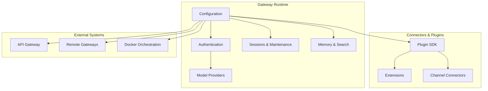

[No sources needed since this diagram shows conceptual structure, not a direct code mapping]

## Core Components
- Model providers and authentication: OAuth/API key rotation, provider catalogs, and custom provider configuration.
- Session management: pruning, eviction, and disk budget enforcement.
- Plugin SDK and loader: unified interface for channel connectors and tools.
- Memory and search backends: vector availability and cache state reporting.
- Enterprise deployment: Docker-based orchestration, sandboxing, and security hardening.

**Section sources**
- [docs/concepts/model-providers.md](file://docs/concepts/model-providers.md#L1-L460)
- [docs/gateway/authentication.md](file://docs/gateway/authentication.md#L1-L180)
- [docs/gateway/configuration.md](file://docs/gateway/configuration.md#L1-L547)
- [docs/gateway/configuration-examples.md](file://docs/gateway/configuration-examples.md#L1-L638)

## Architecture Overview
OpenClaw’s advanced architecture centers on:
- A strict configuration schema with hot-reload and RPC update mechanisms
- A plugin SDK that exposes a minimal runtime surface to extensions
- A session lifecycle with maintenance policies and disk budget enforcement
- Model provider abstraction supporting custom endpoints and rotation
- Memory backends with vector availability and cache state reporting

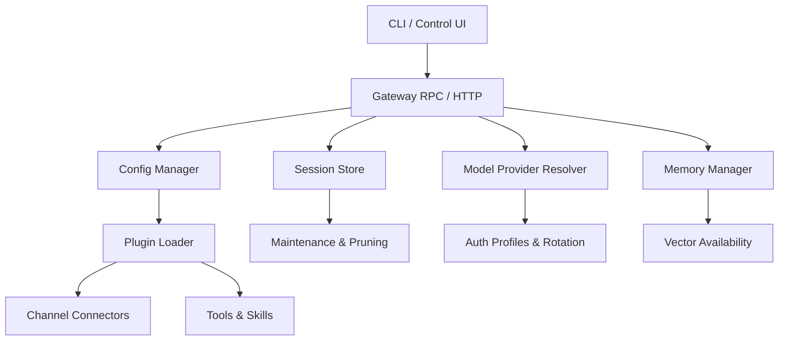

**Diagram sources**
- [docs/gateway/configuration.md](file://docs/gateway/configuration.md#L389-L447)
- [docs/refactor/plugin-sdk.md](file://docs/refactor/plugin-sdk.md#L19-L145)
- [src/config/sessions/store.ts](file://src/config/sessions/store.ts#L353-L392)
- [src/config/sessions/store-maintenance.ts](file://src/config/sessions/store-maintenance.ts#L150-L178)
- [docs/concepts/model-providers.md](file://docs/concepts/model-providers.md#L20-L33)
- [src/commands/onboard-auth.config-shared.ts](file://src/commands/onboard-auth.config-shared.ts#L119-L213)

**Section sources**
- [docs/gateway/configuration.md](file://docs/gateway/configuration.md#L349-L387)
- [docs/refactor/plugin-sdk.md](file://docs/refactor/plugin-sdk.md#L19-L145)
- [src/config/sessions/store.ts](file://src/config/sessions/store.ts#L353-L392)
- [src/config/sessions/store-maintenance.ts](file://src/config/sessions/store-maintenance.ts#L150-L178)
- [docs/concepts/model-providers.md](file://docs/concepts/model-providers.md#L20-L33)

## Detailed Component Analysis

### Custom Model Provider Integration
OpenClaw supports:
- Built-in providers with curated catalogs
- Custom providers via models.providers with base URLs and API modes
- Provider-level merging and model catalog overrides
- API key rotation and environment-based credential management

Key patterns:
- Merge provider configs with existing models and catalogs
- Normalize provider state and build provider config with merged models
- Apply custom provider models with defaults and overrides

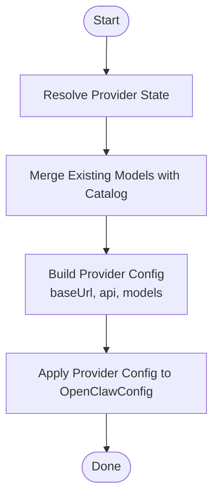

**Diagram sources**
- [src/commands/onboard-auth.config-shared.ts](file://src/commands/onboard-auth.config-shared.ts#L119-L213)
- [src/commands/onboard-custom.ts](file://src/commands/onboard-custom.ts#L597-L622)

**Section sources**
- [docs/concepts/model-providers.md](file://docs/concepts/model-providers.md#L168-L450)
- [src/commands/onboard-auth.config-shared.ts](file://src/commands/onboard-auth.config-shared.ts#L119-L213)
- [src/commands/onboard-auth.config-core.ts](file://src/commands/onboard-auth.config-core.ts#L469-L491)
- [src/commands/onboard-custom.ts](file://src/commands/onboard-custom.ts#L597-L622)

### Advanced Configuration Patterns
- Strict schema validation with hot reload and RPC updates
- Environment variable substitution and secret references
- Multi-file includes and nested merges
- Gateway auth modes, remote access, and reload strategies

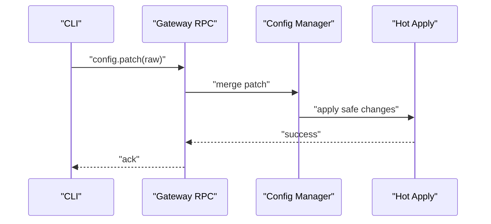

**Diagram sources**
- [docs/gateway/configuration.md](file://docs/gateway/configuration.md#L389-L447)

**Section sources**
- [docs/gateway/configuration.md](file://docs/gateway/configuration.md#L349-L387)
- [docs/gateway/configuration.md](file://docs/gateway/configuration.md#L449-L539)
- [docs/gateway/configuration-examples.md](file://docs/gateway/configuration-examples.md#L1-L638)

### Session Pruning Strategies
OpenClaw prunes old tool results from in-memory context before LLM calls:
- Mode: cache-ttl with TTL-aware pruning
- Smart defaults for Anthropic profiles
- Tool selection with allow/deny and case-insensitive matching
- Estimation of context window and ratios for soft/hard trimming

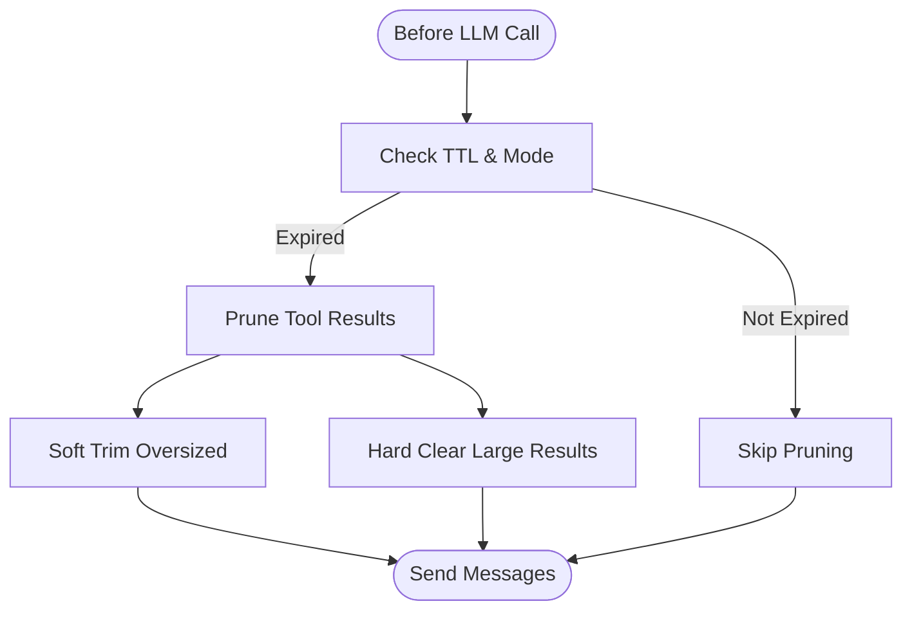

**Diagram sources**
- [docs/concepts/session-pruning.md](file://docs/concepts/session-pruning.md#L13-L86)

**Section sources**
- [docs/concepts/session-pruning.md](file://docs/concepts/session-pruning.md#L1-L122)

### Memory Management Optimizations
- Vector availability and cache state reporting
- Memory backend status formatting and readiness tones
- Memory manager probing and status snapshots

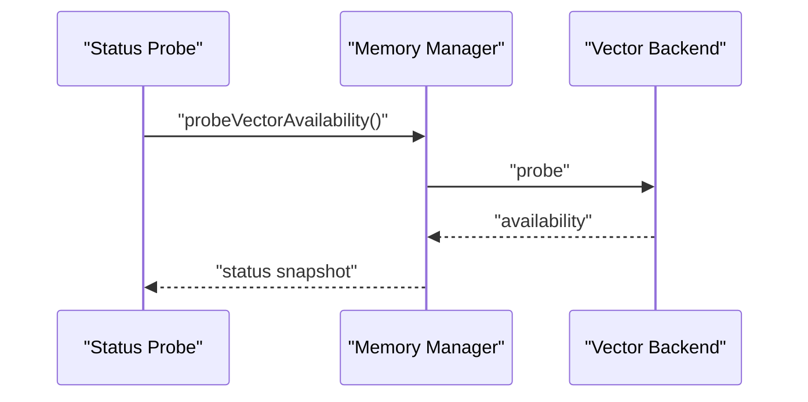

**Diagram sources**
- [src/commands/status.scan.ts](file://src/commands/status.scan.ts#L157-L180)
- [src/memory/status-format.ts](file://src/memory/status-format.ts#L1-L45)

**Section sources**
- [src/commands/status.scan.ts](file://src/commands/status.scan.ts#L157-L180)
- [src/memory/status-format.ts](file://src/memory/status-format.ts#L1-L45)

### Scaling Considerations
- Disk budget enforcement and session maintenance
- Warn-only vs enforce modes for maintenance
- Pruning stale entries and capping total entries

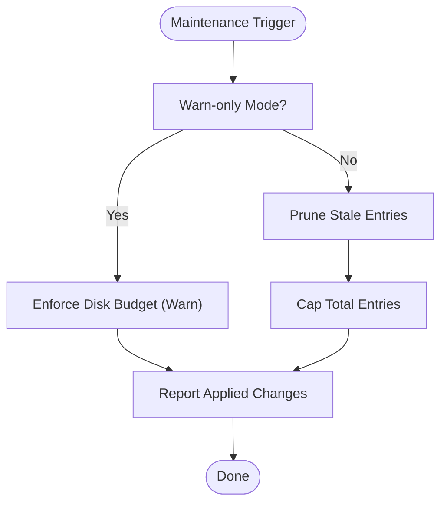

**Diagram sources**
- [src/config/sessions/store.ts](file://src/config/sessions/store.ts#L353-L392)
- [src/config/sessions/store-maintenance.ts](file://src/config/sessions/store-maintenance.ts#L150-L178)

**Section sources**
- [src/config/sessions/store.ts](file://src/config/sessions/store.ts#L353-L392)
- [src/config/sessions/store-maintenance.ts](file://src/config/sessions/store-maintenance.ts#L150-L178)

### Advanced Security Configurations
- Device identity and nonce-based authentication
- Token-based gateway auth and remote access
- Strict bind/auth guardrails and upgrade considerations

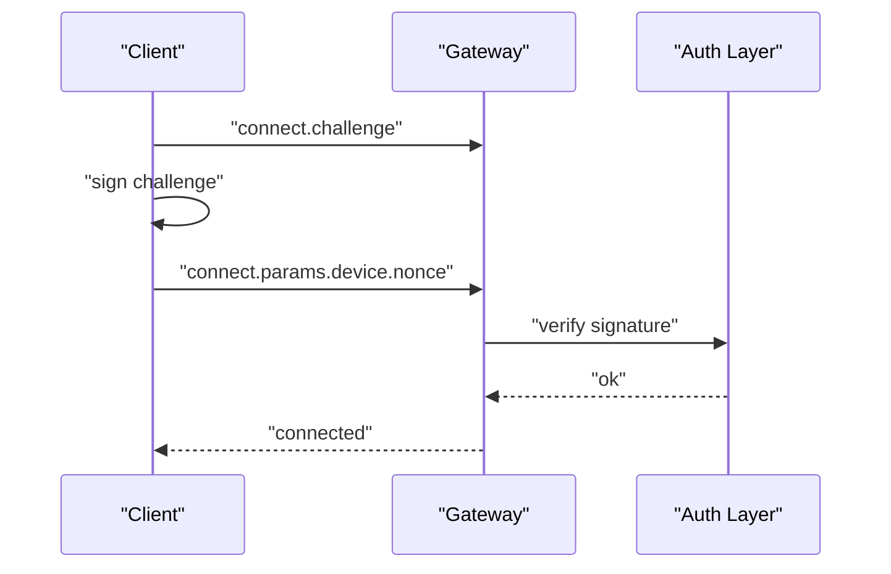

**Diagram sources**
- [docs/gateway/troubleshooting.md](file://docs/gateway/troubleshooting.md#L119-L132)

**Section sources**
- [docs/gateway/authentication.md](file://docs/gateway/authentication.md#L1-L180)
- [docs/gateway/troubleshooting.md](file://docs/gateway/troubleshooting.md#L91-L138)

### Custom Authentication Providers
- Auth profile management and rotation
- OAuth and API key modes
- Profile ordering and eligibility checks

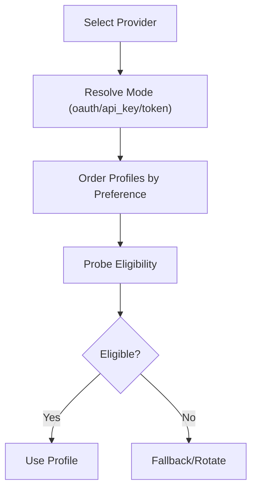

**Diagram sources**
- [src/commands/onboard-auth.config-core.ts](file://src/commands/onboard-auth.config-core.ts#L469-L491)
- [docs/gateway/authentication.md](file://docs/gateway/authentication.md#L123-L139)

**Section sources**
- [src/commands/onboard-auth.config-core.ts](file://src/commands/onboard-auth.config-core.ts#L469-L491)
- [docs/gateway/authentication.md](file://docs/gateway/authentication.md#L123-L139)

### Enterprise Deployment Patterns
- Docker-based gateway and sandboxing
- Persistent volumes and extra mounts
- Browser hardening flags and custom images
- Multi-agent sandbox profiles and tool allowlists

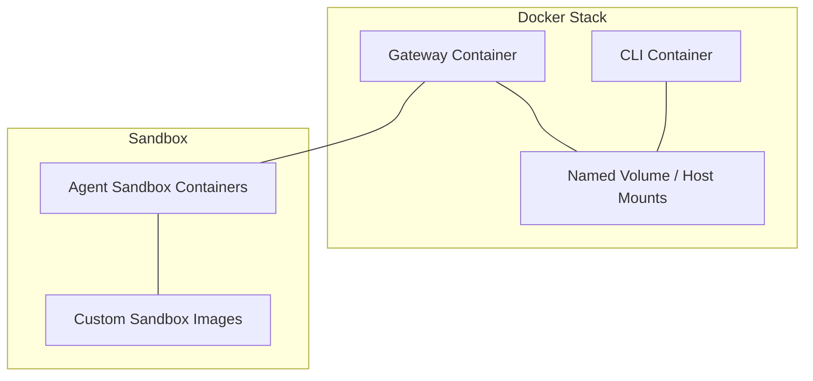

**Diagram sources**
- [docs/install/docker.md](file://docs/install/docker.md#L539-L544)
- [docs/install/docker.md](file://docs/install/docker.md#L545-L789)

**Section sources**
- [docs/install/docker.md](file://docs/install/docker.md#L1-L800)

### Advanced Plugin Development
- Plugin SDK with minimal runtime surface
- Loader records and capability tracking
- Optional tools with allowlisting
- Tool factory harness for testing

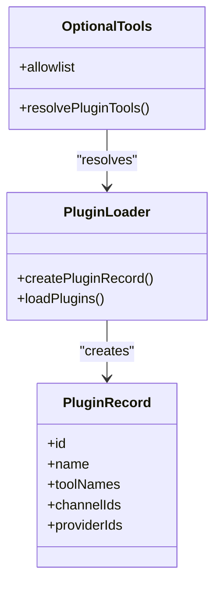

**Diagram sources**
- [src/plugins/loader.ts](file://src/plugins/loader.ts#L219-L254)
- [src/plugins/tools.optional.test.ts](file://src/plugins/tools.optional.test.ts#L66-L114)
- [extensions/feishu/src/tool-factory-test-harness.ts](file://extensions/feishu/src/tool-factory-test-harness.ts#L37-L76)

**Section sources**
- [docs/refactor/plugin-sdk.md](file://docs/refactor/plugin-sdk.md#L1-L215)
- [src/plugins/loader.ts](file://src/plugins/loader.ts#L219-L254)
- [src/plugins/tools.optional.test.ts](file://src/plugins/tools.optional.test.ts#L66-L114)
- [extensions/feishu/src/tool-factory-test-harness.ts](file://extensions/feishu/src/tool-factory-test-harness.ts#L37-L76)

### Custom Tool Creation and System Extension Patterns
- Lazy evaluation and parallelization patterns
- Performance antipatterns to avoid
- State management with PostgreSQL-backed bindings

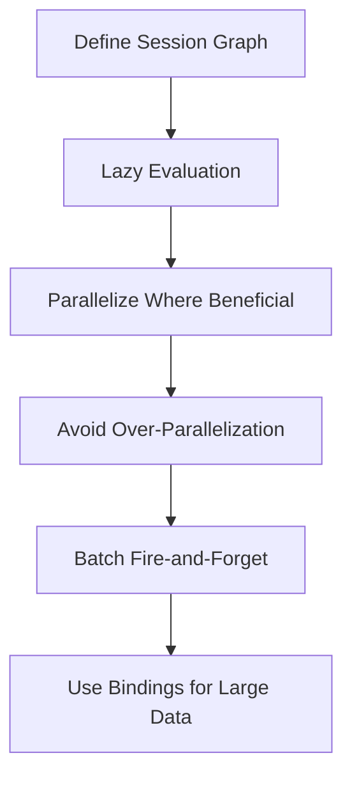

**Diagram sources**
- [extensions/open-prose/skills/prose/guidance/patterns.md](file://extensions/open-prose/skills/prose/guidance/patterns.md#L528-L548)
- [extensions/open-prose/skills/prose/guidance/antipatterns.md](file://extensions/open-prose/skills/prose/guidance/antipatterns.md#L440-L558)
- [extensions/open-prose/skills/prose/state/postgres.md](file://extensions/open-prose/skills/prose/state/postgres.md#L291-L312)

**Section sources**
- [extensions/open-prose/skills/prose/guidance/patterns.md](file://extensions/open-prose/skills/prose/guidance/patterns.md#L490-L548)
- [extensions/open-prose/skills/prose/guidance/antipatterns.md](file://extensions/open-prose/skills/prose/guidance/antipatterns.md#L440-L558)
- [extensions/open-prose/skills/prose/state/postgres.md](file://extensions/open-prose/skills/prose/state/postgres.md#L291-L312)

### Integration with External Systems and API Gateway Configurations
- Protocol versioning for Android gateway client
- Gateway protocol constants and client expectations
- Remote gateway access and token-based auth

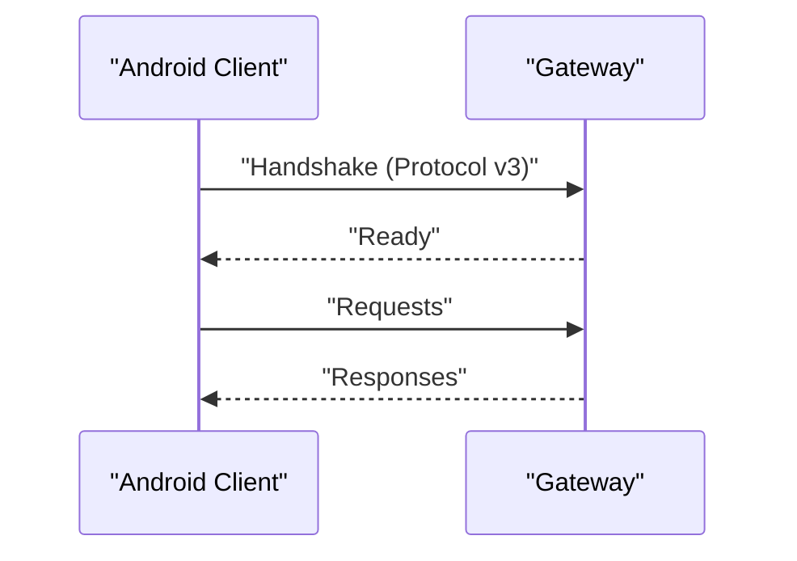

**Diagram sources**
- [apps/android/app/src/main/java/ai/openclaw/app/gateway/GatewayProtocol.kt](file://apps/android/app/src/main/java/ai/openclaw/app/gateway/GatewayProtocol.kt#L1-L3)

**Section sources**
- [apps/android/app/src/main/java/ai/openclaw/app/gateway/GatewayProtocol.kt](file://apps/android/app/src/main/java/ai/openclaw/app/gateway/GatewayProtocol.kt#L1-L3)
- [docs/gateway/configuration.md](file://docs/gateway/configuration.md#L412-L425)

### Custom Protocol Implementations
- Authentication credential semantics and 402 billing signals
- Retry logic for transient conditions
- Normalization of error messages for consistent handling

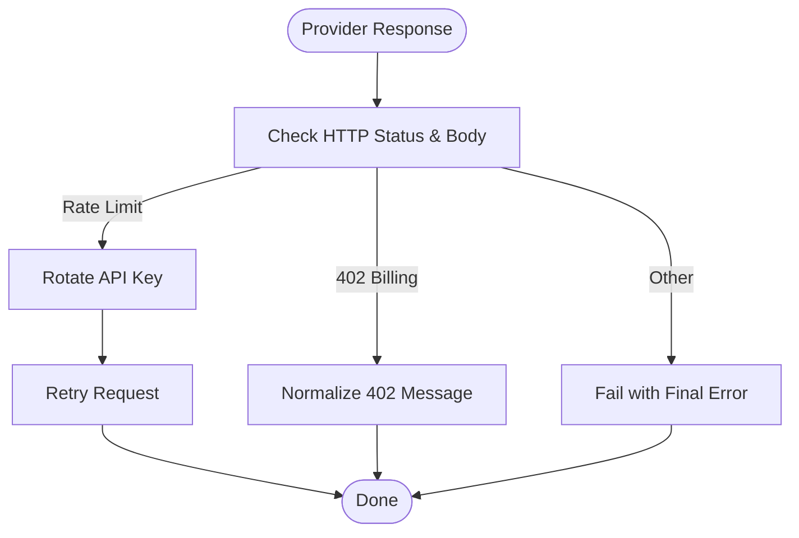

**Diagram sources**
- [src/agents/pi-embedded-helpers/errors.ts](file://src/agents/pi-embedded-helpers/errors.ts#L244-L275)
- [docs/gateway/authentication.md](file://docs/gateway/authentication.md#L123-L139)

**Section sources**
- [src/agents/pi-embedded-helpers/errors.ts](file://src/agents/pi-embedded-helpers/errors.ts#L244-L275)
- [docs/gateway/authentication.md](file://docs/gateway/authentication.md#L123-L139)

## Dependency Analysis
OpenClaw’s advanced features rely on:
- Configuration schema enforcing strict validation and hot reload
- Plugin SDK isolating core runtime from extensions
- Session store with maintenance hooks and disk budget enforcement
- Model provider resolver integrating auth profiles and rotation
- Memory manager exposing vector availability and cache state

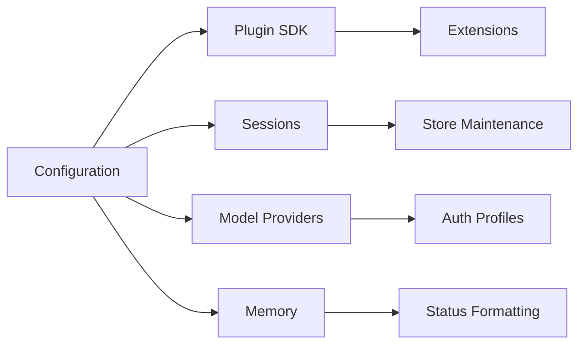

**Diagram sources**
- [docs/gateway/configuration.md](file://docs/gateway/configuration.md#L61-L73)
- [docs/refactor/plugin-sdk.md](file://docs/refactor/plugin-sdk.md#L19-L145)
- [src/config/sessions/store-maintenance.ts](file://src/config/sessions/store-maintenance.ts#L150-L178)
- [src/commands/onboard-auth.config-shared.ts](file://src/commands/onboard-auth.config-shared.ts#L119-L213)
- [src/memory/status-format.ts](file://src/memory/status-format.ts#L1-L45)

**Section sources**
- [docs/gateway/configuration.md](file://docs/gateway/configuration.md#L61-L73)
- [docs/refactor/plugin-sdk.md](file://docs/refactor/plugin-sdk.md#L19-L145)
- [src/config/sessions/store-maintenance.ts](file://src/config/sessions/store-maintenance.ts#L150-L178)
- [src/commands/onboard-auth.config-shared.ts](file://src/commands/onboard-auth.config-shared.ts#L119-L213)
- [src/memory/status-format.ts](file://src/memory/status-format.ts#L1-L45)

## Performance Considerations
- Prefer lazy evaluation and selective parallelization to avoid resource exhaustion
- Use session pruning to reduce context growth and cache write sizes
- Enforce disk budgets and prune stale sessions proactively
- Harden browser and sandbox configurations for production environments
- Monitor memory vector availability and cache state for optimal throughput

[No sources needed since this section provides general guidance]

## Troubleshooting Guide
- Gateway connectivity and device auth issues
- Service not running and port binding conflicts
- Channel connected messages not flowing
- Cron and heartbeat delivery problems
- Node paired tool failures and browser tool issues
- Post-upgrade config drift and stricter defaults

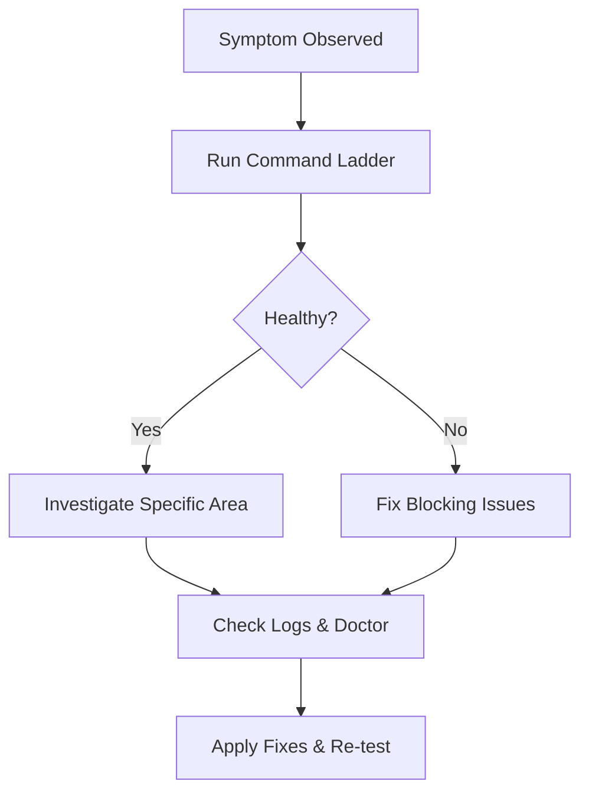

**Diagram sources**
- [docs/gateway/troubleshooting.md](file://docs/gateway/troubleshooting.md#L14-L31)

**Section sources**
- [docs/gateway/troubleshooting.md](file://docs/gateway/troubleshooting.md#L1-L367)

## Conclusion
OpenClaw’s advanced topics enable expert-level customization, scaling, and enterprise-grade deployments. By leveraging the plugin SDK, strict configuration management, session pruning, and memory backends, teams can build resilient, secure, and high-performance AI-powered workflows across diverse environments.

[No sources needed since this section summarizes without analyzing specific files]

## Appendices
- Configuration reference and examples
- Plugin SDK documentation and migration plan
- Docker installation and sandboxing guides
- Session pruning and memory management references

**Section sources**
- [docs/gateway/configuration.md](file://docs/gateway/configuration.md#L540-L547)
- [docs/gateway/configuration-examples.md](file://docs/gateway/configuration-examples.md#L1-L638)
- [docs/refactor/plugin-sdk.md](file://docs/refactor/plugin-sdk.md#L1-L215)
- [docs/install/docker.md](file://docs/install/docker.md#L1-L800)
- [docs/concepts/session-pruning.md](file://docs/concepts/session-pruning.md#L1-L122)
- [src/memory/status-format.ts](file://src/memory/status-format.ts#L1-L45)