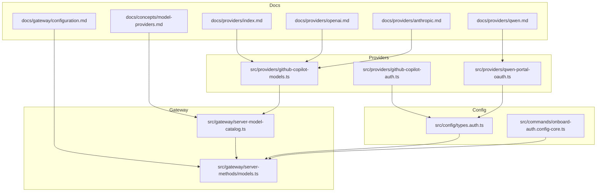
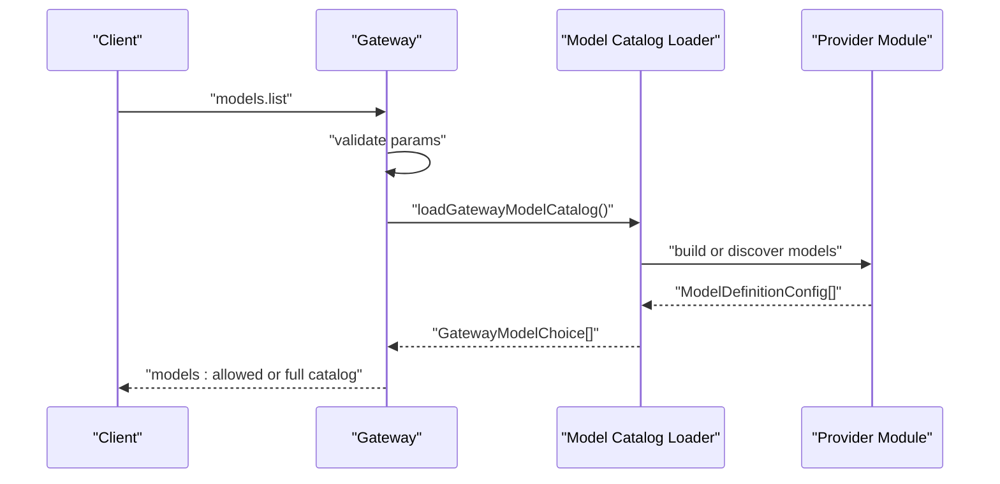
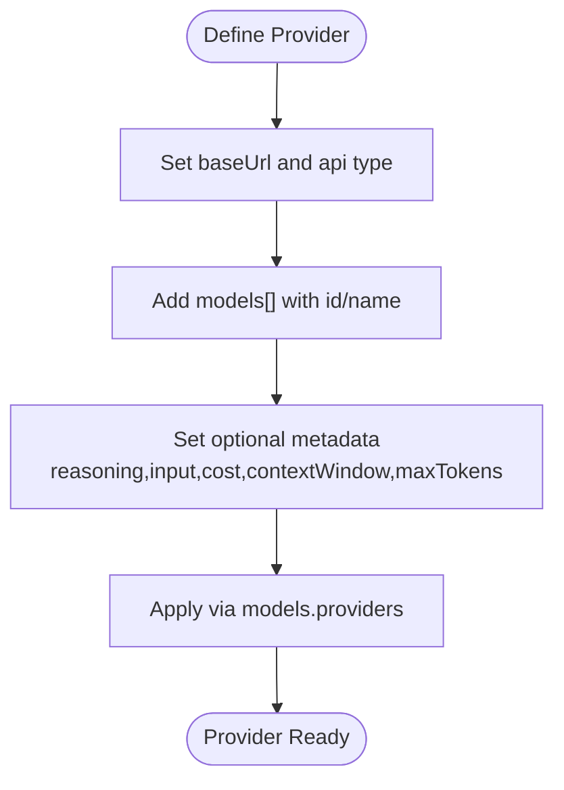
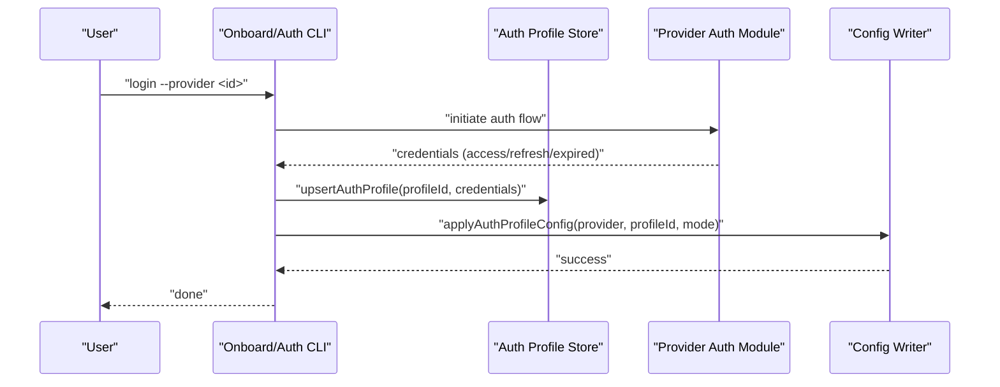
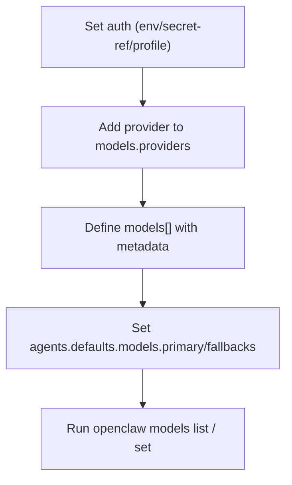
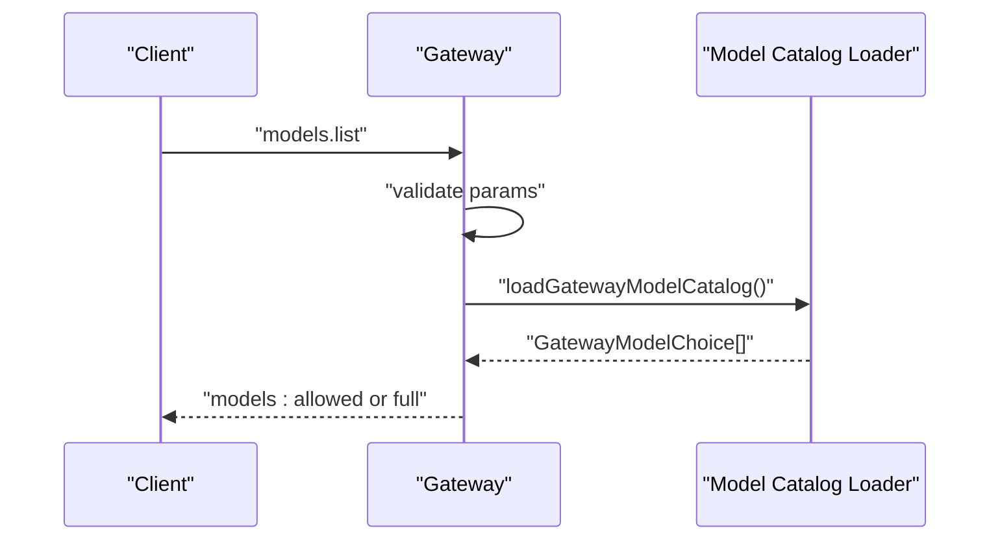
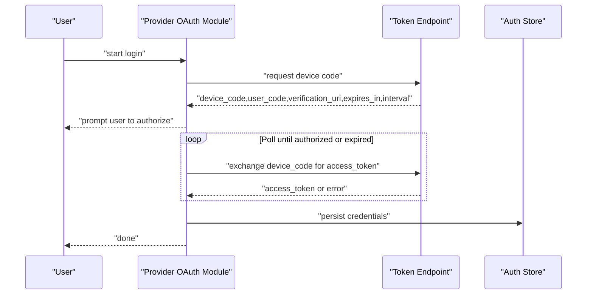
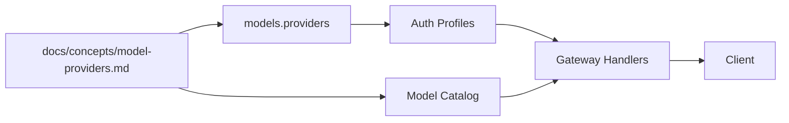

# Custom Model Providers

<cite>
**Referenced Files in This Document**
- [model-providers.md](file://docs/concepts/model-providers.md)
- [configuration.md](file://docs/gateway/configuration.md)
- [index.md](file://docs/providers/index.md)
- [openai.md](file://docs/providers/openai.md)
- [anthropic.md](file://docs/providers/anthropic.md)
- [qwen.md](file://docs/providers/qwen.md)
- [github-copilot-models.ts](file://src/providers/github-copilot-models.ts)
- [github-copilot-auth.ts](file://src/providers/github-copilot-auth.ts)
- [qwen-portal-oauth.ts](file://src/providers/qwen-portal-oauth.ts)
- [models.ts](file://src/gateway/server-methods/models.ts)
- [server-model-catalog.ts](file://src/gateway/server-model-catalog.ts)
- [types.auth.ts](file://src/config/types.auth.ts)
- [onboard-auth.config-core.ts](file://src/commands/onboard-auth.config-core.ts)
</cite>

## Table of Contents
1. [Introduction](#introduction)
2. [Project Structure](#project-structure)
3. [Core Components](#core-components)
4. [Architecture Overview](#architecture-overview)
5. [Detailed Component Analysis](#detailed-component-analysis)
6. [Dependency Analysis](#dependency-analysis)
7. [Performance Considerations](#performance-considerations)
8. [Troubleshooting Guide](#troubleshooting-guide)
9. [Conclusion](#conclusion)
10. [Appendices](#appendices)

## Introduction
This document explains how to implement custom model providers in OpenClaw. It covers the provider interface contract, authentication mechanisms, configuration patterns, provider registration, model catalog integration, and API gateway setup. It also documents authentication flow patterns, rate limiting strategies, error handling, and provides step-by-step guides for integrating new AI providers, custom authentication schemes, and enterprise API gateways. Practical examples illustrate authentication, request/response transformation, and monitoring integration.

## Project Structure
OpenClaw organizes provider capabilities across documentation, runtime configuration, and provider-specific modules:
- Concepts and configuration references define provider contracts and configuration patterns.
- Provider modules implement authentication flows and model catalogs.
- Gateway handlers expose model catalog and selection to clients.

**Diagram sources**
- [model-providers.md](file://docs/concepts/model-providers.md#L1-L460)
- [configuration.md](file://docs/gateway/configuration.md#L1-L547)
- [index.md](file://docs/providers/index.md#L1-L63)
- [openai.md](file://docs/providers/openai.md#L1-L246)
- [anthropic.md](file://docs/providers/anthropic.md#L1-L232)
- [qwen.md](file://docs/providers/qwen.md#L1-L54)
- [github-copilot-models.ts](file://src/providers/github-copilot-models.ts#L1-L44)
- [github-copilot-auth.ts](file://src/providers/github-copilot-auth.ts#L1-L185)
- [qwen-portal-oauth.ts](file://src/providers/qwen-portal-oauth.ts#L1-L63)
- [server-model-catalog.ts](file://src/gateway/server-model-catalog.ts#L1-L19)
- [models.ts](file://src/gateway/server-methods/models.ts#L1-L39)
- [types.auth.ts](file://src/config/types.auth.ts#L1-L29)
- [onboard-auth.config-core.ts](file://src/commands/onboard-auth.config-core.ts#L469-L491)

**Section sources**
- [model-providers.md](file://docs/concepts/model-providers.md#L1-L460)
- [configuration.md](file://docs/gateway/configuration.md#L1-L547)
- [index.md](file://docs/providers/index.md#L1-L63)

## Core Components
- Provider interface contract: Define provider id, base URL, API type, and model catalog entries. Support optional model metadata (reasoning, input types, cost, context window, max tokens).
- Authentication mechanisms: Static API key, bearer token, and OAuth with refresh flows. Profiles support ordering and cooldowns.
- Configuration patterns: Use models.providers for custom providers and OpenAI/Anthropic-compatible proxies. Environment variable substitution and secret refs.
- Provider registration: Add provider entries to models.providers and optionally register auth profiles. Apply via onboard or config CLI.
- Model catalog integration: Gateway loads the model catalog and filters by allowlist. Clients query models.list to receive the allowed catalog.
- API gateway setup: Gateway exposes models.list handler and validates parameters. Catalog loading integrates with provider modules.

**Section sources**
- [model-providers.md](file://docs/concepts/model-providers.md#L168-L460)
- [configuration.md](file://docs/gateway/configuration.md#L107-L132)
- [types.auth.ts](file://src/config/types.auth.ts#L1-L29)
- [onboard-auth.config-core.ts](file://src/commands/onboard-auth.config-core.ts#L469-L491)
- [models.ts](file://src/gateway/server-methods/models.ts#L12-L39)
- [server-model-catalog.ts](file://src/gateway/server-model-catalog.ts#L17-L19)

## Architecture Overview
The provider ecosystem integrates documentation-driven configuration, runtime authentication, and gateway exposure.

**Diagram sources**
- [models.ts](file://src/gateway/server-methods/models.ts#L12-L39)
- [server-model-catalog.ts](file://src/gateway/server-model-catalog.ts#L17-L19)
- [github-copilot-models.ts](file://src/providers/github-copilot-models.ts#L25-L43)

## Detailed Component Analysis

### Provider Interface Contract
- Provider identity and base URL: Use models.providers to add a provider with a unique id and base URL. For OpenAI/Anthropic-compatible endpoints, specify api type and models list.
- Model definition: Each model entry includes id, name, api type, reasoning flag, input types, cost, context window, and max tokens. Defaults are applied when omitted.
- Compatibility notes: For non-native endpoints, OpenAI-compatible providers may force developer role support off to avoid 400 errors.

**Section sources**
- [model-providers.md](file://docs/concepts/model-providers.md#L437-L450)
- [github-copilot-models.ts](file://src/providers/github-copilot-models.ts#L25-L43)

### Authentication Mechanisms
- Static API key and token: Configure apiKey or token in provider entries. Use environment variable substitution or secret refs for secure storage.
- OAuth: Implement refresh flows and store access/refresh/expires. Sync with auth profiles and apply via onboard or CLI.
- Profile management: Auth profiles support mode selection (api_key, oauth, token), email, and ordering/cooldown policies.

**Diagram sources**
- [github-copilot-auth.ts](file://src/providers/github-copilot-auth.ts#L117-L185)
- [qwen-portal-oauth.ts](file://src/providers/qwen-portal-oauth.ts#L8-L62)
- [onboard-auth.config-core.ts](file://src/commands/onboard-auth.config-core.ts#L469-L491)
- [types.auth.ts](file://src/config/types.auth.ts#L1-L29)

**Section sources**
- [github-copilot-auth.ts](file://src/providers/github-copilot-auth.ts#L1-L185)
- [qwen-portal-oauth.ts](file://src/providers/qwen-portal-oauth.ts#L1-L63)
- [types.auth.ts](file://src/config/types.auth.ts#L1-L29)
- [onboard-auth.config-core.ts](file://src/commands/onboard-auth.config-core.ts#L469-L491)

### Configuration Patterns
- Built-in providers: Many providers ship with OpenClaw and require minimal configuration beyond auth keys. Examples include OpenAI, Anthropic, Google, and others.
- Custom providers: Use models.providers to add OpenAI/Anthropic-compatible proxies or local/self-hosted endpoints. Specify base URL, api type, and models list.
- Environment variables and secret refs: Substitute env vars in config values and use secret ref sources for secure credential storage.
- Model selection: agents.defaults.models acts as an allowlist for the model catalog and supports aliases and fallbacks.

**Section sources**
- [model-providers.md](file://docs/concepts/model-providers.md#L34-L167)
- [configuration.md](file://docs/gateway/configuration.md#L107-L132)
- [configuration.md](file://docs/gateway/configuration.md#L481-L536)

### Provider Registration Process
- Register a provider by adding an entry under models.providers with id, baseUrl, api, and models[]. Optionally include apiKey or token.
- Apply auth profile via onboard or CLI to associate credentials with the provider.
- Validate configuration and reload the gateway to activate changes.

**Section sources**
- [model-providers.md](file://docs/concepts/model-providers.md#L168-L460)
- [onboard-auth.config-core.ts](file://src/commands/onboard-auth.config-core.ts#L469-L491)

### Model Catalog Integration
- Gateway loads the model catalog and filters by the allowlist defined in agents.defaults.models.
- The models.list handler validates parameters, loads the catalog, computes allowed models, and responds with the appropriate list.

**Diagram sources**
- [models.ts](file://src/gateway/server-methods/models.ts#L12-L39)
- [server-model-catalog.ts](file://src/gateway/server-model-catalog.ts#L17-L19)

**Section sources**
- [models.ts](file://src/gateway/server-methods/models.ts#L12-L39)
- [server-model-catalog.ts](file://src/gateway/server-model-catalog.ts#L17-L19)

### API Gateway Setup
- The gateway exposes models.list with parameter validation and error handling.
- Catalog loading integrates with provider modules to assemble the model catalog.
- Configuration hot reload applies safe changes instantly; critical changes trigger restarts.

**Section sources**
- [models.ts](file://src/gateway/server-methods/models.ts#L12-L39)
- [configuration.md](file://docs/gateway/configuration.md#L349-L388)

### Authentication Flow Patterns
- Device code OAuth (GitHub Copilot): Request device code, display user code, poll for access token, persist profile, and update config.
- Qwen portal OAuth: Refresh access tokens using refresh_token grant and update expiration.
- Anthropic setup-token: Use setup-token for subscription access; supports paste-token and CLI flows.
- OpenAI Codex OAuth: Supports ChatGPT sign-in for subscription access.

**Diagram sources**
- [github-copilot-auth.ts](file://src/providers/github-copilot-auth.ts#L40-L115)
- [qwen-portal-oauth.ts](file://src/providers/qwen-portal-oauth.ts#L16-L62)

**Section sources**
- [github-copilot-auth.ts](file://src/providers/github-copilot-auth.ts#L1-L185)
- [qwen-portal-oauth.ts](file://src/providers/qwen-portal-oauth.ts#L1-L63)
- [openai.md](file://docs/providers/openai.md#L40-L64)
- [anthropic.md](file://docs/providers/anthropic.md#L161-L198)

### Rate Limiting Strategies
- Key rotation: Configure multiple keys via environment variables or numbered keys. On rate-limit responses, requests retry with the next key.
- Backoff and cooldowns: Auth profiles support billing backoff hours, provider-specific backoff, caps, and failure windows to manage throttling.
- Non-rate-limit failures: Immediate failure without key rotation.

**Section sources**
- [model-providers.md](file://docs/concepts/model-providers.md#L20-L33)
- [types.auth.ts](file://src/config/types.auth.ts#L16-L28)

### Error Handling
- Validation errors: models.list validates parameters and returns structured errors.
- Network and provider errors: Discovery and API calls log warnings and fall back to static catalogs when upstream endpoints fail.
- OAuth refresh failures: Specific handling for expired or invalid refresh tokens with actionable messages.

**Section sources**
- [models.ts](file://src/gateway/server-methods/models.ts#L14-L24)
- [github-copilot-models.ts](file://src/providers/github-copilot-models.ts#L25-L43)
- [qwen-portal-oauth.ts](file://src/providers/qwen-portal-oauth.ts#L29-L53)

### Step-by-Step Guides

#### Integrating a New AI Provider (OpenAI/Anthropic-Compatible Proxy)
- Define provider id and base URL in models.providers.
- Choose api type (e.g., openai-completions or anthropic-messages) and add models[] with metadata.
- Configure apiKey or token; use env substitution or secret refs.
- Apply auth profile and set primary/fallback models in agents.defaults.models.
- Verify with openclaw models list and set default model.

**Section sources**
- [model-providers.md](file://docs/concepts/model-providers.md#L168-L460)
- [configuration.md](file://docs/gateway/configuration.md#L107-L132)

#### Adding a Custom Authentication Scheme (OAuth)
- Implement refresh flow and credential persistence.
- Upsert auth profile and apply profile to config.
- Use onboard or CLI to complete setup and update models.json.

**Section sources**
- [github-copilot-auth.ts](file://src/providers/github-copilot-auth.ts#L117-L185)
- [onboard-auth.config-core.ts](file://src/commands/onboard-auth.config-core.ts#L469-L491)

#### Enterprise API Gateway Integration
- Configure models.providers with enterprise base URL and api type.
- Secure credentials via secret refs or environment variables.
- Use models.list to introspect available models and align with internal catalogs.

**Section sources**
- [model-providers.md](file://docs/concepts/model-providers.md#L168-L460)
- [configuration.md](file://docs/gateway/configuration.md#L481-L536)

### Provider-Specific Configurations and Model Parameter Mapping
- OpenAI: Support WebSocket/SSE transport defaults, priority processing via serviceTier, and server-side compaction hints.
- Anthropic: Prompt caching via cacheRetention, adaptive thinking defaults, and 1M context window beta flag.
- Qwen: Free-tier OAuth with device code flow and model ids for coder and vision.

**Section sources**
- [openai.md](file://docs/providers/openai.md#L66-L246)
- [anthropic.md](file://docs/providers/anthropic.md#L38-L232)
- [qwen.md](file://docs/providers/qwen.md#L1-L54)

### Fallback Strategies
- Model catalog fallback: If an allowlist exists, models.list returns the allowed subset; otherwise, returns the full catalog.
- Discovery fallback: Provider discovery falls back to static catalogs when upstream endpoints fail.

**Section sources**
- [models.ts](file://src/gateway/server-methods/models.ts#L25-L34)
- [github-copilot-models.ts](file://src/providers/github-copilot-models.ts#L25-L43)

### Monitoring Integration
- Use gateway logs and model status to monitor provider health and credential validity.
- For OAuth providers, ensure refresh flows are logged and retried appropriately.

**Section sources**
- [github-copilot-auth.ts](file://src/providers/github-copilot-auth.ts#L140-L160)
- [qwen-portal-oauth.ts](file://src/providers/qwen-portal-oauth.ts#L48-L62)

## Dependency Analysis
Provider integration spans configuration, authentication, and gateway exposure.

**Diagram sources**
- [model-providers.md](file://docs/concepts/model-providers.md#L1-L460)
- [models.ts](file://src/gateway/server-methods/models.ts#L12-L39)
- [server-model-catalog.ts](file://src/gateway/server-model-catalog.ts#L17-L19)
- [types.auth.ts](file://src/config/types.auth.ts#L1-L29)

**Section sources**
- [model-providers.md](file://docs/concepts/model-providers.md#L1-L460)
- [models.ts](file://src/gateway/server-methods/models.ts#L12-L39)
- [server-model-catalog.ts](file://src/gateway/server-model-catalog.ts#L17-L19)
- [types.auth.ts](file://src/config/types.auth.ts#L1-L29)

## Performance Considerations
- Prefer SSE or WebSocket transport defaults per provider guidance to optimize latency.
- Use server-side compaction hints for OpenAI Responses to reduce payload sizes.
- Tune model metadata (contextWindow, maxTokens) to match provider limits and reduce retries.

[No sources needed since this section provides general guidance]

## Troubleshooting Guide
- Validation failures: Use openclaw doctor to diagnose schema issues; fix or repair with doctor --fix.
- OAuth refresh failures: Re-authenticate with provider-specific login commands; verify refresh tokens and expiration.
- Rate limit errors: Configure key rotation and verify that non-rate-limit failures do not trigger rotation.
- Model catalog issues: Confirm models.list returns expected models; check provider base URL and api type.

**Section sources**
- [configuration.md](file://docs/gateway/configuration.md#L67-L73)
- [qwen-portal-oauth.ts](file://src/providers/qwen-portal-oauth.ts#L29-L53)
- [model-providers.md](file://docs/concepts/model-providers.md#L20-L33)

## Conclusion
OpenClaw provides a robust framework for integrating custom model providers. By adhering to the provider interface contract, configuring authentication securely, and leveraging the gateway’s model catalog and handlers, teams can onboard new providers quickly, manage credentials effectively, and operate at scale with clear fallback and monitoring practices.

[No sources needed since this section summarizes without analyzing specific files]

## Appendices

### Practical Example Index
- GitHub Copilot provider: Model definitions and OpenAI-compatible responses API.
- Qwen portal OAuth: Device code flow and refresh token handling.
- OpenAI and Anthropic provider docs: Transport defaults, caching, and advanced parameters.

**Section sources**
- [github-copilot-models.ts](file://src/providers/github-copilot-models.ts#L1-L44)
- [qwen-portal-oauth.ts](file://src/providers/qwen-portal-oauth.ts#L1-L63)
- [openai.md](file://docs/providers/openai.md#L1-L246)
- [anthropic.md](file://docs/providers/anthropic.md#L1-L232)
- [qwen.md](file://docs/providers/qwen.md#L1-L54)