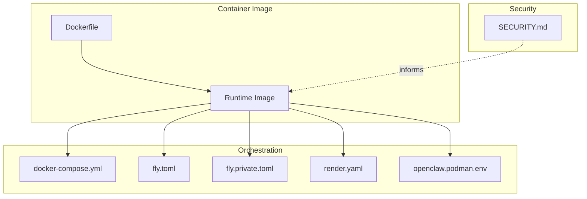
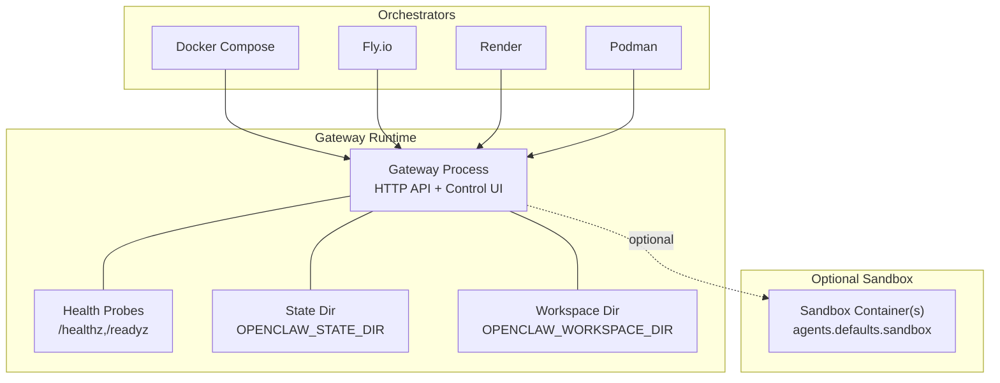
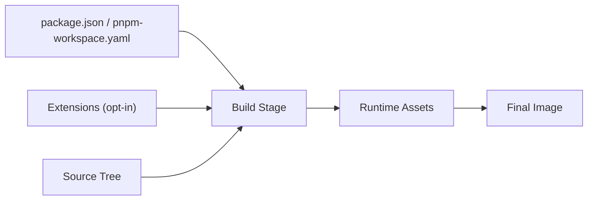

# Enterprise Deployment

<cite>
**Referenced Files in This Document**
- [Dockerfile](file://Dockerfile)
- [docker-compose.yml](file://docker-compose.yml)
- [fly.toml](file://fly.toml)
- [fly.private.toml](file://fly.private.toml)
- [render.yaml](file://render.yaml)
- [openclaw.podman.env](file://openclaw.podman.env)
- [SECURITY.md](file://SECURITY.md)
- [knip.config.ts](file://knip.config.ts)
</cite>

## Table of Contents
1. [Introduction](#introduction)
2. [Project Structure](#project-structure)
3. [Core Components](#core-components)
4. [Architecture Overview](#architecture-overview)
5. [Detailed Component Analysis](#detailed-component-analysis)
6. [Dependency Analysis](#dependency-analysis)
7. [Performance Considerations](#performance-considerations)
8. [Troubleshooting Guide](#troubleshooting-guide)
9. [Conclusion](#conclusion)
10. [Appendices](#appendices)

## Introduction
This document provides enterprise-grade deployment guidance for OpenClaw, focusing on advanced deployment patterns, production configurations, and operational excellence. It covers container orchestration strategies, load balancing, high availability, service mesh integration, API gateway configurations, microservices deployment patterns, security hardening, network segmentation, access control, disaster recovery, monitoring and observability, alerting, incident response, and compliance and audit considerations.

## Project Structure
OpenClaw’s deployment assets include:
- Container image definition and runtime configuration
- Orchestration manifests for Docker Compose, Fly.io, Render, and Podman
- Security policy and trust model guidance
- Build and packaging configuration for production readiness

**Diagram sources**
- [Dockerfile](file://Dockerfile#L1-L231)
- [docker-compose.yml](file://docker-compose.yml#L1-L77)
- [fly.toml](file://fly.toml#L1-L35)
- [fly.private.toml](file://fly.private.toml#L1-L40)
- [render.yaml](file://render.yaml#L1-L22)
- [openclaw.podman.env](file://openclaw.podman.env#L1-L25)
- [SECURITY.md](file://SECURITY.md#L1-L286)

**Section sources**
- [Dockerfile](file://Dockerfile#L1-L231)
- [docker-compose.yml](file://docker-compose.yml#L1-L77)
- [fly.toml](file://fly.toml#L1-L35)
- [fly.private.toml](file://fly.private.toml#L1-L40)
- [render.yaml](file://render.yaml#L1-L22)
- [openclaw.podman.env](file://openclaw.podman.env#L1-L25)
- [SECURITY.md](file://SECURITY.md#L1-L286)

## Core Components
- Container image: multi-stage build with slim and default variants, non-root runtime, health probes, and optional runtime utilities (browser, Docker CLI).
- Orchestration: Docker Compose for local and containerized environments; Fly.io and Render for Platform-as-a-Service (PaaS) deployments; Podman environment variables for rootless containerization.
- Security posture: non-root user, capability drops, read-only filesystem support, and explicit security guidance for Docker and bind modes.

Key production configuration touchpoints:
- Bind mode and authentication for the gateway HTTP surface
- Health checks and liveness/readiness endpoints
- Persistent storage mounts and state directories
- Optional sandboxing and Docker-in-Docker for agent sandboxes

**Section sources**
- [Dockerfile](file://Dockerfile#L211-L231)
- [docker-compose.yml](file://docker-compose.yml#L23-L49)
- [fly.toml](file://fly.toml#L10-L26)
- [fly.private.toml](file://fly.private.toml#L18-L31)
- [render.yaml](file://render.yaml#L6-L21)
- [openclaw.podman.env](file://openclaw.podman.env#L6-L24)
- [SECURITY.md](file://SECURITY.md#L225-L243)

## Architecture Overview
OpenClaw’s runtime consists of a gateway process and optional CLI companion, with optional sandbox containers for agent execution. The gateway exposes HTTP endpoints for control and canvas hosting, and supports health probes for orchestrator integration.

**Diagram sources**
- [Dockerfile](file://Dockerfile#L224-L231)
- [docker-compose.yml](file://docker-compose.yml#L28-L49)
- [fly.toml](file://fly.toml#L20-L26)
- [render.yaml](file://render.yaml#L1-L22)
- [openclaw.podman.env](file://openclaw.podman.env#L1-L25)

## Detailed Component Analysis

### Container Image and Runtime Hardening
- Non-root execution reduces privilege escalation risk.
- Health probes enable Kubernetes-style liveness/readiness checks.
- Optional utilities (Chromium/Xvfb, Docker CLI) can be included via build args for specialized workloads.
- Environment variables for production stability and package manager preference.

Recommended production hardening:
- Mount state/workspace as persistent volumes.
- Enforce read-only root filesystem and drop unnecessary capabilities.
- Use slim variant for smaller footprint; default variant for fewer missing system packages.

**Section sources**
- [Dockerfile](file://Dockerfile#L103-L231)

### Docker Compose Deployment
- Single-service stack with gateway and optional CLI container.
- Volume mounts for configuration and workspace.
- Health checks and restart policies.
- Optional sandbox socket and group membership for agent sandboxing.

Operational notes:
- Port mapping exposes gateway and bridge ports.
- Use host networking or override bind to “lan” with strong authentication for external access.
- For sandboxing, include Docker socket and set DOCKER_GID to host’s docker group.

**Section sources**
- [docker-compose.yml](file://docker-compose.yml#L1-L77)

### Fly.io PaaS Deployment
- Standard public ingress with HTTPS enforced and persistent machines.
- Private ingress variant without public HTTP service; access via fly proxy or WireGuard.
- Persistent disk mounted to state directory.

High availability:
- Minimum machines running ensures continuous operation for persistent connections.
- VM sizing and memory allocation tailored for Node.js workload.

**Section sources**
- [fly.toml](file://fly.toml#L1-L35)
- [fly.private.toml](file://fly.private.toml#L1-L40)

### Render PaaS Deployment
- Web service with Docker runtime, health check path, and ephemeral disk.
- Generates a gateway token automatically; mounts persistent disk for state/workspace.

**Section sources**
- [render.yaml](file://render.yaml#L1-L22)

### Podman Rootless Deployment
- Environment variables define gateway token, ports, and optional LLM provider credentials.
- Launch script consumes environment file for streamlined startup.

**Section sources**
- [openclaw.podman.env](file://openclaw.podman.env#L1-L25)

### Security Posture and Access Control
- Trust model: one trusted operator per gateway; session identifiers are routing controls, not authorization boundaries.
- Loopback-only binding recommended; non-loopback binds require strong authentication and firewalling.
- Docker hardening: non-root user, read-only filesystem, capability drops.
- Audit guidance and remediation for dangerous configurations.

**Section sources**
- [SECURITY.md](file://SECURITY.md#L88-L170)
- [SECURITY.md](file://SECURITY.md#L225-L243)
- [SECURITY.md](file://SECURITY.md#L259-L274)

### Monitoring and Observability
- Built-in health endpoints for liveness and readiness.
- Orchestrator-specific health checks and process definitions.
- Logging and redaction settings influence observability quality.

Recommendations:
- Integrate with platform-native monitoring (e.g., Fly.io metrics, Render logs).
- Centralize logs and enable structured logging for correlation.
- Configure alerting on health endpoint failures and resource thresholds.

**Section sources**
- [Dockerfile](file://Dockerfile#L224-L231)
- [fly.toml](file://fly.toml#L20-L26)
- [render.yaml](file://render.yaml#L6-L6)

### Disaster Recovery and Business Continuity
- Persistent disk mounts for state and workspace enable snapshot-based backups.
- Private ingress on Fly.io limits public exposure; access via secure tunnels.
- Minimum machines running ensures continuity for long-lived connections.

Backup strategy outline:
- Snapshot state and workspace directories regularly.
- Store snapshots in secure, geo-redundant storage.
- Test restoration procedures periodically.

**Section sources**
- [fly.toml](file://fly.toml#L32-L35)
- [fly.private.toml](file://fly.private.toml#L27-L31)
- [render.yaml](file://render.yaml#L18-L22)

### Compliance and Audit Logging
- Security policy defines responsible disclosure and report acceptance criteria.
- Detect-secrets integration in CI helps prevent secret leaks.
- Audit guidance highlights dangerous configurations and remediations.

Compliance checklist:
- Enforce least privilege for containers and volumes.
- Maintain audit trails for configuration changes and deployments.
- Review and remediate security audit findings proactively.

**Section sources**
- [SECURITY.md](file://SECURITY.md#L1-L86)
- [SECURITY.md](file://SECURITY.md#L275-L286)

## Dependency Analysis
Build-time and runtime dependencies are managed via pnpm and Node.js. The build pipeline prunes dev dependencies and prepares a minimal runtime image. Packaging and entry points are defined for CLI and gateway processes.

**Diagram sources**
- [Dockerfile](file://Dockerfile#L40-L91)
- [knip.config.ts](file://knip.config.ts#L1-L106)

**Section sources**
- [Dockerfile](file://Dockerfile#L40-L91)
- [knip.config.ts](file://knip.config.ts#L1-L106)

## Performance Considerations
- Choose slim variant for reduced image size; default variant if system packages are required.
- Allocate sufficient memory for Node.js heap via environment variables.
- Persist state and workspace to SSD-backed disks for I/O performance.
- Use platform-native autoscaling and horizontal scaling where supported.

[No sources needed since this section provides general guidance]

## Troubleshooting Guide
Common operational issues and resolutions:
- Gateway not reachable from host: switch to host networking or bind to “lan” with authentication.
- Health probe failures: verify bind mode, authentication, and firewall rules.
- Sandbox not working: ensure Docker socket is mounted and DOCKER_GID matches host docker group.

**Section sources**
- [Dockerfile](file://Dockerfile#L216-L229)
- [docker-compose.yml](file://docker-compose.yml#L15-L22)
- [fly.toml](file://fly.toml#L20-L26)

## Conclusion
OpenClaw offers flexible deployment options from containerized environments to managed platforms, with strong security defaults and observability hooks. By combining non-root containers, robust authentication, persistent storage, and platform-native HA features, enterprises can operate OpenClaw securely and reliably at scale.

[No sources needed since this section summarizes without analyzing specific files]

## Appendices

### API Gateway and Service Mesh Integration Notes
- The gateway exposes HTTP endpoints suitable for reverse proxy or ingress controllers.
- For service mesh integration, place the gateway behind an ingress with mutual TLS and strict mTLS policies.
- Use the built-in health endpoints for mesh health probes.

[No sources needed since this section provides general guidance]

### Microservices Deployment Patterns
- Keep the gateway as a single control plane; delegate compute-intensive tasks to sandbox containers.
- Use platform-native job runners or batch systems for long-running tasks.
- Separate concerns: gateway for control, sandboxes for execution, persistent stores for state/workspace.

[No sources needed since this section provides general guidance]