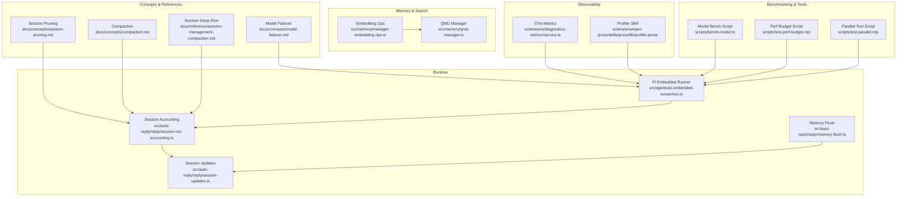
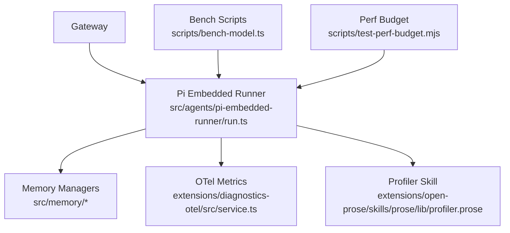
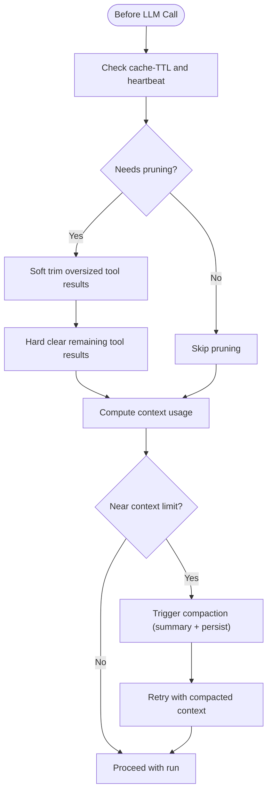
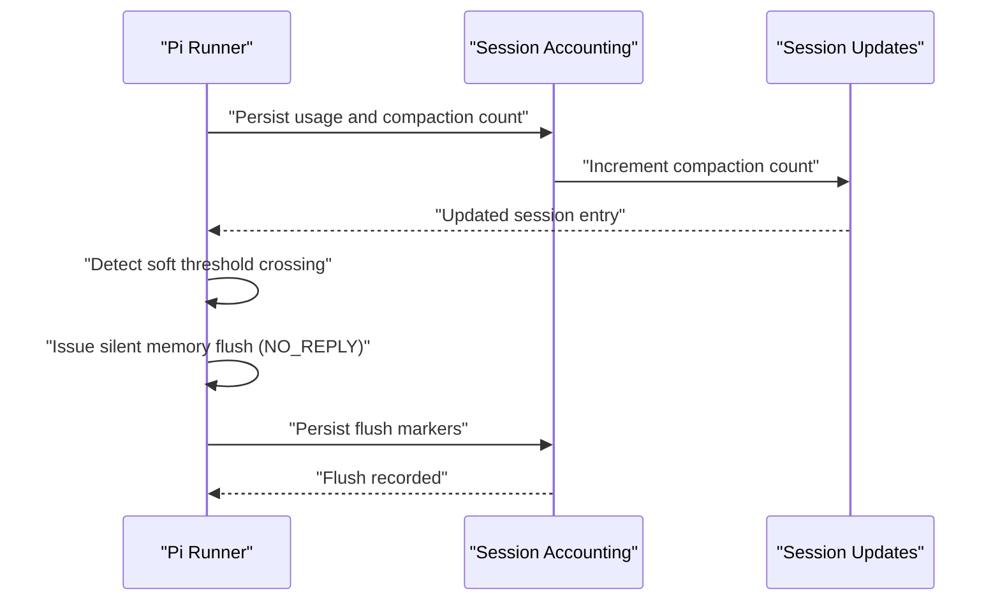
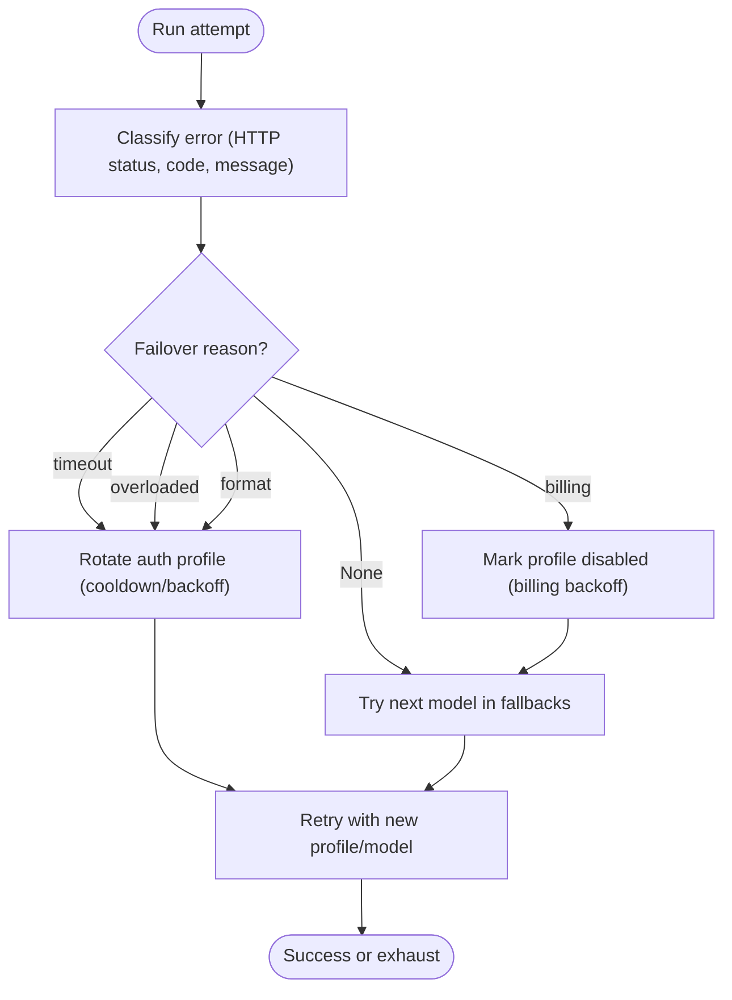
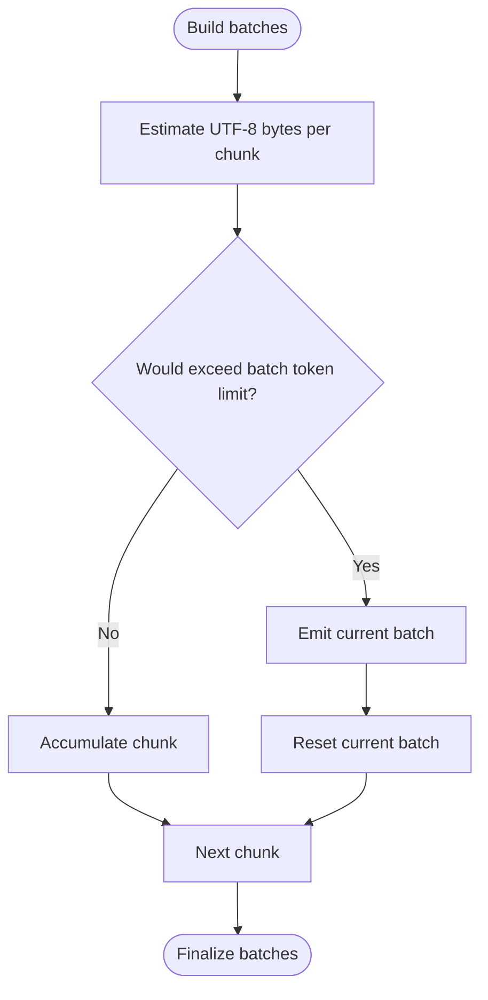
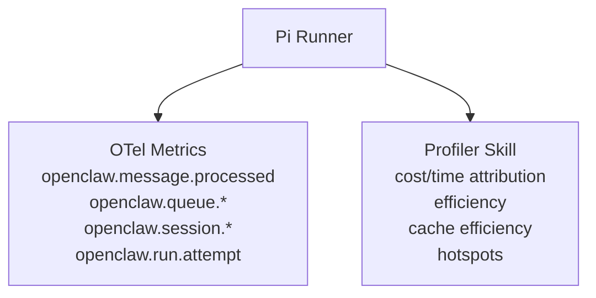
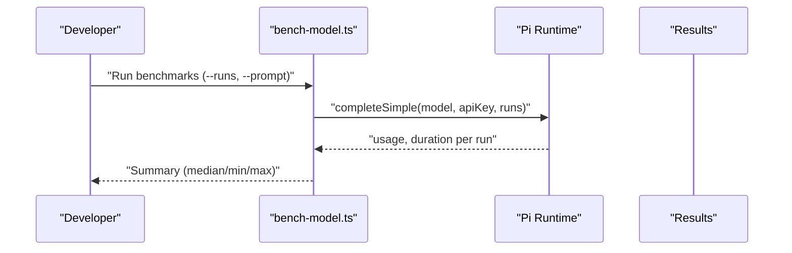
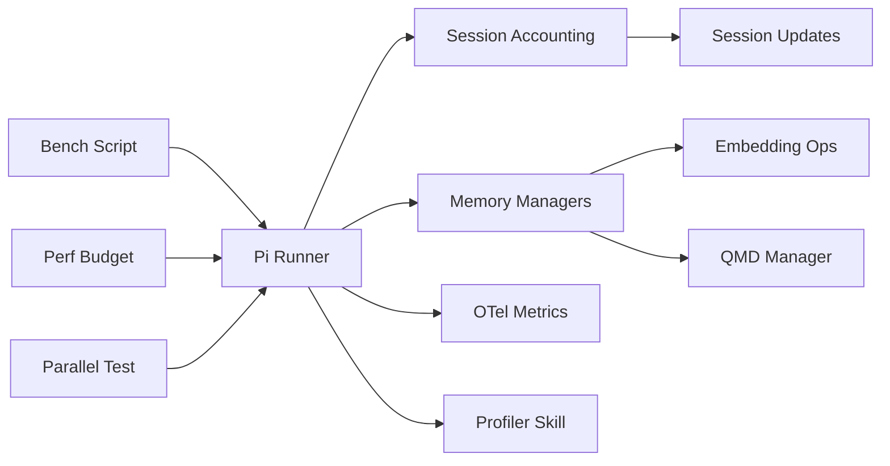

# Performance Optimization

<cite>
**Referenced Files in This Document**
- [session-pruning.md](file://docs/concepts/session-pruning.md)
- [compaction.md](file://docs/concepts/compaction.md)
- [session-management-compaction.md](file://docs/reference/session-management-compaction.md)
- [model-failover.md](file://docs/concepts/model-failover.md)
- [service.ts](file://extensions/diagnostics-otel/src/service.ts)
- [profiler.prose](file://extensions/open-prose/skills/prose/lib/profiler.prose)
- [run.ts](file://src/agents/pi-embedded-runner/run.ts)
- [types.tools.ts](file://src/config/types.tools.ts)
- [qmd-manager.ts](file://src/memory/qmd-manager.ts)
- [bench-model.ts](file://scripts/bench-model.ts)
- [test-perf-budget.mjs](file://scripts/test-perf-budget.mjs)
- [test-parallel.mjs](file://scripts/test-parallel.mjs)
- [status.scan.ts](file://src/commands/status.scan.ts)
- [manager-embedding-ops.ts](file://src/memory/manager-embedding-ops.ts)
- [runtime-cache.ts](file://src/acp/control-plane/runtime-cache.ts)
- [manager.core.ts](file://src/acp/control-plane/manager.core.ts)
- [persistent-dedupe.ts](file://src/plugin-sdk/persistent-dedupe.ts)
- [config-state.ts](file://src/plugins/config-state.ts)
- [failover-error.ts](file://src/agents/failover-error.ts)
- [failover-error.test.ts](file://src/agents/failover-error.test.ts)
- [session-run-accounting.ts](file://src/auto-reply/reply/session-run-accounting.ts)
- [memory-flush.ts](file://src/auto-reply/reply/memory-flush.ts)
- [session-updates.ts](file://src/auto-reply/reply/session-updates.ts)
</cite>

## Table of Contents
1. [Introduction](#introduction)
2. [Project Structure](#project-structure)
3. [Core Components](#core-components)
4. [Architecture Overview](#architecture-overview)
5. [Detailed Component Analysis](#detailed-component-analysis)
6. [Dependency Analysis](#dependency-analysis)
7. [Performance Considerations](#performance-considerations)
8. [Troubleshooting Guide](#troubleshooting-guide)
9. [Conclusion](#conclusion)
10. [Appendices](#appendices)

## Introduction
This document provides advanced performance optimization guidance for OpenClaw, focusing on tuning strategies that improve throughput, reduce latency, and lower operational costs. It covers session pruning and compaction, memory compaction and flushing, cache optimization, model failover and load balancing, resource allocation, monitoring and bottleneck identification, and benchmarking and capacity planning. The content synthesizes repository-backed behaviors and configuration surfaces to present practical, actionable patterns for high-throughput enterprise deployments.

## Project Structure
OpenClaw’s performance-critical subsystems are distributed across:
- Concepts and references that define session lifecycle, compaction, pruning, and failover policies
- Runtime execution and orchestration (embedded Pi runner, ACP control plane)
- Memory and vector search infrastructure (embedding batching, QMD manager)
- Observability and diagnostics (OTel metrics, profiler skill)
- Benchmarking and performance tests (model benchmark script, perf budget script)

**Diagram sources**
- [session-pruning.md](file://docs/concepts/session-pruning.md#L1-L122)
- [compaction.md](file://docs/concepts/compaction.md#L1-L105)
- [session-management-compaction.md](file://docs/reference/session-management-compaction.md#L1-L325)
- [model-failover.md](file://docs/concepts/model-failover.md#L1-L153)
- [run.ts](file://src/agents/pi-embedded-runner/run.ts#L121-L680)
- [session-run-accounting.ts](file://src/auto-reply/reply/session-run-accounting.ts#L1-L35)
- [memory-flush.ts](file://src/auto-reply/reply/memory-flush.ts#L195-L228)
- [session-updates.ts](file://src/auto-reply/reply/session-updates.ts#L241-L294)
- [manager-embedding-ops.ts](file://src/memory/manager-embedding-ops.ts#L38-L75)
- [qmd-manager.ts](file://src/memory/qmd-manager.ts#L1911-L1957)
- [service.ts](file://extensions/diagnostics-otel/src/service.ts#L201-L241)
- [profiler.prose](file://extensions/open-prose/skills/prose/lib/profiler.prose#L317-L400)
- [bench-model.ts](file://scripts/bench-model.ts#L1-L147)
- [test-perf-budget.mjs](file://scripts/test-perf-budget.mjs#L1-L128)
- [test-parallel.mjs](file://scripts/test-parallel.mjs#L243-L300)

**Section sources**
- [session-pruning.md](file://docs/concepts/session-pruning.md#L1-L122)
- [compaction.md](file://docs/concepts/compaction.md#L1-L105)
- [session-management-compaction.md](file://docs/reference/session-management-compaction.md#L1-L325)
- [model-failover.md](file://docs/concepts/model-failover.md#L1-L153)
- [run.ts](file://src/agents/pi-embedded-runner/run.ts#L121-L680)
- [session-run-accounting.ts](file://src/auto-reply/reply/session-run-accounting.ts#L1-L35)
- [memory-flush.ts](file://src/auto-reply/reply/memory-flush.ts#L195-L228)
- [session-updates.ts](file://src/auto-reply/reply/session-updates.ts#L241-L294)
- [manager-embedding-ops.ts](file://src/memory/manager-embedding-ops.ts#L38-L75)
- [qmd-manager.ts](file://src/memory/qmd-manager.ts#L1911-L1957)
- [service.ts](file://extensions/diagnostics-otel/src/service.ts#L201-L241)
- [profiler.prose](file://extensions/open-prose/skills/prose/lib/profiler.prose#L317-L400)
- [bench-model.ts](file://scripts/bench-model.ts#L1-L147)
- [test-perf-budget.mjs](file://scripts/test-perf-budget.mjs#L1-L128)
- [test-parallel.mjs](file://scripts/test-parallel.mjs#L243-L300)

## Core Components
- Session pruning and compaction: reduce context bloat and manage long sessions
- Memory flush and compaction accounting: prevent loss of durable state during compaction
- Model failover and auth profile rotation: maintain availability under rate limits and timeouts
- Memory search and embedding batching: optimize vector index operations
- Observability and profiling: measure and analyze performance signals
- Benchmarking and performance budgets: validate throughput and regression thresholds

**Section sources**
- [session-pruning.md](file://docs/concepts/session-pruning.md#L1-L122)
- [compaction.md](file://docs/concepts/compaction.md#L1-L105)
- [session-management-compaction.md](file://docs/reference/session-management-compaction.md#L283-L314)
- [run.ts](file://src/agents/pi-embedded-runner/run.ts#L121-L155)
- [failover-error.ts](file://src/agents/failover-error.ts#L151-L240)
- [manager-embedding-ops.ts](file://src/memory/manager-embedding-ops.ts#L38-L75)
- [service.ts](file://extensions/diagnostics-otel/src/service.ts#L201-L241)
- [bench-model.ts](file://scripts/bench-model.ts#L1-L147)

## Architecture Overview
OpenClaw’s performance architecture centers on:
- A Gateway that owns session state and orchestrates runs
- Embedded Pi runtime that triggers compaction and retries on overflow
- Memory subsystem that batches embeddings and manages vector indices
- Observability pipeline that emits metrics and supports profiling
- Benchmarking and test harnesses that enforce performance budgets

**Diagram sources**
- [run.ts](file://src/agents/pi-embedded-runner/run.ts#L121-L680)
- [service.ts](file://extensions/diagnostics-otel/src/service.ts#L201-L241)
- [profiler.prose](file://extensions/open-prose/skills/prose/lib/profiler.prose#L317-L400)
- [bench-model.ts](file://scripts/bench-model.ts#L1-L147)
- [test-perf-budget.mjs](file://scripts/test-perf-budget.mjs#L1-L128)

## Detailed Component Analysis

### Session Pruning and Compaction
- Purpose: Reduce context growth from tool outputs (pruning) and summarize older history (compaction)
- Triggers:
  - Pruning: cache-TTL mode with heartbeat alignment and protection of recent assistant messages
  - Compaction: overflow recovery and threshold maintenance with reserve tokens and recent token keep
- Persistence: compaction summaries are persisted; pruning is transient per request
- Configuration: context window estimation, soft/hard trimming, tool allow/deny, and compaction settings

**Diagram sources**
- [session-pruning.md](file://docs/concepts/session-pruning.md#L13-L86)
- [compaction.md](file://docs/concepts/compaction.md#L57-L68)
- [session-management-compaction.md](file://docs/reference/session-management-compaction.md#L213-L255)

**Section sources**
- [session-pruning.md](file://docs/concepts/session-pruning.md#L1-L122)
- [compaction.md](file://docs/concepts/compaction.md#L1-L105)
- [session-management-compaction.md](file://docs/reference/session-management-compaction.md#L1-L325)

### Memory Flush and Compaction Accounting
- Goal: Prevent durable state loss during compaction by writing memory before threshold compaction
- Mechanism: Silent “NO_REPLY” flush when crossing soft threshold; tracked per compaction cycle
- Integration: compaction count increment updates token totals and clears per-segment token breakdown

**Diagram sources**
- [session-run-accounting.ts](file://src/auto-reply/reply/session-run-accounting.ts#L15-L35)
- [session-updates.ts](file://src/auto-reply/reply/session-updates.ts#L241-L294)
- [memory-flush.ts](file://src/auto-reply/reply/memory-flush.ts#L195-L228)

**Section sources**
- [session-run-accounting.ts](file://src/auto-reply/reply/session-run-accounting.ts#L1-L35)
- [session-updates.ts](file://src/auto-reply/reply/session-updates.ts#L241-L294)
- [memory-flush.ts](file://src/auto-reply/reply/memory-flush.ts#L195-L228)
- [session-management-compaction.md](file://docs/reference/session-management-compaction.md#L283-L314)

### Model Failover and Load Balancing
- Stages: auth profile rotation within a provider, then model fallback across configured fallbacks
- Rotation order: explicit config, configured profiles, stored profiles; round-robin preference with cooldowns and disabled profiles
- Cooldowns: exponential backoff for rate limits/timeouts; billing failures use longer backoff and disable logic
- Classification: HTTP status, error codes, and messages mapped to failover reasons

**Diagram sources**
- [model-failover.md](file://docs/concepts/model-failover.md#L42-L150)
- [failover-error.ts](file://src/agents/failover-error.ts#L151-L240)
- [failover-error.test.ts](file://src/agents/failover-error.test.ts#L71-L82)

**Section sources**
- [model-failover.md](file://docs/concepts/model-failover.md#L1-L153)
- [failover-error.ts](file://src/agents/failover-error.ts#L151-L240)
- [failover-error.test.ts](file://src/agents/failover-error.test.ts#L71-L82)

### Memory Search and Embedding Optimization
- Embedding batching: batch by token estimates to avoid exceeding provider limits; single-chunk fallback when oversized
- Vector index operations: debounce updates, detect busy/index errors, and wait for pending updates before search
- Status probing: probe vector availability for memory status snapshots

**Diagram sources**
- [manager-embedding-ops.ts](file://src/memory/manager-embedding-ops.ts#L38-L75)
- [qmd-manager.ts](file://src/memory/qmd-manager.ts#L1911-L1957)
- [status.scan.ts](file://src/commands/status.scan.ts#L157-L180)

**Section sources**
- [manager-embedding-ops.ts](file://src/memory/manager-embedding-ops.ts#L38-L75)
- [qmd-manager.ts](file://src/memory/qmd-manager.ts#L1911-L1957)
- [status.scan.ts](file://src/commands/status.scan.ts#L157-L180)

### Observability and Profiling
- OTel metrics: counters and histograms for message processing, queue depth/wait, session stuck metrics, run attempts
- Profiler skill: structured analysis of cost/time attribution, efficiency, cache efficiency, hotspots, and recommendations

**Diagram sources**
- [service.ts](file://extensions/diagnostics-otel/src/service.ts#L201-L241)
- [profiler.prose](file://extensions/open-prose/skills/prose/lib/profiler.prose#L317-L400)

**Section sources**
- [service.ts](file://extensions/diagnostics-otel/src/service.ts#L201-L241)
- [profiler.prose](file://extensions/open-prose/skills/prose/lib/profiler.prose#L317-L400)

### Benchmarking and Performance Budgets
- Model benchmark script: run multiple iterations, compute median/min/max durations, and compare providers
- Perf budget script: enforce wall-clock and regression budgets for test suites
- Parallel test script: dynamic worker allocation based on host CPU load and memory profile

**Diagram sources**
- [bench-model.ts](file://scripts/bench-model.ts#L50-L79)
- [test-perf-budget.mjs](file://scripts/test-perf-budget.mjs#L63-L127)
- [test-parallel.mjs](file://scripts/test-parallel.mjs#L243-L300)

**Section sources**
- [bench-model.ts](file://scripts/bench-model.ts#L1-L147)
- [test-perf-budget.mjs](file://scripts/test-perf-budget.mjs#L1-L128)
- [test-parallel.mjs](file://scripts/test-parallel.mjs#L243-L300)

## Dependency Analysis
- Runtime depends on session accounting and updates to track compaction cycles and token usage
- Memory managers depend on embedding batching and QMD index resilience
- Observability integrates with runtime and profiling skill
- Benchmarking and tests depend on runtime and environment variables

**Diagram sources**
- [run.ts](file://src/agents/pi-embedded-runner/run.ts#L121-L680)
- [session-run-accounting.ts](file://src/auto-reply/reply/session-run-accounting.ts#L1-L35)
- [session-updates.ts](file://src/auto-reply/reply/session-updates.ts#L241-L294)
- [manager-embedding-ops.ts](file://src/memory/manager-embedding-ops.ts#L38-L75)
- [qmd-manager.ts](file://src/memory/qmd-manager.ts#L1911-L1957)
- [service.ts](file://extensions/diagnostics-otel/src/service.ts#L201-L241)
- [profiler.prose](file://extensions/open-prose/skills/prose/lib/profiler.prose#L317-L400)
- [bench-model.ts](file://scripts/bench-model.ts#L1-L147)
- [test-perf-budget.mjs](file://scripts/test-perf-budget.mjs#L1-L128)
- [test-parallel.mjs](file://scripts/test-parallel.mjs#L243-L300)

**Section sources**
- [run.ts](file://src/agents/pi-embedded-runner/run.ts#L121-L680)
- [session-run-accounting.ts](file://src/auto-reply/reply/session-run-accounting.ts#L1-L35)
- [session-updates.ts](file://src/auto-reply/reply/session-updates.ts#L241-L294)
- [manager-embedding-ops.ts](file://src/memory/manager-embedding-ops.ts#L38-L75)
- [qmd-manager.ts](file://src/memory/qmd-manager.ts#L1911-L1957)
- [service.ts](file://extensions/diagnostics-otel/src/service.ts#L201-L241)
- [profiler.prose](file://extensions/open-prose/skills/prose/lib/profiler.prose#L317-L400)
- [bench-model.ts](file://scripts/bench-model.ts#L1-L147)
- [test-perf-budget.mjs](file://scripts/test-perf-budget.mjs#L1-L128)
- [test-parallel.mjs](file://scripts/test-parallel.mjs#L243-L300)

## Performance Considerations
- Context window and compaction
  - Tune reserve tokens and recent token keep to avoid premature compaction
  - Use compaction summaries to reduce context size while preserving recent messages
- Pruning for cache efficiency
  - Align cache-TTL with provider cache retention and heartbeat
  - Protect recent assistant messages and avoid trimming image-containing tool results
- Memory flush and durability
  - Enable pre-compaction memory flush to persist durable state before summarization
  - Track compaction count and token totals to avoid repeated flushes per cycle
- Model failover and load balancing
  - Configure auth.profile rotation order and cooldowns to minimize rate-limit impact
  - Use model fallbacks for transient failures; classify errors to choose appropriate fallback paths
- Memory search and embedding
  - Batch embeddings by token estimates; handle oversized chunks individually
  - Debounce index updates and wait for pending updates to avoid busy/index errors
- Observability and profiling
  - Instrument message processing duration, queue depth/wait, and session stuck metrics
  - Use profiler skill to attribute cost/time and identify bottlenecks
- Benchmarking and capacity planning
  - Compare provider performance with model benchmark script; track median/min/max
  - Enforce test performance budgets to prevent regressions
  - Scale workers based on host CPU load and memory profile

[No sources needed since this section provides general guidance]

## Troubleshooting Guide
- Compaction loops or excessive churn
  - Verify reserve tokens and recent token keep; adjust to avoid early compaction
  - Check tool-result bloat and enable/tune session pruning
- Silent flush not occurring
  - Confirm soft threshold crossing and NO_REPLY suppression
  - Ensure workspace is writable and flush is enabled
- Rate limits and timeouts
  - Inspect failover classification and rotation order
  - Review cooldown/backoff behavior and billing disable logic
- Memory search failures
  - Check for busy/index errors and pending update waits
  - Probe vector availability and status snapshot
- Test performance regressions
  - Use perf budget script to enforce wall-clock and regression thresholds
  - Adjust parallel worker allocation based on host load

**Section sources**
- [session-management-compaction.md](file://docs/reference/session-management-compaction.md#L316-L325)
- [memory-flush.ts](file://src/auto-reply/reply/memory-flush.ts#L210-L228)
- [failover-error.ts](file://src/agents/failover-error.ts#L151-L240)
- [qmd-manager.ts](file://src/memory/qmd-manager.ts#L1911-L1957)
- [test-perf-budget.mjs](file://scripts/test-perf-budget.mjs#L98-L127)
- [test-parallel.mjs](file://scripts/test-parallel.mjs#L243-L300)

## Conclusion
OpenClaw’s performance optimization relies on coordinated strategies across session lifecycle management, memory durability, model reliability, and observability. By tuning compaction and pruning, implementing pre-compaction memory flushes, leveraging robust failover and load-balancing, optimizing memory search batching, and enforcing rigorous benchmarking and capacity planning, enterprises can achieve high throughput, predictable latency, and sustainable operational costs.

[No sources needed since this section summarizes without analyzing specific files]

## Appendices

### Advanced Configuration Patterns
- Hybrid search and index caching
  - Enable hybrid BM25 + vector search with configurable weights and candidate pool multiplier
  - Optionally enable MMR re-ranking and temporal decay for recency
  - Cache chunk embeddings in SQLite with optional max entries cap
- Query behavior
  - Set max results and min score thresholds
  - Configure hybrid scoring parameters and optional MMR and temporal decay

**Section sources**
- [types.tools.ts](file://src/config/types.tools.ts#L390-L429)

### Resource Allocation Policies
- Dynamic worker allocation based on host CPU load and memory profile
- Conservative splits for low-memory hosts; prioritized parallelism for high-memory hosts

**Section sources**
- [test-parallel.mjs](file://scripts/test-parallel.mjs#L243-L300)

### Database Optimization and Query Improvements
- Debounce session updates and detect busy/index errors in QMD manager
- Wait for pending updates before search to avoid contention
- Probe vector availability for memory status snapshots

**Section sources**
- [qmd-manager.ts](file://src/memory/qmd-manager.ts#L1911-L1957)
- [status.scan.ts](file://src/commands/status.scan.ts#L157-L180)

### Persistent Dedupe and Slot Selection
- Persistent dedupe with inflight tracking and on-disk error handling
- Memory slot decision logic to enable/disable slots and select active backends

**Section sources**
- [persistent-dedupe.ts](file://src/plugin-sdk/persistent-dedupe.ts#L158-L189)
- [config-state.ts](file://src/plugins/config-state.ts#L258-L286)