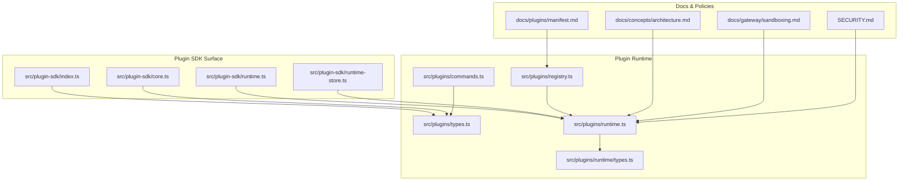
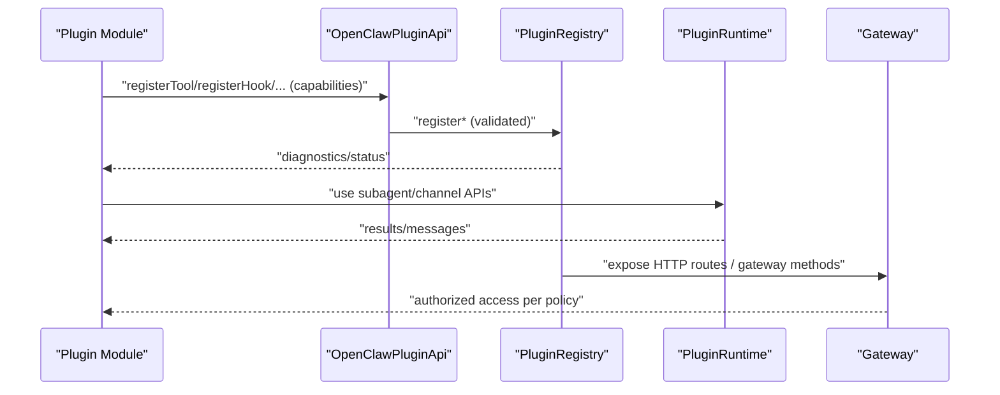
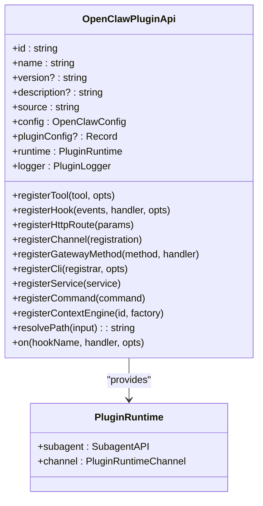
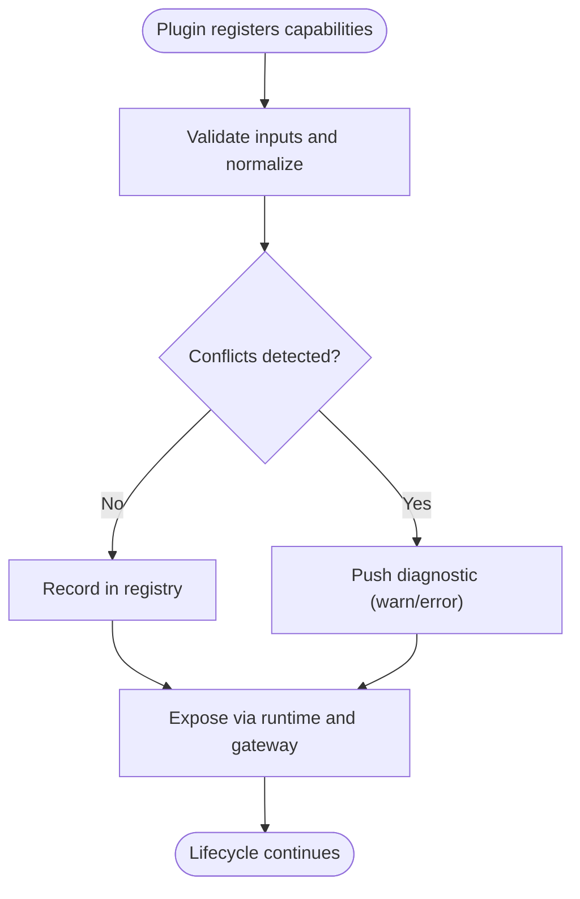
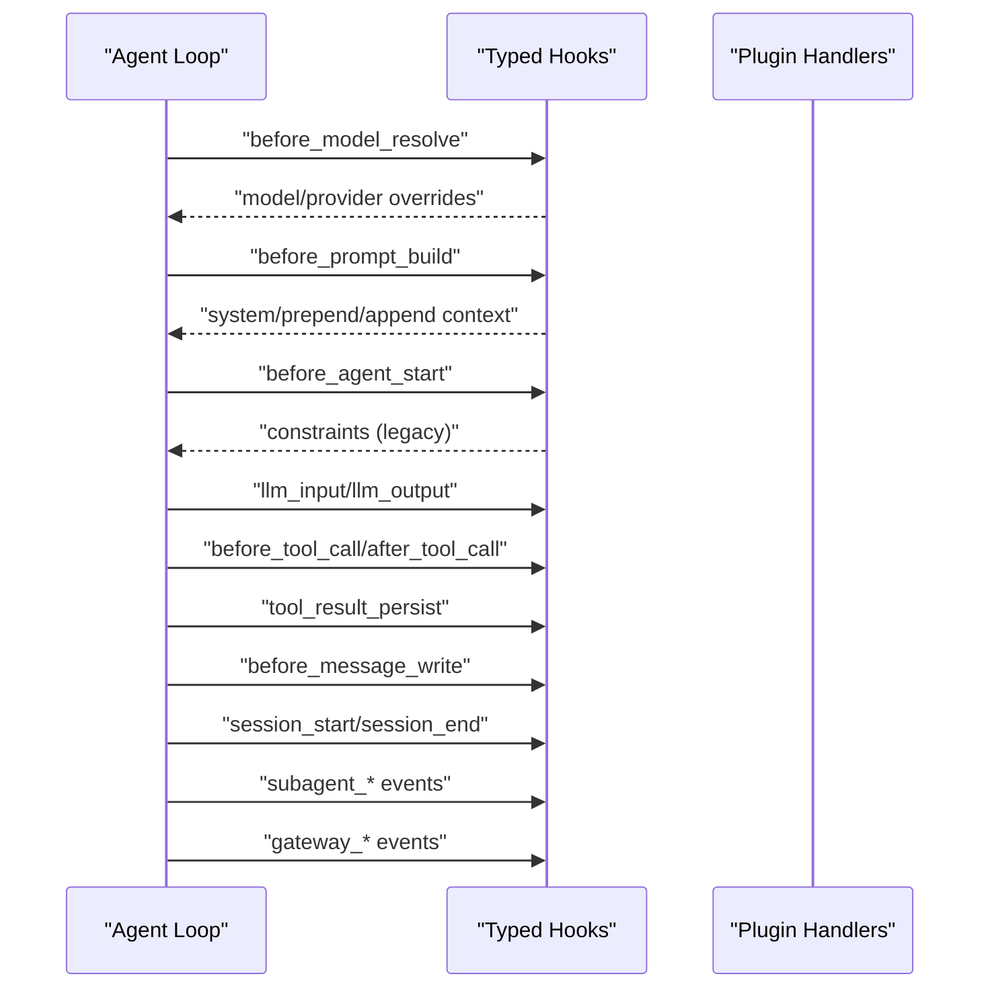
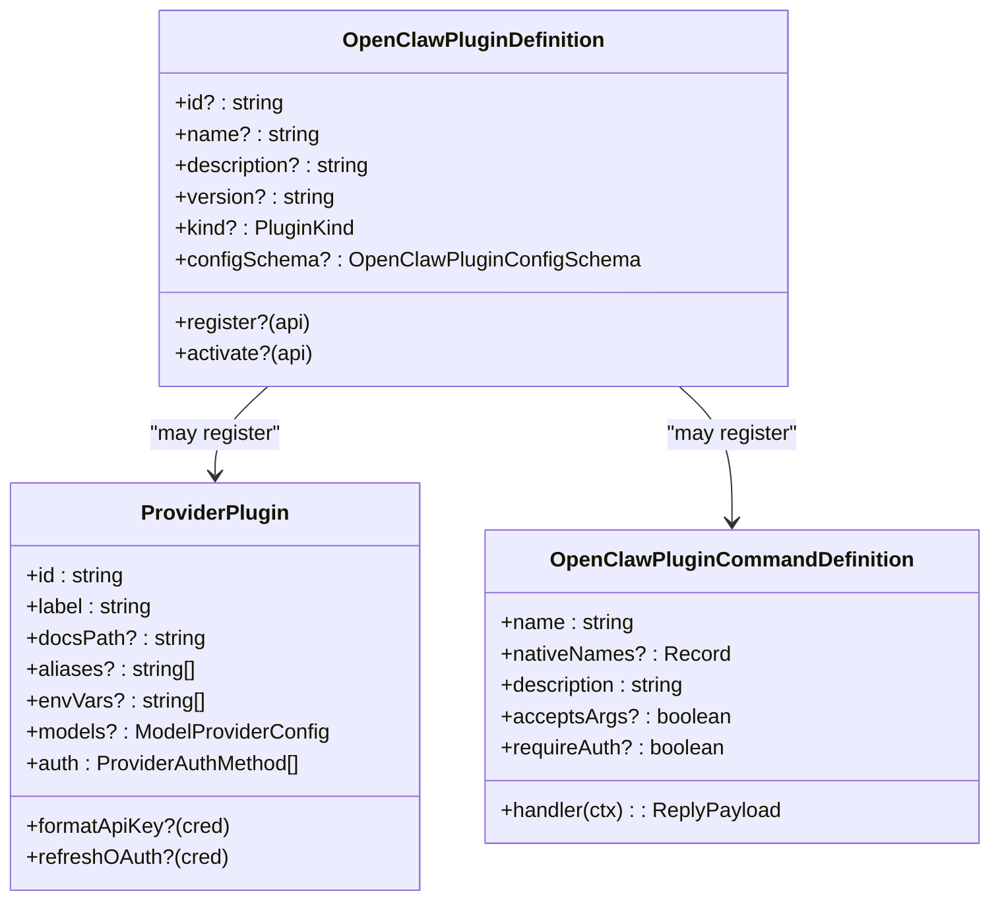
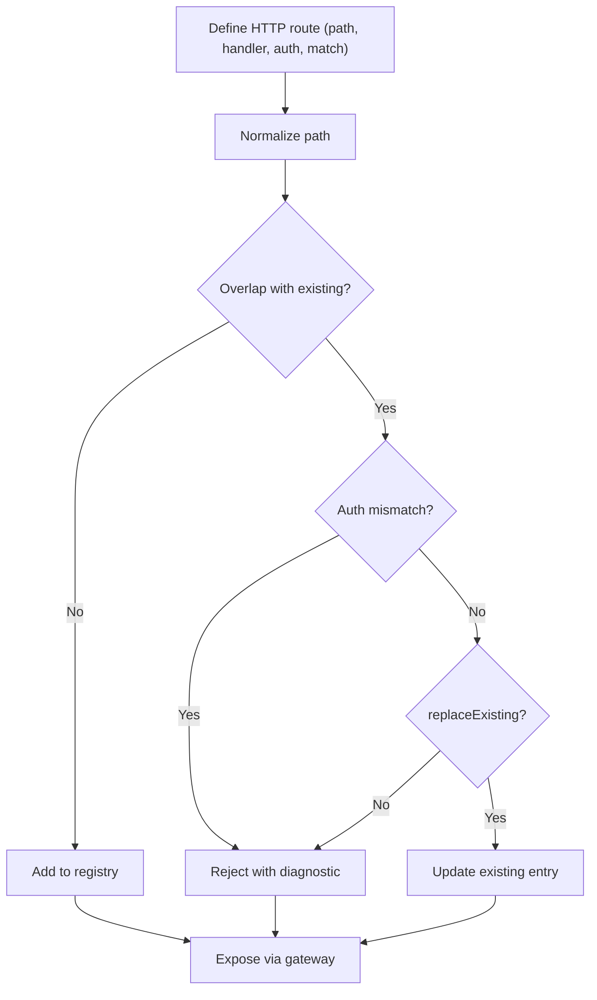
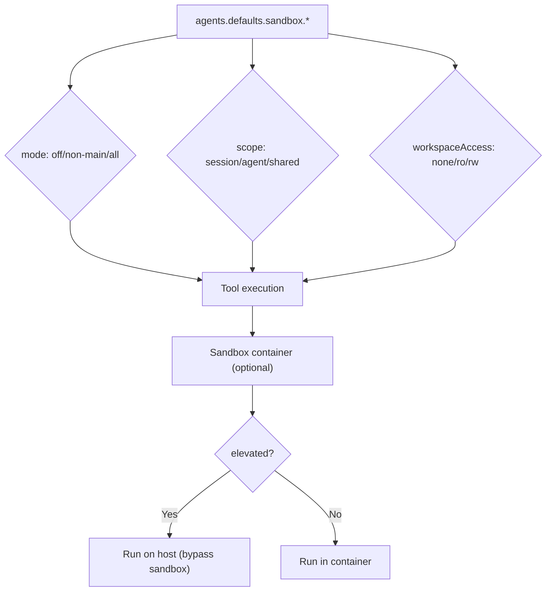
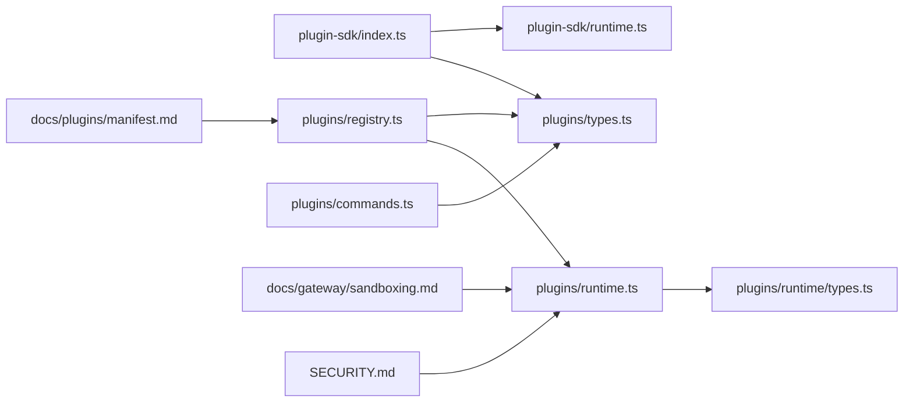

# Plugin Architecture Deep Dive

<cite>
**Referenced Files in This Document**
- [src/plugin-sdk/index.ts](file://src/plugin-sdk/index.ts)
- [src/plugin-sdk/core.ts](file://src/plugin-sdk/core.ts)
- [src/plugin-sdk/runtime.ts](file://src/plugin-sdk/runtime.ts)
- [src/plugin-sdk/runtime-store.ts](file://src/plugin-sdk/runtime-store.ts)
- [src/plugins/types.ts](file://src/plugins/types.ts)
- [src/plugins/runtime/types.ts](file://src/plugins/runtime/types.ts)
- [src/plugins/registry.ts](file://src/plugins/registry.ts)
- [src/plugins/runtime.ts](file://src/plugins/runtime.ts)
- [src/plugins/commands.ts](file://src/plugins/commands.ts)
- [docs/concepts/architecture.md](file://docs/concepts/architecture.md)
- [docs/gateway/sandboxing.md](file://docs/gateway/sandboxing.md)
- [docs/plugins/manifest.md](file://docs/plugins/manifest.md)
- [SECURITY.md](file://SECURITY.md)
</cite>

## Table of Contents
1. [Introduction](#introduction)
2. [Project Structure](#project-structure)
3. [Core Components](#core-components)
4. [Architecture Overview](#architecture-overview)
5. [Detailed Component Analysis](#detailed-component-analysis)
6. [Dependency Analysis](#dependency-analysis)
7. [Performance Considerations](#performance-considerations)
8. [Troubleshooting Guide](#troubleshooting-guide)
9. [Conclusion](#conclusion)
10. [Appendices](#appendices)

## Introduction
This document provides an expert-level deep dive into the OpenClaw plugin architecture. It covers the plugin SDK internals, lifecycle management, inter-plugin communication, advanced plugin types, custom tool development, system extension patterns, security models, sandboxing, privilege escalation controls, advanced debugging and profiling, performance optimization, dependency and version management, upgrade procedures, and marketplace considerations for commercial plugin development.

## Project Structure
OpenClaw organizes plugin-related code primarily under:
- src/plugin-sdk: Public SDK surface for plugin authors
- src/plugins: Core plugin runtime, registry, and orchestration
- docs: Architectural and operational guidance for sandboxing, manifests, and gateway integration

**Diagram sources**
- [src/plugin-sdk/index.ts](file://src/plugin-sdk/index.ts#L1-L812)
- [src/plugin-sdk/core.ts](file://src/plugin-sdk/core.ts#L1-L37)
- [src/plugin-sdk/runtime.ts](file://src/plugin-sdk/runtime.ts#L1-L45)
- [src/plugin-sdk/runtime-store.ts](file://src/plugin-sdk/runtime-store.ts#L1-L26)
- [src/plugins/types.ts](file://src/plugins/types.ts#L1-L893)
- [src/plugins/runtime/types.ts](file://src/plugins/runtime/types.ts#L1-L64)
- [src/plugins/registry.ts](file://src/plugins/registry.ts#L1-L625)
- [src/plugins/runtime.ts](file://src/plugins/runtime.ts#L1-L49)
- [src/plugins/commands.ts](file://src/plugins/commands.ts#L1-L349)
- [docs/concepts/architecture.md](file://docs/concepts/architecture.md#L1-L140)
- [docs/gateway/sandboxing.md](file://docs/gateway/sandboxing.md#L1-L260)
- [docs/plugins/manifest.md](file://docs/plugins/manifest.md#L1-L76)
- [SECURITY.md](file://SECURITY.md#L104-L110)

**Section sources**
- [src/plugin-sdk/index.ts](file://src/plugin-sdk/index.ts#L1-L812)
- [src/plugin-sdk/core.ts](file://src/plugin-sdk/core.ts#L1-L37)
- [src/plugin-sdk/runtime.ts](file://src/plugin-sdk/runtime.ts#L1-L45)
- [src/plugin-sdk/runtime-store.ts](file://src/plugin-sdk/runtime-store.ts#L1-L26)
- [src/plugins/types.ts](file://src/plugins/types.ts#L1-L893)
- [src/plugins/runtime/types.ts](file://src/plugins/runtime/types.ts#L1-L64)
- [src/plugins/registry.ts](file://src/plugins/registry.ts#L1-L625)
- [src/plugins/runtime.ts](file://src/plugins/runtime.ts#L1-L49)
- [src/plugins/commands.ts](file://src/plugins/commands.ts#L1-L349)
- [docs/concepts/architecture.md](file://docs/concepts/architecture.md#L1-L140)
- [docs/gateway/sandboxing.md](file://docs/gateway/sandboxing.md#L1-L260)
- [docs/plugins/manifest.md](file://docs/plugins/manifest.md#L1-L76)
- [SECURITY.md](file://SECURITY.md#L104-L110)

## Core Components
- Plugin SDK surface exports:
  - Channel adapters, tool factories, runtime helpers, HTTP/webhook utilities, and security helpers
  - Provider auth helpers and OAuth flows
  - Status helpers, media payload builders, and outbound reply helpers
- Plugin runtime:
  - Central registry managing tools, hooks, channels, providers, gateway methods, HTTP routes, CLI registrars, services, commands, and diagnostics
  - Active registry state with cache key and versioning for hot reload scenarios
- Plugin types:
  - OpenClawPluginApi, OpenClawPluginDefinition, OpenClawPluginToolContext, hook names, and typed hook handler maps
  - Plugin command system with validation, authorization, and execution pipeline
- Runtime environment:
  - Logger-backed runtime creation and exit/error handling abstraction

**Section sources**
- [src/plugin-sdk/index.ts](file://src/plugin-sdk/index.ts#L1-L812)
- [src/plugins/registry.ts](file://src/plugins/registry.ts#L168-L625)
- [src/plugins/runtime.ts](file://src/plugins/runtime.ts#L1-L49)
- [src/plugins/types.ts](file://src/plugins/types.ts#L248-L306)
- [src/plugins/commands.ts](file://src/plugins/commands.ts#L108-L301)
- [src/plugin-sdk/runtime.ts](file://src/plugin-sdk/runtime.ts#L9-L44)

## Architecture Overview
OpenClaw’s plugin architecture integrates tightly with the Gateway and runtime:
- Plugins register capabilities (tools, hooks, channels, providers, gateway methods, HTTP routes, CLI, services, commands) via OpenClawPluginApi
- The registry validates and consolidates registrations, tracks diagnostics, and exposes typed hooks
- The runtime provides subagent APIs and channel access for plugin execution
- Gateway controls access and security boundaries; sandboxing reduces blast radius for tool execution

**Diagram sources**
- [src/plugins/types.ts](file://src/plugins/types.ts#L263-L306)
- [src/plugins/registry.ts](file://src/plugins/registry.ts#L185-L625)
- [src/plugins/runtime/types.ts](file://src/plugins/runtime/types.ts#L51-L63)
- [docs/concepts/architecture.md](file://docs/concepts/architecture.md#L27-L92)

**Section sources**
- [src/plugins/types.ts](file://src/plugins/types.ts#L263-L306)
- [src/plugins/registry.ts](file://src/plugins/registry.ts#L185-L625)
- [src/plugins/runtime/types.ts](file://src/plugins/runtime/types.ts#L51-L63)
- [docs/concepts/architecture.md](file://docs/concepts/architecture.md#L27-L92)

## Detailed Component Analysis

### Plugin SDK Internals
- SDK index aggregates exports for channel integrations, runtime helpers, security utilities, and HTTP/webhook facilities
- Core SDK re-exports essential types and helpers for plugin authors
- Runtime helpers bridge external loggers to the runtime environment

**Diagram sources**
- [src/plugins/types.ts](file://src/plugins/types.ts#L263-L306)
- [src/plugins/runtime/types.ts](file://src/plugins/runtime/types.ts#L51-L63)

**Section sources**
- [src/plugin-sdk/index.ts](file://src/plugin-sdk/index.ts#L1-L812)
- [src/plugin-sdk/core.ts](file://src/plugin-sdk/core.ts#L1-L37)
- [src/plugin-sdk/runtime.ts](file://src/plugin-sdk/runtime.ts#L9-L44)
- [src/plugins/types.ts](file://src/plugins/types.ts#L263-L306)
- [src/plugins/runtime/types.ts](file://src/plugins/runtime/types.ts#L51-L63)

### Lifecycle Management and Registry
- Registry creation and validation:
  - Tools: factory-based registration with optional names and optionality
  - Hooks: typed and legacy hooks with policy enforcement and diagnostics
  - Channels: channel plugin registration with optional docking
  - Providers: provider plugin registration with uniqueness checks
  - Gateway methods: conflict detection against core and existing handlers
  - HTTP routes: normalization, overlap detection, and auth enforcement
  - CLI, services, commands: registration with validation and diagnostics
- Active registry state:
  - Global state with registry, cache key, and version increments for hot reload and change tracking

**Diagram sources**
- [src/plugins/registry.ts](file://src/plugins/registry.ts#L185-L625)
- [src/plugins/runtime.ts](file://src/plugins/runtime.ts#L25-L49)

**Section sources**
- [src/plugins/registry.ts](file://src/plugins/registry.ts#L185-L625)
- [src/plugins/runtime.ts](file://src/plugins/runtime.ts#L25-L49)

### Inter-Plugin Communication and Typed Hooks
- Typed hook system:
  - Strict hook names with compile-time validation
  - Prompt injection constraints for legacy hooks
  - Priority-based ordering for deterministic execution
- Event-driven orchestration:
  - Before/after agent lifecycle hooks
  - Message lifecycle hooks (received/sending/sent)
  - Tool lifecycle hooks (before/after/call and result persistence)
  - Session and subagent lifecycle hooks
  - Gateway lifecycle hooks

**Diagram sources**
- [src/plugins/types.ts](file://src/plugins/types.ts#L321-L377)
- [src/plugins/types.ts](file://src/plugins/types.ts#L490-L691)

**Section sources**
- [src/plugins/types.ts](file://src/plugins/types.ts#L321-L377)
- [src/plugins/types.ts](file://src/plugins/types.ts#L490-L691)

### Advanced Plugin Types and Custom Tool Development
- Plugin kinds:
  - Memory and context-engine kinds supported via exclusive slots
- Tool development:
  - Factory-based tool registration with optional names
  - Tool context carries session, requester, and sandbox flags
- Provider plugins:
  - OAuth/API key/device code/custom auth flows
  - Model provider configuration and credential refresh
- Commands:
  - Plugin commands bypass agent invocation, processed before built-ins
  - Authorization gating and argument sanitization

**Diagram sources**
- [src/plugins/types.ts](file://src/plugins/types.ts#L248-L257)
- [src/plugins/types.ts](file://src/plugins/types.ts#L122-L132)
- [src/plugins/types.ts](file://src/plugins/types.ts#L186-L203)

**Section sources**
- [src/plugins/types.ts](file://src/plugins/types.ts#L38-L56)
- [src/plugins/types.ts](file://src/plugins/types.ts#L122-L132)
- [src/plugins/types.ts](file://src/plugins/types.ts#L186-L203)

### System Extension Patterns and Gateway Integration
- HTTP routes:
  - Normalized paths, exact/prefix matching, auth scopes (gateway vs plugin)
  - Overlap detection and replacement semantics
- Gateway methods:
  - Registration guarded against core and existing handlers
- CLI integration:
  - Registrar pattern with optional command sets
- Services:
  - Start/stop lifecycle for long-running plugin services

**Diagram sources**
- [src/plugins/registry.ts](file://src/plugins/registry.ts#L318-L400)

**Section sources**
- [src/plugins/registry.ts](file://src/plugins/registry.ts#L318-L400)

### Security Models, Sandboxing, and Privilege Escalation
- Trusted plugin concept:
  - Installed/enabled plugins are part of the trusted computing base for the gateway host
- Sandboxing:
  - Optional Docker-based sandboxing for tool execution and browser
  - Modes: off/non-main/all; scope: session/agent/shared; workspace access: none/ro/rw
  - Browser sandboxing with conservative defaults and optional overrides
  - Bind mounts and setup commands with safety constraints
- Privilege escalation:
  - Elevated exec runs on the host and bypasses sandboxing
  - Tool policy and sandbox configuration interact; elevated is an explicit escape hatch

**Diagram sources**
- [docs/gateway/sandboxing.md](file://docs/gateway/sandboxing.md#L1-L260)
- [SECURITY.md](file://SECURITY.md#L104-L110)

**Section sources**
- [docs/gateway/sandboxing.md](file://docs/gateway/sandboxing.md#L1-L260)
- [SECURITY.md](file://SECURITY.md#L104-L110)

### Plugin Debugging, Profiling, and Optimization
- Logging:
  - Logger-backed runtime bridges external loggers to the runtime environment
  - PluginLogger interface supports debug/info/warn/error
- Diagnostics:
  - Registry pushes diagnostics for warnings/errors during registration
- Profiling and optimization:
  - Use typed hooks to instrument agent lifecycle and tool calls
  - Monitor LLM input/output and tool durations
  - Optimize by reducing unnecessary tool calls and leveraging prompt caching via typed hooks

**Section sources**
- [src/plugin-sdk/runtime.ts](file://src/plugin-sdk/runtime.ts#L9-L44)
- [src/plugins/types.ts](file://src/plugins/types.ts#L22-L27)
- [src/plugins/registry.ts](file://src/plugins/registry.ts#L189-L191)

### Dependency Management, Version Compatibility, and Upgrades
- Manifest-driven validation:
  - Every plugin must ship a manifest with a JSON schema; missing/invalid manifests block configuration validation
- Kind selection:
  - Exclusive plugin kinds selected via plugin slots (memory/context-engine)
- Upgrade procedures:
  - Hot reload via registry version increments and cache key updates
  - Clear plugin commands and re-register during reload cycles

**Section sources**
- [docs/plugins/manifest.md](file://docs/plugins/manifest.md#L1-L76)
- [src/plugins/runtime.ts](file://src/plugins/runtime.ts#L25-L49)
- [src/plugins/commands.ts](file://src/plugins/commands.ts#L160-L173)

### Marketplace Considerations and Commercial Plugin Patterns
- Discovery and validation:
  - Manifest and schema required for all plugins; unknown ids are errors
- Distribution strategies:
  - Bundle manifests and schemas; leverage plugin slots for exclusive kinds
- Commercial patterns:
  - Provider plugins encapsulate auth flows and model configurations
  - Commands and services enable monetizable features without exposing core internals

**Section sources**
- [docs/plugins/manifest.md](file://docs/plugins/manifest.md#L53-L76)
- [src/plugins/types.ts](file://src/plugins/types.ts#L122-L132)
- [src/plugins/types.ts](file://src/plugins/types.ts#L237-L241)

## Dependency Analysis
The plugin system exhibits low coupling and high cohesion:
- SDK exports decouple plugin authors from core implementation details
- Registry centralizes validation and diagnostics
- Runtime provides a stable API surface for subagent and channel operations
- Gateway integrates plugin HTTP routes and methods

**Diagram sources**
- [src/plugin-sdk/index.ts](file://src/plugin-sdk/index.ts#L1-L812)
- [src/plugins/types.ts](file://src/plugins/types.ts#L1-L893)
- [src/plugins/registry.ts](file://src/plugins/registry.ts#L1-L625)
- [src/plugins/runtime.ts](file://src/plugins/runtime.ts#L1-L49)
- [src/plugins/runtime/types.ts](file://src/plugins/runtime/types.ts#L1-L64)
- [src/plugins/commands.ts](file://src/plugins/commands.ts#L1-L349)
- [docs/gateway/sandboxing.md](file://docs/gateway/sandboxing.md#L1-L260)
- [docs/plugins/manifest.md](file://docs/plugins/manifest.md#L1-L76)
- [SECURITY.md](file://SECURITY.md#L104-L110)

**Section sources**
- [src/plugin-sdk/index.ts](file://src/plugin-sdk/index.ts#L1-L812)
- [src/plugins/registry.ts](file://src/plugins/registry.ts#L1-L625)
- [src/plugins/runtime.ts](file://src/plugins/runtime.ts#L1-L49)
- [src/plugins/runtime/types.ts](file://src/plugins/runtime/types.ts#L1-L64)
- [src/plugins/commands.ts](file://src/plugins/commands.ts#L1-L349)
- [docs/gateway/sandboxing.md](file://docs/gateway/sandboxing.md#L1-L260)
- [docs/plugins/manifest.md](file://docs/plugins/manifest.md#L1-L76)
- [SECURITY.md](file://SECURITY.md#L104-L110)

## Performance Considerations
- Minimize tool calls by leveraging typed hooks for prompt augmentation and caching
- Prefer read-only workspace access when possible to reduce I/O overhead
- Use appropriate sandbox scope to balance isolation and performance
- Instrument tool call durations and LLM input/output metrics for targeted optimization

## Troubleshooting Guide
- Registry diagnostics:
  - Warnings and errors for missing names, invalid auth, overlaps, and duplicates
- Command execution:
  - Unauthorized senders receive a safe generic failure response
  - Argument sanitization prevents injection; handlers should still validate inputs
- Runtime environment:
  - Logger-backed runtime ensures consistent logging and graceful exits

**Section sources**
- [src/plugins/registry.ts](file://src/plugins/registry.ts#L232-L380)
- [src/plugins/commands.ts](file://src/plugins/commands.ts#L256-L301)
- [src/plugin-sdk/runtime.ts](file://src/plugin-sdk/runtime.ts#L9-L44)

## Conclusion
OpenClaw’s plugin architecture balances flexibility and safety through a robust SDK, centralized registry, typed hooks, and strong security boundaries enforced by sandboxing and the trusted plugin model. Expert plugin developers can extend the system via tools, commands, providers, and services while leveraging lifecycle hooks, HTTP/webhook integration, and comprehensive diagnostics for reliable operation.

## Appendices
- Gateway architecture and client flows for understanding transport and security contexts
- Manifest requirements for strict configuration validation and discovery

**Section sources**
- [docs/concepts/architecture.md](file://docs/concepts/architecture.md#L1-L140)
- [docs/plugins/manifest.md](file://docs/plugins/manifest.md#L1-L76)