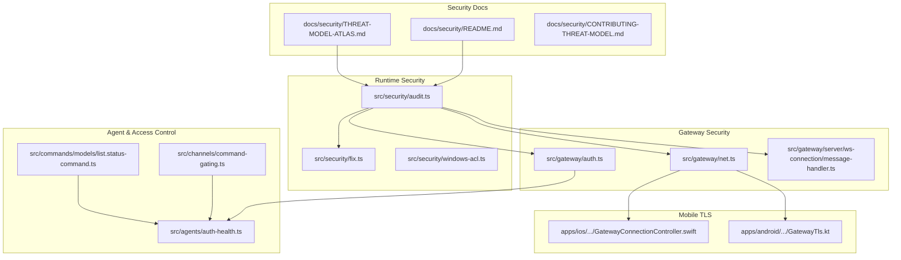
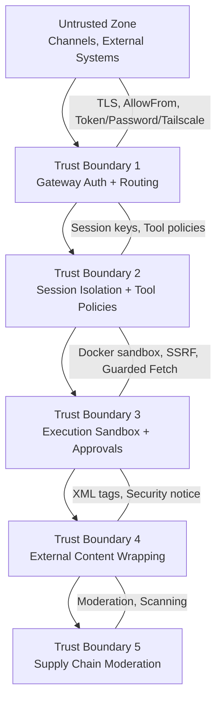
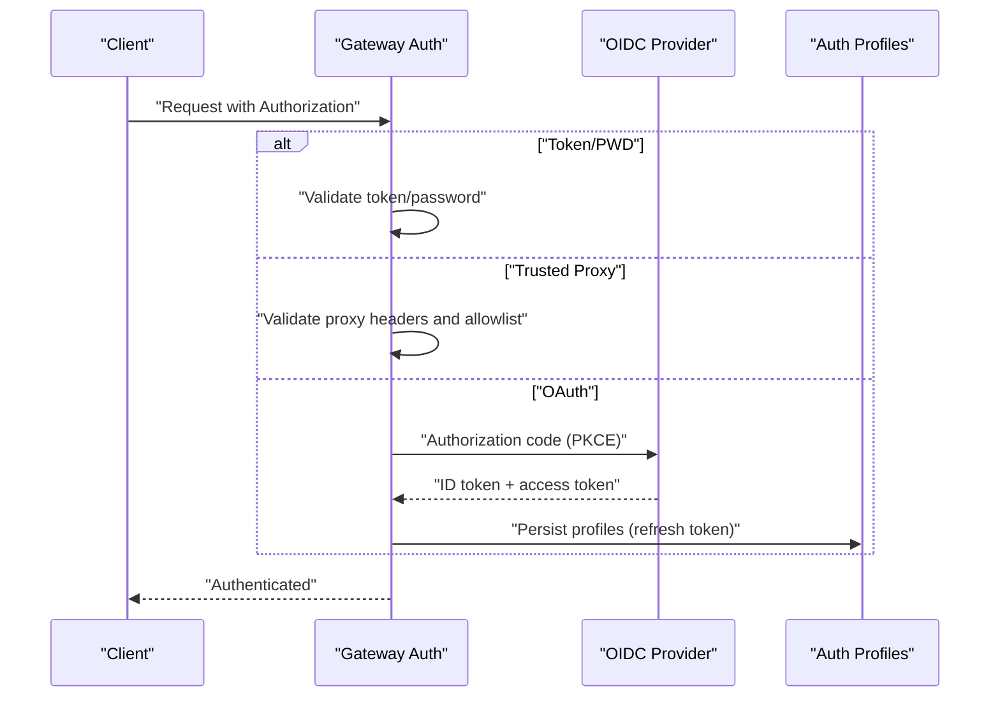
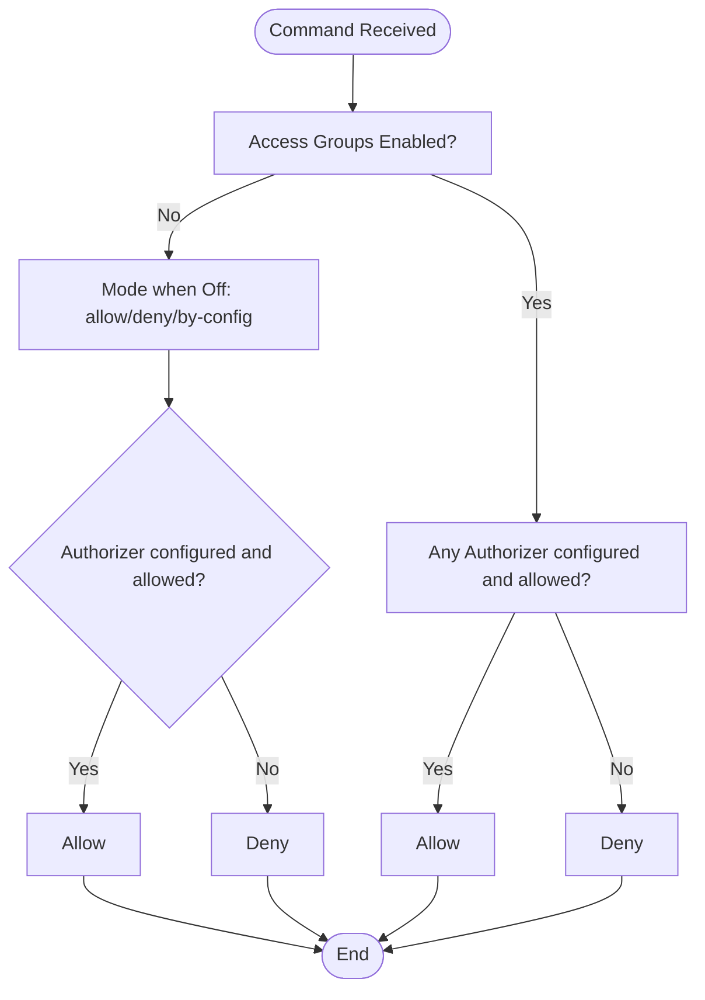
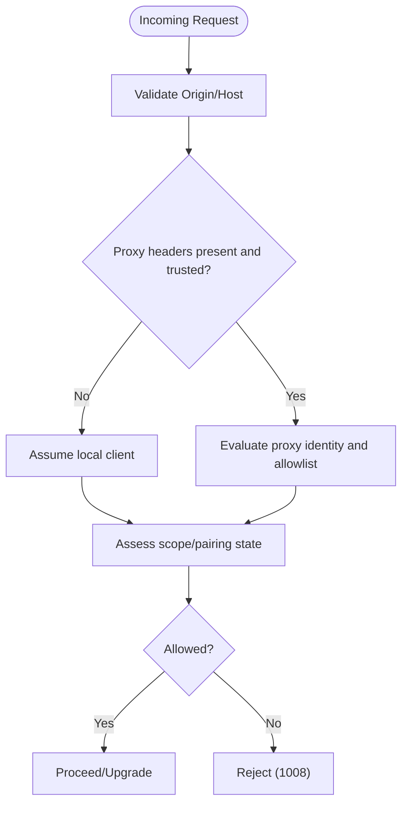
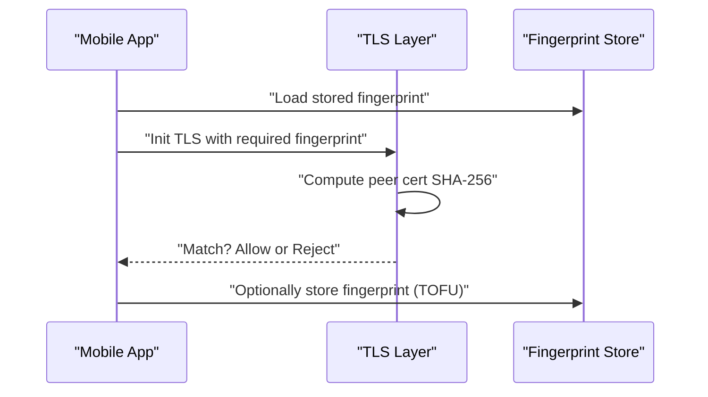
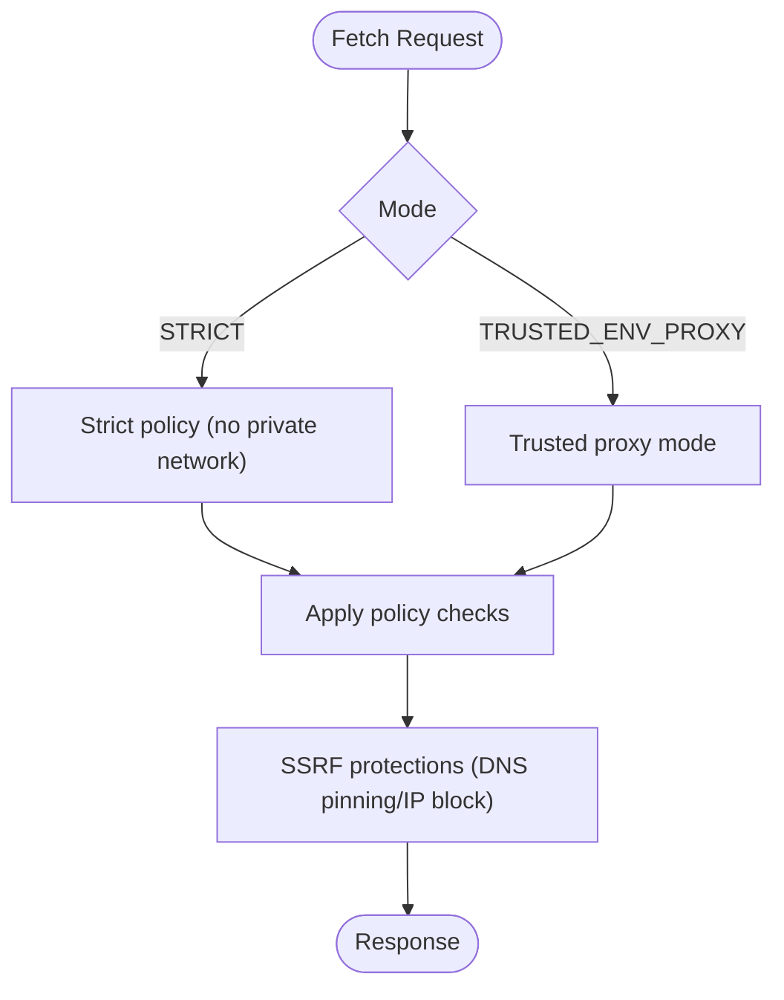
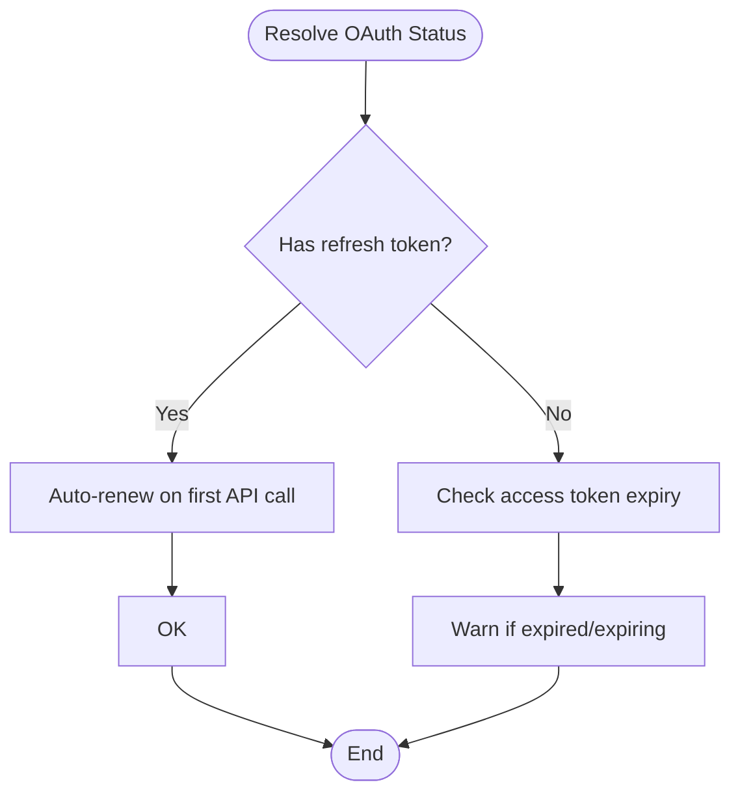
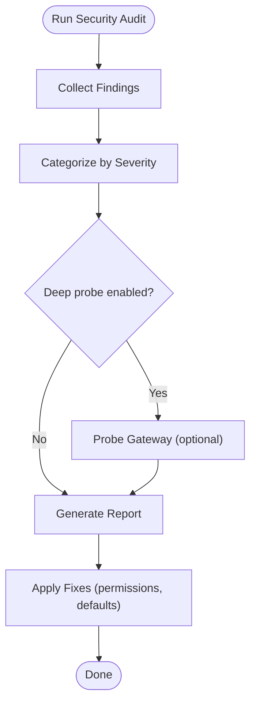
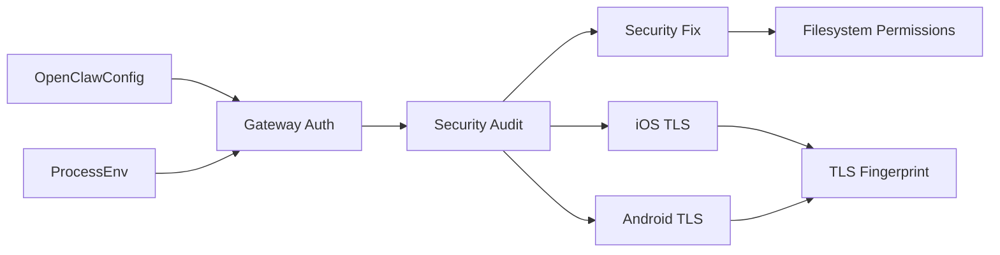

# Security Hardening

<cite>
**Referenced Files in This Document**
- [SECURITY.md](file://SECURITY.md)
- [docs/security/README.md](file://docs/security/README.md)
- [docs/security/THREAT-MODEL-ATLAS.md](file://docs/security/THREAT-MODEL-ATLAS.md)
- [docs/security/CONTRIBUTING-THREAT-MODEL.md](file://docs/security/CONTRIBUTING-THREAT-MODEL.md)
- [src/security/audit.ts](file://src/security/audit.ts)
- [src/security/fix.ts](file://src/security/fix.ts)
- [src/security/windows-acl.ts](file://src/security/windows-acl.ts)
- [src/gateway/auth.ts](file://src/gateway/auth.ts)
- [src/gateway/net.ts](file://src/gateway/net.ts)
- [src/gateway/server/ws-connection/message-handler.ts](file://src/gateway/server/ws-connection/message-handler.ts)
- [apps/ios/Sources/Gateway/GatewayConnectionController.swift](file://apps/ios/Sources/Gateway/GatewayConnectionController.swift)
- [apps/android/app/src/main/java/ai/openclaw/app/gateway/GatewayTls.kt](file://apps/android/app/src/main/java/ai/openclaw/app/gateway/GatewayTls.kt)
- [src/agents/auth-health.ts](file://src/agents/auth-health.ts)
- [src/commands/models/list.status-command.ts](file://src/commands/models/list.status-command.ts)
- [src/channels/command-gating.ts](file://src/channels/command-gating.ts)
- [src/agents/tools/web-guarded-fetch.test.ts](file://src/agents/tools/web-guarded-fetch.test.ts)
- [docs-zh/网关系统/认证与安全.md](file://docs-zh/网关系统/认证与安全.md)
- [docs-zh/部署和运维/安全加固.md](file://docs-zh/部署和运维/安全加固.md)
- [docs-zh/核心概念/安全模型.md](file://docs-zh/核心概念/安全模型.md)
- [docs-zh/AI代理平台/安全策略与权限控制.md](file://docs-zh/AI代理平台/安全策略与权限控制.md)
</cite>

## Table of Contents
1. [Introduction](#introduction)
2. [Project Structure](#project-structure)
3. [Core Components](#core-components)
4. [Architecture Overview](#architecture-overview)
5. [Detailed Component Analysis](#detailed-component-analysis)
6. [Dependency Analysis](#dependency-analysis)
7. [Performance Considerations](#performance-considerations)
8. [Troubleshooting Guide](#troubleshooting-guide)
9. [Conclusion](#conclusion)
10. [Appendices](#appendices)

## Introduction
This document provides enterprise-grade security hardening guidance for the OpenClaw platform. It consolidates authentication and authorization mechanisms, identity provider integration, policy enforcement, access control matrices, encryption and TLS strategies, threat detection and incident response, auditing and compliance, and zero-trust network and endpoint protection. The content is derived from the repository’s security documentation, threat model, and implementation code.

## Project Structure
Security-related capabilities are distributed across:
- Security policy and threat modeling documentation
- Security audit and remediation tooling
- Gateway authentication and transport security
- Platform-specific TLS enforcement (iOS/Android)
- Agent credential health and rotation
- Command gating and access control
- Secure fetch policies and SSRF protections

**Diagram sources**
- [docs/security/README.md](file://docs/security/README.md#L1-L18)
- [docs/security/THREAT-MODEL-ATLAS.md](file://docs/security/THREAT-MODEL-ATLAS.md#L1-L200)
- [src/security/audit.ts](file://src/security/audit.ts#L1-L120)
- [src/security/fix.ts](file://src/security/fix.ts#L1-L120)
- [src/gateway/auth.ts](file://src/gateway/auth.ts#L331-L372)
- [src/gateway/net.ts](file://src/gateway/net.ts#L156-L185)
- [src/gateway/server/ws-connection/message-handler.ts](file://src/gateway/server/ws-connection/message-handler.ts#L497-L532)
- [apps/ios/Sources/Gateway/GatewayConnectionController.swift](file://apps/ios/Sources/Gateway/GatewayConnectionController.swift#L496-L523)
- [apps/android/app/src/main/java/ai/openclaw/app/gateway/GatewayTls.kt](file://apps/android/app/src/main/java/ai/openclaw/app/gateway/GatewayTls.kt#L35-L66)
- [src/agents/auth-health.ts](file://src/agents/auth-health.ts#L165-L197)
- [src/channels/command-gating.ts](file://src/channels/command-gating.ts#L8-L29)
- [src/commands/models/list.status-command.ts](file://src/commands/models/list.status-command.ts#L259-L278)

**Section sources**
- [docs/security/README.md](file://docs/security/README.md#L1-L18)
- [docs/security/THREAT-MODEL-ATLAS.md](file://docs/security/THREAT-MODEL-ATLAS.md#L1-L200)
- [src/security/audit.ts](file://src/security/audit.ts#L1-L120)

## Core Components
- Identity and Access Management
  - Shared secret authentication (token/password) and trusted-proxy mode
  - OAuth with refresh and per-profile credential storage
  - Access groups and authorizers for channel-based control
- Transport and Endpoint Security
  - Loopback-only default binding, TLSv1.3 minimum, and strict certificate pinning on mobile clients
  - Origin allowlisting and strict Host header handling for non-loopback deployments
- Policy Enforcement and Privilege Management
  - Command gating based on access groups and authorizers
  - Tool policy and sandboxing to constrain execution
- Encryption and Secrets
  - Secret resolution from env/file/exec with auditing and redaction
  - TLS fingerprint verification and TOFU handling on mobile
- Threat Detection and Incident Response
  - Security audit tool with severity-based findings and optional deep gateway probing
  - Automated remediation actions for permissions and defaults
- Zero-Trust and Network Controls
  - Strict SSRF protections and guarded fetch modes
  - Tailnet exposure modes and funnel vs serve distinctions

**Section sources**
- [src/gateway/auth.ts](file://src/gateway/auth.ts#L331-L372)
- [src/gateway/net.ts](file://src/gateway/net.ts#L156-L185)
- [src/gateway/server/ws-connection/message-handler.ts](file://src/gateway/server/ws-connection/message-handler.ts#L497-L532)
- [apps/ios/Sources/Gateway/GatewayConnectionController.swift](file://apps/ios/Sources/Gateway/GatewayConnectionController.swift#L496-L523)
- [apps/android/app/src/main/java/ai/openclaw/app/gateway/GatewayTls.kt](file://apps/android/app/src/main/java/ai/openclaw/app/gateway/GatewayTls.kt#L35-L66)
- [src/channels/command-gating.ts](file://src/channels/command-gating.ts#L8-L29)
- [src/agents/auth-health.ts](file://src/agents/auth-health.ts#L165-L197)
- [src/security/audit.ts](file://src/security/audit.ts#L339-L687)
- [src/security/fix.ts](file://src/security/fix.ts#L387-L478)

## Architecture Overview
The security architecture follows a layered zero-trust model:
- Untrusted zone: Channels and external systems
- Trust boundary 1: Gateway authentication and routing
- Trust boundary 2: Session isolation and tool policies
- Trust boundary 3: Execution sandbox and approvals
- Trust boundary 4: External content wrapping and security notices
- Trust boundary 5: Supply chain moderation and scanning

**Diagram sources**
- [docs/security/THREAT-MODEL-ATLAS.md](file://docs/security/THREAT-MODEL-ATLAS.md#L56-L135)

**Section sources**
- [docs/security/THREAT-MODEL-ATLAS.md](file://docs/security/THREAT-MODEL-ATLAS.md#L56-L135)

## Detailed Component Analysis

### Authentication and Identity Provider Integration
- Shared secret authentication supports tokens and passwords with rate limiting recommendations for non-loopback bindings.
- Trusted-proxy mode delegates authentication to upstream reverse proxies (e.g., Pomerium/Caddy/nginx/OAuth2-Proxy/Traefik) with strict proxy allowlists and user header configuration.
- OAuth flows include PKCE and refresh token handling, with per-profile credential storage and automatic renewal on first API call when a refresh token exists.

**Diagram sources**
- [src/gateway/auth.ts](file://src/gateway/auth.ts#L331-L372)
- [src/agents/auth-health.ts](file://src/agents/auth-health.ts#L165-L197)
- [docs-zh/网관系统/认证与安全.md](file://docs-zh/网关系统/认证与安全.md#L247-L331)

**Section sources**
- [src/gateway/auth.ts](file://src/gateway/auth.ts#L331-L372)
- [src/agents/auth-health.ts](file://src/agents/auth-health.ts#L165-L197)
- [docs-zh/网关系统/认证与安全.md](file://docs-zh/网关系统/认证与安全.md#L247-L331)

### Access Control, Authorization, and Privilege Management
- Access groups and authorizers gate channel commands; when access groups are enabled, absence of a configured authorizer denies execution. Modes “allow/deny/by-config” apply when access groups are disabled.
- Control commands are blocked when text commands are allowed but no authorizer permits the operation.

**Diagram sources**
- [src/channels/command-gating.ts](file://src/channels/command-gating.ts#L8-L29)

**Section sources**
- [src/channels/command-gating.ts](file://src/channels/command-gating.ts#L8-L29)
- [docs-zh/AI代理平台/安全策略与权限控制.md](file://docs-zh/AI代理平台/安全策略与权限控制.md#L134-L167)

### Transport Security, TLS, and Endpoint Protection
- Default loopback binding for gateway; non-loopback requires explicit allowed origins and strict origin checks. Host header fallback is dangerous and discouraged.
- TLS minimum version is TLSv1.3; mobile clients enforce certificate fingerprint verification and optional TOFU on first connection.
- WebSocket URL security restricts plaintext ws:// to loopback; private/public ws:// is disallowed by default.

**Diagram sources**
- [src/gateway/server/ws-connection/message-handler.ts](file://src/gateway/server/ws-connection/message-handler.ts#L497-L532)
- [src/gateway/net.ts](file://src/gateway/net.ts#L156-L185)

**Section sources**
- [src/gateway/net.ts](file://src/gateway/net.ts#L156-L185)
- [src/gateway/server/ws-connection/message-handler.ts](file://src/gateway/server/ws-connection/message-handler.ts#L497-L532)
- [docs-zh/网关系统/认证与安全.md](file://docs-zh/网关系统/认证与安全.md#L302-L331)

### Mobile TLS Pinning and Certificate Validation
- iOS enforces required TLS with stored fingerprint loading and a dedicated probe for fingerprint retrieval.
- Android implements a custom X509TrustManager that validates server certificates against an expected SHA-256 fingerprint, with optional TOFU behavior.

**Diagram sources**
- [apps/ios/Sources/Gateway/GatewayConnectionController.swift](file://apps/ios/Sources/Gateway/GatewayConnectionController.swift#L496-L523)
- [apps/android/app/src/main/java/ai/openclaw/app/gateway/GatewayTls.kt](file://apps/android/app/src/main/java/ai/openclaw/app/gateway/GatewayTls.kt#L35-L66)

**Section sources**
- [apps/ios/Sources/Gateway/GatewayConnectionController.swift](file://apps/ios/Sources/Gateway/GatewayConnectionController.swift#L496-L523)
- [apps/android/app/src/main/java/ai/openclaw/app/gateway/GatewayTls.kt](file://apps/android/app/src/main/java/ai/openclaw/app/gateway/GatewayTls.kt#L35-L66)

### Secure Fetch, SSRF Protection, and External Content
- Guarded fetch modes enforce strict policies for private network access and RFC2544 benchmark ranges, with a trusted environment proxy mode for controlled access.
- External content wrapping uses XML tags and security notices to mitigate injection.

**Diagram sources**
- [src/agents/tools/web-guarded-fetch.test.ts](file://src/agents/tools/web-guarded-fetch.test.ts#L36-L68)

**Section sources**
- [src/agents/tools/web-guarded-fetch.test.ts](file://src/agents/tools/web-guarded-fetch.test.ts#L36-L68)
- [docs/security/THREAT-MODEL-ATLAS.md](file://docs/security/THREAT-MODEL-ATLAS.md#L104-L110)

### Credential Health, Rotation, and Secret Management
- OAuth credential health computes status considering refresh tokens and warns only when access tokens are expiring without refresh capability.
- Providers with OAuth/profiles are summarized for health checks and rotation readiness.

**Diagram sources**
- [src/agents/auth-health.ts](file://src/agents/auth-health.ts#L165-L197)
- [src/commands/models/list.status-command.ts](file://src/commands/models/list.status-command.ts#L259-L278)

**Section sources**
- [src/agents/auth-health.ts](file://src/agents/auth-health.ts#L165-L197)
- [src/commands/models/list.status-command.ts](file://src/commands/models/list.status-command.ts#L259-L278)
- [docs-zh/网关系统/认证与安全.md](file://docs-zh/网关系统/认证与安全.md#L323-L331)

### Security Auditing, Compliance, and Remediation
- Security audit collects findings across gateway configuration, filesystem permissions, browser control, channel security, and dangerous flags. Severity is categorized and summarized.
- Remediation tool applies fixes for permissions, defaults, and channel policies, with actions logged and errors surfaced.

**Diagram sources**
- [src/security/audit.ts](file://src/security/audit.ts#L1-L120)
- [src/security/fix.ts](file://src/security/fix.ts#L387-L478)

**Section sources**
- [src/security/audit.ts](file://src/security/audit.ts#L339-L687)
- [src/security/fix.ts](file://src/security/fix.ts#L387-L478)
- [docs-zh/部署和运维/安全加固.md](file://docs-zh/部署和运维/安全加固.md#L92-L289)

## Dependency Analysis
- Gateway authentication depends on environment variables and configuration for token/password and trusted proxy settings.
- TLS modules are consumed by both gateway and mobile clients; iOS and Android implement strict fingerprint verification.
- Security audit spans configuration, filesystem, gateway, browser control, channel security, and execution environments.
- Windows ACL classification influences remediation actions for file permissions.

**Diagram sources**
- [src/gateway/auth.ts](file://src/gateway/auth.ts#L331-L372)
- [src/security/audit.ts](file://src/security/audit.ts#L1-L120)
- [src/security/fix.ts](file://src/security/fix.ts#L387-L478)
- [apps/ios/Sources/Gateway/GatewayConnectionController.swift](file://apps/ios/Sources/Gateway/GatewayConnectionController.swift#L496-L523)
- [apps/android/app/src/main/java/ai/openclaw/app/gateway/GatewayTls.kt](file://apps/android/app/src/main/java/ai/openclaw/app/gateway/GatewayTls.kt#L35-L66)

**Section sources**
- [src/gateway/auth.ts](file://src/gateway/auth.ts#L331-L372)
- [src/security/audit.ts](file://src/security/audit.ts#L1-L120)
- [src/security/fix.ts](file://src/security/fix.ts#L387-L478)
- [src/security/windows-acl.ts](file://src/security/windows-acl.ts#L82-L119)

## Performance Considerations
- Authentication rate limiting should be configured for non-loopback bindings to mitigate brute-force attempts.
- Strict TLS and fingerprint verification add minimal overhead compared to the security benefits.
- Guarded fetch modes and SSRF protections prevent costly resource exhaustion and data leakage.

[No sources needed since this section provides general guidance]

## Troubleshooting Guide
- Gateway binds beyond loopback without auth: set token/password or bind to loopback.
- Reverse proxy headers not trusted: configure trusted proxies to prevent spoofing.
- Wildcard allowed origins or Host-header origin fallback: replace with explicit origins or disable fallback.
- Dangerous config flags enabled: disable flags or restrict deployment scope.
- Browser control without auth: set gateway auth token/password to protect endpoints.
- TLS fingerprint mismatches on mobile: ensure stored fingerprints match or enable TOFU carefully.

**Section sources**
- [src/security/audit.ts](file://src/security/audit.ts#L428-L524)
- [src/security/audit.ts](file://src/security/audit.ts#L557-L577)
- [apps/ios/Sources/Gateway/GatewayConnectionController.swift](file://apps/ios/Sources/Gateway/GatewayConnectionController.swift#L496-L523)
- [apps/android/app/src/main/java/ai/openclaw/app/gateway/GatewayTls.kt](file://apps/android/app/src/main/java/ai/openclaw/app/gateway/GatewayTls.kt#L35-L66)

## Conclusion
OpenClaw’s security posture is built around a zero-trust architecture with strict authentication, robust transport security, granular access control, and comprehensive auditing. By enforcing TLS pinning, origin allowlists, command gating, and guarded fetch policies, the platform mitigates common attack vectors while providing tooling for continuous security assessment and remediation.

[No sources needed since this section summarizes without analyzing specific files]

## Appendices

### Threat Modeling and Risk Matrix
- MITRE ATLAS-based threat model documents tactics, techniques, and residual risks across reconnaissance, initial access, execution, and impact categories.
- Recommendations include response timing randomization, rate limiting, and output filtering.

**Section sources**
- [docs/security/THREAT-MODEL-ATLAS.md](file://docs/security/THREAT-MODEL-ATLAS.md#L140-L435)
- [docs/security/CONTRIBUTING-THREAT-MODEL.md](file://docs/security/CONTRIBUTING-THREAT-MODEL.md#L30-L64)

### Security Policy and Reporting
- Responsible disclosure process, triage criteria, and common false-positive patterns are documented to streamline vulnerability reports aligned with trust boundaries.

**Section sources**
- [SECURITY.md](file://SECURITY.md#L33-L131)