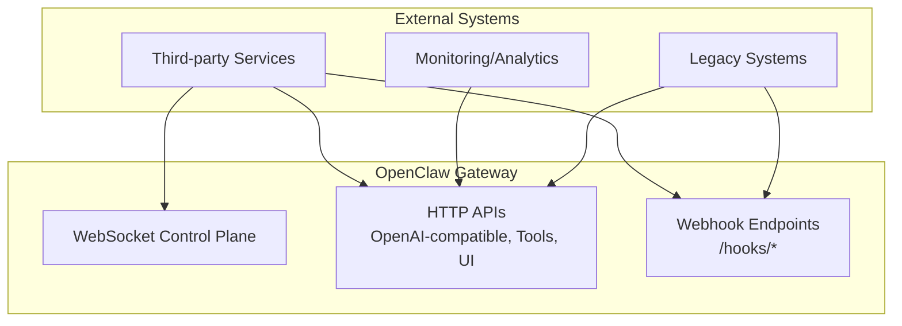
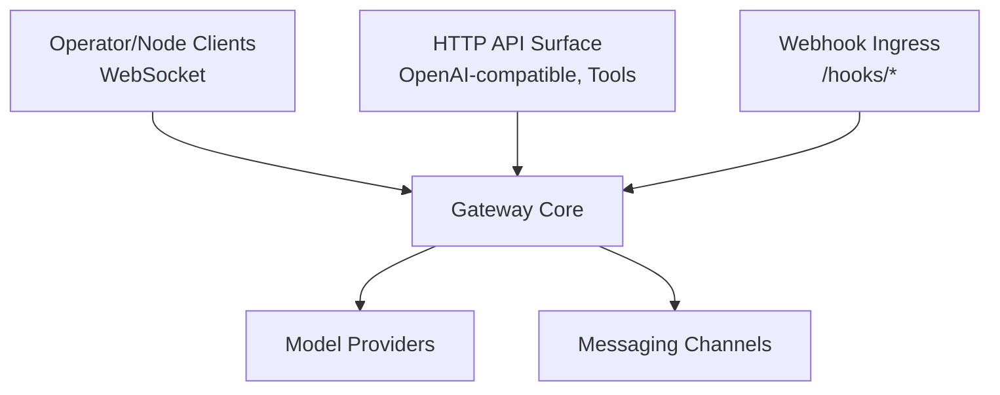
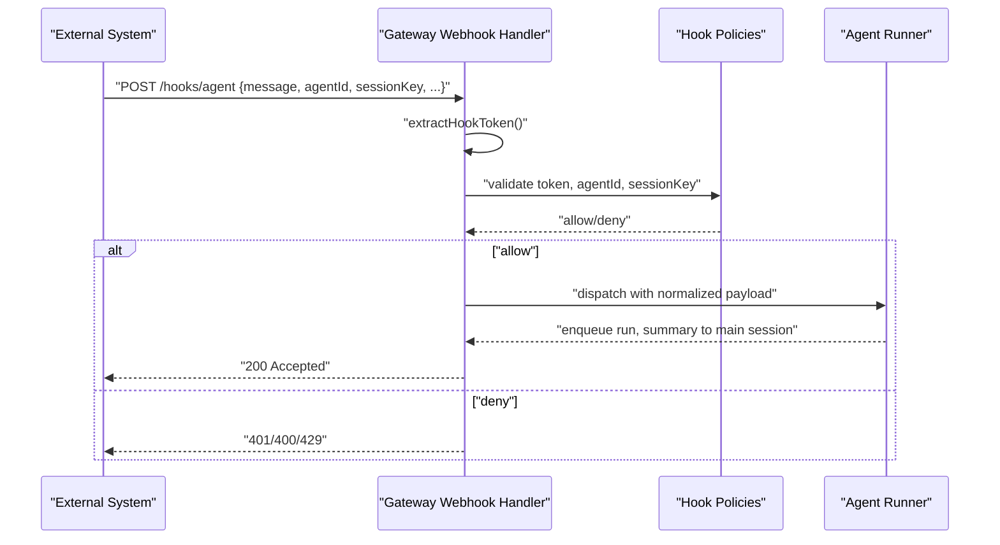
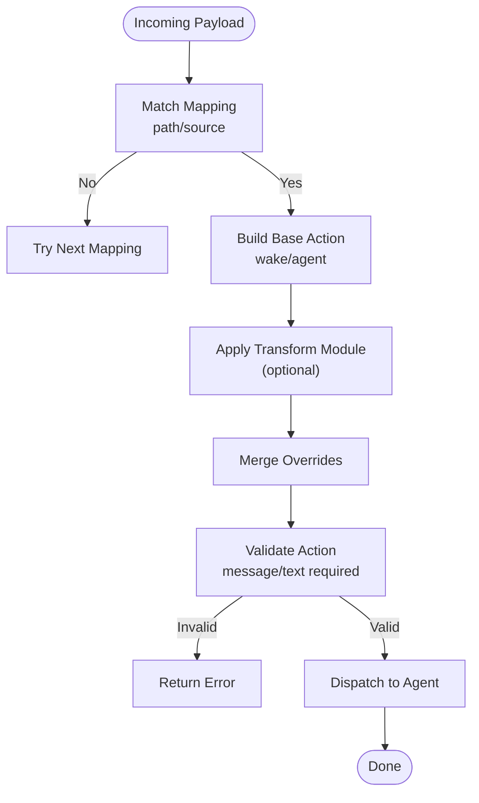
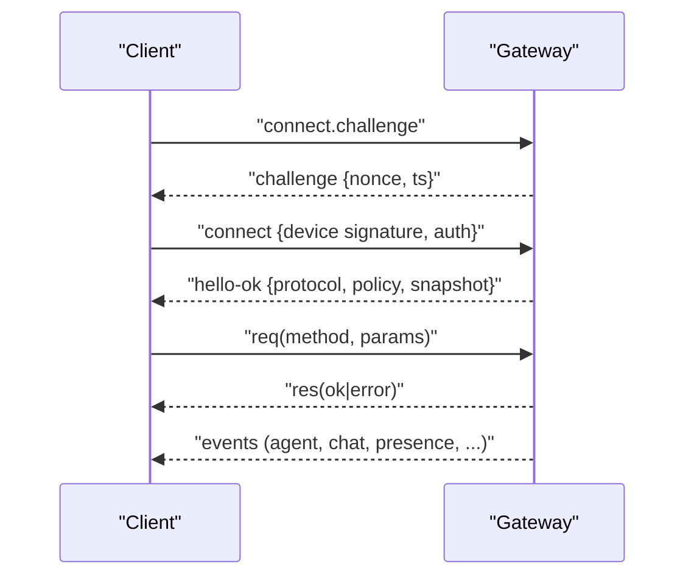
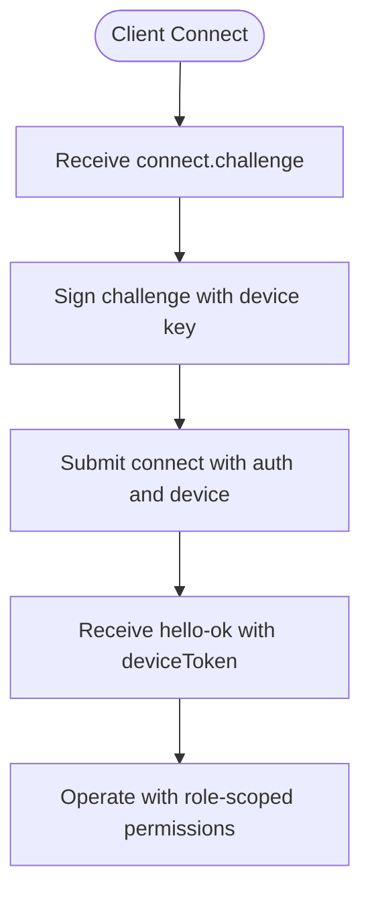
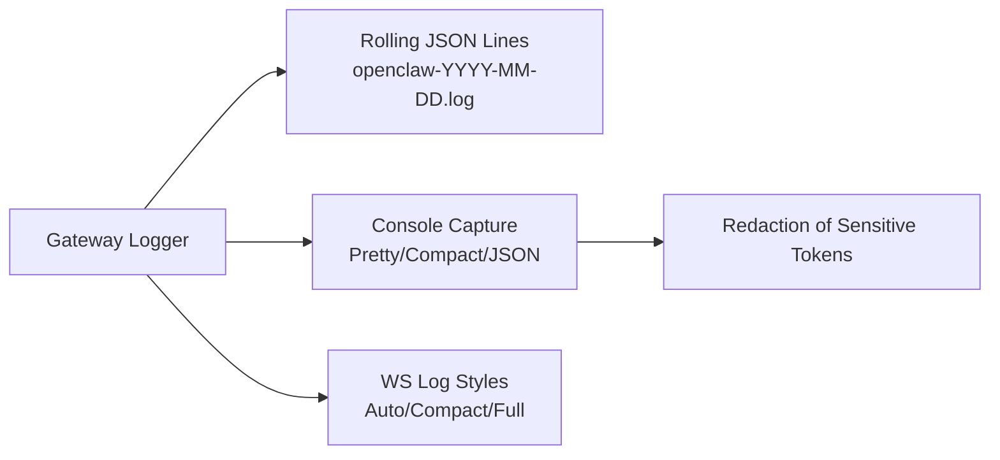
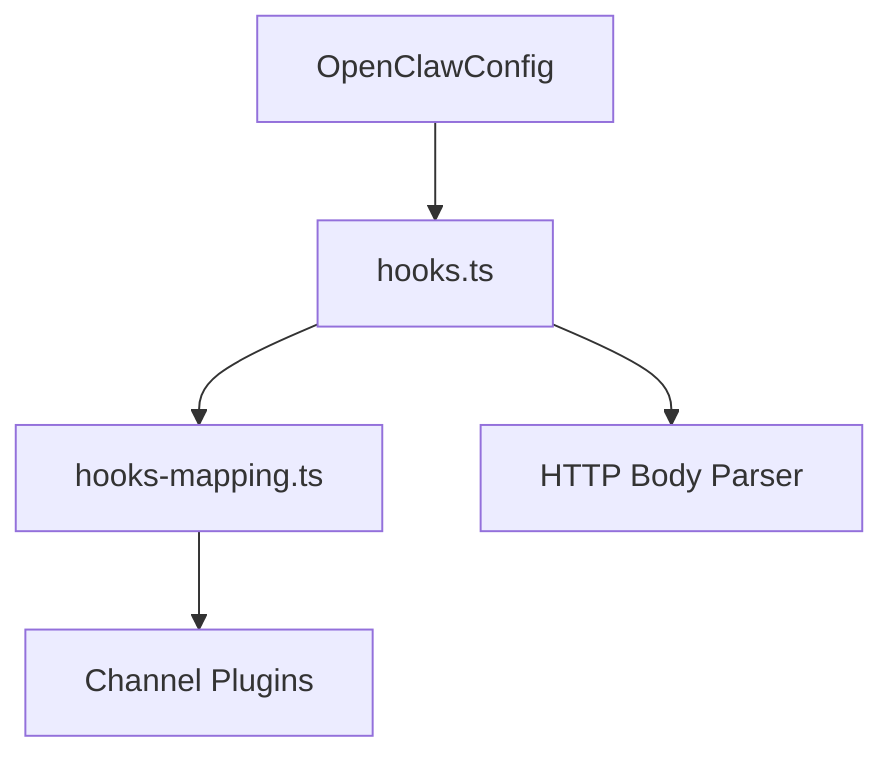

# System Integration

<cite>
**Referenced Files in This Document**
- [docs/gateway/index.md](file://docs/gateway/index.md)
- [docs/gateway/protocol.md](file://docs/gateway/protocol.md)
- [docs/gateway/authentication.md](file://docs/gateway/authentication.md)
- [docs/gateway/logging.md](file://docs/gateway/logging.md)
- [docs/gateway/troubleshooting.md](file://docs/gateway/troubleshooting.md)
- [docs/automation/webhook.md](file://docs/automation/webhook.md)
- [src/gateway/hooks.ts](file://src/gateway/hooks.ts)
- [src/gateway/hooks-mapping.ts](file://src/gateway/hooks-mapping.ts)
- [src/gateway/hooks-test-helpers.ts](file://src/gateway/hooks-test-helpers.ts)
- [docs/help/testing.md](file://docs/help/testing.md)
</cite>

## Table of Contents
1. [Introduction](#introduction)
2. [Project Structure](#project-structure)
3. [Core Components](#core-components)
4. [Architecture Overview](#architecture-overview)
5. [Detailed Component Analysis](#detailed-component-analysis)
6. [Dependency Analysis](#dependency-analysis)
7. [Performance Considerations](#performance-considerations)
8. [Troubleshooting Guide](#troubleshooting-guide)
9. [Conclusion](#conclusion)
10. [Appendices](#appendices)

## Introduction
This document provides comprehensive system integration guidance for OpenClaw, focusing on advanced integration patterns with external systems. It covers API gateway configurations, webhook implementations, and real-time communication protocols. It also explains integration with existing infrastructure, legacy systems, and third-party services; details authentication bridging, authorization delegation, and trust boundary management; and outlines integration patterns for monitoring systems, logging pipelines, and analytics platforms. Finally, it addresses custom protocol implementations, message transformation, data synchronization strategies, integration testing, mock implementations, and integration lifecycle management.

## Project Structure
OpenClaw exposes a unified gateway that serves multiple surfaces:
- WebSocket control plane for operators and nodes
- HTTP APIs for OpenAI-compatible endpoints, tool invocations, and control UI
- Webhook endpoints for external triggers and mapped integrations

**Diagram sources**
- [docs/gateway/index.md](file://docs/gateway/index.md#L70-L77)
- [docs/gateway/protocol.md](file://docs/gateway/protocol.md#L12-L21)

**Section sources**
- [docs/gateway/index.md](file://docs/gateway/index.md#L70-L77)
- [docs/gateway/protocol.md](file://docs/gateway/protocol.md#L12-L21)

## Core Components
- Gateway WebSocket protocol: single control plane for operator and node roles, with device identity and scoped auth.
- HTTP API surface: OpenAI-compatible endpoints, tool invocation, and control UI.
- Webhook subsystem: ingress endpoints for wake and isolated agent runs, with token-based auth, session policies, and mapping transforms.

Key integration surfaces:
- Real-time control via WebSocket with typed frames and device-authenticated sessions.
- HTTP ingress for model providers and tooling.
- Webhook endpoints for external triggers with configurable mappings and transforms.

**Section sources**
- [docs/gateway/protocol.md](file://docs/gateway/protocol.md#L12-L21)
- [docs/gateway/index.md](file://docs/gateway/index.md#L70-L77)
- [docs/automation/webhook.md](file://docs/automation/webhook.md#L9-L33)

## Architecture Overview
OpenClaw’s gateway acts as a central integration hub:
- WebSocket for real-time orchestration and control
- HTTP for standardized model and tool interactions
- Webhooks for asynchronous, external-triggered workflows

**Diagram sources**
- [docs/gateway/index.md](file://docs/gateway/index.md#L70-L77)
- [docs/gateway/protocol.md](file://docs/gateway/protocol.md#L12-L21)
- [docs/automation/webhook.md](file://docs/automation/webhook.md#L42-L96)

## Detailed Component Analysis

### Webhook Integration
Webhooks enable external systems to trigger gateway actions securely:
- Endpoints: POST /hooks/wake, POST /hooks/agent, and mapped endpoints via /hooks/<name>.
- Authentication: Bearer token or x-openclaw-token header; query tokens are rejected.
- Policies: agentId allowlist, sessionKey defaults and prefixes, and unsafe content handling.
- Mappings: match rules, action selection (wake/agent), templates, and optional transforms.

**Diagram sources**
- [docs/automation/webhook.md](file://docs/automation/webhook.md#L34-L41)
- [docs/automation/webhook.md](file://docs/automation/webhook.md#L60-L96)
- [src/gateway/hooks.ts](file://src/gateway/hooks.ts#L158-L175)
- [src/gateway/hooks.ts](file://src/gateway/hooks.ts#L266-L298)
- [src/gateway/hooks.ts](file://src/gateway/hooks.ts#L304-L333)

**Section sources**
- [docs/automation/webhook.md](file://docs/automation/webhook.md#L13-L33)
- [docs/automation/webhook.md](file://docs/automation/webhook.md#L34-L41)
- [docs/automation/webhook.md](file://docs/automation/webhook.md#L42-L96)
- [docs/automation/webhook.md](file://docs/automation/webhook.md#L132-L158)
- [src/gateway/hooks.ts](file://src/gateway/hooks.ts#L15-L22)
- [src/gateway/hooks.ts](file://src/gateway/hooks.ts#L36-L94)
- [src/gateway/hooks.ts](file://src/gateway/hooks.ts#L158-L175)
- [src/gateway/hooks.ts](file://src/gateway/hooks.ts#L266-L298)
- [src/gateway/hooks.ts](file://src/gateway/hooks.ts#L304-L333)

### Webhook Mapping and Transform
Mappings convert arbitrary payloads into standardized actions:
- Presets (e.g., Gmail) and custom mappings with match conditions.
- Templates for message/text rendering.
- Optional transforms for dynamic overrides and conditional logic.
- Strict containment and traversal protections for payload paths.

**Diagram sources**
- [src/gateway/hooks-mapping.ts](file://src/gateway/hooks-mapping.ts#L106-L145)
- [src/gateway/hooks-mapping.ts](file://src/gateway/hooks-mapping.ts#L147-L183)
- [src/gateway/hooks-mapping.ts](file://src/gateway/hooks-mapping.ts#L224-L237)
- [src/gateway/hooks-mapping.ts](file://src/gateway/hooks-mapping.ts#L239-L273)
- [src/gateway/hooks-mapping.ts](file://src/gateway/hooks-mapping.ts#L275-L313)
- [src/gateway/hooks-mapping.ts](file://src/gateway/hooks-mapping.ts#L328-L350)
- [src/gateway/hooks-mapping.ts](file://src/gateway/hooks-mapping.ts#L444-L461)
- [src/gateway/hooks-mapping.ts](file://src/gateway/hooks-mapping.ts#L484-L527)

**Section sources**
- [src/gateway/hooks-mapping.ts](file://src/gateway/hooks-mapping.ts#L67-L80)
- [src/gateway/hooks-mapping.ts](file://src/gateway/hooks-mapping.ts#L106-L145)
- [src/gateway/hooks-mapping.ts](file://src/gateway/hooks-mapping.ts#L444-L461)
- [src/gateway/hooks-mapping.ts](file://src/gateway/hooks-mapping.ts#L484-L527)

### WebSocket Protocol and Real-time Communication
The WebSocket protocol defines the control plane:
- Handshake with connect.challenge and device-signed nonce.
- Typed frames: requests, responses, and events.
- Roles (operator/node), scopes, and device identity.
- Versioning and schema generation from TypeBox definitions.

**Diagram sources**
- [docs/gateway/protocol.md](file://docs/gateway/protocol.md#L22-L78)
- [docs/gateway/protocol.md](file://docs/gateway/protocol.md#L92-L125)
- [docs/gateway/protocol.md](file://docs/gateway/protocol.md#L127-L134)
- [docs/gateway/protocol.md](file://docs/gateway/protocol.md#L191-L199)

**Section sources**
- [docs/gateway/protocol.md](file://docs/gateway/protocol.md#L22-L78)
- [docs/gateway/protocol.md](file://docs/gateway/protocol.md#L191-L199)

### Authentication Bridging and Authorization Delegation
- Gateway supports API keys and OAuth for model providers.
- Device-based authentication with signed challenges and device tokens.
- Role-scoped access for operator and node clients.
- Secrets management and credential rotation behavior.

**Diagram sources**
- [docs/gateway/protocol.md](file://docs/gateway/protocol.md#L200-L222)
- [docs/gateway/authentication.md](file://docs/gateway/authentication.md#L21-L56)

**Section sources**
- [docs/gateway/authentication.md](file://docs/gateway/authentication.md#L21-L56)
- [docs/gateway/protocol.md](file://docs/gateway/protocol.md#L200-L222)

### Trust Boundary Management
- Webhook endpoints must be protected behind loopback, tailnet, or trusted reverse proxy.
- Dedicated hook tokens must not reuse gateway auth tokens.
- Rate limiting for repeated auth failures.
- Session key policies and prefixes to constrain caller-selected sessions.
- Unsafe external content safety wrappers; explicit opt-out only for trusted internal sources.

**Section sources**
- [docs/automation/webhook.md](file://docs/automation/webhook.md#L204-L216)
- [src/gateway/hooks.ts](file://src/gateway/hooks.ts#L58-L77)
- [src/gateway/hooks.ts](file://src/gateway/hooks.ts#L304-L333)

### Monitoring, Logging, and Analytics Integration
- File-based logging with rolling daily files and configurable levels.
- Console capture and formatting with subsystem prefixes and color.
- Redaction of sensitive tokens in verbose tool summaries.
- WebSocket log styles and levels for operational visibility.

**Diagram sources**
- [docs/gateway/logging.md](file://docs/gateway/logging.md#L18-L34)
- [docs/gateway/logging.md](file://docs/gateway/logging.md#L64-L94)
- [docs/gateway/logging.md](file://docs/gateway/logging.md#L96-L114)

**Section sources**
- [docs/gateway/logging.md](file://docs/gateway/logging.md#L18-L34)
- [docs/gateway/logging.md](file://docs/gateway/logging.md#L64-L94)
- [docs/gateway/logging.md](file://docs/gateway/logging.md#L96-L114)

### Integration Patterns for External Systems
- HTTP integrations: leverage OpenAI-compatible endpoints and tool invocation APIs for standardized provider interactions.
- Webhook integrations: use mapped endpoints to transform third-party payloads into agent actions with templating and transforms.
- Real-time integrations: connect via WebSocket for live orchestration, presence, and event streams.

**Section sources**
- [docs/gateway/index.md](file://docs/gateway/index.md#L70-L77)
- [docs/automation/webhook.md](file://docs/automation/webhook.md#L132-L158)
- [docs/gateway/protocol.md](file://docs/gateway/protocol.md#L12-L21)

### Custom Protocol Implementations and Message Transformation
- Protocol schemas generated from TypeBox definitions; regenerate with provided commands.
- Template rendering for webhook mappings with safe path traversal protection.
- Transform modules loaded from a contained directory with strict path containment checks.

**Section sources**
- [docs/gateway/protocol.md](file://docs/gateway/protocol.md#L195-L199)
- [src/gateway/hooks-mapping.ts](file://src/gateway/hooks-mapping.ts#L444-L461)
- [src/gateway/hooks-mapping.ts](file://src/gateway/hooks-mapping.ts#L387-L423)

### Data Synchronization Strategies
- Snapshot-based initial state on connect to minimize round trips.
- Event-driven updates for presence, health, and system state.
- Heartbeat and cron-based delivery orchestration with explicit skip reasons.

**Section sources**
- [docs/gateway/protocol.md](file://docs/gateway/protocol.md#L186-L199)
- [docs/gateway/troubleshooting.md](file://docs/gateway/troubleshooting.md#L200-L231)

## Dependency Analysis
The webhook subsystem depends on:
- Configuration resolution for hooks, agent policies, and session policies.
- HTTP body parsing and JSON validation with size limits.
- Channel plugin enumeration for message routing.
- Mapping resolution and transform loading with containment checks.

**Diagram sources**
- [src/gateway/hooks.ts](file://src/gateway/hooks.ts#L36-L94)
- [src/gateway/hooks.ts](file://src/gateway/hooks.ts#L1-L10)
- [src/gateway/hooks-mapping.ts](file://src/gateway/hooks-mapping.ts#L1-L6)

**Section sources**
- [src/gateway/hooks.ts](file://src/gateway/hooks.ts#L36-L94)
- [src/gateway/hooks-mapping.ts](file://src/gateway/hooks-mapping.ts#L1-L6)

## Performance Considerations
- Prefer mapped endpoints for complex transformations to reduce payload parsing overhead.
- Use session key prefixes to constrain and batch runs efficiently.
- Tune logging levels to balance observability and I/O overhead.
- Limit webhook payload sizes and apply early validation to avoid expensive processing.

## Troubleshooting Guide
Common operational checks and remediation steps:
- Verify gateway status, RPC probe, and channel readiness.
- Inspect logs for device auth errors, unauthorized access, and binding/auth mismatches.
- Review webhook auth failures, rate limiting, and payload validation errors.
- Validate cron and heartbeat scheduling and delivery targets.

**Section sources**
- [docs/gateway/troubleshooting.md](file://docs/gateway/troubleshooting.md#L14-L31)
- [docs/gateway/troubleshooting.md](file://docs/gateway/troubleshooting.md#L139-L168)
- [docs/gateway/troubleshooting.md](file://docs/gateway/troubleshooting.md#L200-L231)

## Conclusion
OpenClaw’s gateway provides a robust foundation for system integration through a unified WebSocket control plane, HTTP APIs, and webhook ingress. By leveraging device-based authentication, strict policy enforcement, and mapping-based transformations, teams can integrate with existing infrastructure, legacy systems, and third-party services safely and efficiently. Comprehensive logging, monitoring, and testing practices further strengthen operational reliability and maintainability.

## Appendices

### Integration Testing and Lifecycle Management
- Three test suites: unit/integration, E2E, and live.
- Live tests for real providers and models with credential discovery and rotation.
- Docker runners for Linux-based verification.
- Mock helpers and fixtures for runtime and extension testing.

**Section sources**
- [docs/help/testing.md](file://docs/help/testing.md#L38-L95)
- [docs/help/testing.md](file://docs/help/testing.md#L346-L372)
- [src/gateway/hooks-test-helpers.ts](file://src/gateway/hooks-test-helpers.ts#L1-L42)