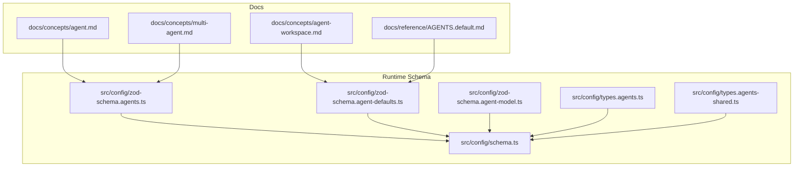
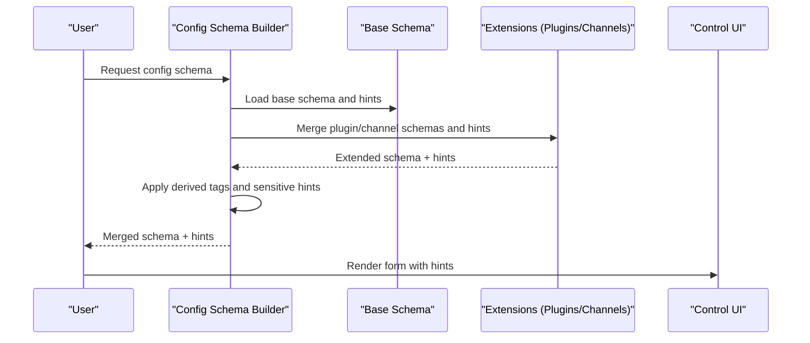
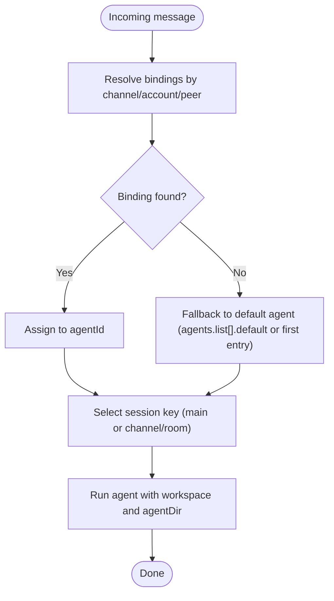
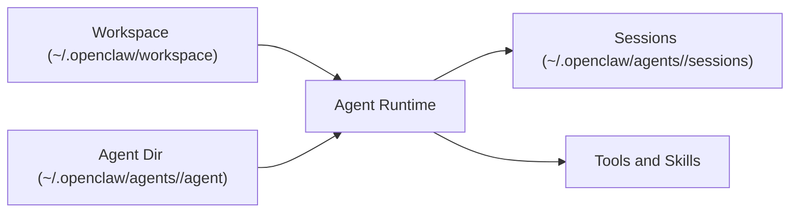
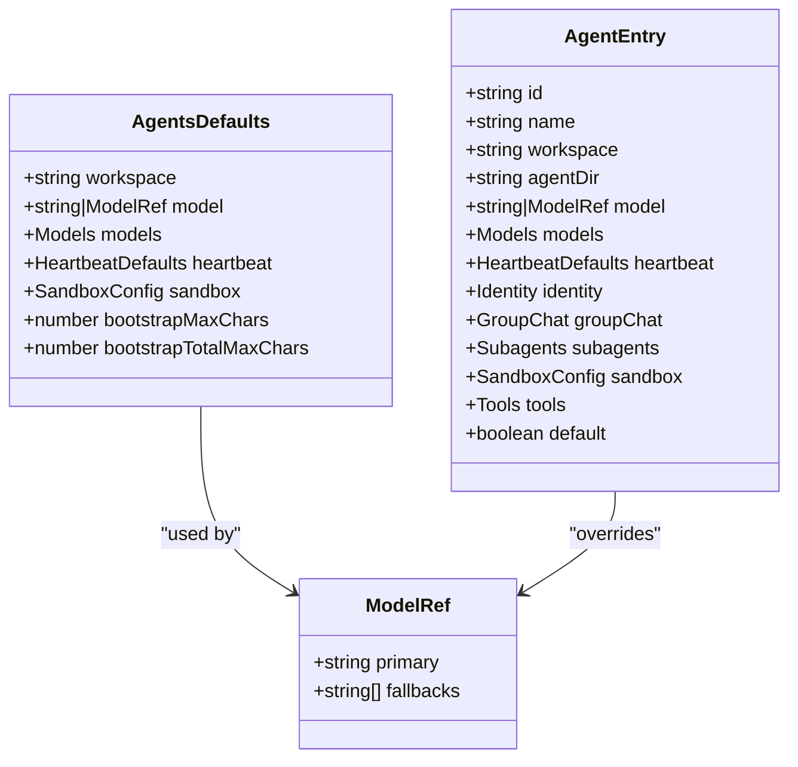
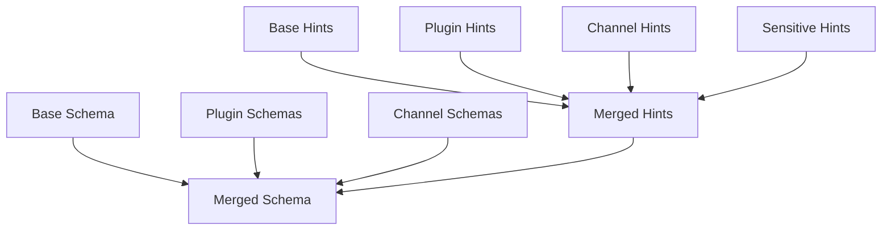
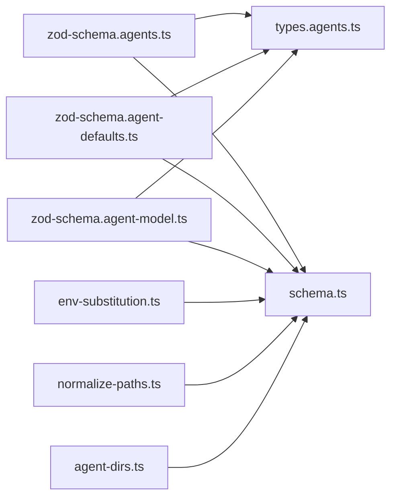

# Agent Configuration

<cite>
**Referenced Files in This Document**
- [AGENTS.md](file://AGENTS.md)
- [docs/reference/AGENTS.default.md](file://docs/reference/AGENTS.default.md)
- [docs/concepts/agent.md](file://docs/concepts/agent.md)
- [docs/concepts/agent-workspace.md](file://docs/concepts/agent-workspace.md)
- [docs/concepts/multi-agent.md](file://docs/concepts/multi-agent.md)
- [src/config/schema.ts](file://src/config/schema.ts)
- [src/config/zod-schema.agents.ts](file://src/config/zod-schema.agents.ts)
- [src/config/zod-schema.agent-defaults.ts](file://src/config/zod-schema.agent-defaults.ts)
- [src/config/zod-schema.agent-model.ts](file://src/config/zod-schema.agent-model.ts)
- [src/config/types.agents.ts](file://src/config/types.agents.ts)
- [src/config/types.agents-shared.ts](file://src/config/types.agents-shared.ts)
- [src/config/agent-dirs.ts](file://src/config/agent-dirs.ts)
- [src/config/merge-config.ts](file://src/config/merge-config.ts)
- [src/config/env-substitution.ts](file://src/config/env-substitution.ts)
- [src/config/normalize-paths.ts](file://src/config/normalize-paths.ts)
</cite>

## Table of Contents
1. [Introduction](#introduction)
2. [Project Structure](#project-structure)
3. [Core Components](#core-components)
4. [Architecture Overview](#architecture-overview)
5. [Detailed Component Analysis](#detailed-component-analysis)
6. [Dependency Analysis](#dependency-analysis)
7. [Performance Considerations](#performance-considerations)
8. [Troubleshooting Guide](#troubleshooting-guide)
9. [Conclusion](#conclusion)
10. [Appendices](#appendices)

## Introduction
This document explains agent configuration management in OpenClaw. It covers how agents are scoped and resolved, how default agents are selected, and how sessions map to agents. It documents the agent configuration schema, including model settings, workspace and agentDir paths, skills filtering, and sandbox configurations. It also details the agent entry structure and provides practical examples, inheritance patterns, configuration precedence, and environment-specific overrides. Finally, it includes troubleshooting guidance for common configuration issues and validation errors.

## Project Structure
Agent configuration spans documentation and runtime schema/type definitions:
- Conceptual and operational guidance in docs/concepts and docs/reference
- Runtime configuration schema and validation in src/config

**Diagram sources**
- [docs/concepts/agent.md](file://docs/concepts/agent.md)
- [docs/concepts/agent-workspace.md](file://docs/concepts/agent-workspace.md)
- [docs/concepts/multi-agent.md](file://docs/concepts/multi-agent.md)
- [docs/reference/AGENTS.default.md](file://docs/reference/AGENTS.default.md)
- [src/config/zod-schema.agents.ts](file://src/config/zod-schema.agents.ts)
- [src/config/zod-schema.agent-defaults.ts](file://src/config/zod-schema.agent-defaults.ts)
- [src/config/zod-schema.agent-model.ts](file://src/config/zod-schema.agent-model.ts)
- [src/config/types.agents.ts](file://src/config/types.agents.ts)
- [src/config/types.agents-shared.ts](file://src/config/types.agents-shared.ts)
- [src/config/schema.ts](file://src/config/schema.ts)

**Section sources**
- [docs/concepts/agent.md](file://docs/concepts/agent.md)
- [docs/concepts/agent-workspace.md](file://docs/concepts/agent-workspace.md)
- [docs/concepts/multi-agent.md](file://docs/concepts/multi-agent.md)
- [docs/reference/AGENTS.default.md](file://docs/reference/AGENTS.default.md)
- [src/config/schema.ts](file://src/config/schema.ts)

## Core Components
- Agent scope and identity
  - Single-agent default: agentId defaults to main; sessions keyed as agent:main:<mainKey>.
  - Multi-agent routing: agents.list[] entries define id, workspace, agentDir, and optional defaults.
  - Binding rules determine which agent receives an inbound message based on channel, account, and peer context.
- Agent workspace and state
  - Workspace is the default cwd for tools; sandbox can isolate it.
  - State directory (agentDir) holds per-agent auth profiles and config.
- Agent defaults
  - agents.defaults controls global defaults for models, workspace, heartbeat, sandbox, and streaming behavior.
- Agent entry structure
  - agents.list[] entries include id, name, workspace, agentDir, model overrides, skills filters, memorySearch settings, humanDelay, heartbeat, identity, groupChat, subagents, sandbox, and tools.

**Section sources**
- [docs/concepts/multi-agent.md](file://docs/concepts/multi-agent.md)
- [docs/concepts/agent.md](file://docs/concepts/agent.md)
- [docs/concepts/agent-workspace.md](file://docs/concepts/agent-workspace.md)
- [docs/reference/AGENTS.default.md](file://docs/reference/AGENTS.default.md)

## Architecture Overview
Agent configuration is validated and exposed through a generated JSON schema. Plugins and channels can contribute their own schema fragments and UI hints. The schema builder merges base and extension schemas and computes UI hints for the control interface.

**Diagram sources**
- [src/config/schema.ts](file://src/config/schema.ts)

**Section sources**
- [src/config/schema.ts](file://src/config/schema.ts)

## Detailed Component Analysis

### Agent Scope and Session Assignment
- Default agent selection
  - Single-agent mode: agentId defaults to main; sessions are keyed as agent:main:<mainKey>.
- Multi-agent routing
  - agents.list[] defines multiple agents with distinct workspaces and agentDirs.
  - bindings determine routing by channel, accountId, and peer; most-specific wins.
  - If multiple bindings match at the same level, the first in config order wins.
- Session-based agent assignment
  - Sessions are stored under ~/.openclaw/agents/<agentId>/sessions.
  - Direct chats collapse to the agent’s main session key; group chats use agent:<agentId>:<channel>:<room>.

**Diagram sources**
- [docs/concepts/multi-agent.md](file://docs/concepts/multi-agent.md)

**Section sources**
- [docs/concepts/multi-agent.md](file://docs/concepts/multi-agent.md)
- [docs/concepts/agent.md](file://docs/concepts/agent.md)

### Agent Workspace and State
- Workspace
  - Default location is ~/.openclaw/workspace; can be overridden via agents.defaults.workspace.
  - Treat as private memory; bootstrap files are injected at session start.
- State directory (agentDir)
  - Defaults to ~/.openclaw/agents/<agentId>/agent; can be customized per agent.
- Sandbox integration
  - When sandbox is enabled, non-main sessions can use per-session sandbox workspaces under agents.defaults.sandbox.workspaceRoot.

**Diagram sources**
- [docs/concepts/agent-workspace.md](file://docs/concepts/agent-workspace.md)
- [docs/concepts/agent.md](file://docs/concepts/agent.md)

**Section sources**
- [docs/concepts/agent-workspace.md](file://docs/concepts/agent-workspace.md)
- [docs/concepts/agent.md](file://docs/concepts/agent.md)

### Agent Defaults Schema and Precedence
- Global defaults
  - agents.defaults includes workspace, model(s), heartbeat, sandbox, streaming, and bootstrap limits.
- Per-agent overrides
  - agents.list[].<field> overrides agents.defaults.<field> for that agent.
- Environment-specific overrides
  - Environment variable substitution is applied during config load.
- Path normalization
  - Workspace and agentDir paths are normalized; tilde expansion is supported.

**Diagram sources**
- [src/config/zod-schema.agent-defaults.ts](file://src/config/zod-schema.agent-defaults.ts)
- [src/config/zod-schema.agents.ts](file://src/config/zod-schema.agents.ts)
- [src/config/zod-schema.agent-model.ts](file://src/config/zod-schema.agent-model.ts)

**Section sources**
- [src/config/zod-schema.agent-defaults.ts](file://src/config/zod-schema.agent-defaults.ts)
- [src/config/zod-schema.agents.ts](file://src/config/zod-schema.agents.ts)
- [src/config/zod-schema.agent-model.ts](file://src/config/zod-schema.agent-model.ts)
- [src/config/env-substitution.ts](file://src/config/env-substitution.ts)
- [src/config/normalize-paths.ts](file://src/config/normalize-paths.ts)

### Agent Entry Structure and Properties
Key properties in agents.list[] entries:
- id: Unique agent identifier; used in session paths and bindings.
- name: Human-friendly agent name.
- workspace: Agent workspace path; default cwd for tools.
- agentDir: Per-agent state directory for auth profiles and config.
- model/models: Model overrides for this agent; supports primary and fallbacks.
- skills filters: Controls which skills are available (see skills schema).
- memorySearch: Enables memory search behavior for this agent.
- humanDelay: Delay behavior for human-like pacing.
- heartbeat: Heartbeat target and cadence per agent.
- identity: Name/vibe/emoji for the agent.
- groupChat: Group chat gating and mention patterns.
- subagents: Nested agent definitions for hierarchical setups.
- sandbox: Per-agent sandbox configuration.
- tools: Tool allow/deny lists and elevated tool policies.

Practical examples:
- Default personal assistant setup: see docs/reference/AGENTS.default.md for recommended files and first-run steps.
- Multi-agent scenarios: see docs/concepts/multi-agent.md for examples of routing WhatsApp DMs, Discord bots, and Telegram deep work agents.

**Section sources**
- [docs/reference/AGENTS.default.md](file://docs/reference/AGENTS.default.md)
- [docs/concepts/multi-agent.md](file://docs/concepts/multi-agent.md)
- [src/config/zod-schema.agents.ts](file://src/config/zod-schema.agents.ts)
- [src/config/types.agents.ts](file://src/config/types.agents.ts)

### Configuration Schema Composition
- Base schema
  - Generated from OpenClawSchema; includes core config sections.
- Extension schemas
  - Plugins contribute plugin-specific config schemas and UI hints.
  - Channels contribute channel-specific config schemas and UI hints.
- UI hints and sensitive data
  - Derived tags and sensitive path hints are applied to improve UX and security.
- Lookup and navigation
  - Schema lookup supports wildcards and array indexing for dynamic paths.

**Diagram sources**
- [src/config/schema.ts](file://src/config/schema.ts)

**Section sources**
- [src/config/schema.ts](file://src/config/schema.ts)

### Agent Directory Resolution
- agentDir resolution ensures each agent has a unique state directory.
- Validation prevents sharing agentDir across agents to avoid auth/session collisions.

**Section sources**
- [src/config/agent-dirs.ts](file://src/config/agent-dirs.ts)

### Configuration Precedence and Inheritance Patterns
- Precedence
  - agents.list[].<field> overrides agents.defaults.<field>.
  - Channel and plugin contributions are merged into the base schema; runtime values reflect the final merged configuration.
- Inheritance
  - Per-agent sandbox and tools inherit from defaults but can be narrowed for security or resource control.
- Environment overrides
  - Environment variable substitution is applied to configuration values prior to validation.

**Section sources**
- [src/config/merge-config.ts](file://src/config/merge-config.ts)
- [src/config/env-substitution.ts](file://src/config/env-substitution.ts)

## Dependency Analysis
Agent configuration depends on:
- Schema generation and validation
- Types for agents, defaults, and models
- Environment substitution and path normalization
- Agent directory resolution

**Diagram sources**
- [src/config/zod-schema.agents.ts](file://src/config/zod-schema.agents.ts)
- [src/config/zod-schema.agent-defaults.ts](file://src/config/zod-schema.agent-defaults.ts)
- [src/config/zod-schema.agent-model.ts](file://src/config/zod-schema.agent-model.ts)
- [src/config/types.agents.ts](file://src/config/types.agents.ts)
- [src/config/schema.ts](file://src/config/schema.ts)
- [src/config/env-substitution.ts](file://src/config/env-substitution.ts)
- [src/config/normalize-paths.ts](file://src/config/normalize-paths.ts)
- [src/config/agent-dirs.ts](file://src/config/agent-dirs.ts)

**Section sources**
- [src/config/zod-schema.agents.ts](file://src/config/zod-schema.agents.ts)
- [src/config/zod-schema.agent-defaults.ts](file://src/config/zod-schema.agent-defaults.ts)
- [src/config/zod-schema.agent-model.ts](file://src/config/zod-schema.agent-model.ts)
- [src/config/types.agents.ts](file://src/config/types.agents.ts)
- [src/config/types.agents-shared.ts](file://src/config/types.agents-shared.ts)
- [src/config/schema.ts](file://src/config/schema.ts)
- [src/config/env-substitution.ts](file://src/config/env-substitution.ts)
- [src/config/normalize-paths.ts](file://src/config/normalize-paths.ts)
- [src/config/agent-dirs.ts](file://src/config/agent-dirs.ts)

## Performance Considerations
- Schema caching: Merged schema responses are cached to avoid recomputation.
- Wildcard and array indexing in schema lookups enable efficient navigation of dynamic structures.
- Bootstrap file limits prevent oversized context injection.

[No sources needed since this section provides general guidance]

## Troubleshooting Guide
Common configuration issues and resolutions:
- Missing workspace or bootstrap files
  - Use openclaw setup to create workspace and seed bootstrap files.
  - If you manage files yourself, set skipBootstrap to true to disable regeneration.
- Invalid agentId or duplicate agentDir
  - Ensure each agent has a unique id and agentDir; do not share agentDir across agents.
- Binding conflicts
  - Most-specific wins; if multiple bindings match at the same level, the first in config order wins.
  - Use accountId: "*" for channel-wide fallback; omit accountId to match default account only.
- Model configuration
  - Use provider/model format; if model ID contains slashes, include provider prefix.
  - If provider is omitted, OpenClaw treats input as alias for the default provider.
- Sandbox and tool restrictions
  - Per-agent sandbox and tools can restrict capabilities; ensure required tools exist in sandbox if enabled.
- Heartbeat target
  - Configure heartbeat.target per agent or defaults; acceptable values include last, none, or a channel id.

**Section sources**
- [docs/concepts/agent.md](file://docs/concepts/agent.md)
- [docs/concepts/agent-workspace.md](file://docs/concepts/agent-workspace.md)
- [docs/concepts/multi-agent.md](file://docs/concepts/multi-agent.md)
- [src/config/schema.ts](file://src/config/schema.ts)

## Conclusion
OpenClaw’s agent configuration system provides robust scoping, flexible defaults, and powerful multi-agent routing. By understanding agentId resolution, session assignment, and configuration precedence, you can design secure, isolated agent environments tailored to your workflows. Use the documented schema and examples to build reliable configurations and troubleshoot issues efficiently.

## Appendices

### Practical Examples Index
- Default personal assistant setup: [docs/reference/AGENTS.default.md](file://docs/reference/AGENTS.default.md)
- Multi-agent routing examples:
  - WhatsApp DM split: [docs/concepts/multi-agent.md](file://docs/concepts/multi-agent.md)
  - Discord bots per agent: [docs/concepts/multi-agent.md](file://docs/concepts/multi-agent.md)
  - Telegram deep work agent: [docs/concepts/multi-agent.md](file://docs/concepts/multi-agent.md)
- Agent workspace layout and backup: [docs/concepts/agent-workspace.md](file://docs/concepts/agent-workspace.md)

### Agent Entry Properties Reference
- id, name, workspace, agentDir, model, models, heartbeat, identity, groupChat, subagents, sandbox, tools
- See agent entry schema and types for precise shapes and defaults.

**Section sources**
- [src/config/zod-schema.agents.ts](file://src/config/zod-schema.agents.ts)
- [src/config/types.agents.ts](file://src/config/types.agents.ts)
- [src/config/types.agents-shared.ts](file://src/config/types.agents-shared.ts)