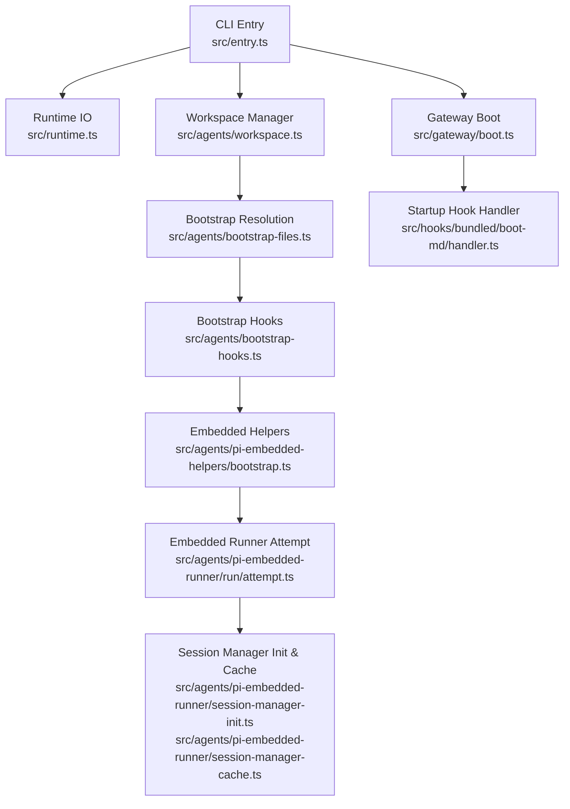
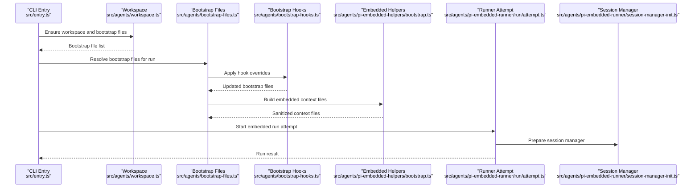
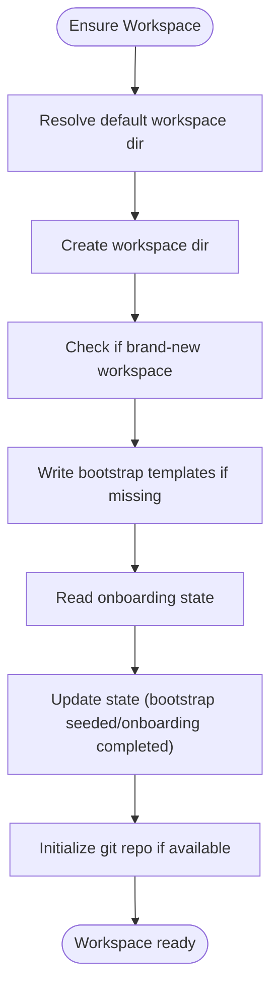
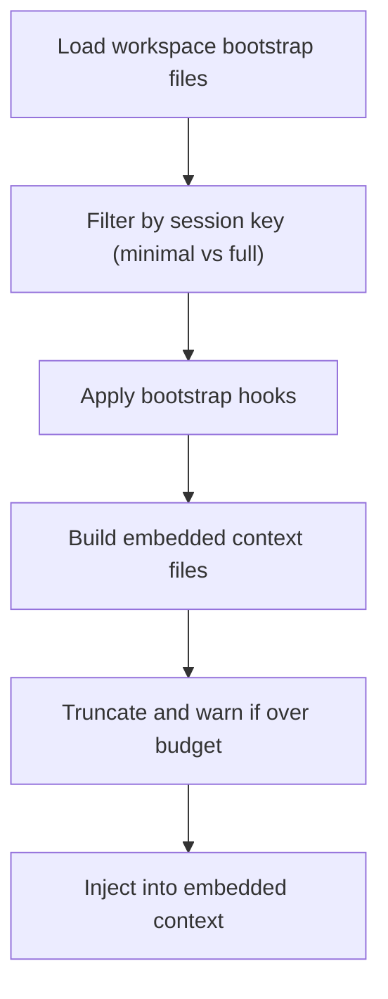
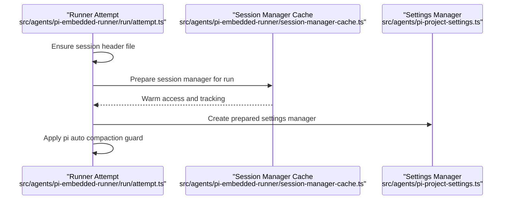
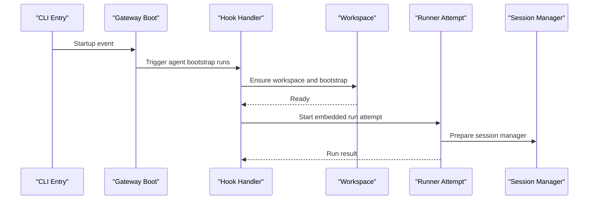
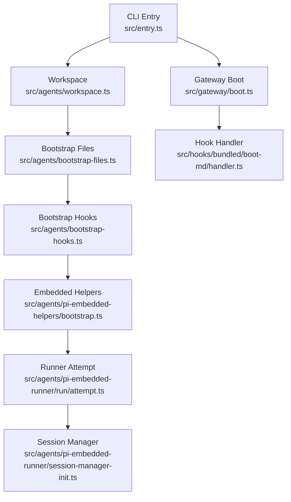

# Agent Runtime

<cite>
**Referenced Files in This Document**
- [entry.ts](file://src/entry.ts)
- [runtime.ts](file://src/runtime.ts)
- [workspace.ts](file://src/agents/workspace.ts)
- [bootstrap-cache.ts](file://src/agents/bootstrap-cache.ts)
- [bootstrap-hooks.ts](file://src/agents/bootstrap-hooks.ts)
- [bootstrap-files.ts](file://src/agents/bootstrap-files.ts)
- [pi-embedded-helpers/bootstrap.ts](file://src/agents/pi-embedded-helpers/bootstrap.ts)
- [pi-embedded-helpers.ts](file://src/agents/pi-embedded-helpers.ts)
- [attempt.ts](file://src/agents/pi-embedded-runner/run/attempt.ts)
- [session-manager-cache.ts](file://src/agents/pi-embedded-runner/session-manager-cache.ts)
- [session-manager-init.ts](file://src/agents/pi-embedded-runner/session-manager-init.ts)
- [boot.ts](file://src/gateway/boot.ts)
- [handler.ts](file://src/hooks/bundled/boot-md/handler.ts)
- [workspace-mounts.test.ts](file://src/agents/sandbox/workspace-mounts.test.ts)
</cite>

## Table of Contents
1. [Introduction](#introduction)
2. [Project Structure](#project-structure)
3. [Core Components](#core-components)
4. [Architecture Overview](#architecture-overview)
5. [Detailed Component Analysis](#detailed-component-analysis)
6. [Dependency Analysis](#dependency-analysis)
7. [Performance Considerations](#performance-considerations)
8. [Troubleshooting Guide](#troubleshooting-guide)
9. [Conclusion](#conclusion)
10. [Appendices](#appendices)

## Introduction
This document explains the OpenClaw agent runtime system with a focus on the embedded pi-mono runtime architecture and how it differs from standalone pi-mono installations. It covers the workspace directory structure, bootstrap file injection, session initialization, agent lifecycle from startup to shutdown, workspace management and file injection patterns, built-in tools availability, skill loading from multiple locations, configuration requirements, practical examples, workspace isolation, security considerations, and performance optimization.

## Project Structure
OpenClaw organizes agent runtime logic under src/agents and integrates with the CLI entry point and gateway boot subsystem. The runtime composes:
- CLI entry and environment normalization
- Workspace management and bootstrap file resolution
- Embedded pi-mono runner orchestration
- Session management and sandboxing
- Hooks-driven bootstrap and gateway startup

**Diagram sources**
- [entry.ts](file://src/entry.ts#L1-L195)
- [runtime.ts](file://src/runtime.ts#L1-L54)
- [workspace.ts](file://src/agents/workspace.ts#L1-L656)
- [bootstrap-files.ts](file://src/agents/bootstrap-files.ts#L1-L96)
- [bootstrap-hooks.ts](file://src/agents/bootstrap-hooks.ts#L1-L32)
- [pi-embedded-helpers/bootstrap.ts](file://src/agents/pi-embedded-helpers/bootstrap.ts#L1-L285)
- [attempt.ts](file://src/agents/pi-embedded-runner/run/attempt.ts#L1-L800)
- [session-manager-init.ts](file://src/agents/pi-embedded-runner/session-manager-init.ts)
- [session-manager-cache.ts](file://src/agents/pi-embedded-runner/session-manager-cache.ts#L56-L69)
- [boot.ts](file://src/gateway/boot.ts#L158-L203)
- [handler.ts](file://src/hooks/bundled/boot-md/handler.ts#L1-L44)

**Section sources**
- [entry.ts](file://src/entry.ts#L1-L195)
- [runtime.ts](file://src/runtime.ts#L1-L54)
- [workspace.ts](file://src/agents/workspace.ts#L1-L656)

## Core Components
- CLI entry and environment normalization: prepares process environment, handles respawn policy, and dispatches to CLI.
- Workspace manager: resolves default workspace directory, ensures bootstrap files, loads and validates bootstrap files, and manages onboarding state.
- Bootstrap pipeline: loads files, applies context-mode filtering, runs hooks, sanitizes and builds embedded context files.
- Embedded pi-mono runner: orchestrates sandboxing, session initialization, settings preparation, and run attempt execution.
- Session manager: initializes and warms session files for deterministic access.
- Gateway boot: triggers agent bootstrap runs on gateway startup via internal hooks.

**Section sources**
- [entry.ts](file://src/entry.ts#L1-L195)
- [workspace.ts](file://src/agents/workspace.ts#L1-L656)
- [bootstrap-files.ts](file://src/agents/bootstrap-files.ts#L1-L96)
- [bootstrap-hooks.ts](file://src/agents/bootstrap-hooks.ts#L1-L32)
- [pi-embedded-helpers/bootstrap.ts](file://src/agents/pi-embedded-helpers/bootstrap.ts#L1-L285)
- [attempt.ts](file://src/agents/pi-embedded-runner/run/attempt.ts#L1-L800)
- [session-manager-cache.ts](file://src/agents/pi-embedded-runner/session-manager-cache.ts#L56-L69)
- [boot.ts](file://src/gateway/boot.ts#L158-L203)
- [handler.ts](file://src/hooks/bundled/boot-md/handler.ts#L1-L44)

## Architecture Overview
The embedded pi-mono runtime is integrated into OpenClaw’s agent subsystem. At a high level:
- The CLI entry normalizes environment and spawns the main CLI.
- The workspace manager ensures a consistent bootstrap set and guards file access.
- Bootstrap files are resolved, filtered by context mode, and sanitized for injection.
- The embedded runner sets up sandboxing, session files, and settings, then executes the agent run.
- Gateway boot triggers agent bootstrap runs during startup using internal hooks.

**Diagram sources**
- [entry.ts](file://src/entry.ts#L1-L195)
- [workspace.ts](file://src/agents/workspace.ts#L1-L656)
- [bootstrap-files.ts](file://src/agents/bootstrap-files.ts#L64-L96)
- [bootstrap-hooks.ts](file://src/agents/bootstrap-hooks.ts#L7-L31)
- [pi-embedded-helpers/bootstrap.ts](file://src/agents/pi-embedded-helpers/bootstrap.ts#L198-L257)
- [attempt.ts](file://src/agents/pi-embedded-runner/run/attempt.ts#L746-L800)
- [session-manager-init.ts](file://src/agents/pi-embedded-runner/session-manager-init.ts)

## Detailed Component Analysis

### Embedded Pi-Mono Runtime vs Standalone Pi-Mono
- Embedded runtime:
  - Operates within OpenClaw’s agent subsystem with workspace-aware bootstrap and sandboxing.
  - Integrates with OpenClaw’s session manager and settings manager.
  - Uses OpenClaw’s bootstrap pipeline and internal hooks for customization.
  - Applies OpenClaw-specific context modes and truncation policies.
- Standalone pi-mono:
  - Typically runs outside OpenClaw’s workspace and bootstrap pipeline.
  - Does not leverage OpenClaw’s session manager or embedded settings manager.
  - Bootstrap and context injection are handled by pi-mono directly.

Key differences:
- Workspace and bootstrap: embedded runtime uses OpenClaw’s workspace and bootstrap resolution; standalone pi-mono relies on its own workspace and bootstrap files.
- Session management: embedded runtime initializes and warms session files; standalone pi-mono may not integrate with OpenClaw’s session manager.
- Hooks and overrides: embedded runtime applies OpenClaw’s bootstrap hooks; standalone pi-mono does not.
- Sandbox and isolation: embedded runtime respects OpenClaw’s sandbox configuration; standalone pi-mono may not.

**Section sources**
- [attempt.ts](file://src/agents/pi-embedded-runner/run/attempt.ts#L1098-L1125)
- [pi-embedded-helpers/bootstrap.ts](file://src/agents/pi-embedded-helpers/bootstrap.ts#L198-L257)

### Workspace Directory Structure and Management
- Default workspace directory is resolved from the user’s home directory and profile.
- Ensures bootstrap files (AGENTS.md, SOUL.md, TOOLS.md, IDENTITY.md, USER.md, HEARTBEAT.md, BOOTSTRAP.md) and onboarding state.
- Loads bootstrap files with boundary-safe reads and caches content by identity to avoid stale reads.
- Supports extra bootstrap files via glob patterns with diagnostics.
- Manages onboarding state via a hidden state file and git initialization for brand-new workspaces.

**Diagram sources**
- [workspace.ts](file://src/agents/workspace.ts#L321-L459)

**Section sources**
- [workspace.ts](file://src/agents/workspace.ts#L12-L24)
- [workspace.ts](file://src/agents/workspace.ts#L321-L459)
- [workspace.ts](file://src/agents/workspace.ts#L498-L555)
- [workspace.ts](file://src/agents/workspace.ts#L575-L655)

### Bootstrap File Injection Process
- Loads workspace bootstrap files (default set plus optional memory files).
- Filters files for session keys that require minimal context (subagent or cron).
- Applies hook overrides to adjust bootstrap files before injection.
- Builds embedded context files with truncation and warning modes.
- Sanitizes content and enforces character budgets for injection.

**Diagram sources**
- [bootstrap-files.ts](file://src/agents/bootstrap-files.ts#L64-L96)
- [bootstrap-hooks.ts](file://src/agents/bootstrap-hooks.ts#L7-L31)
- [pi-embedded-helpers/bootstrap.ts](file://src/agents/pi-embedded-helpers/bootstrap.ts#L198-L257)

**Section sources**
- [bootstrap-files.ts](file://src/agents/bootstrap-files.ts#L64-L96)
- [bootstrap-cache.ts](file://src/agents/bootstrap-cache.ts#L1-L37)
- [bootstrap-hooks.ts](file://src/agents/bootstrap-hooks.ts#L1-L32)
- [pi-embedded-helpers/bootstrap.ts](file://src/agents/pi-embedded-helpers/bootstrap.ts#L85-L123)
- [pi-embedded-helpers/bootstrap.ts](file://src/agents/pi-embedded-helpers/bootstrap.ts#L125-L172)
- [pi-embedded-helpers/bootstrap.ts](file://src/agents/pi-embedded-helpers/bootstrap.ts#L198-L257)

### Session Initialization
- Ensures the session header file exists and writes a session entry with version, id, timestamp, and working directory.
- Prepares the session manager for the run, warming session file access and tracking usage.
- Initializes embedded pi settings manager and applies auto-compaction guard based on context engine info.

**Diagram sources**
- [pi-embedded-helpers/bootstrap.ts](file://src/agents/pi-embedded-helpers/bootstrap.ts#L174-L196)
- [session-manager-cache.ts](file://src/agents/pi-embedded-runner/session-manager-cache.ts#L56-L69)
- [attempt.ts](file://src/agents/pi-embedded-runner/run/attempt.ts#L1098-L1125)

**Section sources**
- [pi-embedded-helpers/bootstrap.ts](file://src/agents/pi-embedded-helpers/bootstrap.ts#L174-L196)
- [session-manager-cache.ts](file://src/agents/pi-embedded-runner/session-manager-cache.ts#L56-L69)
- [attempt.ts](file://src/agents/pi-embedded-runner/run/attempt.ts#L1098-L1125)

### Agent Lifecycle: Startup to Shutdown
- CLI entry normalizes environment and spawns the CLI.
- Workspace ensures bootstrap files and onboarding state.
- Gateway boot triggers agent bootstrap runs on startup via internal hooks.
- Embedded runner attempts:
  - Resolve sandbox context and effective workspace.
  - Apply skill environment overrides and build skills prompt.
  - Resolve bootstrap context for the run (context mode, filters, hooks).
  - Initialize session manager and settings manager.
  - Execute the agent run attempt.

**Diagram sources**
- [entry.ts](file://src/entry.ts#L1-L195)
- [boot.ts](file://src/gateway/boot.ts#L158-L203)
- [handler.ts](file://src/hooks/bundled/boot-md/handler.ts#L1-L44)
- [workspace.ts](file://src/agents/workspace.ts#L321-L459)
- [attempt.ts](file://src/agents/pi-embedded-runner/run/attempt.ts#L746-L800)

**Section sources**
- [entry.ts](file://src/entry.ts#L1-L195)
- [boot.ts](file://src/gateway/boot.ts#L158-L203)
- [handler.ts](file://src/hooks/bundled/boot-md/handler.ts#L1-L44)
- [attempt.ts](file://src/agents/pi-embedded-runner/run/attempt.ts#L746-L800)

### Built-in Tools Availability and Skill Loading
- Skills are resolved per run and environment overrides are applied either from a snapshot or computed entries.
- Skills prompt is built for the run based on configuration and workspace.
- Tool names are normalized and dispatched according to allowlists and normalization rules.

Practical implications:
- Skills can be loaded from workspace-defined entries and/or snapshots.
- Environment overrides influence tool availability and behavior.

**Section sources**
- [attempt.ts](file://src/agents/pi-embedded-runner/run/attempt.ts#L776-L796)
- [attempt.ts](file://src/agents/pi-embedded-runner/run/attempt.ts#L800-L800)

### Configuration Requirements
- Bootstrap character limits and truncation warnings are configurable.
- Provider-specific compatibility and OpenAI-compatible adapters are supported.
- Sandbox workspace access controls are enforced via mount arguments.

Examples:
- Configure bootstrap max characters and total max characters.
- Enable/disable or set warning modes for bootstrap truncation.
- Adjust Ollama compatibility behavior for OpenAI-compatible endpoints.

**Section sources**
- [pi-embedded-helpers/bootstrap.ts](file://src/agents/pi-embedded-helpers/bootstrap.ts#L99-L123)
- [attempt.ts](file://src/agents/pi-embedded-runner/run/attempt.ts#L148-L224)
- [workspace-mounts.test.ts](file://src/agents/sandbox/workspace-mounts.test.ts#L1-L49)

### Practical Examples
- Workspace setup:
  - Ensure workspace and bootstrap files are present; onboarding state is tracked.
  - Example path: [ensureAgentWorkspace](file://src/agents/workspace.ts#L321-L459)
- Bootstrap customization:
  - Apply hook overrides to adjust bootstrap files before injection.
  - Example path: [applyBootstrapHookOverrides](file://src/agents/bootstrap-hooks.ts#L7-L31)
- Agent configuration patterns:
  - Set bootstrap character limits and truncation warning modes.
  - Example path: [resolveBootstrapMaxChars](file://src/agents/pi-embedded-helpers/bootstrap.ts#L99-L105), [resolveBootstrapTotalMaxChars](file://src/agents/pi-embedded-helpers/bootstrap.ts#L107-L113), [resolveBootstrapPromptTruncationWarningMode](file://src/agents/pi-embedded-helpers/bootstrap.ts#L115-L123)

**Section sources**
- [workspace.ts](file://src/agents/workspace.ts#L321-L459)
- [bootstrap-hooks.ts](file://src/agents/bootstrap-hooks.ts#L7-L31)
- [pi-embedded-helpers/bootstrap.ts](file://src/agents/pi-embedded-helpers/bootstrap.ts#L99-L123)

### Workspace Isolation and Security
- Boundary-safe file reads prevent escaping the workspace root and enforce maximum file sizes.
- Workspace file cache avoids stale reads by identity (path, device, inode, size, mtime).
- Onboarding state and git initialization support workspace hygiene.
- Sandbox workspace access controls are enforced via mount arguments (read-only vs read-write).

Security considerations:
- Use boundary-safe open and guarded reads for all workspace files.
- Enforce read-only access when appropriate to minimize risk.
- Track and manage workspace state to avoid unintended mutations.

**Section sources**
- [workspace.ts](file://src/agents/workspace.ts#L48-L88)
- [workspace.ts](file://src/agents/workspace.ts#L52-L54)
- [workspace.ts](file://src/agents/workspace.ts#L304-L319)
- [workspace-mounts.test.ts](file://src/agents/sandbox/workspace-mounts.test.ts#L1-L49)

## Dependency Analysis
The embedded runtime composes several modules with clear responsibilities and low coupling:
- CLI entry depends on environment normalization and CLI dispatch.
- Workspace manager depends on file I/O, boundary guards, and onboarding state.
- Bootstrap pipeline depends on workspace files, hooks, and embedded helpers.
- Runner depends on sandbox context, session manager, settings manager, and bootstrap context.
- Gateway boot depends on internal hooks and agent command execution.

**Diagram sources**
- [entry.ts](file://src/entry.ts#L1-L195)
- [workspace.ts](file://src/agents/workspace.ts#L1-L656)
- [bootstrap-files.ts](file://src/agents/bootstrap-files.ts#L1-L96)
- [bootstrap-hooks.ts](file://src/agents/bootstrap-hooks.ts#L1-L32)
- [pi-embedded-helpers/bootstrap.ts](file://src/agents/pi-embedded-helpers/bootstrap.ts#L1-L285)
- [attempt.ts](file://src/agents/pi-embedded-runner/run/attempt.ts#L1-L800)
- [session-manager-init.ts](file://src/agents/pi-embedded-runner/session-manager-init.ts)
- [boot.ts](file://src/gateway/boot.ts#L158-L203)
- [handler.ts](file://src/hooks/bundled/boot-md/handler.ts#L1-L44)

**Section sources**
- [entry.ts](file://src/entry.ts#L1-L195)
- [workspace.ts](file://src/agents/workspace.ts#L1-L656)
- [bootstrap-files.ts](file://src/agents/bootstrap-files.ts#L1-L96)
- [bootstrap-hooks.ts](file://src/agents/bootstrap-hooks.ts#L1-L32)
- [pi-embedded-helpers/bootstrap.ts](file://src/agents/pi-embedded-helpers/bootstrap.ts#L1-L285)
- [attempt.ts](file://src/agents/pi-embedded-runner/run/attempt.ts#L1-L800)
- [session-manager-init.ts](file://src/agents/pi-embedded-runner/session-manager-init.ts)
- [boot.ts](file://src/gateway/boot.ts#L158-L203)
- [handler.ts](file://src/hooks/bundled/boot-md/handler.ts#L1-L44)

## Performance Considerations
- Compile cache enablement at startup reduces cold-start latency.
- Session file pre-warming improves deterministic access and reduces first-access overhead.
- Bootstrap budget enforcement prevents oversized contexts and reduces truncation warnings.
- Sandbox workspace access controls avoid unnecessary I/O and improve isolation.

Recommendations:
- Keep bootstrap files concise and leverage truncation warnings to maintain optimal context sizes.
- Use read-only workspace access when possible to reduce I/O contention.
- Monitor session file access patterns and adjust sandbox configurations accordingly.

**Section sources**
- [entry.ts](file://src/entry.ts#L48-L54)
- [session-manager-cache.ts](file://src/agents/pi-embedded-runner/session-manager-cache.ts#L56-L69)
- [pi-embedded-helpers/bootstrap.ts](file://src/agents/pi-embedded-helpers/bootstrap.ts#L85-L123)

## Troubleshooting Guide
Common issues and remedies:
- Bootstrap truncation warnings:
  - Reduce bootstrap file sizes or adjust character limits.
  - Review truncation warning mode configuration.
  - Reference: [resolveBootstrapMaxChars](file://src/agents/pi-embedded-helpers/bootstrap.ts#L99-L105), [resolveBootstrapTotalMaxChars](file://src/agents/pi-embedded-helpers/bootstrap.ts#L107-L113), [resolveBootstrapPromptTruncationWarningMode](file://src/agents/pi-embedded-helpers/bootstrap.ts#L115-L123)
- Session file errors:
  - Ensure session header file exists and is writable.
  - Verify session manager initialization and warming.
  - Reference: [ensureSessionHeader](file://src/agents/pi-embedded-helpers/bootstrap.ts#L174-L196), [prepareSessionManagerForRun](file://src/agents/pi-embedded-runner/run/attempt.ts#L1098-L1125)
- Sandbox workspace access:
  - Confirm mount arguments and workspace access mode.
  - Reference: [appendWorkspaceMountArgs](file://src/agents/sandbox/workspace-mounts.test.ts#L1-L49)
- Gateway boot failures:
  - Validate agent command execution and mapping restoration.
  - Reference: [runBootOnce](file://src/gateway/boot.ts#L158-L203)

**Section sources**
- [pi-embedded-helpers/bootstrap.ts](file://src/agents/pi-embedded-helpers/bootstrap.ts#L99-L123)
- [pi-embedded-helpers/bootstrap.ts](file://src/agents/pi-embedded-helpers/bootstrap.ts#L174-L196)
- [attempt.ts](file://src/agents/pi-embedded-runner/run/attempt.ts#L1098-L1125)
- [workspace-mounts.test.ts](file://src/agents/sandbox/workspace-mounts.test.ts#L1-L49)
- [boot.ts](file://src/gateway/boot.ts#L158-L203)

## Conclusion
OpenClaw’s embedded pi-mono runtime integrates tightly with workspace management, bootstrap resolution, and session handling to provide a secure, configurable, and efficient agent execution environment. By leveraging hooks, sandboxing, and careful resource management, it offers a robust foundation for agent lifecycle operations while maintaining isolation and performance.

## Appendices
- Embedded helpers export:
  - Bootstrap context builders and truncation utilities
  - Error classification and sanitization helpers
  - Turn validation and tool call ID utilities

**Section sources**
- [pi-embedded-helpers.ts](file://src/agents/pi-embedded-helpers.ts#L1-L73)