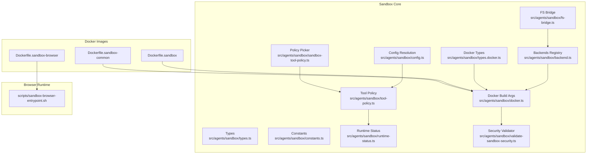
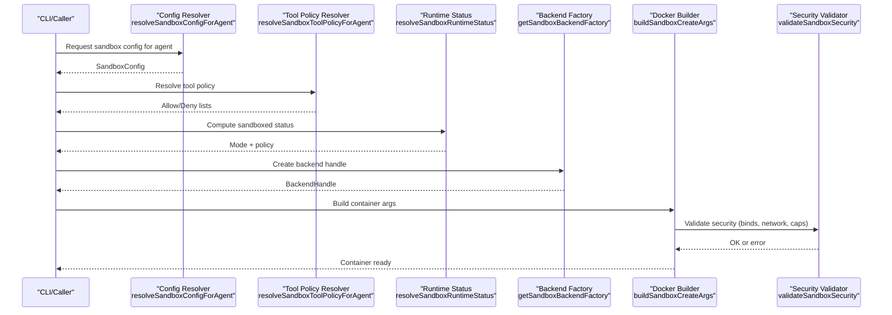
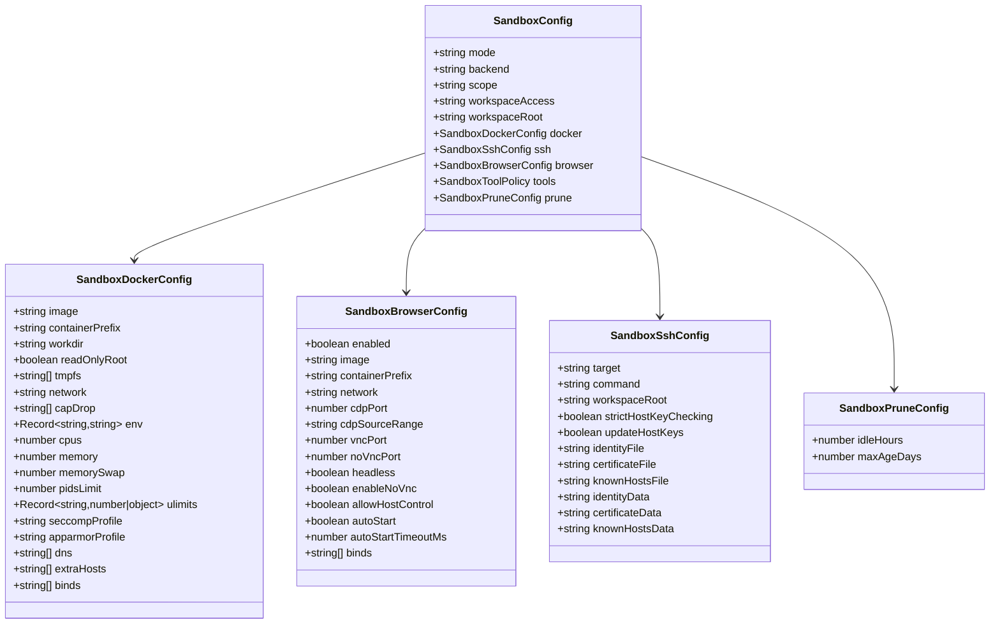
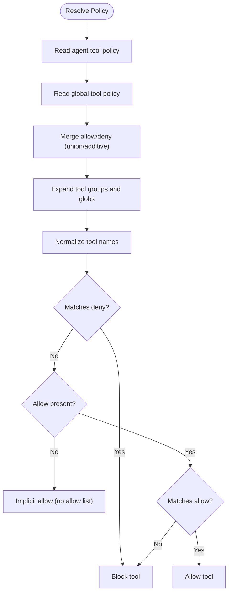
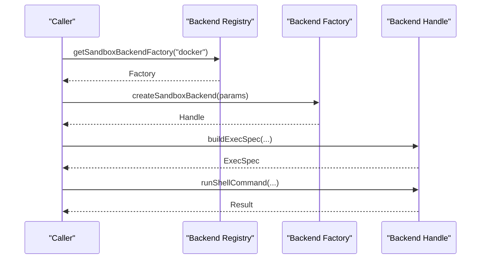
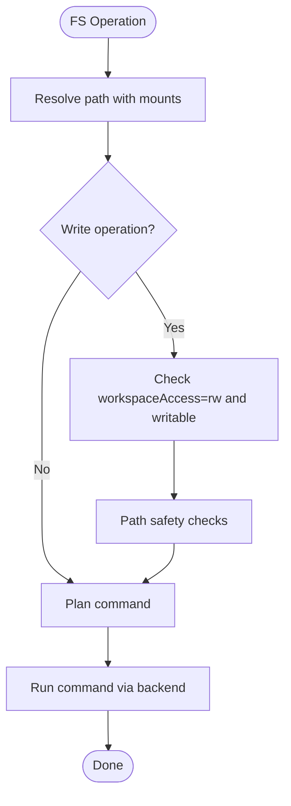
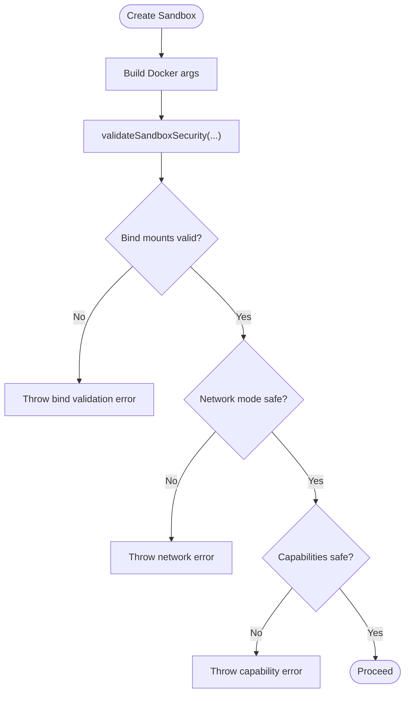
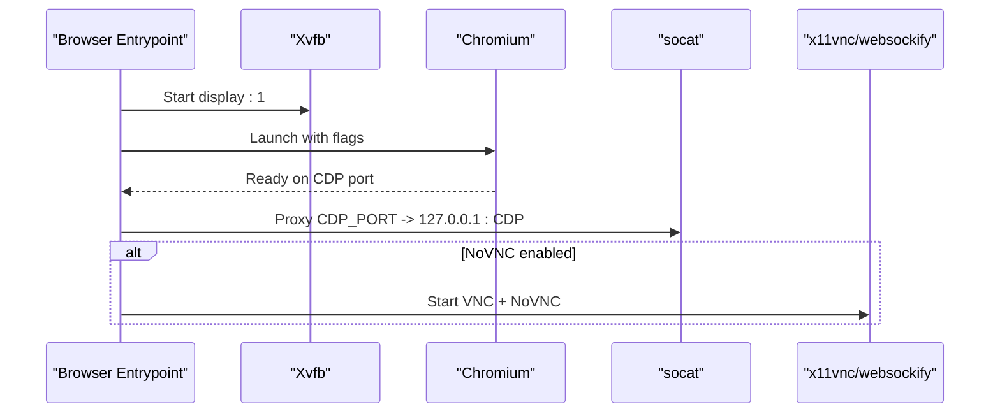
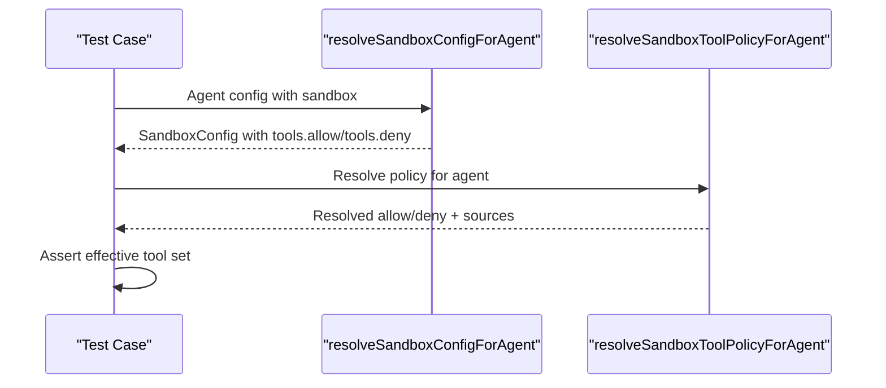
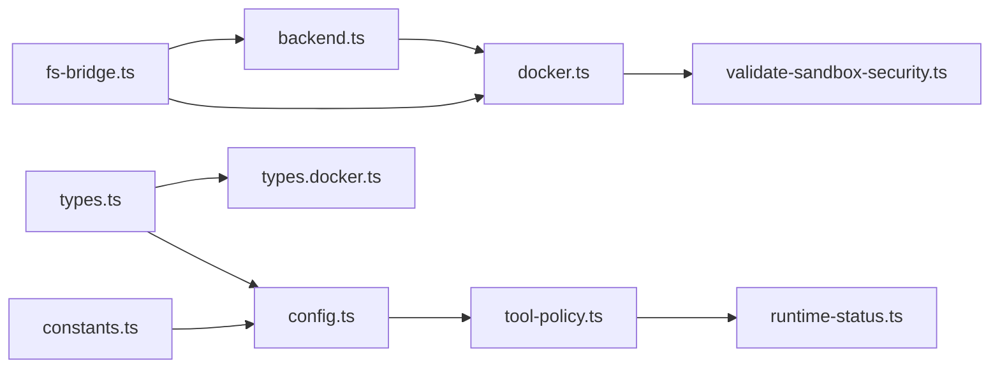

# Agent Security & Sandboxing

<cite>
**Referenced Files in This Document**
- [Dockerfile.sandbox](file://Dockerfile.sandbox)
- [Dockerfile.sandbox-common](file://Dockerfile.sandbox-common)
- [Dockerfile.sandbox-browser](file://Dockerfile.sandbox-browser)
- [scripts/sandbox-browser-entrypoint.sh](file://scripts/sandbox-browser-entrypoint.sh)
- [src/agents/sandbox/types.ts](file://src/agents/sandbox/types.ts)
- [src/agents/sandbox/constants.ts](file://src/agents/sandbox/constants.ts)
- [src/agents/sandbox/config.ts](file://src/agents/sandbox/config.ts)
- [src/agents/sandbox/tool-policy.ts](file://src/agents/sandbox/tool-policy.ts)
- [src/agents/sandbox/sandbox-tool-policy.ts](file://src/agents/sandbox/sandbox-tool-policy.ts)
- [src/agents/sandbox/runtime-status.ts](file://src/agents/sandbox/runtime-status.ts)
- [src/agents/sandbox/backend.ts](file://src/agents/sandbox/backend.ts)
- [src/agents/sandbox/fs-bridge.ts](file://src/agents/sandbox/fs-bridge.ts)
- [src/agents/sandbox/types.docker.ts](file://src/agents/sandbox/types.docker.ts)
- [src/agents/sandbox/validate-sandbox-security.ts](file://src/agents/sandbox/validate-sandbox-security.ts)
- [src/agents/sandbox/docker.ts](file://src/agents/sandbox/docker.ts)
- [src/config/zod-schema.agent-runtime.ts](file://src/config/zod-schema.agent-runtime.ts)
- [src/agents/sandbox-explain.test.ts](file://src/agents/sandbox-explain.test.ts)
- [src/agents/pi-tools-agent-config.test.ts](file://src/agents/pi-tools-agent-config.test.ts)
</cite>

## Table of Contents
1. [Introduction](#introduction)
2. [Project Structure](#project-structure)
3. [Core Components](#core-components)
4. [Architecture Overview](#architecture-overview)
5. [Detailed Component Analysis](#detailed-component-analysis)
6. [Dependency Analysis](#dependency-analysis)
7. [Performance Considerations](#performance-considerations)
8. [Troubleshooting Guide](#troubleshooting-guide)
9. [Conclusion](#conclusion)
10. [Appendices](#appendices)

## Introduction
This document explains OpenClaw’s agent security and sandboxing system. It covers the sandbox architecture, isolation mechanisms, and security boundaries; documents tool policies, path restrictions, and resource limitations; details sandbox configuration, Docker integration, and browser sandboxing; and provides practical guidance for secure deployments, policy enforcement, and privilege management. It also addresses troubleshooting, performance impact, and security considerations, and explains how sandboxing relates to agent capabilities such as tool access, file system permissions, and network restrictions.

## Project Structure
OpenClaw’s sandboxing spans configuration resolution, policy computation, backend orchestration, filesystem bridging, and Docker security enforcement. Supporting assets include dedicated Dockerfiles and a browser entrypoint script.

**Diagram sources**
- [src/agents/sandbox/types.ts:1-112](file://src/agents/sandbox/types.ts#L1-L112)
- [src/agents/sandbox/constants.ts:1-56](file://src/agents/sandbox/constants.ts#L1-L56)
- [src/agents/sandbox/config.ts:1-277](file://src/agents/sandbox/config.ts#L1-L277)
- [src/agents/sandbox/tool-policy.ts:1-43](file://src/agents/sandbox/tool-policy.ts#L1-L43)
- [src/agents/sandbox/sandbox-tool-policy.ts:1-37](file://src/agents/sandbox/sandbox-tool-policy.ts#L1-L37)
- [src/agents/sandbox/runtime-status.ts:1-139](file://src/agents/sandbox/runtime-status.ts#L1-L139)
- [src/agents/sandbox/backend.ts:1-159](file://src/agents/sandbox/backend.ts#L1-L159)
- [src/agents/sandbox/fs-bridge.ts:1-338](file://src/agents/sandbox/fs-bridge.ts#L1-L338)
- [src/agents/sandbox/types.docker.ts:1-14](file://src/agents/sandbox/types.docker.ts#L1-L14)
- [src/agents/sandbox/validate-sandbox-security.ts:1-306](file://src/agents/sandbox/validate-sandbox-security.ts#L1-L306)
- [src/agents/sandbox/docker.ts:292-344](file://src/agents/sandbox/docker.ts#L292-L344)
- [Dockerfile.sandbox:1-25](file://Dockerfile.sandbox#L1-L25)
- [Dockerfile.sandbox-common:1-49](file://Dockerfile.sandbox-common#L1-L49)
- [Dockerfile.sandbox-browser:1-36](file://Dockerfile.sandbox-browser#L1-L36)
- [scripts/sandbox-browser-entrypoint.sh:1-128](file://scripts/sandbox-browser-entrypoint.sh#L1-L128)

**Section sources**
- [src/agents/sandbox/types.ts:1-112](file://src/agents/sandbox/types.ts#L1-L112)
- [src/agents/sandbox/constants.ts:1-56](file://src/agents/sandbox/constants.ts#L1-L56)
- [src/agents/sandbox/config.ts:1-277](file://src/agents/sandbox/config.ts#L1-L277)
- [src/agents/sandbox/tool-policy.ts:1-43](file://src/agents/sandbox/tool-policy.ts#L1-L43)
- [src/agents/sandbox/sandbox-tool-policy.ts:1-37](file://src/agents/sandbox/sandbox-tool-policy.ts#L1-L37)
- [src/agents/sandbox/runtime-status.ts:1-139](file://src/agents/sandbox/runtime-status.ts#L1-L139)
- [src/agents/sandbox/backend.ts:1-159](file://src/agents/sandbox/backend.ts#L1-L159)
- [src/agents/sandbox/fs-bridge.ts:1-338](file://src/agents/sandbox/fs-bridge.ts#L1-L338)
- [src/agents/sandbox/types.docker.ts:1-14](file://src/agents/sandbox/types.docker.ts#L1-L14)
- [src/agents/sandbox/validate-sandbox-security.ts:1-306](file://src/agents/sandbox/validate-sandbox-security.ts#L1-L306)
- [src/agents/sandbox/docker.ts:292-344](file://src/agents/sandbox/docker.ts#L292-L344)
- [Dockerfile.sandbox:1-25](file://Dockerfile.sandbox#L1-L25)
- [Dockerfile.sandbox-common:1-49](file://Dockerfile.sandbox-common#L1-L49)
- [Dockerfile.sandbox-browser:1-36](file://Dockerfile.sandbox-browser#L1-L36)
- [scripts/sandbox-browser-entrypoint.sh:1-128](file://scripts/sandbox-browser-entrypoint.sh#L1-L128)

## Core Components
- Sandbox configuration model and scopes define isolation mode, backend selection, workspace access, Docker and browser settings, pruning, and tool policy.
- Tool policy resolution merges agent-level, global-level, and defaults with deny-override semantics.
- Backend registry supports pluggable backends (Docker and SSH) with capability flags and lifecycle management.
- FS bridge enforces path safety, mount anchoring, and write permissions based on workspace access level.
- Docker security validator enforces safe defaults and blocks dangerous configurations (bind sources, reserved targets, network modes, seccomp/apparmor).
- Browser sandbox image and entrypoint provide headless/headful Chromium with optional VNC/NoVNC and CDP exposure.

**Section sources**
- [src/agents/sandbox/types.ts:70-112](file://src/agents/sandbox/types.ts#L70-L112)
- [src/agents/sandbox/config.ts:224-277](file://src/agents/sandbox/config.ts#L224-L277)
- [src/agents/sandbox/tool-policy.ts:35-43](file://src/agents/sandbox/tool-policy.ts#L35-L43)
- [src/agents/sandbox/backend.ts:62-93](file://src/agents/sandbox/backend.ts#L62-L93)
- [src/agents/sandbox/fs-bridge.ts:38-67](file://src/agents/sandbox/fs-bridge.ts#L38-L67)
- [src/agents/sandbox/validate-sandbox-security.ts:16-37](file://src/agents/sandbox/validate-sandbox-security.ts#L16-L37)
- [Dockerfile.sandbox-browser:1-36](file://Dockerfile.sandbox-browser#L1-L36)
- [scripts/sandbox-browser-entrypoint.sh:1-128](file://scripts/sandbox-browser-entrypoint.sh#L1-L128)

## Architecture Overview
The sandbox architecture separates concerns across configuration, policy, backend orchestration, and filesystem bridging. At runtime, the system resolves sandbox settings per agent and session, applies tool policy, and enforces security constraints during container creation and filesystem operations.

**Diagram sources**
- [src/agents/sandbox/config.ts:224-277](file://src/agents/sandbox/config.ts#L224-L277)
- [src/agents/sandbox/tool-policy.ts:35-43](file://src/agents/sandbox/tool-policy.ts#L35-L43)
- [src/agents/sandbox/runtime-status.ts:45-79](file://src/agents/sandbox/runtime-status.ts#L45-L79)
- [src/agents/sandbox/backend.ts:126-145](file://src/agents/sandbox/backend.ts#L126-L145)
- [src/agents/sandbox/docker.ts:317-344](file://src/agents/sandbox/docker.ts#L317-L344)
- [src/agents/sandbox/validate-sandbox-security.ts:250-306](file://src/agents/sandbox/validate-sandbox-security.ts#L250-L306)

## Detailed Component Analysis

### Sandbox Configuration Model
- Modes: off, non-main, all; controls whether sessions run sandboxed.
- Scope: session, agent, shared; determines how settings are merged and persisted.
- Workspace access: none, ro, rw; governs filesystem write permissions.
- Docker defaults: read-only root, tmpfs, “none” network, drop-all capabilities.
- Browser defaults: dedicated image, ports, optional VNC/NoVNC, CDP exposure with optional source range.
- Prune policy: idle hours and max age for cleanup.

**Diagram sources**
- [src/agents/sandbox/types.ts:70-81](file://src/agents/sandbox/types.ts#L70-L81)
- [src/agents/sandbox/types.ts:1-112](file://src/agents/sandbox/types.ts#L1-L112)
- [src/agents/sandbox/types.docker.ts:1-14](file://src/agents/sandbox/types.docker.ts#L1-L14)

**Section sources**
- [src/agents/sandbox/types.ts:70-112](file://src/agents/sandbox/types.ts#L70-L112)
- [src/agents/sandbox/constants.ts:5-56](file://src/agents/sandbox/constants.ts#L5-L56)
- [src/agents/sandbox/config.ts:69-174](file://src/agents/sandbox/config.ts#L69-L174)

### Tool Policy Resolution and Enforcement
- Policy precedence: agent overrides > global > defaults.
- Deny takes precedence over allow; wildcard allow-all is supported.
- Tool names are normalized and matched via glob expansion and groups.
- Blocked tool messages include actionable fixes and pointers to explain commands.

**Diagram sources**
- [src/agents/sandbox/tool-policy.ts:16-33](file://src/agents/sandbox/tool-policy.ts#L16-L33)
- [src/agents/sandbox/sandbox-tool-policy.ts:9-37](file://src/agents/sandbox/sandbox-tool-policy.ts#L9-L37)
- [src/agents/sandbox/runtime-status.ts:81-138](file://src/agents/sandbox/runtime-status.ts#L81-L138)

**Section sources**
- [src/agents/sandbox/tool-policy.ts:1-43](file://src/agents/sandbox/tool-policy.ts#L1-L43)
- [src/agents/sandbox/sandbox-tool-policy.ts:1-37](file://src/agents/sandbox/sandbox-tool-policy.ts#L1-L37)
- [src/agents/sandbox/runtime-status.ts:81-138](file://src/agents/sandbox/runtime-status.ts#L81-L138)
- [src/agents/sandbox-explain.test.ts:7-34](file://src/agents/sandbox-explain.test.ts#L7-L34)

### Backend Orchestration and Capabilities
- Backends are registered by ID; Docker and SSH are built-in.
- Backend handles expose exec spec building, command execution, and optional filesystem bridge creation.
- Capability flags indicate backend features (e.g., browser support).

**Diagram sources**
- [src/agents/sandbox/backend.ts:126-145](file://src/agents/sandbox/backend.ts#L126-L145)

**Section sources**
- [src/agents/sandbox/backend.ts:1-159](file://src/agents/sandbox/backend.ts#L1-L159)

### Filesystem Bridge and Path Safety
- Mounts are built from sandbox context and resolved to anchored paths.
- Path safety checks guard against escapes, disallowed roots, and reserved targets.
- Write operations are gated by workspace access level and path checks.
- Read/write/mkdir/remove/rename/stat operations are executed via planned shell commands.

**Diagram sources**
- [src/agents/sandbox/fs-bridge.ts:65-319](file://src/agents/sandbox/fs-bridge.ts#L65-L319)

**Section sources**
- [src/agents/sandbox/fs-bridge.ts:1-338](file://src/agents/sandbox/fs-bridge.ts#L1-L338)

### Docker Security Validation and Defaults
- Defaults enforce read-only root, tmpfs, “none” network, drop-all capabilities.
- Security validator blocks:
  - Host paths under blocked roots (/etc, /proc, /sys, /dev, /root, /boot, Docker sockets).
  - Reserved container targets (/workspace, /agent).
  - Dangerous network modes (host, container namespace join).
  - Unconfined seccomp/apparmor profiles.
- Bind mounts are validated for absolute sources and allowed roots; deduplication and normalization are enforced.

**Diagram sources**
- [src/agents/sandbox/docker.ts:317-344](file://src/agents/sandbox/docker.ts#L317-L344)
- [src/agents/sandbox/validate-sandbox-security.ts:250-306](file://src/agents/sandbox/validate-sandbox-security.ts#L250-L306)
- [src/config/zod-schema.agent-runtime.ts:132-166](file://src/config/zod-schema.agent-runtime.ts#L132-L166)

**Section sources**
- [src/agents/sandbox/validate-sandbox-security.ts:1-306](file://src/agents/sandbox/validate-sandbox-security.ts#L1-L306)
- [src/agents/sandbox/docker.ts:292-344](file://src/agents/sandbox/docker.ts#L292-L344)
- [src/config/zod-schema.agent-runtime.ts:132-166](file://src/config/zod-schema.agent-runtime.ts#L132-L166)

### Browser Sandboxing
- Dedicated browser image installs Chromium, VNC, and supporting tools.
- Entrypoint sets up Xvfb, Chromium flags, optional no-sandbox, and exposes CDP/VNC/NoVNC.
- Network exposure can be restricted by source IP range; auto-start and timeouts configurable.

**Diagram sources**
- [Dockerfile.sandbox-browser:1-36](file://Dockerfile.sandbox-browser#L1-L36)
- [scripts/sandbox-browser-entrypoint.sh:1-128](file://scripts/sandbox-browser-entrypoint.sh#L1-L128)

**Section sources**
- [Dockerfile.sandbox-browser:1-36](file://Dockerfile.sandbox-browser#L1-L36)
- [scripts/sandbox-browser-entrypoint.sh:1-128](file://scripts/sandbox-browser-entrypoint.sh#L1-L128)

### Practical Deployment Examples and Policy Enforcement
- Example: Restrict agent tools to read-only; sandbox allows read/write/exec; final effective policy is the most restrictive (only read).
- Example: Prefer agent overrides over global defaults; explain helper surfaces source of allow/deny decisions.

**Diagram sources**
- [src/agents/pi-tools-agent-config.test.ts:575-611](file://src/agents/pi-tools-agent-config.test.ts#L575-L611)
- [src/agents/sandbox-explain.test.ts:7-34](file://src/agents/sandbox-explain.test.ts#L7-L34)

**Section sources**
- [src/agents/pi-tools-agent-config.test.ts:575-611](file://src/agents/pi-tools-agent-config.test.ts#L575-L611)
- [src/agents/sandbox-explain.test.ts:7-34](file://src/agents/sandbox-explain.test.ts#L7-L34)

## Dependency Analysis
- Configuration resolution depends on agent/global defaults and tool policy resolution.
- Tool policy resolution depends on glob expansion and group expansion.
- Backend creation depends on backend registry and Docker builder.
- Docker builder depends on security validator and configuration.
- FS bridge depends on backend handle and path guards.

**Diagram sources**
- [src/agents/sandbox/config.ts:1-277](file://src/agents/sandbox/config.ts#L1-L277)
- [src/agents/sandbox/tool-policy.ts:1-43](file://src/agents/sandbox/tool-policy.ts#L1-L43)
- [src/agents/sandbox/runtime-status.ts:1-139](file://src/agents/sandbox/runtime-status.ts#L1-L139)
- [src/agents/sandbox/backend.ts:1-159](file://src/agents/sandbox/backend.ts#L1-L159)
- [src/agents/sandbox/docker.ts:292-344](file://src/agents/sandbox/docker.ts#L292-L344)
- [src/agents/sandbox/validate-sandbox-security.ts:1-306](file://src/agents/sandbox/validate-sandbox-security.ts#L1-L306)
- [src/agents/sandbox/fs-bridge.ts:1-338](file://src/agents/sandbox/fs-bridge.ts#L1-L338)
- [src/agents/sandbox/types.ts:1-112](file://src/agents/sandbox/types.ts#L1-L112)
- [src/agents/sandbox/types.docker.ts:1-14](file://src/agents/sandbox/types.docker.ts#L1-L14)
- [src/agents/sandbox/constants.ts:1-56](file://src/agents/sandbox/constants.ts#L1-L56)

**Section sources**
- [src/agents/sandbox/config.ts:1-277](file://src/agents/sandbox/config.ts#L1-L277)
- [src/agents/sandbox/tool-policy.ts:1-43](file://src/agents/sandbox/tool-policy.ts#L1-L43)
- [src/agents/sandbox/runtime-status.ts:1-139](file://src/agents/sandbox/runtime-status.ts#L1-L139)
- [src/agents/sandbox/backend.ts:1-159](file://src/agents/sandbox/backend.ts#L1-L159)
- [src/agents/sandbox/docker.ts:292-344](file://src/agents/sandbox/docker.ts#L292-L344)
- [src/agents/sandbox/validate-sandbox-security.ts:1-306](file://src/agents/sandbox/validate-sandbox-security.ts#L1-L306)
- [src/agents/sandbox/fs-bridge.ts:1-338](file://src/agents/sandbox/fs-bridge.ts#L1-L338)
- [src/agents/sandbox/types.ts:1-112](file://src/agents/sandbox/types.ts#L1-L112)
- [src/agents/sandbox/types.docker.ts:1-14](file://src/agents/sandbox/types.docker.ts#L1-L14)
- [src/agents/sandbox/constants.ts:1-56](file://src/agents/sandbox/constants.ts#L1-L56)

## Performance Considerations
- Image size and installed toolchains: base and common images balance minimalism with developer productivity.
- Browser sandbox adds overhead from Xvfb, VNC/NoVNC, and Chromium; enable only when required.
- Network “none” reduces latency and attack surface; use bridge networks sparingly.
- tmpfs usage improves I/O performance for ephemeral workloads; tune sizes per workload.
- Resource limits (CPU/memory/pids/ulimits) prevent noisy-neighbor effects and improve fairness.

[No sources needed since this section provides general guidance]

## Troubleshooting Guide
- Blocked tool messages: use the explain helper and adjust agent/global tool policy; see the blocked message formatting for actionable steps.
- Sandbox disabled unexpectedly: check mode and session key; non-main mode excludes main session by design.
- Browser connectivity: verify CDP/VNC/NoVNC ports and source ranges; confirm auto-start and timeout settings.
- Docker security errors: review bind sources, network mode, and capability drops; avoid reserved targets and unconfined profiles.
- SSH workspace root: ensure absolute POSIX path normalization and correct remote workspace root.

**Section sources**
- [src/agents/sandbox/runtime-status.ts:81-138](file://src/agents/sandbox/runtime-status.ts#L81-L138)
- [src/agents/sandbox-explain.test.ts:7-34](file://src/agents/sandbox-explain.test.ts#L7-L34)
- [src/agents/sandbox/validate-sandbox-security.ts:250-306](file://src/agents/sandbox/validate-sandbox-security.ts#L250-L306)
- [src/agents/sandbox/config.ts:181-222](file://src/agents/sandbox/config.ts#L181-L222)

## Conclusion
OpenClaw’s sandboxing system provides layered isolation: configuration scoping, strict defaults, policy enforcement, and robust security validation. By combining deny-override tool policies, filesystem path guards, and Docker hardening, it balances agent capabilities with strong security boundaries. Browser sandboxing extends isolation to UI automation while maintaining operational control. Proper configuration and adherence to defaults ensure predictable, secure deployments across diverse environments.

[No sources needed since this section summarizes without analyzing specific files]

## Appendices

### Security Levels and Guidance
- Low-risk internal tools: mode off or non-main for non-primary sessions; restrict tools via deny lists; “none” network; read-only root.
- General-purpose agents: mode all; allow-list tools; tmpfs; drop-all capabilities; bridge network only when necessary.
- Browser automation: dedicated browser image; restrict CDP source range; optionally enable VNC/NoVNC for debugging; disable graphics flags as needed.
- Elevated tasks: use agent-level overrides judiciously; audit tool policy sources; monitor blocked tool messages.

[No sources needed since this section provides general guidance]

### Docker Images Reference
- Base sandbox image: minimal OS, essential tools, non-root user.
- Common sandbox image: adds Node/npm/pnpm/bun/Homebrew and build tools; final user configurable.
- Browser sandbox image: Chromium, VNC/NoVNC, Xvfb; entrypoint configures flags and proxies.

**Section sources**
- [Dockerfile.sandbox:1-25](file://Dockerfile.sandbox#L1-L25)
- [Dockerfile.sandbox-common:1-49](file://Dockerfile.sandbox-common#L1-L49)
- [Dockerfile.sandbox-browser:1-36](file://Dockerfile.sandbox-browser#L1-L36)