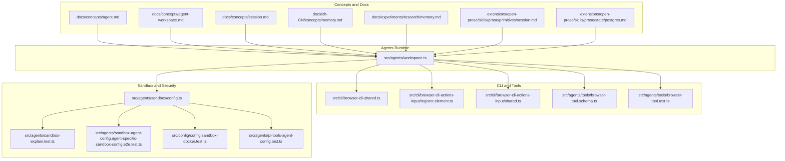
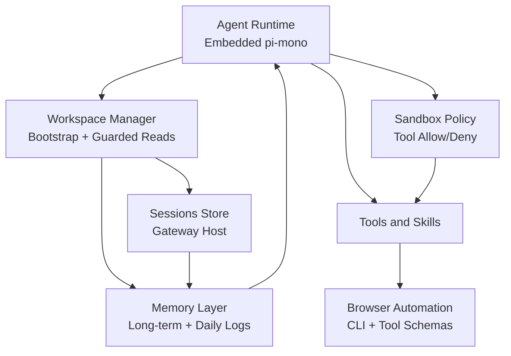
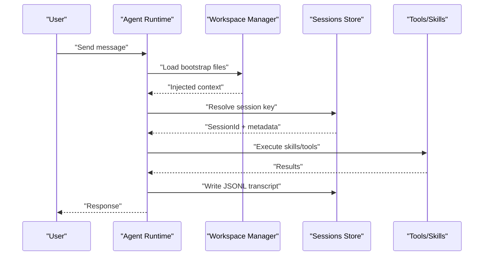
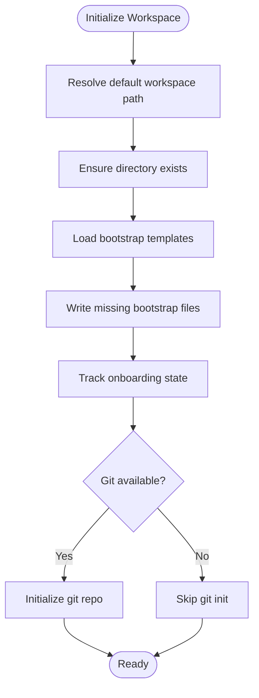
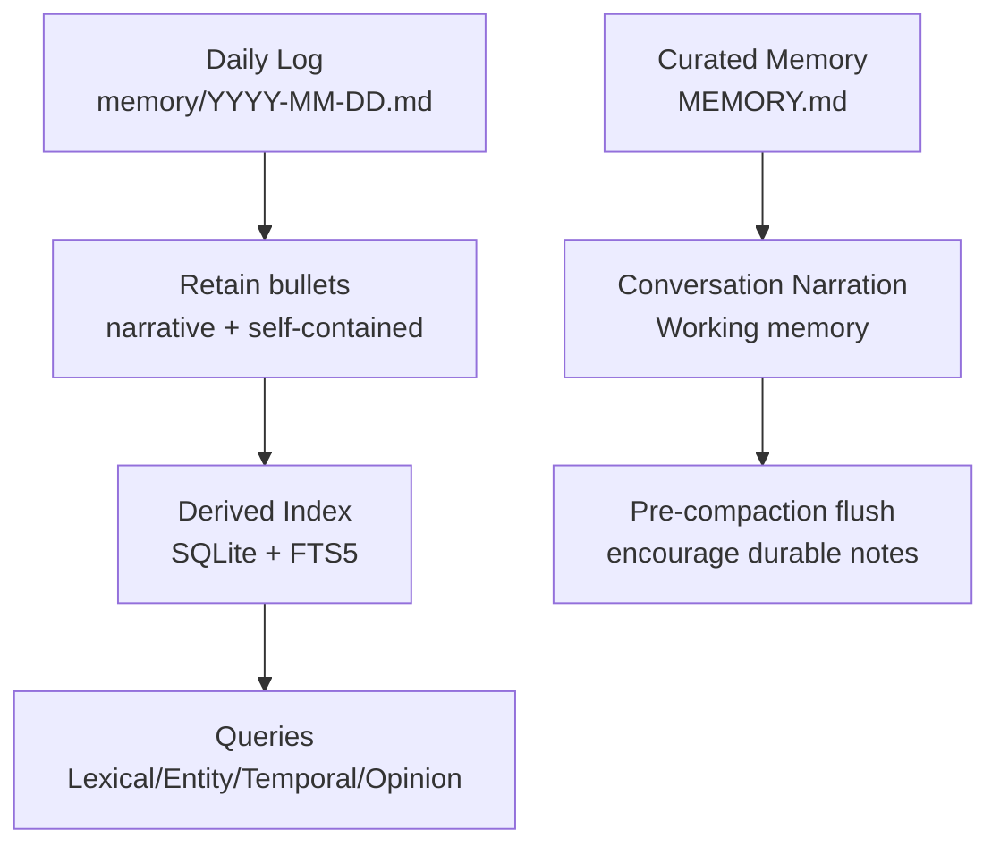
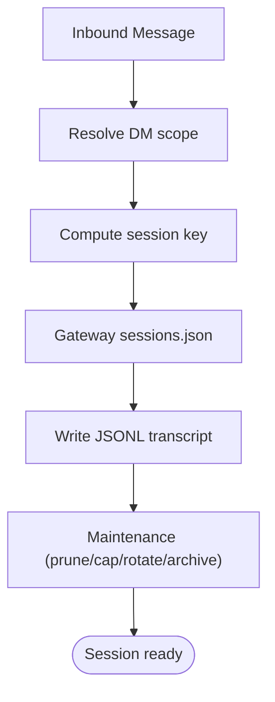
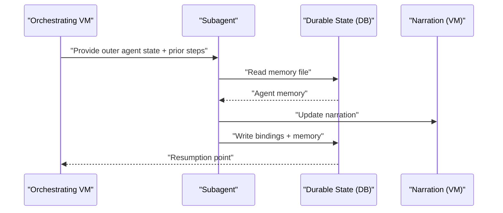
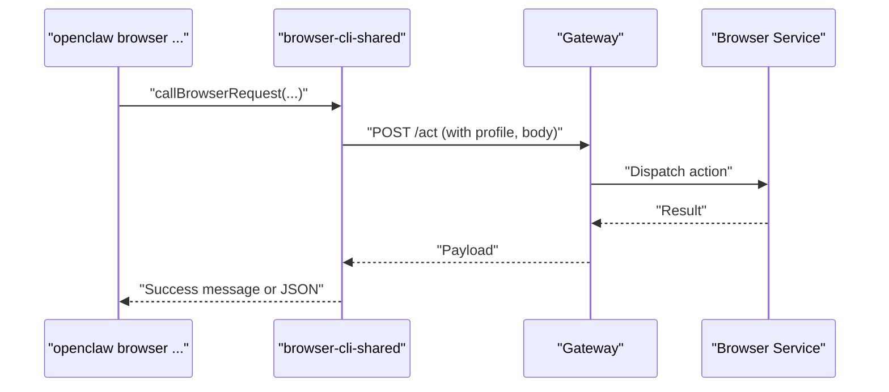
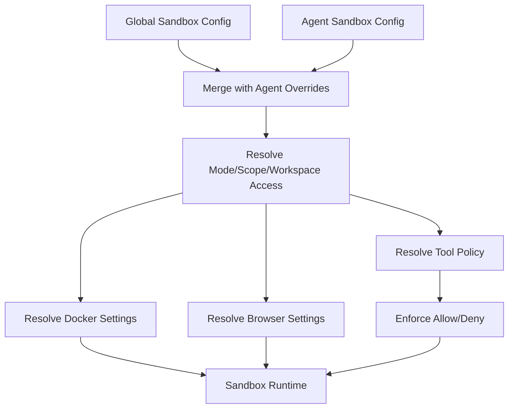
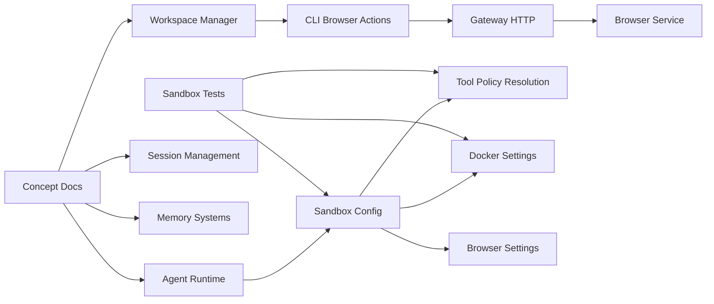

# Agent System

<cite>
**Referenced Files in This Document**
- [AGENTS.md](file://AGENTS.md)
- [agent.md](file://docs/concepts/agent.md)
- [agent-workspace.md](file://docs/concepts/agent-workspace.md)
- [session.md](file://docs/concepts/session.md)
- [memory.md](file://docs/zh-CN/concepts/memory.md)
- [memory.md](file://docs/experiments/research/memory.md)
- [session.md](file://extensions/open-prose/skills/prose/state/postgres.md)
- [session.md](file://extensions/open-prose/skills/prose/primitives/session.md)
- [workspace.ts](file://src/agents/workspace.ts)
- [browser-cli-shared.ts](file://src/cli/browser-cli-shared.ts)
- [register.element.ts](file://src/cli/browser-cli-actions-input/register.element.ts)
- [shared.ts](file://src/cli/browser-cli-actions-input/shared.ts)
- [browser-tool.schema.ts](file://src/agents/tools/browser-tool.schema.ts)
- [browser-tool.test.ts](file://src/agents/tools/browser-tool.test.ts)
- [config.sandbox-docker.test.ts](file://src/config/config.sandbox-docker.test.ts)
- [sandbox-explain.test.ts](file://src/agents/sandbox-explain.test.ts)
- [sandbox-agent-config.agent-specific-sandbox-config.e2e.test.ts](file://src/agents/sandbox-agent-config.agent-specific-sandbox-config.e2e.test.ts)
- [config.ts](file://src/agents/sandbox/config.ts)
- [pi-tools-agent-config.test.ts](file://src/agents/pi-tools-agent-config.test.ts)
</cite>

## Table of Contents
1. [Introduction](#introduction)
2. [Project Structure](#project-structure)
3. [Core Components](#core-components)
4. [Architecture Overview](#architecture-overview)
5. [Detailed Component Analysis](#detailed-component-analysis)
6. [Dependency Analysis](#dependency-analysis)
7. [Performance Considerations](#performance-considerations)
8. [Troubleshooting Guide](#troubleshooting-guide)
9. [Conclusion](#conclusion)
10. [Appendices](#appendices)

## Introduction
This document describes OpenClaw’s intelligent agent architecture and operational model. It covers the agent lifecycle, memory management, context processing, and session handling. It explains the agent runtime, workspace management, and skill execution patterns. It also documents memory systems (long-term and working memory), context preservation, session management, conversation state, and multi-agent coordination. The document addresses agent configuration, tool execution, and browser automation capabilities, and outlines agent security, sandboxing, and resource management. Finally, it provides examples of agent customization, skill development, and advanced agent patterns.

## Project Structure
OpenClaw organizes agent-related functionality across several domains:
- Concepts and documentation define runtime, workspace, session, and memory models.
- Core runtime and workspace bootstrap logic reside in the agents subsystem.
- CLI and tooling provide browser automation and session management utilities.
- Sandbox configuration and policy enforcement ensure security and resource control.

**Diagram sources**
- [agent.md](file://docs/concepts/agent.md#L1-L124)
- [agent-workspace.md](file://docs/concepts/agent-workspace.md#L1-L237)
- [session.md](file://docs/concepts/session.md#L1-L311)
- [memory.md](file://docs/zh-CN/concepts/memory.md#L1-L41)
- [memory.md](file://docs/experiments/research/memory.md#L63-L140)
- [session.md](file://extensions/open-prose/skills/prose/primitives/session.md#L1-L172)
- [session.md](file://extensions/open-prose/skills/prose/state/postgres.md#L606-L618)
- [workspace.ts](file://src/agents/workspace.ts#L1-L656)
- [browser-cli-shared.ts](file://src/cli/browser-cli-shared.ts#L30-L84)
- [register.element.ts](file://src/cli/browser-cli-actions-input/register.element.ts#L1-L39)
- [shared.ts](file://src/cli/browser-cli-actions-input/shared.ts#L1-L53)
- [browser-tool.schema.ts](file://src/agents/tools/browser-tool.schema.ts#L45-L83)
- [browser-tool.test.ts](file://src/agents/tools/browser-tool.test.ts#L1-L30)
- [config.ts](file://src/agents/sandbox/config.ts#L157-L216)
- [sandbox-explain.test.ts](file://src/agents/sandbox-explain.test.ts#L1-L34)
- [sandbox-agent-config.agent-specific-sandbox-config.e2e.test.ts](file://src/agents/sandbox-agent-config.agent-specific-sandbox-config.e2e.test.ts#L196-L254)
- [config.sandbox-docker.test.ts](file://src/config/config.sandbox-docker.test.ts#L1-L28)
- [pi-tools-agent-config.test.ts](file://src/agents/pi-tools-agent-config.test.ts#L570-L608)

**Section sources**
- [agent.md](file://docs/concepts/agent.md#L1-L124)
- [agent-workspace.md](file://docs/concepts/agent-workspace.md#L1-L237)
- [session.md](file://docs/concepts/session.md#L1-L311)
- [memory.md](file://docs/zh-CN/concepts/memory.md#L1-L41)
- [memory.md](file://docs/experiments/research/memory.md#L63-L140)
- [workspace.ts](file://src/agents/workspace.ts#L1-L656)

## Core Components
- Agent runtime and session bootstrap: The runtime is embedded and relies on workspace files and session storage. It injects bootstrap files into context and manages session transcripts.
- Workspace management: The workspace is the agent’s single working directory, with strict boundary checks and caching to prevent unauthorized access.
- Memory systems: Long-term memory (curated and daily logs) and working memory (conversation narration) are maintained and compacted.
- Session management: Sessions are keyed by transport and scope, persisted on the gateway host, and pruned according to policies.
- Tooling and browser automation: CLI commands and tool schemas enable controlled browser actions and element interactions.
- Sandbox and security: Sandbox configuration and tool policy resolution enforce isolation, resource limits, and capability restrictions.

**Section sources**
- [agent.md](file://docs/concepts/agent.md#L1-L124)
- [agent-workspace.md](file://docs/concepts/agent-workspace.md#L1-L237)
- [session.md](file://docs/concepts/session.md#L1-L311)
- [memory.md](file://docs/zh-CN/concepts/memory.md#L1-L41)
- [workspace.ts](file://src/agents/workspace.ts#L1-L656)

## Architecture Overview
The agent system integrates runtime, workspace, memory, sessions, tools, and sandboxing into a cohesive pipeline. The runtime initializes the agent, loads workspace bootstrap files, and coordinates tool execution and browser automation. Sessions are managed centrally on the gateway host, with transcripts and metadata stored separately. Memory is organized into durable and working layers, with compaction and retrieval mechanisms. Sandboxing controls tool capabilities and filesystem/workspace access.

**Diagram sources**
- [agent.md](file://docs/concepts/agent.md#L1-L124)
- [agent-workspace.md](file://docs/concepts/agent-workspace.md#L1-L237)
- [session.md](file://docs/concepts/session.md#L1-L311)
- [memory.md](file://docs/zh-CN/concepts/memory.md#L1-L41)
- [workspace.ts](file://src/agents/workspace.ts#L1-L656)
- [browser-cli-shared.ts](file://src/cli/browser-cli-shared.ts#L30-L84)
- [browser-tool.schema.ts](file://src/agents/tools/browser-tool.schema.ts#L45-L83)
- [config.ts](file://src/agents/sandbox/config.ts#L157-L216)

## Detailed Component Analysis

### Agent Runtime and Session Bootstrap
- The runtime uses a single embedded agent runtime derived from pi-mono and a workspace directory as the agent’s only working directory for tools and context.
- Bootstrap files (AGENTS.md, SOUL.md, TOOLS.md, IDENTITY.md, USER.md, HEARTBEAT.md, BOOTSTRAP.md) are injected into the agent context on the first turn of a new session.
- Session transcripts are stored as JSONL under the gateway’s sessions directory, with stable session IDs chosen by OpenClaw.
- Streaming behavior and block chunking are configurable, and queue modes influence how inbound messages are handled mid-run.

**Diagram sources**
- [agent.md](file://docs/concepts/agent.md#L73-L104)
- [session.md](file://docs/concepts/session.md#L64-L72)

**Section sources**
- [agent.md](file://docs/concepts/agent.md#L1-L124)
- [session.md](file://docs/concepts/session.md#L64-L104)

### Workspace Management
- The workspace is the agent’s default working directory. It is separate from configuration and sessions directories.
- Bootstrap files are guarded and cached by inode/dev/size/mtime identity to avoid stale reads and enforce boundary checks.
- Templates are loaded for missing bootstrap files, and onboarding state is tracked to avoid regenerating bootstrap content unnecessarily.
- Git initialization is attempted for brand-new workspaces if git is available.

**Diagram sources**
- [workspace.ts](file://src/agents/workspace.ts#L12-L449)

**Section sources**
- [agent-workspace.md](file://docs/concepts/agent-workspace.md#L1-L237)
- [workspace.ts](file://src/agents/workspace.ts#L1-L656)

### Memory Systems
- Long-term memory: curated files (MEMORY.md) and daily logs (memory/YYYY-MM-DD.md) provide durable knowledge and narrative continuity.
- Working memory: conversation narration retained in-context to avoid repeated queries.
- Memory compaction: periodic silent memory flushes encourage models to write durable notes to disk, preserving important context for future sessions.
- Derived store: optional SQLite-backed index with FTS5 and optional embeddings supports lexical, entity, temporal, and opinion-based recall.

**Diagram sources**
- [memory.md](file://docs/zh-CN/concepts/memory.md#L18-L41)
- [memory.md](file://docs/experiments/research/memory.md#L103-L140)

**Section sources**
- [memory.md](file://docs/zh-CN/concepts/memory.md#L1-L41)
- [memory.md](file://docs/experiments/research/memory.md#L63-L140)

### Session Management and Conversation State
- Session keys are derived from transports and scopes (direct messages vs group chats). DM scope options include continuity or per-user isolation.
- Gateway is the source of truth for session state; clients must query the gateway for session lists and token counts.
- Maintenance policies bound sessions.json and transcript artifacts, with dry-run previews and enforcement modes.
- Pruning trims old tool results from in-memory context before LLM calls; compaction reminders occur near auto-compaction windows.

**Diagram sources**
- [session.md](file://docs/concepts/session.md#L10-L72)
- [session.md](file://docs/concepts/session.md#L88-L120)

**Section sources**
- [session.md](file://docs/concepts/session.md#L1-L311)

### Multi-Agent Coordination
- Subagents and orchestration primitives operate within OpenProse programs, managing context layers and state persistence across sessions.
- Persistent agents maintain state across sessions via memory files and produce both bindings (task-specific) and memory (agent-specific) outputs.
- Coordination benefits from durable state (PostgreSQL) and narration (VM’s mental model), enabling resumption and inspection.

**Diagram sources**
- [session.md](file://extensions/open-prose/skills/prose/primitives/session.md#L16-L172)
- [session.md](file://extensions/open-prose/skills/prose/state/postgres.md#L606-L618)

**Section sources**
- [session.md](file://extensions/open-prose/skills/prose/primitives/session.md#L1-L172)
- [session.md](file://extensions/open-prose/skills/prose/state/postgres.md#L606-L618)

### Browser Automation and Tool Execution
- CLI browser actions delegate to the gateway via HTTP requests, supporting navigation, element interactions, snapshots, and evaluation.
- Tool schemas define structured inputs for browser actions (click, type, drag, select, wait, evaluate, etc.), with discriminators and optional fields.
- Tests validate client-side browser tool behavior and status reporting.

**Diagram sources**
- [browser-cli-shared.ts](file://src/cli/browser-cli-shared.ts#L30-L84)
- [register.element.ts](file://src/cli/browser-cli-actions-input/register.element.ts#L16-L39)
- [shared.ts](file://src/cli/browser-cli-actions-input/shared.ts#L25-L53)
- [browser-tool.schema.ts](file://src/agents/tools/browser-tool.schema.ts#L45-L83)

**Section sources**
- [browser-cli-shared.ts](file://src/cli/browser-cli-shared.ts#L30-L84)
- [register.element.ts](file://src/cli/browser-cli-actions-input/register.element.ts#L1-L39)
- [shared.ts](file://src/cli/browser-cli-actions-input/shared.ts#L1-L53)
- [browser-tool.schema.ts](file://src/agents/tools/browser-tool.schema.ts#L45-L83)
- [browser-tool.test.ts](file://src/agents/tools/browser-tool.test.ts#L1-L30)

### Sandbox and Security
- Sandbox configuration resolves mode, scope, workspace access, Docker and browser policies, and pruning rules, prioritizing agent-specific overrides over global defaults.
- Tool policy resolution combines agent and global allowances and denials, with explicit sources for tracing.
- Tests demonstrate preference ordering and pruning behavior, and restricted agent configurations.

**Diagram sources**
- [config.ts](file://src/agents/sandbox/config.ts#L157-L216)
- [sandbox-explain.test.ts](file://src/agents/sandbox-explain.test.ts#L7-L34)
- [sandbox-agent-config.agent-specific-sandbox-config.e2e.test.ts](file://src/agents/sandbox-agent-config.agent-specific-sandbox-config.e2e.test.ts#L196-L254)
- [config.sandbox-docker.test.ts](file://src/config/config.sandbox-docker.test.ts#L9-L28)
- [pi-tools-agent-config.test.ts](file://src/agents/pi-tools-agent-config.test.ts#L570-L608)

**Section sources**
- [config.ts](file://src/agents/sandbox/config.ts#L157-L216)
- [sandbox-explain.test.ts](file://src/agents/sandbox-explain.test.ts#L1-L34)
- [sandbox-agent-config.agent-specific-sandbox-config.e2e.test.ts](file://src/agents/sandbox-agent-config.agent-specific-sandbox-config.e2e.test.ts#L196-L254)
- [config.sandbox-docker.test.ts](file://src/config/config.sandbox-docker.test.ts#L1-L28)
- [pi-tools-agent-config.test.ts](file://src/agents/pi-tools-agent-config.test.ts#L570-L608)

### Agent Customization and Advanced Patterns
- Customization via workspace files: AGENTS.md, SOUL.md, TOOLS.md, USER.md, IDENTITY.md, HEARTBEAT.md, BOOTSTRAP.md, and MEMORY.md shape agent behavior and memory.
- Skill development: Skills are loaded from bundled, managed/local, and workspace locations, with overrides and gating by configuration.
- Advanced patterns: Subagent orchestration with persistent state, durable coordination via databases, and narration-driven working memory enable sophisticated multi-step reasoning and continuity.

**Section sources**
- [agent.md](file://docs/concepts/agent.md#L56-L64)
- [session.md](file://extensions/open-prose/skills/prose/primitives/session.md#L16-L172)
- [session.md](file://extensions/open-prose/skills/prose/state/postgres.md#L606-L618)

## Dependency Analysis
The agent system exhibits clear separation of concerns:
- Concepts and docs define the runtime, workspace, session, and memory contracts.
- Workspace management depends on boundary-safe file access and caching.
- CLI and tools depend on gateway HTTP requests and tool schemas.
- Sandbox configuration depends on layered policy resolution and tests validate behavior.

**Diagram sources**
- [agent.md](file://docs/concepts/agent.md#L1-L124)
- [agent-workspace.md](file://docs/concepts/agent-workspace.md#L1-L237)
- [session.md](file://docs/concepts/session.md#L1-L311)
- [memory.md](file://docs/zh-CN/concepts/memory.md#L1-L41)
- [workspace.ts](file://src/agents/workspace.ts#L1-L656)
- [browser-cli-shared.ts](file://src/cli/browser-cli-shared.ts#L30-L84)
- [config.ts](file://src/agents/sandbox/config.ts#L157-L216)
- [sandbox-explain.test.ts](file://src/agents/sandbox-explain.test.ts#L1-L34)

**Section sources**
- [agent.md](file://docs/concepts/agent.md#L1-L124)
- [agent-workspace.md](file://docs/concepts/agent-workspace.md#L1-L237)
- [session.md](file://docs/concepts/session.md#L1-L311)
- [memory.md](file://docs/zh-CN/concepts/memory.md#L1-L41)
- [workspace.ts](file://src/agents/workspace.ts#L1-L656)
- [browser-cli-shared.ts](file://src/cli/browser-cli-shared.ts#L30-L84)
- [config.ts](file://src/agents/sandbox/config.ts#L157-L216)
- [sandbox-explain.test.ts](file://src/agents/sandbox-explain.test.ts#L1-L34)

## Performance Considerations
- Session store maintenance: Tune pruneAfter, maxEntries, rotateBytes, and maxDiskBytes to bound growth and reduce write latency.
- Streaming and chunking: Adjust block streaming boundaries and chunk sizes to balance responsiveness and throughput.
- Workspace caching: Rely on cached bootstrap reads to minimize IO overhead.
- Sandbox overhead: Prefer minimal tool allowances and constrained workspace access to reduce container overhead.

[No sources needed since this section provides general guidance]

## Troubleshooting Guide
- Session state discrepancies: Query the gateway for session lists and token counts rather than parsing JSONL locally.
- Browser automation errors: Validate CLI parameters and timeouts; ensure gateway can route requests to the browser service.
- Sandbox policy issues: Confirm agent-specific overrides take precedence over global defaults; inspect resolved tool policy sources.
- Workspace bootstrap problems: Verify guarded reads and boundary checks; ensure templates are packaged and readable.

**Section sources**
- [session.md](file://docs/concepts/session.md#L57-L72)
- [browser-cli-shared.ts](file://src/cli/browser-cli-shared.ts#L30-L84)
- [sandbox-explain.test.ts](file://src/agents/sandbox-explain.test.ts#L7-L34)
- [workspace.ts](file://src/agents/workspace.ts#L48-L88)

## Conclusion
OpenClaw’s agent system integrates a robust runtime, workspace, memory, and session model with strong security via sandboxing and controlled tooling. The architecture supports multi-agent coordination, browser automation, and scalable session management, while emphasizing privacy, performance, and maintainability.

[No sources needed since this section summarizes without analyzing specific files]

## Appendices
- Additional repository guidelines and operational notes are documented in AGENTS.md, including multi-agent safety, release procedures, and troubleshooting tips.

**Section sources**
- [AGENTS.md](file://AGENTS.md#L199-L296)