# Agent System

<cite>
**Referenced Files in This Document**
- [AGENTS.md](file://AGENTS.md)
- [agent.md](file://docs/concepts/agent.md)
- [agent-loop.md](file://docs/concepts/agent-loop.md)
- [agent-workspace.md](file://docs/concepts/agent-workspace.md)
- [multi-agent.md](file://docs/concepts/multi-agent.md)
- [memory.md](file://docs/concepts/memory.md)
- [skills.md](file://docs/tools/skills.md)
- [agent.md (CLI)](file://docs/cli/agent.md)
- [skills.md (CLI)](file://docs/cli/skills.md)
- [types.agents-shared.ts](file://src/config/types.agents-shared.ts)
- [sandbox-agent-config.agent-specific-sandbox-config.e2e.test.ts](file://src/agents/sandbox-agent-config.agent-specific-sandbox-config.e2e.test.ts)
- [thinking.test.ts](file://src/auto-reply/thinking.test.ts)
- [get-reply-directives-apply.ts](file://src/auto-reply/reply/get-reply-directives-apply.ts)
- [reasoning-lane-coordinator.test.ts](file://extensions/telegram/src/reasoning-lane-coordinator.test.ts)
- [39-architect-by-simulation.prose](file://extensions/open-prose/skills/prose/examples/39-architect-by-simulation.prose)
- [02-research-and-summarize.prose](file://extensions/open-prose/skills/prose/examples/02-research-and-summarize.prose)
- [postgres.md](file://extensions/open-prose/skills/prose/state/postgres.md)
</cite>

## Table of Contents
1. [Introduction](#introduction)
2. [Project Structure](#project-structure)
3. [Core Components](#core-components)
4. [Architecture Overview](#architecture-overview)
5. [Detailed Component Analysis](#detailed-component-analysis)
6. [Dependency Analysis](#dependency-analysis)
7. [Performance Considerations](#performance-considerations)
8. [Troubleshooting Guide](#troubleshooting-guide)
9. [Conclusion](#conclusion)
10. [Appendices](#appendices)

## Introduction
This document explains OpenClaw’s agent system: how agents are configured, how workspaces and sessions relate, how multi-agent routing isolates brains and credentials, and how AI-powered decision-making is orchestrated end-to-end. It covers the agent scope system, model integration, memory capabilities, and the skills platform (bundled, managed, workspace). Practical examples demonstrate configuration, workspace customization, and skill development. Security and sandboxing are addressed alongside agent loops, thinking modes, and response generation. Guidance is included for troubleshooting, performance optimization, and advanced configuration for experienced users.

## Project Structure
OpenClaw organizes agent behavior across concepts, CLI, and runtime configuration:
- Concepts define agent runtime, workspace, multi-agent routing, agent loop lifecycle, and memory.
- CLI provides operational commands for agent turns and skills inspection.
- Runtime configuration types define agent-level sandbox and model settings.

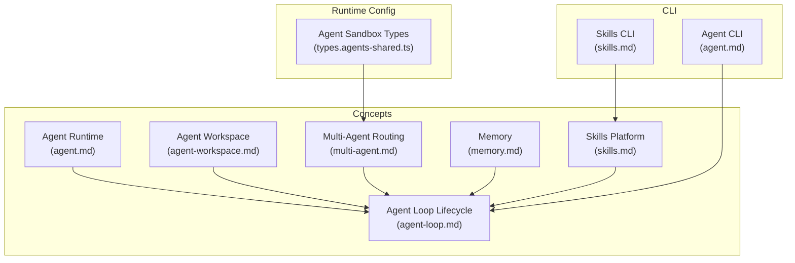
```mermaid
graph TB
subgraph "Concepts"
A["Agent Runtime<br/>(agent.md)"]
B["Agent Workspace<br/>(agent-workspace.md)"]
C["Multi-Agent Routing<br/>(multi-agent.md)"]
D["Agent Loop Lifecycle<br/>(agent-loop.md)"]
E["Memory<br/>(memory.md)"]
F["Skills Platform<br/>(skills.md)"]
end
subgraph "CLI"
G["Agent CLI<br/>(agent.md)"]
H["Skills CLI<br/>(skills.md)"]
end
subgraph "Runtime Config"
I["Agent Sandbox Types<br/>(types.agents-shared.ts)"]
end
A --> D
B --> D
C --> D
E --> D
F --> D
G --> D
H --> F
I --> C
```

**Diagram sources**
- [agent.md:1-124](file://docs/concepts/agent.md#L1-L124)
- [agent-workspace.md:1-237](file://docs/concepts/agent-workspace.md#L1-L237)
- [multi-agent.md:1-553](file://docs/concepts/multi-agent.md#L1-L553)
- [agent-loop.md:1-149](file://docs/concepts/agent-loop.md#L1-L149)
- [memory.md:1-803](file://docs/concepts/memory.md#L1-L803)
- [skills.md:1-303](file://docs/tools/skills.md#L1-L303)
- [agent.md (CLI):1-30](file://docs/cli/agent.md#L1-L30)
- [skills.md (CLI):1-27](file://docs/cli/skills.md#L1-L27)
- [types.agents-shared.ts:1-42](file://src/config/types.agents-shared.ts#L1-L42)

**Section sources**
- [agent.md:1-124](file://docs/concepts/agent.md#L1-L124)
- [agent-workspace.md:1-237](file://docs/concepts/agent-workspace.md#L1-L237)
- [multi-agent.md:1-553](file://docs/concepts/multi-agent.md#L1-L553)
- [agent-loop.md:1-149](file://docs/concepts/agent-loop.md#L1-L149)
- [memory.md:1-803](file://docs/concepts/memory.md#L1-L803)
- [skills.md:1-303](file://docs/tools/skills.md#L1-L303)
- [agent.md (CLI):1-30](file://docs/cli/agent.md#L1-L30)
- [skills.md (CLI):1-27](file://docs/cli/skills.md#L1-L27)
- [types.agents-shared.ts:1-42](file://src/config/types.agents-shared.ts#L1-L42)

## Core Components
- Agent runtime and workspace: OpenClaw runs a single embedded agent runtime with a workspace as the agent’s only working directory. Bootstrap files are injected into the agent context on session start.
- Multi-agent routing: multiple isolated agents (workspaces + agentDirs + sessions) with per-agent credentials and skills.
- Agent loop: end-to-end lifecycle from intake to persistence, with streaming and lifecycle events.
- Memory: Markdown-based memory with automatic flush and vector search backends.
- Skills: three-layer loading (bundled → managed → workspace) with gating and environment injection.
- Sandbox and tool policy: per-agent sandbox configuration and tool allow/deny lists.

**Section sources**
- [agent.md:8-124](file://docs/concepts/agent.md#L8-L124)
- [agent-workspace.md:9-237](file://docs/concepts/agent-workspace.md#L9-L237)
- [multi-agent.md:8-553](file://docs/concepts/multi-agent.md#L8-L553)
- [agent-loop.md:8-149](file://docs/concepts/agent-loop.md#L8-L149)
- [memory.md:9-803](file://docs/concepts/memory.md#L9-L803)
- [skills.md:9-303](file://docs/tools/skills.md#L9-L303)
- [types.agents-shared.ts:17-42](file://src/config/types.agents-shared.ts#L17-L42)

## Architecture Overview
The agent system orchestrates a deterministic loop per session, bridging model inference, tool execution, and persistence. Routing determines which agent handles inbound messages. Memory and skills inform the system prompt. Sandboxing constrains tool execution when enabled.

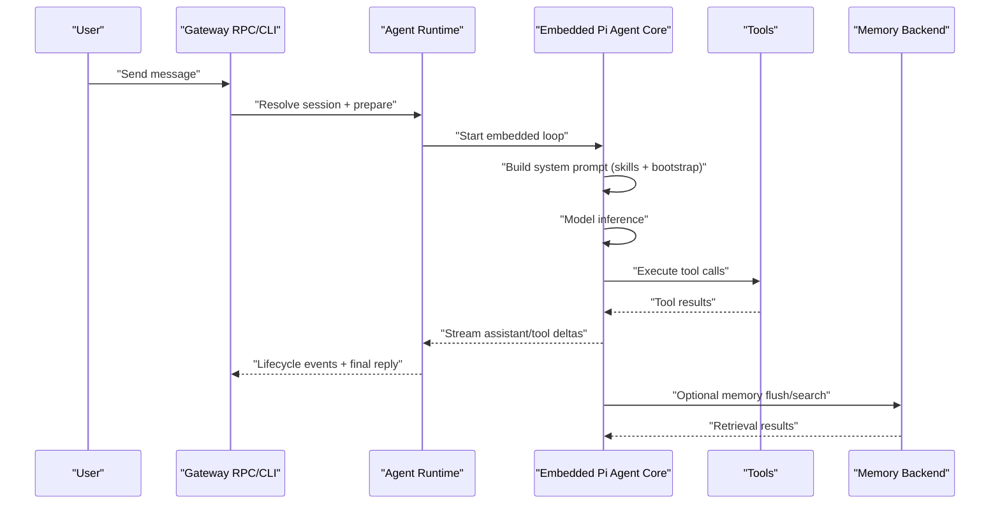
```mermaid
sequenceDiagram
participant User as "User"
participant Gateway as "Gateway RPC/CLI"
participant Agent as "Agent Runtime"
participant PI as "Embedded Pi Agent Core"
participant Tools as "Tools"
participant Memory as "Memory Backend"
User->>Gateway : "Send message"
Gateway->>Agent : "Resolve session + prepare"
Agent->>PI : "Start embedded loop"
PI->>PI : "Build system prompt (skills + bootstrap)"
PI->>PI : "Model inference"
PI->>Tools : "Execute tool calls"
Tools-->>PI : "Tool results"
PI-->>Agent : "Stream assistant/tool deltas"
Agent-->>Gateway : "Lifecycle events + final reply"
PI->>Memory : "Optional memory flush/search"
Memory-->>PI : "Retrieval results"
```

**Diagram sources**
- [agent-loop.md:18-149](file://docs/concepts/agent-loop.md#L18-L149)
- [agent.md:73-104](file://docs/concepts/agent.md#L73-L104)
- [memory.md:54-92](file://docs/concepts/memory.md#L54-L92)

**Section sources**
- [agent-loop.md:18-149](file://docs/concepts/agent-loop.md#L18-L149)
- [agent.md:73-104](file://docs/concepts/agent.md#L73-L104)
- [memory.md:54-92](file://docs/concepts/memory.md#L54-L92)

## Detailed Component Analysis

### Agent Configuration and Workspace Management
- Workspace location and layout: default path, profile-aware naming, and migration guidance. Treat workspace as private memory and back it up in a private git repo.
- Bootstrap files: AGENTS.md, SOUL.md, USER.md, IDENTITY.md, TOOLS.md, BOOT.md, BOOTSTRAP.md, and daily/long-term memory files are injected into context.
- Session storage: JSONL transcripts under the agent’s sessions directory with stable session IDs.

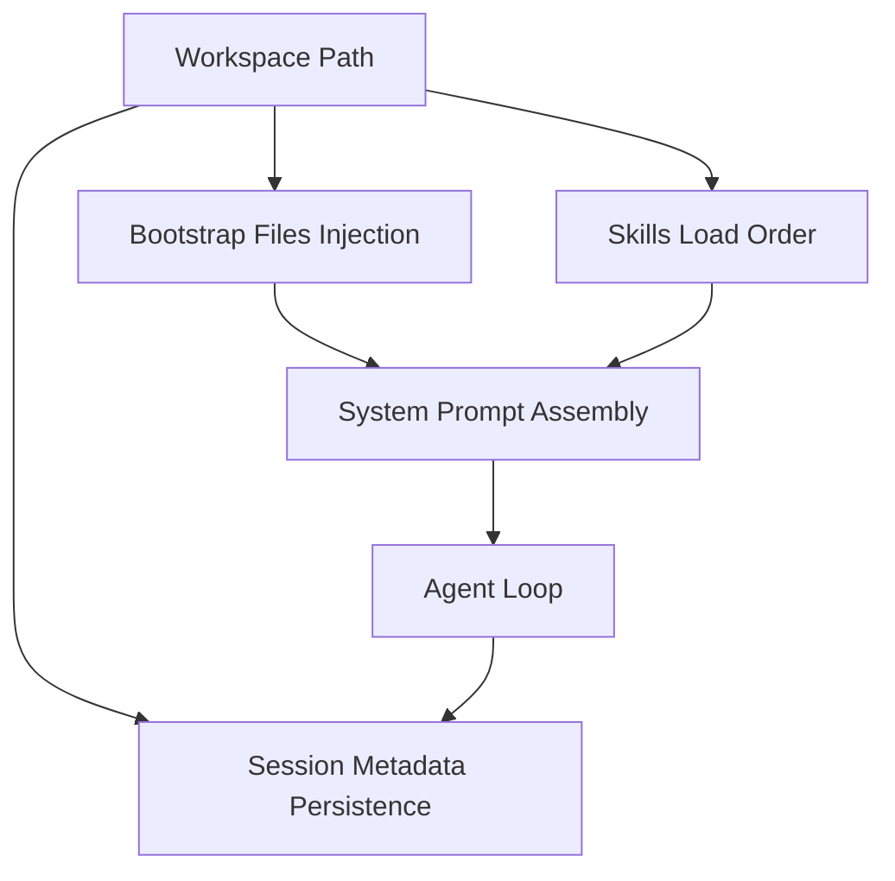
```mermaid
flowchart TD
WS["Workspace Path"] --> BS["Bootstrap Files Injection"]
WS --> SK["Skills Load Order"]
WS --> SM["Session Metadata Persistence"]
BS --> CTX["System Prompt Assembly"]
SK --> CTX
CTX --> RUN["Agent Loop"]
RUN --> SM
```

**Diagram sources**
- [agent-workspace.md:24-125](file://docs/concepts/agent-workspace.md#L24-L125)
- [agent.md:24-41](file://docs/concepts/agent.md#L24-L41)
- [agent-loop.md:52-63](file://docs/concepts/agent-loop.md#L52-L63)

**Section sources**
- [agent-workspace.md:24-125](file://docs/concepts/agent-workspace.md#L24-L125)
- [agent.md:24-41](file://docs/concepts/agent.md#L24-L41)
- [agent-loop.md:52-63](file://docs/concepts/agent-loop.md#L52-L63)

### Multi-Agent Routing and Agent Scope System
- Agent scope: workspace, agentDir, and session store per agentId. Credentials are per-agent and not shared automatically.
- Routing: bindings match inbound messages to agentId by channel/account/peer and optionally guild/team ids. Most-specific wins.
- Per-agent sandbox and tool configuration: agents can override sandbox mode, scope, and tool allow/deny lists.

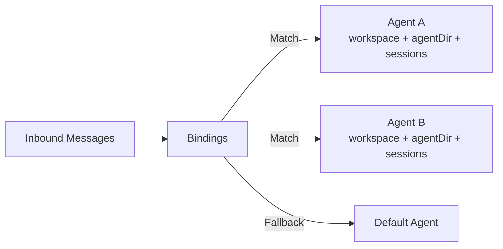
```mermaid
graph LR
IN["Inbound Messages"] --> BR["Bindings"]
BR --> |Match| AG1["Agent A<br/>workspace + agentDir + sessions"]
BR --> |Match| AG2["Agent B<br/>workspace + agentDir + sessions"]
BR --> |Fallback| DEF["Default Agent"]
```

**Diagram sources**
- [multi-agent.md:172-193](file://docs/concepts/multi-agent.md#L172-L193)
- [multi-agent.md:502-550](file://docs/concepts/multi-agent.md#L502-L550)

**Section sources**
- [multi-agent.md:10-553](file://docs/concepts/multi-agent.md#L10-L553)
- [types.agents-shared.ts:17-42](file://src/config/types.agents-shared.ts#L17-L42)
- [sandbox-agent-config.agent-specific-sandbox-config.e2e.test.ts:196-376](file://src/agents/sandbox-agent-config.agent-specific-sandbox-config.e2e.test.ts#L196-L376)

### Model Integration and Thinking Modes
- Model references: parse provider/model with first-slash semantics; aliases use default provider when no slash is present.
- Thinking modes: normalized labels and defaults per model/provider. CLI supports explicit thinking level selection.
- Response directives: reasoning and verbose levels influence reply shaping and directive application.

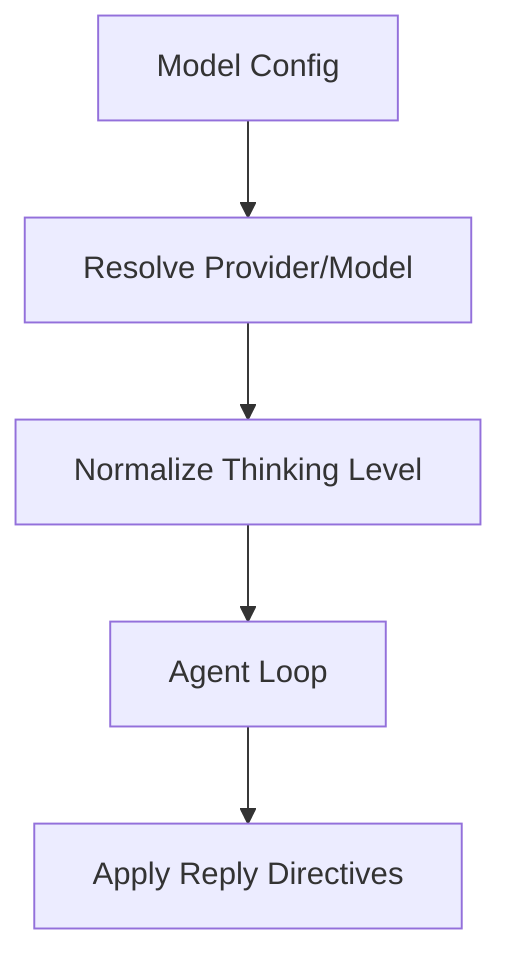
```mermaid
flowchart TD
CFG["Model Config"] --> RES["Resolve Provider/Model"]
RES --> THINK["Normalize Thinking Level"]
THINK --> LOOP["Agent Loop"]
LOOP --> RESP["Apply Reply Directives"]
```

**Diagram sources**
- [agent.md:106-113](file://docs/concepts/agent.md#L106-L113)
- [thinking.test.ts:14-34](file://src/auto-reply/thinking.test.ts#L14-L34)
- [get-reply-directives-apply.ts:180-202](file://src/auto-reply/reply/get-reply-directives-apply.ts#L180-L202)

**Section sources**
- [agent.md:106-113](file://docs/concepts/agent.md#L106-L113)
- [thinking.test.ts:14-34](file://src/auto-reply/thinking.test.ts#L14-L34)
- [get-reply-directives-apply.ts:180-202](file://src/auto-reply/reply/get-reply-directives-apply.ts#L180-L202)

### Memory Capabilities
- Memory files: daily logs and curated long-term memory; automatic pre-compaction flush prompts the agent to store durable memories.
- Backends: SQLite vector index with optional sqlite-vec acceleration; hybrid search (vector + BM25) with optional MMR and temporal decay.
- QMD backend: optional sidecar for BM25 + vectors + reranking with session indexing.

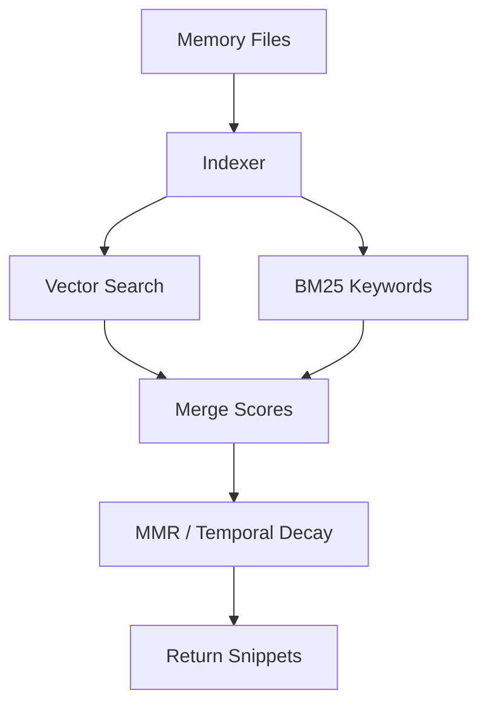
```mermaid
flowchart TD
MEM["Memory Files"] --> IDX["Indexer"]
IDX --> VEC["Vector Search"]
IDX --> TXT["BM25 Keywords"]
VEC --> MERGE["Merge Scores"]
TXT --> MERGE
MERGE --> RANK["MMR / Temporal Decay"]
RANK --> OUT["Return Snippets"]
```

**Diagram sources**
- [memory.md:448-513](file://docs/concepts/memory.md#L448-L513)
- [memory.md:524-608](file://docs/concepts/memory.md#L524-L608)
- [memory.md:641-677](file://docs/concepts/memory.md#L641-L677)

**Section sources**
- [memory.md:448-608](file://docs/concepts/memory.md#L448-L608)
- [memory.md:641-677](file://docs/concepts/memory.md#L641-L677)

### Skills Platform
- Loading precedence: workspace skills override managed skills, which override bundled skills.
- Gating: bins/env/config requirements and platform filters; sandbox constraints for binaries.
- Environment injection: per-run env and apiKey injection for eligible skills.
- Snapshot and hot reload: session snapshot of eligible skills; watcher refreshes on changes.

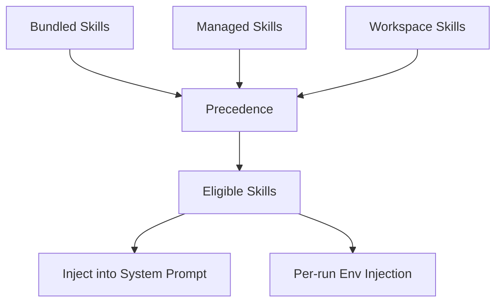
```mermaid
flowchart TD
BUND["Bundled Skills"] --> PRE["Precedence"]
MAN["Managed Skills"] --> PRE
WS["Workspace Skills"] --> PRE
PRE --> ELIG["Eligible Skills"]
ELIG --> PROMPT["Inject into System Prompt"]
ELIG --> RUNTIME["Per-run Env Injection"]
```

**Diagram sources**
- [skills.md:13-40](file://docs/tools/skills.md#L13-L40)
- [skills.md:106-147](file://docs/tools/skills.md#L106-L147)
- [skills.md:230-247](file://docs/tools/skills.md#L230-L247)

**Section sources**
- [skills.md:13-40](file://docs/tools/skills.md#L13-L40)
- [skills.md:106-147](file://docs/tools/skills.md#L106-L147)
- [skills.md:230-247](file://docs/tools/skills.md#L230-L247)

### Agent Loop, Sessions, and Response Generation
- Entry points: Gateway RPC and CLI; lifecycle events include start/end/error.
- Queueing: serialized runs per session key; queue modes steer/followup/collect.
- Streaming: assistant deltas and tool events; block streaming and partial replies.
- Reply shaping: final payloads assemble assistant text, reasoning, and tool summaries; suppression of NO_REPLY and duplicate messaging tool outputs.

```mermaid
sequenceDiagram
participant CLI as "CLI/Gateway"
participant LOOP as "Agent Loop"
participant PI as "Pi Agent Core"
participant CH as "Channel"
CLI->>LOOP : "Start agent"
LOOP->>PI : "Run embedded loop"
PI-->>LOOP : "Tool events"
PI-->>LOOP : "Assistant deltas"
LOOP-->>CH : "Stream tool/assistant"
LOOP-->>CLI : "Lifecycle end/error"
```

**Diagram sources**
- [agent-loop.md:18-149](file://docs/concepts/agent-loop.md#L18-L149)

**Section sources**
- [agent-loop.md:18-149](file://docs/concepts/agent-loop.md#L18-L149)

### Practical Examples
- Multi-agent orchestration with persistent agents and memory: examples demonstrate architect/phase executor patterns and captain’s chair with retrospective learning.
- Project-scoped and user-scoped agent memory: guidelines and run_id scoping for persistence across runs.

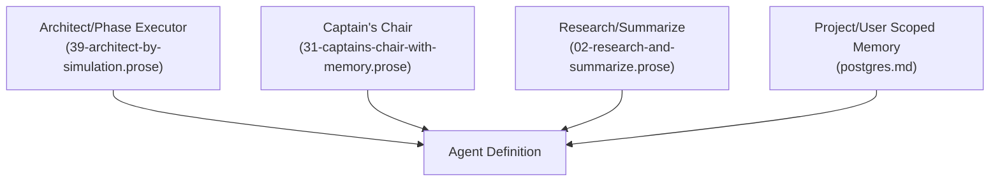
```mermaid
graph TB
EX1["Architect/Phase Executor<br/>(39-architect-by-simulation.prose)"]
EX2["Captain's Chair<br/>(31-captains-chair-with-memory.prose)"]
EX3["Research/Summarize<br/>(02-research-and-summarize.prose)"]
EX4["Project/User Scoped Memory<br/>(postgres.md)"]
EX1 --> AG["Agent Definition"]
EX2 --> AG
EX3 --> AG
EX4 --> AG
```

**Diagram sources**
- [39-architect-by-simulation.prose:29-64](file://extensions/open-prose/skills/prose/examples/39-architect-by-simulation.prose#L29-L64)
- [31-captains-chair-with-memory.prose:1-41](file://extensions/open-prose/skills/prose/examples/31-captains-chair-with-memory.prose#L1-L41)
- [02-research-and-summarize.prose:1-6](file://extensions/open-prose/skills/prose/examples/02-research-and-summarize.prose#L1-L6)
- [postgres.md:709-747](file://extensions/open-prose/skills/prose/state/postgres.md#L709-L747)

**Section sources**
- [39-architect-by-simulation.prose:29-64](file://extensions/open-prose/skills/prose/examples/39-architect-by-simulation.prose#L29-L64)
- [31-captains-chair-with-memory.prose:1-41](file://extensions/open-prose/skills/prose/examples/31-captains-chair-with-memory.prose#L1-L41)
- [02-research-and-summarize.prose:1-6](file://extensions/open-prose/skills/prose/examples/02-research-and-summarize.prose#L1-L6)
- [postgres.md:709-747](file://extensions/open-prose/skills/prose/state/postgres.md#L709-L747)

### Agent Isolation, Sandboxing, and Security
- Workspace is default cwd, not a hard sandbox; use sandboxing for isolation.
- Per-agent sandbox: mode, scope, workspace access, and tool allow/deny lists; agent-specific overrides preferred.
- Tool policy: global vs per-agent; agent-to-agent messaging requires explicit allowlist.

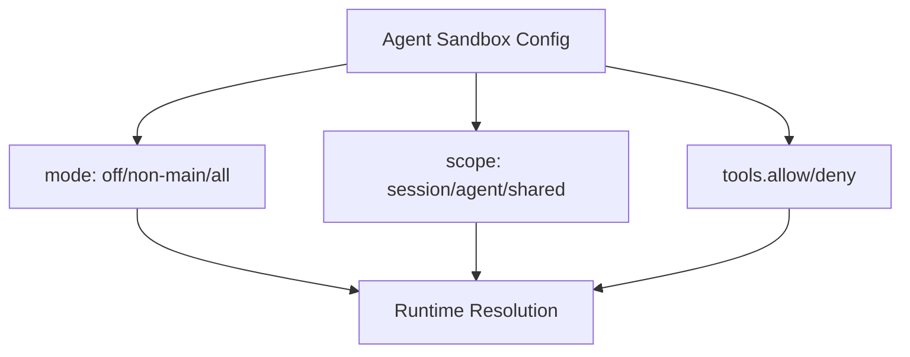
```mermaid
flowchart TD
CFG["Agent Sandbox Config"] --> MODE["mode: off/non-main/all"]
CFG --> SCOPE["scope: session/agent/shared"]
CFG --> TOOLS["tools.allow/deny"]
MODE --> RUN["Runtime Resolution"]
SCOPE --> RUN
TOOLS --> RUN
```

**Diagram sources**
- [multi-agent.md:502-550](file://docs/concepts/multi-agent.md#L502-L550)
- [types.agents-shared.ts:17-42](file://src/config/types.agents-shared.ts#L17-L42)
- [sandbox-agent-config.agent-specific-sandbox-config.e2e.test.ts:211-232](file://src/agents/sandbox-agent-config.agent-specific-sandbox-config.e2e.test.ts#L211-L232)

**Section sources**
- [multi-agent.md:502-550](file://docs/concepts/multi-agent.md#L502-L550)
- [types.agents-shared.ts:17-42](file://src/config/types.agents-shared.ts#L17-L42)
- [sandbox-agent-config.agent-specific-sandbox-config.e2e.test.ts:211-232](file://src/agents/sandbox-agent-config.agent-specific-sandbox-config.e2e.test.ts#L211-L232)

### Relationship Between Agents, Sessions, and Workspaces
- Each agentId has a dedicated workspace, agentDir, and session store.
- Sessions are keyed by agentId and mainKey; direct chats collapse to the agent’s main session key.
- Routing binds channel accounts and peers to agentIds deterministically.

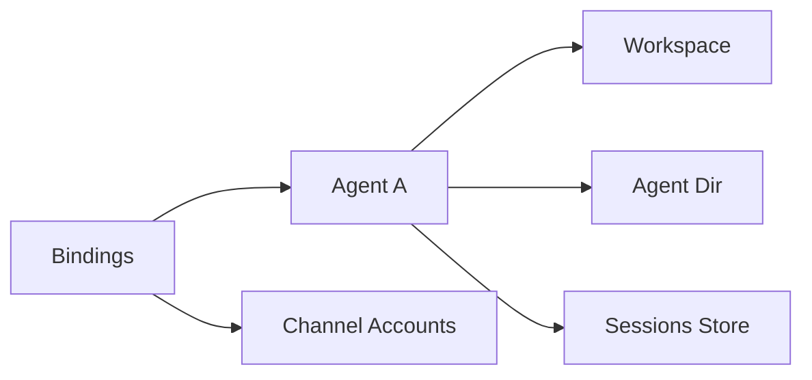
```mermaid
graph LR
AG["Agent A"] --> WS["Workspace"]
AG --> AD["Agent Dir"]
AG --> SS["Sessions Store"]
BR["Bindings"] --> AG
BR --> ACC["Channel Accounts"]
```

**Diagram sources**
- [multi-agent.md:12-38](file://docs/concepts/multi-agent.md#L12-L38)
- [multi-agent.md:172-193](file://docs/concepts/multi-agent.md#L172-L193)

**Section sources**
- [multi-agent.md:12-38](file://docs/concepts/multi-agent.md#L12-L38)
- [multi-agent.md:172-193](file://docs/concepts/multi-agent.md#L172-L193)

## Dependency Analysis
- Agent runtime depends on skills snapshot, bootstrap context, and model resolution.
- Memory backends depend on embedding providers and optional sqlite-vec.
- Routing depends on bindings and channel account configurations.
- Sandbox configuration depends on agent-specific overrides and global defaults.

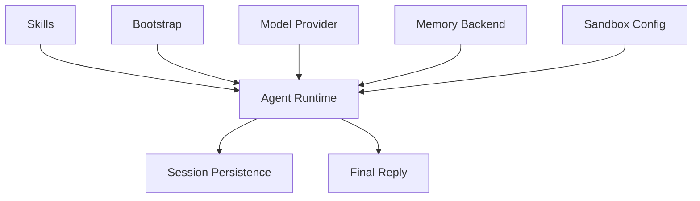
```mermaid
graph TB
SK["Skills"] --> RT["Agent Runtime"]
BS["Bootstrap"] --> RT
MD["Model Provider"] --> RT
MEM["Memory Backend"] --> RT
SB["Sandbox Config"] --> RT
RT --> SESS["Session Persistence"]
RT --> OUT["Final Reply"]
```

**Diagram sources**
- [agent-loop.md:52-63](file://docs/concepts/agent-loop.md#L52-L63)
- [memory.md:94-128](file://docs/concepts/memory.md#L94-L128)
- [multi-agent.md:502-550](file://docs/concepts/multi-agent.md#L502-L550)

**Section sources**
- [agent-loop.md:52-63](file://docs/concepts/agent-loop.md#L52-L63)
- [memory.md:94-128](file://docs/concepts/memory.md#L94-L128)
- [multi-agent.md:502-550](file://docs/concepts/multi-agent.md#L502-L550)

## Performance Considerations
- Skills token impact: compact XML list injected into system prompt; overhead scales with number of skills.
- Memory search: hybrid search (vector + BM25) with optional MMR and temporal decay; embedding cache reduces re-embedding.
- Streaming and block replies: tune chunk sizes and coalescing to reduce single-line spam and improve throughput.
- Sandbox setup: docker setupCommand runs once per container; ensure network egress and writable root for package installs.

[No sources needed since this section provides general guidance]

## Troubleshooting Guide
- Agent CLI: use agent command to run a single turn; markers for secretrefs are persisted non-secretly.
- Skills inspection: list eligible skills, check requirements, and verify environment injection.
- Multi-agent safety: avoid cross-cutting state changes; keep unrelated WIP untouched; restart apps via the app or scripts.
- Reasoning output: channel-specific handling for reasoning tags; ensure proper formatting for Telegram.

**Section sources**
- [agent.md (CLI):18-30](file://docs/cli/agent.md#L18-L30)
- [skills.md (CLI):19-27](file://docs/cli/skills.md#L19-L27)
- [AGENTS.md:268-286](file://AGENTS.md#L268-L286)
- [reasoning-lane-coordinator.test.ts:1-29](file://extensions/telegram/src/reasoning-lane-coordinator.test.ts#L1-L29)

## Conclusion
OpenClaw’s agent system integrates a deterministic loop, robust workspace and memory management, a flexible skills platform, and strong multi-agent isolation via routing and sandboxing. Operators can configure agents, customize workspaces, and develop skills while maintaining security and performance. The provided examples and references offer practical pathways to build and scale agent-driven workflows.

[No sources needed since this section summarizes without analyzing specific files]

## Appendices
- Agent CLI reference and examples for sending agent turns and delivering replies.
- Skills CLI reference for listing, checking, and understanding eligibility.

**Section sources**
- [agent.md (CLI):17-30](file://docs/cli/agent.md#L17-L30)
- [skills.md (CLI):19-27](file://docs/cli/skills.md#L19-L27)