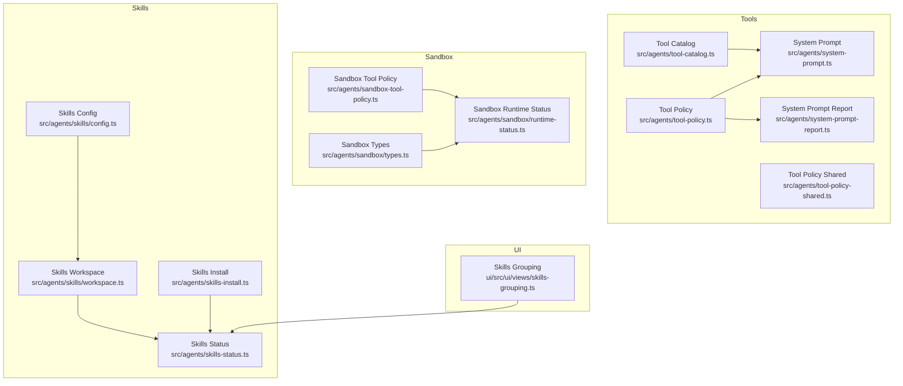
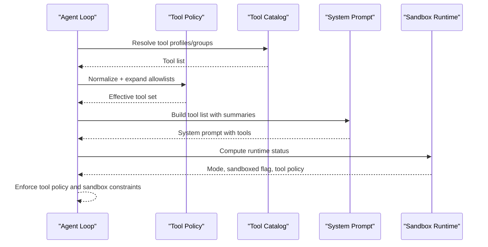
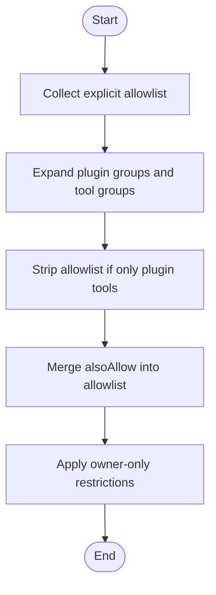
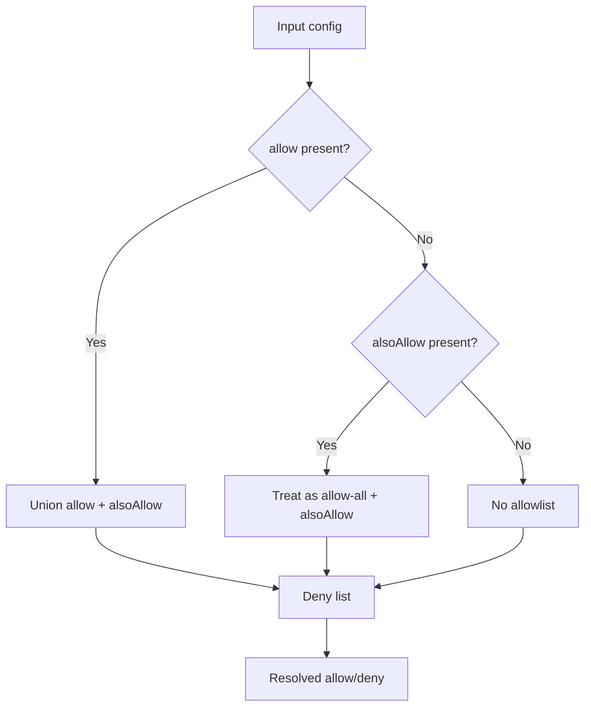
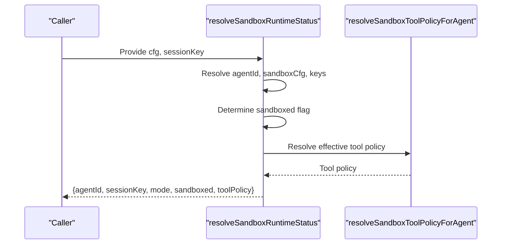
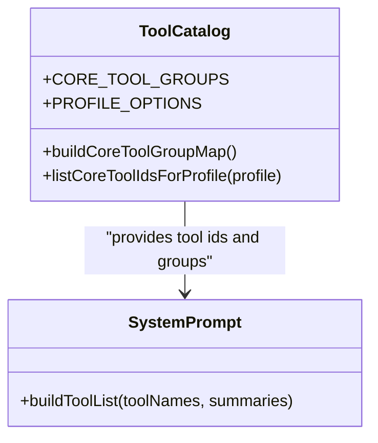
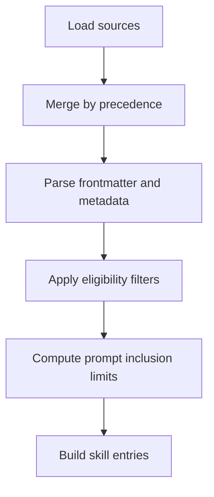
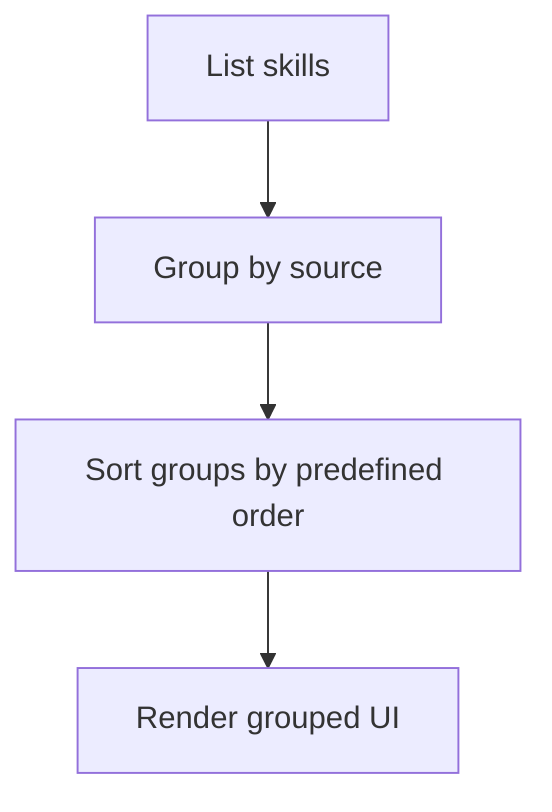
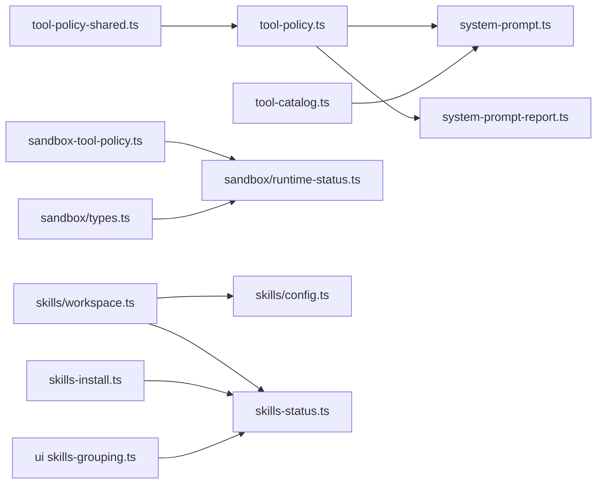

# Agent Tools & Skills

<cite>
**Referenced Files in This Document**
- [src/agents/sandbox-tool-policy.ts](file://src/agents/sandbox-tool-policy.ts)
- [src/agents/sandbox/types.ts](file://src/agents/sandbox/types.ts)
- [src/agents/sandbox/runtime-status.ts](file://src/agents/sandbox/runtime-status.ts)
- [src/agents/tool-policy.ts](file://src/agents/tool-policy.ts)
- [src/agents/tool-policy-shared.ts](file://src/agents/tool-policy-shared.ts)
- [src/agents/tool-catalog.ts](file://src/agents/tool-catalog.ts)
- [src/agents/system-prompt.ts](file://src/agents/system-prompt.ts)
- [src/agents/system-prompt-report.ts](file://src/agents/system-prompt-report.ts)
- [src/agents/skills/workspace.ts](file://src/agents/skills/workspace.ts)
- [src/agents/skills/config.ts](file://src/agents/skills/config.ts)
- [src/agents/skills-status.ts](file://src/agents/skills-status.ts)
- [src/agents/skills-install.ts](file://src/agents/skills-install.ts)
- [ui/src/ui/views/skills-grouping.ts](file://ui/src/ui/views/skills-grouping.ts)
- [docs/tools/skills.md](file://docs/tools/skills.md)
- [docs/tools/creating-skills.md](file://docs/tools/creating-skills.md)
- [docs/gateway/sandboxing.md](file://docs/gateway/sandboxing.md)
- [docs/tools/exec.md](file://docs/tools/exec.md)
- [docs/tools/elevated.md](file://docs/tools/elevated.md)
- [docs/cli/skills.md](file://docs/cli/skills.md)
- [docs/concepts/session-tool.md](file://docs/concepts/session-tool.md)
- [docs/tools/multi-agent-sandbox-tools.md](file://docs/tools/multi-agent-sandbox-tools.md)
- [docs/tools/loop-detection.md](file://docs/tools/loop-detection.md)
- [docs/tools/exec-approvals.md](file://docs/tools/exec-approvals.md)
- [scripts/sandbox-setup.sh](file://scripts/sandbox-setup.sh)
- [scripts/sandbox-browser-setup.sh](file://scripts/sandbox-browser-setup.sh)
- [scripts/sandbox-common-setup.sh](file://scripts/sandbox-common-setup.sh)
- [scripts/sandbox-browser-entrypoint.sh](file://scripts/sandbox-browser-entrypoint.sh)
- [Dockerfile.sandbox](file://Dockerfile.sandbox)
- [Dockerfile.sandbox-browser](file://Dockerfile.sandbox-browser)
- [Dockerfile.sandbox-common](file://Dockerfile.sandbox-common)
</cite>

## Table of Contents
1. [Introduction](#introduction)
2. [Project Structure](#project-structure)
3. [Core Components](#core-components)
4. [Architecture Overview](#architecture-overview)
5. [Detailed Component Analysis](#detailed-component-analysis)
6. [Dependency Analysis](#dependency-analysis)
7. [Performance Considerations](#performance-considerations)
8. [Troubleshooting Guide](#troubleshooting-guide)
9. [Conclusion](#conclusion)
10. [Appendices](#appendices)

## Introduction
This document explains OpenClaw’s agent tools and skills system. It covers the tool execution framework, tool policy enforcement, and sandboxing mechanisms. It documents the skills architecture, skill loading from multiple sources, and customization patterns. It also details built-in tools, system tools, and external tool integration, along with security policies, resource limits, and execution monitoring. Finally, it provides skill development guidelines, packaging, distribution, examples, debugging, performance optimization, and lifecycle management.

## Project Structure
OpenClaw organizes tools and skills under the agents subsystem, with supporting configuration, sandboxing, and UI grouping. Key areas:
- Tool policy and catalog: define allowed tools, profiles, and groups
- Sandbox configuration and runtime: enforce tool policies and isolate execution
- Skills: discovery, precedence, filtering, and installation
- UI grouping: categorize skills by source and bundling
- Documentation: CLI, concepts, and gateway guidance

**Diagram sources**
- [src/agents/tool-policy.ts](file://src/agents/tool-policy.ts#L1-L206)
- [src/agents/tool-policy-shared.ts](file://src/agents/tool-policy-shared.ts)
- [src/agents/tool-catalog.ts](file://src/agents/tool-catalog.ts#L238-L285)
- [src/agents/system-prompt.ts](file://src/agents/system-prompt.ts#L274-L339)
- [src/agents/system-prompt-report.ts](file://src/agents/system-prompt-report.ts#L39-L78)
- [src/agents/sandbox-tool-policy.ts](file://src/agents/sandbox-tool-policy.ts#L1-L38)
- [src/agents/sandbox/types.ts](file://src/agents/sandbox/types.ts#L1-L91)
- [src/agents/sandbox/runtime-status.ts](file://src/agents/sandbox/runtime-status.ts#L45-L97)
- [src/agents/skills/workspace.ts](file://src/agents/skills/workspace.ts#L490-L536)
- [src/agents/skills/config.ts](file://src/agents/skills/config.ts#L39-L79)
- [src/agents/skills-status.ts](file://src/agents/skills-status.ts)
- [src/agents/skills-install.ts](file://src/agents/skills-install.ts)
- [ui/src/ui/views/skills-grouping.ts](file://ui/src/ui/views/skills-grouping.ts#L1-L40)

**Section sources**
- [src/agents/tool-policy.ts](file://src/agents/tool-policy.ts#L1-L206)
- [src/agents/sandbox-tool-policy.ts](file://src/agents/sandbox-tool-policy.ts#L1-L38)
- [src/agents/sandbox/types.ts](file://src/agents/sandbox/types.ts#L1-L91)
- [src/agents/skills/workspace.ts](file://src/agents/skills/workspace.ts#L490-L536)
- [ui/src/ui/views/skills-grouping.ts](file://ui/src/ui/views/skills-grouping.ts#L1-L40)

## Core Components
- Tool policy enforcement: normalize, expand groups, and apply owner-only restrictions
- Sandbox tool policy resolution: union allowlists, handle alsoAllow, and produce resolved allow/deny
- Sandbox runtime status: compute sandbox mode, whether a session is sandboxed, and effective tool policy
- Skills discovery and precedence: merge sources with deterministic precedence and apply filters
- UI grouping: group skills by source categories (workspace, built-in, installed, extra)

**Section sources**
- [src/agents/tool-policy.ts](file://src/agents/tool-policy.ts#L1-L206)
- [src/agents/sandbox-tool-policy.ts](file://src/agents/sandbox-tool-policy.ts#L1-L38)
- [src/agents/sandbox/runtime-status.ts](file://src/agents/sandbox/runtime-status.ts#L45-L97)
- [src/agents/skills/workspace.ts](file://src/agents/skills/workspace.ts#L490-L536)
- [ui/src/ui/views/skills-grouping.ts](file://ui/src/ui/views/skills-grouping.ts#L1-L40)

## Architecture Overview
The system composes tool catalogs, applies policy, and enforces sandboxing per session. Skills are discovered from multiple sources and filtered according to configuration and eligibility. UI surfaces grouped skill lists and system prompts reflect current capabilities.

**Diagram sources**
- [src/agents/tool-policy.ts](file://src/agents/tool-policy.ts#L70-L149)
- [src/agents/tool-catalog.ts](file://src/agents/tool-catalog.ts#L248-L285)
- [src/agents/system-prompt.ts](file://src/agents/system-prompt.ts#L274-L339)
- [src/agents/sandbox/runtime-status.ts](file://src/agents/sandbox/runtime-status.ts#L45-L97)

## Detailed Component Analysis

### Tool Policy Enforcement
- Normalization and expansion: tool names are normalized and groups expanded before applying allow/deny rules
- Owner-only tools: restrict sensitive tools to owner senders; remove or guard non-owner invocations
- Plugin groups: support “group:plugins” and plugin-scoped tool names
- Also-allow merging: additive allowlist extension without overriding explicit allowlists
- Unknown entries: detect and report unknown allowlist entries

**Diagram sources**
- [src/agents/tool-policy.ts](file://src/agents/tool-policy.ts#L70-L206)

**Section sources**
- [src/agents/tool-policy.ts](file://src/agents/tool-policy.ts#L1-L206)
- [src/agents/tool-policy-shared.ts](file://src/agents/tool-policy-shared.ts)

### Sandbox Tool Policy Resolution
- Union allowlists: combine allow and alsoAllow; if only alsoAllow is present, treat as additive on top of implicit allow-all
- Deny overrides allow: deny entries take precedence
- Resolved policy carries source hints for diagnostics

**Diagram sources**
- [src/agents/sandbox-tool-policy.ts](file://src/agents/sandbox-tool-policy.ts#L9-L37)

**Section sources**
- [src/agents/sandbox-tool-policy.ts](file://src/agents/sandbox-tool-policy.ts#L1-L38)
- [src/agents/sandbox/types.ts](file://src/agents/sandbox/types.ts#L6-L27)

### Sandbox Runtime Status
- Determines agent ID, main session key, and sandbox mode
- Computes whether a session is sandboxed and resolves effective tool policy
- Formats blocked tool messages when sandboxed

**Diagram sources**
- [src/agents/sandbox/runtime-status.ts](file://src/agents/sandbox/runtime-status.ts#L45-L97)

**Section sources**
- [src/agents/sandbox/runtime-status.ts](file://src/agents/sandbox/runtime-status.ts#L45-L97)
- [src/agents/sandbox/types.ts](file://src/agents/sandbox/types.ts#L55-L91)

### Tool Catalog and Profiles
- Profiles define allowed tools by category (minimal, coding, messaging, full)
- Groups organize tools by sections; “group:openclaw” aggregates core tools
- Tool order influences presentation in system prompts

**Diagram sources**
- [src/agents/tool-catalog.ts](file://src/agents/tool-catalog.ts#L248-L285)
- [src/agents/system-prompt.ts](file://src/agents/system-prompt.ts#L274-L339)

**Section sources**
- [src/agents/tool-catalog.ts](file://src/agents/tool-catalog.ts#L238-L285)
- [src/agents/system-prompt.ts](file://src/agents/system-prompt.ts#L274-L339)

### Skills Architecture and Loading
- Sources and precedence: extra < bundled < managed < personal agents < project agents < workspace
- Frontmatter parsing and metadata extraction
- Prompt limits: truncate skills included in prompts by count or character budget
- Eligibility checks: apply allowlists and per-skill configuration

**Diagram sources**
- [src/agents/skills/workspace.ts](file://src/agents/skills/workspace.ts#L490-L536)
- [src/agents/skills/config.ts](file://src/agents/skills/config.ts#L39-L79)

**Section sources**
- [src/agents/skills/workspace.ts](file://src/agents/skills/workspace.ts#L490-L536)
- [src/agents/skills/config.ts](file://src/agents/skills/config.ts#L39-L79)

### Skills Distribution and Grouping
- UI groups skills by source categories and highlights bundled vs installed vs extra
- Status reporting and installation pipeline

**Diagram sources**
- [ui/src/ui/views/skills-grouping.ts](file://ui/src/ui/views/skills-grouping.ts#L1-L40)
- [src/agents/skills-status.ts](file://src/agents/skills-status.ts)
- [src/agents/skills-install.ts](file://src/agents/skills-install.ts)

**Section sources**
- [ui/src/ui/views/skills-grouping.ts](file://ui/src/ui/views/skills-grouping.ts#L1-L40)
- [src/agents/skills-install.ts](file://src/agents/skills-install.ts)
- [src/agents/skills-status.ts](file://src/agents/skills-status.ts)

### Built-in Tools, System Tools, and External Tools
- Built-in tools: core tool definitions and ordering
- System tools: exec, process, web_* tools, nodes, sessions, agents, image, etc.
- External tool summaries: augment system prompts with external tool descriptions
- Tool profiles and groups: control visibility and availability

**Section sources**
- [src/agents/system-prompt.ts](file://src/agents/system-prompt.ts#L274-L339)
- [src/agents/system-prompt-report.ts](file://src/agents/system-prompt-report.ts#L39-L78)
- [src/agents/tool-catalog.ts](file://src/agents/tool-catalog.ts#L248-L285)

### Tool Security Policies, Resource Limits, and Monitoring
- Owner-only tools: restrict sensitive tools to owner senders
- Sandbox tool policy: allow/deny patterns with wildcards and deny-overrides
- Sandbox runtime: per-session sandboxing decisions and effective tool policy
- Execution monitoring: system prompt reports and tool usage metrics
- Approvals and loop detection: safeguards for tool execution

**Section sources**
- [src/agents/tool-policy.ts](file://src/agents/tool-policy.ts#L19-L52)
- [src/agents/sandbox-tool-policy.ts](file://src/agents/sandbox-tool-policy.ts#L1-L38)
- [src/agents/sandbox/runtime-status.ts](file://src/agents/sandbox/runtime-status.ts#L45-L97)
- [src/agents/system-prompt-report.ts](file://src/agents/system-prompt-report.ts#L39-L78)
- [docs/tools/exec-approvals.md](file://docs/tools/exec-approvals.md)
- [docs/tools/loop-detection.md](file://docs/tools/loop-detection.md)

### Skill Development Guidelines, Packaging, and Distribution
- Skill creation: frontmatter, metadata, and invocation policy
- Bundling and allowlists: bundled skills require explicit allowlists
- Installation and status: download, extract, and manage skill lifecycles
- CLI and documentation: skills CLI, concepts, and gateway sandboxing

**Section sources**
- [docs/tools/creating-skills.md](file://docs/tools/creating-skills.md)
- [docs/tools/skills.md](file://docs/tools/skills.md)
- [src/agents/skills/config.ts](file://src/agents/skills/config.ts#L50-L69)
- [src/agents/skills-install.ts](file://src/agents/skills-install.ts)
- [docs/cli/skills.md](file://docs/cli/skills.md)
- [docs/gateway/sandboxing.md](file://docs/gateway/sandboxing.md)

### Examples and Advanced Patterns
- Tool implementation: define tool schema, profiles, and summaries
- Skill creation: use frontmatter and metadata to control behavior
- Advanced tool patterns: alsoAllow, plugin groups, and owner-only restrictions
- Sandbox patterns: per-agent and per-session modes, workspace access, and pruning

**Section sources**
- [src/agents/tool-policy.ts](file://src/agents/tool-policy.ts#L197-L206)
- [src/agents/tool-catalog.ts](file://src/agents/tool-catalog.ts#L248-L285)
- [src/agents/sandbox/types.ts](file://src/agents/sandbox/types.ts#L55-L91)

### Debugging, Performance Optimization, and Lifecycle Management
- Debugging: inspect system prompts, blocked tool messages, and sandbox runtime status
- Performance: limit skills in prompts by count/chars; optimize tool group expansions
- Lifecycle: install, update, prune sandbox containers; manage skill sources and precedence

**Section sources**
- [src/agents/system-prompt-report.ts](file://src/agents/system-prompt-report.ts#L39-L78)
- [src/agents/sandbox/runtime-status.ts](file://src/agents/sandbox/runtime-status.ts#L81-L97)
- [src/agents/skills/workspace.ts](file://src/agents/skills/workspace.ts#L529-L536)
- [src/agents/sandbox/types.ts](file://src/agents/sandbox/types.ts#L48-L51)

## Dependency Analysis
The following diagram shows key dependencies among tool policy, sandboxing, and skills:

**Diagram sources**
- [src/agents/tool-policy-shared.ts](file://src/agents/tool-policy-shared.ts)
- [src/agents/tool-policy.ts](file://src/agents/tool-policy.ts#L1-L16)
- [src/agents/system-prompt.ts](file://src/agents/system-prompt.ts#L274-L339)
- [src/agents/system-prompt-report.ts](file://src/agents/system-prompt-report.ts#L39-L78)
- [src/agents/tool-catalog.ts](file://src/agents/tool-catalog.ts#L248-L285)
- [src/agents/sandbox-tool-policy.ts](file://src/agents/sandbox-tool-policy.ts#L1-L38)
- [src/agents/sandbox/runtime-status.ts](file://src/agents/sandbox/runtime-status.ts#L45-L97)
- [src/agents/sandbox/types.ts](file://src/agents/sandbox/types.ts#L1-L91)
- [src/agents/skills/workspace.ts](file://src/agents/skills/workspace.ts#L490-L536)
- [src/agents/skills/config.ts](file://src/agents/skills/config.ts#L39-L79)
- [src/agents/skills-status.ts](file://src/agents/skills-status.ts)
- [src/agents/skills-install.ts](file://src/agents/skills-install.ts)
- [ui/src/ui/views/skills-grouping.ts](file://ui/src/ui/views/skills-grouping.ts#L1-L40)

**Section sources**
- [src/agents/tool-policy.ts](file://src/agents/tool-policy.ts#L1-L16)
- [src/agents/sandbox-tool-policy.ts](file://src/agents/sandbox-tool-policy.ts#L1-L38)
- [src/agents/skills/workspace.ts](file://src/agents/skills/workspace.ts#L490-L536)

## Performance Considerations
- Limit skills in prompts by count and character budget to reduce overhead
- Prefer additive allowlists via alsoAllow to avoid stripping allowlists that contain only plugin tools
- Expand tool groups once and reuse normalized sets to minimize repeated computation
- Use sandbox prune settings to reclaim resources from idle or stale containers

[No sources needed since this section provides general guidance]

## Troubleshooting Guide
- Blocked tool messages: when sandboxed, blocked tools surface diagnostic messages indicating policy source and key path
- Owner-only restrictions: ensure sender permissions or adjust tool policy
- Unknown allowlist entries: review allowlist entries and plugin group names
- Sandbox runtime status: verify agent ID, session key, and mode resolution
- System prompt reports: confirm tool summaries and property counts for accurate guidance

**Section sources**
- [src/agents/sandbox/runtime-status.ts](file://src/agents/sandbox/runtime-status.ts#L81-L97)
- [src/agents/tool-policy.ts](file://src/agents/tool-policy.ts#L19-L52)
- [src/agents/system-prompt-report.ts](file://src/agents/system-prompt-report.ts#L39-L78)

## Conclusion
OpenClaw’s tools and skills system combines flexible tool policies, robust sandboxing, and a multi-source skills architecture. Administrators can precisely control tool availability, enforce security, and monitor execution, while developers can package and distribute skills effectively. The system supports performance-conscious configurations and offers practical troubleshooting pathways.

[No sources needed since this section summarizes without analyzing specific files]

## Appendices

### Sandbox Setup Scripts and Images
- Sandbox setup scripts and Dockerfiles support containerized execution and browser contexts.

**Section sources**
- [scripts/sandbox-setup.sh](file://scripts/sandbox-setup.sh)
- [scripts/sandbox-browser-setup.sh](file://scripts/sandbox-browser-setup.sh)
- [scripts/sandbox-common-setup.sh](file://scripts/sandbox-common-setup.sh)
- [scripts/sandbox-browser-entrypoint.sh](file://scripts/sandbox-browser-entrypoint.sh)
- [Dockerfile.sandbox](file://Dockerfile.sandbox)
- [Dockerfile.sandbox-browser](file://Dockerfile.sandbox-browser)
- [Dockerfile.sandbox-common](file://Dockerfile.sandbox-common)

### Related Concepts and Documentation
- Multi-agent sandbox tools, session tool concept, and gateway sandboxing guidance.

**Section sources**
- [docs/tools/multi-agent-sandbox-tools.md](file://docs/tools/multi-agent-sandbox-tools.md)
- [docs/concepts/session-tool.md](file://docs/concepts/session-tool.md)
- [docs/gateway/sandboxing.md](file://docs/gateway/sandboxing.md)