# Agent Workspace

<cite>
**Referenced Files in This Document**
- [workspace.ts](file://src/agents/workspace.ts)
- [workspace-templates.ts](file://src/agents/workspace-templates.ts)
- [bootstrap-files.ts](file://src/agents/bootstrap-files.ts)
- [bootstrap-hooks.ts](file://src/agents/bootstrap-hooks.ts)
- [bootstrap.ts](file://src/agents/pi-embedded-helpers/bootstrap.ts)
- [bootstrap-cache.ts](file://src/agents/bootstrap-cache.ts)
- [agent-workspace.md](file://docs/concepts/agent-workspace.md)
- [AGENTS.md](file://docs/reference/templates/AGENTS.md)
- [configure.wizard.ts](file://src/commands/configure.wizard.ts)
- [backup.ts](file://src/commands/backup.ts)
- [backup-shared.ts](file://src/commands/backup-shared.ts)
- [backup-verify.ts](file://src/commands/backup-verify.ts)
- [doctor.ts](file://src/commands/doctor.ts)
- [AgentWorkspace.swift](file://apps/macos/Sources/OpenClaw/AgentWorkspace.swift)
- [GatewayModels.swift (macOS)](file://apps/macos/Sources/OpenClawProtocol/GatewayModels.swift)
- [GatewayModels.swift (shared)](file://apps/shared/OpenClawKit/Sources/OpenClawProtocol/GatewayModels.swift)
- [windows-acl.ts](file://src/security/windows-acl.ts)
- [audit.test.ts](file://src/security/audit.test.ts)
- [AgentWorkspace.swift (macOS)](file://apps/macos/Sources/OpenClaw/AgentWorkspace.swift)
- [AgentWorkspace.swift (shared)](file://apps/shared/OpenClawKit/Sources/OpenClawKit/AgentWorkspace.swift)
</cite>

## Table of Contents
1. [Introduction](#introduction)
2. [Project Structure](#project-structure)
3. [Core Components](#core-components)
4. [Architecture Overview](#architecture-overview)
5. [Detailed Component Analysis](#detailed-component-analysis)
6. [Dependency Analysis](#dependency-analysis)
7. [Performance Considerations](#performance-considerations)
8. [Troubleshooting Guide](#troubleshooting-guide)
9. [Conclusion](#conclusion)
10. [Appendices](#appendices)

## Introduction
This document explains OpenClaw’s agent workspace system: how workspaces are organized, how bootstrap files are initialized and injected, how templates are applied, and how to secure, back up, migrate, and troubleshoot workspaces. It also covers workspace configuration, environment variables, sandboxing, and performance/storage considerations.

## Project Structure
The workspace system spans TypeScript runtime logic, Swift macOS integration, and documentation templates:
- Runtime workspace management and bootstrap loading
- Workspace templates and default file seeding
- Bootstrap file resolution, caching, and injection
- Backup and restore procedures
- Security and sandboxing policies
- macOS Swift integration for workspace paths and safety checks

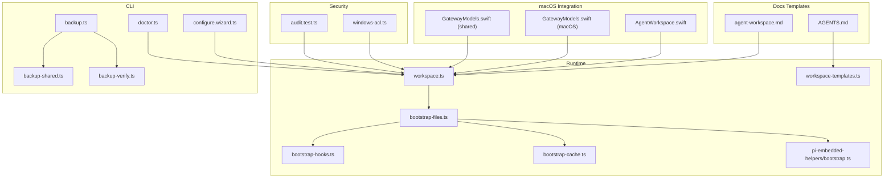

**Diagram sources**
- [workspace.ts](file://src/agents/workspace.ts#L1-L656)
- [workspace-templates.ts](file://src/agents/workspace-templates.ts#L1-L60)
- [bootstrap-files.ts](file://src/agents/bootstrap-files.ts#L1-L119)
- [bootstrap-hooks.ts](file://src/agents/bootstrap-hooks.ts#L1-L32)
- [bootstrap-cache.ts](file://src/agents/bootstrap-cache.ts#L1-L36)
- [bootstrap.ts](file://src/agents/pi-embedded-helpers/bootstrap.ts#L1-L200)
- [agent-workspace.md](file://docs/concepts/agent-workspace.md#L1-L237)
- [AGENTS.md](file://docs/reference/templates/AGENTS.md#L1-L220)
- [configure.wizard.ts](file://src/commands/configure.wizard.ts#L439-L485)
- [backup.ts](file://src/commands/backup.ts#L1-L200)
- [backup-shared.ts](file://src/commands/backup-shared.ts#L98-L138)
- [backup-verify.ts](file://src/commands/backup-verify.ts#L121-L140)
- [doctor.ts](file://src/commands/doctor.ts#L1-L200)
- [AgentWorkspace.swift](file://apps/macos/Sources/OpenClaw/AgentWorkspace.swift#L1-L38)
- [GatewayModels.swift (macOS)](file://apps/macos/Sources/OpenClawProtocol/GatewayModels.swift#L2235-L2295)
- [GatewayModels.swift (shared)](file://apps/shared/OpenClawKit/Sources/OpenClawProtocol/GatewayModels.swift#L2235-L2295)
- [windows-acl.ts](file://src/security/windows-acl.ts#L82-L119)
- [audit.test.ts](file://src/security/audit.test.ts#L3278-L3315)

**Section sources**
- [workspace.ts](file://src/agents/workspace.ts#L1-L656)
- [agent-workspace.md](file://docs/concepts/agent-workspace.md#L1-L237)

## Core Components
- Workspace directory resolution and default location
- Bootstrap file seeding and validation
- Workspace template loading and caching
- Bootstrap file loading, filtering, and sanitization
- Bootstrap hook overrides and context injection
- Workspace state tracking and onboarding lifecycle
- Backup and restore pipeline with manifests
- macOS Swift integration for workspace path display and safety
- Security and sandboxing policies

**Section sources**
- [workspace.ts](file://src/agents/workspace.ts#L12-L45)
- [bootstrap-files.ts](file://src/agents/bootstrap-files.ts#L64-L96)
- [bootstrap-hooks.ts](file://src/agents/bootstrap-hooks.ts#L7-L31)
- [bootstrap.ts](file://src/agents/pi-embedded-helpers/bootstrap.ts#L85-L123)
- [backup.ts](file://src/commands/backup.ts#L36-L78)
- [AgentWorkspace.swift](file://apps/macos/Sources/OpenClaw/AgentWorkspace.swift#L1-L38)

## Architecture Overview
The workspace system orchestrates:
- Determining the workspace root and ensuring it exists
- Seeding bootstrap files from templates for new workspaces
- Loading and validating workspace files with boundary guards
- Resolving extra bootstrap files with diagnostics
- Applying hook overrides and context mode filters
- Injecting bootstrap content into the agent runtime with budgeting and truncation
- Tracking onboarding state and git initialization
- Backing up workspace-related assets and verifying archives

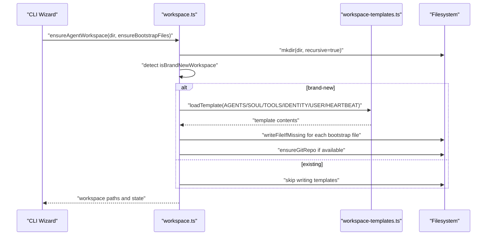

**Diagram sources**
- [workspace.ts](file://src/agents/workspace.ts#L321-L459)
- [workspace-templates.ts](file://src/agents/workspace-templates.ts#L14-L54)

**Section sources**
- [workspace.ts](file://src/agents/workspace.ts#L321-L459)
- [workspace-templates.ts](file://src/agents/workspace-templates.ts#L14-L54)

## Detailed Component Analysis

### Workspace Directory and Defaults
- Default workspace location resolves from the user’s home directory, optionally suffixed by OPENCLAW_PROFILE.
- The directory is normalized and validated to avoid root-level paths.
- Onboarding state is tracked under a hidden state file to coordinate seeding and completion.

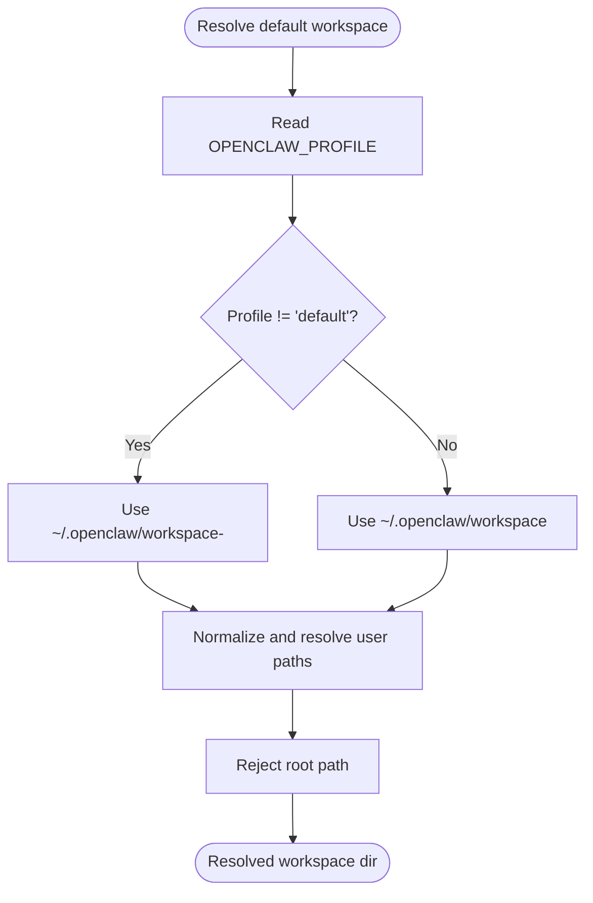

**Diagram sources**
- [workspace.ts](file://src/agents/workspace.ts#L12-L24)
- [workspace.ts](file://src/agents/workspace.ts#L206-L208)
- [workspace.ts](file://src/agents/workspace.ts#L250-L260)

**Section sources**
- [workspace.ts](file://src/agents/workspace.ts#L12-L24)
- [workspace.ts](file://src/agents/workspace.ts#L206-L260)

### Bootstrap Files: Initialization, Validation, and Safety
- Bootstrap files include AGENTS.md, SOUL.md, TOOLS.md, IDENTITY.md, USER.md, HEARTBEAT.md, BOOTSTRAP.md, and optional MEMORY.md variants.
- Brand-new workspaces seed missing bootstrap files from templates.
- Existing workspaces preserve user content; templates are not overwritten.
- File reads are guarded with boundary checks and a size cap to prevent path traversal and excessive memory usage.
- Onboarding state tracks when bootstrap was seeded and when onboarding completed.

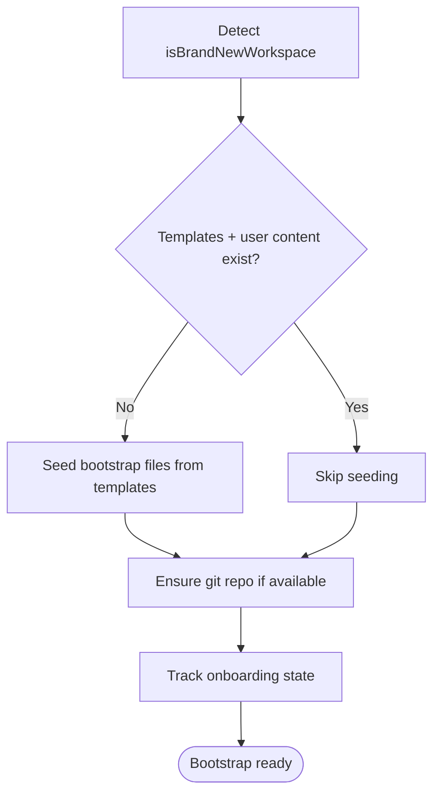

**Diagram sources**
- [workspace.ts](file://src/agents/workspace.ts#L351-L447)

**Section sources**
- [workspace.ts](file://src/agents/workspace.ts#L351-L447)

### Workspace Templates and Caching
- Templates are resolved from package docs/reference/templates, with fallbacks to local or module-based locations.
- Template loading is cached to avoid repeated disk reads.
- Front matter is stripped from template content before injection.

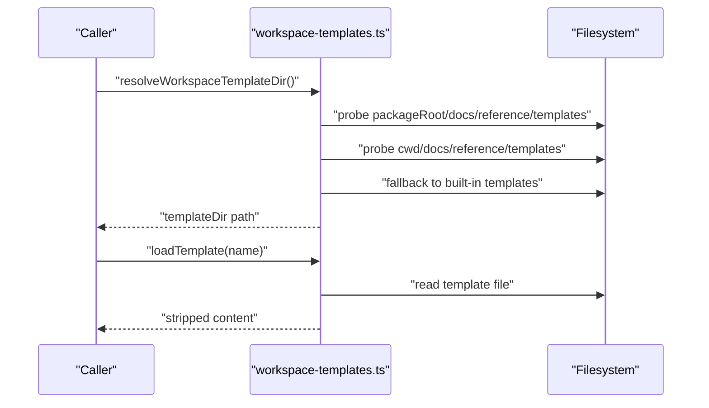

**Diagram sources**
- [workspace-templates.ts](file://src/agents/workspace-templates.ts#L14-L54)
- [workspace.ts](file://src/agents/workspace.ts#L104-L130)

**Section sources**
- [workspace-templates.ts](file://src/agents/workspace-templates.ts#L14-L54)
- [workspace.ts](file://src/agents/workspace.ts#L104-L130)

### Bootstrap File Loading and Filtering
- Bootstrap files are loaded from the workspace directory with boundary guards and size limits.
- Extra bootstrap files can be resolved via glob patterns or literal paths, with diagnostics for unsupported basenames.
- Context mode filters allow lightweight or heartbeat-only bootstrap content for specific runs.

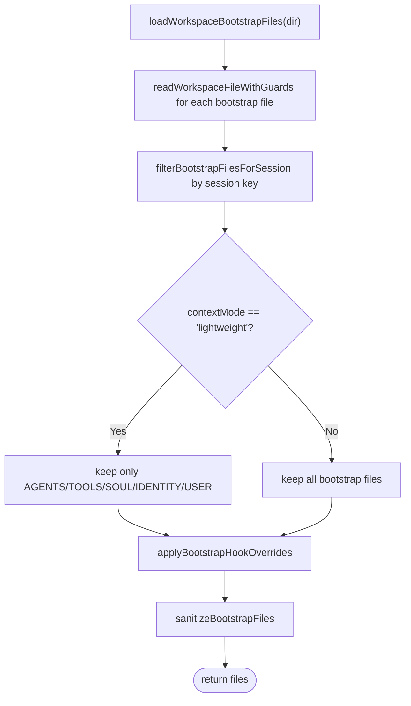

**Diagram sources**
- [workspace.ts](file://src/agents/workspace.ts#L498-L555)
- [workspace.ts](file://src/agents/workspace.ts#L565-L573)
- [bootstrap-files.ts](file://src/agents/bootstrap-files.ts#L64-L96)

**Section sources**
- [workspace.ts](file://src/agents/workspace.ts#L498-L555)
- [bootstrap-files.ts](file://src/agents/bootstrap-files.ts#L64-L96)

### Bootstrap Hook Overrides and Injection Budgeting
- Hooks can mutate the bootstrap file list; overrides are applied before sanitization.
- Injection budgets cap per-file and total content sizes, with truncation markers and warnings.
- Budgets and warning modes are configurable via agent defaults.

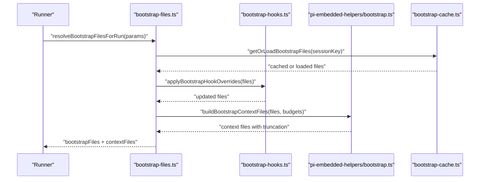

**Diagram sources**
- [bootstrap-files.ts](file://src/agents/bootstrap-files.ts#L64-L96)
- [bootstrap-hooks.ts](file://src/agents/bootstrap-hooks.ts#L7-L31)
- [bootstrap.ts](file://src/agents/pi-embedded-helpers/bootstrap.ts#L198-L200)
- [bootstrap-cache.ts](file://src/agents/bootstrap-cache.ts#L5-L17)

**Section sources**
- [bootstrap-hooks.ts](file://src/agents/bootstrap-hooks.ts#L7-L31)
- [bootstrap.ts](file://src/agents/pi-embedded-helpers/bootstrap.ts#L85-L123)
- [bootstrap-cache.ts](file://src/agents/bootstrap-cache.ts#L5-L17)

### Workspace State and Onboarding Lifecycle
- Onboarding state tracks when bootstrap was seeded and when onboarding completed.
- Legacy migrations handle workspaces that diverge from templates or already contain user content.
- Git initialization is attempted for brand-new workspaces if git is available.

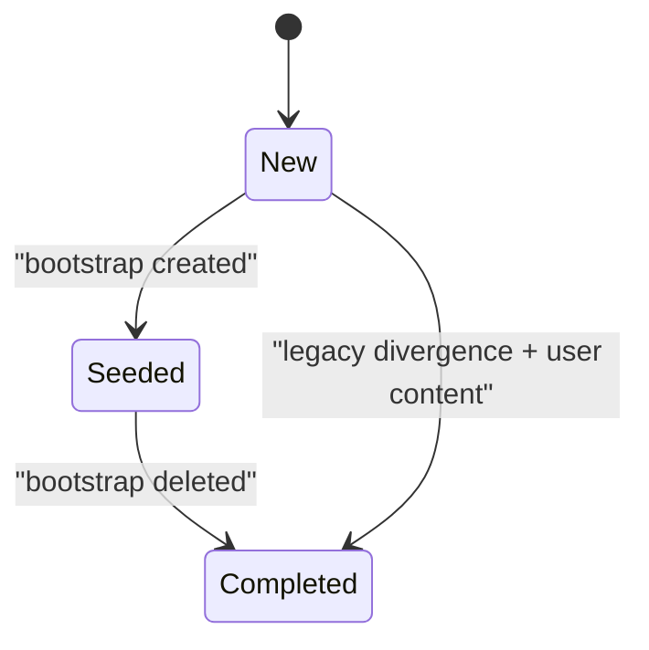

**Diagram sources**
- [workspace.ts](file://src/agents/workspace.ts#L210-L276)
- [workspace.ts](file://src/agents/workspace.ts#L385-L447)

**Section sources**
- [workspace.ts](file://src/agents/workspace.ts#L210-L276)
- [workspace.ts](file://src/agents/workspace.ts#L385-L447)

### macOS Integration: Paths and Safety
- Swift utilities expose workspace filenames and safety checks for display and validation.
- Gateway models define RPC structures for reading/writing workspace files.

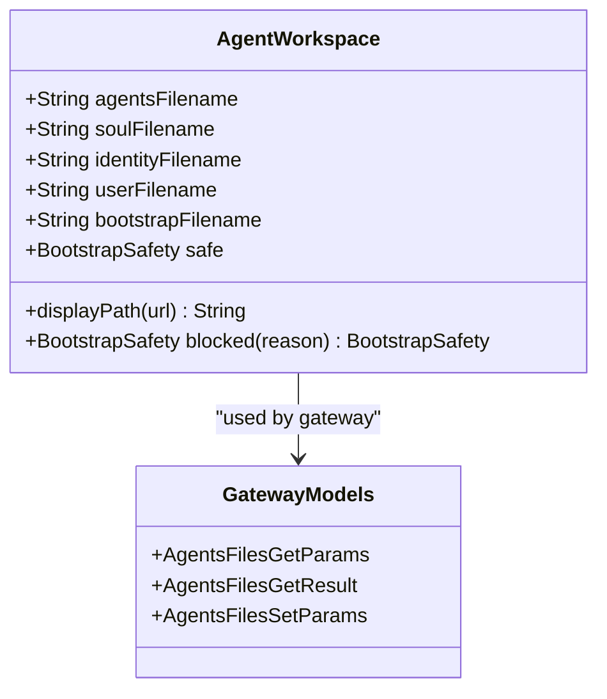

**Diagram sources**
- [AgentWorkspace.swift](file://apps/macos/Sources/OpenClaw/AgentWorkspace.swift#L1-L38)
- [GatewayModels.swift (macOS)](file://apps/macos/Sources/OpenClawProtocol/GatewayModels.swift#L2235-L2295)
- [GatewayModels.swift (shared)](file://apps/shared/OpenClawKit/Sources/OpenClawProtocol/GatewayModels.swift#L2235-L2295)

**Section sources**
- [AgentWorkspace.swift](file://apps/macos/Sources/OpenClaw/AgentWorkspace.swift#L1-L38)
- [GatewayModels.swift (macOS)](file://apps/macos/Sources/OpenClawProtocol/GatewayModels.swift#L2235-L2295)
- [GatewayModels.swift (shared)](file://apps/shared/OpenClawKit/Sources/OpenClawProtocol/GatewayModels.swift#L2235-L2295)

### Backup and Restore Procedures
- Backup plan enumerates assets including config, state, OAuth, and optional workspaces.
- Manifest captures runtime version, platform, node version, and included paths.
- Archive publishing supports hard links or copy semantics with atomic replacement.
- Verification validates manifest assets and paths.

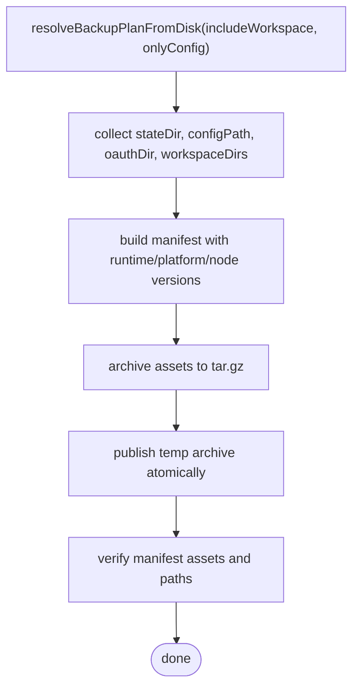

**Diagram sources**
- [backup-shared.ts](file://src/commands/backup-shared.ts#L106-L138)
- [backup.ts](file://src/commands/backup.ts#L192-L233)
- [backup.ts](file://src/commands/backup.ts#L128-L170)
- [backup-verify.ts](file://src/commands/backup-verify.ts#L121-L140)

**Section sources**
- [backup-shared.ts](file://src/commands/backup-shared.ts#L106-L138)
- [backup.ts](file://src/commands/backup.ts#L192-L233)
- [backup.ts](file://src/commands/backup.ts#L128-L170)
- [backup-verify.ts](file://src/commands/backup-verify.ts#L121-L140)

### Security Policies and Isolation
- Sandbox policies can restrict workspace access and tool capabilities per agent or globally.
- Windows ACL utilities classify principals and enforce trusted/world/group categories.
- Auditing tests demonstrate scenarios where open group policies coexist with sandbox mode or restricted filesystem access.

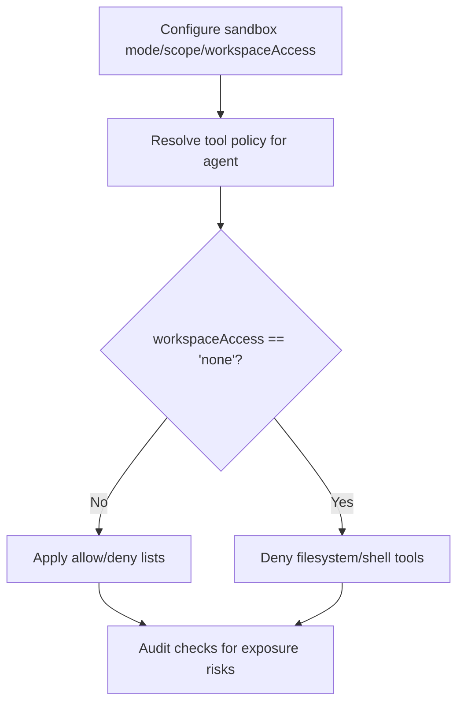

**Diagram sources**
- [windows-acl.ts](file://src/security/windows-acl.ts#L82-L119)
- [audit.test.ts](file://src/security/audit.test.ts#L3278-L3315)

**Section sources**
- [windows-acl.ts](file://src/security/windows-acl.ts#L82-L119)
- [audit.test.ts](file://src/security/audit.test.ts#L3278-L3315)

## Dependency Analysis
- workspace.ts depends on workspace-templates.ts for template resolution and on boundary-file guards for safe reads.
- bootstrap-files.ts composes workspace loading, hook overrides, and embedded helpers for budgeting.
- backup.ts relies on backup-shared.ts for planning and backup-verify.ts for manifest validation.
- macOS integration depends on shared gateway models for RPC contracts.

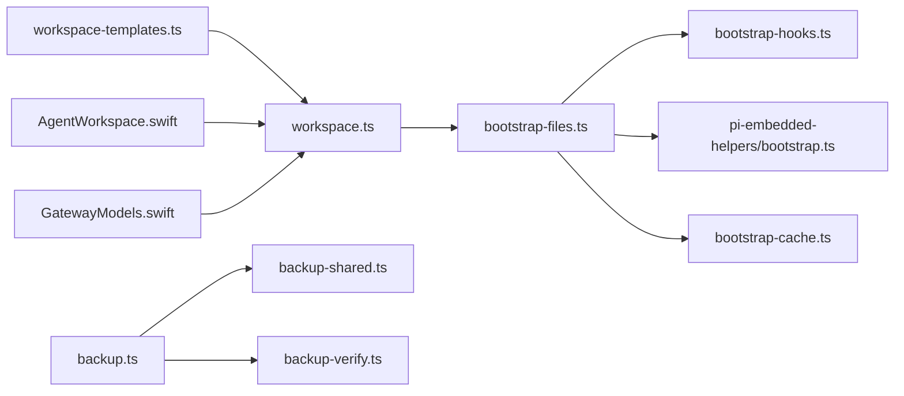

**Diagram sources**
- [workspace.ts](file://src/agents/workspace.ts#L1-L10)
- [workspace-templates.ts](file://src/agents/workspace-templates.ts#L1-L6)
- [bootstrap-files.ts](file://src/agents/bootstrap-files.ts#L1-L14)
- [bootstrap-hooks.ts](file://src/agents/bootstrap-hooks.ts#L1-L5)
- [bootstrap.ts](file://src/agents/pi-embedded-helpers/bootstrap.ts#L1-L7)
- [bootstrap-cache.ts](file://src/agents/bootstrap-cache.ts#L1-L3)
- [backup.ts](file://src/commands/backup.ts#L1-L18)
- [backup-shared.ts](file://src/commands/backup-shared.ts#L1-L18)
- [backup-verify.ts](file://src/commands/backup-verify.ts#L1-L120)
- [AgentWorkspace.swift](file://apps/macos/Sources/OpenClaw/AgentWorkspace.swift#L1-L10)
- [GatewayModels.swift (macOS)](file://apps/macos/Sources/OpenClawProtocol/GatewayModels.swift#L2235-L2251)

**Section sources**
- [workspace.ts](file://src/agents/workspace.ts#L1-L10)
- [bootstrap-files.ts](file://src/agents/bootstrap-files.ts#L1-L14)
- [backup.ts](file://src/commands/backup.ts#L1-L18)

## Performance Considerations
- Bootstrap file size caps and truncation prevent prompt bloat; tune budgets via agent defaults.
- Template loading is cached to reduce I/O overhead.
- Workspace file reads use boundary guards and identity-based caching to avoid stale content.
- Git initialization is attempted only for new workspaces and gracefully ignored if unavailable.

[No sources needed since this section provides general guidance]

## Troubleshooting Guide
- Doctor command surfaces workspace status, suggests backups, and highlights potential misconfigurations.
- Bootstrap size warnings indicate truncation; adjust budgets or reduce file sizes.
- Extra workspace directories can cause confusion; doctor warns and recommends consolidation.
- Audit checks help validate exposure risks with sandbox mode and tool policies.

**Section sources**
- [doctor.ts](file://src/commands/doctor.ts#L61-L61)
- [bootstrap.ts](file://src/agents/pi-embedded-helpers/bootstrap.ts#L233-L238)
- [agent-workspace.md](file://docs/concepts/agent-workspace.md#L51-L62)
- [audit.test.ts](file://src/security/audit.test.ts#L3278-L3315)

## Conclusion
OpenClaw’s workspace system provides a secure, configurable, and maintainable foundation for agent memory and context. It seeds templates safely, enforces boundaries, supports robust backup and restore, and integrates with sandboxing and auditing to protect user data.

[No sources needed since this section summarizes without analyzing specific files]

## Appendices

### Workspace Directory Structure and File Roles
- AGENTS.md: Operating instructions and behavior rules.
- SOUL.md: Persona, tone, and boundaries.
- USER.md: Identity and addressing of the user.
- IDENTITY.md: Name, vibe, and emoji; updated during bootstrap.
- TOOLS.md: Local tool conventions.
- HEARTBEAT.md: Optional periodic checklist.
- BOOT.md: Optional startup checklist for gateway restarts.
- BOOTSTRAP.md: One-time first-run ritual; delete after completion.
- memory/YYYY-MM-DD.md: Daily memory logs.
- MEMORY.md: Optional curated long-term memory.
- skills/: Optional workspace-specific skills.
- canvas/: Optional UI files for node displays.

**Section sources**
- [agent-workspace.md](file://docs/concepts/agent-workspace.md#L64-L117)
- [AGENTS.md](file://docs/reference/templates/AGENTS.md#L1-L220)

### Workspace Initialization and Bootstrap Injection
- Initialize workspace via CLI wizard or configure command; templates are written only when missing.
- Bootstrap files are filtered by session type and context mode; hooks can augment the list.
- Injection applies per-file and total budgets with truncation and warnings.

**Section sources**
- [configure.wizard.ts](file://src/commands/configure.wizard.ts#L439-L485)
- [workspace.ts](file://src/agents/workspace.ts#L372-L383)
- [bootstrap-files.ts](file://src/agents/bootstrap-files.ts#L64-L96)
- [bootstrap.ts](file://src/agents/pi-embedded-helpers/bootstrap.ts#L85-L123)

### Workspace Permissions, Security, and Isolation
- Configure sandbox mode and scope to restrict filesystem and tool access.
- Windows ACL utilities classify principals and enforce trusted/world/group categories.
- Auditing tests demonstrate safe configurations for open groups with sandbox mode or restricted filesystem access.

**Section sources**
- [windows-acl.ts](file://src/security/windows-acl.ts#L82-L119)
- [audit.test.ts](file://src/security/audit.test.ts#L3278-L3315)

### Backup, Restore, Migration, and Maintenance
- Use backup command to include config/state/oauth and optional workspaces; verify archives afterward.
- Migrate by cloning a private workspace repo to the new machine and re-seeding missing files.
- Maintain git commits for memory updates and avoid committing secrets.

**Section sources**
- [backup.ts](file://src/commands/backup.ts#L192-L233)
- [backup-shared.ts](file://src/commands/backup-shared.ts#L106-L138)
- [agent-workspace.md](file://docs/concepts/agent-workspace.md#L138-L230)