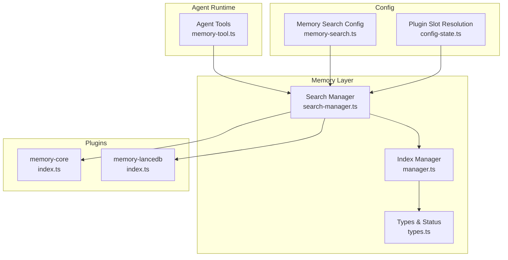
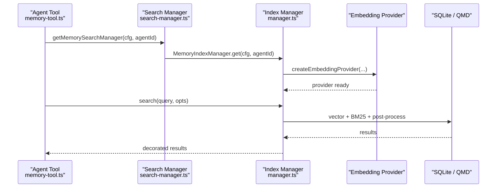
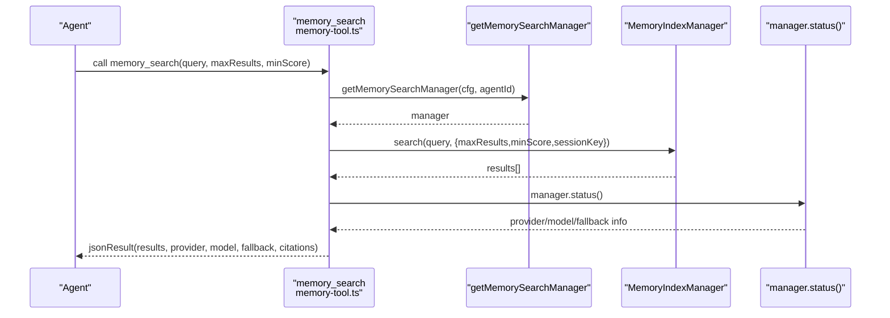
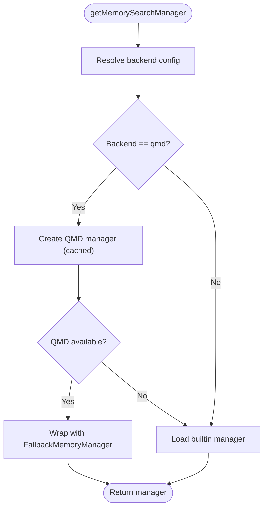
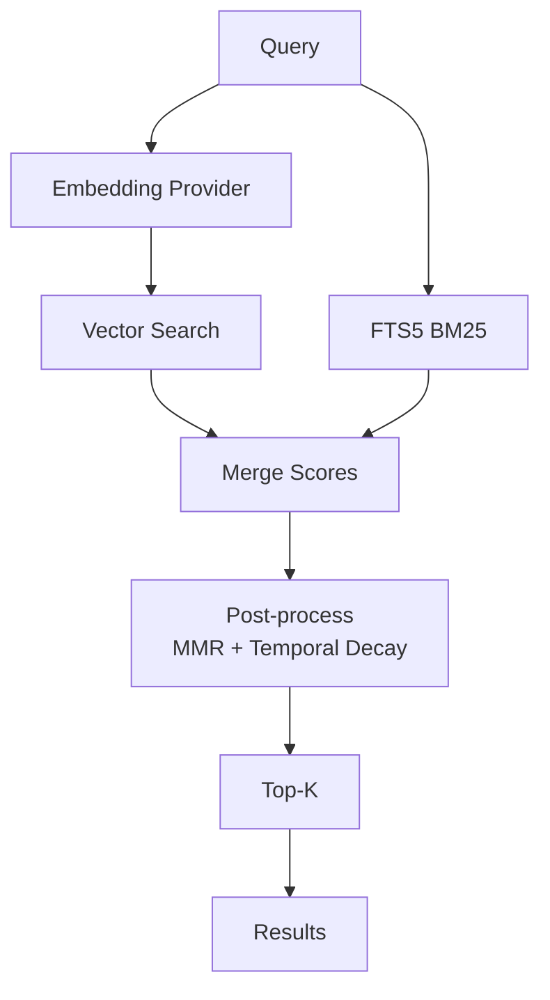
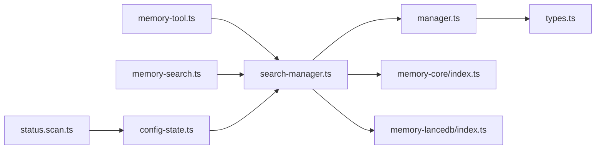

# Memory Integration

<cite>
**Referenced Files in This Document**
- [memory.md](file://docs/concepts/memory.md)
- [index.ts](file://src/memory/index.ts)
- [manager.ts](file://src/memory/manager.ts)
- [types.ts](file://src/memory/types.ts)
- [search-manager.ts](file://src/memory/search-manager.ts)
- [memory-tool.ts](file://src/agents/tools/memory-tool.ts)
- [memory-search.ts](file://src/agents/memory-search.ts)
- [mmr.ts](file://src/memory/mmr.ts)
- [temporal-decay.ts](file://src/memory/temporal-decay.ts)
- [index.ts](file://extensions/memory-core/index.ts)
- [index.ts](file://extensions/memory-lancedb/index.ts)
- [config-state.ts](file://src/plugins/config-state.ts)
- [status.scan.ts](file://src/commands/status.scan.ts)
</cite>

## Table of Contents
1. [Introduction](#introduction)
2. [Project Structure](#project-structure)
3. [Core Components](#core-components)
4. [Architecture Overview](#architecture-overview)
5. [Detailed Component Analysis](#detailed-component-analysis)
6. [Dependency Analysis](#dependency-analysis)
7. [Performance Considerations](#performance-considerations)
8. [Troubleshooting Guide](#troubleshooting-guide)
9. [Conclusion](#conclusion)

## Introduction
This document explains how OpenClaw integrates memory into the agent system. It covers how agents interact with memory for context retrieval and storage, how vector embeddings and semantic search work, and how memory configuration and search parameters influence relevance scoring. Practical examples illustrate memory-aware agent behavior, context window management, and optimization strategies. We also address indexing, search performance, storage considerations, and troubleshooting.

## Project Structure
Memory integration spans several layers:
- Agent-facing tools expose memory search and read operations.
- Memory search managers coordinate indexing, embedding, and retrieval.
- Plugins provide alternative backends (core SQLite and LanceDB).
- Configuration resolves provider selection, hybrid search, and post-processing.

**Diagram sources**
- [memory-tool.ts:1-133](file://src/agents/tools/memory-tool.ts#L1-L133)
- [search-manager.ts:1-200](file://src/memory/search-manager.ts#L1-L200)
- [manager.ts:1-200](file://src/memory/manager.ts#L1-L200)
- [types.ts:1-82](file://src/memory/types.ts#L1-L82)
- [index.ts:1-39](file://extensions/memory-core/index.ts#L1-L39)
- [index.ts:1-679](file://extensions/memory-lancedb/index.ts#L1-L679)
- [memory-search.ts:1-200](file://src/agents/memory-search.ts#L1-L200)
- [config-state.ts:307-335](file://src/plugins/config-state.ts#L307-L335)

**Section sources**
- [memory.md:1-800](file://docs/concepts/memory.md#L1-L800)
- [memory-tool.ts:1-133](file://src/agents/tools/memory-tool.ts#L1-L133)
- [search-manager.ts:1-200](file://src/memory/search-manager.ts#L1-L200)
- [manager.ts:1-200](file://src/memory/manager.ts#L1-L200)
- [types.ts:1-82](file://src/memory/types.ts#L1-L82)
- [index.ts:1-39](file://extensions/memory-core/index.ts#L1-L39)
- [index.ts:1-679](file://extensions/memory-lancedb/index.ts#L1-L679)
- [memory-search.ts:1-200](file://src/agents/memory-search.ts#L1-L200)
- [config-state.ts:307-335](file://src/plugins/config-state.ts#L307-L335)

## Core Components
- Agent tools: memory_search and memory_get are exposed by the memory-core plugin and created via agent tool factories.
- Search manager: orchestrates backend selection (builtin SQLite or QMD), fallback behavior, and wraps results.
- Index manager: handles embedding provider setup, indexing, chunking, SQLite schema, and hybrid search.
- Types and status: define result shapes, provider status, and synchronization progress.
- Configuration: resolves provider, model, fallback, hybrid search weights, and post-processing options.

**Section sources**
- [index.ts:1-12](file://src/memory/index.ts#L1-L12)
- [manager.ts:1-200](file://src/memory/manager.ts#L1-L200)
- [types.ts:1-82](file://src/memory/types.ts#L1-L82)
- [search-manager.ts:1-200](file://src/memory/search-manager.ts#L1-L200)
- [memory-tool.ts:1-133](file://src/agents/tools/memory-tool.ts#L1-L133)
- [memory-search.ts:1-200](file://src/agents/memory-search.ts#L1-L200)

## Architecture Overview
The memory subsystem is designed around a pluggable search manager that can delegate to either a builtin SQLite-based indexer or an external QMD backend. Agents call memory tools that resolve the agent-specific configuration, obtain a memory manager, and execute search/read operations. Providers are resolved dynamically, with fallback support when the primary provider fails.

**Diagram sources**
- [memory-tool.ts:79-133](file://src/agents/tools/memory-tool.ts#L79-L133)
- [search-manager.ts:25-86](file://src/memory/search-manager.ts#L25-L86)
- [manager.ts:135-190](file://src/memory/manager.ts#L135-L190)

## Detailed Component Analysis

### Agent Tools and Context Retrieval
- memory_search: Validates parameters, resolves agent context, obtains a memory manager, executes search, decorates citations, and returns structured results with provider/model info and fallback status.
- memory_get: Reads a specific memory file within allowed paths and returns content with path metadata.

**Diagram sources**
- [memory-tool.ts:79-133](file://src/agents/tools/memory-tool.ts#L79-L133)
- [search-manager.ts:25-86](file://src/memory/search-manager.ts#L25-L86)
- [types.ts:61-81](file://src/memory/types.ts#L61-L81)

**Section sources**
- [memory-tool.ts:13-133](file://src/agents/tools/memory-tool.ts#L13-L133)
- [types.ts:3-11](file://src/memory/types.ts#L3-L11)

### Memory Search Manager and Backends
- Backend selection: The search manager chooses between QMD and builtin index based on configuration. It caches QMD managers and falls back to the builtin index if QMD fails.
- Fallback behavior: On primary failure, the manager evicts the wrapper and switches to the builtin index, preserving status reporting with fallback metadata.

**Diagram sources**
- [search-manager.ts:25-86](file://src/memory/search-manager.ts#L25-L86)
- [search-manager.ts:104-200](file://src/memory/search-manager.ts#L104-L200)

**Section sources**
- [search-manager.ts:1-200](file://src/memory/search-manager.ts#L1-L200)

### Index Manager and Hybrid Search
- Provider setup: Creates embedding clients (OpenAI, Gemini, Voyage, Mistral, Ollama, local) and manages fallback chain.
- Schema and storage: Ensures SQLite schema, vector table, and optional FTS5 table for BM25.
- Hybrid search: Combines vector similarity and BM25 ranking, merges scores, and applies optional post-processing (MMR and temporal decay).
- Chunking: Splits Markdown into overlapping chunks sized for efficient embedding and retrieval.

**Diagram sources**
- [manager.ts:192-226](file://src/memory/manager.ts#L192-L226)
- [mmr.ts:116-183](file://src/memory/mmr.ts#L116-L183)
- [temporal-decay.ts:121-167](file://src/memory/temporal-decay.ts#L121-L167)

**Section sources**
- [manager.ts:1-200](file://src/memory/manager.ts#L1-L200)
- [mmr.ts:1-215](file://src/memory/mmr.ts#L1-L215)
- [temporal-decay.ts:1-168](file://src/memory/temporal-decay.ts#L1-L168)

### Memory Configuration and Search Parameters
- Provider selection: Auto-selection based on configured keys and local availability; explicit fallback configuration supported.
- Hybrid search: Configurable weights, candidate multiplier, and post-processing toggles.
- Limits: maxResults, minScore, snippet sizes, and injected character caps for QMD.
- Caching: Embedding cache to avoid re-embedding unchanged chunks.
- Session memory: Optional indexing of session transcripts with delta thresholds.

**Section sources**
- [memory-search.ts:15-89](file://src/agents/memory-search.ts#L15-L89)
- [memory-search.ts:144-191](file://src/agents/memory-search.ts#L144-L191)
- [memory.md:441-798](file://docs/concepts/memory.md#L441-L798)

### Memory-Aware Agent Behavior Examples
- Pre-answer recall: Use memory_search to retrieve relevant snippets before responding to questions about prior work, decisions, dates, people, preferences, or todos.
- Context window management: Combine memory search with automatic memory flush to preserve durable context before compaction.
- Knowledge base integration: Index extra paths (Markdown and optionally multimodal assets) and leverage hybrid search for both paraphrase and exact-token recall.

**Section sources**
- [memory-tool.ts:87-133](file://src/agents/tools/memory-tool.ts#L87-L133)
- [memory.md:54-93](file://docs/concepts/memory.md#L54-L93)
- [memory.md:270-328](file://docs/concepts/memory.md#L270-L328)

### Memory Storage and Optimization
- Storage: Per-agent SQLite database; optional sqlite-vec acceleration; QMD backend as an alternative.
- Optimization: Embedding cache, chunking with overlap, hybrid search, MMR for diversity, temporal decay for recency, and batch indexing for large corpora.

**Section sources**
- [manager.ts:34-38](file://src/memory/manager.ts#L34-L38)
- [manager.ts:740-770](file://src/memory/manager.ts#L740-L770)
- [memory.md:678-798](file://docs/concepts/memory.md#L678-L798)

### Relationship Between Agent Context and Memory Retrieval
- Conversation history: Optional indexing of session transcripts enables semantic recall of recent interactions.
- Document embedding: Markdown files are chunked and embedded; QMD can index additional paths and sessions.
- Citation handling: Control whether snippet footers include source paths; citations mode can be auto/on/off.

**Section sources**
- [memory-search.ts:33-36](file://src/agents/memory-search.ts#L33-L36)
- [memory.md:262-269](file://docs/concepts/memory.md#L262-L269)
- [memory.md:697-721](file://docs/concepts/memory.md#L697-L721)

### Practical Examples
- Memory-aware agent behavior:
  - Before answering, call memory_search with a query and optional maxResults/minScore.
  - Decorate results with citations when appropriate and include them in the agent’s context.
- Context window management:
  - Monitor token usage and trigger silent memory flush before compaction to preserve durable context.
- Memory optimization:
  - Tune hybrid weights, enable MMR or temporal decay, adjust cache size, and use batch indexing for large backfills.

**Section sources**
- [memory-tool.ts:90-133](file://src/agents/tools/memory-tool.ts#L90-L133)
- [memory.md:54-93](file://docs/concepts/memory.md#L54-L93)
- [memory.md:641-677](file://docs/concepts/memory.md#L641-L677)

## Dependency Analysis
- Agent tools depend on memory search manager creation and configuration resolution.
- Search manager depends on backend configuration and plugin slot selection.
- Index manager depends on embedding provider resolution and SQLite/QMD storage.
- Post-processing modules (MMR, temporal decay) depend on result shape and configuration.

**Diagram sources**
- [memory-tool.ts:1-133](file://src/agents/tools/memory-tool.ts#L1-L133)
- [search-manager.ts:1-200](file://src/memory/search-manager.ts#L1-L200)
- [manager.ts:1-200](file://src/memory/manager.ts#L1-L200)
- [types.ts:1-82](file://src/memory/types.ts#L1-L82)
- [index.ts:1-39](file://extensions/memory-core/index.ts#L1-L39)
- [index.ts:1-679](file://extensions/memory-lancedb/index.ts#L1-L679)
- [memory-search.ts:1-200](file://src/agents/memory-search.ts#L1-L200)
- [config-state.ts:307-335](file://src/plugins/config-state.ts#L307-L335)
- [status.scan.ts:79-89](file://src/commands/status.scan.ts#L79-L89)

**Section sources**
- [memory-tool.ts:1-133](file://src/agents/tools/memory-tool.ts#L1-L133)
- [search-manager.ts:1-200](file://src/memory/search-manager.ts#L1-L200)
- [manager.ts:1-200](file://src/memory/manager.ts#L1-L200)
- [types.ts:1-82](file://src/memory/types.ts#L1-L82)
- [index.ts:1-39](file://extensions/memory-core/index.ts#L1-L39)
- [index.ts:1-679](file://extensions/memory-lancedb/index.ts#L1-L679)
- [memory-search.ts:1-200](file://src/agents/memory-search.ts#L1-L200)
- [config-state.ts:307-335](file://src/plugins/config-state.ts#L307-L335)
- [status.scan.ts:79-89](file://src/commands/status.scan.ts#L79-L89)

## Performance Considerations
- Hybrid search: Use BM25 + vector weighting to improve recall for both paraphrases and exact tokens.
- MMR: Enable to reduce redundancy when daily notes repeat similar information.
- Temporal decay: Boost recency for dynamic topics; tune half-life to balance freshness and long-term knowledge.
- Embedding cache: Reduce re-embedding costs for unchanged chunks.
- Batch indexing: Use provider batch APIs for large-scale backfills.
- SQLite vector acceleration: Prefer sqlite-vec when available to offload similarity computations.

[No sources needed since this section provides general guidance]

## Troubleshooting Guide
- Memory tools unavailable: Check plugin slot selection and backend configuration; verify provider keys and fallback settings.
- QMD failures: The search manager automatically falls back to builtin; inspect status for fallback metadata and logs.
- Provider errors: Review embedding availability probes and fallback chain; confirm model and dimension compatibility.
- Session memory indexing: Ensure experimental flag is enabled and delta thresholds are met; verify workspace write permissions.
- Citations and payloads: Adjust citations mode and QMD injected character limits to fit context windows.

**Section sources**
- [config-state.ts:307-335](file://src/plugins/config-state.ts#L307-L335)
- [search-manager.ts:104-200](file://src/memory/search-manager.ts#L104-L200)
- [manager.ts:740-770](file://src/memory/manager.ts#L740-L770)
- [memory.md:262-269](file://docs/concepts/memory.md#L262-L269)
- [memory.md:697-721](file://docs/concepts/memory.md#L697-L721)

## Conclusion
OpenClaw’s memory integration provides robust, configurable semantic search with hybrid retrieval, optional post-processing, and multiple backends. Agents can reliably retrieve context from Markdown memories and, optionally, session transcripts, while optimizing performance through caching, batching, and vector acceleration. Proper configuration of providers, hybrid weights, and post-processing ensures accurate, relevant, and timely recall aligned with agent context windows.