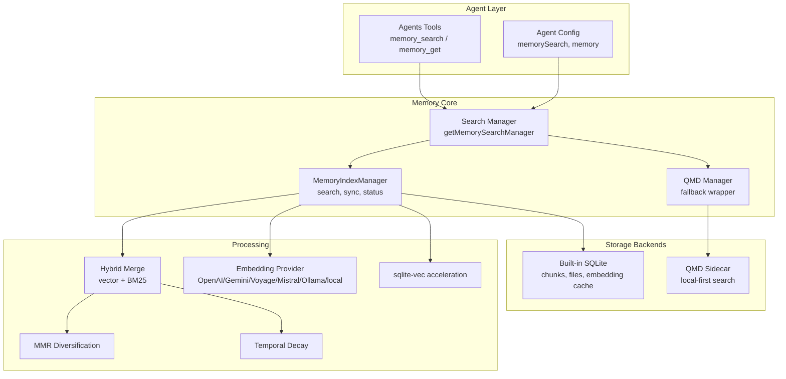
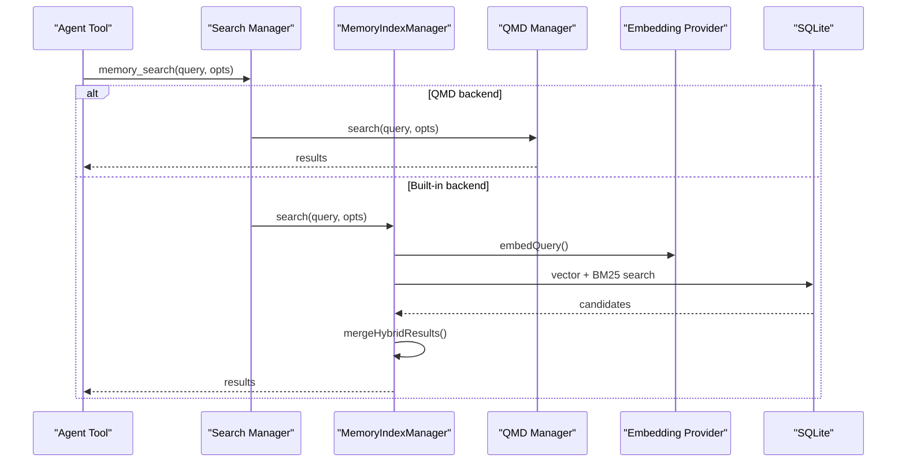
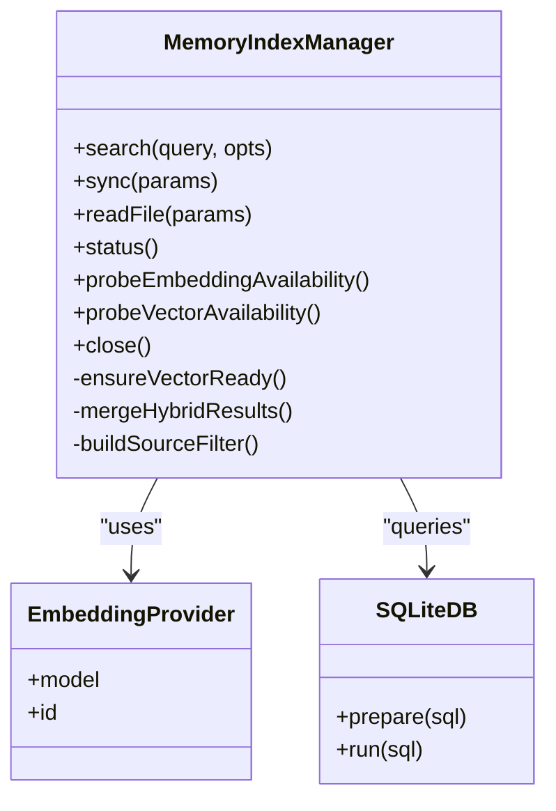
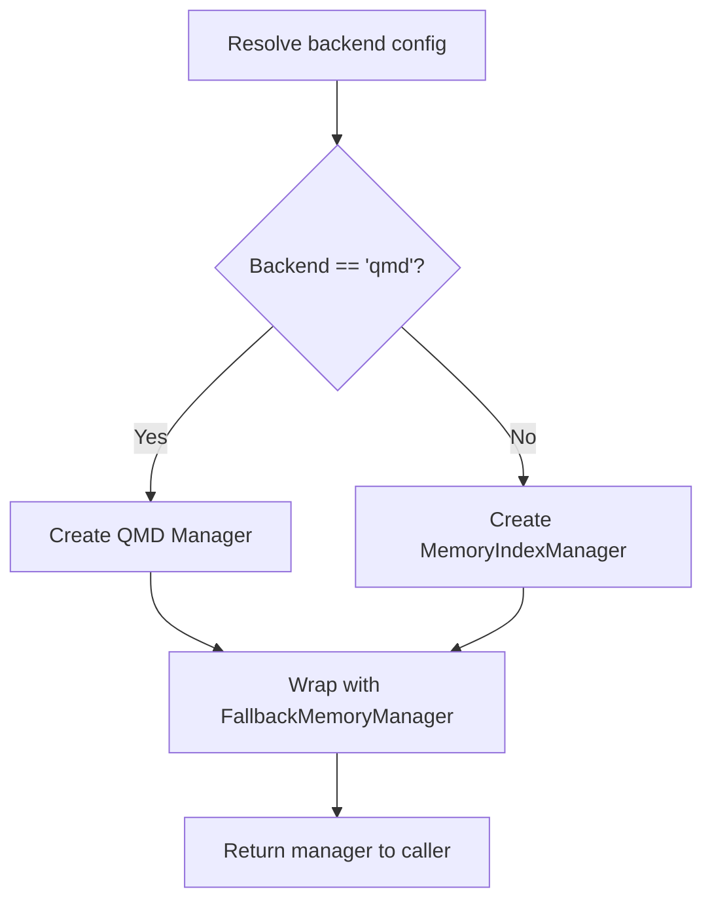
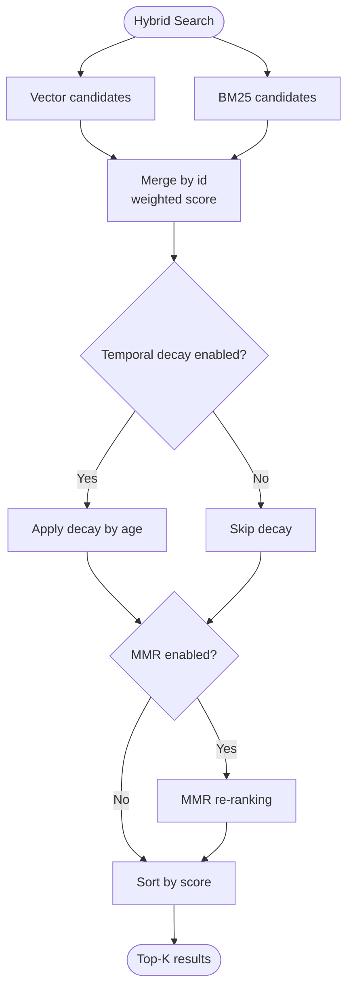
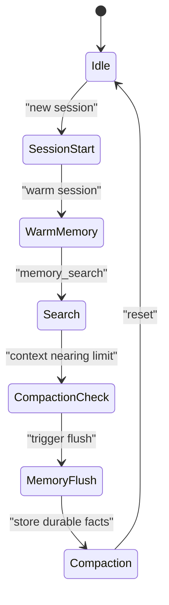
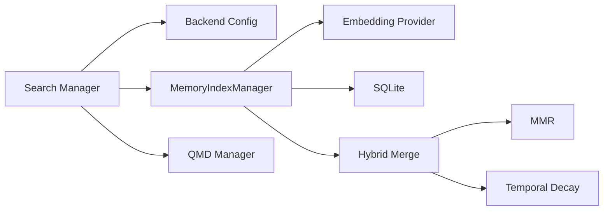

# Memory System

<cite>
**Referenced Files in This Document**
- [src/memory/index.ts](file://src/memory/index.ts)
- [src/memory/manager.ts](file://src/memory/manager.ts)
- [src/memory/search-manager.ts](file://src/memory/search-manager.ts)
- [src/memory/types.ts](file://src/memory/types.ts)
- [src/memory/backend-config.ts](file://src/memory/backend-config.ts)
- [src/memory/hybrid.ts](file://src/memory/hybrid.ts)
- [src/memory/mmr.ts](file://src/memory/mmr.ts)
- [src/memory/temporal-decay.ts](file://src/memory/temporal-decay.ts)
- [src/memory/qmd-manager.ts](file://src/memory/qmd-manager.ts)
- [src/memory/qmd-scope.ts](file://src/memory/qmd-scope.ts)
- [src/memory/qmd-process.ts](file://src/memory/qmd-process.ts)
- [src/memory/session-files.ts](file://src/memory/session-files.ts)
- [src/memory/manager-search.ts](file://src/memory/manager-search.ts)
- [src/memory/manager-embedding-ops.ts](file://src/memory/manager-embedding-ops.ts)
- [src/memory/embeddings.ts](file://src/memory/embeddings.ts)
- [src/memory/sqlite-vec.ts](file://src/memory/sqlite-vec.ts)
- [src/memory/sqlite.ts](file://src/memory/sqlite.ts)
- [src/memory/fs-utils.ts](file://src/memory/fs-utils.ts)
- [src/memory/internal.ts](file://src/memory/internal.ts)
- [src/memory/status-format.ts](file://src/memory/status-format.ts)
- [src/agents/memory-search.ts](file://src/agents/memory-search.ts)
- [src/agents/tools/memory-tool.ts](file://src/agents/tools/memory-tool.ts)
- [src/agents/pi-embedded-runner/extensions.ts](file://src/agents/pi-embedded-runner/extensions.ts)
- [src/auto-reply/reply/memory-flush.ts](file://src/auto-reply/reply/memory-flush.ts)
- [src/agents/pi-settings.ts](file://src/agents/pi-settings.ts)
- [src/config/types.memory.ts](file://src/config/types.memory.ts)
- [docs/concepts/memory.md](file://docs/concepts/memory.md)
- [extensions/memory-lancedb/index.ts](file://extensions/memory-lancedb/index.ts)
</cite>

## Table of Contents
1. [Introduction](#introduction)
2. [Project Structure](#project-structure)
3. [Core Components](#core-components)
4. [Architecture Overview](#architecture-overview)
5. [Detailed Component Analysis](#detailed-component-analysis)
6. [Dependency Analysis](#dependency-analysis)
7. [Performance Considerations](#performance-considerations)
8. [Troubleshooting Guide](#troubleshooting-guide)
9. [Conclusion](#conclusion)
10. [Appendices](#appendices)

## Introduction
This document explains OpenClaw’s memory management system with a focus on how memory is organized, indexed, searched, and maintained. It distinguishes between long-term memory (persistent Markdown files), working memory (contextual session state), and context preservation (pruning and compaction). It documents storage backends (built-in SQLite and QMD), indexing strategies, retrieval mechanisms, semantic search, relevance scoring, compaction and pruning, configuration, retention and privacy controls, and security considerations.

## Project Structure
The memory system is implemented primarily under src/memory and integrated with agent configuration and tools under src/agents. Key areas:
- Manager and search orchestration: src/memory/manager.ts, src/memory/search-manager.ts
- Backend configuration and QMD integration: src/memory/backend-config.ts, src/memory/qmd-manager.ts
- Hybrid search and post-processing: src/memory/hybrid.ts, src/memory/mmr.ts, src/memory/temporal-decay.ts
- Embedding providers and vector acceleration: src/memory/embeddings.ts, src/memory/sqlite-vec.ts
- Agent-facing tools and configuration: src/agents/memory-search.ts, src/agents/tools/memory-tool.ts
- Concepts and configuration reference: docs/concepts/memory.md, src/config/types.memory.ts

**Diagram sources**
- [src/memory/search-manager.ts](file://src/memory/search-manager.ts#L25-L86)
- [src/memory/manager.ts](file://src/memory/manager.ts#L61-L238)
- [src/memory/backend-config.ts](file://src/memory/backend-config.ts#L297-L354)
- [src/memory/hybrid.ts](file://src/memory/hybrid.ts#L57-L155)
- [src/memory/mmr.ts](file://src/memory/mmr.ts#L116-L183)
- [src/memory/temporal-decay.ts](file://src/memory/temporal-decay.ts#L1-L200)
- [src/memory/embeddings.ts](file://src/memory/embeddings.ts#L1-L200)
- [src/memory/sqlite-vec.ts](file://src/memory/sqlite-vec.ts#L1-L200)

**Section sources**
- [src/memory/index.ts](file://src/memory/index.ts#L1-L12)
- [src/memory/search-manager.ts](file://src/memory/search-manager.ts#L25-L86)
- [src/memory/manager.ts](file://src/memory/manager.ts#L61-L238)
- [src/memory/backend-config.ts](file://src/memory/backend-config.ts#L297-L354)
- [docs/concepts/memory.md](file://docs/concepts/memory.md#L1-L120)

## Core Components
- MemoryIndexManager: The primary search and sync engine backed by SQLite. Provides search, file reads, status reporting, and lifecycle management.
- Search Manager: Factory and fallback wrapper that selects between built-in and QMD backends.
- Hybrid Search Pipeline: Combines vector and BM25 keyword search with optional MMR and temporal decay.
- Embedding Providers: Remote and local providers (OpenAI, Gemini, Voyage, Mistral, Ollama, local llama).
- Storage Backends: Built-in SQLite with optional sqlite-vec acceleration; QMD sidecar for local-first search.
- Agent Tools: memory_search and memory_get exposed to agents; configuration-driven behavior.

**Section sources**
- [src/memory/manager.ts](file://src/memory/manager.ts#L61-L238)
- [src/memory/search-manager.ts](file://src/memory/search-manager.ts#L104-L246)
- [src/memory/hybrid.ts](file://src/memory/hybrid.ts#L57-L155)
- [src/memory/mmr.ts](file://src/memory/mmr.ts#L16-L26)
- [src/memory/temporal-decay.ts](file://src/memory/temporal-decay.ts#L1-L200)
- [src/memory/backend-config.ts](file://src/memory/backend-config.ts#L60-L70)
- [src/agents/tools/memory-tool.ts](file://src/agents/tools/memory-tool.ts#L69-L99)

## Architecture Overview
OpenClaw separates long-term memory (Markdown files) from working memory (session state). The built-in manager indexes Markdown into SQLite, enabling hybrid semantic and keyword search. QMD is an optional, experimental backend that runs a local search sidecar. Memory search integrates with agent configuration to control provider selection, hybrid scoring, and post-processing.

**Diagram sources**
- [src/memory/search-manager.ts](file://src/memory/search-manager.ts#L118-L139)
- [src/memory/manager.ts](file://src/memory/manager.ts#L256-L364)
- [src/memory/hybrid.ts](file://src/memory/hybrid.ts#L57-L155)
- [src/memory/embeddings.ts](file://src/memory/embeddings.ts#L1-L200)

## Detailed Component Analysis

### MemoryIndexManager
Responsibilities:
- Search orchestration: hybrid vector + BM25, optional MMR and temporal decay.
- Sync and watch: file system watchers, session deltas, and background sync.
- Status reporting: counts, provider info, cache stats, vector availability.
- Lifecycle: creation, caching, closing, readonly recovery.

Key behaviors:
- Hybrid search computes candidate pools from vector and BM25, merges with weighted scores, then applies optional MMR and temporal decay.
- Session warming and delta tracking ensure timely indexing of recent transcripts.
- Readonly database recovery reopens connections and resets vector readiness when DB becomes read-only.

**Diagram sources**
- [src/memory/manager.ts](file://src/memory/manager.ts#L61-L238)
- [src/memory/manager.ts](file://src/memory/manager.ts#L366-L449)
- [src/memory/embeddings.ts](file://src/memory/embeddings.ts#L1-L200)
- [src/memory/sqlite.ts](file://src/memory/sqlite.ts#L1-L200)

**Section sources**
- [src/memory/manager.ts](file://src/memory/manager.ts#L256-L449)
- [src/memory/manager.ts](file://src/memory/manager.ts#L626-L738)
- [src/memory/manager.ts](file://src/memory/manager.ts#L517-L551)

### Search Manager and Backends
- getMemorySearchManager selects backend based on configuration and caches instances.
- FallbackMemoryManager wraps a primary backend (QMD) and falls back to the built-in manager on failure.
- QMD backend configuration includes command, search modes, collections, sessions, update intervals, limits, and scope.

**Diagram sources**
- [src/memory/search-manager.ts](file://src/memory/search-manager.ts#L25-L86)
- [src/memory/search-manager.ts](file://src/memory/search-manager.ts#L104-L246)
- [src/memory/backend-config.ts](file://src/memory/backend-config.ts#L297-L354)

**Section sources**
- [src/memory/search-manager.ts](file://src/memory/search-manager.ts#L25-L86)
- [src/memory/search-manager.ts](file://src/memory/search-manager.ts#L104-L246)
- [src/memory/backend-config.ts](file://src/memory/backend-config.ts#L60-L70)

### Hybrid Search, MMR, and Temporal Decay
- Hybrid merge: vector and BM25 results are unioned by chunk id, weighted, then temporally decayed and optionally diversified via MMR.
- MMR: balances relevance and diversity using Jaccard similarity on tokenized content; lambda controls trade-off.
- Temporal decay: exponential decay by age with half-life configurable; evergreen files exempt.

**Diagram sources**
- [src/memory/hybrid.ts](file://src/memory/hybrid.ts#L57-L155)
- [src/memory/mmr.ts](file://src/memory/mmr.ts#L116-L183)
- [src/memory/temporal-decay.ts](file://src/memory/temporal-decay.ts#L1-L200)

**Section sources**
- [src/memory/hybrid.ts](file://src/memory/hybrid.ts#L57-L155)
- [src/memory/mmr.ts](file://src/memory/mmr.ts#L16-L26)
- [src/memory/mmr.ts](file://src/memory/mmr.ts#L116-L183)
- [src/memory/temporal-decay.ts](file://src/memory/temporal-decay.ts#L1-L200)

### Embedding Providers and Vector Acceleration
- Providers: OpenAI, Gemini, Voyage, Mistral, Ollama, and local node-llama-cpp.
- sqlite-vec acceleration: optional extension to perform vector similarity in SQLite for speed.
- Embedding cache: optional caching of chunk embeddings to avoid re-embedding unchanged text.

**Section sources**
- [src/memory/embeddings.ts](file://src/memory/embeddings.ts#L1-L200)
- [src/memory/sqlite-vec.ts](file://src/memory/sqlite-vec.ts#L1-L200)
- [src/memory/manager-embedding-ops.ts](file://src/memory/manager-embedding-ops.ts#L1-L200)

### QMD Backend
- QMD manager integrates a local search sidecar, supporting BM25 + vectors + reranking.
- Collections include default memory files and custom paths; sessions can be exported and indexed.
- Search modes: query, search, vsearch; fallback to query on unsupported flags.
- Scope controls visibility of results per session/channel.

**Section sources**
- [src/memory/qmd-manager.ts](file://src/memory/qmd-manager.ts#L1865-L1909)
- [src/memory/qmd-scope.ts](file://src/memory/qmd-scope.ts#L1-L200)
- [src/memory/qmd-process.ts](file://src/memory/qmd-process.ts#L1-L200)
- [src/memory/backend-config.ts](file://src/memory/backend-config.ts#L297-L354)

### Working Memory, Long-Term Memory, and Context Preservation
- Long-term memory: Markdown files in the workspace (MEMORY.md and memory/YYYY-MM-DD.md).
- Working memory: contextual session state; OpenClaw can trigger a silent memory flush before compaction to preserve durable facts.
- Context preservation: compaction and pruning policies adjust token reserves and keep recent context; cache TTL context pruning is supported.

**Diagram sources**
- [docs/concepts/memory.md](file://docs/concepts/memory.md#L52-L91)
- [src/auto-reply/reply/memory-flush.ts](file://src/auto-reply/reply/memory-flush.ts#L195-L228)
- [src/agents/pi-embedded-runner/extensions.ts](file://src/agents/pi-embedded-runner/extensions.ts#L30-L62)
- [src/agents/pi-settings.ts](file://src/agents/pi-settings.ts#L79-L122)

**Section sources**
- [docs/concepts/memory.md](file://docs/concepts/memory.md#L17-L91)
- [src/auto-reply/reply/memory-flush.ts](file://src/auto-reply/reply/memory-flush.ts#L195-L228)
- [src/agents/pi-embedded-runner/extensions.ts](file://src/agents/pi-embedded-runner/extensions.ts#L30-L62)
- [src/agents/pi-settings.ts](file://src/agents/pi-settings.ts#L79-L122)

### Agent Tools and Configuration
- memory_search: returns snippets with file path, line range, score, and citations mode.
- memory_get: targeted read of a specific Markdown file/lines.
- Configuration: memorySearch settings control provider, hybrid scoring, cache, and sync behavior.

**Section sources**
- [src/agents/tools/memory-tool.ts](file://src/agents/tools/memory-tool.ts#L69-L99)
- [src/agents/memory-search.ts](file://src/agents/memory-search.ts#L355-L366)
- [src/config/types.memory.ts](file://src/config/types.memory.ts#L1-L49)

## Dependency Analysis
- Search Manager depends on backend configuration resolution and can instantiate either MemoryIndexManager or QMD Manager.
- MemoryIndexManager depends on embedding providers, SQLite, and optional sqlite-vec.
- Hybrid pipeline depends on MMR and temporal decay modules.
- Agent tools depend on Search Manager and configuration resolution.

**Diagram sources**
- [src/memory/search-manager.ts](file://src/memory/search-manager.ts#L25-L86)
- [src/memory/backend-config.ts](file://src/memory/backend-config.ts#L297-L354)
- [src/memory/manager.ts](file://src/memory/manager.ts#L61-L238)
- [src/memory/hybrid.ts](file://src/memory/hybrid.ts#L57-L155)

**Section sources**
- [src/memory/search-manager.ts](file://src/memory/search-manager.ts#L25-L86)
- [src/memory/manager.ts](file://src/memory/manager.ts#L61-L238)
- [src/memory/hybrid.ts](file://src/memory/hybrid.ts#L57-L155)

## Performance Considerations
- Candidate multiplier and top-k selection control cost vs. recall.
- sqlite-vec acceleration reduces CPU overhead for vector similarity.
- Embedding cache reduces re-embedding costs for unchanged chunks.
- Debounced file watching and session delta thresholds minimize unnecessary syncs.
- MMR and temporal decay refine results to reduce downstream token consumption.

[No sources needed since this section provides general guidance]

## Troubleshooting Guide
Common issues and remedies:
- Readonly database errors: the manager detects SQLITE_READONLY and reopens the connection, resetting vector readiness and schema.
- Provider unavailability: fallback to alternate provider or FTS-only mode; embedding probe indicates availability.
- QMD failures: fallback to built-in manager; cache eviction allows retry with a fresh manager.
- Path access: readFile validates workspace containment and additional paths; throws on invalid paths.

**Section sources**
- [src/memory/manager.ts](file://src/memory/manager.ts#L468-L551)
- [src/memory/manager.ts](file://src/memory/manager.ts#L751-L766)
- [src/memory/search-manager.ts](file://src/memory/search-manager.ts#L118-L139)
- [src/memory/manager.ts](file://src/memory/manager.ts#L553-L624)

## Conclusion
OpenClaw’s memory system centers on persistent Markdown as the source of truth, with a flexible search backend (built-in SQLite or QMD) and robust hybrid retrieval. Operators can tune provider selection, hybrid scoring, MMR, and temporal decay to balance recall, precision, and recency. Compaction and pruning policies protect working memory while preserving durable facts. Privacy and retention are controlled via configuration, session scoping, and optional session export and retention.

[No sources needed since this section summarizes without analyzing specific files]

## Appendices

### Memory Usage Patterns and Examples
- Long-term memory: Write durable facts to MEMORY.md; daily notes to memory/YYYY-MM-DD.md.
- Semantic search: Use memory_search for recall; tune hybrid weights and candidate multiplier.
- Retrieval: Use memory_get for targeted reads; it gracefully handles missing files.
- QMD: Enable memory.backend = "qmd" and configure collections, sessions, and limits.

**Section sources**
- [docs/concepts/memory.md](file://docs/concepts/memory.md#L17-L91)
- [src/agents/tools/memory-tool.ts](file://src/agents/tools/memory-tool.ts#L69-L99)
- [src/memory/backend-config.ts](file://src/memory/backend-config.ts#L297-L354)

### Security, Access Controls, and Data Lifecycle
- Session scoping: QMD scope controls which sessions/channels can surface results.
- Workspace access: readFile enforces workspace containment and additional paths; symlinks are ignored.
- Data lifecycle: Sessions exported for QMD indexing; retention days govern cleanup.
- Privacy controls: Disable citations or restrict scope to limit exposure of snippet paths.

**Section sources**
- [src/memory/qmd-scope.ts](file://src/memory/qmd-scope.ts#L1-L200)
- [src/memory/manager.ts](file://src/memory/manager.ts#L553-L624)
- [src/memory/backend-config.ts](file://src/memory/backend-config.ts#L204-L218)
- [docs/concepts/memory.md](file://docs/concepts/memory.md#L260-L267)

### Memory Manipulation Techniques
- Forget memories (GDPR-compliant): Use memory_forget tool to delete specific memories by id or by search.
- Re-indexing: Changes in provider/model or chunking params trigger automatic reindex.

**Section sources**
- [extensions/memory-lancedb/index.ts](file://extensions/memory-lancedb/index.ts#L425-L462)
- [docs/concepts/memory.md](file://docs/concepts/memory.md#L392-L398)