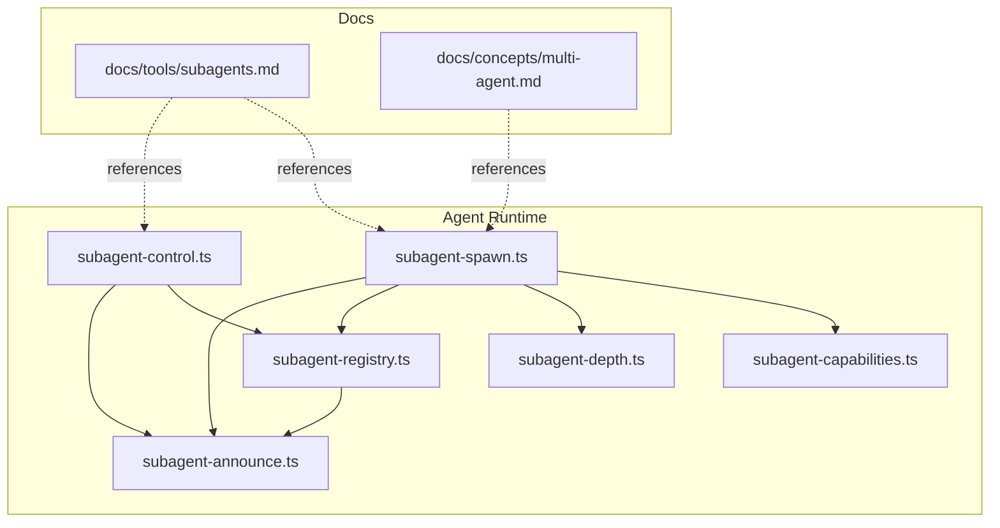
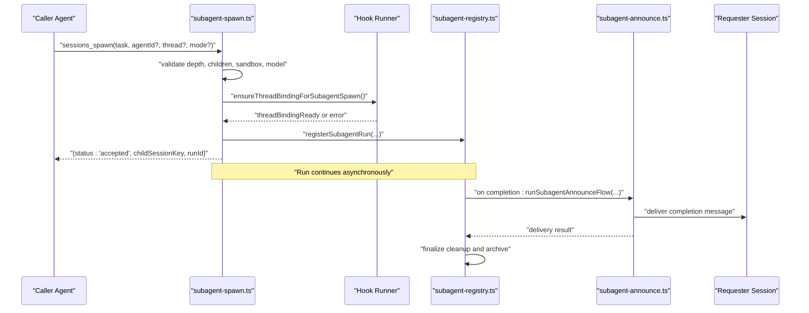
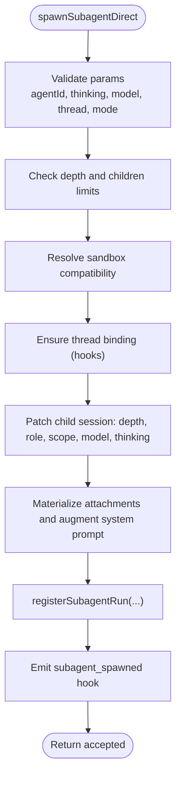
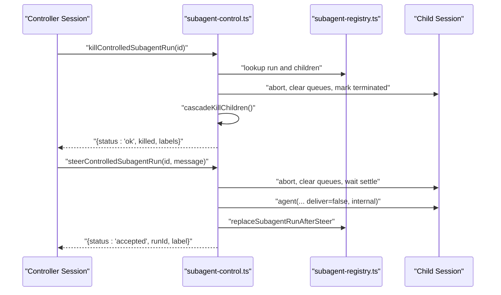
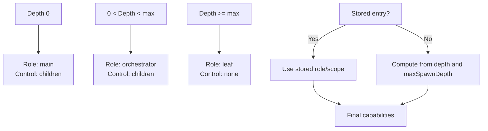
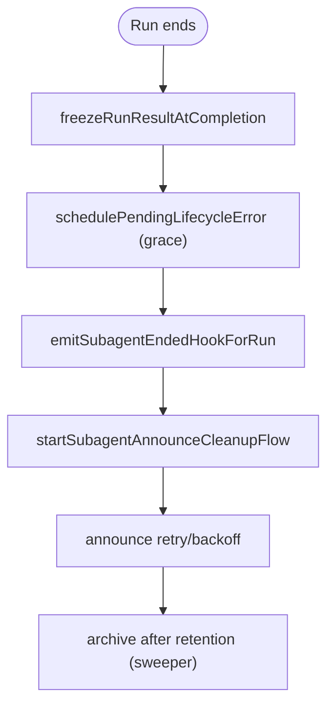
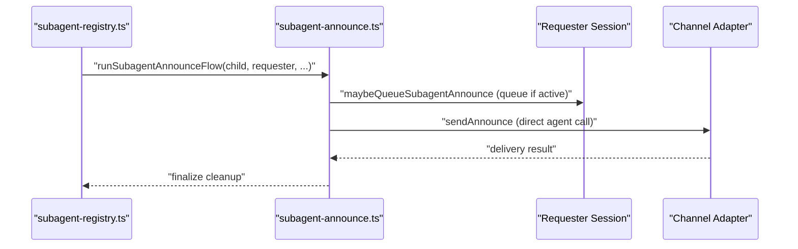
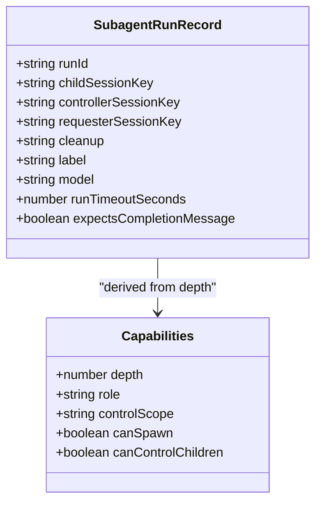
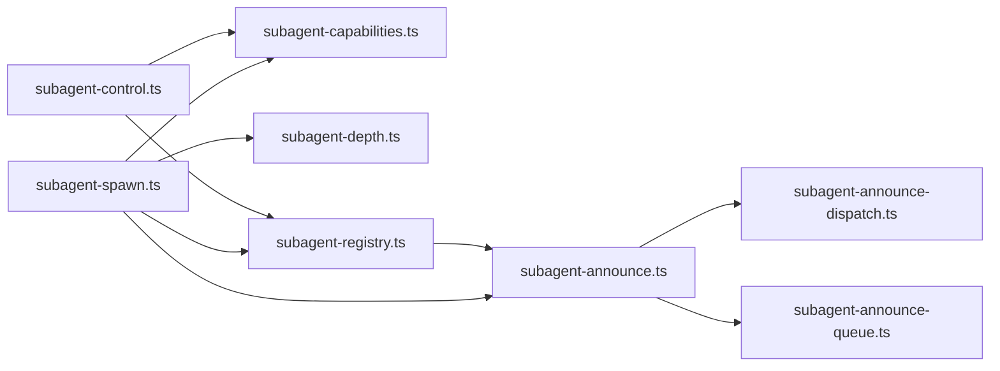

# Multi-Agent Support

<cite>
**Referenced Files in This Document**
- [subagent-spawn.ts](file://src/agents/subagent-spawn.ts)
- [subagent-control.ts](file://src/agents/subagent-control.ts)
- [subagent-capabilities.ts](file://src/agents/subagent-capabilities.ts)
- [subagent-depth.ts](file://src/agents/subagent-depth.ts)
- [subagent-registry.ts](file://src/agents/subagent-registry.ts)
- [subagent-announce.ts](file://src/agents/subagent-announce.ts)
- [subagent-registry.types.ts](file://src/agents/subagent-registry.types.ts)
- [subagents.md](file://docs/tools/subagents.md)
- [multi-agent.md](file://docs/concepts/multi-agent.md)
- [subagent-hooks.test.ts](file://extensions/discord/src/subagent-hooks.test.ts)
- [openclaw-tools.subagents.scope.test.ts](file://src/agents/openclaw-tools.subagents.scope.test.ts)
- [subagent-lifecycle-events.ts](file://src/agents/subagent-lifecycle-events.ts)
- [subagent-registry-completion.ts](file://src/agents/subagent-registry-completion.ts)
- [subagent-registry-cleanup.ts](file://src/agents/subagent-registry-cleanup.ts)
- [subagent-registry-state.ts](file://src/agents/subagent-registry-state.ts)
- [subagent-registry-queries.ts](file://src/agents/subagent-registry-queries.ts)
- [subagent-announce-dispatch.ts](file://src/agents/subagent-announce-dispatch.ts)
- [subagent-announce-queue.ts](file://src/agents/subagent-announce-queue.ts)
- [subagent-announce-queue.test.ts](file://src/agents/subagent-announce-queue.test.ts)
- [subagent-announce-queue.test.ts](file://src/agents/subagent-announce-queue.test.ts)
- [subagent-announce-queue.test.ts](file://src/agents/subagent-announce-queue.test.ts)
- [subagent-announce-queue.test.ts](file://src/agents/subagent-announce-queue.test.ts)
- [subagent-announce-queue.test.ts](file://src/agents/subagent-announce-queue.test.ts)
- [subagent-announce-queue.test.ts](file://src/agents/subagent-announce-queue.test.ts)
- [subagent-announce-queue.test.ts](file://src/agents/subagent-announce-queue.test.ts)
- [subagent-announce-queue.test.ts](file://src/agents/subagent-announce-queue.test.ts)
- [subagent-announce-queue.test.ts](file://src/agents/subagent-announce-queue.test.ts)
- [subagent-announce-queue.test.ts](file://src/agents/subagent-announce-queue.test.ts)
- [subagent-announce-queue.test.ts](file://src/agents/subagent-announce-queue.test.ts)
- [subagent-announce-queue.test.ts](file://src/agents/subagent-announce-queue.test.ts)
- [subagent-announce-queue.test.ts](file://src/agents/subagent-announce-queue.test.ts)
- [subagent-announce-queue.test.ts](file://src/agents/subagent-announce-queue.test.ts)
- [subagent-announce-queue.test.ts](file://src/agents/subagent-announce-queue.test.ts)
- [subagent-announce-queue.test.ts](file://src/agents/subagent-announce-queue.test.ts)
- [subagent-announce-queue.test.ts](file://src/agents/subagent-announce-queue.test.ts)
- [subagent-announce-queue.test.ts](file://src/agents/subagent-announce-queue.test.ts)
- [subagent-announce-queue.test.ts](file://src/agents/subagent-announce-queue.test.ts)
- [subagent-announce-queue.test.ts](file://src/agents/subagent-announce-queue.test.ts)
......
</cite>

## Table of Contents
1. [Introduction](#introduction)
2. [Project Structure](#project-structure)
3. [Core Components](#core-components)
4. [Architecture Overview](#architecture-overview)
5. [Detailed Component Analysis](#detailed-component-analysis)
6. [Dependency Analysis](#dependency-analysis)
7. [Performance Considerations](#performance-considerations)
8. [Troubleshooting Guide](#troubleshooting-guide)
9. [Conclusion](#conclusion)
10. [Appendices](#appendices)

## Introduction
This document explains multi-agent support in OpenClaw with a focus on subagent architecture, spawning, lifecycle management, and coordination. It covers subagent registry, control systems, depth limits, resource allocation, isolation and security boundaries, communication protocols, supervision and monitoring, and failure recovery. Practical examples illustrate multi-agent workflows, task delegation, and collaborative scenarios.

## Project Structure
OpenClaw organizes multi-agent capabilities around:
- Spawning and orchestration: subagent-spawn.ts
- Control and supervision: subagent-control.ts
- Capability and depth resolution: subagent-capabilities.ts, subagent-depth.ts
- Registry and persistence: subagent-registry.ts and related modules
- Announcement and delivery: subagent-announce.ts and related modules
- Documentation: docs/tools/subagents.md and docs/concepts/multi-agent.md

**Diagram sources**
- [subagent-spawn.ts:1-789](file://src/agents/subagent-spawn.ts#L1-L789)
- [subagent-control.ts:1-784](file://src/agents/subagent-control.ts#L1-L784)
- [subagent-capabilities.ts:1-157](file://src/agents/subagent-capabilities.ts#L1-L157)
- [subagent-depth.ts:1-177](file://src/agents/subagent-depth.ts#L1-L177)
- [subagent-registry.ts:1-1486](file://src/agents/subagent-registry.ts#L1-L1486)
- [subagent-announce.ts:1-1497](file://src/agents/subagent-announce.ts#L1-L1497)
- [subagents.md:1-296](file://docs/tools/subagents.md#L1-L296)
- [multi-agent.md:1-553](file://docs/concepts/multi-agent.md#L1-L553)

**Section sources**
- [subagent-spawn.ts:1-789](file://src/agents/subagent-spawn.ts#L1-L789)
- [subagent-control.ts:1-784](file://src/agents/subagent-control.ts#L1-L784)
- [subagent-capabilities.ts:1-157](file://src/agents/subagent-capabilities.ts#L1-L157)
- [subagent-depth.ts:1-177](file://src/agents/subagent-depth.ts#L1-L177)
- [subagent-registry.ts:1-1486](file://src/agents/subagent-registry.ts#L1-L1486)
- [subagent-announce.ts:1-1497](file://src/agents/subagent-announce.ts#L1-L1497)
- [subagents.md:1-296](file://docs/tools/subagents.md#L1-L296)
- [multi-agent.md:1-553](file://docs/concepts/multi-agent.md#L1-L553)

## Core Components
- Subagent spawning: Validates constraints, resolves runtime and model, prepares thread binding, registers the run, and emits lifecycle hooks.
- Subagent control: Lists, kills, steers, and sends messages to controlled runs; enforces scope and ownership; manages rate limits and queues.
- Capabilities and depth: Computes role and control scope by spawn depth; resolves stored capabilities from session store.
- Registry: Tracks runs, resumes pending announces, schedules cleanup, handles lifecycle transitions, and archives terminated runs.
- Announcement: Builds and delivers completion messages; supports queueing and retry/backoff; integrates with delivery hooks and thread binding.

**Section sources**
- [subagent-spawn.ts:257-788](file://src/agents/subagent-spawn.ts#L257-L788)
- [subagent-control.ts:117-784](file://src/agents/subagent-control.ts#L117-L784)
- [subagent-capabilities.ts:89-157](file://src/agents/subagent-capabilities.ts#L89-L157)
- [subagent-depth.ts:124-177](file://src/agents/subagent-depth.ts#L124-L177)
- [subagent-registry.ts:65-800](file://src/agents/subagent-registry.ts#L65-L800)
- [subagent-announce.ts:595-800](file://src/agents/subagent-announce.ts#L595-L800)

## Architecture Overview
The subagent subsystem is composed of tightly integrated modules that coordinate spawning, control, persistence, and announcement. Spawning writes capability metadata into the session store; control resolves capabilities and enforces scope; registry persists and resumes runs; announcement delivers results back to the requester.

**Diagram sources**
- [subagent-spawn.ts:196-255](file://src/agents/subagent-spawn.ts#L196-L255)
- [subagent-registry.ts:529-580](file://src/agents/subagent-registry.ts#L529-L580)
- [subagent-announce.ts:595-800](file://src/agents/subagent-announce.ts#L595-L800)

**Section sources**
- [subagent-spawn.ts:196-255](file://src/agents/subagent-spawn.ts#L196-L255)
- [subagent-registry.ts:529-580](file://src/agents/subagent-registry.ts#L529-L580)
- [subagent-announce.ts:595-800](file://src/agents/subagent-announce.ts#L595-L800)

## Detailed Component Analysis

### Subagent Spawning
Responsibilities:
- Validate spawn parameters (agentId, thinking, model, thread, mode, cleanup).
- Enforce depth and child limits.
- Resolve sandbox compatibility and runtime.
- Prepare thread binding via channel hooks.
- Patch child session with spawn depth, role, control scope, model, thinking.
- Materialize attachments and augment system prompt.
- Register run and emit lifecycle hooks.

Key behaviors:
- Depth enforcement uses spawn depth from session store and configured maxSpawnDepth.
- Thread binding requires channel plugin hooks; otherwise spawn fails.
- Attachments are materialized and appended to system prompt suffix.
- Run registration captures expectations (completion message, timeout, workspace inheritance).

**Diagram sources**
- [subagent-spawn.ts:257-788](file://src/agents/subagent-spawn.ts#L257-L788)

**Section sources**
- [subagent-spawn.ts:257-788](file://src/agents/subagent-spawn.ts#L257-L788)

### Subagent Control and Supervision
Responsibilities:
- Resolve controller capabilities (scope, ownership).
- List controlled runs and build human-readable summaries.
- Kill runs and cascade to descendants.
- Steer runs by injecting a new message and restarting the child run.
- Send messages to child runs and wait for responses.
- Enforce rate limits and prevent self-steering.

Key behaviors:
- Ownership checks ensure only runs spawned from the same controller session can be controlled.
- Leaf subagents (depth ≥ maxSpawnDepth) have controlScope "none".
- Rate limiting prevents excessive steer commands.
- Cascading kill stops all descendants recursively.

**Diagram sources**
- [subagent-control.ts:416-524](file://src/agents/subagent-control.ts#L416-L524)
- [subagent-control.ts:526-685](file://src/agents/subagent-control.ts#L526-L685)
- [subagent-registry.ts:373-414](file://src/agents/subagent-registry.ts#L373-L414)

**Section sources**
- [subagent-control.ts:117-784](file://src/agents/subagent-control.ts#L117-L784)
- [subagent-registry.ts:373-414](file://src/agents/subagent-registry.ts#L373-L414)

### Subagent Capabilities and Depth
Responsibilities:
- Compute role and control scope from spawn depth and maxSpawnDepth.
- Resolve stored capabilities from session store for restored or legacy keys.
- Normalize and validate role/control scope entries.

Key behaviors:
- Depth 0: main
- Depth ∈ (0, maxSpawnDepth): orchestrator
- Depth ≥ maxSpawnDepth: leaf (no spawn, no control)
- Stored entries override computed values when present.

**Diagram sources**
- [subagent-capabilities.ts:89-157](file://src/agents/subagent-capabilities.ts#L89-L157)
- [subagent-depth.ts:124-177](file://src/agents/subagent-depth.ts#L124-L177)

**Section sources**
- [subagent-capabilities.ts:89-157](file://src/agents/subagent-capabilities.ts#L89-L157)
- [subagent-depth.ts:124-177](file://src/agents/subagent-depth.ts#L124-L177)

### Subagent Registry and Lifecycle Management
Responsibilities:
- Persist runs to disk and resume pending announces on startup.
- Track lifecycle transitions (start, end, error) and schedule cleanup.
- Freeze and cache final results for announce delivery.
- Enforce announce retry/backoff and expiry.
- Archive runs after configured retention.

Key behaviors:
- Pending completion runs are tracked and retried with exponential backoff.
- Grace period delays premature error cleanup to allow subsequent lifecycle events.
- Cleanup flow emits hooks and performs attachment/session cleanup.
- Sweeper purges archived runs and deletes transcripts.

**Diagram sources**
- [subagent-registry.ts:451-530](file://src/agents/subagent-registry.ts#L451-L530)
- [subagent-registry.ts:581-658](file://src/agents/subagent-registry.ts#L581-L658)
- [subagent-registry.ts:726-763](file://src/agents/subagent-registry.ts#L726-L763)

**Section sources**
- [subagent-registry.ts:451-530](file://src/agents/subagent-registry.ts#L451-L530)
- [subagent-registry.ts:581-658](file://src/agents/subagent-registry.ts#L581-L658)
- [subagent-registry.ts:726-763](file://src/agents/subagent-registry.ts#L726-L763)

### Announcement and Communication Protocols
Responsibilities:
- Build completion messages with status, stats, and follow-up instructions.
- Deliver via direct agent call or queue routing with retry/backoff.
- Respect thread binding and channel-specific delivery hooks.
- Aggregate child findings and handle silent replies.

Key behaviors:
- Direct delivery uses idempotent keys; queue routing is used when direct delivery is unavailable.
- Transient errors are retried with exponential backoff; permanent errors halt delivery.
- Delivery origin merges requester and session entry contexts, prioritizing requester origin.

**Diagram sources**
- [subagent-announce.ts:595-800](file://src/agents/subagent-announce.ts#L595-L800)
- [subagent-announce-dispatch.ts:1-200](file://src/agents/subagent-announce-dispatch.ts#L1-L200)
- [subagent-announce-queue.ts:1-200](file://src/agents/subagent-announce-queue.ts#L1-L200)

**Section sources**
- [subagent-announce.ts:595-800](file://src/agents/subagent-announce.ts#L595-L800)
- [subagent-announce-dispatch.ts:1-200](file://src/agents/subagent-announce-dispatch.ts#L1-L200)
- [subagent-announce-queue.ts:1-200](file://src/agents/subagent-announce-queue.ts#L1-L200)

### Practical Examples and Workflows
- Orchestrator pattern: Main agent spawns an orchestrator sub-agent (depth 1) with maxSpawnDepth ≥ 2, which then spawns worker sub-sub-agents (depth 2) to perform tasks in parallel. The orchestrator aggregates results and announces to the main agent, which then announces to the user.
- Thread-bound collaboration: Enable thread binding for channels that support it; spawn a persistent session (mode "session") and use focus/unfocus commands to manage ongoing collaboration.
- Task delegation: Use sessions_spawn with agentId to delegate work to a specialized agent; constrain model and thinking to reduce cost.
- Cascade stop: Stop an orchestrator to terminate all its children; use /subagents kill all to stop all controlled runs.

**Section sources**
- [subagents.md:144-201](file://docs/tools/subagents.md#L144-L201)
- [subagent-spawn.ts:334-351](file://src/agents/subagent-spawn.ts#L334-L351)

### Subagent Isolation, Security Boundaries, and Scope
- Session isolation: Each subagent runs in its own session key and has its own workspace and auth profile resolution.
- Tool policy by depth: Depth 1 orchestrators gain additional session tools; depth 2 workers do not gain spawn or session tools.
- Scope enforcement: Leaf subagents cannot control other sessions; ownership checks ensure only runs spawned from the same controller session can be controlled.
- Sandbox inheritance: Spawning unsandboxed subagents from a sandboxed requester is rejected unless sandbox="require" and target runtime is sandboxed.

**Diagram sources**
- [subagent-registry.types.ts:6-59](file://src/agents/subagent-registry.types.ts#L6-L59)
- [subagent-capabilities.ts:110-120](file://src/agents/subagent-capabilities.ts#L110-L120)

**Section sources**
- [subagent-control.ts:320-330](file://src/agents/subagent-control.ts#L320-L330)
- [subagent-spawn.ts:374-396](file://src/agents/subagent-spawn.ts#L374-L396)
- [openclaw-tools.subagents.scope.test.ts:57-75](file://src/agents/openclaw-tools.subagents.scope.test.ts#L57-L75)

### Subagent Supervision, Monitoring, and Failure Recovery
- Monitoring: Use /subagents list/info/log to inspect runs, status, runtime, tokens, and outcomes.
- Failure recovery: Registry defers premature error cleanup; announces retry with backoff; gives up after max attempts or expiry; sweeper archives and cleans up.
- Lifecycle hooks: subagent_spawned, subagent_ended hooks integrate with plugins and context engines.

**Section sources**
- [subagent-registry.ts:279-313](file://src/agents/subagent-registry.ts#L279-L313)
- [subagent-registry.ts:607-658](file://src/agents/subagent-registry.ts#L607-L658)
- [subagent-registry.ts:726-763](file://src/agents/subagent-registry.ts#L726-L763)
- [subagent-registry-completion.ts:1-200](file://src/agents/subagent-registry-completion.ts#L1-L200)
- [subagent-lifecycle-events.ts:1-200](file://src/agents/subagent-lifecycle-events.ts#L1-L200)

## Dependency Analysis
The subagent subsystem exhibits cohesive coupling among spawning, control, registry, and announcement modules. Dependencies:
- subagent-spawn.ts depends on subagent-capabilities.ts, subagent-depth.ts, subagent-registry.ts, subagent-announce.ts, and hook runner.
- subagent-control.ts depends on subagent-registry.ts, subagent-capabilities.ts, and gateway calls.
- subagent-registry.ts depends on subagent-announce.ts, lifecycle events, and completion/cleanup modules.
- subagent-announce.ts depends on delivery router, queue, and hooks.

**Diagram sources**
- [subagent-spawn.ts:1-789](file://src/agents/subagent-spawn.ts#L1-L789)
- [subagent-control.ts:1-784](file://src/agents/subagent-control.ts#L1-L784)
- [subagent-capabilities.ts:1-157](file://src/agents/subagent-capabilities.ts#L1-L157)
- [subagent-depth.ts:1-177](file://src/agents/subagent-depth.ts#L1-L177)
- [subagent-registry.ts:1-1486](file://src/agents/subagent-registry.ts#L1-L1486)
- [subagent-announce.ts:1-1497](file://src/agents/subagent-announce.ts#L1-L1497)
- [subagent-announce-dispatch.ts:1-200](file://src/agents/subagent-announce-dispatch.ts#L1-L200)
- [subagent-announce-queue.ts:1-200](file://src/agents/subagent-announce-queue.ts#L1-L200)

**Section sources**
- [subagent-spawn.ts:1-789](file://src/agents/subagent-spawn.ts#L1-L789)
- [subagent-control.ts:1-784](file://src/agents/subagent-control.ts#L1-L784)
- [subagent-registry.ts:1-1486](file://src/agents/subagent-registry.ts#L1-L1486)

## Performance Considerations
- Concurrency: Dedicated subagent lane with configurable maxConcurrent to limit parallelism.
- Timeout: Default runTimeoutSeconds can be configured; runs are aborted after the timeout.
- Attachment handling: Large outputs are materialized and stored; consider cleanup and retention policies.
- Announce retry/backoff: Exponential backoff reduces load on transient failures; max retry count prevents infinite loops.

[No sources needed since this section provides general guidance]

## Troubleshooting Guide
Common issues and resolutions:
- Thread binding unavailable: Ensure channel plugin registers subagent_spawning hooks; otherwise spawn fails.
- Forbidden operations: Leaf subagents cannot control others; ownership checks prevent unauthorized control.
- Rate limiting: Steer commands are rate-limited; wait before sending another steer.
- Announce failures: Transient errors are retried; permanent errors indicate misconfiguration or unsupported channel.
- Orphan runs: Registry prunes runs missing session entries or session ids; verify session state.

**Section sources**
- [subagent-spawn.ts:196-255](file://src/agents/subagent-spawn.ts#L196-L255)
- [subagent-control.ts:421-428](file://src/agents/subagent-control.ts#L421-L428)
- [subagent-control.ts:588-600](file://src/agents/subagent-control.ts#L588-L600)
- [subagent-announce.ts:126-140](file://src/agents/subagent-announce.ts#L126-L140)
- [subagent-registry.ts:153-182](file://src/agents/subagent-registry.ts#L153-L182)

## Conclusion
OpenClaw’s subagent system provides a robust foundation for multi-agent workflows: isolated sessions, configurable depth and scope, reliable spawning and control, resilient announcement delivery, and comprehensive lifecycle management. By leveraging documented patterns and controls, teams can design orchestrator-centric architectures that scale across tasks, channels, and collaboration needs while maintaining strong isolation and security boundaries.

## Appendices

### Design Guidance and Best Practices
- Use orchestrator pattern for multi-level delegation; set maxSpawnDepth appropriately.
- Configure model and thinking per run to balance quality and cost.
- Prefer thread-bound sessions for ongoing collaboration; manage idle/max-age carefully.
- Enforce tool policies by depth to minimize risk exposure.
- Monitor runs with /subagents commands and tune concurrency and timeouts.

**Section sources**
- [subagents.md:144-201](file://docs/tools/subagents.md#L144-L201)
- [subagent-spawn.ts:308-317](file://src/agents/subagent-spawn.ts#L308-L317)

### Channel and Thread Binding Notes
- Thread binding requires channel support and proper configuration; Discord is currently supported.
- Use focus/unfocus and session controls to manage thread-bound sessions.

**Section sources**
- [subagents.md:96-125](file://docs/tools/subagents.md#L96-L125)
- [subagent-hooks.test.ts:99-161](file://extensions/discord/src/subagent-hooks.test.ts#L99-L161)