# Session Management

<cite>
**Referenced Files in This Document**
- [session.md](file://docs/concepts/session.md)
- [sessions.md](file://docs/cli/sessions.md)
- [session-id.ts](file://src/sessions/session-id.ts)
- [session-key-utils.ts](file://src/sessions/session-key-utils.ts)
- [transcript-events.ts](file://src/sessions/transcript-events.ts)
- [input-provenance.ts](file://src/sessions/input-provenance.ts)
- [level-overrides.ts](file://src/sessions/level-overrides.ts)
- [send-policy.ts](file://src/sessions/send-policy.ts)
- [session-label.ts](file://src/sessions/session-label.ts)
- [model-overrides.ts](file://src/sessions/model-overrides.ts)
- [store-cache.ts](file://src/config/sessions/store-cache.ts)
- [disk-budget.ts](file://src/config/sessions/disk-budget.ts)
- [store.ts](file://src/config/sessions/store.ts)
- [store-maintenance.ts](file://src/config/sessions/store-maintenance.ts)
- [session-reaper.ts](file://src/cron/session-reaper.ts)
- [session-maintenance-warning.ts](file://src/infra/session-maintenance-warning.ts)
- [chat.abort-persistence.test.ts](file://src/gateway/server-methods/chat.abort-persistence.test.ts)
</cite>

## Table of Contents
1. [Introduction](#introduction)
2. [Project Structure](#project-structure)
3. [Core Components](#core-components)
4. [Architecture Overview](#architecture-overview)
5. [Detailed Component Analysis](#detailed-component-analysis)
6. [Dependency Analysis](#dependency-analysis)
7. [Performance Considerations](#performance-considerations)
8. [Troubleshooting Guide](#troubleshooting-guide)
9. [Conclusion](#conclusion)
10. [Appendices](#appendices)

## Introduction
This document explains OpenClaw’s session management system comprehensively. It covers session lifecycle, session IDs, session key derivation and classification, storage formats, JSONL transcript structure, metadata management, multi-agent coordination, session cloning and inheritance patterns, pruning and cleanup policies, storage optimization, debugging and repair techniques, state recovery, security and access controls, and concurrent handling. It also provides examples of session manipulation, custom session handlers, and advanced session patterns.

## Project Structure
OpenClaw organizes session logic across concept documentation, CLI references, and core runtime modules:
- Concepts and CLI references define policies, keys, and operational guidance.
- Core runtime modules implement session key parsing, provenance, send policy, model/verbose overrides, store caching, maintenance, and disk budget enforcement.
- Utilities support session ID validation, transcript event notifications, and cron-driven reaping.

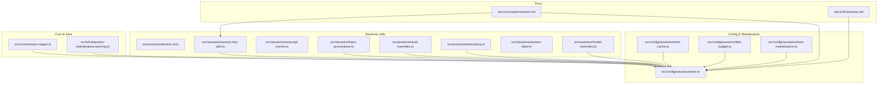

**Diagram sources**
- [session.md](file://docs/concepts/session.md#L1-L311)
- [sessions.md](file://docs/cli/sessions.md#L1-L105)
- [session-id.ts](file://src/sessions/session-id.ts#L1-L6)
- [session-key-utils.ts](file://src/sessions/session-key-utils.ts#L1-L133)
- [transcript-events.ts](file://src/sessions/transcript-events.ts#L1-L30)
- [input-provenance.ts](file://src/sessions/input-provenance.ts#L1-L82)
- [level-overrides.ts](file://src/sessions/level-overrides.ts#L1-L33)
- [send-policy.ts](file://src/sessions/send-policy.ts#L1-L124)
- [session-label.ts](file://src/sessions/session-label.ts#L1-L21)
- [model-overrides.ts](file://src/sessions/model-overrides.ts#L1-L113)
- [store-cache.ts](file://src/config/sessions/store-cache.ts#L1-L81)
- [disk-budget.ts](file://src/config/sessions/disk-budget.ts#L50-L89)
- [store.ts](file://src/config/sessions/store.ts#L46-L67)
- [store-maintenance.ts](file://src/config/sessions/store-maintenance.ts#L150-L219)
- [session-reaper.ts](file://src/cron/session-reaper.ts#L81-L109)
- [session-maintenance-warning.ts](file://src/infra/session-maintenance-warning.ts#L42-L78)

**Section sources**
- [session.md](file://docs/concepts/session.md#L1-L311)
- [sessions.md](file://docs/cli/sessions.md#L1-L105)

## Core Components
- Session keys and scoping: canonical and legacy key parsing, chat-type derivation, cron/subagent/acp detection, thread parent resolution.
- Session IDs: UUID validation and recognition.
- Transcript events: listeners for JSONL updates.
- Input provenance: inter-session and external provenance tagging.
- Overrides: model/provider and verbose level overrides.
- Send policy: allow/deny rules by channel, chat type, and key prefixes.
- Store cache and maintenance: TTL caching, rotation, pruning, capping, disk budget enforcement.
- Disk budget utilities: byte measurement, ref-counting, and eviction ordering.
- Maintenance warnings and cron reaper: active session protection and cron-only cleanup.

**Section sources**
- [session-key-utils.ts](file://src/sessions/session-key-utils.ts#L1-L133)
- [session-id.ts](file://src/sessions/session-id.ts#L1-L6)
- [transcript-events.ts](file://src/sessions/transcript-events.ts#L1-L30)
- [input-provenance.ts](file://src/sessions/input-provenance.ts#L1-L82)
- [level-overrides.ts](file://src/sessions/level-overrides.ts#L1-L33)
- [send-policy.ts](file://src/sessions/send-policy.ts#L1-L124)
- [store-cache.ts](file://src/config/sessions/store-cache.ts#L1-L81)
- [store.ts](file://src/config/sessions/store.ts#L46-L67)
- [store-maintenance.ts](file://src/config/sessions/store-maintenance.ts#L150-L219)
- [disk-budget.ts](file://src/config/sessions/disk-budget.ts#L50-L89)
- [session-reaper.ts](file://src/cron/session-reaper.ts#L81-L109)
- [session-maintenance-warning.ts](file://src/infra/session-maintenance-warning.ts#L42-L78)

## Architecture Overview
OpenClaw centralizes session ownership on the gateway. The session store is a per-agent JSON map keyed by session keys. Transcripts are stored as JSONL files named by session ID. Maintenance runs on write or on-demand via CLI, applying pruning, capping, rotation, and optional disk budget enforcement. Provenance and overrides enrich runtime behavior, while send policy governs delivery.

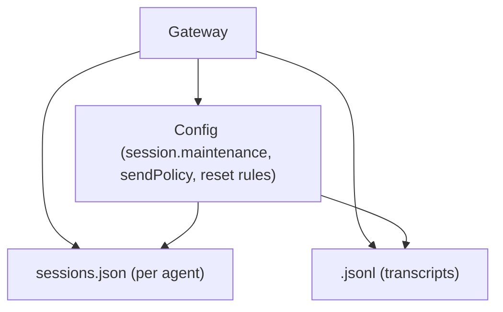

**Diagram sources**
- [session.md](file://docs/concepts/session.md#L57-L72)
- [store.ts](file://src/config/sessions/store.ts#L353-L462)
- [store-maintenance.ts](file://src/config/sessions/store-maintenance.ts#L150-L219)

## Detailed Component Analysis

### Session Keys and Scoping
- Canonical keys: agent-scoped with normalized segments. Parsing validates structure and returns agentId and rest.
- Chat-type derivation: identifies direct, group, channel, or unknown from tokens and legacy patterns.
- Specialized key families:
  - Cron: run-specific keys.
  - Subagent: nested depth computed from separators.
  - ACP: prefixed or agent-scoped forms.
- Thread parent resolution: strips thread/topic suffixes to find the parent session key.

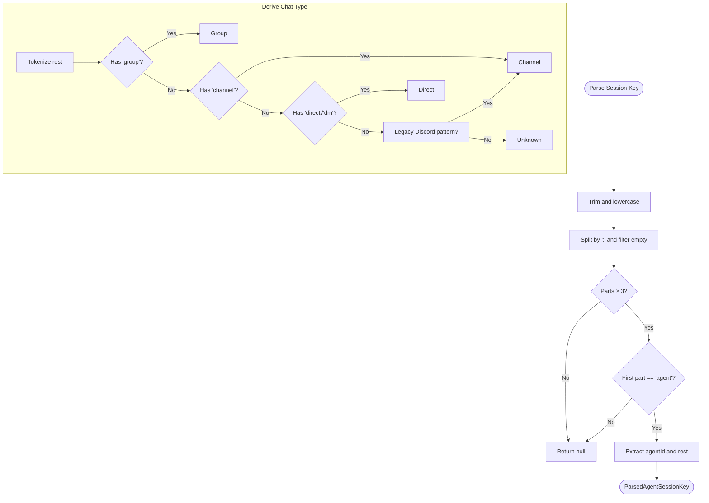

**Diagram sources**
- [session-key-utils.ts](file://src/sessions/session-key-utils.ts#L12-L59)

**Section sources**
- [session-key-utils.ts](file://src/sessions/session-key-utils.ts#L1-L133)

### Session IDs and Stability Guarantees
- Session IDs are validated as UUIDs. Recognition functions ensure stable identification across inputs.

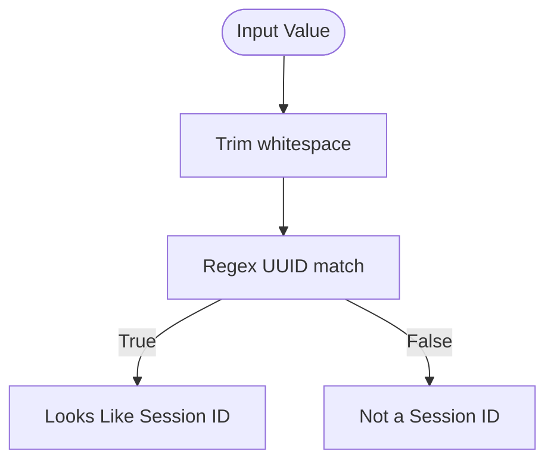

**Diagram sources**
- [session-id.ts](file://src/sessions/session-id.ts#L1-L6)

**Section sources**
- [session-id.ts](file://src/sessions/session-id.ts#L1-L6)

### Transcript Events and JSONL Updates
- Event emitter notifies listeners when a session transcript file is updated, with deduplication and error isolation.

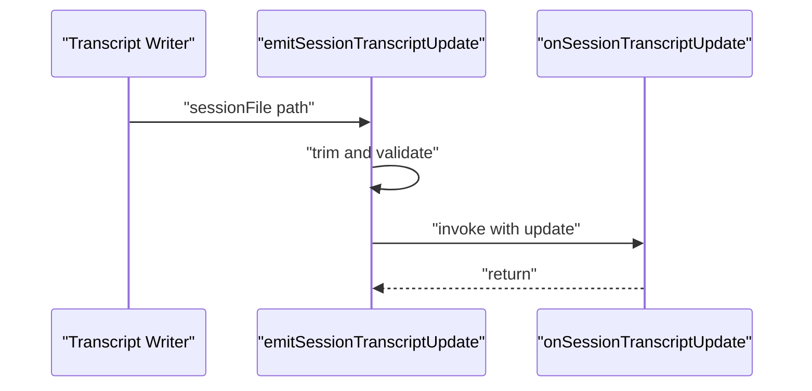

**Diagram sources**
- [transcript-events.ts](file://src/sessions/transcript-events.ts#L16-L29)

**Section sources**
- [transcript-events.ts](file://src/sessions/transcript-events.ts#L1-L30)

### Input Provenance and Inter-Session Routing
- Provenance kinds: external_user, inter_session, internal_system.
- Applies provenance to user messages when absent, enabling downstream routing and auditing.

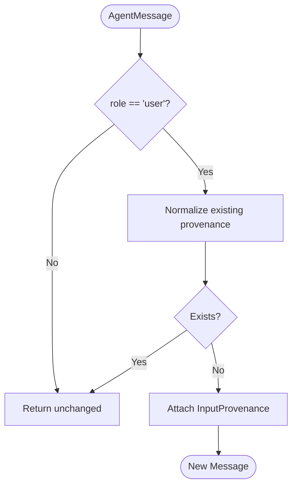

**Diagram sources**
- [input-provenance.ts](file://src/sessions/input-provenance.ts#L50-L68)

**Section sources**
- [input-provenance.ts](file://src/sessions/input-provenance.ts#L1-L82)

### Model and Verbose Level Overrides
- Model override applies provider/model selection and clears stale runtime fields to align status display.
- Verbose override normalizes and applies on/off/null semantics to session entries.

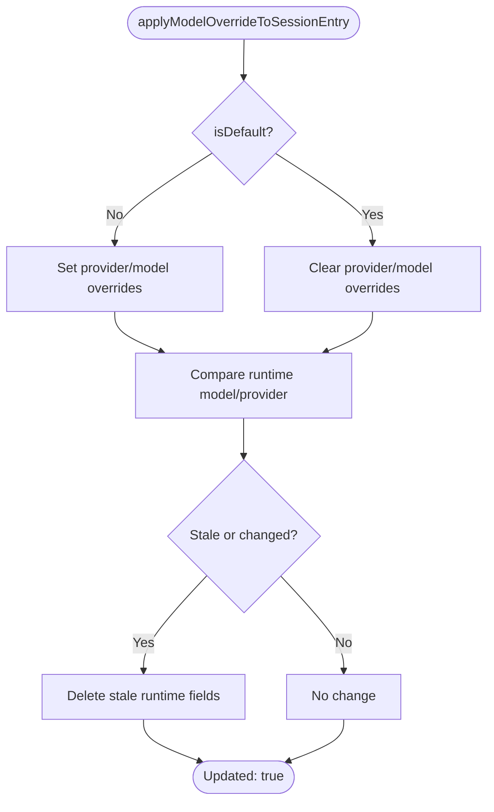

**Diagram sources**
- [model-overrides.ts](file://src/sessions/model-overrides.ts#L9-L112)

**Section sources**
- [model-overrides.ts](file://src/sessions/model-overrides.ts#L1-L113)
- [level-overrides.ts](file://src/sessions/level-overrides.ts#L1-L33)

### Send Policy Decision Engine
- Resolves allow/deny decisions from runtime overrides, config rules, and defaults. Supports matching by channel, chat type, and key prefixes (raw and stripped).

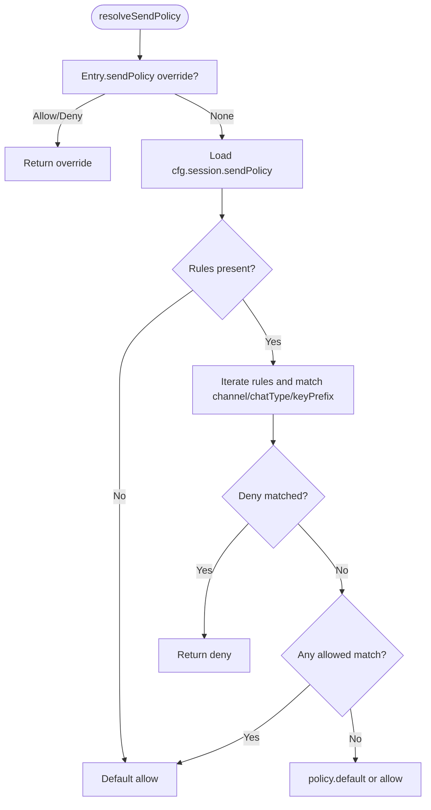

**Diagram sources**
- [send-policy.ts](file://src/sessions/send-policy.ts#L53-L123)

**Section sources**
- [send-policy.ts](file://src/sessions/send-policy.ts#L1-L124)

### Session Store Cache and Maintenance
- TTL cache prevents frequent reads/writes; cache invalidation occurs on mtime/size changes.
- Maintenance modes:
  - warn: compute eviction without mutating.
  - enforce: prune stale, cap count, archive removed transcripts, purge old archives, rotate sessions.json, enforce disk budget.
- Active session protection: warns if the active session would be evicted under warn-only mode.

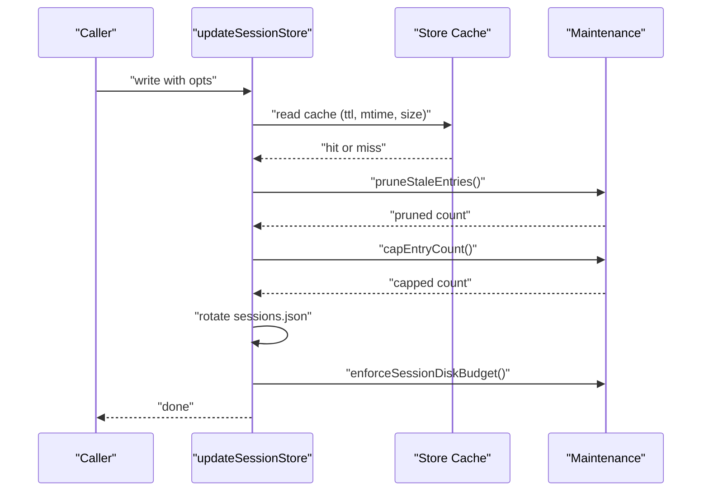

**Diagram sources**
- [store-cache.ts](file://src/config/sessions/store-cache.ts#L41-L81)
- [store.ts](file://src/config/sessions/store.ts#L353-L462)
- [store-maintenance.ts](file://src/config/sessions/store-maintenance.ts#L150-L219)

**Section sources**
- [store-cache.ts](file://src/config/sessions/store-cache.ts#L1-L81)
- [store.ts](file://src/config/sessions/store.ts#L46-L67)
- [store-maintenance.ts](file://src/config/sessions/store-maintenance.ts#L150-L219)
- [session-maintenance-warning.ts](file://src/infra/session-maintenance-warning.ts#L42-L78)

### Disk Budget Utilities and Eviction Ordering
- Measures store and per-entry sizes precisely.
- Builds ref-counts by sessionId to avoid orphaning active transcripts.
- Orders eviction by updatedAt and entry size to reclaim disk efficiently.

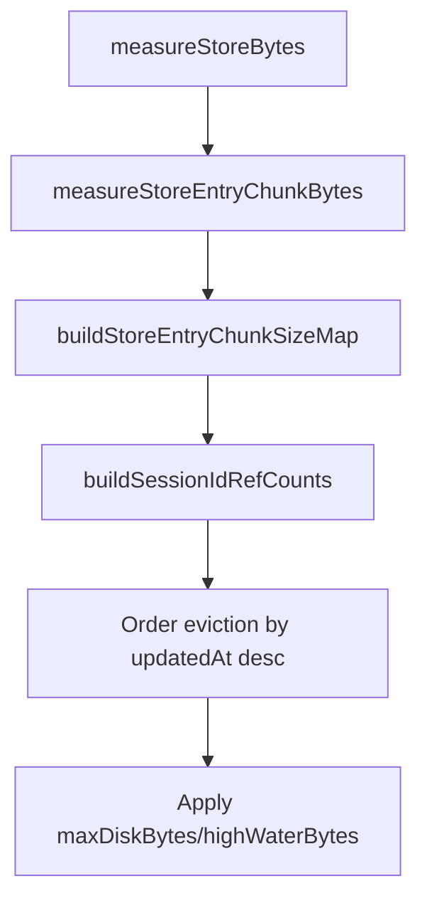

**Diagram sources**
- [disk-budget.ts](file://src/config/sessions/disk-budget.ts#L50-L89)

**Section sources**
- [disk-budget.ts](file://src/config/sessions/disk-budget.ts#L50-L89)

### Session Lifecycle and Expiry
- Sessions are reused until expiration; expiry is evaluated on next inbound message.
- Reset policy supports daily reset at a configured hour and optional idle minutes; per-type and per-channel overrides are supported.
- Manual reset triggers (/new, /reset) mint new session IDs and optionally set a model for the new session.

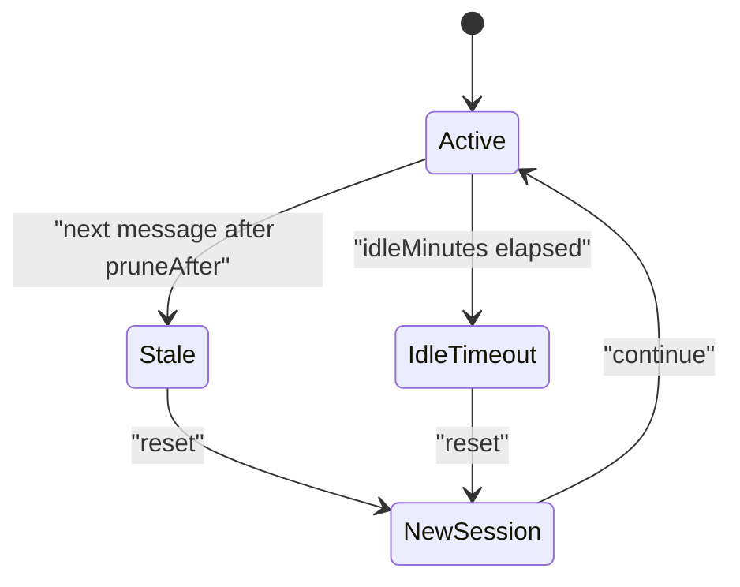

**Diagram sources**
- [session.md](file://docs/concepts/session.md#L207-L218)

**Section sources**
- [session.md](file://docs/concepts/session.md#L207-L218)

### Multi-Agent Coordination and Session Cloning/Inheritance
- Agent-scoped keys ensure isolation across agents.
- Identity links and dmScope enable collapsing identities across channels for continuity.
- Thread parent resolution allows inheritance of context across threads/topics.

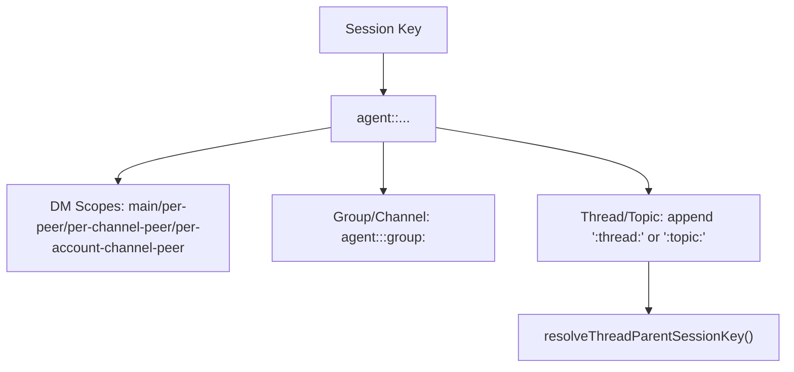

**Diagram sources**
- [session-key-utils.ts](file://src/sessions/session-key-utils.ts#L112-L132)
- [session.md](file://docs/concepts/session.md#L10-L20)

**Section sources**
- [session-key-utils.ts](file://src/sessions/session-key-utils.ts#L1-L133)
- [session.md](file://docs/concepts/session.md#L10-L20)

### Session Storage Formats and Metadata
- Store: sessions.json is a map of sessionKey to entry with timestamps and metadata.
- Transcript: JSONL files named by sessionId; each line is a JSON object representing a turn.
- Origin metadata: label, provider, from/to, accountId, threadId, populated for direct, channel, and group sessions.

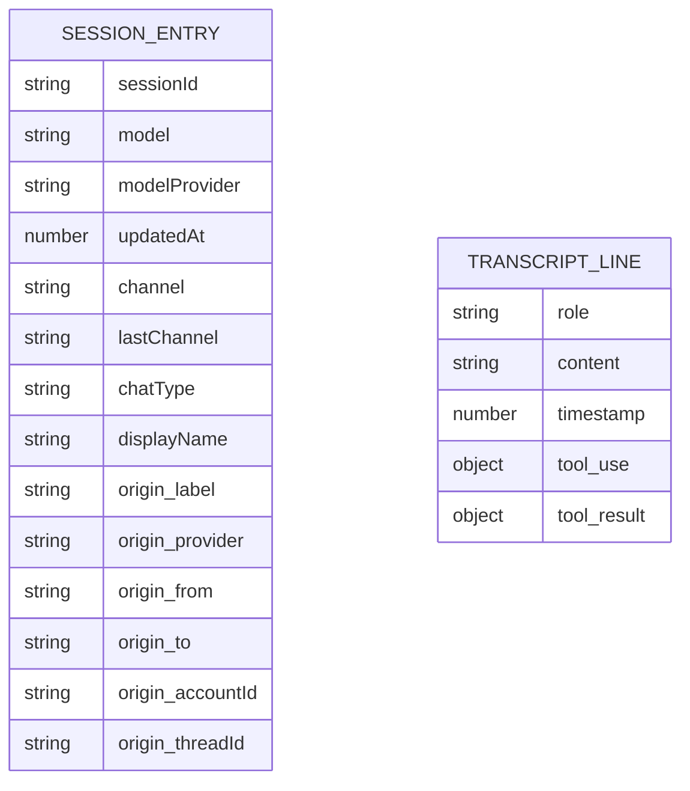

**Diagram sources**
- [session.md](file://docs/concepts/session.md#L64-L72)
- [session.md](file://docs/concepts/session.md#L295-L311)

**Section sources**
- [session.md](file://docs/concepts/session.md#L64-L72)
- [session.md](file://docs/concepts/session.md#L295-L311)

### Session Pruning Policies and Cleanup Procedures
- Maintenance defaults and enforcement order: prune stale, cap entries, archive removed transcripts, purge old archives, rotate sessions.json, enforce disk budget.
- CLI cleanup supports dry-run, enforce, and per-agent scopes.

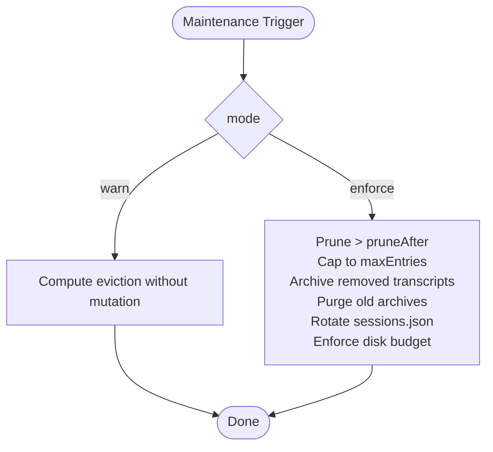

**Diagram sources**
- [session.md](file://docs/concepts/session.md#L74-L120)
- [sessions.md](file://docs/cli/sessions.md#L48-L73)
- [store.ts](file://src/config/sessions/store.ts#L353-L462)
- [store-maintenance.ts](file://src/config/sessions/store-maintenance.ts#L150-L219)

**Section sources**
- [session.md](file://docs/concepts/session.md#L74-L120)
- [sessions.md](file://docs/cli/sessions.md#L48-L73)
- [store.ts](file://src/config/sessions/store.ts#L353-L462)
- [store-maintenance.ts](file://src/config/sessions/store-maintenance.ts#L150-L219)

### Storage Optimization
- TTL caching reduces IO for frequent reads.
- Rotation of sessions.json prevents unbounded growth.
- Disk budget enforcement enforces high-water thresholds and evicts oldest artifacts first.

**Section sources**
- [store-cache.ts](file://src/config/sessions/store-cache.ts#L1-L81)
- [store.ts](file://src/config/sessions/store.ts#L46-L67)
- [store.ts](file://src/config/sessions/store.ts#L435-L436)
- [disk-budget.ts](file://src/config/sessions/disk-budget.ts#L50-L89)

### Session Debugging and Transcript Repair
- CLI inspection: status, sessions listing, gateway sessions.list.
- JSONL inspection: open transcript files to review turns.
- Abort persistence tests demonstrate transcript header and line parsing for diagnostics.

**Section sources**
- [session.md](file://docs/concepts/session.md#L279-L289)
- [chat.abort-persistence.test.ts](file://src/gateway/server-methods/chat.abort-persistence.test.ts#L56-L82)

### Session Security and Access Controls
- Secure DM mode: dmScope isolation to prevent cross-user context leakage.
- Send policy: block delivery by channel, chat type, or key prefixes.
- Runtime overrides (/send on/off/inherit) for per-session control.

**Section sources**
- [session.md](file://docs/concepts/session.md#L20-L56)
- [send-policy.ts](file://src/sessions/send-policy.ts#L53-L123)
- [session.md](file://docs/concepts/session.md#L219-L245)

### Concurrent Session Handling
- Store cache with TTL avoids contention on frequent reads.
- Maintenance runs on write path; warn-only mode protects active sessions from eviction.
- Disk budget enforcement orders evictions by age and size to minimize disruption.

**Section sources**
- [store-cache.ts](file://src/config/sessions/store-cache.ts#L1-L81)
- [store.ts](file://src/config/sessions/store.ts#L353-L373)
- [disk-budget.ts](file://src/config/sessions/disk-budget.ts#L50-L89)

### Examples and Advanced Patterns
- Session manipulation:
  - Reset triggers (/new, /reset) to mint new session IDs and optionally set a model.
  - Manual reset by deleting keys or transcripts; next message recreates them.
  - Isolated cron jobs always mint fresh session IDs.
- Custom session handlers:
  - Implement send policy rules and runtime overrides.
  - Use provenance to route inter-session inputs.
  - Apply model/verbose overrides for specialized behavior.
- Advanced patterns:
  - Thread parent resolution for context inheritance across threads.
  - Identity links to consolidate identities across channels.
  - Disk budget tuning for large deployments.

**Section sources**
- [session.md](file://docs/concepts/session.md#L214-L218)
- [send-policy.ts](file://src/sessions/send-policy.ts#L53-L123)
- [input-provenance.ts](file://src/sessions/input-provenance.ts#L50-L82)
- [model-overrides.ts](file://src/sessions/model-overrides.ts#L9-L112)
- [session-key-utils.ts](file://src/sessions/session-key-utils.ts#L112-L132)
- [session.md](file://docs/concepts/session.md#L246-L277)

## Dependency Analysis
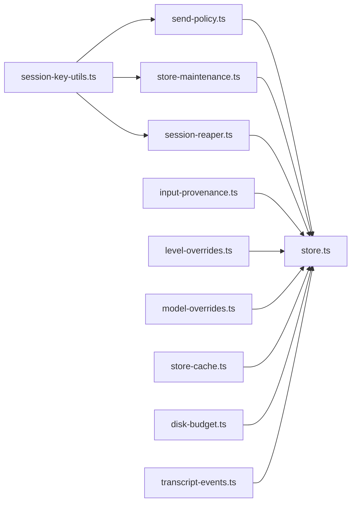

**Diagram sources**
- [session-key-utils.ts](file://src/sessions/session-key-utils.ts#L1-L133)
- [send-policy.ts](file://src/sessions/send-policy.ts#L1-L124)
- [store-maintenance.ts](file://src/config/sessions/store-maintenance.ts#L150-L219)
- [session-reaper.ts](file://src/cron/session-reaper.ts#L81-L109)
- [input-provenance.ts](file://src/sessions/input-provenance.ts#L1-L82)
- [level-overrides.ts](file://src/sessions/level-overrides.ts#L1-L33)
- [model-overrides.ts](file://src/sessions/model-overrides.ts#L1-L113)
- [store-cache.ts](file://src/config/sessions/store-cache.ts#L1-L81)
- [disk-budget.ts](file://src/config/sessions/disk-budget.ts#L50-L89)
- [transcript-events.ts](file://src/sessions/transcript-events.ts#L1-L30)
- [store.ts](file://src/config/sessions/store.ts#L353-L462)

**Section sources**
- [session-key-utils.ts](file://src/sessions/session-key-utils.ts#L1-L133)
- [send-policy.ts](file://src/sessions/send-policy.ts#L1-L124)
- [store-maintenance.ts](file://src/config/sessions/store-maintenance.ts#L150-L219)
- [session-reaper.ts](file://src/cron/session-reaper.ts#L81-L109)
- [input-provenance.ts](file://src/sessions/input-provenance.ts#L1-L82)
- [level-overrides.ts](file://src/sessions/level-overrides.ts#L1-L33)
- [model-overrides.ts](file://src/sessions/model-overrides.ts#L1-L113)
- [store-cache.ts](file://src/config/sessions/store-cache.ts#L1-L81)
- [disk-budget.ts](file://src/config/sessions/disk-budget.ts#L50-L89)
- [transcript-events.ts](file://src/sessions/transcript-events.ts#L1-L30)
- [store.ts](file://src/config/sessions/store.ts#L353-L462)

## Performance Considerations
- Large session stores increase write latency during maintenance; tune pruneAfter and maxEntries to bound growth.
- Disk budgets add overhead; set highWaterBytes meaningfully below maxDiskBytes.
- Use enforce mode in production to keep growth bounded automatically.

**Section sources**
- [session.md](file://docs/concepts/session.md#L101-L120)

## Troubleshooting Guide
- Inspect sessions and transcripts via CLI and gateway APIs.
- Use JSONL inspection to review full turns and diagnose parsing issues.
- For cron sessions, rely on the cron reaper to clean up stale run entries.
- Monitor maintenance warnings for active sessions under warn-only mode.

**Section sources**
- [sessions.md](file://docs/cli/sessions.md#L12-L18)
- [session.md](file://docs/concepts/session.md#L279-L289)
- [session-reaper.ts](file://src/cron/session-reaper.ts#L81-L109)
- [session-maintenance-warning.ts](file://src/infra/session-maintenance-warning.ts#L42-L78)

## Conclusion
OpenClaw’s session management balances flexibility and safety: canonical keying, robust provenance, configurable send policies, and strong maintenance guarantees. The system scales with TTL caching, rotation, and disk budgets, while offering powerful primitives for multi-agent coordination, thread inheritance, and secure DM handling.

## Appendices
- Session lifecycle and reset triggers are documented in the concepts guide.
- CLI references provide operational commands for listing and cleaning sessions.

**Section sources**
- [session.md](file://docs/concepts/session.md#L207-L218)
- [sessions.md](file://docs/cli/sessions.md#L12-L18)