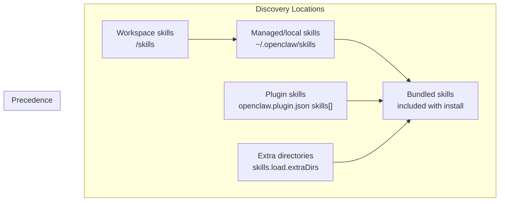
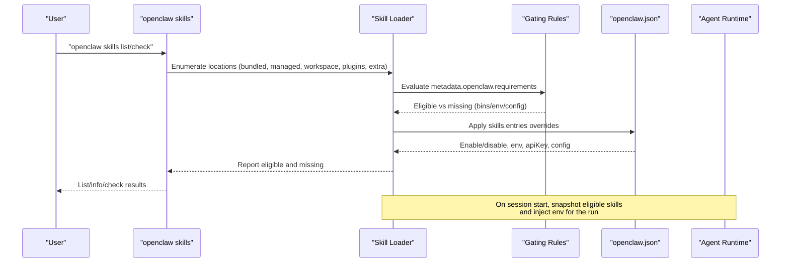
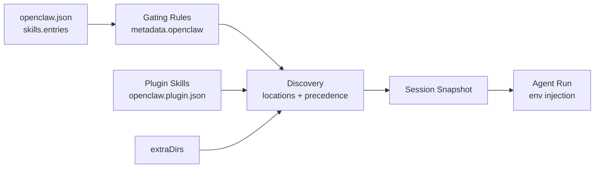

# Skills Platform

<cite>
**Referenced Files in This Document**
- [docs/tools/skills.md](file://docs/tools/skills.md)
- [docs/cli/skills.md](file://docs/cli/skills.md)
- [src/plugin-sdk/index.ts](file://src/plugin-sdk/index.ts)
- [src/agents/skills.loadworkspaceskillentries.test.ts](file://src/agents/skills.loadworkspaceskillentries.test.ts)
- [src/plugins/loader.test.ts](file://src/plugins/loader.test.ts)
- [skills/nano-banana-pro/SKILL.md](file://skills/nano-banana-pro/SKILL.md)
- [skills/model-usage/scripts/model_usage.py](file://skills/model-usage/scripts/model_usage.py)
- [extensions/feishu/openclaw.plugin.json](file://extensions/feishu/openclaw.plugin.json)
- [extensions/feishu/skills/feishu-doc/SKILL.md](file://extensions/feishu/skills/feishu-doc/SKILL.md)
- [extensions/diffs/skills/diffs/SKILL.md](file://extensions/diffs/skills/diffs/SKILL.md)
</cite>

## Table of Contents
1. [Introduction](#introduction)
2. [Project Structure](#project-structure)
3. [Core Components](#core-components)
4. [Architecture Overview](#architecture-overview)
5. [Detailed Component Analysis](#detailed-component-analysis)
6. [Dependency Analysis](#dependency-analysis)
7. [Performance Considerations](#performance-considerations)
8. [Troubleshooting Guide](#troubleshooting-guide)
9. [Conclusion](#conclusion)
10. [Appendices](#appendices)

## Introduction
This document explains the Skills Platform in OpenClaw’s agent system. It covers how skills are organized, discovered, filtered, activated, and executed across three locations: bundled skills, managed skills, and workspace skills. It also documents skill metadata, gating rules, configuration, CLI inspection, and integration with plugins and tools. Practical examples demonstrate authoring, installing, and customizing skills, along with guidance for performance, troubleshooting, and advanced development.

## Project Structure
Skills are authored as self-contained directories with a SKILL.md file and optional scripts. OpenClaw recognizes three discovery locations with precedence:
- Bundled skills: included with the distribution
- Managed/local skills: ~/.openclaw/skills
- Workspace skills: <workspace>/skills

Plugins can ship their own skills via openclaw.plugin.json entries. Additional external directories can be added via configuration.

**Diagram sources**
- [docs/tools/skills.md:13-48](file://docs/tools/skills.md#L13-L48)

**Section sources**
- [docs/tools/skills.md:13-48](file://docs/tools/skills.md#L13-L48)

## Core Components
- Skills directory structure: Each skill is a folder containing a SKILL.md with YAML frontmatter and instructions. Scripts and assets live alongside SKILL.md.
- Metadata and gating: Skills declare eligibility via metadata.openclaw fields (e.g., required binaries, environment variables, config paths, OS).
- Configuration: skills.entries controls enablement, environment injection, and per-skill config.
- Execution model: Skills are presented to the agent as tool-like capabilities; user slash commands can invoke tools directly when configured.

Key references:
- Skills format and gating: [docs/tools/skills.md:78-187](file://docs/tools/skills.md#L78-L187)
- Config overrides: [docs/tools/skills.md:189-229](file://docs/tools/skills.md#L189-L229)
- Environment injection per run: [docs/tools/skills.md:230-241](file://docs/tools/skills.md#L230-L241)

**Section sources**
- [docs/tools/skills.md:78-187](file://docs/tools/skills.md#L78-L187)
- [docs/tools/skills.md:189-229](file://docs/tools/skills.md#L189-L229)
- [docs/tools/skills.md:230-241](file://docs/tools/skills.md#L230-L241)

## Architecture Overview
The skills pipeline integrates discovery, gating, configuration, and runtime injection. Plugins can contribute skills that participate in the same precedence and gating rules.

**Diagram sources**
- [docs/tools/skills.md:106-241](file://docs/tools/skills.md#L106-L241)
- [src/plugin-sdk/index.ts:669-670](file://src/plugin-sdk/index.ts#L669-L670)

**Section sources**
- [docs/tools/skills.md:106-241](file://docs/tools/skills.md#L106-L241)
- [src/plugin-sdk/index.ts:669-670](file://src/plugin-sdk/index.ts#L669-L670)

## Detailed Component Analysis

### Skills Locations and Precedence
- Locations: bundled, managed (~/.openclaw/skills), workspace (<workspace>/skills), plugin skills, and extraDirs.
- Precedence: workspace > managed/local > bundled; plugin skills participate in the same rules; extraDirs have lowest precedence.
- Multi-agent: per-agent workspace skills; shared managed skills; shared extraDirs.

Practical example:
- Workspace skill overrides bundled behavior when names collide.
- Plugin skills are loaded when the plugin is enabled and follow the same precedence.

**Section sources**
- [docs/tools/skills.md:13-48](file://docs/tools/skills.md#L13-L48)
- [extensions/feishu/openclaw.plugin.json:1-11](file://extensions/feishu/openclaw.plugin.json#L1-L11)

### Skill Metadata and Gating
- Required resources: bins, anyBins, env, config paths.
- OS scoping: os list restricts eligibility by platform.
- Always-include: always: true bypasses other gates.
- Install hints: install array describes how to provision prerequisites (brew, node, go, download).
- Sandbox note: host and container checks differ; setupCommand can prepare containers.

Example references:
- Gating spec and install hints: [docs/tools/skills.md:106-187](file://docs/tools/skills.md#L106-L187)
- Example with brew install: [skills/nano-banana-pro/SKILL.md:12-22](file://skills/nano-banana-pro/SKILL.md#L12-L22)

**Section sources**
- [docs/tools/skills.md:106-187](file://docs/tools/skills.md#L106-L187)
- [skills/nano-banana-pro/SKILL.md:12-22](file://skills/nano-banana-pro/SKILL.md#L12-L22)

### Configuration Overrides and Environment Injection
- Toggle skills: skills.entries.<name>.enabled
- Inject env: skills.entries.<name>.env and apiKey (supports SecretRef)
- Custom config: skills.entries.<name>.config for plugin-defined fields
- Snapshotting: eligible skills snapshot taken at session start; watch mode refreshes mid-session

Example references:
- Overrides schema: [docs/tools/skills.md:189-229](file://docs/tools/skills.md#L189-L229)
- Session snapshot and watch: [docs/tools/skills.md:242-267](file://docs/tools/skills.md#L242-L267)

**Section sources**
- [docs/tools/skills.md:189-229](file://docs/tools/skills.md#L189-L229)
- [docs/tools/skills.md:242-267](file://docs/tools/skills.md#L242-L267)

### CLI Inspection and Debugging
- Commands: list, list --eligible, info <name>, check
- Purpose: enumerate available skills, see eligibility, diagnose missing requirements

Reference:
- CLI overview: [docs/cli/skills.md:19-27](file://docs/cli/skills.md#L19-L27)

**Section sources**
- [docs/cli/skills.md:19-27](file://docs/cli/skills.md#L19-L27)

### Plugin Skills and Discovery
- Plugins declare skills via openclaw.plugin.json skills[] entries (relative paths).
- Enabled plugins contribute skills that follow the same precedence and gating rules.
- Tests demonstrate bundle plugins exposing skills capability.

References:
- Plugin skills declaration: [extensions/feishu/openclaw.plugin.json:4](file://extensions/feishu/openclaw.plugin.json#L4)
- Example skill from plugin: [extensions/feishu/skills/feishu-doc/SKILL.md:1-5](file://extensions/feishu/skills/feishu-doc/SKILL.md#L1-L5)
- Plugin loader behavior: [src/plugins/loader.test.ts:349-388](file://src/plugins/loader.test.ts#L349-L388)

**Section sources**
- [extensions/feishu/openclaw.plugin.json:4](file://extensions/feishu/openclaw.plugin.json#L4)
- [extensions/feishu/skills/feishu-doc/SKILL.md:1-5](file://extensions/feishu/skills/feishu-doc/SKILL.md#L1-L5)
- [src/plugins/loader.test.ts:349-388](file://src/plugins/loader.test.ts#L349-L388)

### Practical Examples

#### Authoring a Skill
- Create a directory with a SKILL.md frontmatter declaring name, description, and metadata.openclaw.
- Include instructions and example invocations; use {baseDir} to reference the skill folder.
- Optionally include scripts and assets.

Reference:
- Example frontmatter and install hints: [skills/nano-banana-pro/SKILL.md:1-24](file://skills/nano-banana-pro/SKILL.md#L1-L24)

**Section sources**
- [skills/nano-banana-pro/SKILL.md:1-24](file://skills/nano-banana-pro/SKILL.md#L1-L24)

#### Installing and Managing Skills
- Use ClawHub to discover, install, update, and sync skills.
- By default, clawhub installs into ./skills under the current working directory or the configured workspace.

Reference:
- ClawHub usage: [docs/tools/skills.md:50-67](file://docs/tools/skills.md#L50-L67)

**Section sources**
- [docs/tools/skills.md:50-67](file://docs/tools/skills.md#L50-L67)

#### Customizing a Skill
- Override bundled or managed skills by placing a workspace skill with the same name.
- Use skills.entries to toggle enablement, inject env, or supply apiKey/config.

Reference:
- Precedence and overrides: [docs/tools/skills.md:13-48](file://docs/tools/skills.md#L13-L48)
- Overrides schema: [docs/tools/skills.md:189-229](file://docs/tools/skills.md#L189-L229)

**Section sources**
- [docs/tools/skills.md:13-48](file://docs/tools/skills.md#L13-L48)
- [docs/tools/skills.md:189-229](file://docs/tools/skills.md#L189-L229)

#### Tool Integration and Execution Patterns
- Skills expose tools; user slash commands can route directly to a tool when configured.
- Some skills provide a single tool with multiple actions (e.g., feishu_doc).

References:
- Slash command tool dispatch: [docs/tools/skills.md:97-105](file://docs/tools/skills.md#L97-L105)
- Example tool-based skill: [extensions/feishu/skills/feishu-doc/SKILL.md:9](file://extensions/feishu/skills/feishu-doc/SKILL.md#L9)

**Section sources**
- [docs/tools/skills.md:97-105](file://docs/tools/skills.md#L97-L105)
- [extensions/feishu/skills/feishu-doc/SKILL.md:9](file://extensions/feishu/skills/feishu-doc/SKILL.md#L9)

#### Scripted Skills Example
- Skills can include Python or shell scripts; ensure required binaries are available (host/container).
- Example: model-usage skill consumes a local CLI and aggregates costs.

Reference:
- Scripted skill usage: [skills/model-usage/scripts/model_usage.py:1-321](file://skills/model-usage/scripts/model_usage.py#L1-L321)

**Section sources**
- [skills/model-usage/scripts/model_usage.py:1-321](file://skills/model-usage/scripts/model_usage.py#L1-L321)

### Filtering, Activation/Deactivation, and Conflict Resolution
- Filtering: metadata.openclaw gates eligibility at load time; missing requirements hide skills.
- Activation/deactivation: enabled: false disables a skill even if present.
- Conflict resolution: workspace > managed/local > bundled; plugin skills participate in the same precedence.

References:
- Gating rules: [docs/tools/skills.md:106-187](file://docs/tools/skills.md#L106-L187)
- Precedence: [docs/tools/skills.md:13-48](file://docs/tools/skills.md#L13-L48)
- Workspace symlink safety tests: [src/agents/skills.loadworkspaceskillentries.test.ts:133-178](file://src/agents/skills.loadworkspaceskillentries.test.ts#L133-L178)

**Section sources**
- [docs/tools/skills.md:106-187](file://docs/tools/skills.md#L106-L187)
- [docs/tools/skills.md:13-48](file://docs/tools/skills.md#L13-L48)
- [src/agents/skills.loadworkspaceskillentries.test.ts:133-178](file://src/agents/skills.loadworkspaceskillentries.test.ts#L133-L178)

### Skills API Surface
- The SDK exposes helpers for listing skill commands for agents, enabling UI and tooling integration.

Reference:
- Exported helper: [src/plugin-sdk/index.ts:669-670](file://src/plugin-sdk/index.ts#L669-L670)

**Section sources**
- [src/plugin-sdk/index.ts:669-670](file://src/plugin-sdk/index.ts#L669-L670)

## Dependency Analysis
Skills depend on:
- Host/container availability (bins/env/config)
- Plugin enablement (for plugin-provided skills)
- Configuration overrides (enablement, env, apiKey, custom config)
- Workspace/managed precedence rules

**Diagram sources**
- [docs/tools/skills.md:106-267](file://docs/tools/skills.md#L106-L267)
- [extensions/feishu/openclaw.plugin.json:4](file://extensions/feishu/openclaw.plugin.json#L4)

**Section sources**
- [docs/tools/skills.md:106-267](file://docs/tools/skills.md#L106-L267)
- [extensions/feishu/openclaw.plugin.json:4](file://extensions/feishu/openclaw.plugin.json#L4)

## Performance Considerations
- Prompt token impact: A compact XML list of skills is injected into the system prompt; overhead is deterministic and increases with the number and length of skill names/descriptions/locations.
- Session snapshotting: Eligible skills are cached per session; changes take effect on the next session unless watch mode refreshes mid-session.
- Recommendations:
  - Keep SKILL.md concise and avoid excessive metadata.
  - Use watch mode during development to reduce restart cycles.
  - Prefer sandbox-friendly installations and setupCommand for containerized environments.

Reference:
- Token formula and notes: [docs/tools/skills.md:269-286](file://docs/tools/skills.md#L269-L286)
- Snapshot and watch: [docs/tools/skills.md:242-267](file://docs/tools/skills.md#L242-L267)

**Section sources**
- [docs/tools/skills.md:269-286](file://docs/tools/skills.md#L269-L286)
- [docs/tools/skills.md:242-267](file://docs/tools/skills.md#L242-L267)

## Troubleshooting Guide
Common issues and remedies:
- Missing binaries or environment variables: Use openclaw skills check to identify missing requirements; install via declared install hints or provide env/config.
- Workspace symlink safety: Workspace skills must resolve within the configured root; symlinks outside are ignored.
- Plugin skills not appearing: Ensure the plugin is enabled; verify skills[] entries in openclaw.plugin.json.
- Sandbox execution: Confirm required binaries exist inside the sandbox; use setupCommand to install.

References:
- CLI inspection: [docs/cli/skills.md:19-27](file://docs/cli/skills.md#L19-L27)
- Workspace safety tests: [src/agents/skills.loadworkspaceskillentries.test.ts:133-178](file://src/agents/skills.loadworkspaceskillentries.test.ts#L133-L178)
- Plugin loader behavior: [src/plugins/loader.test.ts:349-388](file://src/plugins/loader.test.ts#L349-L388)

**Section sources**
- [docs/cli/skills.md:19-27](file://docs/cli/skills.md#L19-L27)
- [src/agents/skills.loadworkspaceskillentries.test.ts:133-178](file://src/agents/skills.loadworkspaceskillentries.test.ts#L133-L178)
- [src/plugins/loader.test.ts:349-388](file://src/plugins/loader.test.ts#L349-L388)

## Conclusion
OpenClaw’s Skills Platform provides a flexible, secure, and composable way to extend agent capabilities. By organizing skills as self-contained directories with explicit metadata, applying robust gating and configuration, and integrating seamlessly with plugins and tools, developers can rapidly build, install, and manage skills tailored to diverse workloads and environments.

## Appendices

### Appendix A: Example Skill Workflows

#### Workflow: Add a New Tool-Based Skill
- Create a skill directory with SKILL.md declaring name, description, and metadata.openclaw.
- Define a tool and optional command-dispatch settings to expose a slash command that invokes the tool directly.
- Provide install hints for prerequisites; test with openclaw skills check.

References:
- Tool dispatch fields: [docs/tools/skills.md:97-105](file://docs/tools/skills.md#L97-L105)
- Gating spec: [docs/tools/skills.md:106-187](file://docs/tools/skills.md#L106-L187)

**Section sources**
- [docs/tools/skills.md:97-105](file://docs/tools/skills.md#L97-L105)
- [docs/tools/skills.md:106-187](file://docs/tools/skills.md#L106-L187)

#### Workflow: Develop a Scripted Skill
- Implement a script (Python/shell) that performs the desired operation.
- Declare required binaries/env in metadata.openclaw.requires.
- Provide examples in SKILL.md and test locally before packaging.

References:
- Scripted skill example: [skills/model-usage/scripts/model_usage.py:1-321](file://skills/model-usage/scripts/model_usage.py#L1-L321)
- Install hints: [docs/tools/skills.md:148-184](file://docs/tools/skills.md#L148-L184)

**Section sources**
- [skills/model-usage/scripts/model_usage.py:1-321](file://skills/model-usage/scripts/model_usage.py#L1-L321)
- [docs/tools/skills.md:148-184](file://docs/tools/skills.md#L148-L184)

#### Workflow: Publish and Share a Skill
- Author the skill in a workspace directory.
- Use ClawHub to publish or share the skill directory.
- Other users can install into their workspace to override bundled versions.

Reference:
- ClawHub usage: [docs/tools/skills.md:50-67](file://docs/tools/skills.md#L50-L67)

**Section sources**
- [docs/tools/skills.md:50-67](file://docs/tools/skills.md#L50-L67)