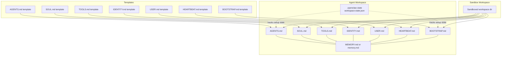
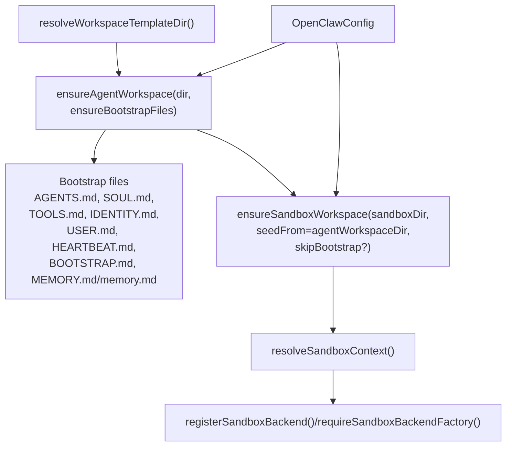
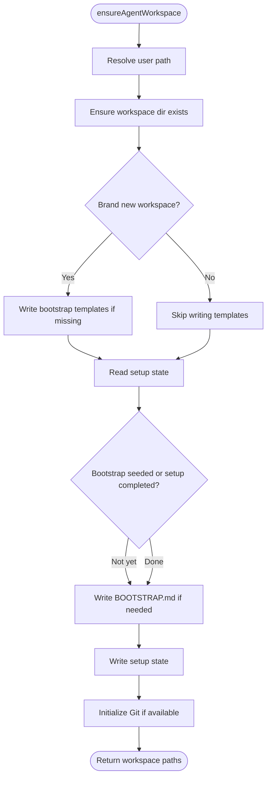
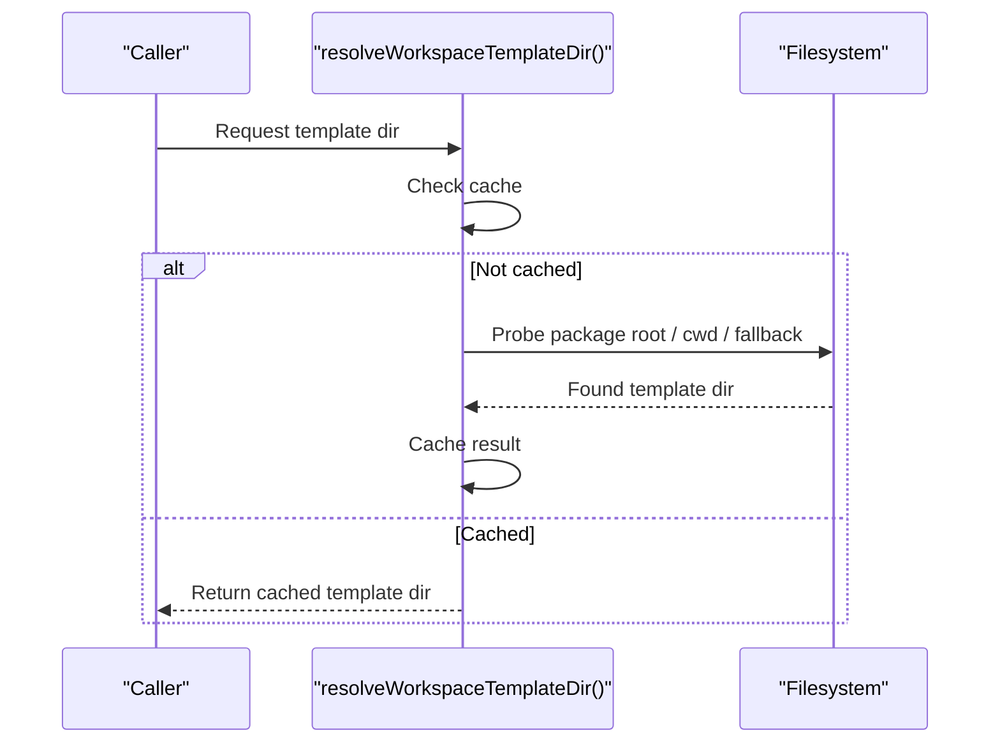
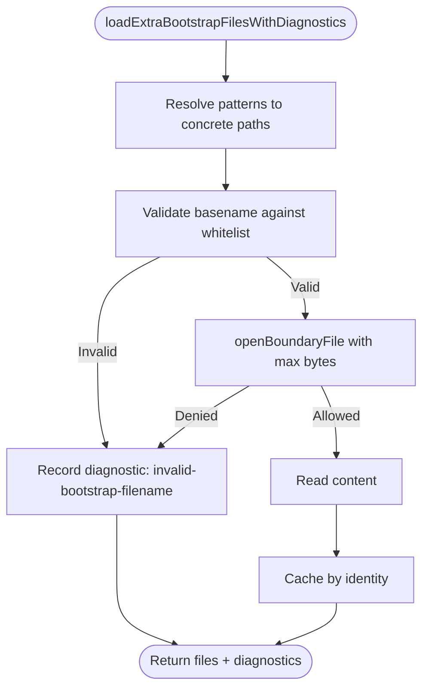
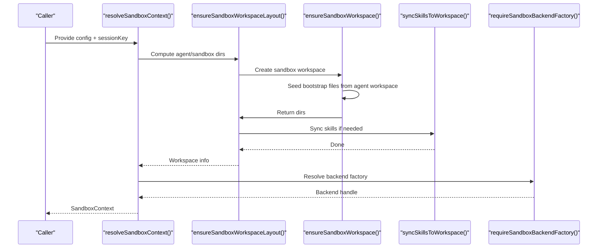
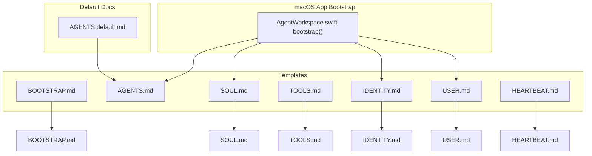
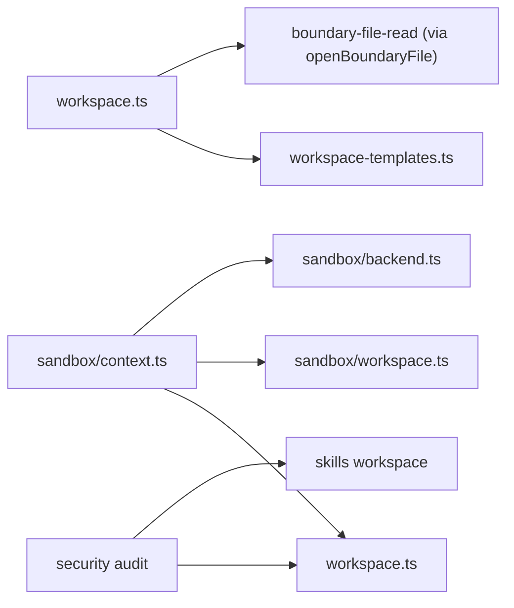

# Workspace Management

<cite>
**Referenced Files in This Document**
- [workspace.ts](file://src/agents/workspace.ts)
- [workspace-templates.ts](file://src/agents/workspace-templates.ts)
- [context.ts](file://src/agents/sandbox/context.ts)
- [workspace.ts (sandbox)](file://src/agents/sandbox/workspace.ts)
- [backend.ts](file://src/agents/sandbox/backend.ts)
- [AgentWorkspace.swift](file://apps/macos/Sources/OpenClaw/AgentWorkspace.swift)
- [BOOTSTRAP.md](file://docs/reference/templates/BOOTSTRAP.md)
- [AGENTS.default.md](file://docs/reference/AGENTS.default.md)
- [configure.wizard.ts](file://src/commands/configure.wizard.ts)
- [audit.test.ts](file://src/security/audit.test.ts)
- [audit-extra.async.ts](file://src/security/audit-extra.async.ts)
</cite>

## Table of Contents
1. [Introduction](#introduction)
2. [Project Structure](#project-structure)
3. [Core Components](#core-components)
4. [Architecture Overview](#architecture-overview)
5. [Detailed Component Analysis](#detailed-component-analysis)
6. [Dependency Analysis](#dependency-analysis)
7. [Performance Considerations](#performance-considerations)
8. [Troubleshooting Guide](#troubleshooting-guide)
9. [Conclusion](#conclusion)
10. [Appendices](#appendices)

## Introduction
This document explains workspace management in OpenClaw’s agent system. It covers workspace architecture, directory structure, isolation and sandboxing, configuration options (including custom paths and templates), permissions and security boundaries, lifecycle and cleanup, and practical guidance for setup, customization, and troubleshooting. It also outlines workspace templates, default configurations, and optimization techniques for large-scale deployments.

## Project Structure
OpenClaw organizes agent workspace content under a dedicated directory with a fixed set of bootstrap files and optional memory files. Templates are packaged alongside the runtime and loaded at startup. Sandboxed environments can mirror or isolate workspace content depending on configuration.

**Diagram sources**
- [workspace.ts:327-465](file://src/agents/workspace.ts#L327-L465)
- [workspace-templates.ts:14-54](file://src/agents/workspace-templates.ts#L14-L54)
- [context.ts:21-66](file://src/agents/sandbox/context.ts#L21-L66)
- [workspace.ts (sandbox):17-65](file://src/agents/sandbox/workspace.ts#L17-L65)

**Section sources**
- [workspace.ts:12-41](file://src/agents/workspace.ts#L12-L41)
- [workspace-templates.ts:14-54](file://src/agents/workspace-templates.ts#L14-L54)

## Core Components
- Agent workspace bootstrap and state management
- Template resolution and caching
- Sandbox workspace provisioning and isolation
- Security guards for boundary-safe file reads
- CLI wizard for workspace configuration

Key responsibilities:
- Ensure workspace directory exists and bootstrap files are present
- Load and validate bootstrap files with boundary checks
- Manage workspace setup state and Git initialization
- Provision sandbox workspaces and synchronize skills when needed
- Provide template directory resolution with fallbacks

**Section sources**
- [workspace.ts:327-465](file://src/agents/workspace.ts#L327-L465)
- [workspace.ts:487-547](file://src/agents/workspace.ts#L487-L547)
- [workspace.ts:567-647](file://src/agents/workspace.ts#L567-L647)
- [workspace-templates.ts:14-54](file://src/agents/workspace-templates.ts#L14-L54)
- [context.ts:21-66](file://src/agents/sandbox/context.ts#L21-L66)
- [workspace.ts (sandbox):17-65](file://src/agents/sandbox/workspace.ts#L17-L65)

## Architecture Overview
The workspace system comprises:
- Workspace bootstrap and file loading
- Template sourcing and caching
- Sandbox workspace provisioning and synchronization
- Security boundary enforcement for file reads
- CLI wizard for initial configuration

**Diagram sources**
- [workspace.ts:327-465](file://src/agents/workspace.ts#L327-L465)
- [workspace-templates.ts:14-54](file://src/agents/workspace-templates.ts#L14-L54)
- [workspace.ts (sandbox):17-65](file://src/agents/sandbox/workspace.ts#L17-L65)
- [context.ts:109-213](file://src/agents/sandbox/context.ts#L109-L213)
- [backend.ts:134-145](file://src/agents/sandbox/backend.ts#L134-L145)

## Detailed Component Analysis

### Workspace Bootstrap and State Management
- Default workspace directory resolves to a user-specific path with optional profile differentiation.
- Bootstrap files are created once per workspace unless skipped.
- Setup state tracks bootstrap seeding and completion timestamps.
- Git repository initialization occurs for brand-new workspaces when Git is available.

**Diagram sources**
- [workspace.ts:327-465](file://src/agents/workspace.ts#L327-L465)

**Section sources**
- [workspace.ts:12-24](file://src/agents/workspace.ts#L12-L24)
- [workspace.ts:327-465](file://src/agents/workspace.ts#L327-L465)
- [workspace.ts:263-266](file://src/agents/workspace.ts#L263-L266)
- [workspace.ts:310-325](file://src/agents/workspace.ts#L310-L325)

### Template Resolution and Caching
- Template directory is resolved from package root, working directory, or fallback.
- Templates are cached to avoid repeated disk reads.
- Front matter is stripped from templates before use.

**Diagram sources**
- [workspace-templates.ts:14-54](file://src/agents/workspace-templates.ts#L14-L54)

**Section sources**
- [workspace-templates.ts:14-54](file://src/agents/workspace-templates.ts#L14-L54)
- [workspace.ts:104-130](file://src/agents/workspace.ts#L104-L130)

### Security Guards and Boundary Checks
- Boundary-safe file reads enforce a maximum file size and restrict paths to the workspace root.
- File content is cached by identity (device, inode, size, mtime) to prevent stale reads.
- Extra bootstrap files are validated against a whitelist of supported basenames.

**Diagram sources**
- [workspace.ts:575-647](file://src/agents/workspace.ts#L575-L647)

**Section sources**
- [workspace.ts:48-88](file://src/agents/workspace.ts#L48-L88)
- [workspace.ts:575-647](file://src/agents/workspace.ts#L575-L647)

### Sandbox Workspace Provisioning and Isolation
- Sandboxed workspaces can mirror the agent workspace or be isolated, depending on scope and access mode.
- When isolated, the sandbox workspace is seeded from the agent workspace and optionally synchronized with skills.
- Docker user mapping can be inferred from workspace ownership when not explicitly configured.

**Diagram sources**
- [context.ts:109-213](file://src/agents/sandbox/context.ts#L109-L213)
- [context.ts:21-66](file://src/agents/sandbox/context.ts#L21-L66)
- [workspace.ts (sandbox):17-65](file://src/agents/sandbox/workspace.ts#L17-L65)
- [backend.ts:134-145](file://src/agents/sandbox/backend.ts#L134-L145)

**Section sources**
- [context.ts:21-66](file://src/agents/sandbox/context.ts#L21-L66)
- [context.ts:109-213](file://src/agents/sandbox/context.ts#L109-L213)
- [workspace.ts (sandbox):17-65](file://src/agents/sandbox/workspace.ts#L17-L65)
- [backend.ts:134-145](file://src/agents/sandbox/backend.ts#L134-L145)

### Workspace Templates and Defaults
- Default bootstrap templates are packaged with the distribution and loaded into the workspace.
- The macOS app can bootstrap a minimal template set on first run if files are missing.
- The wizard guides users to select a workspace directory and preserves existing content.

**Diagram sources**
- [BOOTSTRAP.md:1-63](file://docs/reference/templates/BOOTSTRAP.md#L1-L63)
- [AGENTS.default.md:1-127](file://docs/reference/AGENTS.default.md#L1-L127)
- [AgentWorkspace.swift:94-113](file://apps/macos/Sources/OpenClaw/AgentWorkspace.swift#L94-L113)

**Section sources**
- [workspace.ts:378-389](file://src/agents/workspace.ts#L378-L389)
- [workspace.ts:437-447](file://src/agents/workspace.ts#L437-L447)
- [AgentWorkspace.swift:94-113](file://apps/macos/Sources/OpenClaw/AgentWorkspace.swift#L94-L113)
- [configure.wizard.ts:442-488](file://src/commands/configure.wizard.ts#L442-L488)

## Dependency Analysis
- Workspace bootstrap depends on template resolution and boundary-safe file reads.
- Sandbox provisioning depends on workspace bootstrap and backend factories.
- Security audits consider workspace and skill locations to prevent symlink escapes.

**Diagram sources**
- [workspace.ts:1-11](file://src/agents/workspace.ts#L1-L11)
- [workspace-templates.ts:1-4](file://src/agents/workspace-templates.ts#L1-L4)
- [context.ts:1-19](file://src/agents/sandbox/context.ts#L1-L19)
- [workspace.ts (sandbox):1-15](file://src/agents/sandbox/workspace.ts#L1-L15)
- [backend.ts:1-4](file://src/agents/sandbox/backend.ts#L1-L4)
- [audit.test.ts:967-995](file://src/security/audit.test.ts#L967-L995)

**Section sources**
- [workspace.ts:1-11](file://src/agents/workspace.ts#L1-L11)
- [workspace-templates.ts:1-4](file://src/agents/workspace-templates.ts#L1-L4)
- [context.ts:1-19](file://src/agents/sandbox/context.ts#L1-L19)
- [workspace.ts (sandbox):1-15](file://src/agents/sandbox/workspace.ts#L1-L15)
- [backend.ts:1-4](file://src/agents/sandbox/backend.ts#L1-L4)
- [audit.test.ts:967-995](file://src/security/audit.test.ts#L967-L995)

## Performance Considerations
- Template caching avoids repeated disk reads and front matter stripping overhead.
- Workspace file cache prevents stale content reads by tracking identity metadata.
- Glob expansion for extra bootstrap files is bounded and falls back to literal paths on failure.
- Git initialization is attempted only for brand-new workspaces and is tolerant of unavailability.

Recommendations:
- Keep bootstrap files small and avoid excessive extra bootstrap files.
- Use the minimal allowlist for subagent or cron sessions to reduce file load.
- Prefer a single memory file (MEMORY.md) to avoid case-insensitive filesystem ambiguity.

**Section sources**
- [workspace.ts:38-54](file://src/agents/workspace.ts#L38-L54)
- [workspace.ts:104-130](file://src/agents/workspace.ts#L104-L130)
- [workspace.ts:575-647](file://src/agents/workspace.ts#L575-L647)
- [workspace.ts:293-325](file://src/agents/workspace.ts#L293-L325)

## Troubleshooting Guide
Common issues and resolutions:
- Permission problems with config include files: adjust file modes to restrict group/world read access.
- Workspace skills escaping to parent directories: security audit warns if symlinks point outside the workspace root; ensure skills remain under the workspace.
- Missing or invalid bootstrap files: verify basenames match supported bootstrap names; extra files with unsupported names are ignored with diagnostics.
- Sandbox workspace not created: confirm sandbox scope and access mode; verify backend registration and availability.
- Git initialization failures: ensure Git is installed and accessible; workspace creation continues even if Git init fails.

**Section sources**
- [audit-extra.async.ts:949-981](file://src/security/audit-extra.async.ts#L949-L981)
- [audit.test.ts:967-995](file://src/security/audit.test.ts#L967-L995)
- [workspace.ts:611-618](file://src/agents/workspace.ts#L611-L618)
- [context.ts:173-177](file://src/agents/sandbox/context.ts#L173-L177)
- [workspace.ts:310-325](file://src/agents/workspace.ts#L310-L325)

## Conclusion
OpenClaw’s workspace system provides a secure, configurable foundation for agent sessions. It ensures bootstrap consistency, enforces boundary-safe file access, supports sandbox isolation, and offers robust defaults and templates. By following the guidance here, operators can set up reliable workspaces, manage permissions effectively, and scale safely across environments.

## Appendices

### Practical Examples

- Configure a custom workspace path
  - Use the wizard to set the workspace directory; existing content is preserved and only missing templates are created.
  - Reference: [configure.wizard.ts:442-488](file://src/commands/configure.wizard.ts#L442-L488)

- Bootstrap a macOS workspace
  - The macOS app creates essential templates if they are missing during bootstrap.
  - Reference: [AgentWorkspace.swift:94-113](file://apps/macos/Sources/OpenClaw/AgentWorkspace.swift#L94-L113)

- Use default agent instructions and skills
  - Replace AGENTS.md with the default personal assistant instructions when desired.
  - Reference: [AGENTS.default.md:29-33](file://docs/reference/AGENTS.default.md#L29-L33)

- Understand bootstrap templates
  - Review the BOOTSTRAP.md template for first-run guidance.
  - Reference: [BOOTSTRAP.md:1-63](file://docs/reference/templates/BOOTSTRAP.md#L1-L63)

### Workspace Lifecycle and Cleanup
- Lifecycle stages
  - Directory creation and bootstrap seeding
  - Setup state tracking (bootstrap seeded, setup completed)
  - Optional Git initialization for new workspaces
  - Sandbox workspace provisioning and skill synchronization
- Cleanup
  - Remove sandbox workspaces according to pruning policies
  - Maintain only necessary bootstrap files; avoid duplicating memory files

References:
- [workspace.ts:327-465](file://src/agents/workspace.ts#L327-L465)
- [context.ts:120-127](file://src/agents/sandbox/context.ts#L120-L127)