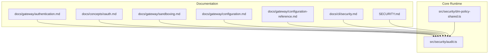
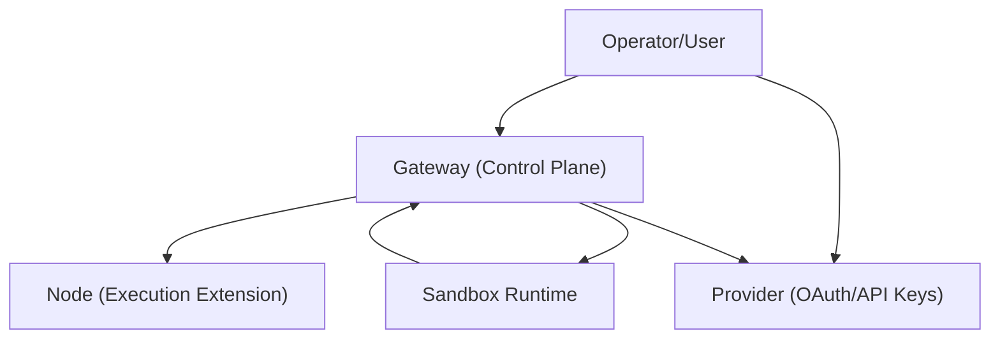
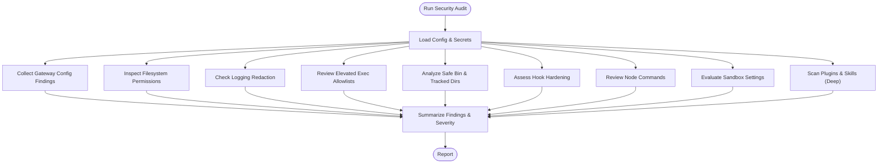
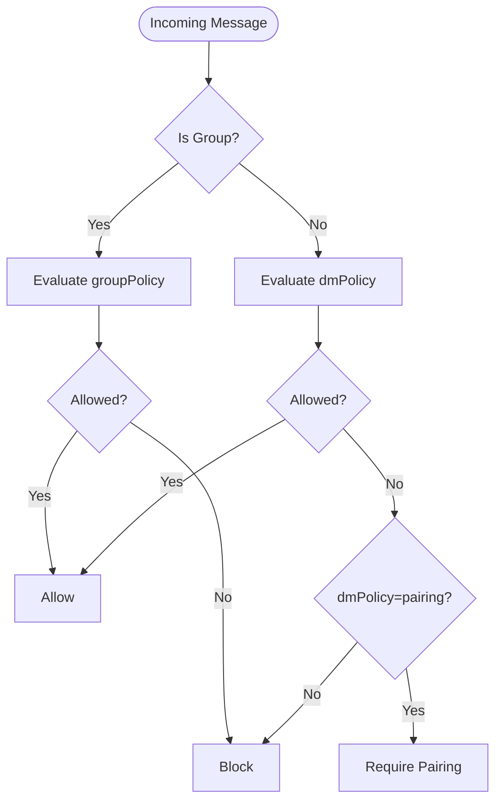
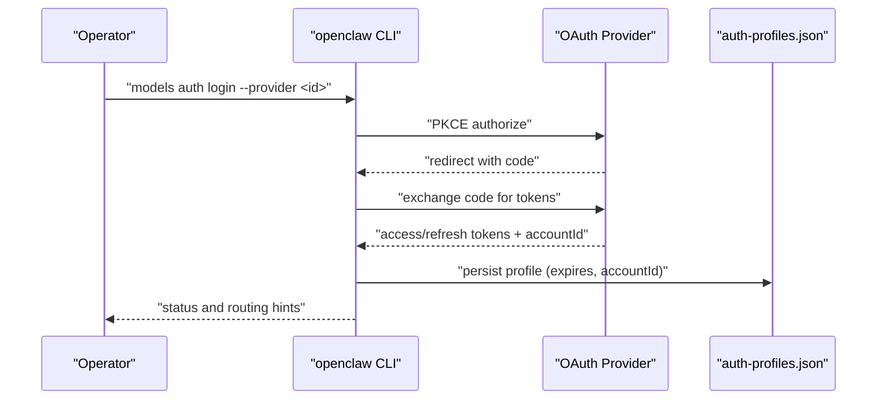
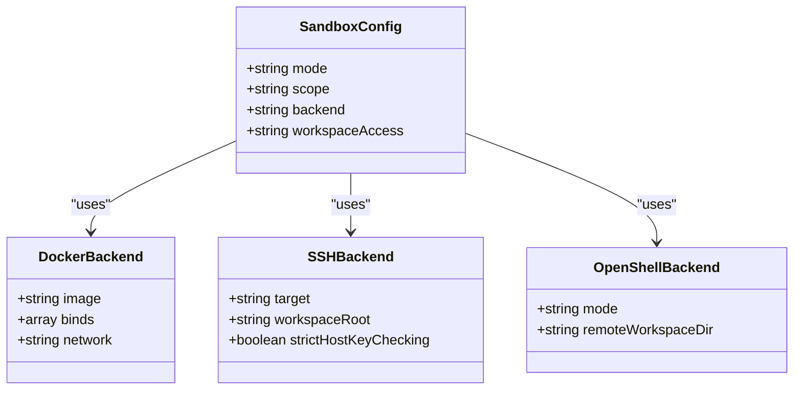
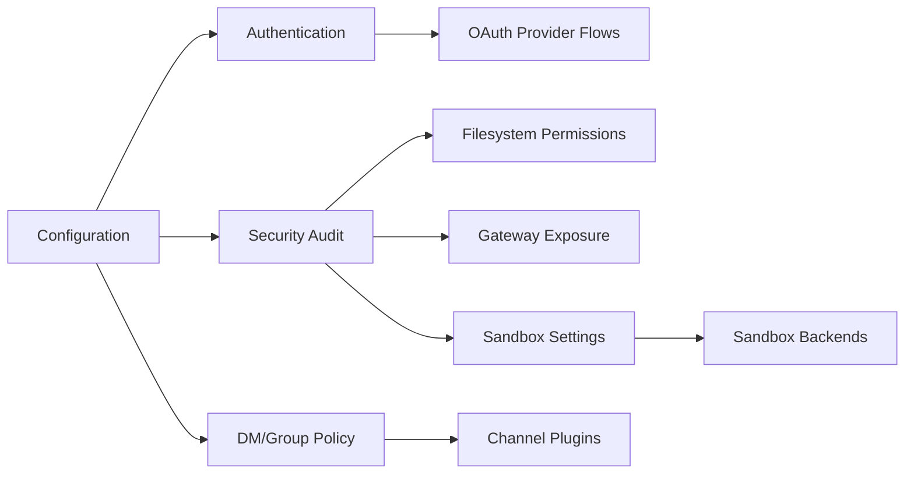

# Authentication & Security

<cite>
**Referenced Files in This Document**
- [SECURITY.md](file://SECURITY.md)
- [docs/cli/security.md](file://docs/cli/security.md)
- [docs/gateway/authentication.md](file://docs/gateway/authentication.md)
- [docs/concepts/oauth.md](file://docs/concepts/oauth.md)
- [docs/gateway/sandboxing.md](file://docs/gateway/sandboxing.md)
- [docs/gateway/configuration.md](file://docs/gateway/configuration.md)
- [docs/gateway/configuration-reference.md](file://docs/gateway/configuration-reference.md)
- [src/security/audit.ts](file://src/security/audit.ts)
- [src/security/dm-policy-shared.ts](file://src/security/dm-policy-shared.ts)
</cite>

## Table of Contents
1. [Introduction](#introduction)
2. [Project Structure](#project-structure)
3. [Core Components](#core-components)
4. [Architecture Overview](#architecture-overview)
5. [Detailed Component Analysis](#detailed-component-analysis)
6. [Dependency Analysis](#dependency-analysis)
7. [Performance Considerations](#performance-considerations)
8. [Troubleshooting Guide](#troubleshooting-guide)
9. [Conclusion](#conclusion)
10. [Appendices](#appendices)

## Introduction
This document explains OpenClaw’s comprehensive security model and authentication systems. It covers the trust model, sandboxing, permission management, authentication flows (including OAuth), token management, and access controls for channels, agents, and tools. It also provides practical configuration guidance, threat mitigation, compliance considerations, platform-specific requirements, audit and monitoring, incident response, and vulnerability management.

## Project Structure
Security and authentication are implemented across:
- Documentation: authoritative guidance for authentication, OAuth, sandboxing, and security auditing
- Core runtime: security audit engine, DM/group access policy resolution, and configuration references
- Platform integrations: channel plugins and provider-specific flows

**Diagram sources**
- [docs/gateway/authentication.md](file://docs/gateway/authentication.md)
- [docs/concepts/oauth.md](file://docs/concepts/oauth.md)
- [docs/gateway/sandboxing.md](file://docs/gateway/sandboxing.md)
- [docs/gateway/configuration.md](file://docs/gateway/configuration.md)
- [docs/gateway/configuration-reference.md](file://docs/gateway/configuration-reference.md)
- [docs/cli/security.md](file://docs/cli/security.md)
- [SECURITY.md](file://SECURITY.md)
- [src/security/audit.ts](file://src/security/audit.ts)
- [src/security/dm-policy-shared.ts](file://src/security/dm-policy-shared.ts)

**Section sources**
- [docs/gateway/authentication.md](file://docs/gateway/authentication.md)
- [docs/concepts/oauth.md](file://docs/concepts/oauth.md)
- [docs/gateway/sandboxing.md](file://docs/gateway/sandboxing.md)
- [docs/gateway/configuration.md](file://docs/gateway/configuration.md)
- [docs/gateway/configuration-reference.md](file://docs/gateway/configuration-reference.md)
- [docs/cli/security.md](file://docs/cli/security.md)
- [SECURITY.md](file://SECURITY.md)
- [src/security/audit.ts](file://src/security/audit.ts)
- [src/security/dm-policy-shared.ts](file://src/security/dm-policy-shared.ts)

## Core Components
- Security audit engine: discovers risks across gateway exposure, auth, tool policy, sandbox, browser control, logging, and plugins
- DM and group access policy: enforces channel-level DM pairing, allowlists, and group gating
- Authentication and OAuth: provider credentials, token storage, refresh, and multi-account profiles
- Sandbox runtime: optional tool execution isolation with configurable modes, scopes, and backends
- Configuration reference: strict schema validation and security-relevant keys

**Section sources**
- [src/security/audit.ts](file://src/security/audit.ts)
- [src/security/dm-policy-shared.ts](file://src/security/dm-policy-shared.ts)
- [docs/gateway/authentication.md](file://docs/gateway/authentication.md)
- [docs/concepts/oauth.md](file://docs/concepts/oauth.md)
- [docs/gateway/sandboxing.md](file://docs/gateway/sandboxing.md)
- [docs/gateway/configuration.md](file://docs/gateway/configuration.md)
- [docs/gateway/configuration-reference.md](file://docs/gateway/configuration-reference.md)

## Architecture Overview
OpenClaw’s security architecture centers on:
- Trust model: one trusted operator per gateway; session identifiers are routing controls, not authorization boundaries
- Authentication: shared secrets (token/password) for gateway, optional trusted-proxy delegation, and provider OAuth/API keys
- Authorization: channel DM/group policies, tool allowlists, and exec approvals
- Isolation: sandboxing for tool execution and optional sandboxed browser
- Auditing: automated security audit with remediation guidance and optional deep probing

**Diagram sources**
- [SECURITY.md](file://SECURITY.md)
- [docs/gateway/authentication.md](file://docs/gateway/authentication.md)
- [docs/gateway/sandboxing.md](file://docs/gateway/sandboxing.md)

## Detailed Component Analysis

### Security Audit Engine
The audit engine collects findings across:
- Gateway exposure and auth: bind mode, shared secret strength, reverse proxy trust, and rate limiting
- Control UI and browser control: origin allowlists, device auth toggles, and CDP exposure
- Logging and secrets hygiene: redaction settings and secret-in-config warnings
- Elevated exec and safe binary configuration: risky allowlists and trusted directories
- Hooks, nodes, and sandbox: exposure and Docker network safety
- Plugins and skills: trust posture and code safety scanning (deep)
- Channel security: provider-specific risks and allowlist stability

**Diagram sources**
- [src/security/audit.ts](file://src/security/audit.ts)

**Section sources**
- [src/security/audit.ts](file://src/security/audit.ts)
- [docs/cli/security.md](file://docs/cli/security.md)

### DM and Group Access Policies
OpenClaw enforces channel-level DM and group access:
- DM policy: pairing, allowlist, open, disabled
- Group policy: allowlist, open, disabled
- Effective allowlists combine static config, pairing store, and group overrides
- Command gating respects access groups and control command authorization

**Diagram sources**
- [src/security/dm-policy-shared.ts](file://src/security/dm-policy-shared.ts)

**Section sources**
- [src/security/dm-policy-shared.ts](file://src/security/dm-policy-shared.ts)
- [docs/gateway/configuration.md](file://docs/gateway/configuration.md)
- [docs/gateway/configuration-reference.md](file://docs/gateway/configuration-reference.md)

### Authentication and OAuth
OpenClaw supports:
- Provider OAuth (PKCE) for supported providers
- Setup-token flows for subscription-based providers
- API key management with rotation and per-session overrides
- Secret storage per-agent and legacy compatibility files
- Automated token refresh and expiration handling

**Diagram sources**
- [docs/concepts/oauth.md](file://docs/concepts/oauth.md)
- [docs/gateway/authentication.md](file://docs/gateway/authentication.md)

**Section sources**
- [docs/concepts/oauth.md](file://docs/concepts/oauth.md)
- [docs/gateway/authentication.md](file://docs/gateway/authentication.md)

### Sandbox Runtime
Sandboxing isolates tool execution:
- Modes: off, non-main, all
- Scopes: session, agent, shared
- Backends: Docker, SSH, OpenShell
- Workspace access: none, ro, rw
- Browser sandbox: optional, with network and control restrictions

**Diagram sources**
- [docs/gateway/sandboxing.md](file://docs/gateway/sandboxing.md)

**Section sources**
- [docs/gateway/sandboxing.md](file://docs/gateway/sandboxing.md)

### Configuration and Access Controls
OpenClaw enforces strict configuration validation and security-relevant keys:
- Strict JSON5 schema validation; unknown keys cause refusal to start
- DM and group policies with per-channel overrides
- Heartbeat and health monitoring tuning
- Model catalogs and per-session overrides
- Tool policy and elevated exec allowlists

**Section sources**
- [docs/gateway/configuration.md](file://docs/gateway/configuration.md)
- [docs/gateway/configuration-reference.md](file://docs/gateway/configuration-reference.md)

## Dependency Analysis
Security and authentication components depend on:
- Configuration loading and schema validation
- Channel plugin ecosystem for DM pairing and allowlists
- Provider OAuth flows and secret storage
- Sandbox runtime backends for isolation
- Audit subsystem for continuous hardening

**Diagram sources**
- [src/security/audit.ts](file://src/security/audit.ts)
- [src/security/dm-policy-shared.ts](file://src/security/dm-policy-shared.ts)
- [docs/gateway/authentication.md](file://docs/gateway/authentication.md)
- [docs/gateway/sandboxing.md](file://docs/gateway/sandboxing.md)

**Section sources**
- [src/security/audit.ts](file://src/security/audit.ts)
- [src/security/dm-policy-shared.ts](file://src/security/dm-policy-shared.ts)
- [docs/gateway/authentication.md](file://docs/gateway/authentication.md)
- [docs/gateway/sandboxing.md](file://docs/gateway/sandboxing.md)

## Performance Considerations
- Prefer sandbox mode “non-main” for normal chats and “all” for high-risk sessions
- Use “session” scope for least overhead; “shared” for multi-session consolidation
- Limit Docker binds and mount read/write to what is necessary
- Keep logging redaction enabled to reduce I/O and risk of secrets in logs
- Use strict safeBinTrustedDirs and avoid mutable temp directories

[No sources needed since this section provides general guidance]

## Troubleshooting Guide
Common issues and resolutions:
- Gateway binds beyond loopback without auth: set shared secret or bind to loopback
- Control UI origin allowlist missing/wildcard: configure allowed origins or disable wildcard
- Dangerous allowlists in gateway tools: remove entries from allow list or restrict exposure
- Browser control without auth: set gateway auth token/password
- Sandbox exec host set to sandbox while sandbox mode is off: enable sandbox mode or switch exec host
- Elevated exec allowlist large or wildcard: tighten allowlist entries
- Logging redaction disabled: set logging.redactSensitive to “tools”

**Section sources**
- [src/security/audit.ts](file://src/security/audit.ts)
- [docs/cli/security.md](file://docs/cli/security.md)

## Conclusion
OpenClaw’s security model emphasizes a personal-assistant trust model with strict operator controls, robust authentication and OAuth, configurable sandboxing, and comprehensive access policies. The security audit tool automates risk discovery and remediation, while documentation provides authoritative guidance for deployment, compliance, and incident response.

[No sources needed since this section summarizes without analyzing specific files]

## Appendices

### Practical Security Configuration Examples
- Enforce loopback-only gateway binding and shared secret
- Enable sandbox mode “non-main” or “all” depending on risk tolerance
- Use strict DM and group policies (“allowlist” or “pairing”)
- Tighten logging redaction and filesystem permissions
- Pin provider credentials per agent and rotate regularly

**Section sources**
- [SECURITY.md](file://SECURITY.md)
- [docs/gateway/authentication.md](file://docs/gateway/authentication.md)
- [docs/gateway/sandboxing.md](file://docs/gateway/sandboxing.md)
- [docs/gateway/configuration.md](file://docs/gateway/configuration.md)
- [docs/gateway/configuration-reference.md](file://docs/gateway/configuration-reference.md)
- [docs/cli/security.md](file://docs/cli/security.md)

### Compliance and Risk Assessment
- Treat gateway as trusted operator boundary; session identifiers are routing controls
- Avoid multi-tenant shared gateway setups; use per-user isolation
- Keep Control UI loopback-only or behind strong reverse proxy with strict origin allowlists
- Audit plugin and skill code in deep scans; maintain allowlists for elevated exec
- Monitor and rotate provider credentials; enforce token refresh and expiration handling

**Section sources**
- [SECURITY.md](file://SECURITY.md)
- [docs/concepts/oauth.md](file://docs/concepts/oauth.md)
- [src/security/audit.ts](file://src/security/audit.ts)

### Security Monitoring and Incident Response
- Use the security audit CLI for periodic checks and JSON output for CI
- Monitor gateway exposure, auth strength, and sandbox configuration
- Review plugin and skill code safety in deep audits
- Respond to critical findings immediately; warn findings should be prioritized

**Section sources**
- [docs/cli/security.md](file://docs/cli/security.md)
- [src/security/audit.ts](file://src/security/audit.ts)

### Vulnerability Management
- Follow responsible disclosure guidelines and provide required report details
- Use triage fast-path items to expedite review
- Understand out-of-scope scenarios and trust model assumptions
- Apply patches promptly and verify with security audit

**Section sources**
- [SECURITY.md](file://SECURITY.md)