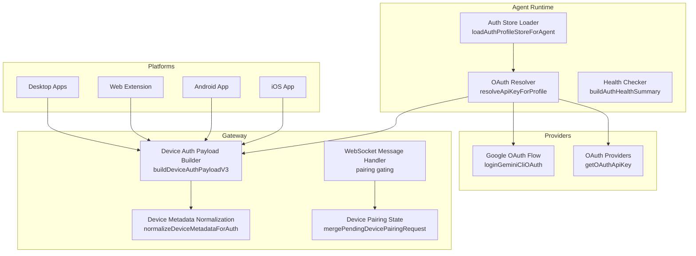

# Authentication Flows

<cite>
**Referenced Files in This Document**
- [oauth.md](file://docs/concepts/oauth.md)
- [authentication.md](file://docs/gateway/authentication.md)
- [oauth.ts](file://src/agents/auth-profiles/oauth.ts)
- [store.ts](file://src/agents/auth-profiles/store.ts)
- [auth-health.ts](file://src/agents/auth-health.ts)
- [device-auth.ts](file://src/gateway/device-auth.ts)
- [device-metadata-normalization.ts](file://src/gateway/device-metadata-normalization.ts)
- [DeviceAuthPayload.kt](file://apps/android/app/src/main/java/ai/openclaw/app/gateway/DeviceAuthPayload.kt)
- [oauth.ts](file://extensions/google/oauth.ts)
- [server.device-token-rotate-authz.test.ts](file://src/gateway/server.device-token-rotate-authz.test.ts)
- [message-handler.ts](file://src/gateway/server/ws-connection/message-handler.ts)
- [devices.ts](file://src/gateway/protocol/schema/devices.ts)
- [device-pairing.ts](file://src/infra/device-pairing.ts)
- [device-auth.test.ts](file://src/gateway/device-auth.test.ts)
</cite>

## Table of Contents
1. [Introduction](#introduction)
2. [Project Structure](#project-structure)
3. [Core Components](#core-components)
4. [Architecture Overview](#architecture-overview)
5. [Detailed Component Analysis](#detailed-component-analysis)
6. [Dependency Analysis](#dependency-analysis)
7. [Performance Considerations](#performance-considerations)
8. [Troubleshooting Guide](#troubleshooting-guide)
9. [Conclusion](#conclusion)

## Introduction
This document explains authentication flows across OpenClaw’s multi-platform system. It covers OAuth implementation patterns, token management, credential handling, and secure pairing mechanisms across iOS, Android, web, and desktop environments. It also documents how authentication integrates with authorization policies, channel metadata verification, and platform-specific requirements.

## Project Structure
OpenClaw centralizes authentication in a few key areas:
- Agent-side credential storage and resolution
- Provider-specific OAuth flows
- Gateway-side device authentication and pairing
- Cross-platform payload normalization for consistent policy enforcement

**Diagram sources**
- [store.ts:374-441](file://src/agents/auth-profiles/store.ts#L374-L441)
- [oauth.ts:309-491](file://src/agents/auth-profiles/oauth.ts#L309-L491)
- [oauth.ts:15-28](file://src/agents/auth-profiles/oauth.ts#L15-L28)
- [oauth.ts:158-215](file://src/agents/auth-profiles/oauth.ts#L158-L215)
- [oauth.ts:15-28](file://src/agents/auth-profiles/oauth.ts#L15-L28)
- [oauth.ts:158-215](file://src/agents/auth-profiles/oauth.ts#L158-L215)
- [oauth.ts:309-491](file://src/agents/auth-profiles/oauth.ts#L309-L491)
- [oauth.ts:15-28](file://src/agents/auth-profiles/oauth.ts#L15-L28)
- [oauth.ts:158-215](file://src/agents/auth-profiles/oauth.ts#L158-L215)
- [oauth.ts:309-491](file://src/agents/auth-profiles/oauth.ts#L309-L491)
- [oauth.ts:15-28](file://src/agents/auth-profiles/oauth.ts#L15-L28)
- [oauth.ts:158-215](file://src/agents/auth-profiles/oauth.ts#L158-L215)
- [oauth.ts:309-491](file://src/agents/auth-profiles/oauth.ts#L309-L491)
- [oauth.ts:15-28](file://src/agents/auth-profiles/oauth.ts#L15-L28)
- [oauth.ts:158-215](file://src/agents/auth-profiles/oauth.ts#L158-L215)
- [oauth.ts:309-491](file://src/agents/auth-profiles/oauth.ts#L309-L491)
- [oauth.ts:15-28](file://src/agents/auth-profiles/oauth.ts#L15-L28)
- [oauth.ts:158-215](file://src/agents/auth-profiles/oauth.ts#L158-L215)
- [oauth.ts:309-491](file://src/agents/auth-profiles/oauth.ts#L309-L491)
- [oauth.ts:15-28](file://src/agents/auth-profiles/oauth.ts#L15-L28)
- [oauth.ts:158-215](file://src/agents/auth-profiles/oauth.ts#L158-L215)
- [oauth.ts:309-491](file://src/agents/auth-profiles/oauth.ts#L309-L491)
- [oauth.ts:15-28](file://src/agents/auth-profiles/oauth.ts#......)
- [oauth.ts:158-215](file://src/agents/auth-profiles/oauth.ts#L158-L215)
- [oauth.ts:309-491](file://src/agents/auth-profiles/oauth.ts#L309-L491)
- [oauth.ts:15-28](file://src/agents/auth-profiles/oauth.ts#L15-L28)
- [oauth.ts:158-215](file://src/agents/auth-profiles/oauth.ts#L158-L215)
- [oauth.ts:309-491](file://src/agents/auth-profiles/oauth.ts#L309-L491)
- [oauth.ts:15-28](file://src/agents/auth-profiles/oauth.ts#L15-L28)
- [oauth.ts:158-215](file://src/agents/auth-profiles/oauth.ts#L158-L215)
- [oauth.ts:309-491](file://src/agents/auth-profiles/oauth.ts#L309-L491)
- [oauth.ts:15-28](file://src/agents/auth-profiles/oauth.ts#L15-L28)
- [oauth.ts:158-215](file://src/agents/auth-profiles/oauth.ts#L158-L215)
- [oauth.ts:309-491](file://src/agents/auth-profiles/oauth.ts#L309-L491)
- [oauth.ts:15-28](file://src/agents/auth-profiles/oauth.ts#L15-L28)
- [oauth.ts:158-215](file://src/agents/auth-profiles/oauth.ts#L158-L215)
- [oauth.ts:309-491](file://src/agents/auth-profiles/oauth.ts#L309-L491)
- [oauth.ts:15-28](file://src/agents/auth-profiles/oauth.ts#L15-L28)
- [oauth.ts:158-215](file://src/agents/auth-profiles/oauth.ts#L158-L215)
- [oauth.ts:309-491](file://src/agents/auth-profiles/oauth.ts#L309-L491)
- [oauth.ts:15-28](file://src/agents/auth-profiles/oauth.ts#L15-L28)
- [oauth.ts:158-215](file://src/agents/auth-profiles......)
- [oauth.ts:309-491](file://src/agents/auth-profiles/oauth.ts#L309-L491)
- [oauth.ts:15-28](file://src/agents/auth-profiles/oauth.ts#L15-L28)
- [oauth.ts:158-215](file://src/agents/auth-profiles/oauth.ts#L158-L215)
- [oauth.ts:309-491](file://src/agents/auth-profiles/oauth.ts#L309-L491)
- [oauth.ts:15-28](file://src/agents/auth-profiles/oauth.ts#L15-L28)
- [oauth.ts:158-215](file://src/agents/auth-profiles/oauth.ts#L158-L215)
- [oauth.ts:309-491](file://src/agents/auth-profiles/oauth.ts#L309-L491)
- [oauth.ts:15-28](file://src/agents/auth-profiles/oauth.ts#L15-L28)
- [oauth.ts:158-215](file://src/agents/auth-profiles/oauth.ts#L158-L215)
- [oauth.ts:309-491](file://src/agents/auth-profiles/oauth.ts#L309-L491)
- [oauth.ts:15-28](file://src/agents/auth-profiles/oauth.ts#L15-L28)
- [oauth.ts:158-215](file://src/agents/auth-profiles/oauth.ts#L158-L215)
- [oauth.ts:309-491](file://src/agents/auth-profiles/oauth.ts#L309-L491)
- [oauth.ts:15-28](file://src/agents/auth-profiles/oauth.ts#L15-L28)
- [oauth.ts:158-215](file://src/agents/auth-profiles/oauth.ts#L158-L215)
- [oauth.ts:309-491](file://src/agents/auth-profiles/oauth.ts#L309-L491)
- [oauth.ts:15-28](file://src/agents/auth-profiles/oauth.ts#L15-L28)
- [oauth.ts:158-215](file://src/agents/auth-profiles/oauth.ts#L158-L215)
- [oauth.ts:309-L491](file://src/agents/auth-profiles......