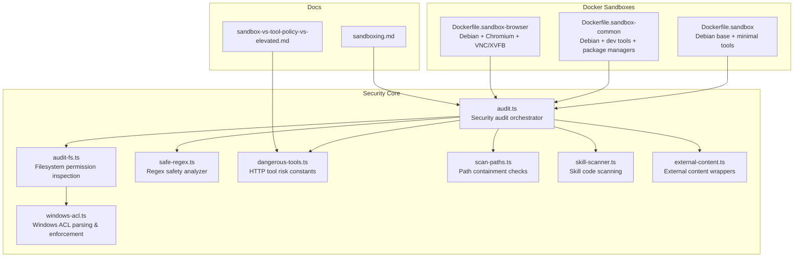
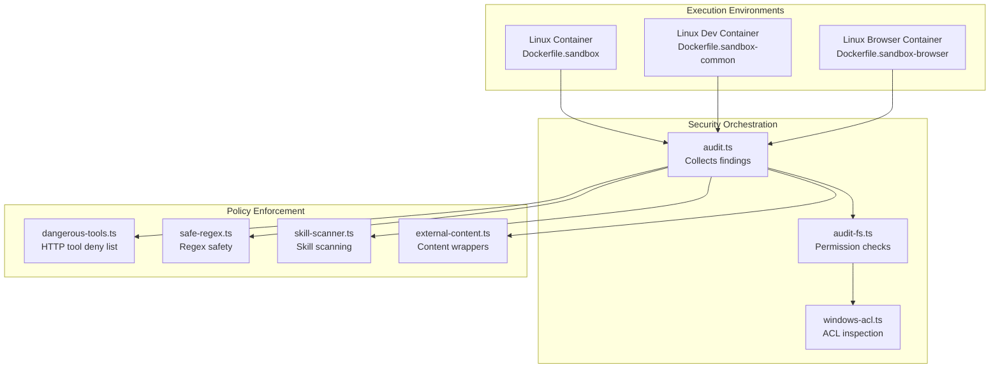
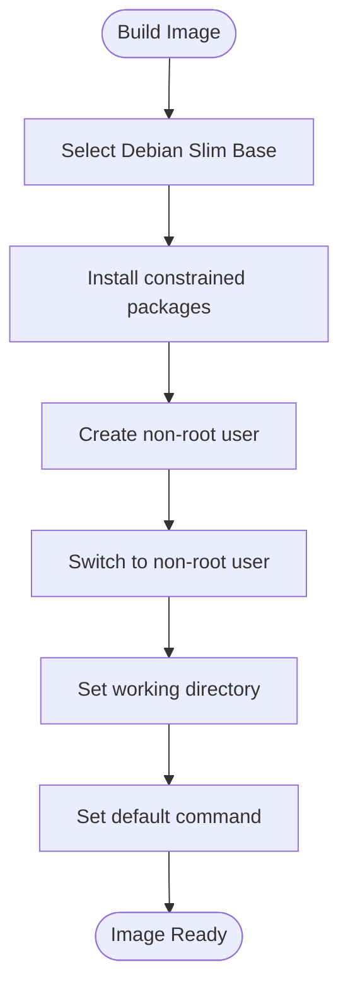
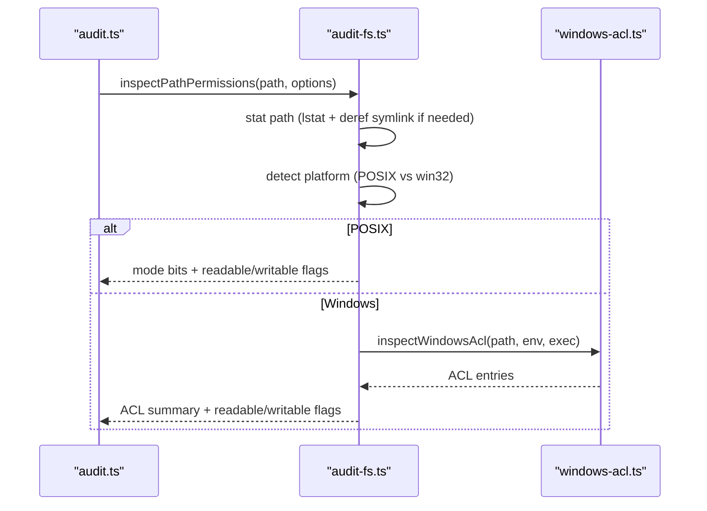
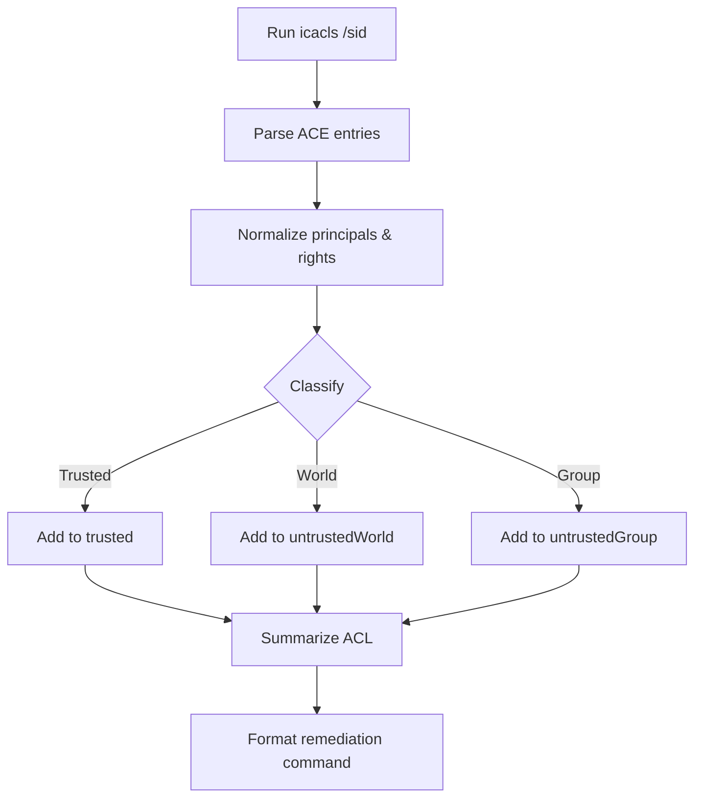
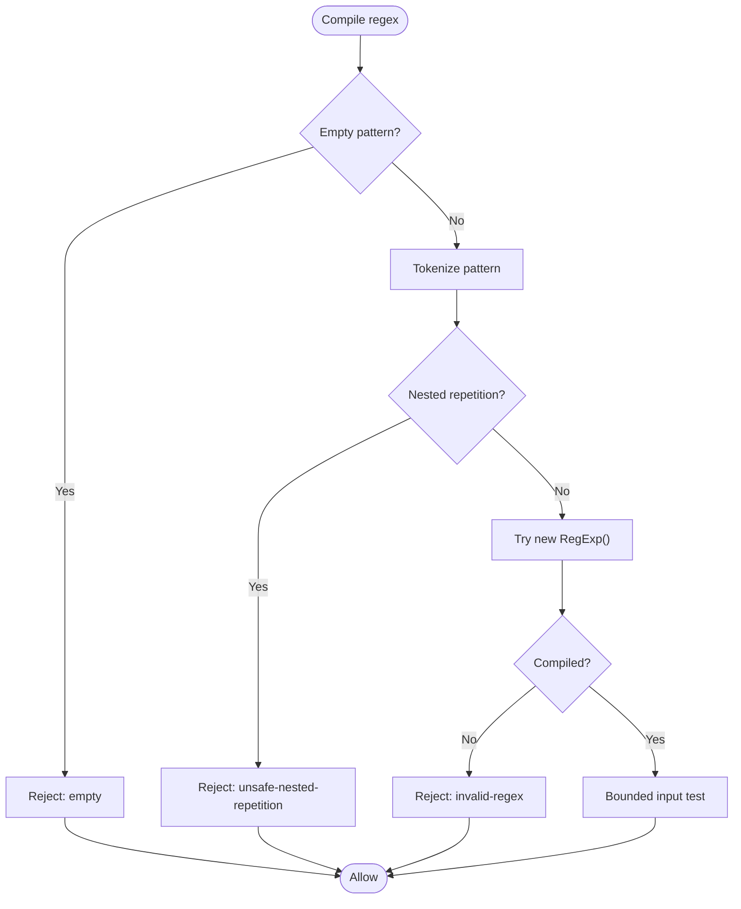
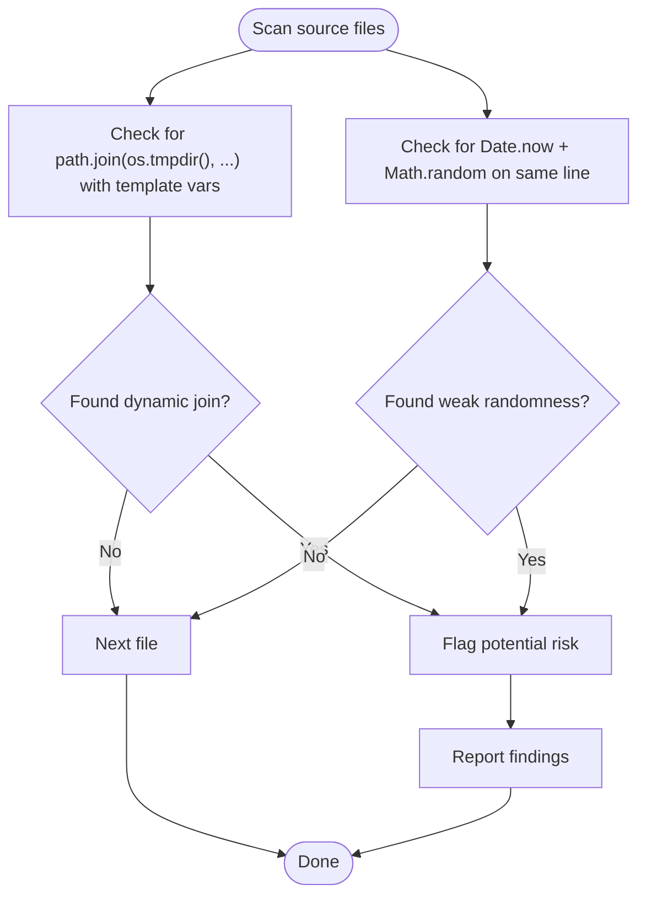
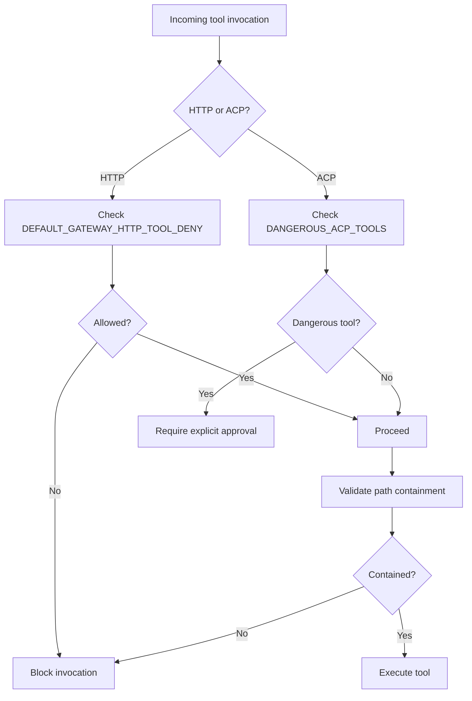
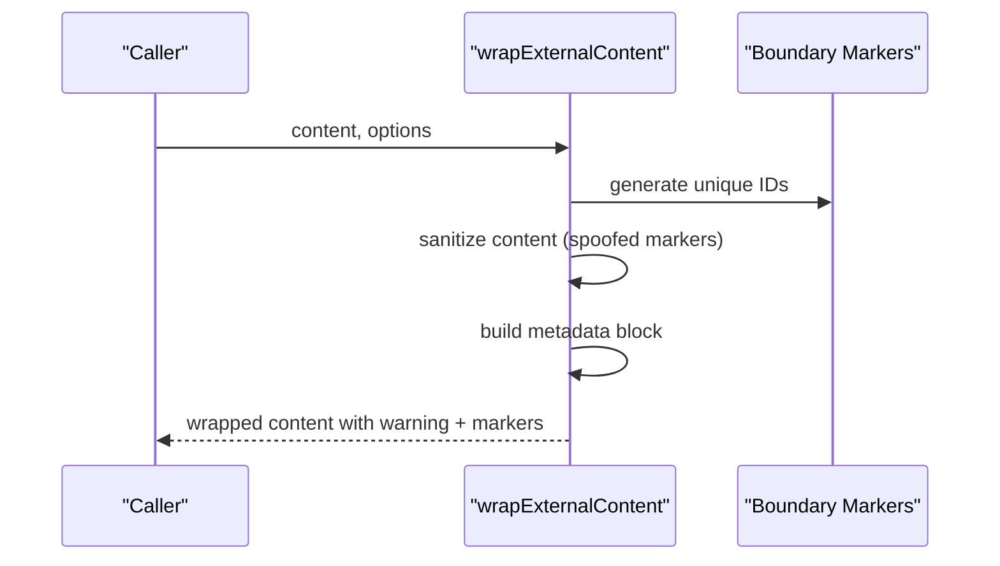
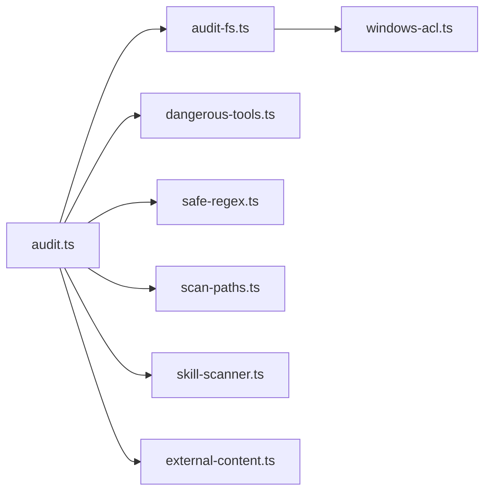

# Sandboxing & Permissions

<cite>
**Referenced Files in This Document**
- [Dockerfile.sandbox](file://Dockerfile.sandbox)
- [Dockerfile.sandbox-common](file://Dockerfile.sandbox-common)
- [Dockerfile.sandbox-browser](file://Dockerfile.sandbox-browser)
- [audit.ts](file://src/security/audit.ts)
- [audit-fs.ts](file://src/security/audit-fs.ts)
- [windows-acl.ts](file://src/security/windows-acl.ts)
- [safe-regex.ts](file://src/security/safe-regex.ts)
- [temp-path-guard.test.ts](file://src/security/temp-path-guard.test.ts)
- [dangerous-tools.ts](file://src/security/dangerous-tools.ts)
- [scan-paths.ts](file://src/security/scan-paths.ts)
- [skill-scanner.ts](file://src/security/skill-scanner.ts)
- [external-content.ts](file://src/security/external-content.ts)
- [sandboxing.md](file://docs/gateway/sandboxing.md)
- [sandbox-vs-tool-policy-vs-elevated.md](file://docs/gateway/sandbox-vs-tool-policy-vs-elevated.md)
</cite>

## Table of Contents
1. [Introduction](#introduction)
2. [Project Structure](#project-structure)
3. [Core Components](#core-components)
4. [Architecture Overview](#architecture-overview)
5. [Detailed Component Analysis](#detailed-component-analysis)
6. [Dependency Analysis](#dependency-analysis)
7. [Performance Considerations](#performance-considerations)
8. [Troubleshooting Guide](#troubleshooting-guide)
9. [Conclusion](#conclusion)
10. [Appendices](#appendices)

## Introduction
This document explains OpenClaw’s sandboxing and permission management systems. It covers the sandbox execution model, permission boundaries, and security isolation mechanisms across Linux and Windows. It documents regex safety systems, temporary path guards, Windows ACL enforcement, tool policy enforcement, filesystem permissions, and resource access controls. Practical examples show how to configure sandboxes, manage permissions, and enforce security policies. Platform-specific considerations and the relationship between sandboxing, tool execution, filesystem access, and external resource interaction are addressed.

## Project Structure
OpenClaw’s security and sandboxing capabilities are implemented primarily under the src/security directory and complemented by Docker-based sandbox images. The documentation includes dedicated gateway sandboxing guides.

**Diagram sources**
- [Dockerfile.sandbox:1-25](file://Dockerfile.sandbox#L1-L25)
- [Dockerfile.sandbox-common:1-49](file://Dockerfile.sandbox-common#L1-L49)
- [Dockerfile.sandbox-browser:1-36](file://Dockerfile.sandbox-browser#L1-L36)
- [audit.ts:1-120](file://src/security/audit.ts#L1-L120)
- [audit-fs.ts:1-207](file://src/security/audit-fs.ts#L1-L207)
- [windows-acl.ts:1-364](file://src/security/windows-acl.ts#L1-L364)
- [safe-regex.ts:1-362](file://src/security/safe-regex.ts#L1-L362)
- [dangerous-tools.ts:1-40](file://src/security/dangerous-tools.ts#L1-L40)
- [scan-paths.ts:1-43](file://src/security/scan-paths.ts#L1-L43)
- [skill-scanner.ts:1-584](file://src/security/skill-scanner.ts#L1-L584)
- [external-content.ts:1-355](file://src/security/external-content.ts#L1-L355)
- [sandboxing.md](file://docs/gateway/sandboxing.md)
- [sandbox-vs-tool-policy-vs-elevated.md](file://docs/gateway/sandbox-vs-tool-policy-vs-elevated.md)

**Section sources**
- [Dockerfile.sandbox:1-25](file://Dockerfile.sandbox#L1-L25)
- [Dockerfile.sandbox-common:1-49](file://Dockerfile.sandbox-common#L1-L49)
- [Dockerfile.sandbox-browser:1-36](file://Dockerfile.sandbox-browser#L1-L36)
- [audit.ts:1-120](file://src/security/audit.ts#L1-L120)

## Core Components
- Sandbox images: Minimal Debian-based containers with isolated users and constrained toolsets for general-purpose and browser-based sandboxing.
- Security audit: Centralized audit orchestrator that aggregates filesystem, gateway, browser control, and attack surface findings.
- Filesystem permission inspection: Unified POSIX and Windows ACL checks with remediation guidance.
- Windows ACL enforcement: Parsing and classification of ACL entries with safe reset commands.
- Regex safety: Static analysis to reject unsafe nested repetition patterns and bounded input testing.
- Temporary path guards: Runtime guardrails for dynamic temp directory joins and weak randomness.
- Tool policy enforcement: HTTP tool deny lists and ACP tool risk sets.
- Path containment: Utilities to ensure paths remain inside allowed bases.
- Skill scanner: Static analysis of skills for dangerous patterns and obfuscation.
- External content wrappers: Safe boundary markers and warnings for untrusted inputs.

**Section sources**
- [audit.ts:120-800](file://src/security/audit.ts#L120-L800)
- [audit-fs.ts:1-207](file://src/security/audit-fs.ts#L1-L207)
- [windows-acl.ts:1-364](file://src/security/windows-acl.ts#L1-L364)
- [safe-regex.ts:1-362](file://src/security/safe-regex.ts#L1-L362)
- [temp-path-guard.test.ts:1-250](file://src/security/temp-path-guard.test.ts#L1-L250)
- [dangerous-tools.ts:1-40](file://src/security/dangerous-tools.ts#L1-L40)
- [scan-paths.ts:1-43](file://src/security/scan-paths.ts#L1-L43)
- [skill-scanner.ts:1-584](file://src/security/skill-scanner.ts#L1-L584)
- [external-content.ts:1-355](file://src/security/external-content.ts#L1-L355)

## Architecture Overview
OpenClaw’s sandboxing and permissions architecture combines containerized environments, runtime permission checks, and policy enforcement across tools and filesystems.

**Diagram sources**
- [Dockerfile.sandbox:1-25](file://Dockerfile.sandbox#L1-L25)
- [Dockerfile.sandbox-common:1-49](file://Dockerfile.sandbox-common#L1-L49)
- [Dockerfile.sandbox-browser:1-36](file://Dockerfile.sandbox-browser#L1-L36)
- [audit.ts:1-120](file://src/security/audit.ts#L1-L120)
- [audit-fs.ts:1-207](file://src/security/audit-fs.ts#L1-L207)
- [windows-acl.ts:1-364](file://src/security/windows-acl.ts#L1-L364)
- [dangerous-tools.ts:1-40](file://src/security/dangerous-tools.ts#L1-L40)
- [safe-regex.ts:1-362](file://src/security/safe-regex.ts#L1-L362)
- [skill-scanner.ts:1-584](file://src/security/skill-scanner.ts#L1-L584)
- [external-content.ts:1-355](file://src/security/external-content.ts#L1-L355)

## Detailed Component Analysis

### Sandbox Execution Model
- General-purpose sandbox image installs minimal tools and runs as a non-root user.
- Common sandbox adds developer tools and package managers.
- Browser sandbox includes Chromium, VNC, and X11 virtual framebuffer for headless browser automation.

**Diagram sources**
- [Dockerfile.sandbox:1-25](file://Dockerfile.sandbox#L1-L25)
- [Dockerfile.sandbox-common:1-49](file://Dockerfile.sandbox-common#L1-L49)
- [Dockerfile.sandbox-browser:1-36](file://Dockerfile.sandbox-browser#L1-L36)

**Section sources**
- [Dockerfile.sandbox:1-25](file://Dockerfile.sandbox#L1-L25)
- [Dockerfile.sandbox-common:1-49](file://Dockerfile.sandbox-common#L1-L49)
- [Dockerfile.sandbox-browser:1-36](file://Dockerfile.sandbox-browser#L1-L36)

### Permission Boundaries and Filesystem Access
- Unified permission inspection supports POSIX and Windows ACLs.
- Remediation guidance is provided for both platforms.
- Symlink and directory/file modes are considered, with special handling for symlink targets.

**Diagram sources**
- [audit.ts:221-350](file://src/security/audit.ts#L221-L350)
- [audit-fs.ts:62-142](file://src/security/audit-fs.ts#L62-L142)
- [windows-acl.ts:280-319](file://src/security/windows-acl.ts#L280-L319)

**Section sources**
- [audit-fs.ts:1-207](file://src/security/audit-fs.ts#L1-L207)
- [windows-acl.ts:1-364](file://src/security/windows-acl.ts#L1-L364)
- [audit.ts:221-350](file://src/security/audit.ts#L221-L350)

### Windows ACL Enforcement
- Parses icacls output, normalizes principals and rights, and classifies entries as trusted, world, or group.
- Provides formatted ACL summaries and safe reset commands to enforce least privilege.

**Diagram sources**
- [windows-acl.ts:213-268](file://src/security/windows-acl.ts#L213-L268)
- [windows-acl.ts:332-363](file://src/security/windows-acl.ts#L332-L363)

**Section sources**
- [windows-acl.ts:1-364](file://src/security/windows-acl.ts#L1-L364)

### Regex Safety Systems
- Rejects unsafe nested repetition patterns and validates regex compilation.
- Uses bounded input testing to mitigate catastrophic backtracking risks.

**Diagram sources**
- [safe-regex.ts:321-361](file://src/security/safe-regex.ts#L321-L361)

**Section sources**
- [safe-regex.ts:1-362](file://src/security/safe-regex.ts#L1-L362)

### Temporary Path Guards
- Detects dynamic temp directory joins and weak randomness patterns in runtime source files.
- Prevents accidental exposure of sensitive paths and predictable identifiers.

**Diagram sources**
- [temp-path-guard.test.ts:160-188](file://src/security/temp-path-guard.test.ts#L160-L188)

**Section sources**
- [temp-path-guard.test.ts:1-250](file://src/security/temp-path-guard.test.ts#L1-L250)

### Tool Policy Enforcement and Resource Access Controls
- HTTP tool deny list prevents high-risk tools from being invoked over HTTP.
- ACP tool risk set ensures explicit user approval for mutating/execution tools.
- Path containment utilities ensure operations stay within allowed bases.

**Diagram sources**
- [dangerous-tools.ts:9-40](file://src/security/dangerous-tools.ts#L9-L40)
- [scan-paths.ts:4-33](file://src/security/scan-paths.ts#L4-L33)

**Section sources**
- [dangerous-tools.ts:1-40](file://src/security/dangerous-tools.ts#L1-L40)
- [scan-paths.ts:1-43](file://src/security/scan-paths.ts#L1-L43)

### External Content Interaction
- Wraps external content with unique boundary markers and warnings.
- Sanitizes spoofed markers and applies source-specific labeling.

**Diagram sources**
- [external-content.ts:247-274](file://src/security/external-content.ts#L247-L274)

**Section sources**
- [external-content.ts:1-355](file://src/security/external-content.ts#L1-L355)

### Conceptual Overview
- Sandbox execution isolates tool execution in containers with constrained privileges.
- Permission management enforces least privilege on filesystems and Windows ACLs.
- Policy enforcement restricts dangerous tools and validates regex and path safety.
- External content is wrapped to prevent prompt injection and maintain trust boundaries.

[No sources needed since this section doesn't analyze specific files]

## Dependency Analysis
The security audit orchestrator coordinates filesystem checks, gateway hardening, browser control, and policy enforcement. It depends on platform-specific permission inspectors and policy constants.

**Diagram sources**
- [audit.ts:1-120](file://src/security/audit.ts#L1-L120)
- [audit-fs.ts:1-207](file://src/security/audit-fs.ts#L1-L207)
- [windows-acl.ts:1-364](file://src/security/windows-acl.ts#L1-L364)
- [dangerous-tools.ts:1-40](file://src/security/dangerous-tools.ts#L1-L40)
- [safe-regex.ts:1-362](file://src/security/safe-regex.ts#L1-L362)
- [scan-paths.ts:1-43](file://src/security/scan-paths.ts#L1-L43)
- [skill-scanner.ts:1-584](file://src/security/skill-scanner.ts#L1-L584)
- [external-content.ts:1-355](file://src/security/external-content.ts#L1-L355)

**Section sources**
- [audit.ts:1-120](file://src/security/audit.ts#L1-L120)

## Performance Considerations
- Regex safety caches compiled results and limits cache size to balance accuracy and memory.
- Filesystem permission checks avoid redundant stat calls and leverage symlink dereferencing only when necessary.
- Skill scanner caches file and directory entries to reduce I/O during large scans.
- Docker sandbox images use apt caches to speed up builds.

[No sources needed since this section provides general guidance]

## Troubleshooting Guide
- Filesystem permission issues: Use the generated remediation commands to adjust POSIX modes or Windows ACLs. On Windows, prefer the built-in reset command generation for least privilege.
- Unsafe regex errors: Review the rejection reason and simplify patterns to avoid nested repetitions or invalid constructs.
- Dynamic temp path joins: Replace template-based dynamic paths with static, controlled locations and avoid weak randomness on the same line.
- HTTP tool invocations blocked: Remove entries from the allow list that conflict with the default deny list or restrict exposure to loopback-only with strong auth.
- External content ingestion: Ensure content is wrapped with security markers and warnings before passing to LLMs.

**Section sources**
- [audit-fs.ts:152-164](file://src/security/audit-fs.ts#L152-L164)
- [windows-acl.ts:332-363](file://src/security/windows-acl.ts#L332-L363)
- [safe-regex.ts:321-361](file://src/security/safe-regex.ts#L321-L361)
- [temp-path-guard.test.ts:160-188](file://src/security/temp-path-guard.test.ts#L160-L188)
- [dangerous-tools.ts:9-20](file://src/security/dangerous-tools.ts#L9-L20)
- [external-content.ts:247-274](file://src/security/external-content.ts#L247-L274)

## Conclusion
OpenClaw’s sandboxing and permissions systems combine containerized execution, robust filesystem and ACL checks, policy-driven tool restrictions, and safeguards for regex and external content. Together, these components establish strong security boundaries around tool execution, filesystem access, and external resource interaction, with platform-specific enforcement and practical remediation guidance.

[No sources needed since this section summarizes without analyzing specific files]

## Appendices

### Practical Examples

- Configure a sandbox container:
  - Use the general-purpose sandbox image for non-interactive tasks.
  - Use the browser sandbox image for headless browser automation.
  - Build with caching enabled to speed up development cycles.

  **Section sources**
  - [Dockerfile.sandbox:1-25](file://Dockerfile.sandbox#L1-L25)
  - [Dockerfile.sandbox-browser:1-36](file://Dockerfile.sandbox-browser#L1-L36)

- Enforce filesystem permissions:
  - Run the security audit to discover world/group-readable/writable paths.
  - Apply remediation commands to tighten permissions on POSIX or Windows.

  **Section sources**
  - [audit.ts:221-350](file://src/security/audit.ts#L221-L350)
  - [audit-fs.ts:152-164](file://src/security/audit-fs.ts#L152-L164)
  - [windows-acl.ts:332-363](file://src/security/windows-acl.ts#L332-L363)

- Restrict HTTP tool invocations:
  - Avoid enabling tools from the default deny list over HTTP.
  - Keep gateway bind loopback-only or tailnet-only with strong auth.

  **Section sources**
  - [dangerous-tools.ts:9-20](file://src/security/dangerous-tools.ts#L9-L20)
  - [audit.ts:425-441](file://src/security/audit.ts#L425-L441)

- Safeguard external content:
  - Wrap all external content with security markers and warnings.
  - Sanitize spoofed markers and include source metadata.

  **Section sources**
  - [external-content.ts:247-274](file://src/security/external-content.ts#L247-L274)

- Validate regex safety:
  - Compile with the safe regex checker to reject unsafe patterns.
  - Use bounded input testing for long inputs.

  **Section sources**
  - [safe-regex.ts:321-361](file://src/security/safe-regex.ts#L321-L361)

- Guard dynamic temp paths:
  - Scan runtime sources for dynamic temp directory joins.
  - Avoid weak randomness on the same line.

  **Section sources**
  - [temp-path-guard.test.ts:160-188](file://src/security/temp-path-guard.test.ts#L160-L188)

- Platform-specific notes:
  - Windows ACL classification accounts for localized account names and SID normalization.
  - Use the provided reset command generator to enforce least privilege.

  **Section sources**
  - [windows-acl.ts:100-148](file://src/security/windows-acl.ts#L100-L148)
  - [windows-acl.ts:332-363](file://src/security/windows-acl.ts#L332-L363)

- Relationship to documentation:
  - Refer to the gateway sandboxing guide for operational guidance.
  - Review sandbox vs tool policy vs elevated for policy alignment.

  **Section sources**
  - [sandboxing.md](file://docs/gateway/sandboxing.md)
  - [sandbox-vs-tool-policy-vs-elevated.md](file://docs/gateway/sandbox-vs-tool-policy-vs-elevated.md)