# Security Architecture

<cite>
**Referenced Files in This Document**
- [SECURITY.md](file://SECURITY.md)
- [audit.ts](file://src/security/audit.ts)
- [audit-extra.ts](file://src/security/audit-extra.ts)
- [audit-fs.ts](file://src/security/audit-fs.ts)
- [dangerous-tools.ts](file://src/security/dangerous-tools.ts)
- [dangerous-config-flags.ts](file://src/security/dangerous-config-flags.ts)
- [external-content.ts](file://src/security/external-content.ts)
- [safe-regex.ts](file://src/security/safe-regex.ts)
- [scan-paths.ts](file://src/security/scan-paths.ts)
- [skill-scanner.ts](file://src/security/skill-scanner.ts)
- [fix.ts](file://src/security/fix.ts)
- [THREAT-MODEL-ATLAS.md](file://docs/security/THREAT-MODEL-ATLAS.md)
- [CONTRIBUTING-THREAT-MODEL.md](file://docs/security/CONTRIBUTING-THREAT-MODEL.md)
- [status.command.ts](file://src/commands/status.command.ts)
</cite>

## Table of Contents
1. [Introduction](#introduction)
2. [Project Structure](#project-structure)
3. [Core Components](#core-components)
4. [Architecture Overview](#architecture-overview)
5. [Detailed Component Analysis](#detailed-component-analysis)
6. [Dependency Analysis](#dependency-analysis)
7. [Performance Considerations](#performance-considerations)
8. [Troubleshooting Guide](#troubleshooting-guide)
9. [Conclusion](#conclusion)
10. [Appendices](#appendices)

## Introduction
This document presents OpenClaw’s security architecture with a focus on the layered security model: audit systems, policy enforcement, and threat detection. It explains how the security audit framework monitors system integrity, detects suspicious activities, and enforces security policies across configuration, filesystem, gateway exposure, channel integrations, and skills. It also covers dangerous tools detection, path scanning mechanisms, and security boundary enforcement. Practical examples illustrate security policy configuration, audit trail management, and security monitoring implementation. Finally, it outlines security architecture patterns, threat modeling approaches, and compliance considerations.

## Project Structure
OpenClaw’s security capabilities are implemented primarily under the src/security directory and complemented by operational guidance in SECURITY.md and threat modeling in docs/security. The security subsystem integrates with configuration, gateway, channels, and skills to enforce trust boundaries and mitigate risks.

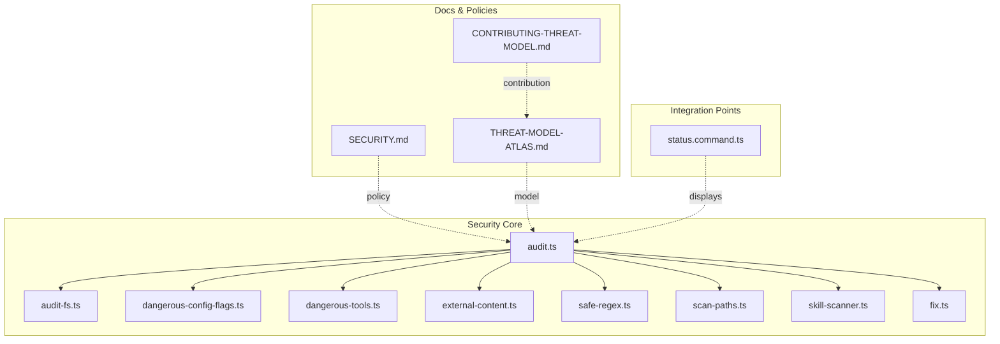

**Diagram sources**
- [audit.ts:1-1297](file://src/security/audit.ts#L1-1297)
- [audit-fs.ts:1-207](file://src/security/audit-fs.ts#L1-207)
- [dangerous-config-flags.ts:1-29](file://src/security/dangerous-config-flags.ts#L1-29)
- [dangerous-tools.ts:1-40](file://src/security/dangerous-tools.ts#L1-40)
- [external-content.ts:1-355](file://src/security/external-content.ts#L1-355)
- [safe-regex.ts:1-362](file://src/security/safe-regex.ts#L1-362)
- [scan-paths.ts:1-43](file://src/security/scan-paths.ts#L1-43)
- [skill-scanner.ts:1-584](file://src/security/skill-scanner.ts#L1-584)
- [fix.ts:1-478](file://src/security/fix.ts#L1-478)
- [SECURITY.md:1-293](file://SECURITY.md#L1-293)
- [THREAT-MODEL-ATLAS.md:1-604](file://docs/security/THREAT-MODEL-ATLAS.md#L1-604)
- [CONTRIBUTING-THREAT-MODEL.md:1-91](file://docs/security/CONTRIBUTING-THREAT-MODEL.md#L1-91)
- [status.command.ts:482-517](file://src/commands/status.command.ts#L482-517)

**Section sources**
- [audit.ts:1-1297](file://src/security/audit.ts#L1-1297)
- [SECURITY.md:1-293](file://SECURITY.md#L1-293)

## Core Components
- Security audit engine: central orchestrator that collects findings across configuration, filesystem, gateway exposure, channels, and skills.
- Filesystem permission inspector: validates state/config paths and generates remediation actions.
- Dangerous tools and flags: defines high-risk tool sets and flags that increase exposure.
- External content wrapper: safely wraps untrusted inputs with security notices and boundary markers.
- Regex safety checker: detects nested repetition and unsafe patterns in user-provided regex.
- Path scanning utilities: safe containment checks and directory traversal guards.
- Skill scanner: static analysis of skills for dangerous patterns and obfuscation.
- Remediation fixes: applies safe permission modes and policy flips to reduce risk.

**Section sources**
- [audit.ts:1-1297](file://src/security/audit.ts#L1-1297)
- [audit-fs.ts:1-207](file://src/security/audit-fs.ts#L1-207)
- [dangerous-tools.ts:1-40](file://src/security/dangerous-tools.ts#L1-40)
- [dangerous-config-flags.ts:1-29](file://src/security/dangerous-config-flags.ts#L1-29)
- [external-content.ts:1-355](file://src/security/external-content.ts#L1-355)
- [safe-regex.ts:1-362](file://src/security/safe-regex.ts#L1-362)
- [scan-paths.ts:1-43](file://src/security/scan-paths.ts#L1-43)
- [skill-scanner.ts:1-584](file://src/security/skill-scanner.ts#L1-584)
- [fix.ts:1-478](file://src/security/fix.ts#L1-478)

## Architecture Overview
OpenClaw’s layered security model:
- Trust model: one trusted operator per gateway; session keys are routing controls, not authorization boundaries.
- Boundaries: channel access, session isolation, execution sandbox, external content, supply chain (ClawHub).
- Enforcement: policy, approvals, sandboxing, SSRF protection, and boundary markers.
- Monitoring: security audit, status reporting, and remediation.

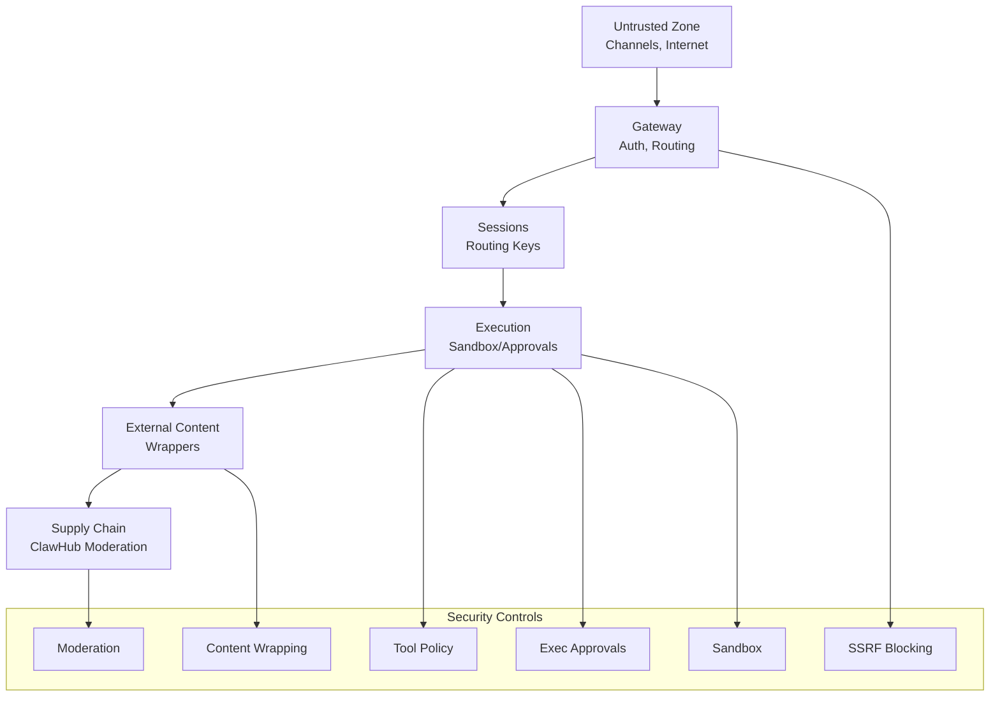

**Diagram sources**
- [THREAT-MODEL-ATLAS.md:56-123](file://docs/security/THREAT-MODEL-ATLAS.md#L56-123)
- [external-content.ts:247-274](file://src/security/external-content.ts#L247-274)
- [dangerous-tools.ts:9-20](file://src/security/dangerous-tools.ts#L9-20)

**Section sources**
- [THREAT-MODEL-ATLAS.md:56-123](file://docs/security/THREAT-MODEL-ATLAS.md#L56-123)
- [SECURITY.md:91-176](file://SECURITY.md#L91-176)

## Detailed Component Analysis

### Security Audit Engine
The audit engine aggregates findings across configuration, filesystem, gateway exposure, channels, and skills. It supports deep probing of gateway connectivity and caches code-safety summaries for performance.

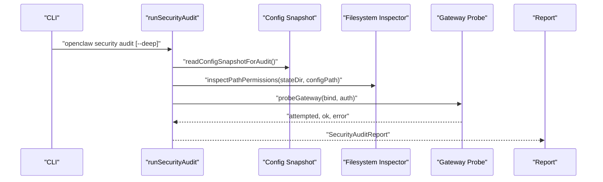

**Diagram sources**
- [audit.ts:1173-1179](file://src/security/audit.ts#L1173-1179)
- [audit.ts:1134-1171](file://src/security/audit.ts#L1134-1171)
- [audit.ts:75-88](file://src/security/audit.ts#L75-88)

Key behaviors:
- Collects filesystem permission findings and gateway exposure findings.
- Supports deep gateway probe with timeouts and optional auth.
- Aggregates findings into a structured report with severity counts.

**Section sources**
- [audit.ts:1173-1179](file://src/security/audit.ts#L1173-1179)
- [audit.ts:1134-1171](file://src/security/audit.ts#L1134-1171)
- [audit.ts:75-88](file://src/security/audit.ts#L75-88)

### Filesystem Permission Inspector
Validates state and config paths, detects world/group writability/readability, and formats remediation commands (chmod or Windows ACL reset).

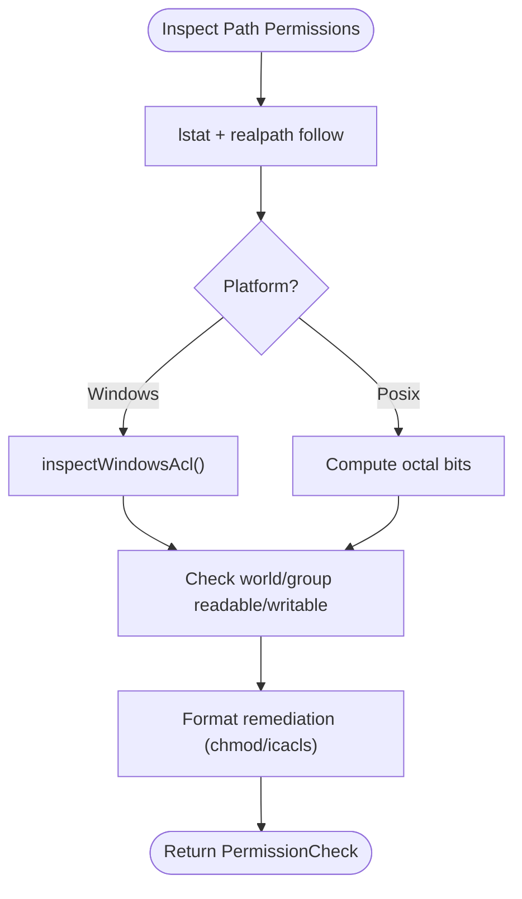

**Diagram sources**
- [audit-fs.ts:62-142](file://src/security/audit-fs.ts#L62-142)
- [audit-fs.ts:152-164](file://src/security/audit-fs.ts#L152-164)

Operational guidance:
- Remediation commands are generated for safe fixes.
- Symlinks are handled by dereferencing to target for permission checks.

**Section sources**
- [audit-fs.ts:62-142](file://src/security/audit-fs.ts#L62-142)
- [audit-fs.ts:152-164](file://src/security/audit-fs.ts#L152-164)

### Dangerous Tools and Flags
Defines high-risk tools and flags that increase exposure or bypass safeguards. These are enforced by gateway HTTP restrictions, security audits, and ACP prompts.

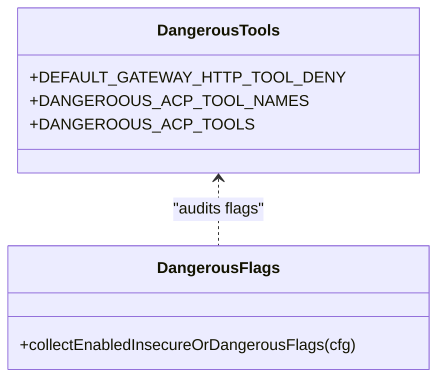

**Diagram sources**
- [dangerous-tools.ts:9-20](file://src/security/dangerous-tools.ts#L9-20)
- [dangerous-tools.ts:26-39](file://src/security/dangerous-tools.ts#L26-39)
- [dangerous-config-flags.ts:3-28](file://src/security/dangerous-config-flags.ts#L3-28)

**Section sources**
- [dangerous-tools.ts:1-40](file://src/security/dangerous-tools.ts#L1-40)
- [dangerous-config-flags.ts:1-29](file://src/security/dangerous-config-flags.ts#L1-29)

### External Content Wrapper
Safely wraps untrusted content with unique boundary markers, a security warning, and metadata. It detects suspicious patterns and sanitizes spoofed markers.

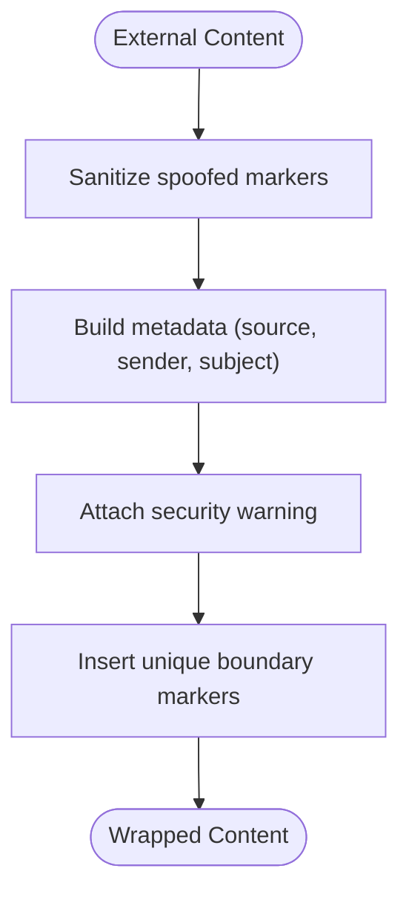

**Diagram sources**
- [external-content.ts:247-274](file://src/security/external-content.ts#L247-274)
- [external-content.ts:37-45](file://src/security/external-content.ts#L37-45)
- [external-content.ts:169-218](file://src/security/external-content.ts#L169-218)

**Section sources**
- [external-content.ts:1-355](file://src/security/external-content.ts#L1-355)

### Regex Safety Checker
Analyzes regex patterns to detect nested repetition and unsafe constructs, guarding against ReDoS and catastrophic backtracking.

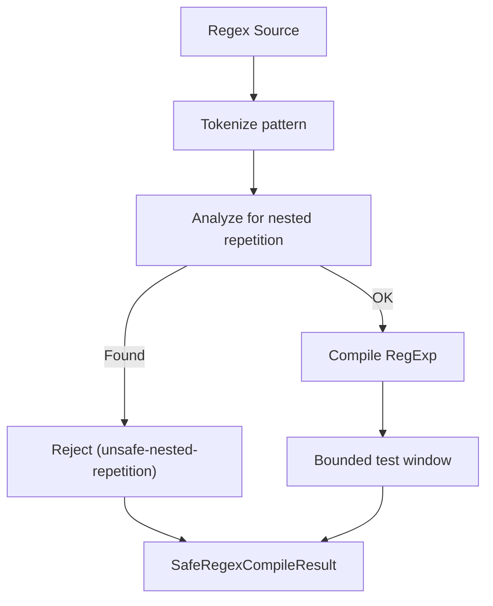

**Diagram sources**
- [safe-regex.ts:321-357](file://src/security/safe-regex.ts#L321-357)
- [safe-regex.ts:190-290](file://src/security/safe-regex.ts#L190-290)
- [safe-regex.ts:297-313](file://src/security/safe-regex.ts#L297-313)

**Section sources**
- [safe-regex.ts:1-362](file://src/security/safe-regex.ts#L1-362)

### Path Scanning Utilities
Provides safe containment checks and directory traversal guards to prevent escape from allowed roots.

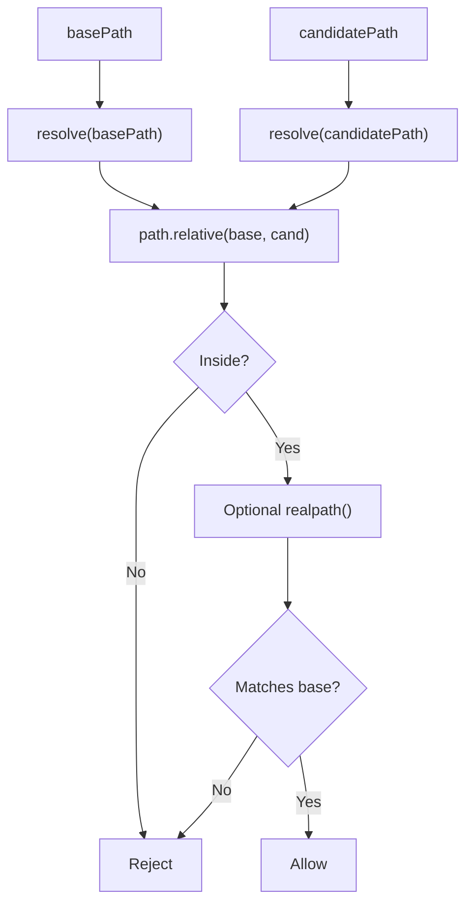

**Diagram sources**
- [scan-paths.ts:4-33](file://src/security/scan-paths.ts#L4-33)

**Section sources**
- [scan-paths.ts:1-43](file://src/security/scan-paths.ts#L1-43)

### Skill Scanner
Performs static analysis of skills to detect dangerous patterns (exec, dynamic code, mining, env harvesting) and obfuscation.

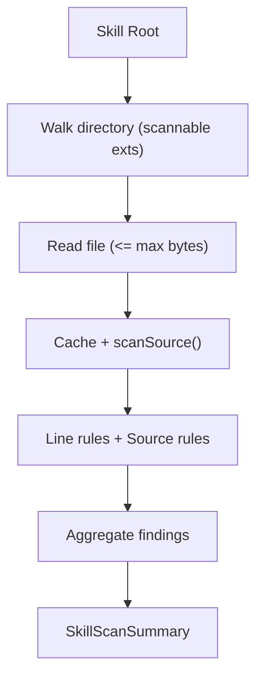

**Diagram sources**
- [skill-scanner.ts:521-541](file://src/security/skill-scanner.ts#L521-541)
- [skill-scanner.ts:218-309](file://src/security/skill-scanner.ts#L218-309)
- [skill-scanner.ts:323-353](file://src/security/skill-scanner.ts#L323-353)

**Section sources**
- [skill-scanner.ts:1-584](file://src/security/skill-scanner.ts#L1-584)

### Remediation Fixes
Automatically applies safe permission modes and policy flips to reduce risk, with platform-aware handling (chmod vs icacls).

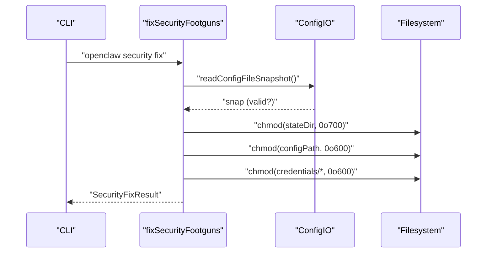

**Diagram sources**
- [fix.ts:387-477](file://src/security/fix.ts#L387-477)
- [fix.ts:403-437](file://src/security/fix.ts#L403-437)

**Section sources**
- [fix.ts:1-478](file://src/security/fix.ts#L1-478)

### Security Policy Configuration Examples
- Gateway exposure: keep bind loopback-only; configure auth; restrict Control UI allowed origins; avoid wildcard origins.
- Dangerous flags: disable allowInsecureAuth, host-header origin fallback, device auth disable; avoid unsafe hook flags.
- Tools: default deny high-risk tools over HTTP; require explicit approvals for mutating tools.
- Filesystem: enforce restrictive permissions on state/config and credentials.

Practical references:
- Gateway exposure and Control UI policies: [audit.ts:352-701](file://src/security/audit.ts#L352-701)
- Dangerous flags collection: [dangerous-config-flags.ts:3-28](file://src/security/dangerous-config-flags.ts#L3-28)
- HTTP tool deny list: [dangerous-tools.ts:9-20](file://src/security/dangerous-tools.ts#L9-20)
- Filesystem remediation: [audit-fs.ts:152-164](file://src/security/audit-fs.ts#L152-164), [fix.ts:444-445](file://src/security/fix.ts#L444-445)

**Section sources**
- [audit.ts:352-701](file://src/security/audit.ts#L352-701)
- [dangerous-config-flags.ts:1-29](file://src/security/dangerous-config-flags.ts#L1-29)
- [dangerous-tools.ts:1-40](file://src/security/dangerous-tools.ts#L1-40)
- [audit-fs.ts:152-164](file://src/security/audit-fs.ts#L152-164)
- [fix.ts:444-445](file://src/security/fix.ts#L444-445)

### Audit Trail Management and Monitoring
- Status command displays security audit summary and top findings.
- Security audit report includes severity counts and optional deep gateway probe results.

References:
- Status output formatting: [status.command.ts:482-517](file://src/commands/status.command.ts#L482-517)
- Audit report shape: [audit.ts:75-88](file://src/security/audit.ts#L75-88)

**Section sources**
- [status.command.ts:482-517](file://src/commands/status.command.ts#L482-517)
- [audit.ts:75-88](file://src/security/audit.ts#L75-88)

### Security Boundary Enforcement
- Gateway HTTP default deny for high-risk tools.
- Browser control requires gateway auth.
- Session isolation via routing keys; memory files are trusted operator state.
- Plugin trust boundary: in-process with same privileges as the gateway.
- Temp folder boundary: absolute temp paths allowed only under managed root.

References:
- HTTP tool deny list: [dangerous-tools.ts:9-20](file://src/security/dangerous-tools.ts#L9-20)
- Browser control auth: [audit.ts:732-806](file://src/security/audit.ts#L732-806)
- Workspace memory trust: [SECURITY.md:178-186](file://SECURITY.md#L178-186)
- Plugin trust: [SECURITY.md:187-194](file://SECURITY.md#L187-194)
- Temp folder boundary: [SECURITY.md:195-211](file://SECURITY.md#L195-211)

**Section sources**
- [dangerous-tools.ts:1-40](file://src/security/dangerous-tools.ts#L1-40)
- [audit.ts:732-806](file://src/security/audit.ts#L732-806)
- [SECURITY.md:178-194](file://SECURITY.md#L178-194)

## Dependency Analysis
Security components depend on configuration, gateway, channels, and filesystem. The audit engine orchestrates these dependencies and produces a unified report.

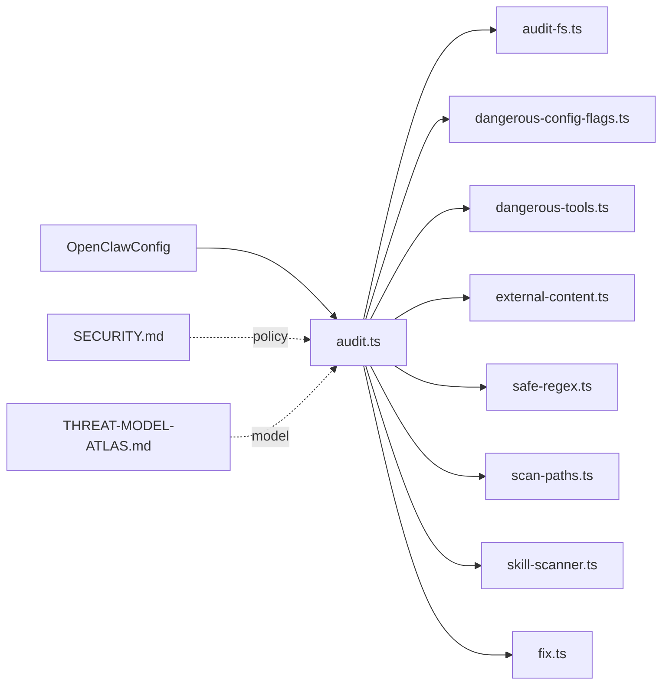

**Diagram sources**
- [audit.ts:1-1297](file://src/security/audit.ts#L1-1297)
- [audit-fs.ts:1-207](file://src/security/audit-fs.ts#L1-207)
- [dangerous-config-flags.ts:1-29](file://src/security/dangerous-config-flags.ts#L1-29)
- [dangerous-tools.ts:1-40](file://src/security/dangerous-tools.ts#L1-40)
- [external-content.ts:1-355](file://src/security/external-content.ts#L1-355)
- [safe-regex.ts:1-362](file://src/security/safe-regex.ts#L1-362)
- [scan-paths.ts:1-43](file://src/security/scan-paths.ts#L1-43)
- [skill-scanner.ts:1-584](file://src/security/skill-scanner.ts#L1-584)
- [fix.ts:1-478](file://src/security/fix.ts#L1-478)
- [SECURITY.md:1-293](file://SECURITY.md#L1-293)
- [THREAT-MODEL-ATLAS.md:1-604](file://docs/security/THREAT-MODEL-ATLAS.md#L1-604)

**Section sources**
- [audit.ts:1-1297](file://src/security/audit.ts#L1-1297)

## Performance Considerations
- Caching: file scan cache and directory entry cache limit I/O overhead in skill scanning.
- Bounded regex testing: limits test window to prevent ReDoS.
- Deep audit timeouts: configurable deep gateway probe timeout.
- Incremental fixes: targeted permission resets and minimal config changes.

[No sources needed since this section provides general guidance]

## Troubleshooting Guide
Common issues and resolutions:
- Gateway binds beyond loopback without auth: set token/password or bind loopback.
- Control UI allowed origins wildcard: replace with explicit origins.
- Dangerous flags enabled: disable flags or restrict exposure.
- World/group writable state/config: apply restrictive permissions.
- Browser control without auth: configure gateway auth token/password.
- Unsafe regex patterns: avoid nested repetition; use bounded patterns.

References:
- Gateway exposure findings: [audit.ts:442-450](file://src/security/audit.ts#L442-450), [audit.ts:495-506](file://src/security/audit.ts#L495-506)
- Dangerous flags: [dangerous-config-flags.ts:3-28](file://src/security/dangerous-config-flags.ts#L3-28)
- Filesystem remediation: [audit-fs.ts:152-164](file://src/security/audit-fs.ts#L152-164)
- Browser control auth: [audit.ts:775-786](file://src/security/audit.ts#L775-786)
- Regex safety: [safe-regex.ts:315-319](file://src/security/safe-regex.ts#L315-319)

**Section sources**
- [audit.ts:442-450](file://src/security/audit.ts#L442-450)
- [audit.ts:495-506](file://src/security/audit.ts#L495-506)
- [dangerous-config-flags.ts:1-29](file://src/security/dangerous-config-flags.ts#L1-29)
- [audit-fs.ts:152-164](file://src/security/audit-fs.ts#L152-164)
- [audit.ts:775-786](file://src/security/audit.ts#L775-786)
- [safe-regex.ts:315-319](file://src/security/safe-regex.ts#L315-319)

## Conclusion
OpenClaw’s security architecture enforces a strict trust model with layered controls: policy, approvals, sandboxing, SSRF protection, and boundary markers. The security audit framework continuously monitors configuration, filesystem, gateway exposure, channels, and skills, generating actionable findings and remediations. Threat modeling drives hardening decisions, while operational guidance ensures secure deployments. Together, these mechanisms maintain system integrity and reduce risk across the platform.

[No sources needed since this section summarizes without analyzing specific files]

## Appendices

### Security Architecture Patterns
- Boundary-based trust: clearly delineated trust zones with explicit controls.
- Defense-in-depth: multiple overlapping safeguards (policy, approvals, sandbox, SSRF).
- Least privilege: default off for dangerous features; explicit enablement with strict controls.
- Secure defaults: restrictive permissions, loopback binds, and minimal exposure.

[No sources needed since this section provides general guidance]

### Threat Modeling Approaches
- Use MITRE ATLAS to categorize threats and attack chains.
- Focus on initial access, execution, persistence, and impact vectors.
- Model supply chain risks for skills and ClawHub.
- Document residual risks and recommended mitigations.

References:
- ATLAS mapping and risk matrix: [THREAT-MODEL-ATLAS.md:485-527](file://docs/security/THREAT-MODEL-ATLAS.md#L485-527)
- Contribution guidelines: [CONTRIBUTING-THREAT-MODEL.md:1-91](file://docs/security/CONTRIBUTING-THREAT-MODEL.md#L1-91)

**Section sources**
- [THREAT-MODEL-ATLAS.md:485-527](file://docs/security/THREAT-MODEL-ATLAS.md#L485-527)
- [CONTRIBUTING-THREAT-MODEL.md:1-91](file://docs/security/CONTRIBUTING-THREAT-MODEL.md#L1-91)

### Security Compliance Considerations
- Operator trust model: one trusted operator per gateway; session keys are routing controls.
- Multi-tenant isolation: not modeled; use separate gateways per trust boundary.
- Secrets handling: avoid storing secrets in plaintext; rotate tokens.
- Public exposure: avoid binding to non-loopback without strict auth and controls.

References:
- Operator trust model: [SECURITY.md:91-107](file://SECURITY.md#L91-107)
- Multi-tenant note: [SECURITY.md:93-102](file://SECURITY.md#L93-102)
- Secrets guidance: [SECURITY.md:212-217](file://SECURITY.md#L212-217)

**Section sources**
- [SECURITY.md:91-107](file://SECURITY.md#L91-107)
- [SECURITY.md:93-102](file://SECURITY.md#L93-102)
- [SECURITY.md:212-217](file://SECURITY.md#L212-217)