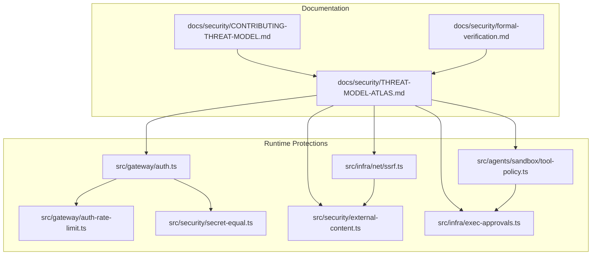
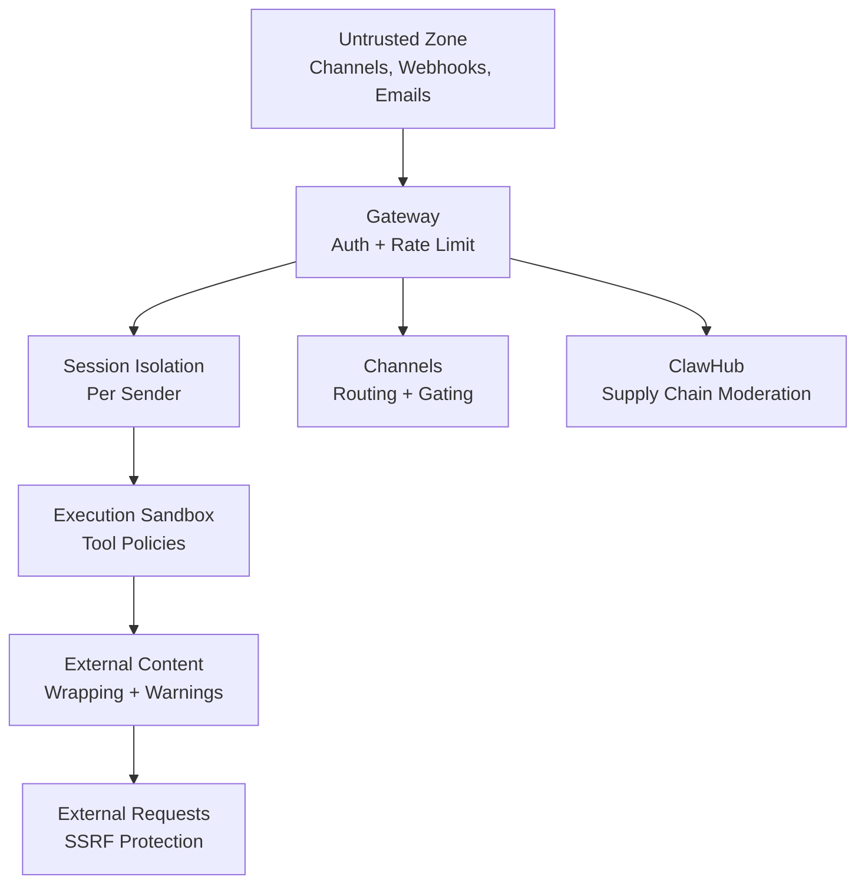
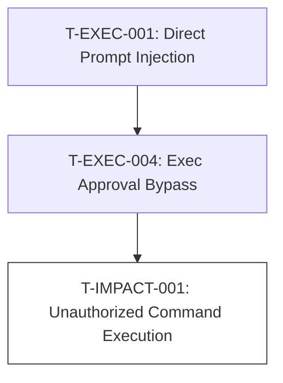
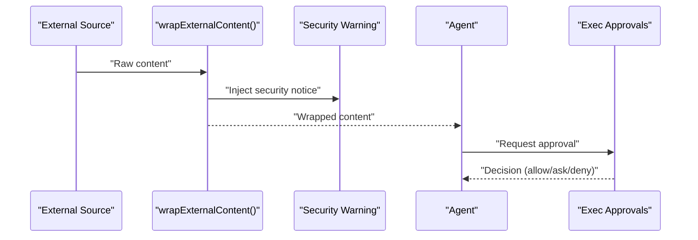
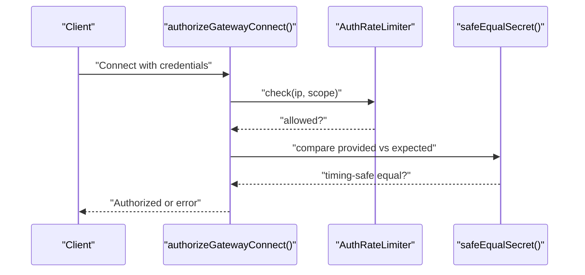
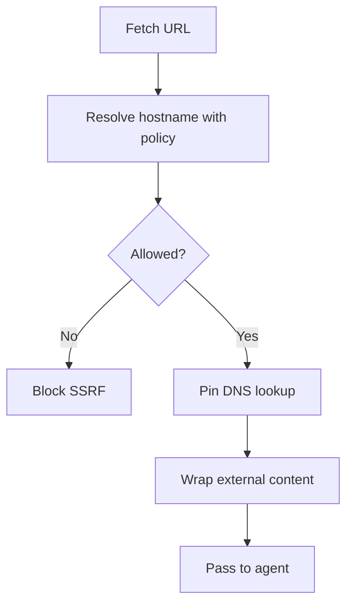
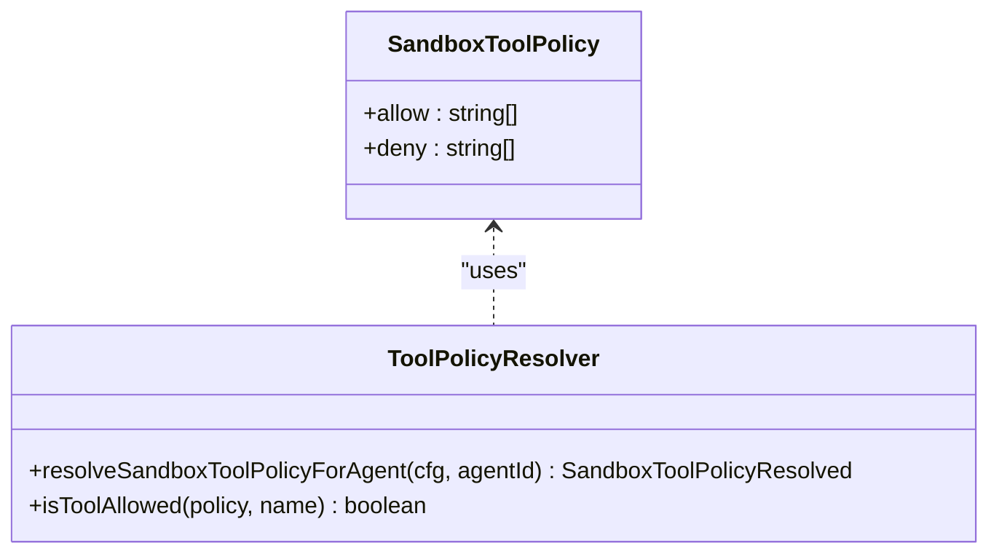
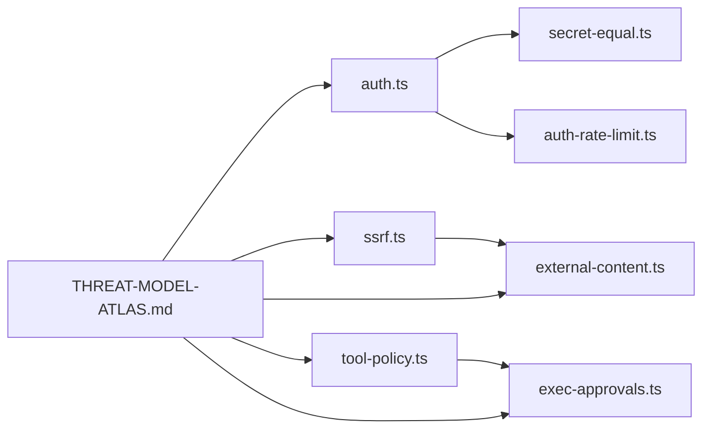

# Threat Modeling & Risk Assessment

<cite>
**Referenced Files in This Document**
- [CONTRIBUTING-THREAT-MODEL.md](file://docs/security/CONTRIBUTING-THREAT-MODEL.md)
- [THREAT-MODEL-ATLAS.md](file://docs/security/THREAT-MODEL-ATLAS.md)
- [SECURITY.md](file://SECURITY.md)
- [external-content.ts](file://src/security/external-content.ts)
- [exec-approvals.ts](file://src/infra/exec-approvals.ts)
- [auth.ts](file://src/gateway/auth.ts)
- [ssrf.ts](file://src/infra/net/ssrf.ts)
- [tool-policy.ts](file://src/agents/sandbox/tool-policy.ts)
- [secret-equal.ts](file://src/security/secret-equal.ts)
- [auth-rate-limit.ts](file://src/gateway/auth-rate-limit.ts)
- [formal-verification.md](file://docs/security/formal-verification.md)
</cite>

## Table of Contents
1. [Introduction](#introduction)
2. [Project Structure](#project-structure)
3. [Core Components](#core-components)
4. [Architecture Overview](#architecture-overview)
5. [Detailed Component Analysis](#detailed-component-analysis)
6. [Dependency Analysis](#dependency-analysis)
7. [Performance Considerations](#performance-considerations)
8. [Troubleshooting Guide](#troubleshooting-guide)
9. [Conclusion](#conclusion)
10. [Appendices](#appendices)

## Introduction
This document presents OpenClaw’s threat modeling and risk assessment framework. It explains how the project systematically identifies, analyzes, and mitigates security threats across its multi-platform system (CLI, gateway, channels, ClawHub, MCP servers, and agents). It documents the MITRE ATLAS-based threat atlas methodology, contribution guidelines, risk assessment processes, external content validation, mutable allowlist detection, and security vulnerability assessment. It also outlines practical threat modeling scenarios, risk mitigation strategies, incident response procedures, security testing methodologies, penetration testing approaches, and continuous security monitoring. Finally, it clarifies the integration between threat modeling and security architecture decisions.

## Project Structure
OpenClaw’s security posture is implemented across documentation, runtime protections, and policy enforcement modules:
- Documentation: MITRE ATLAS-based threat model and contribution guidelines
- Runtime protections: authentication, rate limiting, SSRF prevention, external content wrapping, and tool policy enforcement
- Policy enforcement: exec approvals and sandbox tool allowlists

**Diagram sources**
- [THREAT-MODEL-ATLAS.md:1-604](file://docs/security/THREAT-MODEL-ATLAS.md#L1-L604)
- [CONTRIBUTING-THREAT-MODEL.md:1-91](file://docs/security/CONTRIBUTING-THREAT-MODEL.md#L1-L91)
- [formal-verification.md:1-168](file://docs/security/formal-verification.md#L1-L168)
- [auth.ts:1-495](file://src/gateway/auth.ts#L1-L495)
- [auth-rate-limit.ts:1-233](file://src/gateway/auth-rate-limit.ts#L1-L233)
- [secret-equal.ts:1-13](file://src/security/secret-equal.ts#L1-L13)
- [ssrf.ts:1-406](file://src/infra/net/ssrf.ts#L1-L406)
- [external-content.ts:1-355](file://src/security/external-content.ts#L1-L355)
- [tool-policy.ts:1-110](file://src/agents/sandbox/tool-policy.ts#L1-L110)
- [exec-approvals.ts:1-590](file://src/infra/exec-approvals.ts#L1-L590)

**Section sources**
- [THREAT-MODEL-ATLAS.md:1-604](file://docs/security/THREAT-MODEL-ATLAS.md#L1-L604)
- [CONTRIBUTING-THREAT-MODEL.md:1-91](file://docs/security/CONTRIBUTING-THREAT-MODEL.md#L1-L91)
- [formal-verification.md:1-168](file://docs/security/formal-verification.md#L1-L168)

## Core Components
- MITRE ATLAS threat model and risk matrix define the structured approach to threat identification and prioritization.
- Contribution guidelines specify how to propose new threats, attack chains, mitigations, and improvements.
- Security policy governs vulnerability reporting, acceptance gates, false-positive patterns, and trust boundaries.
- Runtime protections include authentication, rate limiting, SSRF prevention, external content wrapping, and tool policy enforcement.
- Policy enforcement includes exec approvals and sandbox tool allowlists.

**Section sources**
- [THREAT-MODEL-ATLAS.md:1-604](file://docs/security/THREAT-MODEL-ATLAS.md#L1-L604)
- [CONTRIBUTING-THREAT-MODEL.md:1-91](file://docs/security/CONTRIBUTING-THREAT-MODEL.md#L1-L91)
- [SECURITY.md:1-293](file://SECURITY.md#L1-L293)

## Architecture Overview
OpenClaw’s trust boundaries and data flows are defined in the threat model. The system architecture integrates:
- Gateway authentication and rate limiting
- Session isolation per sender
- Execution sandbox and tool policy enforcement
- External content wrapping and SSRF protection
- ClawHub supply chain moderation and planned improvements

**Diagram sources**
- [THREAT-MODEL-ATLAS.md:56-135](file://docs/security/THREAT-MODEL-ATLAS.md#L56-L135)
- [auth.ts:1-495](file://src/gateway/auth.ts#L1-L495)
- [auth-rate-limit.ts:1-233](file://src/gateway/auth-rate-limit.ts#L1-L233)
- [external-content.ts:1-355](file://src/security/external-content.ts#L1-L355)
- [ssrf.ts:1-406](file://src/infra/net/ssrf.ts#L1-L406)
- [tool-policy.ts:1-110](file://src/agents/sandbox/tool-policy.ts#L1-L110)

## Detailed Component Analysis

### MITRE ATLAS Threat Atlas and Risk Assessment
- The threat model uses MITRE ATLAS tactics to categorize adversarial threats (Reconnaissance, Initial Access, Execution, Persistence, Evasion, Discovery, Collection/Exfiltration, Impact).
- Each threat is mapped to ATLAS techniques and assigned a risk level (Critical, High, Medium, Low) based on likelihood and impact.
- The risk matrix prioritizes threats for remediation (P0–P2), and critical attack chains illustrate combinations of threats leading to severe outcomes.

Practical example: Prompt injection to RCE via exec approval bypass and sandbox escape.

**Diagram sources**
- [THREAT-MODEL-ATLAS.md:485-527](file://docs/security/THREAT-MODEL-ATLAS.md#L485-L527)

**Section sources**
- [THREAT-MODEL-ATLAS.md:138-527](file://docs/security/THREAT-MODEL-ATLAS.md#L138-L527)

### Contribution Guidelines for Threat Modeling
- Contributors can propose new threats, suggest mitigations, propose attack chains, or improve existing content.
- The process includes triage, assessment, documentation, and merge.
- MITRE ATLAS is used for categorization; maintainers assign IDs and risk levels.

Practical example: Adding a new threat for channel integration probing and recommending response timing randomization.

**Section sources**
- [CONTRIBUTING-THREAT-MODEL.md:5-91](file://docs/security/CONTRIBUTING-THREAT-MODEL.md#L5-L91)

### Security Vulnerability Assessment and Reporting
- Vulnerability reporting follows a strict security policy with required fields and acceptance gates.
- False-positive patterns are documented to streamline triage.
- Trust boundaries clarify when features are intentionally trusted-operator surfaces versus exploitable vulnerabilities.

Practical example: Reporting a potential SSRF in web_fetch requires demonstrating boundary bypass and providing reproducible evidence.

**Section sources**
- [SECURITY.md:5-70](file://SECURITY.md#L5-L70)
- [SECURITY.md:116-136](file://SECURITY.md#L116-L136)

### External Content Validation and Mutable Allowlist Detection
- External content wrapping ensures untrusted inputs are handled securely, with warnings and boundary markers.
- Mutable allowlist detection is integrated into exec approvals to track and validate command usage.

**Diagram sources**
- [external-content.ts:247-354](file://src/security/external-content.ts#L247-L354)
- [exec-approvals.ts:484-590](file://src/infra/exec-approvals.ts#L484-L590)

**Section sources**
- [external-content.ts:1-355](file://src/security/external-content.ts#L1-L355)
- [exec-approvals.ts:1-590](file://src/infra/exec-approvals.ts#L1-L590)

### Authentication, Rate Limiting, and Secret Comparison
- Authentication supports token, password, trusted-proxy, and Tailscale modes with configurable scopes.
- Rate limiting protects against brute force with sliding windows and lockouts.
- Timing-safe secret comparison prevents timing attacks.

**Diagram sources**
- [auth.ts:369-495](file://src/gateway/auth.ts#L369-L495)
- [auth-rate-limit.ts:95-233](file://src/gateway/auth-rate-limit.ts#L95-L233)
- [secret-equal.ts:1-13](file://src/security/secret-equal.ts#L1-L13)

**Section sources**
- [auth.ts:1-495](file://src/gateway/auth.ts#L1-L495)
- [auth-rate-limit.ts:1-233](file://src/gateway/auth-rate-limit.ts#L1-L233)
- [secret-equal.ts:1-13](file://src/security/secret-equal.ts#L1-L13)

### SSRF Protection and External Content Wrapping
- SSRF protection validates hostnames and IP addresses, pins DNS lookups, and rejects private/internal/special-use targets.
- External content wrapping sanitizes markers, injects warnings, and adds metadata for safe processing.

**Diagram sources**
- [ssrf.ts:292-406](file://src/infra/net/ssrf.ts#L292-L406)
- [external-content.ts:247-354](file://src/security/external-content.ts#L247-L354)

**Section sources**
- [ssrf.ts:1-406](file://src/infra/net/ssrf.ts#L1-L406)
- [external-content.ts:1-355](file://src/security/external-content.ts#L1-L355)

### Tool Policy Enforcement and Sandbox Controls
- Tool policy resolves allow/deny lists per agent or globally, with defaults and group expansions.
- Essential tools like image are included unless explicitly denied.

**Diagram sources**
- [tool-policy.ts:16-110](file://src/agents/sandbox/tool-policy.ts#L16-L110)

**Section sources**
- [tool-policy.ts:1-110](file://src/agents/sandbox/tool-policy.ts#L1-L110)

### Formal Verification and Security Models
- Formal verification provides machine-checked models for critical claims (e.g., gateway exposure, nodes pipeline, pairing store).
- These models act as a security regression suite and inform risk assessments.

**Section sources**
- [formal-verification.md:1-168](file://docs/security/formal-verification.md#L1-L168)

## Dependency Analysis
The following diagram shows key dependencies among security-critical modules:

**Diagram sources**
- [auth.ts:1-495](file://src/gateway/auth.ts#L1-L495)
- [secret-equal.ts:1-13](file://src/security/secret-equal.ts#L1-L13)
- [auth-rate-limit.ts:1-233](file://src/gateway/auth-rate-limit.ts#L1-L233)
- [ssrf.ts:1-406](file://src/infra/net/ssrf.ts#L1-L406)
- [external-content.ts:1-355](file://src/security/external-content.ts#L1-L355)
- [tool-policy.ts:1-110](file://src/agents/sandbox/tool-policy.ts#L1-L110)
- [exec-approvals.ts:1-590](file://src/infra/exec-approvals.ts#L1-L590)
- [THREAT-MODEL-ATLAS.md:1-604](file://docs/security/THREAT-MODEL-ATLAS.md#L1-L604)

**Section sources**
- [THREAT-MODEL-ATLAS.md:1-604](file://docs/security/THREAT-MODEL-ATLAS.md#L1-L604)
- [auth.ts:1-495](file://src/gateway/auth.ts#L1-L495)
- [ssrf.ts:1-406](file://src/infra/net/ssrf.ts#L1-L406)
- [external-content.ts:1-355](file://src/security/external-content.ts#L1-L355)
- [tool-policy.ts:1-110](file://src/agents/sandbox/tool-policy.ts#L1-L110)
- [exec-approvals.ts:1-590](file://src/infra/exec-approvals.ts#L1-L590)

## Performance Considerations
- Authentication rate limiting uses in-memory sliding windows; ensure appropriate maxAttempts and windowMs for deployment scale.
- External content wrapping and SSRF checks add latency; tune DNS pinning and hostname allowlists to balance security and performance.
- Exec approvals introduce interactive prompts; optimize UX while preserving security (ask modes and timeouts).

[No sources needed since this section provides general guidance]

## Troubleshooting Guide
Common operational issues and mitigations:
- Authentication failures due to incorrect credentials or missing tokens/passwords
- Rate limiting lockouts for repeated failed attempts
- SSRF blocked due to private/internal/special-use addresses or hostname not in allowlist
- External content markers spoofed or escaped; rely on sanitization and warnings
- Tool policy denies essential tools; adjust allow/deny lists per agent or globally

**Section sources**
- [auth.ts:285-320](file://src/gateway/auth.ts#L285-L320)
- [auth-rate-limit.ts:141-172](file://src/gateway/auth-rate-limit.ts#L141-L172)
- [ssrf.ts:166-193](file://src/infra/net/ssrf.ts#L166-L193)
- [external-content.ts:169-218](file://src/security/external-content.ts#L169-L218)
- [tool-policy.ts:35-110](file://src/agents/sandbox/tool-policy.ts#L35-L110)

## Conclusion
OpenClaw’s threat modeling and risk assessment framework integrates MITRE ATLAS methodology, contributor-driven updates, and robust runtime protections. By combining structured threat identification, precise risk scoring, and layered defenses (authentication, rate limiting, SSRF protection, external content wrapping, tool policy enforcement, and exec approvals), the project maintains a strong security posture across platforms. Formal verification further strengthens confidence in critical claims, while clear contribution and reporting processes ensure continuous improvement.

[No sources needed since this section summarizes without analyzing specific files]

## Appendices

### Practical Threat Modeling Scenarios and Mitigations
- Scenario: Prompt injection via channel messages
  - Mitigation: Multi-layer defense, output validation, and user confirmation for sensitive actions
- Scenario: SSRF through web_fetch
  - Mitigation: Hostname allowlists, DNS pinning, and rejection of private/internal IPs
- Scenario: Exec approval bypass
  - Mitigation: Argument validation, parameterized tool calls, and improved approval UX

**Section sources**
- [THREAT-MODEL-ATLAS.md:485-527](file://docs/security/THREAT-MODEL-ATLAS.md#L485-L527)
- [ssrf.ts:292-406](file://src/infra/net/ssrf.ts#L292-L406)
- [exec-approvals.ts:484-590](file://src/infra/exec-approvals.ts#L484-L590)

### Security Testing Methodologies and Penetration Testing
- Use formal verification models to validate critical claims and negative models to uncover regressions.
- PenTest approach: focus on boundary bypasses (auth, policy, sandbox, approvals) and validate mitigations for prompt injection, SSRF, and tool misuse.

**Section sources**
- [formal-verification.md:56-168](file://docs/security/formal-verification.md#L56-L168)

### Continuous Security Monitoring
- Monitor authentication attempts, rate-limit triggers, and external content patterns.
- Track exec approval decisions and tool policy violations.
- Integrate security audits and deep checks for gateway exposure and other high-risk paths.

**Section sources**
- [auth-rate-limit.ts:95-233](file://src/gateway/auth-rate-limit.ts#L95-L233)
- [external-content.ts:17-45](file://src/security/external-content.ts#L17-L45)
- [exec-approvals.ts:484-590](file://src/infra/exec-approvals.ts#L484-L590)