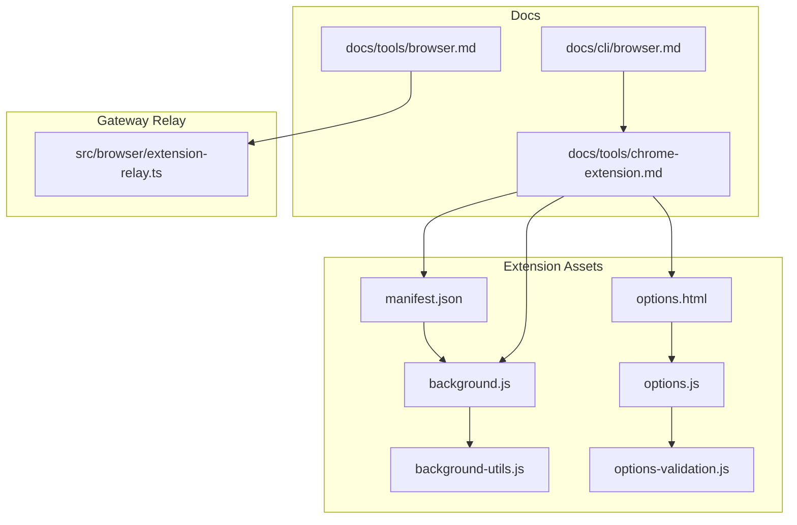
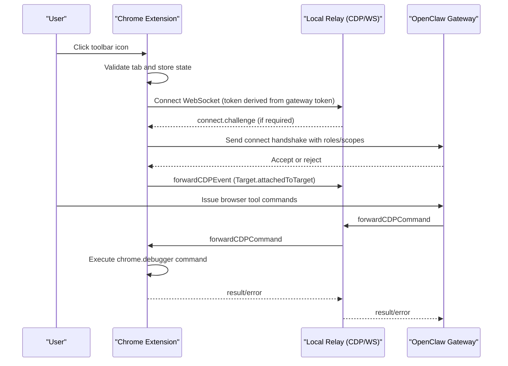
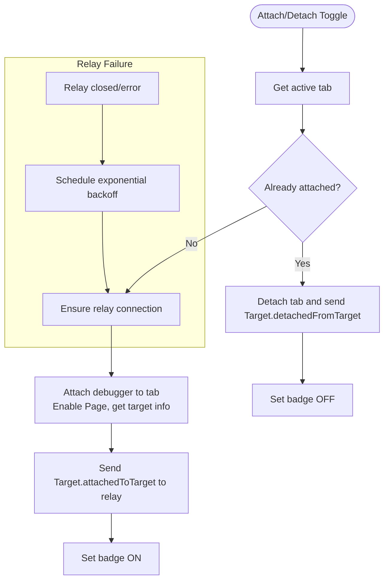
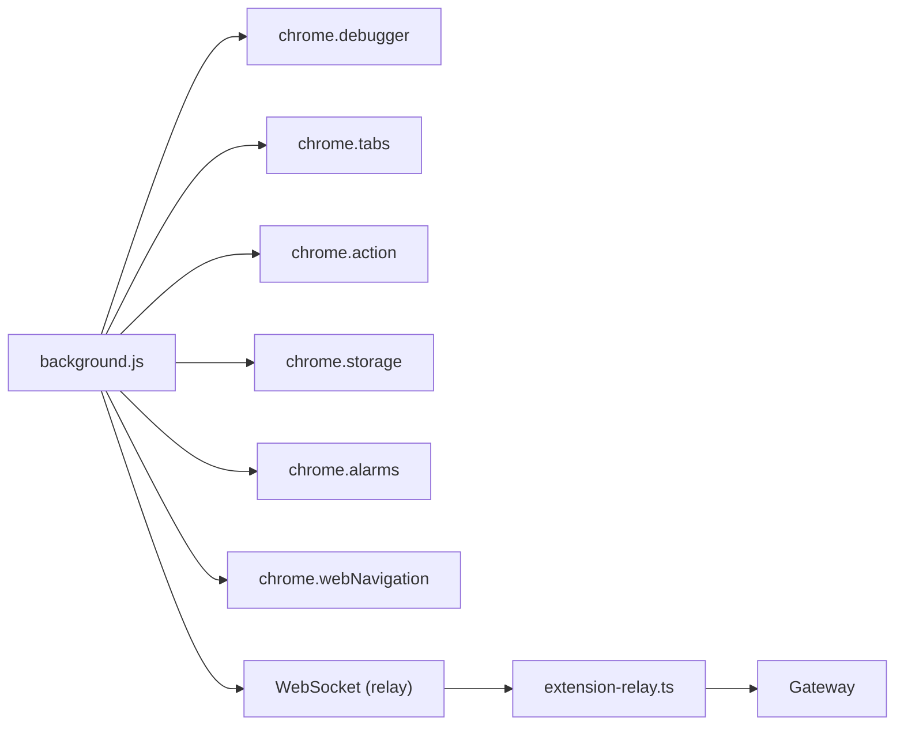

# Browser Extension

<cite>
**Referenced Files in This Document**
- [assets/chrome-extension/README.md](file://assets/chrome-extension/README.md)
- [assets/chrome-extension/manifest.json](file://assets/chrome-extension/manifest.json)
- [assets/chrome-extension/background.js](file://assets/chrome-extension/background.js)
- [assets/chrome-extension/background-utils.js](file://assets/chrome-extension/background-utils.js)
- [assets/chrome-extension/options.html](file://assets/chrome-extension/options.html)
- [assets/chrome-extension/options.js](file://assets/chrome-extension/options.js)
- [assets/chrome-extension/options-validation.js](file://assets/chrome-extension/options-validation.js)
- [docs/tools/chrome-extension.md](file://docs/tools/chrome-extension.md)
- [docs/tools/browser.md](file://docs/tools/browser.md)
- [docs/cli/browser.md](file://docs/cli/browser.md)
- [src/browser/extension-relay.ts](file://src/browser/extension-relay.ts)
- [src/browser/extension-relay.test.ts](file://src/browser/extension-relay.test.ts)
</cite>

## Table of Contents
1. [Introduction](#introduction)
2. [Project Structure](#project-structure)
3. [Core Components](#core-components)
4. [Architecture Overview](#architecture-overview)
5. [Detailed Component Analysis](#detailed-component-analysis)
6. [Dependency Analysis](#dependency-analysis)
7. [Performance Considerations](#performance-considerations)
8. [Troubleshooting Guide](#troubleshooting-guide)
9. [Conclusion](#conclusion)
10. [Appendices](#appendices)

## Introduction
This document explains the OpenClaw Chrome extension that enables browser automation by attaching to an existing Chrome tab and forwarding Chrome DevTools Protocol (CDP) messages through a local relay server to the OpenClaw Gateway. It covers installation, configuration, usage, security, permissions, privacy, troubleshooting, and development notes. It also describes how the extension integrates with the broader browser control ecosystem, including profiles, remote node hosting, and sandboxing considerations.

## Project Structure
The Chrome extension is distributed as static assets within the repository and loaded as an unpacked extension in Chrome. The key files include:
- Manifest defining permissions, host permissions, background script, action icon, and options UI
- Background script implementing connection orchestration, CDP event forwarding, and tab attach/detach
- Options page and script for configuring relay port and gateway token, plus reachability validation
- Utilities for token derivation and exponential backoff
- Documentation guiding installation, usage, security, and troubleshooting

**Diagram sources**
- [assets/chrome-extension/manifest.json](file://assets/chrome-extension/manifest.json#L1-L26)
- [assets/chrome-extension/background.js](file://assets/chrome-extension/background.js#L1-L120)
- [assets/chrome-extension/options.html](file://assets/chrome-extension/options.html#L1-L201)
- [assets/chrome-extension/options.js](file://assets/chrome-extension/options.js#L1-L75)
- [assets/chrome-extension/background-utils.js](file://assets/chrome-extension/background-utils.js#L1-L65)
- [assets/chrome-extension/options-validation.js](file://assets/chrome-extension/options-validation.js#L1-L58)
- [docs/tools/chrome-extension.md](file://docs/tools/chrome-extension.md#L1-L197)
- [docs/tools/browser.md](file://docs/tools/browser.md#L1-L674)
- [docs/cli/browser.md](file://docs/cli/browser.md#L1-L108)
- [src/browser/extension-relay.ts](file://src/browser/extension-relay.ts#L114-L264)

**Section sources**
- [assets/chrome-extension/README.md](file://assets/chrome-extension/README.md#L1-L24)
- [assets/chrome-extension/manifest.json](file://assets/chrome-extension/manifest.json#L1-L26)
- [assets/chrome-extension/background.js](file://assets/chrome-extension/background.js#L1-L120)
- [assets/chrome-extension/options.html](file://assets/chrome-extension/options.html#L1-L201)
- [assets/chrome-extension/options.js](file://assets/chrome-extension/options.js#L1-L75)
- [assets/chrome-extension/background-utils.js](file://assets/chrome-extension/background-utils.js#L1-L65)
- [assets/chrome-extension/options-validation.js](file://assets/chrome-extension/options-validation.js#L1-L58)
- [docs/tools/chrome-extension.md](file://docs/tools/chrome-extension.md#L1-L197)
- [docs/tools/browser.md](file://docs/tools/browser.md#L1-L674)
- [docs/cli/browser.md](file://docs/cli/browser.md#L1-L108)
- [src/browser/extension-relay.ts](file://src/browser/extension-relay.ts#L114-L264)

## Core Components
- Manifest and permissions: declares debugger, tabs, activeTab, storage, alarms, webNavigation, and host permissions for loopback relay endpoints
- Background script: manages relay WebSocket connection, tab attach/detach, badge indicators, reconnection with exponential backoff, and CDP command/event forwarding
- Options page and script: stores relay port and gateway token, validates reachability and authentication, and displays status
- Utilities: derives relay token from gateway token and port, builds relay WebSocket URL, and computes reconnect delays
- Gateway relay server: validates loopback-only access, extension-origin, and gateway token for both /cdp and /extension endpoints

Key behaviors:
- One-click attach/detach via toolbar icon; badge indicates ON, connecting, or error
- Automatic reconnection on relay disconnect with exponential backoff
- Forwarding of CDP events and selective command handling (e.g., Runtime.enable, Target.createTarget, Target.closeTarget, Target.activateTarget)
- Validation of last remaining tab to avoid closing the last tab

**Section sources**
- [assets/chrome-extension/manifest.json](file://assets/chrome-extension/manifest.json#L12-L25)
- [assets/chrome-extension/background.js](file://assets/chrome-extension/background.js#L106-L164)
- [assets/chrome-extension/background.js](file://assets/chrome-extension/background.js#L166-L283)
- [assets/chrome-extension/background.js](file://assets/chrome-extension/background.js#L364-L493)
- [assets/chrome-extension/background.js](file://assets/chrome-extension/background.js#L510-L660)
- [assets/chrome-extension/background.js](file://assets/chrome-extension/background.js#L662-L741)
- [assets/chrome-extension/background.js](file://assets/chrome-extension/background.js#L743-L805)
- [assets/chrome-extension/background-utils.js](file://assets/chrome-extension/background-utils.js#L1-L65)
- [assets/chrome-extension/options.html](file://assets/chrome-extension/options.html#L167-L195)
- [assets/chrome-extension/options.js](file://assets/chrome-extension/options.js#L26-L71)
- [assets/chrome-extension/options-validation.js](file://assets/chrome-extension/options-validation.js#L7-L58)
- [src/browser/extension-relay.ts](file://src/browser/extension-relay.ts#L217-L264)
- [src/browser/extension-relay.ts](file://src/browser/extension-relay.ts#L688-L707)

## Architecture Overview
The extension acts as a thin bridge between Chrome’s debugger API and the OpenClaw Gateway via a local relay server. The flow:
- User clicks the extension icon to attach to the active tab
- Extension establishes a WebSocket to the local relay using a derived token
- Extension forwards CDP events from the tab to the relay
- Gateway receives events and can send commands back to the extension via the relay
- Extension executes requested CDP commands and returns results

**Diagram sources**
- [assets/chrome-extension/background.js](file://assets/chrome-extension/background.js#L166-L227)
- [assets/chrome-extension/background.js](file://assets/chrome-extension/background.js#L372-L397)
- [assets/chrome-extension/background.js](file://assets/chrome-extension/background.js#L431-L493)
- [assets/chrome-extension/background.js](file://assets/chrome-extension/background.js#L662-L741)
- [src/browser/extension-relay.ts](file://src/browser/extension-relay.ts#L688-L707)

## Detailed Component Analysis

### Manifest and Permissions
- Permissions: debugger, tabs, activeTab, storage, alarms, webNavigation
- Host permissions: loopback for relay server
- Action: toolbar icon and badge; options UI page
- Service worker: background module

Security implications:
- Loopback-only host permissions reduce exposure surface
- Origin enforcement on relay upgrades restricts access to extension origins

**Section sources**
- [assets/chrome-extension/manifest.json](file://assets/chrome-extension/manifest.json#L12-L25)

### Background Script: Connection, Reconnection, and CDP Bridge
Responsibilities:
- Persist and rehydrate attached tab state across service worker restarts
- Establish and maintain a WebSocket to the relay with token-based auth
- Handle connect challenges, timeouts, and errors
- Exponentially back off reconnect attempts
- Forward CDP events and handle selected commands (Runtime.enable, Target.*)
- Manage attach/detach lifecycle and badge updates
- Validate tabs post-navigation and during detach cycles

**Diagram sources**
- [assets/chrome-extension/background.js](file://assets/chrome-extension/background.js#L510-L660)
- [assets/chrome-extension/background.js](file://assets/chrome-extension/background.js#L166-L283)
- [assets/chrome-extension/background.js](file://assets/chrome-extension/background.js#L294-L362)

**Section sources**
- [assets/chrome-extension/background.js](file://assets/chrome-extension/background.js#L113-L164)
- [assets/chrome-extension/background.js](file://assets/chrome-extension/background.js#L166-L283)
- [assets/chrome-extension/background.js](file://assets/chrome-extension/background.js#L294-L362)
- [assets/chrome-extension/background.js](file://assets/chrome-extension/background.js#L510-L660)
- [assets/chrome-extension/background.js](file://assets/chrome-extension/background.js#L662-L741)
- [assets/chrome-extension/background.js](file://assets/chrome-extension/background.js#L743-L805)

### Options Page and Validation
- Stores relay port and gateway token in extension storage
- Validates relay reachability and authentication via background messaging
- Provides user feedback with status kinds (ok/error) and guidance

Validation logic:
- Checks HTTP status and content-type for /json/version
- Ensures CDP version shape is present
- Guides correcting wrong port or missing token

**Section sources**
- [assets/chrome-extension/options.html](file://assets/chrome-extension/options.html#L167-L195)
- [assets/chrome-extension/options.js](file://assets/chrome-extension/options.js#L26-L71)
- [assets/chrome-extension/options-validation.js](file://assets/chrome-extension/options-validation.js#L7-L58)

### Utilities: Token Derivation and Backoff
- Derives a relay token using HMAC-SHA256 keyed by gateway token and a fixed string including the port
- Builds the relay WebSocket URL with the derived token
- Computes exponential backoff with jitter for reconnect attempts

**Section sources**
- [assets/chrome-extension/background-utils.js](file://assets/chrome-extension/background-utils.js#L14-L40)
- [assets/chrome-extension/background-utils.js](file://assets/chrome-extension/background-utils.js#L1-L12)

### Gateway Relay Server: Access Controls and Auth
- Enforces loopback-only binding unless explicitly configured otherwise
- Restricts WebSocket upgrades to chrome-extension origin
- Validates relay auth tokens derived from gateway tokens and ports
- Supports extension and CDP WebSocket servers co-located behind the same base URL

**Section sources**
- [src/browser/extension-relay.ts](file://src/browser/extension-relay.ts#L114-L122)
- [src/browser/extension-relay.ts](file://src/browser/extension-relay.ts#L217-L264)
- [src/browser/extension-relay.ts](file://src/browser/extension-relay.ts#L688-L707)

### Browser Tool Integration and Profiles
- The extension is used with the built-in “chrome” profile that targets the local relay
- Users can create custom profiles pointing to the relay URL
- Remote node hosting allows the Gateway to proxy browser actions to a node host on the same machine as Chrome
- Sandboxed sessions may require explicit allowance for host control

**Section sources**
- [docs/tools/browser.md](file://docs/tools/browser.md#L277-L332)
- [docs/cli/browser.md](file://docs/cli/browser.md#L86-L108)
- [docs/tools/chrome-extension.md](file://docs/tools/chrome-extension.md#L56-L91)

## Dependency Analysis
The extension depends on:
- Chrome extension APIs: debugger, tabs, action, storage, alarms, webNavigation
- Local relay server for CDP bridging
- Gateway for authentication and routing

**Diagram sources**
- [assets/chrome-extension/background.js](file://assets/chrome-extension/background.js#L1-L120)
- [src/browser/extension-relay.ts](file://src/browser/extension-relay.ts#L114-L122)

**Section sources**
- [assets/chrome-extension/manifest.json](file://assets/chrome-extension/manifest.json#L12-L25)
- [assets/chrome-extension/background.js](file://assets/chrome-extension/background.js#L1-L120)
- [src/browser/extension-relay.ts](file://src/browser/extension-relay.ts#L114-L122)

## Performance Considerations
- Badge and state persistence minimize redundant attach/detach operations
- Exponential backoff reduces CPU/network load during repeated reconnect attempts
- Event batching occurs implicitly through CDP event forwarding; avoid excessive polling
- Prefer targeted tab operations to limit unnecessary debugger overhead

## Troubleshooting Guide
Common symptoms and resolutions:
- Red badge (!): relay not reachable or token rejected
  - Verify Gateway is running locally or a node host is available remotely
  - Open extension Options to validate relay reachability and token
- “No attached tab for method” errors
  - Ensure a tab is attached before issuing commands
  - Confirm the extension icon shows ON
- Closing the last tab
  - The extension refuses to close the last tab to avoid killing the browser process
- Wrong port or relay confusion
  - Extension relay port equals Gateway port + 3
  - The Options page validates the endpoint and suggests corrections
- Remote access and security
  - Keep relay loopback-only by default; only bind to non-loopback when necessary (e.g., WSL2)
  - Use Tailscale and node pairing; avoid exposing relay ports publicly

Operational checks:
- Use the built-in “chrome” profile or create a custom profile pointing to the relay
- For sandboxed sessions, allow host control or target host explicitly
- Review Gateway and node host status and logs

**Section sources**
- [docs/tools/chrome-extension.md](file://docs/tools/chrome-extension.md#L105-L115)
- [docs/tools/chrome-extension.md](file://docs/tools/chrome-extension.md#L160-L165)
- [assets/chrome-extension/background.js](file://assets/chrome-extension/background.js#L709-L718)
- [assets/chrome-extension/options-validation.js](file://assets/chrome-extension/options-validation.js#L24-L41)
- [docs/tools/browser.md](file://docs/tools/browser.md#L292-L299)
- [docs/tools/browser.md](file://docs/tools/browser.md#L333-L343)

## Conclusion
The OpenClaw Chrome extension provides a secure, loopback-focused bridge between Chrome and the OpenClaw Gateway via a local relay. With careful configuration of the relay port and gateway token, users can attach to specific tabs, control them remotely, and integrate with automated workflows. Robust validation, reconnection, and safety guards help ensure reliability and prevent destructive operations.

## Appendices

### Installation and Setup
- Install extension files to a stable path and load as an unpacked extension
- Pin the extension icon for quick access
- Configure relay port and gateway token in Options
- Use the “chrome” profile or create a custom profile targeting the relay

**Section sources**
- [assets/chrome-extension/README.md](file://assets/chrome-extension/README.md#L5-L18)
- [docs/tools/chrome-extension.md](file://docs/tools/chrome-extension.md#L26-L55)
- [docs/cli/browser.md](file://docs/cli/browser.md#L90-L99)

### Usage Patterns
- Attach/detach via toolbar icon; badge indicates state
- Issue browser tool commands through the Gateway; the extension executes CDP commands on the attached tab
- Switch between tabs by attaching to the desired tab

**Section sources**
- [docs/tools/chrome-extension.md](file://docs/tools/chrome-extension.md#L92-L104)
- [docs/tools/browser.md](file://docs/tools/browser.md#L277-L332)

### Security and Privacy
- Treat extension-based control like giving the model “hands on your browser”
- Prefer a dedicated Chrome profile for extension usage
- Keep Gateway and node hosts on private networks; avoid exposing relay ports
- The relay enforces loopback-only access and extension-origin constraints

**Section sources**
- [docs/tools/chrome-extension.md](file://docs/tools/chrome-extension.md#L174-L191)

### Development and Customization
- Extension assets ship with releases; updates require reinstalling and reloading the extension
- The extension communicates with a local relay server; ensure the relay is reachable and properly authenticated
- For cross-namespace setups (e.g., WSL2), configure relay bind host appropriately

**Section sources**
- [docs/tools/chrome-extension.md](file://docs/tools/chrome-extension.md#L47-L55)
- [docs/tools/browser.md](file://docs/tools/browser.md#L333-L343)