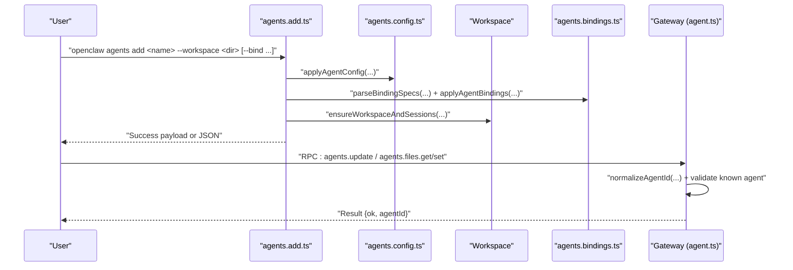
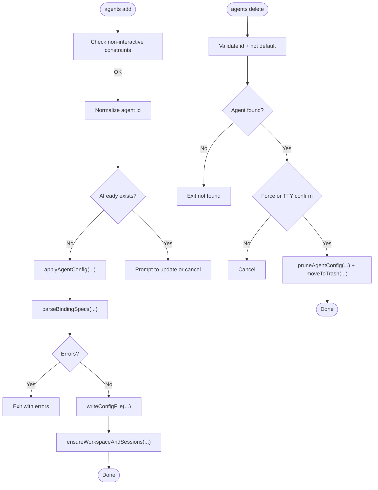
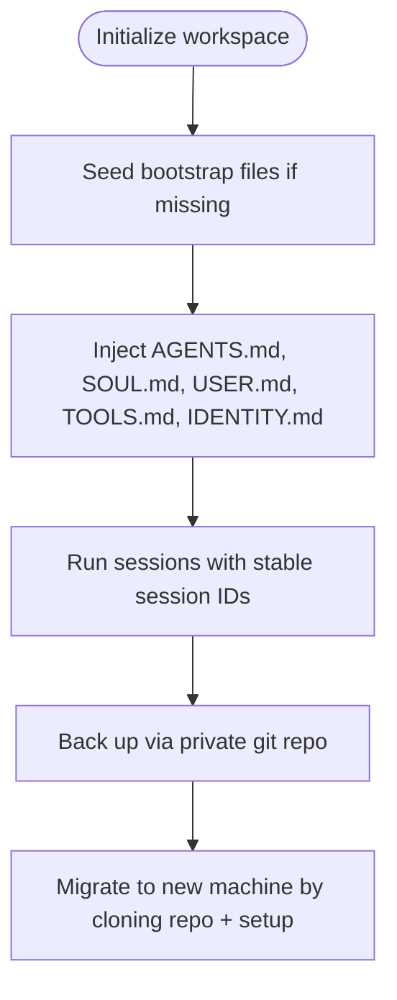
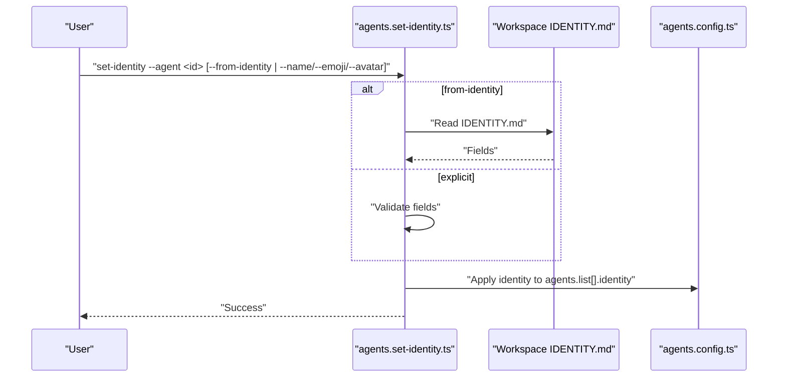
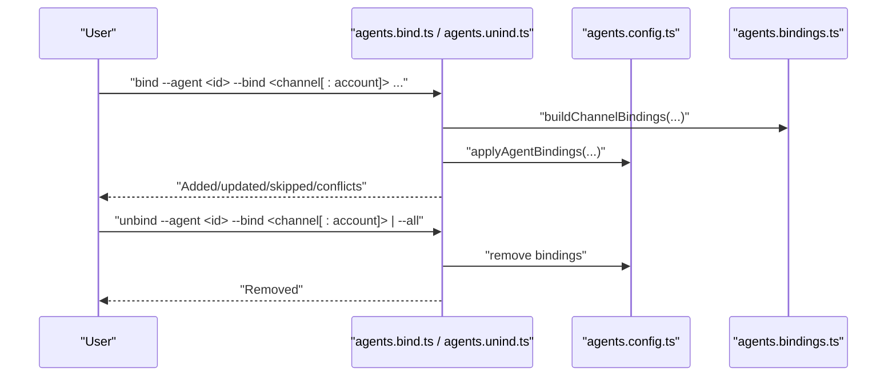
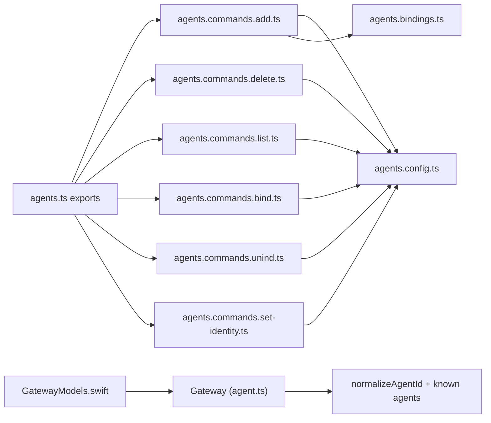
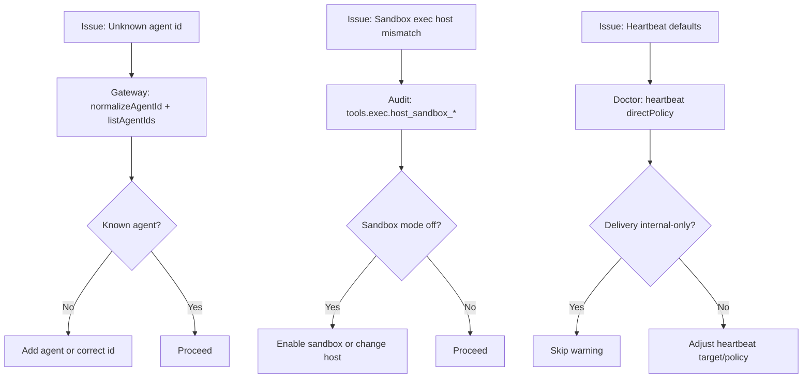

# Agent Operations

<cite>
**Referenced Files in This Document**
- [agents.ts](file://src/commands/agents.ts)
- [agents.commands.add.ts](file://src/commands/agents.commands.add.ts)
- [agents.commands.delete.ts](file://src/commands/agents.commands.delete.ts)
- [agents.bindings.ts](file://src/commands/agents.bindings.ts)
- [agents.config.ts](file://src/commands/agents.config.ts)
- [agents.commands.list.ts](file://src/commands/agents.commands.list.ts)
- [agents.commands.bind.ts](file://src/commands/agents.commands.bind.ts)
- [agents.commands.identity.ts](file://src/commands/agents.commands.identity.ts)
- [agents.commands.unind.ts](file://src/commands/agents.commands.unind.ts)
- [agents.commands.set-identity.ts](file://src/commands/agents.commands.set-identity.ts)
- [agents.command-shared.js](file://src/commands/agents.command-shared.js)
- [agents.config.js](file://src/commands/agents.config.js)
- [agents.bindings.js](file://src/commands/agents.bindings.js)
- [agents.commands.bind.js](file://src/commands/agents.commands.bind.js)
- [agents.commands.add.js](file://src/commands/agents.commands.add.js)
- [agents.commands.delete.js](file://src/commands/agents.commands.delete.js)
- [agents.commands.identity.js](file://src/commands/agents.commands.identity.js)
- [agents.commands.list.js](file://src/commands/agents.commands.list.js)
- [agents.commands.set-identity.js](file://src/commands/agents.commands.set-identity.js)
- [agents.commands.unind.js](file://src/commands/agents.commands.unind.js)
- [agents.ts](file://src/commands/agents.ts)
- [agents.md](file://docs/cli/agents.md)
- [agent.md](file://docs/cli/agent.md)
- [agent.md](file://docs/concepts/agent.md)
- [agent-workspace.md](file://docs/concepts/agent-workspace.md)
- [patterns.md](file://extensions/open-prose/skills/prose/guidance/patterns.md)
- [12-secure-agent-permissions.prose](file://extensions/open-prose/skills/prose/examples/12-secure-agent-permissions.prose)
- [28-gas-town.prose](file://extensions/open-prose/skills/prose/examples/28-gas-town.prose)
- [29-captains-chair.prose](file://extensions/open-prose/skills/prose/examples/29-captains-chair.prose)
- [39-architect-by-simulation.prose](file://extensions/open-prose/skills/prose/examples/39-architect-by-simulation.prose)
- [audit.test.ts](file://src/security/audit.test.ts)
- [doctor-security.test.ts](file://src/commands/doctor-security.test.ts)
- [doctor-sandbox.ts](file://src/commands/doctor-sandbox.ts)
- [agent.ts](file://src/gateway/server-methods/agent.ts)
- [register.agent.test.ts](file://src/cli/program/register.agent.test.ts)
- [GatewayModels.swift](file://apps/macos/Sources/OpenClawProtocol/GatewayModels.swift)
- [GatewayModels.swift](file://apps/shared/OpenClawKit/Sources/OpenClawProtocol/GatewayModels.swift)
</cite>

## Table of Contents
1. [Introduction](#introduction)
2. [Project Structure](#project-structure)
3. [Core Components](#core-components)
4. [Architecture Overview](#architecture-overview)
5. [Detailed Component Analysis](#detailed-component-analysis)
6. [Dependency Analysis](#dependency-analysis)
7. [Performance Considerations](#performance-considerations)
8. [Troubleshooting Guide](#troubleshooting-guide)
9. [Conclusion](#conclusion)
10. [Appendices](#appendices)

## Introduction
This document explains how to operate OpenClaw agents using CLI commands and configuration. It covers creating and deleting agents, assigning models, configuring workspaces, setting identities, and managing routing bindings. It also provides guidance for testing, troubleshooting, and monitoring agent behavior, along with security, isolation, and resource management practices. Advanced scenarios such as agent hierarchies, collaboration patterns, and specialized troubleshooting workflows are included.

## Project Structure
OpenClaw organizes agent operations under a cohesive CLI surface and supporting configuration and runtime modules:
- CLI commands for agents are exported from a central module and implemented in dedicated files.
- Agent workspace and identity files are documented in concept guides.
- Security and sandboxing checks are integrated into diagnostics and configuration audits.
- Protocol-level models define agent operations for clients and gateways.

```mermaid
graph TB
subgraph "CLI Commands"
A["agents.ts<br/>Exports all agent commands"]
A1["agents.commands.add.ts"]
A2["agents.commands.delete.ts"]
A3["agents.bindings.ts"]
A4["agents.config.ts"]
A5["agents.commands.list.ts"]
A6["agents.commands.bind.ts"]
A7["agents.commands.identity.ts"]
A8["agents.commands.unind.ts"]
A9["agents.commands.set-identity.ts"]
end
subgraph "Concept Docs"
D1["docs/cli/agents.md"]
D2["docs/concepts/agent.md"]
D3["docs/concepts/agent-workspace.md"]
end
subgraph "Security & Diagnostics"
S1["src/security/audit.test.ts"]
S2["src/commands/doctor-security.test.ts"]
S3["src/commands/doctor-sandbox.ts"]
end
subgraph "Gateway Protocol"
P1["apps/macos/.../GatewayModels.swift"]
P2["apps/shared/.../GatewayModels.swift"]
end
A --> A1
A --> A2
A --> A3
A --> A4
A --> A5
A --> A6
A --> A7
A --> A8
A --> A9
A --- D1
D2 --- D3
A --- S1
A --- S2
A --- S3
A --- P1
A --- P2
```

**Diagram sources**
- [agents.ts:1-8](file://src/commands/agents.ts#L1-L8)
- [agents.commands.add.ts:1-370](file://src/commands/agents.commands.add.ts#L1-L370)
- [agents.commands.delete.ts:1-102](file://src/commands/agents.commands.delete.ts#L1-L102)
- [agents.bindings.ts](file://src/commands/agents.bindings.ts)
- [agents.config.ts](file://src/commands/agents.config.ts)
- [agents.commands.list.ts](file://src/commands/agents.commands.list.ts)
- [agents.commands.bind.ts](file://src/commands/agents.commands.bind.ts)
- [agents.commands.identity.ts](file://src/commands/agents.commands.identity.ts)
- [agents.commands.unind.ts](file://src/commands/agents.commands.unind.ts)
- [agents.commands.set-identity.ts](file://src/commands/agents.commands.set-identity.ts)
- [agents.md:1-124](file://docs/cli/agents.md#L1-L124)
- [agent.md:1-124](file://docs/concepts/agent.md#L1-L124)
- [agent-workspace.md:1-237](file://docs/concepts/agent-workspace.md#L1-L237)
- [audit.test.ts:466-527](file://src/security/audit.test.ts#L466-L527)
- [doctor-security.test.ts:202-226](file://src/commands/doctor-security.test.ts#L202-L226)
- [doctor-sandbox.ts:282-312](file://src/commands/doctor-sandbox.ts#L282-L312)
- [GatewayModels.swift:2069-2307](file://apps/macos/Sources/OpenClawProtocol/GatewayModels.swift#L2069-L2307)
- [GatewayModels.swift:2069-2307](file://apps/shared/OpenClawKit/Sources/OpenClawProtocol/GatewayModels.swift#L2069-L2307)

**Section sources**
- [agents.ts:1-8](file://src/commands/agents.ts#L1-L8)
- [agents.md:1-124](file://docs/cli/agents.md#L1-L124)
- [agent.md:1-124](file://docs/concepts/agent.md#L1-L124)
- [agent-workspace.md:1-237](file://docs/concepts/agent-workspace.md#L1-L237)

## Core Components
- Agent lifecycle commands:
  - Add: create a new agent with workspace, optional bindings, and model/auth configuration.
  - Delete: remove an agent and associated workspace/state with pruning and safety prompts.
  - List: enumerate agents and optionally show bindings.
- Identity management:
  - Set identity: write agent identity fields (name, theme, emoji, avatar) into configuration.
  - From-identity: populate identity fields from workspace IDENTITY.md.
- Routing bindings:
  - Bind: route channel traffic to a specific agent (with optional account scoping).
  - Unbind: remove bindings; support removing all.
  - Bindings: list current bindings with optional filtering.
- Configuration and workspace:
  - Apply agent config entries and ensure workspace/bootstrap presence.
  - Workspace layout and bootstrap files are documented for reliable initialization.

Practical examples are provided in the CLI reference for agents and agent commands.

**Section sources**
- [agents.commands.add.ts:51-370](file://src/commands/agents.commands.add.ts#L51-L370)
- [agents.commands.delete.ts:19-102](file://src/commands/agents.commands.delete.ts#L19-L102)
- [agents.bindings.ts](file://src/commands/agents.bindings.ts)
- [agents.config.ts](file://src/commands/agents.config.ts)
- [agents.commands.list.ts](file://src/commands/agents.commands.list.ts)
- [agents.commands.bind.ts](file://src/commands/agents.commands.bind.ts)
- [agents.commands.identity.ts](file://src/commands/agents.commands.identity.ts)
- [agents.commands.unind.ts](file://src/commands/agents.commands.unind.ts)
- [agents.commands.set-identity.ts](file://src/commands/agents.commands.set-identity.ts)
- [agents.md:1-124](file://docs/cli/agents.md#L1-L124)
- [agent.md:1-30](file://docs/cli/agent.md#L1-L30)

## Architecture Overview
Agent operations integrate CLI commands, configuration management, workspace bootstrap, and routing bindings. The gateway enforces agent existence and normalizes identifiers. Protocol models define RPC parameters for agent operations.

**Diagram sources**
- [agents.commands.add.ts:107-138](file://src/commands/agents.commands.add.ts#L107-L138)
- [agents.bindings.ts](file://src/commands/agents.bindings.ts)
- [agents.config.ts](file://src/commands/agents.config.ts)
- [agent.ts:254-269](file://src/gateway/server-methods/agent.ts#L254-L269)
- [GatewayModels.swift:2069-2307](file://apps/macos/Sources/OpenClawProtocol/GatewayModels.swift#L2069-L2307)

## Detailed Component Analysis

### Agent Creation and Deletion
- Creation:
  - Validates non-interactive mode requirements (name and workspace).
  - Normalizes agent id and prevents reserved ids.
  - Applies agent config (name, workspace, optional model), parses and applies bindings, writes config, ensures workspace/bootstrap, and reports results.
  - Supports wizard-driven setup for model/auth and channel bindings.
- Deletion:
  - Requires a valid, non-default agent id.
  - Prompts for confirmation unless forced.
  - Prunes agent config entries and moves workspace, agent dir, and sessions to trash.

**Diagram sources**
- [agents.commands.add.ts:66-177](file://src/commands/agents.commands.add.ts#L66-L177)
- [agents.commands.delete.ts:28-101](file://src/commands/agents.commands.delete.ts#L28-L101)

**Section sources**
- [agents.commands.add.ts:51-370](file://src/commands/agents.commands.add.ts#L51-L370)
- [agents.commands.delete.ts:19-102](file://src/commands/agents.commands.delete.ts#L19-L102)

### Agent Workspace Management
- Workspace location and layout:
  - Single agent workspace directory acts as the agent’s working directory for tools and context.
  - Bootstrap files are injected at session start; missing files are handled gracefully.
  - Sandbox mode can isolate workspace under a sandbox root when enabled.
- Backup and migration:
  - Treat workspace as private memory; use a private git repository for backups.
  - Migrate by cloning the repo to a new path and seeding missing files.

**Diagram sources**
- [agent.md:12-47](file://docs/concepts/agent.md#L12-L47)
- [agent-workspace.md:24-62](file://docs/concepts/agent-workspace.md#L24-L62)
- [agent-workspace.md:138-237](file://docs/concepts/agent-workspace.md#L138-L237)

**Section sources**
- [agent.md:12-47](file://docs/concepts/agent.md#L12-L47)
- [agent-workspace.md:24-62](file://docs/concepts/agent-workspace.md#L24-L62)
- [agent-workspace.md:138-237](file://docs/concepts/agent-workspace.md#L138-L237)

### Model Assignment and Identity Configuration
- Model assignment:
  - Configure per-agent model via wizard or non-interactive flags; validation warns when configuration looks off.
- Identity configuration:
  - Set identity fields (name, theme, emoji, avatar) either from workspace IDENTITY.md or explicitly.
  - Avatars resolve relative to workspace root.

**Diagram sources**
- [agents.commands.set-identity.ts](file://src/commands/agents.commands.set-identity.ts)
- [agents.md:75-123](file://docs/cli/agents.md#L75-L123)

**Section sources**
- [agents.commands.add.ts:290-293](file://src/commands/agents.commands.add.ts#L290-L293)
- [agents.commands.set-identity.ts](file://src/commands/agents.commands.set-identity.ts)
- [agents.md:75-123](file://docs/cli/agents.md#L75-L123)

### Routing Bindings and Channel Routing
- Binding semantics:
  - Pin inbound channel traffic to a specific agent; supports channel-only and account-scoped bindings.
  - Upgrades channel-only bindings to account-scoped when a specific account is later bound.
- Listing and modifying bindings:
  - List bindings with optional filtering.
  - Add/remove bindings; remove all supported.

**Diagram sources**
- [agents.commands.bind.ts](file://src/commands/agents.commands.bind.ts)
- [agents.commands.unind.ts](file://src/commands/agents.commands.unind.ts)
- [agents.bindings.ts](file://src/commands/agents.bindings.ts)
- [agents.md:30-73](file://docs/cli/agents.md#L30-L73)

**Section sources**
- [agents.md:30-73](file://docs/cli/agents.md#L30-L73)
- [agents.bindings.ts](file://src/commands/agents.bindings.ts)

### Practical Examples
- Create a multi-agent system:
  - Use the add command with distinct workspaces and bindings for each agent.
  - Example patterns for orchestration and captain’s chair are provided in the OpenProse examples.
- Configure agent-specific settings:
  - Assign models and identities; use wizard or non-interactive flags.
- Manage agent workspaces:
  - Seed and maintain bootstrap files; back up via private git; migrate to new machines.

**Section sources**
- [agents.md:17-28](file://docs/cli/agents.md#L17-L28)
- [28-gas-town.prose](file://extensions/open-prose/skills/prose/examples/28-gas-town.prose)
- [29-captains-chair.prose](file://extensions/open-prose/skills/prose/examples/29-captains-chair.prose)
- [39-architect-by-simulation.prose](file://extensions/open-prose/skills/prose/examples/39-architect-by-simulation.prose)

## Dependency Analysis
Agent operations depend on:
- Configuration management for agent entries and identity.
- Binding resolution and application for channel routing.
- Workspace bootstrap and persistence.
- Gateway validation for agent ids and RPC parameters.

**Diagram sources**
- [agents.ts:1-8](file://src/commands/agents.ts#L1-L8)
- [agents.commands.add.ts:107-138](file://src/commands/agents.commands.add.ts#L107-L138)
- [agents.commands.delete.ts:72-76](file://src/commands/agents.commands.delete.ts#L72-L76)
- [agents.bindings.ts](file://src/commands/agents.bindings.ts)
- [agents.config.ts](file://src/commands/agents.config.ts)
- [agent.ts:254-269](file://src/gateway/server-methods/agent.ts#L254-L269)
- [GatewayModels.swift:2069-2307](file://apps/macos/Sources/OpenClawProtocol/GatewayModels.swift#L2069-L2307)

**Section sources**
- [agents.ts:1-8](file://src/commands/agents.ts#L1-L8)
- [agents.commands.add.ts:107-138](file://src/commands/agents.commands.add.ts#L107-L138)
- [agents.commands.delete.ts:72-76](file://src/commands/agents.commands.delete.ts#L72-L76)
- [agents.bindings.ts](file://src/commands/agents.bindings.ts)
- [agents.config.ts](file://src/commands/agents.config.ts)
- [agent.ts:254-269](file://src/gateway/server-methods/agent.ts#L254-L269)
- [GatewayModels.swift:2069-2307](file://apps/macos/Sources/OpenClawProtocol/GatewayModels.swift#L2069-L2307)

## Performance Considerations
- Streaming and block chunking:
  - Tune block streaming defaults and chunking to balance responsiveness and token efficiency.
- Session storage:
  - Session transcripts are stored per agent; ensure adequate disk space and rotation policies.
- Tool policy and sandboxing:
  - Limit tool execution scope and enable sandboxing to reduce overhead and improve isolation.

[No sources needed since this section provides general guidance]

## Troubleshooting Guide
Common issues and remedies:
- Unknown agent id:
  - The gateway validates agent ids; ensure normalization and that the agent exists in configuration.
- Sandbox misconfiguration:
  - Audit warns when sandbox exec host is selected while sandbox mode is off; adjust defaults or agent overrides accordingly.
- Heartbeat and delivery policies:
  - Doctor notes warnings for heartbeat defaults and direct policy when delivery is internal-only.
- Sandbox overrides ignored:
  - Shared scope ignores certain sandbox overrides; adjust scope or configuration.

**Diagram sources**
- [agent.ts:254-269](file://src/gateway/server-methods/agent.ts#L254-L269)
- [audit.test.ts:466-527](file://src/security/audit.test.ts#L466-L527)
- [doctor-security.test.ts:202-226](file://src/commands/doctor-security.test.ts#L202-L226)
- [doctor-sandbox.ts:282-312](file://src/commands/doctor-sandbox.ts#L282-L312)

**Section sources**
- [agent.ts:254-269](file://src/gateway/server-methods/agent.ts#L254-L269)
- [audit.test.ts:466-527](file://src/security/audit.test.ts#L466-L527)
- [doctor-security.test.ts:202-226](file://src/commands/doctor-security.test.ts#L202-L226)
- [doctor-sandbox.ts:282-312](file://src/commands/doctor-sandbox.ts#L282-L312)

## Conclusion
OpenClaw provides a robust, configurable agent lifecycle with strong workspace and identity controls, flexible routing bindings, and comprehensive diagnostics. By following the documented workflows and leveraging sandboxing and security checks, teams can operate secure, isolated, and efficient multi-agent systems.

[No sources needed since this section summarizes without analyzing specific files]

## Appendices

### Agent Testing and Validation
- Use the agent command to run a single turn via the Gateway for scripted testing.
- Validate model configuration and credential markers behavior during model regeneration.

**Section sources**
- [agent.md:1-30](file://docs/cli/agent.md#L1-L30)

### Agent Security and Isolation
- Restrict agent capabilities using permissions and allowlists.
- Enforce sandboxing and monitor overrides to prevent unintended host access.

**Section sources**
- [12-secure-agent-permissions.prose:1-43](file://extensions/open-prose/skills/prose/examples/12-secure-agent-permissions.prose#L1-L43)
- [audit.test.ts:466-527](file://src/security/audit.test.ts#L466-L527)
- [doctor-sandbox.ts:282-312](file://src/commands/doctor-sandbox.ts#L282-L312)

### Advanced Agent Scenarios
- Orchestration patterns:
  - Multi-agent orchestration with specialized roles and handoffs.
  - Captain’s chair pattern: coordinating subagents without direct execution.
  - Architect by simulation: designing systems through iterative phases.

**Section sources**
- [patterns.md:52-488](file://extensions/open-prose/skills/prose/guidance/patterns.md#L52-L488)
- [28-gas-town.prose](file://extensions/open-prose/skills/prose/examples/28-gas-town.prose)
- [29-captains-chair.prose](file://extensions/open-prose/skills/prose/examples/29-captains-chair.prose)
- [39-architect-by-simulation.prose:1-27](file://extensions/open-prose/skills/prose/examples/39-architect-by-simulation.prose#L1-L27)

### Command Reference Examples
- Add, list, bind, unbind, set-identity, and delete agents with practical examples.

**Section sources**
- [agents.md:17-28](file://docs/cli/agents.md#L17-L28)