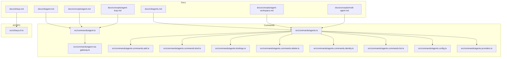
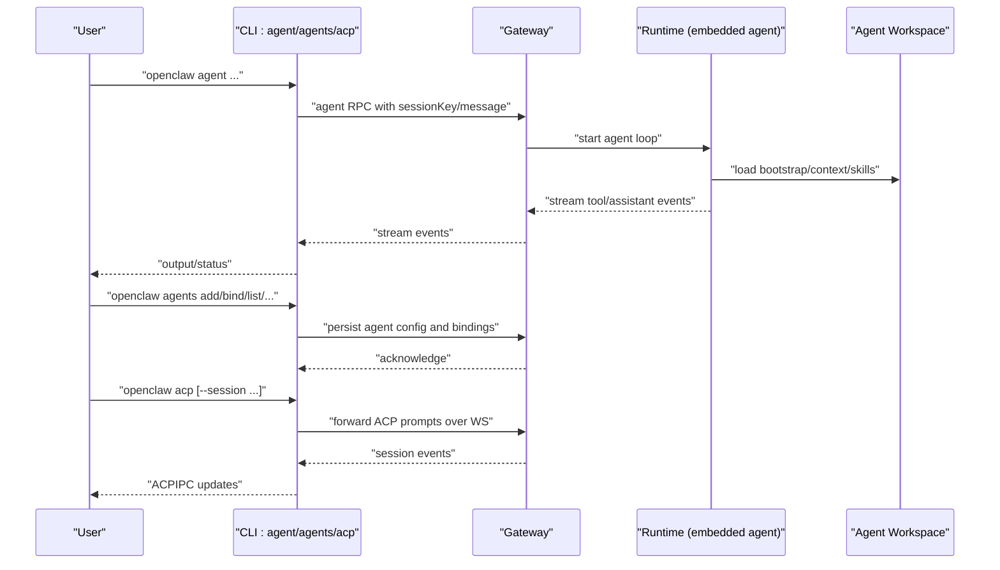
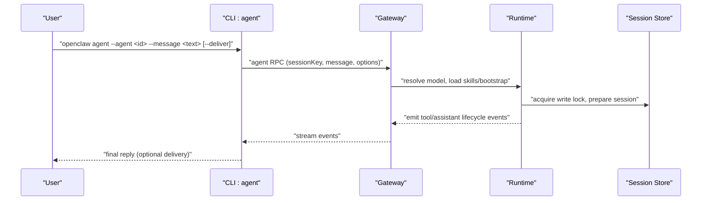
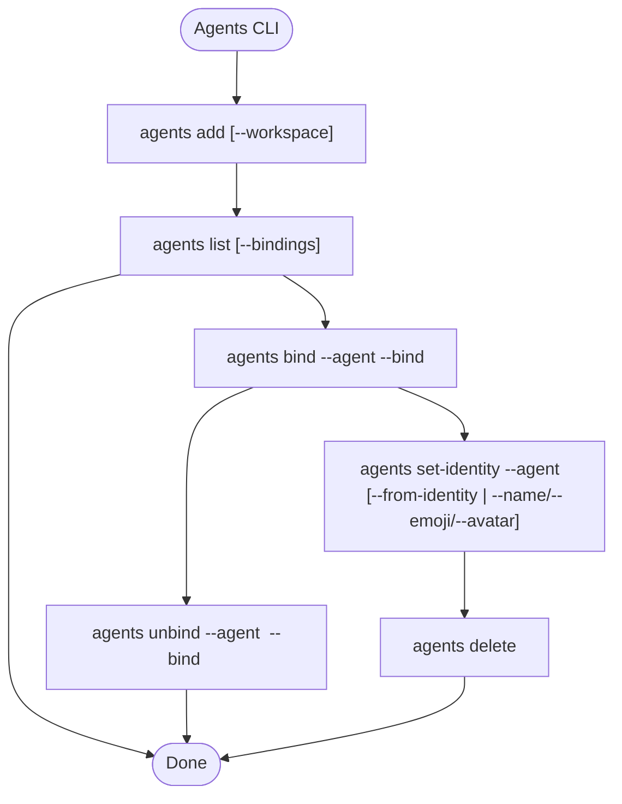
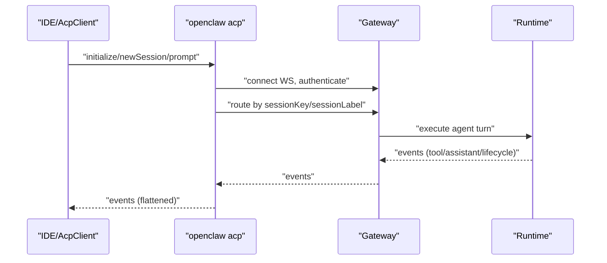
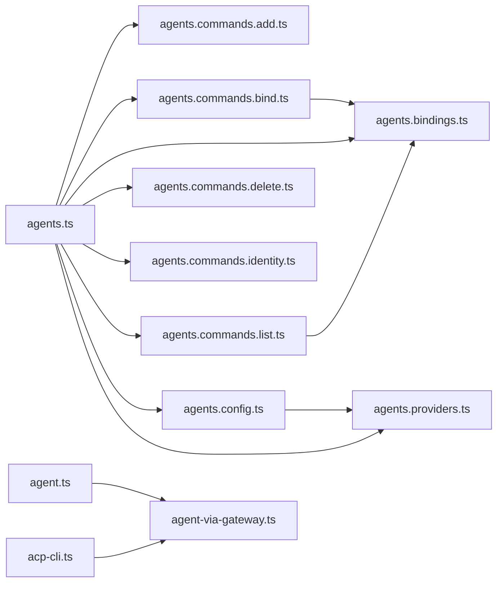

# Agent System

<cite>
**Referenced Files in This Document**
- [docs/cli/agent.md](file://docs/cli/agent.md)
- [docs/cli/agents.md](file://docs/cli/agents.md)
- [docs/cli/acp.md](file://docs/cli/acp.md)
- [docs/concepts/agent.md](file://docs/concepts/agent.md)
- [docs/concepts/agent-workspace.md](file://docs/concepts/agent-workspace.md)
- [docs/concepts/multi-agent.md](file://docs/concepts/multi-agent.md)
- [docs/concepts/agent-loop.md](file://docs/concepts/agent-loop.md)
- [src/commands/agent.ts](file://src/commands/agent.ts)
- [src/commands/agent-via-gateway.ts](file://src/commands/agent-via-gateway.ts)
- [src/commands/agents.ts](file://src/commands/agents.ts)
- [src/commands/agents.commands.add.ts](file://src/commands/agents.commands.add.ts)
- [src/commands/agents.commands.bind.ts](file://src/commands/agents.commands.bind.ts)
- [src/commands/agents.bindings.ts](file://src/commands/agents.bindings.ts)
- [src/commands/agents.commands.delete.ts](file://src/commands/agents.commands.delete.ts)
- [src/commands/agents.commands.identity.ts](file://src/commands/agents.commands.identity.ts)
- [src/commands/agents.commands.list.ts](file://src/commands/agents.commands.list.ts)
- [src/commands/agents.config.ts](file://src/commands/agents.config.ts)
- [src/commands/agents.providers.ts](file://src/commands/agents.providers.ts)
- [src/cli/acp-cli.ts](file://src/cli/acp-cli.ts)
</cite>

## Table of Contents
1. [Introduction](#introduction)
2. [Project Structure](#project-structure)
3. [Core Components](#core-components)
4. [Architecture Overview](#architecture-overview)
5. [Detailed Component Analysis](#detailed-component-analysis)
6. [Dependency Analysis](#dependency-analysis)
7. [Performance Considerations](#performance-considerations)
8. [Troubleshooting Guide](#troubleshooting-guide)
9. [Conclusion](#conclusion)
10. [Appendices](#appendices)

## Introduction
This document explains the agent system commands and workflows in OpenClaw: agent, agents, and acp. It covers agent creation and configuration, workspace management, agent isolation and multi-agent routing, ACP integration for IDE connectivity, message sending and testing, debugging techniques, and practical examples for multi-agent setups and collaboration.

## Project Structure
The agent system spans documentation and implementation across:
- CLI commands for agent invocation, agent management, and ACP bridging
- Conceptual guides for agent runtime, workspace, multi-agent routing, and agent loop lifecycle
- Implementation modules that wire CLI commands to the Gateway and runtime

**Diagram sources**
- [docs/cli/agent.md](file://docs/cli/agent.md#L1-L29)
- [docs/cli/agents.md](file://docs/cli/agents.md#L1-L124)
- [docs/cli/acp.md](file://docs/cli/acp.md#L1-L289)
- [docs/concepts/agent.md](file://docs/concepts/agent.md#L1-L124)
- [docs/concepts/agent-workspace.md](file://docs/concepts/agent-workspace.md#L1-L237)
- [docs/concepts/multi-agent.md](file://docs/concepts/multi-agent.md#L1-L553)
- [docs/concepts/agent-loop.md](file://docs/concepts/agent-loop.md#L1-L149)
- [src/commands/agent.ts](file://src/commands/agent.ts)
- [src/commands/agent-via-gateway.ts](file://src/commands/agent-via-gateway.ts)
- [src/commands/agents.ts](file://src/commands/agents.ts)
- [src/commands/agents.commands.add.ts](file://src/commands/agents.commands.add.ts)
- [src/commands/agents.commands.bind.ts](file://src/commands/agents.commands.bind.ts)
- [src/commands/agents.bindings.ts](file://src/commands/agents.bindings.ts)
- [src/commands/agents.commands.delete.ts](file://src/commands/agents.commands.delete.ts)
- [src/commands/agents.commands.identity.ts](file://src/commands/agents.commands.identity.ts)
- [src/commands/agents.commands.list.ts](file://src/commands/agents.commands.list.ts)
- [src/commands/agents.config.ts](file://src/commands/agents.config.ts)
- [src/commands/agents.providers.ts](file://src/commands/agents.providers.ts)
- [src/cli/acp-cli.ts](file://src/cli/acp-cli.ts)

**Section sources**
- [docs/cli/agent.md](file://docs/cli/agent.md#L1-L29)
- [docs/cli/agents.md](file://docs/cli/agents.md#L1-L124)
- [docs/cli/acp.md](file://docs/cli/acp.md#L1-L289)
- [docs/concepts/agent.md](file://docs/concepts/agent.md#L1-L124)
- [docs/concepts/agent-workspace.md](file://docs/concepts/agent-workspace.md#L1-L237)
- [docs/concepts/multi-agent.md](file://docs/concepts/multi-agent.md#L1-L553)
- [docs/concepts/agent-loop.md](file://docs/concepts/agent-loop.md#L1-L149)

## Core Components
- Agent command: runs a single agent turn via the Gateway, optionally delivering replies and targeting specific agents or sessions.
- Agents command suite: manages multiple isolated agents, including adding agents, listing, setting identities, bindings, and deletion.
- ACP command: bridges ACP over stdio to the Gateway, enabling IDEs to drive OpenClaw sessions and manage session routing.

Key capabilities:
- Single-turn agent execution with optional delivery and session targeting
- Multi-agent isolation via distinct workspaces, agentDirs, and session stores
- Routing bindings to map inbound traffic to specific agents
- ACP session mapping to Gateway session keys for IDE integration

**Section sources**
- [docs/cli/agent.md](file://docs/cli/agent.md#L8-L29)
- [docs/cli/agents.md](file://docs/cli/agents.md#L8-L124)
- [docs/cli/acp.md](file://docs/cli/acp.md#L9-L289)

## Architecture Overview
The agent system integrates CLI commands with the Gateway and runtime. The agent command invokes the Gateway to run a single turn; agents commands manage agent definitions, identities, and bindings; ACP provides a bridge for IDEs to route prompts to specific Gateway sessions.

**Diagram sources**
- [src/commands/agent.ts](file://src/commands/agent.ts)
- [src/commands/agent-via-gateway.ts](file://src/commands/agent-via-gateway.ts)
- [src/commands/agents.ts](file://src/commands/agents.ts)
- [src/cli/acp-cli.ts](file://src/cli/acp-cli.ts)

## Detailed Component Analysis

### Agent Command Workflow
The agent command executes a single agent turn via the Gateway. It supports targeting a specific agent, overriding session keys, controlling thinking verbosity, and delivering replies to channels.

Operational notes:
- Session keys determine which agent and session are targeted
- Delivery depends on channel configuration and tool policies
- Thinking level and tool verbosity can be tuned per invocation

**Diagram sources**
- [docs/cli/agent.md](file://docs/cli/agent.md#L10-L29)
- [docs/concepts/agent-loop.md](file://docs/concepts/agent-loop.md#L18-L64)

**Section sources**
- [docs/cli/agent.md](file://docs/cli/agent.md#L8-L29)
- [docs/concepts/agent-loop.md](file://docs/concepts/agent-loop.md#L18-L64)

### Agents Management Workflows
The agents command suite orchestrates multiple isolated agents:
- Adding agents with custom workspaces and agentDirs
- Listing agents and bindings
- Binding channel traffic to agents
- Unbinding and deleting agents
- Setting agent identities (name/theme/emoji/avatar)

Routing bindings:
- Deterministic, most-specific wins
- Supports peer, parentPeer, guild/team, accountId, and channel-level matches
- Channel-wide fallback via accountId wildcard

**Diagram sources**
- [docs/cli/agents.md](file://docs/cli/agents.md#L17-L124)
- [docs/concepts/multi-agent.md](file://docs/concepts/multi-agent.md#L172-L216)

**Section sources**
- [docs/cli/agents.md](file://docs/cli/agents.md#L8-L124)
- [docs/concepts/multi-agent.md](file://docs/concepts/multi-agent.md#L10-L120)

### ACP Integration for IDE Connectivity
The ACP command runs an ACP bridge over stdio, forwarding prompts to the Gateway over WebSocket and mapping ACP sessions to Gateway session keys. It supports selecting agents indirectly via session keys and provides a built-in client for debugging.

Session mapping:
- Default: isolated acp:<uuid> session
- Override: --session <key>, --session-label <label>, --reset-session
- Per-session MCP servers unsupported in bridge mode

**Diagram sources**
- [docs/cli/acp.md](file://docs/cli/acp.md#L9-L145)
- [src/cli/acp-cli.ts](file://src/cli/acp-cli.ts)

**Section sources**
- [docs/cli/acp.md](file://docs/cli/acp.md#L9-L289)
- [src/cli/acp-cli.ts](file://src/cli/acp-cli.ts)

### Agent Isolation and Workspace Management
Agent isolation relies on:
- Distinct workspaces per agent (default cwd for tools)
- Per-agent agentDirs for state and credentials
- Separate session stores under ~/.openclaw/agents/<agentId>/sessions
- Optional sandboxing for resource control and security

Workspace layout and bootstrap:
- Standard files (AGENTS.md, SOUL.md, USER.md, IDENTITY.md, TOOLS.md, BOOTSTRAP.md, memory/)
- Bootstrap files injected at session start with truncation and limits
- Git backup recommended for private workspace repos

**Section sources**
- [docs/concepts/agent.md](file://docs/concepts/agent.md#L12-L47)
- [docs/concepts/agent-workspace.md](file://docs/concepts/agent-workspace.md#L64-L137)
- [docs/concepts/multi-agent.md](file://docs/concepts/multi-agent.md#L14-L38)

### Agent Lifecycle and Loop Behavior
The agent loop is a serialized run per session emitting lifecycle and stream events:
- Entry points: Gateway RPC agent/agent.wait and CLI agent
- Queueing: serialized per session key with optional global queue
- Session preparation: workspace resolution, skills load, bootstrap injection, session lock
- Streaming: assistant/tool deltas and lifecycle events
- Timeouts: agent.wait default and runtime enforced timeouts

Hook points:
- Internal hooks (Gateway): agent:bootstrap, command hooks, lifecycle events
- Plugin hooks: before_model_resolve, before_prompt_build, before_agent_start, agent_end, before_tool_call/after_tool_call, tool_result_persist, message_received/sending/sent, session_start/end, gateway_start/stop

**Section sources**
- [docs/concepts/agent-loop.md](file://docs/concepts/agent-loop.md#L18-L149)

## Dependency Analysis
The agents command orchestrates multiple subcommands and interacts with configuration and providers. The agent command delegates to the Gateway, which coordinates with the runtime and session store. ACP integrates with the Gateway over WebSocket.

**Diagram sources**
- [src/commands/agents.ts](file://src/commands/agents.ts)
- [src/commands/agents.commands.add.ts](file://src/commands/agents.commands.add.ts)
- [src/commands/agents.commands.bind.ts](file://src/commands/agents.commands.bind.ts)
- [src/commands/agents.bindings.ts](file://src/commands/agents.bindings.ts)
- [src/commands/agents.commands.delete.ts](file://src/commands/agents.commands.delete.ts)
- [src/commands/agents.commands.identity.ts](file://src/commands/agents.commands.identity.ts)
- [src/commands/agents.commands.list.ts](file://src/commands/agents.commands.list.ts)
- [src/commands/agents.config.ts](file://src/commands/agents.config.ts)
- [src/commands/agents.providers.ts](file://src/commands/agents.providers.ts)
- [src/commands/agent.ts](file://src/commands/agent.ts)
- [src/commands/agent-via-gateway.ts](file://src/commands/agent-via-gateway.ts)
- [src/cli/acp-cli.ts](file://src/cli/acp-cli.ts)

**Section sources**
- [src/commands/agents.ts](file://src/commands/agents.ts)
- [src/commands/agent.ts](file://src/commands/agent.ts)
- [src/cli/acp-cli.ts](file://src/cli/acp-cli.ts)

## Performance Considerations
- Serialized runs per session key prevent race conditions and ensure consistent history
- Streaming block replies and coalescing can reduce small-line spam
- Tool verbosity and reasoning streaming can increase token usage; tune per need
- Sandbox scopes and per-agent tool restrictions can isolate resource usage and improve predictability

[No sources needed since this section provides general guidance]

## Troubleshooting Guide
Common issues and remedies:
- Gateway connectivity: verify Gateway is running and reachable; use status probes and logs
- Session routing: ensure bindings match inbound traffic; verify accountId scoping and specificity
- ACP session mapping: confirm session keys/labels; use --reset-session to refresh
- Agent timeouts: adjust agents.defaults.timeoutSeconds and agent.wait timeoutMs
- Workspace drift: keep a single active workspace; avoid multiple workspace directories
- Secrets exposure: avoid committing secrets; use environment variables or credential storage

**Section sources**
- [docs/cli/acp.md](file://docs/cli/acp.md#L271-L289)
- [docs/concepts/agent-loop.md](file://docs/concepts/agent-loop.md#L138-L149)
- [docs/concepts/agent-workspace.md](file://docs/concepts/agent-workspace.md#L57-L62)

## Conclusion
The agent system provides robust primitives for single-turn agent execution, multi-agent isolation, and IDE integration via ACP. By combining agents commands for lifecycle management, routing bindings for traffic orchestration, and ACP for seamless IDE connectivity, teams can deploy secure, scalable, and collaborative agent deployments.

[No sources needed since this section summarizes without analyzing specific files]

## Appendices

### Practical Examples

- Single-turn agent execution
  - Send a message to a specific agent and deliver the reply to a channel
  - Reference: [docs/cli/agent.md](file://docs/cli/agent.md#L17-L24)

- Multi-agent setup
  - Create isolated agents with distinct workspaces and identities
  - Bind channels to agents and verify bindings
  - Reference: [docs/cli/agents.md](file://docs/cli/agents.md#L17-L73), [docs/concepts/multi-agent.md](file://docs/concepts/multi-agent.md#L75-L120)

- ACP IDE integration
  - Run ACP bridge and connect an IDE to a specific session key
  - Reference: [docs/cli/acp.md](file://docs/cli/acp.md#L192-L233)

- Agent collaboration patterns
  - Route different peers or channels to different agents
  - Reference: [docs/concepts/multi-agent.md](file://docs/concepts/multi-agent.md#L413-L446)

- Agent lifecycle management
  - Understand loop phases, streaming, and hook points
  - Reference: [docs/concepts/agent-loop.md](file://docs/concepts/agent-loop.md#L65-L95)