# Browser Automation

<cite>
**Referenced Files in This Document**
- [docs/tools/browser.md](file://docs/tools/browser.md)
- [docs/cli/browser.md](file://docs/cli/browser.md)
- [src/browser/server.ts](file://src/browser/server.ts)
- [src/browser/config.ts](file://src/browser/config.ts)
- [src/browser/constants.ts](file://src/browser/constants.ts)
- [src/browser/chrome.ts](file://src/browser/chrome.ts)
- [src/browser/client.ts](file://src/browser/client.ts)
- [src/browser/routes/agent.snapshot.ts](file://src/browser/routes/agent.snapshot.ts)
- [src/browser/routes/agent.act.ts](file://src/browser/routes/agent.act.ts)
- [src/browser/routes/agent.shared.ts](file://src/browser/routes/agent.shared.ts)
- [src/browser/server-context.ts](file://src/browser/server-context.ts)
- [src/browser/navigation-guard.ts](file://src/browser/navigation-guard.ts)
- [src/browser/profiles-service.ts](file://src/browser/profiles-service.ts)
- [src/browser/pw-session.ts](file://src/browser/pw-session.ts)
</cite>

## Table of Contents
1. [Introduction](#introduction)
2. [Project Structure](#project-structure)
3. [Core Components](#core-components)
4. [Architecture Overview](#architecture-overview)
5. [Detailed Component Analysis](#detailed-component-analysis)
6. [Dependency Analysis](#dependency-analysis)
7. [Performance Considerations](#performance-considerations)
8. [Troubleshooting Guide](#troubleshooting-guide)
9. [Conclusion](#conclusion)
10. [Appendices](#appendices)

## Introduction
This document explains the browser automation subsystem integrated into the OpenClaw platform. It covers how OpenClaw manages a dedicated Chromium-based browser (openclaw profile), controls tabs deterministically, and exposes a loopback HTTP API for agent-driven actions such as snapshots, screenshots, navigation, clicking, typing, and form filling. It also documents profile handling, remote control via hosted CDP endpoints, security policies, headless operation, debugging workflows, and performance considerations.

## Project Structure
The browser automation system is implemented as a small HTTP control service bound to localhost, with routes for status, tabs, snapshots, screenshots, navigation, actions, and debugging. Profiles route to either a local managed browser or remote CDP endpoints. The system integrates with Playwright for advanced operations (snapshots, screenshots, PDFs, element interactions).

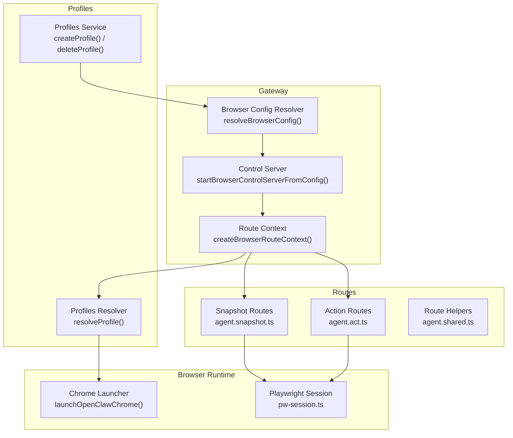

**Diagram sources**
- [src/browser/server.ts](file://src/browser/server.ts#L20-L86)
- [src/browser/config.ts](file://src/browser/config.ts#L212-L319)
- [src/browser/server-context.ts](file://src/browser/server-context.ts#L118-L241)
- [src/browser/chrome.ts](file://src/browser/chrome.ts#L238-L415)
- [src/browser/routes/agent.snapshot.ts](file://src/browser/routes/agent.snapshot.ts#L88-L343)
- [src/browser/routes/agent.act.ts](file://src/browser/routes/agent.act.ts#L21-L381)
- [src/browser/routes/agent.shared.ts](file://src/browser/routes/agent.shared.ts#L85-L149)
- [src/browser/profiles-service.ts](file://src/browser/profiles-service.ts#L74-L236)

**Section sources**
- [src/browser/server.ts](file://src/browser/server.ts#L20-L86)
- [src/browser/config.ts](file://src/browser/config.ts#L212-L319)
- [src/browser/server-context.ts](file://src/browser/server-context.ts#L118-L241)

## Core Components
- Control server: Express-based HTTP server bound to loopback, exposing browser control endpoints and installing auth middleware.
- Config resolver: Computes effective browser settings, default profile, ports, SSRF policy, and profile routing.
- Profile context: Manages availability, tab operations, and lifecycle per profile (local managed or remote CDP).
- Chrome launcher: Spawns and monitors a Chromium-based browser for local profiles.
- Playwright session: Persistent CDP connection to Chromium for advanced actions and snapshots.
- Route handlers: Expose deterministic APIs for status, tabs, snapshots, screenshots, navigation, actions, and debugging.

**Section sources**
- [src/browser/server.ts](file://src/browser/server.ts#L20-L86)
- [src/browser/config.ts](file://src/browser/config.ts#L212-L319)
- [src/browser/server-context.ts](file://src/browser/server-context.ts#L45-L116)
- [src/browser/chrome.ts](file://src/browser/chrome.ts#L238-L415)
- [src/browser/pw-session.ts](file://src/browser/pw-session.ts#L332-L385)
- [src/browser/routes/agent.snapshot.ts](file://src/browser/routes/agent.snapshot.ts#L88-L343)
- [src/browser/routes/agent.act.ts](file://src/browser/routes/agent.act.ts#L21-L381)

## Architecture Overview
OpenClaw runs a loopback-only HTTP control service that connects to Chromium-based browsers via CDP. For advanced operations, it uses Playwright on top of CDP. Profiles can be local managed instances, remote CDP endpoints, or Chrome extension relay profiles.

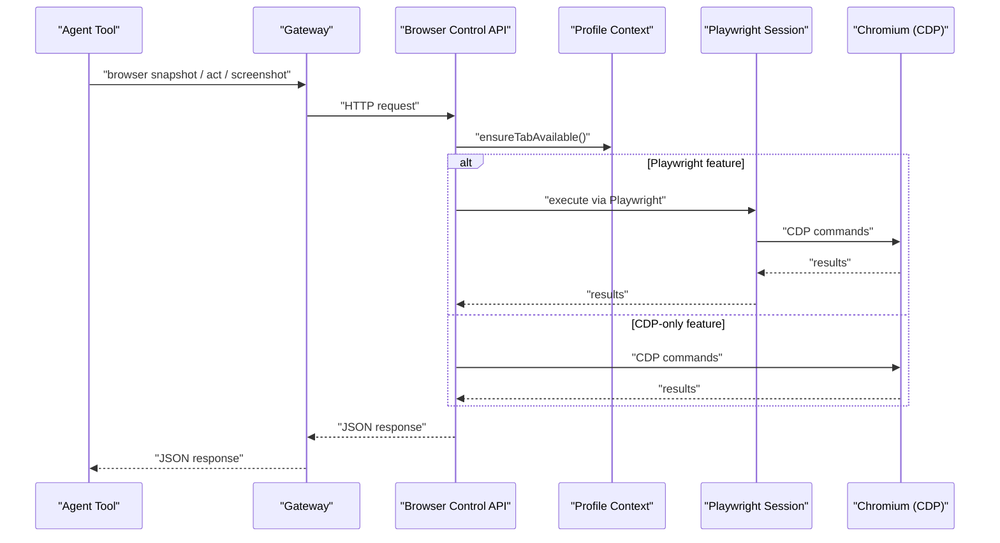

**Diagram sources**
- [src/browser/server.ts](file://src/browser/server.ts#L53-L61)
- [src/browser/server-context.ts](file://src/browser/server-context.ts#L72-L93)
- [src/browser/routes/agent.shared.ts](file://src/browser/routes/agent.shared.ts#L132-L149)
- [src/browser/pw-session.ts](file://src/browser/pw-session.ts#L332-L385)

## Detailed Component Analysis

### Control Server and Authentication
- Starts the browser control server only when enabled and auth is available or auto-generated.
- Binds to loopback on a derived port family; installs common and auth middleware.
- Exposes routes via a registrar and maintains runtime state.

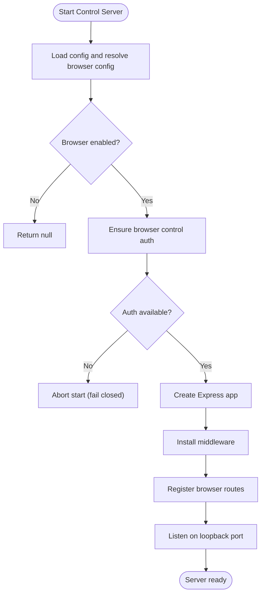

**Diagram sources**
- [src/browser/server.ts](file://src/browser/server.ts#L20-L86)

**Section sources**
- [src/browser/server.ts](file://src/browser/server.ts#L20-L86)

### Configuration and Profiles
- Resolves effective browser settings, default profile, control port, CDP port range, SSRF policy, and profile routing.
- Ensures default profiles exist (openclaw and chrome relay) and validates profile definitions.
- Supports local managed profiles with auto-assigned ports and remote CDP endpoints (HTTP or WebSocket).

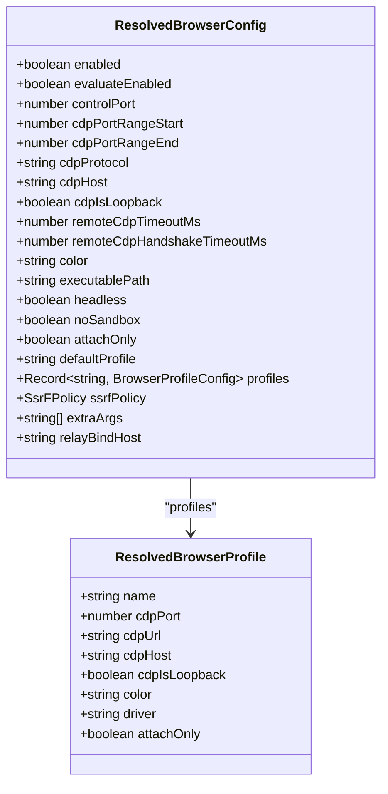

**Diagram sources**
- [src/browser/config.ts](file://src/browser/config.ts#L19-L51)
- [src/browser/config.ts](file://src/browser/config.ts#L325-L361)

**Section sources**
- [src/browser/config.ts](file://src/browser/config.ts#L212-L319)
- [src/browser/config.ts](file://src/browser/config.ts#L325-L361)
- [src/browser/constants.ts](file://src/browser/constants.ts#L1-L9)

### Profile Management
- Creates and deletes profiles, allocating ports and colors, validating names and URLs.
- Prevents deletion of the default profile and handles cleanup of local user data directories.
- Persists configuration updates atomically.

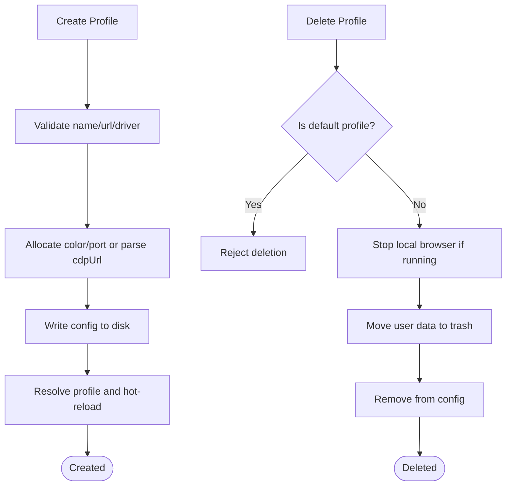

**Diagram sources**
- [src/browser/profiles-service.ts](file://src/browser/profiles-service.ts#L79-L170)
- [src/browser/profiles-service.ts](file://src/browser/profiles-service.ts#L172-L228)

**Section sources**
- [src/browser/profiles-service.ts](file://src/browser/profiles-service.ts#L74-L236)

### Tab Operations and Session Management
- Profile context ensures a browser is available, opens and focuses tabs, and closes tabs deterministically by targetId.
- Uses Playwright to resolve pages by targetId and maintain stable references across navigations.
- Provides reset operations for profiles and availability checks.

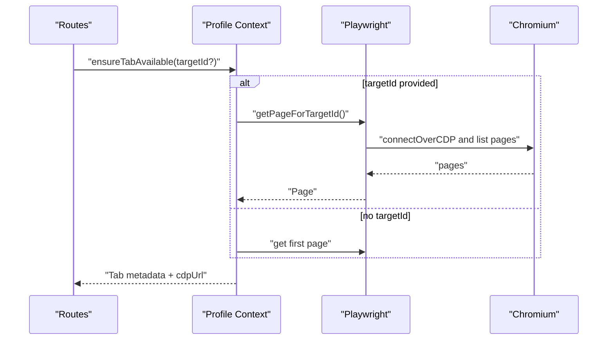

**Diagram sources**
- [src/browser/server-context.ts](file://src/browser/server-context.ts#L72-L93)
- [src/browser/pw-session.ts](file://src/browser/pw-session.ts#L505-L529)

**Section sources**
- [src/browser/server-context.ts](file://src/browser/server-context.ts#L45-L116)
- [src/browser/pw-session.ts](file://src/browser/pw-session.ts#L332-L385)

### Snapshots, Screenshots, and Navigation
- Snapshot routes support AI snapshots (via Playwright) and ARIA snapshots (via CDP), with optional labels overlay and role refs.
- Screenshot routes support full-page and element screenshots, with normalization and persistence.
- Navigation routes enforce SSRF policy and resolve targetId after navigation to handle renderer swaps.

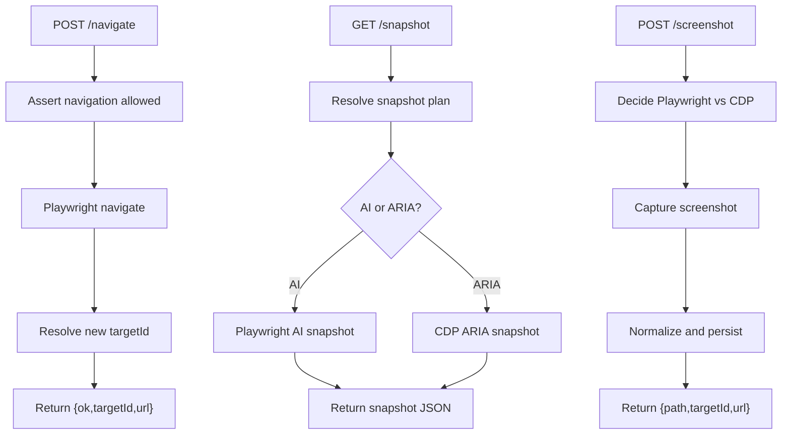

**Diagram sources**
- [src/browser/routes/agent.snapshot.ts](file://src/browser/routes/agent.snapshot.ts#L92-L120)
- [src/browser/routes/agent.snapshot.ts](file://src/browser/routes/agent.snapshot.ts#L212-L343)
- [src/browser/routes/agent.snapshot.ts](file://src/browser/routes/agent.snapshot.ts#L148-L210)
- [src/browser/navigation-guard.ts](file://src/browser/navigation-guard.ts#L43-L84)

**Section sources**
- [src/browser/routes/agent.snapshot.ts](file://src/browser/routes/agent.snapshot.ts#L88-L343)
- [src/browser/navigation-guard.ts](file://src/browser/navigation-guard.ts#L39-L84)

### Actions: Click, Type, Drag, Select, Wait, Evaluate
- Action routes validate kinds and parameters, then execute via Playwright when available.
- Supports ref-based interactions (role refs or aria-ref), key presses, hover, drag, select options, resize viewport, wait conditions, evaluate JS, and close tab.
- Enforces feature gating for evaluate/wait when disabled by configuration.

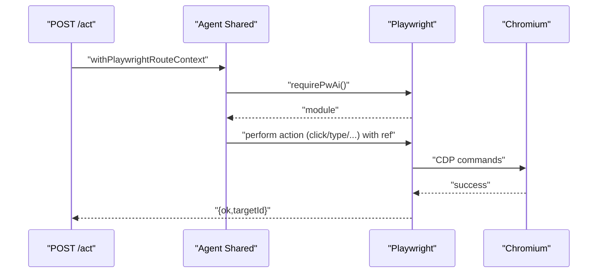

**Diagram sources**
- [src/browser/routes/agent.act.ts](file://src/browser/routes/agent.act.ts#L25-L322)
- [src/browser/routes/agent.shared.ts](file://src/browser/routes/agent.shared.ts#L132-L149)

**Section sources**
- [src/browser/routes/agent.act.ts](file://src/browser/routes/agent.act.ts#L21-L381)
- [src/browser/routes/agent.shared.ts](file://src/browser/routes/agent.shared.ts#L61-L83)

### Chrome Launch and Headless Operation
- Launches a managed Chromium instance with sanitized environment and flags.
- Supports headless mode, no-sandbox, and platform-specific arguments.
- Probes readiness via CDP reachability and WebSocket handshake.

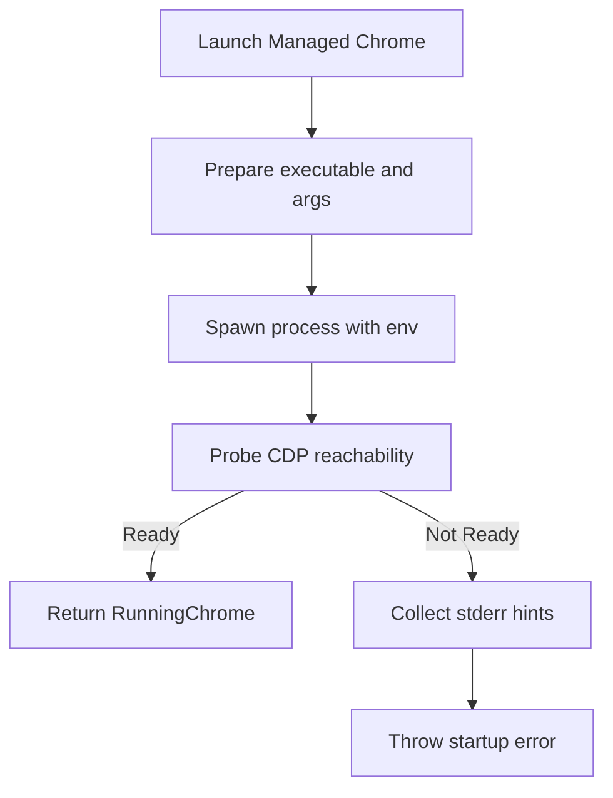

**Diagram sources**
- [src/browser/chrome.ts](file://src/browser/chrome.ts#L238-L415)
- [src/browser/chrome.ts](file://src/browser/chrome.ts#L96-L236)

**Section sources**
- [src/browser/chrome.ts](file://src/browser/chrome.ts#L238-L415)

### Client API Surface
- Provides typed client functions for status, profiles, tabs, snapshots, and actions.
- Encodes profile queries and base URLs for remote control scenarios.

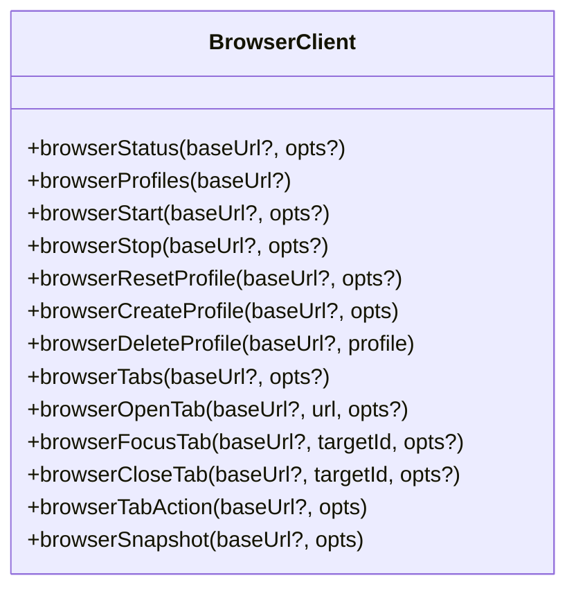

**Diagram sources**
- [src/browser/client.ts](file://src/browser/client.ts#L103-L342)

**Section sources**
- [src/browser/client.ts](file://src/browser/client.ts#L1-L342)

## Dependency Analysis
- The control server depends on the config resolver and route context to serve profile-aware endpoints.
- Route handlers depend on Playwright for advanced features and on CDP for basic operations.
- Profile context coordinates availability, tab selection, and lifecycle operations.
- Chrome launcher and Playwright session encapsulate browser connectivity and page resolution.

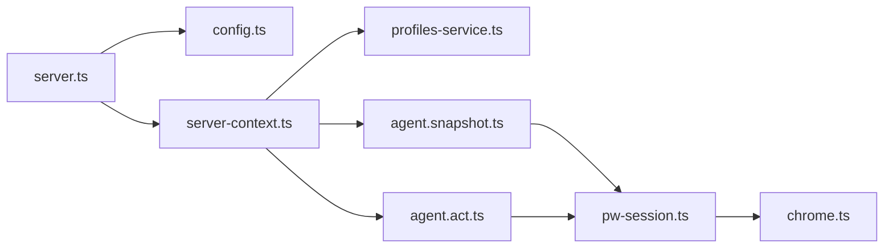

**Diagram sources**
- [src/browser/server.ts](file://src/browser/server.ts#L20-L86)
- [src/browser/config.ts](file://src/browser/config.ts#L212-L319)
- [src/browser/server-context.ts](file://src/browser/server-context.ts#L118-L241)
- [src/browser/routes/agent.snapshot.ts](file://src/browser/routes/agent.snapshot.ts#L88-L343)
- [src/browser/routes/agent.act.ts](file://src/browser/routes/agent.act.ts#L21-L381)
- [src/browser/pw-session.ts](file://src/browser/pw-session.ts#L332-L385)
- [src/browser/chrome.ts](file://src/browser/chrome.ts#L238-L415)

**Section sources**
- [src/browser/server.ts](file://src/browser/server.ts#L20-L86)
- [src/browser/server-context.ts](file://src/browser/server-context.ts#L118-L241)

## Performance Considerations
- Prefer AI snapshots for dense UI understanding; use efficient mode for constrained payloads.
- Use element screenshots sparingly; normalize sizes to reduce bandwidth and storage.
- Limit snapshot maxChars and depth for large pages to keep payloads manageable.
- Avoid excessive waits; combine conditions (URL, load state, selector) to minimize polling.
- Use headless mode for resource-constrained environments; disable GPU acceleration when supported.
- Persist Playwright browsers in containers via environment variables to avoid repeated downloads.

[No sources needed since this section provides general guidance]

## Troubleshooting Guide
Common issues and resolutions:
- Browser disabled or auth failures: Enable browser control and ensure gateway auth is configured; the server aborts startup if auth bootstrap fails and no fallback is present.
- Navigation blocked by SSRF policy: Adjust browser.ssrfPolicy to allowlisted hostnames or disable private network access as appropriate.
- Playwright unavailable: Install the full Playwright package (not playwright-core) and restart the gateway.
- Remote CDP reachability: Increase timeouts and ensure secure endpoints; prefer HTTPS/WSS and short-lived tokens.
- Linux sandbox issues: Set browser.noSandbox: true for containerized or restricted environments.
- Extension relay connectivity: Verify the Chrome extension is loaded and pinned; ensure relay bind host is reachable across namespaces if needed.

**Section sources**
- [src/browser/server.ts](file://src/browser/server.ts#L31-L51)
- [src/browser/navigation-guard.ts](file://src/browser/navigation-guard.ts#L43-L84)
- [docs/tools/browser.md](file://docs/tools/browser.md#L393-L417)
- [docs/tools/browser.md](file://docs/tools/browser.md#L647-L654)

## Conclusion
OpenClaw’s browser automation subsystem provides a deterministic, secure, and extensible interface for agent-driven browser control. By isolating the browser into dedicated profiles, enforcing SSRF policies, and offering both CDP and Playwright capabilities, it supports robust automation workflows across local and remote environments. The documented CLI and API surfaces enable practical tasks such as screenshots, page interaction, form filling, and debugging.

[No sources needed since this section summarizes without analyzing specific files]

## Appendices

### Example Workflows

- Screenshot capture
  - Use the snapshot endpoint to capture a viewport screenshot with overlayed labels, then retrieve the saved media path.
  - Reference: [docs/tools/browser.md](file://docs/tools/browser.md#L522-L531)

- Page interaction
  - Take an AI snapshot, extract a ref, then click or type using the ref-based action endpoints.
  - Reference: [docs/tools/browser.md](file://docs/tools/browser.md#L534-L533)

- Form filling
  - Use the fill action with normalized field descriptors to populate forms programmatically.
  - Reference: [src/browser/routes/agent.act.ts](file://src/browser/routes/agent.act.ts#L187-L208)

- Tab operations
  - List tabs, open a new tab, focus by targetId, and close tabs deterministically.
  - Reference: [src/browser/client.ts](file://src/browser/client.ts#L206-L276)

- Headless operation
  - Configure headless mode in the browser config to run without a visible UI.
  - Reference: [src/browser/chrome.ts](file://src/browser/chrome.ts#L279-L283)

- Security considerations
  - Enforce strict SSRF policy, avoid embedding long-lived tokens, and keep the control server loopback-only.
  - Reference: [docs/tools/browser.md](file://docs/tools/browser.md#L246-L259)

- Remote control
  - Point profiles to hosted CDP endpoints (HTTP or WebSocket) and manage timeouts appropriately.
  - Reference: [docs/tools/browser.md](file://docs/tools/browser.md#L139-L245)