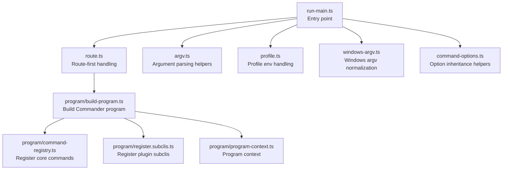
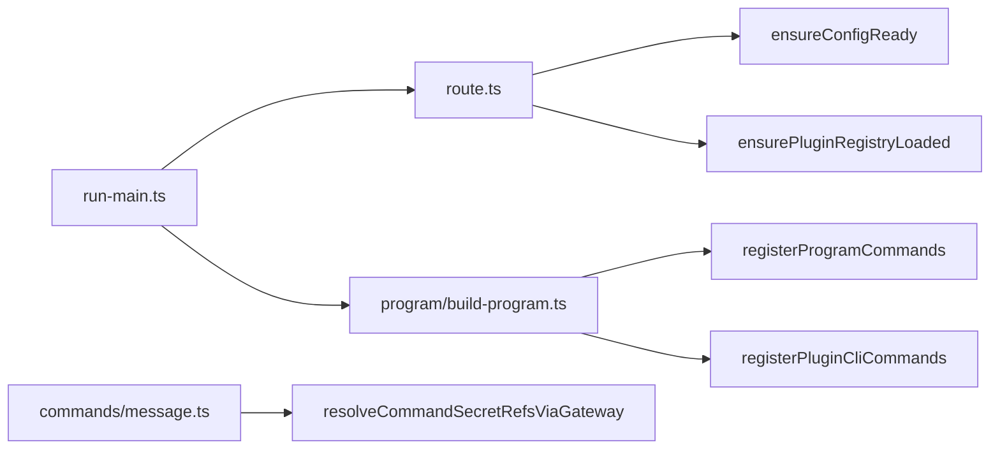

# CLI Interface

<cite>
**Referenced Files in This Document**
- [docs/cli/index.md](file://docs/cli/index.md)
- [src/cli/run-main.ts](file://src/cli/run-main.ts)
- [src/cli/route.ts](file://src/cli/route.ts)
- [src/cli/program/build-program.ts](file://src/cli/program/build-program.ts)
- [src/cli/config-cli.ts](file://src/cli/config-cli.ts)
- [src/cli/channels-cli.ts](file://src/cli/channels-cli.ts)
- [src/commands/message.ts](file://src/commands/message.ts)
- [src/commands/agents.ts](file://src/commands/agents.ts)
- [src/cli/command-options.ts](file://src/cli/command-options.ts)
- [src/cli/argv.ts](file://src/cli/argv.ts)
- [src/cli/profile.ts](file://src/cli/profile.ts)
- [src/cli/windows-argv.ts](file://src/cli/windows-argv.ts)
- [src/cli/program/program-context.ts](file://src/cli/program/program-context.ts)
- [src/cli/program/register.subclis.ts](file://src/cli/program/register.subclis.ts)
- [src/cli/program/command-registry.ts](file://src/cli/program/command-registry.ts)
- [src/cli/daemon-cli.ts](file://src/cli/daemon-cli.ts)
- [src/cli/gateway-cli.ts](file://src/cli/gateway-cli.ts)
- [src/cli/logs-cli.ts](file://src/cli/logs-cli.ts)
- [src/cli/system-cli.ts](file://src/cli/system-cli.ts)
- [src/cli/models-cli.ts](file://src/cli/models-cli.ts)
- [src/cli/memory-cli.ts](file://src/cli/memory-cli.ts)
- [src/cli/directory-cli.ts](file://src/cli/directory-cli.ts)
- [src/cli/nodes-cli.ts](file://src/cli/nodes-cli.ts)
- [src/cli/devices-cli.ts](file://src/cli/devices-cli.ts)
- [src/cli/node-cli.ts](file://src/cli/node-cli.ts)
- [src/cli/approvals-cli.ts](file://src/cli/approvals-cli.ts)
- [src/cli/sandbox-cli.ts](file://src/cli/sandbox-cli.ts)
- [src/cli/tui-cli.ts](file://src/cli/tui-cli.ts)
- [src/cli/browser-cli.ts](file://src/cli/browser-cli.ts)
- [src/cli/cron-cli.ts](file://src/cli/cron-cli.ts)
- [src/cli/dns-cli.ts](file://src/cli/dns-cli.ts)
- [src/cli/docs-cli.ts](file://src/cli/docs-cli.ts)
- [src/cli/hooks-cli.ts](file://src/cli/hooks-cli.ts)
- [src/cli/webhooks-cli.ts](file://src/cli/webhooks-cli.ts)
- [src/cli/pairing-cli.ts](file://src/cli/pairing-cli.ts)
- [src/cli/qr-cli.ts](file://src/cli/qr-cli.ts)
- [src/cli/plugins-cli.ts](file://src/cli/plugins-cli.ts)
- [src/cli/security-cli.ts](file://src/cli/security-cli.ts)
- [src/cli/secrets-cli.ts](file://src/cli/secrets-cli.ts)
- [src/cli/skills-cli.ts](file://src/cli/skills-cli.ts)
- [src/cli/daemon-cli.ts](file://src/cli/daemon-cli.ts)
- [src/cli/clawbot-cli.ts](file://src/cli/clawbot-cli.ts)
- [src/cli/voicecall-cli.ts](file://src/cli/voicecall-cli.ts)
</cite>

## Table of Contents
1. [Introduction](#introduction)
2. [Project Structure](#project-structure)
3. [Core Components](#core-components)
4. [Architecture Overview](#architecture-overview)
5. [Detailed Component Analysis](#detailed-component-analysis)
6. [Dependency Analysis](#dependency-analysis)
7. [Performance Considerations](#performance-considerations)
8. [Troubleshooting Guide](#troubleshooting-guide)
9. [Conclusion](#conclusion)
10. [Appendices](#appendices)

## Introduction
This document provides comprehensive CLI interface documentation for OpenClaw. It covers command syntax, options, usage patterns, configuration, authentication, credentials, troubleshooting, debugging, logging, scripting, automation, integration with other tools, and best practices across environments and deployment scenarios. The CLI is organized around a central program builder, a routing system for built-in and plugin commands, and a robust configuration and secret resolution pipeline.

## Project Structure
The CLI is implemented in TypeScript and organized around a modular command registry and a program builder. The main runtime flow initializes environment, ensures the CLI is on PATH when appropriate, validates the runtime, routes commands, registers plugin commands, and parses arguments.

**Diagram sources**
- [src/cli/run-main.ts](file://src/cli/run-main.ts#L74-L151)
- [src/cli/route.ts](file://src/cli/route.ts#L29-L47)
- [src/cli/program/build-program.ts](file://src/cli/program/build-program.ts#L8-L20)
- [src/cli/program/command-registry.ts](file://src/cli/program/command-registry.ts)
- [src/cli/program/register.subclis.ts](file://src/cli/program/register.subclis.ts)
- [src/cli/program/program-context.ts](file://src/cli/program/program-context.ts)
- [src/cli/argv.ts](file://src/cli/argv.ts)
- [src/cli/profile.ts](file://src/cli/profile.ts)
- [src/cli/windows-argv.ts](file://src/cli/windows-argv.ts)
- [src/cli/command-options.ts](file://src/cli/command-options.ts#L3-L44)

**Section sources**
- [src/cli/run-main.ts](file://src/cli/run-main.ts#L74-L151)
- [src/cli/route.ts](file://src/cli/route.ts#L29-L47)
- [src/cli/program/build-program.ts](file://src/cli/program/build-program.ts#L8-L20)

## Core Components
- Program builder: constructs the Commander program, sets context, help, and registers commands.
- Route-first system: handles special cases (help/version), banner emission, config readiness, and plugin loading before delegation.
- Argument normalization: Windows argv normalization, profile parsing, and update flag rewriting.
- Option inheritance: safely inherits option values from parent commands with bounded depth.
- Global flags: dev isolation, profile switching, color/no-color, update shorthand, version.

**Section sources**
- [src/cli/program/build-program.ts](file://src/cli/program/build-program.ts#L8-L20)
- [src/cli/route.ts](file://src/cli/route.ts#L10-L27)
- [src/cli/run-main.ts](file://src/cli/run-main.ts#L25-L72)
- [src/cli/command-options.ts](file://src/cli/command-options.ts#L20-L44)
- [docs/cli/index.md](file://docs/cli/index.md#L62-L76)

## Architecture Overview
The CLI follows a layered architecture:
- Top-level program with global options and subcommands.
- Built-in commands for setup, onboarding, configuration, messaging, agents, channels, gateway, system, models, memory, nodes, devices, approvals, sandbox, TUI, browser, cron, DNS, docs, hooks, webhooks, pairing, QR, plugins, security, secrets, skills, daemon, clawbot, voicecall, and more.
- Plugin commands registered dynamically; plugin presence can add additional top-level commands.
- Secrets resolution via gateway for sensitive inputs.
- Structured logging and progress indicators for long-running operations.

```mermaid
graph TB
subgraph "CLI Surface"
P["Program<br/>build-program.ts"]
R["Routing<br/>route.ts"]
M["Main Runner<br/>run-main.ts"]
end
subgraph "Core Commands"
CFG["config-cli.ts"]
CH["channels-cli.ts"]
MSG["message.ts"]
AG["agents.ts"]
GW["gateway-cli.ts"]
SYS["system-cli.ts"]
MOD["models-cli.ts"]
MEM["memory-cli.ts"]
DEV["devices-cli.ts"]
NODE["nodes-cli.ts"]
LOG["logs-cli.ts"]
PLUG["plugins-cli.ts"]
SEC["security-cli.ts"]
SECRT["secrets-cli.ts"]
SK["skills-cli.ts"]
SAN["sandbox-cli.ts"]
TUI["tui-cli.ts"]
BR["browser-cli.ts"]
CR["cron-cli.ts"]
DNS["dns-cli.ts"]
DOC["docs-cli.ts"]
HK["hooks-cli.ts"]
WH["webhooks-cli.ts"]
PAIR["pairing-cli.ts"]
QR["qr-cli.ts"]
N["node-cli.ts"]
APP["approvals-cli.ts"]
CL["clawbot-cli.ts"]
VO["voicecall-cli.ts"]
end
subgraph "Infrastructure"
AR["argv.ts"]
PR["profile.ts"]
WIN["windows-argv.ts"]
OPT["command-options.ts"]
REG["program/command-registry.ts"]
SUB["program/register.subclis.ts"]
CTX["program/program-context.ts"]
end
M --> R --> P
P --> REG
P --> SUB
P --> CTX
M --> AR
M --> PR
M --> WIN
M --> OPT
P --> CFG
P --> CH
P --> MSG
P --> AG
P --> GW
P --> SYS
P --> MOD
P --> MEM
P --> DEV
P --> NODE
P --> LOG
P --> PLUG
P --> SEC
P --> SECRT
P --> SK
P --> SAN
P --> TUI
P --> BR
P --> CR
P --> DNS
P --> DOC
P --> HK
P --> WH
P --> PAIR
P --> QR
P --> N
P --> APP
P --> CL
P --> VO
```

**Diagram sources**
- [src/cli/run-main.ts](file://src/cli/run-main.ts#L74-L151)
- [src/cli/route.ts](file://src/cli/route.ts#L29-L47)
- [src/cli/program/build-program.ts](file://src/cli/program/build-program.ts#L8-L20)
- [src/cli/program/command-registry.ts](file://src/cli/program/command-registry.ts)
- [src/cli/program/register.subclis.ts](file://src/cli/program/register.subclis.ts)
- [src/cli/program/program-context.ts](file://src/cli/program/program-context.ts)
- [src/cli/argv.ts](file://src/cli/argv.ts)
- [src/cli/profile.ts](file://src/cli/profile.ts)
- [src/cli/windows-argv.ts](file://src/cli/windows-argv.ts)
- [src/cli/command-options.ts](file://src/cli/command-options.ts#L3-L44)
- [src/cli/config-cli.ts](file://src/cli/config-cli.ts#L395-L476)
- [src/cli/channels-cli.ts](file://src/cli/channels-cli.ts#L70-L256)
- [src/commands/message.ts](file://src/commands/message.ts#L16-L77)
- [src/commands/agents.ts](file://src/commands/agents.ts#L1-L8)
- [src/cli/gateway-cli.ts](file://src/cli/gateway-cli.ts)
- [src/cli/system-cli.ts](file://src/cli/system-cli.ts)
- [src/cli/models-cli.ts](file://src/cli/models-cli.ts)
- [src/cli/memory-cli.ts](file://src/cli/memory-cli.ts)
- [src/cli/devices-cli.ts](file://src/cli/devices-cli.ts)
- [src/cli/nodes-cli.ts](file://src/cli/nodes-cli.ts)
- [src/cli/logs-cli.ts](file://src/cli/logs-cli.ts)
- [src/cli/plugins-cli.ts](file://src/cli/plugins-cli.ts)
- [src/cli/security-cli.ts](file://src/cli/security-cli.ts)
- [src/cli/secrets-cli.ts](file://src/cli/secrets-cli.ts)
- [src/cli/skills-cli.ts](file://src/cli/skills-cli.ts)
- [src/cli/sandbox-cli.ts](file://src/cli/sandbox-cli.ts)
- [src/cli/tui-cli.ts](file://src/cli/tui-cli.ts)
- [src/cli/browser-cli.ts](file://src/cli/browser-cli.ts)
- [src/cli/cron-cli.ts](file://src/cli/cron-cli.ts)
- [src/cli/dns-cli.ts](file://src/cli/dns-cli.ts)
- [src/cli/docs-cli.ts](file://src/cli/docs-cli.ts)
- [src/cli/hooks-cli.ts](file://src/cli/hooks-cli.ts)
- [src/cli/webhooks-cli.ts](file://src/cli/webhooks-cli.ts)
- [src/cli/pairing-cli.ts](file://src/cli/pairing-cli.ts)
- [src/cli/qr-cli.ts](file://src/cli/qr-cli.ts)
- [src/cli/node-cli.ts](file://src/cli/node-cli.ts)
- [src/cli/approvals-cli.ts](file://src/cli/approvals-cli.ts)
- [src/cli/clawbot-cli.ts](file://src/cli/clawbot-cli.ts)
- [src/cli/voicecall-cli.ts](file://src/cli/voicecall-cli.ts)

## Detailed Component Analysis

### Command Reference: Overview and Global Flags
- Global flags include dev isolation, profile switching, color/no-color, update shorthand, and version printing.
- Output styling respects TTY detection, OSC-8 hyperlinks, and JSON/plain modes.
- Color palette is defined for consistent CLI theming.

**Section sources**
- [docs/cli/index.md](file://docs/cli/index.md#L62-L91)

### Command Reference: setup
- Purpose: Initialize config and workspace.
- Options:
  - Workspace path selection.
  - Wizard flags: interactive/non-interactive, mode selection, remote URL/token.
- Behavior: Wizard auto-runs when wizard flags are present.

**Section sources**
- [docs/cli/index.md](file://docs/cli/index.md#L313-L326)

### Command Reference: onboard
- Purpose: Interactive wizard to set up gateway, workspace, and skills.
- Options:
  - Workspace, reset scopes, non-interactive mode.
  - Authentication choices and provider-specific tokens.
  - Gateway configuration (port/bind/auth/token/password), Tailscale options.
  - Daemon runtime selection, skipping components, JSON output.

**Section sources**
- [docs/cli/index.md](file://docs/cli/index.md#L328-L380)

### Command Reference: configure
- Purpose: Interactive configuration wizard (models, channels, skills, gateway).
- Notes: Launches wizard when run without subcommand.

**Section sources**
- [docs/cli/index.md](file://docs/cli/index.md#L382-L384)

### Command Reference: config
- Subcommands:
  - get: Print a config value by dot/bracket path; supports JSON output.
  - set: Set a value with JSON5 parsing; strict JSON mode available; writes to resolved config to avoid leaking defaults.
  - unset: Remove a value by path; writes to resolved config.
  - file: Print active config file path.
  - validate: Validate config against schema; supports JSON output.
- Notes: Path parsing supports dot notation and bracket notation; blocked keys are rejected; array indices validated.

**Section sources**
- [src/cli/config-cli.ts](file://src/cli/config-cli.ts#L279-L308)
- [src/cli/config-cli.ts](file://src/cli/config-cli.ts#L310-L331)
- [src/cli/config-cli.ts](file://src/cli/config-cli.ts#L333-L342)
- [src/cli/config-cli.ts](file://src/cli/config-cli.ts#L344-L393)
- [src/cli/config-cli.ts](file://src/cli/config-cli.ts#L395-L476)

### Command Reference: channels
- Purpose: Manage chat channel accounts (WhatsApp/Telegram/Discord/Google Chat/Slack/Mattermost/Signal/iMessage/MS Teams).
- Subcommands:
  - list: Show configured channels and auth profiles; optional JSON and usage snapshots.
  - status: Check gateway reachability and channel health; optional probe and timeout.
  - capabilities: Show provider capabilities (intents/scopes/features); optional target and timeout.
  - resolve: Resolve channel/user names to IDs; supports kind selection.
  - logs: Show recent channel logs from gateway log file; configurable lines and JSON.
  - add: Add or update channel accounts; supports provider-specific flags (tokens, homeserver, access tokens, etc.).
  - remove: Disable or delete channel accounts; optional deletion without prompt.
  - login/logout: Interactive channel login/logout (e.g., WhatsApp Web).
- Examples: Provided in documentation.

**Section sources**
- [docs/cli/index.md](file://docs/cli/index.md#L413-L468)
- [src/cli/channels-cli.ts](file://src/cli/channels-cli.ts#L70-L256)

### Command Reference: message
- Purpose: Unified outbound messaging and channel actions.
- Actions include send, poll, react/reactions, read/edit/delete, pin/unpin/pins, permissions, search, timeout, kick, ban, thread operations, emoji/sticker management, role/channel/member info, voice status, and events.
- Behavior:
  - Resolves command secret refs via gateway.
  - Supports JSON output and dry-run.
  - Progress spinner for send/poll actions unless JSON or dry-run.

**Section sources**
- [docs/cli/index.md](file://docs/cli/index.md#L531-L553)
- [src/commands/message.ts](file://src/commands/message.ts#L16-L77)

### Command Reference: agent and agents
- agent:
  - Run one agent turn via the Gateway or locally.
  - Options include message text, destination/session, thinking verbosity, channel, local mode, deliver, JSON output, and timeout.
- agents:
  - list: List configured agents; optional JSON and bindings.
  - add: Add a new isolated agent; wizard-driven unless flags supplied; workspace required in non-interactive mode.
  - bindings/list: List routing bindings; optional agent selection.
  - bind/unbind: Add/remove bindings; supports repeatable binding specs.
  - delete: Delete an agent and prune workspace/state; force flag available.

**Section sources**
- [docs/cli/index.md](file://docs/cli/index.md#L554-L640)
- [src/commands/agents.ts](file://src/commands/agents.ts#L1-L8)

### Command Reference: acp
- Purpose: Run the ACP bridge connecting IDEs to the Gateway.
- Options and examples documented separately.

**Section sources**
- [docs/cli/index.md](file://docs/cli/index.md#L641-L645)

### Command Reference: status, health, sessions
- status: Show linked session health and recent recipients; supports JSON, deep diagnostics, usage, timeout, verbose/debug.
- health: Fetch health from the running Gateway; supports JSON, timeout, verbose.
- sessions: List stored conversation sessions; supports JSON, verbose, store path, active minutes.

**Section sources**
- [docs/cli/index.md](file://docs/cli/index.md#L647-L702)

### Command Reference: gateway and daemon
- gateway:
  - Run the WebSocket Gateway with options for port/bind/auth/token/password, Tailscale, dev mode, reset, force, verbosity, Claude CLI logs, WS log level, raw stream, and raw stream path.
  - Service subcommands: status/install/uninstall/start/stop/restart; supports JSON for scripting and deep probing.
- daemon (legacy alias):
  - Same service management as gateway service.

**Section sources**
- [docs/cli/index.md](file://docs/cli/index.md#L739-L789)

### Command Reference: logs
- Tail Gateway file logs via RPC.
- Behavior: Colorized structured view in TTY; plain text fallback; JSON output supported.

**Section sources**
- [docs/cli/index.md](file://docs/cli/index.md#L790-L799)

### Command Reference: system
- Subcommands:
  - event: Event management.
  - heartbeat: last/enable/disable controls.
  - presence: Presence management.

**Section sources**
- [docs/cli/index.md](file://docs/cli/index.md#L173-L175)

### Command Reference: models
- Subcommands:
  - list/status/set/set-image.
  - aliases: list/add/remove.
  - fallbacks: list/add/remove/clear.
  - image-fallbacks: list/add/remove/clear.
  - scan.
  - auth: add/setup-token/paste-token.
  - auth order: get/set/clear.

**Section sources**
- [docs/cli/index.md](file://docs/cli/index.md#L184-L186)

### Command Reference: memory
- Subcommands:
  - status: Show index stats.
  - index: Reindex memory files.
  - search: Semantic search over memory with query flag.

**Section sources**
- [docs/cli/index.md](file://docs/cli/index.md#L293-L299)

### Command Reference: directory
- Purpose: Directory management commands.

**Section sources**
- [docs/cli/index.md](file://docs/cli/index.md#L266-L266)

### Command Reference: nodes and node
- nodes: Node management commands.
- node:
  - run/status/install/uninstall/start/stop/restart.

**Section sources**
- [docs/cli/index.md](file://docs/cli/index.md#L201-L210)

### Command Reference: devices
- Subcommands:
  - list/approve/reject/remove/clear/rotate/revoke.

**Section sources**
- [docs/cli/index.md](file://docs/cli/index.md#L498-L511)

### Command Reference: approvals
- Subcommands:
  - get/set.
  - allowlist: add/remove.

**Section sources**
- [docs/cli/index.md](file://docs/cli/index.md#L211-L214)

### Command Reference: sandbox
- Subcommands:
  - list/recreate/explain.

**Section sources**
- [docs/cli/index.md](file://docs/cli/index.md#L187-L190)

### Command Reference: tui
- Purpose: Terminal User Interface commands.

**Section sources**
- [docs/cli/index.md](file://docs/cli/index.md#L263-L263)

### Command Reference: browser
- Subcommands:
  - status/start/stop/reset-profile/tabs/open/focus/close/profiles/create-profile/delete-profile/screenshot/snapshot/navigate/resize/click/type/press/hover/drag/select/upload/fill/dialog/wait/evaluate/console/pdf.

**Section sources**
- [docs/cli/index.md](file://docs/cli/index.md#L215-L243)

### Command Reference: cron
- Subcommands:
  - status/list/add/edit/rm/enable/disable/runs/run.

**Section sources**
- [docs/cli/index.md](file://docs/cli/index.md#L191-L200)

### Command Reference: dns
- Subcommands:
  - setup: Wide-area discovery DNS helper; supports apply flag.

**Section sources**
- [docs/cli/index.md](file://docs/cli/index.md#L521-L528)

### Command Reference: docs
- Purpose: Documentation commands.

**Section sources**
- [docs/cli/index.md](file://docs/cli/index.md#L260-L260)

### Command Reference: hooks and webhooks
- hooks:
  - list/info/check/enable/disable/install/update.
- webhooks gmail:
  - setup: Requires account; supports project/topic/subscription/label/hook URL/token/push token, bind/port/path, include body/max bytes, renew minutes, Tailscale, and JSON.
  - run: Runtime overrides for the same flags.

**Section sources**
- [docs/cli/index.md](file://docs/cli/index.md#L244-L251)
- [docs/cli/index.md](file://docs/cli/index.md#L512-L519)

### Command Reference: pairing and qr
- pairing:
  - list/approve with optional notify.
- qr:
  - QR code management.

**Section sources**
- [docs/cli/index.md](file://docs/cli/index.md#L488-L497)
- [docs/cli/index.md](file://docs/cli/index.md#L254-L257)

### Command Reference: plugins
- Subcommands:
  - list/info/install/enable/disable/doctor.
- Notes: Most plugin changes require a gateway restart.

**Section sources**
- [docs/cli/index.md](file://docs/cli/index.md#L281-L291)

### Command Reference: skills
- Subcommands:
  - list/info/check; supports eligible, JSON, and verbose flags.

**Section sources**
- [docs/cli/index.md](file://docs/cli/index.md#L470-L486)

### Command Reference: security and secrets
- security:
  - audit: Audit config/local state; supports deep and fix flags.
- secrets:
  - reload: Re-resolve refs and atomically swap runtime snapshot.
  - migrate: Migration helpers.
  - configure: Interactive helper for provider setup and SecretRef mapping.
  - apply: Apply a previously generated plan with dry-run support.

**Section sources**
- [docs/cli/index.md](file://docs/cli/index.md#L268-L280)

### Command Reference: clawbot and voicecall
- clawbot: Legacy alias namespace.
- voicecall: Plugin-specific command (if installed).

**Section sources**
- [docs/cli/index.md](file://docs/cli/index.md#L58-L60)

## Dependency Analysis
- Command inheritance: Option values can be inherited from parent commands up to a bounded depth to reduce duplication.
- Route-first pattern: Special commands (help/version) bypass normal registration; config readiness and plugin loading occur before delegation.
- Plugin integration: Plugin CLI commands are registered after validating configuration and optionally loading the plugin registry.
- Secrets resolution: Message and other commands resolve secret references via the Gateway before execution.

**Diagram sources**
- [src/cli/run-main.ts](file://src/cli/run-main.ts#L94-L145)
- [src/cli/route.ts](file://src/cli/route.ts#L10-L27)
- [src/commands/message.ts](file://src/commands/message.ts#L21-L29)
- [src/cli/program/build-program.ts](file://src/cli/program/build-program.ts#L17-L17)
- [src/cli/program/register.subclis.ts](file://src/cli/program/register.subclis.ts)
- [src/cli/program/command-registry.ts](file://src/cli/program/command-registry.ts)

**Section sources**
- [src/cli/command-options.ts](file://src/cli/command-options.ts#L20-L44)
- [src/cli/run-main.ts](file://src/cli/run-main.ts#L117-L145)
- [src/cli/route.ts](file://src/cli/route.ts#L10-L27)
- [src/commands/message.ts](file://src/commands/message.ts#L21-L29)

## Performance Considerations
- Long-running commands display progress indicators when appropriate (TTY sessions, non-JSON, non-dry-run).
- JSON/plain modes disable styling for efficient machine parsing.
- Memory search managers are closed on CLI teardown to free resources.

**Section sources**
- [src/cli/run-main.ts](file://src/cli/run-main.ts#L16-L23)
- [docs/cli/index.md](file://docs/cli/index.md#L70-L76)

## Troubleshooting Guide
- Doctor: Health checks and quick fixes for config, gateway, and legacy services; supports deep scanning and non-interactive mode.
- Logs: Tail Gateway file logs via RPC; structured view in TTY, plain text fallback; JSON output for machine parsing.
- Channels status: Prints warnings with suggested fixes for common misconfigurations; points to doctor for remediation.
- Security audit: Tightens safe defaults, chmod state/config, and performs best-effort live Gateway probe.
- Secrets audit/reload: Scans for plaintext residues and unresolved refs; re-resolves and swaps runtime snapshot atomically.

**Section sources**
- [docs/cli/index.md](file://docs/cli/index.md#L400-L410)
- [docs/cli/index.md](file://docs/cli/index.md#L790-L799)
- [docs/cli/index.md](file://docs/cli/index.md#L413-L428)
- [docs/cli/index.md](file://docs/cli/index.md#L268-L273)
- [docs/cli/index.md](file://docs/cli/index.md#L274-L280)

## Conclusion
OpenClaw’s CLI provides a comprehensive, extensible command surface with strong configuration, authentication, and secret management. Its route-first architecture, plugin integration, and robust error handling enable reliable automation and scripting across diverse environments. Use the command reference and troubleshooting sections to integrate the CLI into workflows and maintain systems effectively.

## Appendices

### Scripting and Automation Patterns
- Use JSON output (--json) for machine-readable results.
- Combine commands in scripts for provisioning (setup/onboard/config/plugins/channels/models) and monitoring (status/health/logs).
- Leverage cron and webhooks for scheduled tasks and event-driven workflows.
- Employ secrets reload/audit to keep credentials secure and up-to-date.

[No sources needed since this section provides general guidance]

### Integration with Other Tools and Workflows
- Plugins can add additional top-level commands; most plugin changes require a gateway restart.
- Hooks and webhooks integrate with external systems (e.g., Gmail Pub/Sub).
- Browser and TUI commands support headless automation and UI workflows.

**Section sources**
- [docs/cli/index.md](file://docs/cli/index.md#L291-L291)
- [docs/cli/index.md](file://docs/cli/index.md#L512-L519)
- [docs/cli/index.md](file://docs/cli/index.md#L215-L243)
- [docs/cli/index.md](file://docs/cli/index.md#L263-L263)

### Best Practices for CLI Usage
- Use profiles to isolate state and ports for different environments.
- Prefer non-interactive flags for CI/automation.
- Use doctor and security audit regularly to maintain healthy configurations.
- Employ JSON output for tooling integrations and reduce brittle text parsing.

**Section sources**
- [docs/cli/index.md](file://docs/cli/index.md#L62-L68)
- [docs/cli/index.md](file://docs/cli/index.md#L400-L410)
- [docs/cli/index.md](file://docs/cli/index.md#L268-L273)