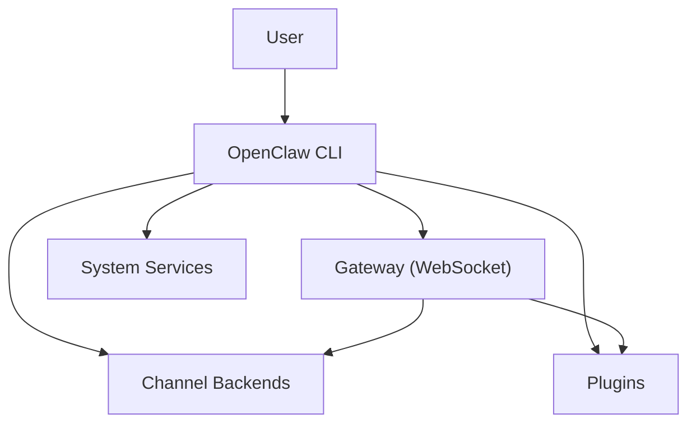
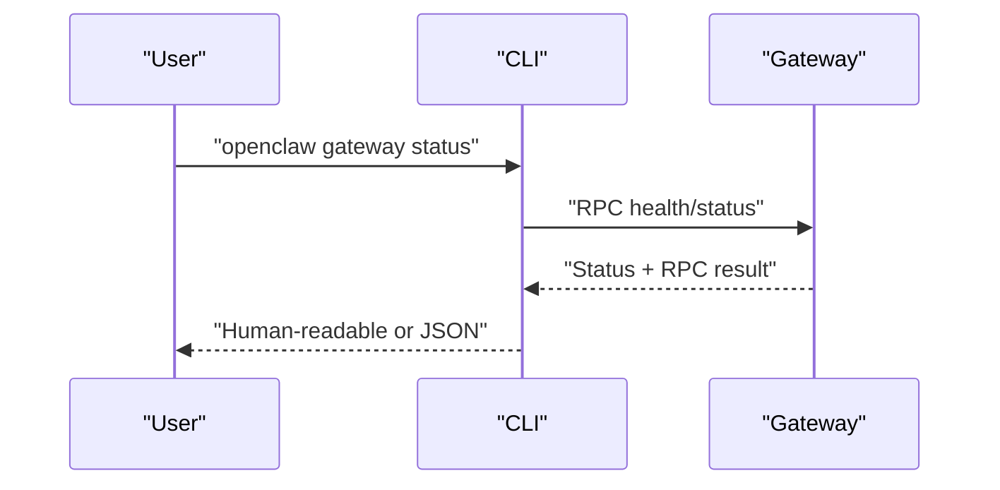
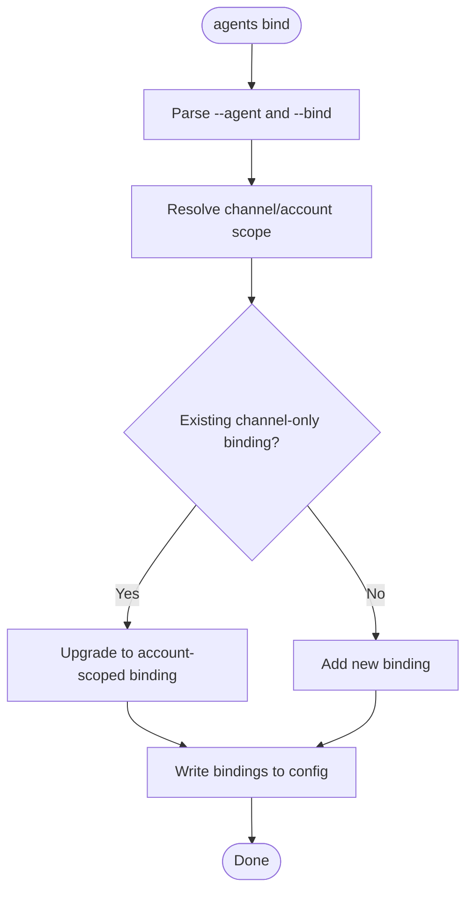
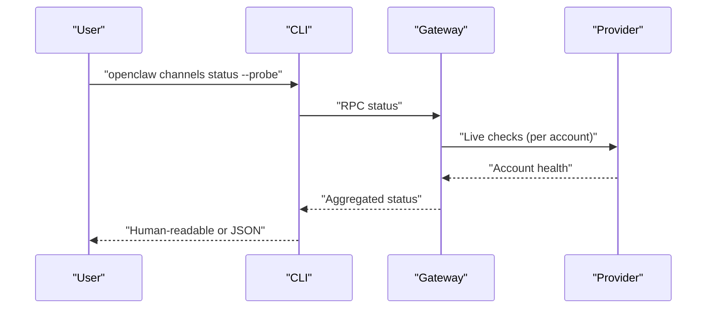
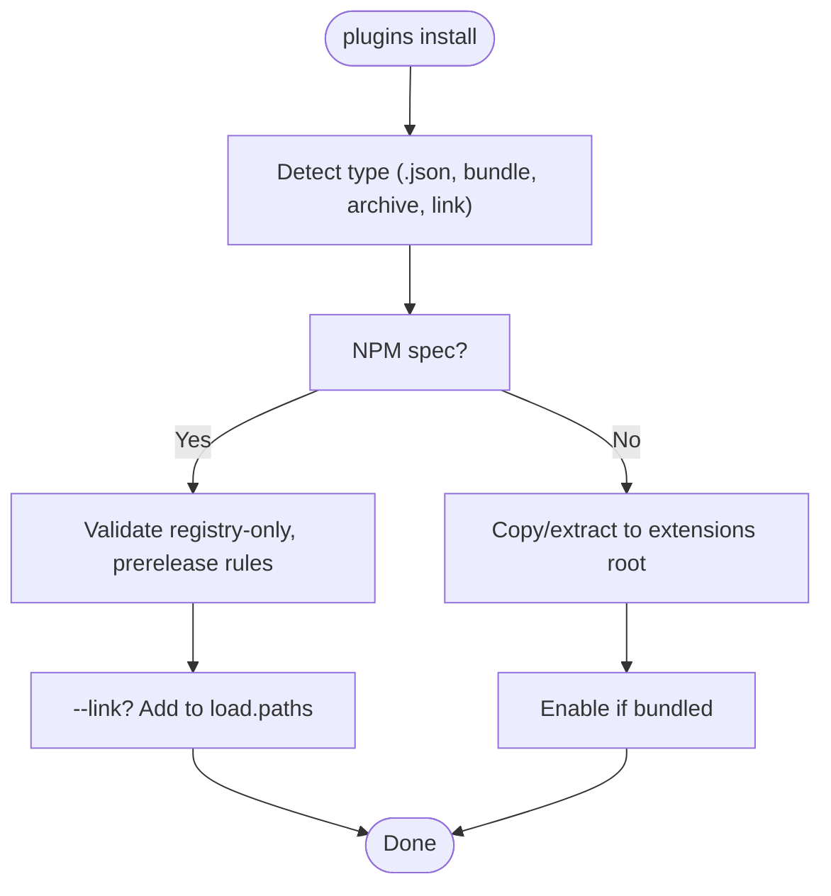
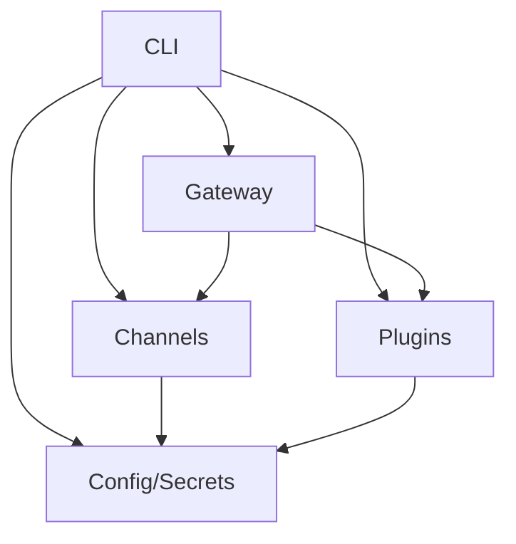

# CLI Interface

<cite>
**Referenced Files in This Document**
- [docs/cli/index.md](file://docs/cli/index.md)
- [docs/cli/gateway.md](file://docs/cli/gateway.md)
- [docs/cli/plugins.md](file://docs/cli/plugins.md)
- [docs/cli/config.md](file://docs/cli/config.md)
- [docs/cli/completion.md](file://docs/cli/completion.md)
- [docs/cli/daemon.md](file://docs/cli/daemon.md)
- [docs/cli/agents.md](file://docs/cli/agents.md)
- [docs/cli/channels.md](file://docs/cli/channels.md)
- [docs/cli/system.md](file://docs/cli/system.md)
- [docs/cli/models.md](file://docs/cli/models.md)
- [docs/cli/memory.md](file://docs/cli/memory.md)
- [docs/cli/doctor.md](file://docs/cli/doctor.md)
- [docs/cli/status.md](file://docs/cli/status.md)
- [docs/cli/health.md](file://docs/cli/health.md)
- [docs/cli/sessions.md](file://docs/cli/sessions.md)
- [docs/cli/reset.md](file://docs/cli/reset.md)
</cite>

## Table of Contents
1. [Introduction](#introduction)
2. [Project Structure](#project-structure)
3. [Core Components](#core-components)
4. [Architecture Overview](#architecture-overview)
5. [Detailed Component Analysis](#detailed-component-analysis)
6. [Dependency Analysis](#dependency-analysis)
7. [Performance Considerations](#performance-considerations)
8. [Troubleshooting Guide](#troubleshooting-guide)
9. [Conclusion](#conclusion)
10. [Appendices](#appendices)

## Introduction
This document provides a comprehensive guide to the OpenClaw command-line interface (CLI). It covers all major command categories including gateway management, agent operations, channel configuration, plugin installation, system administration, configuration management, authentication setup, and daemon control. It explains command syntax, options, parameters, and provides practical examples for both beginners and power users. It also documents shell completion, environment variables, configuration file precedence, and troubleshooting guidance for common CLI issues.

## Project Structure
The CLI is organized around a central command with subcommands grouped by functional area. The top-level command supports global flags and styling options, and many subcommands support JSON output for scripting.

```mermaid
graph TB
Root["openclaw [--dev] [--profile <name>] <command>"]
subgraph "Setup & Onboarding"
Setup["setup"]
Onboard["onboard"]
Configure["configure"]
Config["config"]
end
subgraph "Gateway & Daemon"
Gateway["gateway"]
Daemon["daemon"]
Logs["logs"]
end
subgraph "Agents & Sessions"
Agents["agents"]
Status["status"]
Health["health"]
Sessions["sessions"]
end
subgraph "Channels & Skills"
Channels["channels"]
Skills["skills"]
Pairing["pairing"]
Devices["devices"]
end
subgraph "Plugins & Extensions"
Plugins["plugins"]
Hooks["hooks"]
Webhooks["webhooks.gmail"]
Cron["cron"]
end
subgraph "System & Utilities"
System["system"]
Models["models"]
Memory["memory"]
Directory["directory"]
Nodes["nodes"]
Node["node"]
Browser["browser"]
DNS["dns"]
Docs["docs"]
TUI["tui"]
QR["qr"]
end
Root --> Setup
Root --> Onboard
Root --> Configure
Root --> Config
Root --> Gateway
Root --> Daemon
Root --> Logs
Root --> Agents
Root --> Status
Root --> Health
Root --> Sessions
Root --> Channels
Root --> Skills
Root --> Pairing
Root --> Devices
Root --> Plugins
Root --> Hooks
Root --> Webhooks
Root --> Cron
Root --> System
Root --> Models
Root --> Memory
Root --> Directory
Root --> Nodes
Root --> Node
Root --> Browser
Root --> DNS
Root --> Docs
Root --> TUI
Root --> QR
```

**Diagram sources**
- [docs/cli/index.md:93-264](file://docs/cli/index.md#L93-L264)

**Section sources**
- [docs/cli/index.md:9-1137](file://docs/cli/index.md#L9-L1137)

## Core Components
- Global flags and output styling:
  - Global flags include isolation switches for development and alternate profiles, color control, update shorthands, and version flags.
  - Output styling supports TTY rendering, OSC-8 hyperlinks, and JSON/plain modes for machine readability.
- Command tree and subcommands:
  - The CLI organizes functionality into top-level commands and hierarchical subcommands. Many subcommands support JSON output and deep probing options for diagnostics.

Practical examples (syntax only):
- Basic invocation and help:
  - [docs/cli/index.md:96](file://docs/cli/index.md#L96)
- Global flags:
  - [docs/cli/index.md:62-68](file://docs/cli/index.md#L62-L68)
- Output styling:
  - [docs/cli/index.md:70-76](file://docs/cli/index.md#L70-L76)

**Section sources**
- [docs/cli/index.md:62-92](file://docs/cli/index.md#L62-L92)
- [docs/cli/index.md:93-264](file://docs/cli/index.md#L93-L264)

## Architecture Overview
The CLI orchestrates operations across the Gateway (WebSocket server), channel backends, plugins, and system services. It supports:
- Running and probing the Gateway locally or remotely.
- Managing channel accounts and runtime status.
- Installing and enabling plugins.
- Inspecting and manipulating configuration and secrets.
- Diagnosing system health and session state.
- Controlling daemon/service lifecycle.

```mermaid
graph TB
User["User"]
CLI["OpenClaw CLI"]
GW["Gateway (WebSocket)"]
Ch["Channel Backends"]
Plg["Plugins"]
Sys["System Services"]
User --> CLI
CLI --> GW
CLI --> Ch
CLI --> Plg
CLI --> Sys
GW --> Ch
GW --> Plg
```

[No sources needed since this diagram shows conceptual workflow, not actual code structure]

## Detailed Component Analysis

### Gateway Management
- Purpose:
  - Run, query, and discover Gateways; manage the Gateway service lifecycle.
- Key commands:
  - Run the Gateway locally with optional auth, binding, and logging options.
  - Probe health and status; query RPC endpoints.
  - Discover Gateways via Bonjour.
  - Manage the Gateway service (install/start/stop/restart/uninstall).
- Options and parameters:
  - Port, bind mode, auth mode/token/password, Tailscale exposure, dev/reset/force flags, logging styles, and raw stream capture.
  - Probe options include URL override, token/password, timeout, and require-RPC checks.
  - Service lifecycle supports JSON output and runtime selection.
- Practical examples:
  - Run a local Gateway:
    - [docs/cli/gateway.md:26-34](file://docs/cli/gateway.md#L26-L34)
  - Probe health and status:
    - [docs/cli/gateway.md:85-118](file://docs/cli/gateway.md#L85-L118)
  - Discover Gateways:
    - [docs/cli/gateway.md:219-235](file://docs/cli/gateway.md#L219-L235)
  - Service lifecycle:
    - [docs/cli/gateway.md:180-198](file://docs/cli/gateway.md#L180-L198)

```mermaid
sequenceDiagram
participant U as "User"
participant C as "CLI"
participant G as "Gateway"
U->>C : "openclaw gateway status"
C->>G : "RPC health/status"
G-->>C : "Status + RPC result"
C-->>U : "Human-readable or JSON"
```

**Diagram sources**
- [docs/cli/gateway.md:85-118](file://docs/cli/gateway.md#L85-L118)

**Section sources**
- [docs/cli/gateway.md:22-198](file://docs/cli/gateway.md#L22-L198)

### Agent Operations
- Purpose:
  - Manage isolated agents with distinct workspaces, identities, and routing bindings.
- Key commands:
  - List agents, add agents, delete agents, and manage bindings.
  - Set agent identity from workspace file or explicit fields.
- Options and parameters:
  - Workspace selection, model defaults, binding specifications, and JSON output.
  - Binding scope behavior supports channel-only, account-specific, and wildcard bindings.
- Practical examples:
  - List and add agents:
    - [docs/cli/agents.md:17-28](file://docs/cli/agents.md#L17-L28)
  - Bind and unbind channels:
    - [docs/cli/agents.md:30-73](file://docs/cli/agents.md#L30-L73)
  - Set identity:
    - [docs/cli/agents.md:75-103](file://docs/cli/agents.md#L75-L103)

```mermaid
flowchart TD
Start(["agents bind"]) --> Parse["Parse --agent and --bind"]
Parse --> Resolve["Resolve channel/account scope"]
Resolve --> Upgrade{"Existing channel-only binding?"}
Upgrade --> |Yes| UpgradePath["Upgrade to account-scoped binding"]
Upgrade --> |No| AddNew["Add new binding"]
UpgradePath --> Write["Write bindings to config"]
AddNew --> Write
Write --> End(["Done"])
```

**Diagram sources**
- [docs/cli/agents.md:50-73](file://docs/cli/agents.md#L50-L73)

**Section sources**
- [docs/cli/agents.md:1-124](file://docs/cli/agents.md#L1-L124)

### Channel Configuration
- Purpose:
  - Manage channel accounts, login/logout, status, logs, capabilities, and name resolution.
- Key commands:
  - List accounts, check status, tail logs, add/remove accounts, login/logout, capabilities, and resolve names to IDs.
- Options and parameters:
  - Channel selection, account IDs, display names, log lines, JSON output, and capability/probe targets.
- Practical examples:
  - Add/remove accounts:
    - [docs/cli/channels.md:29-56](file://docs/cli/channels.md#L29-L56)
  - Login/logout:
    - [docs/cli/channels.md:59-64](file://docs/cli/channels.md#L59-L64)
  - Capabilities and resolution:
    - [docs/cli/channels.md:73-102](file://docs/cli/channels.md#L73-L102)

```mermaid
sequenceDiagram
participant U as "User"
participant C as "CLI"
participant G as "Gateway"
participant P as "Provider"
U->>C : "openclaw channels status --probe"
C->>G : "RPC status"
G->>P : "Live checks (per account)"
P-->>G : "Account health"
G-->>C : "Aggregated status"
C-->>U : "Human-readable or JSON"
```

**Diagram sources**
- [docs/cli/channels.md:66-72](file://docs/cli/channels.md#L66-L72)

**Section sources**
- [docs/cli/channels.md:1-103](file://docs/cli/channels.md#L1-L103)

### Plugin Installation and Management
- Purpose:
  - Discover, install, enable/disable, uninstall, update, and diagnose plugin issues.
- Key commands:
  - list, info, install, enable, disable, uninstall, doctor, update.
- Options and parameters:
  - Install from local paths/archives, npm specs, linking directories, and pinning versions.
  - Uninstall with dry-run and keep-files options.
  - Update supports individual and bulk updates with integrity checks.
- Practical examples:
  - Install and enable:
    - [docs/cli/plugins.md:22-31](file://docs/cli/plugins.md#L22-L31)
  - Install from npm with pinning:
    - [docs/cli/plugins.md:46-49](file://docs/cli/plugins.md#L46-L49)
  - Uninstall and update:
    - [docs/cli/plugins.md:91-115](file://docs/cli/plugins.md#L91-L115)

```mermaid
flowchart TD
Start(["plugins install"]) --> Detect["Detect type (.json, bundle, archive, link)"]
Detect --> NPM["NPM spec?"]
NPM --> |Yes| Validate["Validate registry-only, prerelease rules"]
NPM --> |No| Copy["Copy/extract to extensions root"]
Validate --> Link["--link? Add to load.paths"]
Copy --> Enable["Enable if bundled"]
Link --> Done(["Done"])
Enable --> Done
```

**Diagram sources**
- [docs/cli/plugins.md:44-90](file://docs/cli/plugins.md#L44-L90)

**Section sources**
- [docs/cli/plugins.md:1-122](file://docs/cli/plugins.md#L1-L122)

### System Administration
- Purpose:
  - Enqueue system events, control heartbeats, and inspect presence.
- Key commands:
  - system event, system heartbeat (last/enable/disable), system presence.
- Options and parameters:
  - Event text and mode, JSON output, heartbeat control, and presence listing.
- Practical examples:
  - Enqueue event and control heartbeat:
    - [docs/cli/system.md:17-46](file://docs/cli/system.md#L17-L46)
  - Presence inspection:
    - [docs/cli/system.md:48-55](file://docs/cli/system.md#L48-L55)

**Section sources**
- [docs/cli/system.md:1-61](file://docs/cli/system.md#L1-L61)

### Configuration Management
- Purpose:
  - Get/set/unset config values, print active config file, and validate against schema without starting the Gateway.
- Key commands:
  - config get, set, unset, file, validate.
- Options and parameters:
  - Dot/bracket paths, JSON5 parsing, strict JSON flag, and JSON output for validation.
- Practical examples:
  - Get/set/unset and validate:
    - [docs/cli/config.md:14-25](file://docs/cli/config.md#L14-L25)
  - Paths and values:
    - [docs/cli/config.md:27-52](file://docs/cli/config.md#L27-L52)

**Section sources**
- [docs/cli/config.md:1-69](file://docs/cli/config.md#L1-L69)

### Authentication Setup
- Purpose:
  - Manage model provider authentication profiles and tokens.
- Key commands:
  - models auth add, login, setup-token, paste-token.
- Options and parameters:
  - Provider selection, token generation, and paste-based flows.
- Practical examples:
  - Auth flows:
    - [docs/cli/models.md:67-72](file://docs/cli/models.md#L67-L72)

**Section sources**
- [docs/cli/models.md:65-82](file://docs/cli/models.md#L65-L82)

### Daemon Control
- Purpose:
  - Legacy alias for Gateway service management; maps to the same service control surface as gateway service commands.
- Key commands:
  - status, install, uninstall, start, stop, restart.
- Options and parameters:
  - Shared options include URL/token/password overrides, timeouts, and JSON output.
- Practical examples:
  - Service lifecycle:
    - [docs/cli/daemon.md:17-24](file://docs/cli/daemon.md#L17-L24)

**Section sources**
- [docs/cli/daemon.md:1-54](file://docs/cli/daemon.md#L1-L54)

### Semantic Memory
- Purpose:
  - Manage semantic memory indexing and search.
- Key commands:
  - memory status, index, search.
- Options and parameters:
  - Agent scoping, verbose/deep/index flags, query input, max results, min score, JSON output.
- Practical examples:
  - Status/index/search:
    - [docs/cli/memory.md:19-32](file://docs/cli/memory.md#L19-L32)

**Section sources**
- [docs/cli/memory.md:1-67](file://docs/cli/memory.md#L1-L67)

### Diagnostics and Health
- Purpose:
  - Comprehensive health checks, guided repairs, and usage snapshots.
- Key commands:
  - doctor, status, health.
- Options and parameters:
  - Deep scans, repair/fix, JSON output, usage snapshots, and per-account timings.
- Practical examples:
  - Doctor and status:
    - [docs/cli/doctor.md:18-24](file://docs/cli/doctor.md#L18-L24)
    - [docs/cli/status.md:13-18](file://docs/cli/status.md#L13-L18)
  - Health:
    - [docs/cli/health.md:12-16](file://docs/cli/health.md#L12-L16)

**Section sources**
- [docs/cli/doctor.md:1-47](file://docs/cli/doctor.md#L1-L47)
- [docs/cli/status.md:1-30](file://docs/cli/status.md#L1-L30)
- [docs/cli/health.md:1-22](file://docs/cli/health.md#L1-L22)

### Sessions
- Purpose:
  - List stored conversation sessions and perform cleanup maintenance.
- Key commands:
  - sessions, sessions cleanup.
- Options and parameters:
  - Agent scoping, all-agents, store path, JSON output, dry-run/enforce, active key protection.
- Practical examples:
  - List sessions and cleanup:
    - [docs/cli/sessions.md:12-18](file://docs/cli/sessions.md#L12-L18)
    - [docs/cli/sessions.md:54-78](file://docs/cli/sessions.md#L54-L78)

**Section sources**
- [docs/cli/sessions.md:1-111](file://docs/cli/sessions.md#L1-L111)

### Reset and Uninstall
- Purpose:
  - Reset local config/state while keeping the CLI installed, and uninstall the Gateway service plus local data.
- Key commands:
  - reset, uninstall.
- Options and parameters:
  - Scope selection, yes/non-interactive flags, dry-run, and selective removal of service/state/workspace/app.
- Practical examples:
  - Reset:
    - [docs/cli/reset.md:13-18](file://docs/cli/reset.md#L13-L18)

**Section sources**
- [docs/cli/reset.md:1-21](file://docs/cli/reset.md#L1-L21)

### Shell Completion
- Purpose:
  - Generate and install shell completion scripts for zsh/bash/fish/PowerShell.
- Key commands:
  - completion.
- Options and parameters:
  - Shell target, install flag, write-state to state directory, and yes flag to skip prompts.
- Practical examples:
  - Completion usage:
    - [docs/cli/completion.md:15-22](file://docs/cli/completion.md#L15-L22)

**Section sources**
- [docs/cli/completion.md:1-36](file://docs/cli/completion.md#L1-L36)

## Dependency Analysis
- Command interdependencies:
  - Many commands rely on a reachable Gateway (RPC) for live probes and status reporting.
  - Plugins extend functionality and may require a Gateway restart to take effect.
  - Channel operations depend on provider credentials and SecretRef resolution.
- Coupling and cohesion:
  - The CLI maintains high cohesion within functional areas (gateway, channels, agents, plugins).
  - Coupling is primarily through RPC calls to the Gateway and filesystem state under the OpenClaw state directory.

```mermaid
graph TB
CLI["CLI"]
GW["Gateway"]
CH["Channels"]
PL["Plugins"]
CFG["Config/Secrets"]
CLI --> GW
CLI --> CH
CLI --> PL
CLI --> CFG
GW --> CH
GW --> PL
CH --> CFG
PL --> CFG
```

[No sources needed since this diagram shows conceptual relationships, not specific code structure]

## Performance Considerations
- Use JSON output for machine-readable pipelines to reduce parsing overhead.
- Limit deep probes and concurrency where appropriate to avoid rate limits and excessive resource usage.
- Prefer targeted commands (e.g., specify agent/channel scopes) to minimize unnecessary work.

[No sources needed since this section provides general guidance]

## Troubleshooting Guide
- Gateway connectivity and auth:
  - Use gateway status with require-RPC to ensure the RPC endpoint is reachable.
  - Probe with explicit URL/token/password when config/env credentials are unavailable.
- Channel health:
  - Run channels status with probe and doctor for guided fixes.
  - Use channels logs to inspect recent channel logs from the Gateway log file.
- Secrets and configuration:
  - Use doctor for guided repairs and security audits.
  - Use config validate to check schema compliance without starting the Gateway.
- Plugins:
  - Use plugins doctor to diagnose load failures.
  - Reinstall or update plugins with integrity checks and pinning for stability.
- Sessions:
  - Use sessions cleanup to prune old entries and reclaim space.
- Environment and profiles:
  - Isolate state with --dev or --profile to avoid conflicts.
  - Disable ANSI colors with --no-color or NO_COLOR=1 for non-TTY environments.

**Section sources**
- [docs/cli/gateway.md:64-118](file://docs/cli/gateway.md#L64-L118)
- [docs/cli/channels.md:66-72](file://docs/cli/channels.md#L66-L72)
- [docs/cli/doctor.md:26-35](file://docs/cli/doctor.md#L26-L35)
- [docs/cli/plugins.md:28-31](file://docs/cli/plugins.md#L28-L31)
- [docs/cli/sessions.md:54-78](file://docs/cli/sessions.md#L54-L78)

## Conclusion
The OpenClaw CLI provides a comprehensive toolkit for managing Gateways, agents, channels, plugins, and system services. With global flags, JSON output, and deep diagnostic capabilities, it supports both interactive workflows and automated pipelines. Use the examples and guidance here to streamline daily operations, troubleshoot issues, and maintain a secure and efficient OpenClaw environment.

[No sources needed since this section summarizes without analyzing specific files]

## Appendices

### Command Syntax Quick Reference
- Global flags:
  - [--dev], [--profile <name>], [--no-color], [--update], [-V|--version|-v]
- Output styling:
  - [--json], [--plain], [--no-color], NO_COLOR=1
- Command tree overview:
  - [docs/cli/index.md:93-264](file://docs/cli/index.md#L93-L264)

**Section sources**
- [docs/cli/index.md:62-92](file://docs/cli/index.md#L62-L92)
- [docs/cli/index.md:93-264](file://docs/cli/index.md#L93-L264)